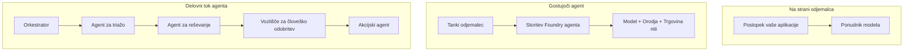
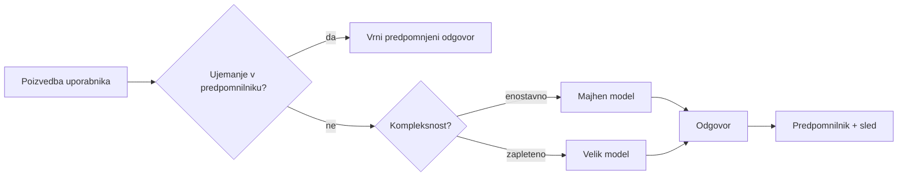
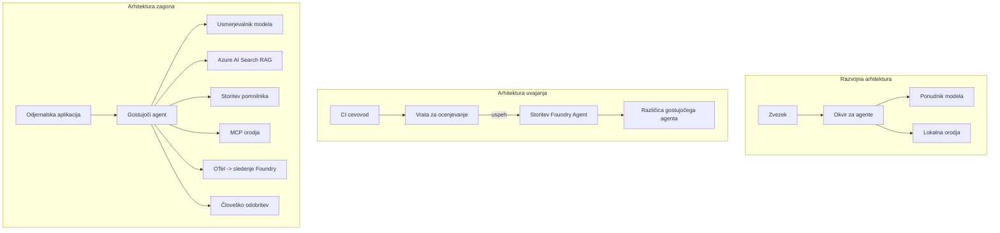

# Namenitev skalabilnih agentov z Microsoft Foundry


Do tega trenutka v tečaju ste ustvarili agente, ki tečejo na vašem prenosniku, znotraj zvezka, ki jih poganja `az login` in nekaj okoljskih spremenljivk. To je natanko pravi način za učenje. Ni pa pravi način za upravljanje z agentom, od katerega je odvisnih na tisoče strank ob 3. uri zjutraj.

Ta lekcija govori o razliki med "deluje na mojem računalniku" in "deluje zanesljivo in ugodno v produkciji." To razliko premostimo z uporabo **Microsoft Foundry** in **Microsoft Foundry Agent Service**, in to naredimo tako, da ustvarimo pravega agenta za podporo strankam, ki ima orodja, iskanje, spomin, ocenjevanje in nadzor.

## Uvod

Ta lekcija bo pokrila:

- Razliko med **prototipnim agentom** in **ustanovljenim agentom** ter zakaj je prehod večinoma povezan z vsem *okoli* modela.
- **Vzorci nameščanja** za agente: gostovanje na odjemalcu, gostovanje kot storitev (Hosted Agents) in orkestracija delovnih tokov.
- **Cikel življenja agenta** na Microsoft Foundry — ustvarjanje, različica, namestitev, ocenjevanje, nadzor, upokojitev.
- **Strategije skaliranja**: usmerjanje modelov, predpomnjenje, sočasnost in brezstanje zasnova.
- **Opazovanje** z OpenTelemetry in sledenjem v Foundry.
- **Optimizacija stroškov** preko izbire modela, usmerjanja in ocenjevalnih vrat.
- **Podjetniške premisleke**: upravljanje, človeško odobritev in varno izvajanje MCP strežnikov v produkciji.

## Cilji učenja

Po zaključku te lekcije boste znali:

- Izbrati pravi vzorec nameščanja za dano obremenitev agenta.
- Namestiti agenta v Microsoft Foundry Agent Service, da je verzioniran, upravljan in opazovan.
- Instrumentirati agenta za sledenje in povezati ocenjevalno cevovod, ki teče pred vsakim izidom.
- Uporabiti usmerjanje modelov in predpomnjenje za nadzor latence in stroškov ob skaliranju.
- Dodati vratca za človeško odobritev pri visokorizičnih dejanjih ter varno integrirati MCP strežnik v produkcijo.

## Predpogoji

Ta lekcija predvideva, da ste opravili prejšnje lekcije in ste vešči:

- Graditi agente z uporabo [Microsoft Agent Framework](../14-microsoft-agent-framework/README.md) (Lekcija 14).
- [Uporaba orodij](../04-tool-use/README.md) (Lekcija 4) in [Agentic RAG](../05-agentic-rag/README.md) (Lekcija 5).
- [Spomin agenta](../13-agent-memory/README.md) (Lekcija 13) in [Agentic protokoli / MCP](../11-agentic-protocols/README.md) (Lekcija 11).
- [Opazovanje in ocenjevanje](../10-ai-agents-production/README.md) (Lekcija 10) — ta lekcija neposredno gradi na tem.

Prav tako boste potrebovali:

- **Azure naročnino** in **Microsoft Foundry projekt** z vsaj enim nameščenim klepetalnim modelom.
- **Azure CLI**, ki je prijavljen (`az login`).
- Python 3.12+ in pakete iz repozitorija [`requirements.txt`](../../../requirements.txt).

## Od prototipa do produkcije: Kaj se dejansko spremeni

Prototipni agent in produkcijski agent delita isti osnovni cikel — razmišljanje, klic orodij, odgovor. Spremeni se vse okoli tega cikla. Model je morda 20 % produkcijskega agenta; ostalih 80 % je operativni okvir.

| Vidik | Prototip | Produkcija |
| --- | --- | --- |
| **Gostovanje** | Teče v vašem zvezku | Teče kot gostovana storitev, verzionirana in razširjena |
| **Identiteta** | Vaš `az login` žeton | Upravljana identiteta z omejenim RBAC |
| **Stanje** | V pomnilniku, izgubljeno po ponovnem zagonu | Zunanje shranjeno (shranjevalnik niti, spominska storitev) |
| **Napake** | Vidite sled napake | Poskusi znova, rezervne možnosti, mrtve črke, opozorila |
| **Stroški** | "Je nekaj centov" | Spremljano na zahtevo, usmerjeno, predpomnjeno, proračunirano |
| **Kakovost** | Ocenjujete rezultate vizualno | Samodejno ocenjevano pred vsakim izidom |
| **Zaupanje** | Odobritev vsakega dejanja | Politike + človek v zanki za tvegana dejanja |

Zapomnite si to tabelo. Vsak razdelek spodaj ustreza enemu od teh vrstic.

## Vzorci nameščanja agentov

Obstajajo trije vzorci, ki jih boste uporabljali, pogosto v kombinaciji.

### 1. Agenti gostovani na odjemalcu

Objekt agenta živi znotraj *vašega* aplikacijskega procesa. Vaša koda neposredno kliče ponudnika modela; cikel razmišljanja teče v vaši storitvi. To je tisto, kar smo počeli v vseh prejšnjih lekcijah.

- **Uporabite, ko** potrebujete popoln nadzor nad ciklom, prilagojena vmesna programska oprema ali vgrajujete agenta v obstoječi backend.
- **Kompromis**: sami skrbite za skaliranje, stanje in odpornost.

### 2. Gostovani agenti (Foundry Agent Service)

Agent je *registriran kot vir* v Microsoft Foundry. Foundry gosti cikel razmišljanja, shranjuje niti, uveljavlja varnost vsebine in RBAC ter naredi agenta vidnega v portal Foundry. Vaša aplikacija postane tanek odjemalec, ki ustvarja niti in bere odgovore.

- **Uporabite, ko** želite vzdržljivost, vgrajeno opazovanje, upravljanje in manjšo operativno površino.
- **Kompromis**: manj nizkonivojskega nadzora v zameno za obvladano izvajanje.

### 3. Delovni tokovi agentov

Več agentov (in orodij) je sestavljenih v graf z eksplicitnim kontrolnim tokom — zaporedni koraki, vejitev, človeška odobritev in vzdržljivi kontrolni mejniki, ki lahko ustavijo in nadaljujejo postopek. To je zmožnost Microsoft Agent Framework **Workflows**, uporabljena pri skali nameščanja.

- **Uporabite, ko** en sam opravek zajema več specializiranih agentov ali zahteva korak odobritve vmes.
- **Kompromis**: več gibljivih delov; potrebuje opazovanje na ravni orkestracije.



## Cikel življenja agenta na Microsoft Foundry

Namestitev agenta ni enkraten `push`. Je zanka, ki je zelo podobna cikelu izdaj programske opreme, ker je natanko to.


Ključna ideja, prenesena iz [Lekcije 10](../10-ai-agents-production/README.md): **offline ocenjevanje je prehod, ne pa le dodatek.** Nova različica agenta ne izide, če ne prestane vaših ocenjevalnih pragov. Online opazovanje nato vrača resnične napake nazaj v vaš offline testni nabor. To je celoten cikel.

## Strategije skaliranja

Skaliranje agenta je drugačno od skaliranja stateless spletnega API-ja, ker vsak zahtevek lahko sproži več dragih klicev modelov in orodij. Štiri tehnike prevzamejo največ bremena.

**Brezstanje obdelava zahtev.** Ne hranite nobenega stanja uporabnika v pomnilniku procesa. Shranjujte niti pogovora v Foundry shranjevalniku niti ali v spominski storitvi, da lahko katera koli instanca obdeluje katerikoli zahtevek. To omogoča horizontalno skaliranje — dodajate instance, brez lepljivih sej.

**Usmerjanje modelov.** Ne zahteva vsak zahtevek vašega najzmogljivejšega (in najdražjega) modela. Pošljite preproste zahtevke — klasifikacijo namena, kratke dejanske odgovore — na majhen, hiter model, in rezervirajte velik model za resno razmišljanje. Foundryjev **Model Router** to lahko naredi za vas, ali pa lahko sami izvedete lahkega klasifikatorja. DIY različico boste naredili v laboratoriju.

**Predpomnjenje odzivov.** Mnoge podporne poizvedbe so skoraj podvojene ("kako ponastavim geslo?"). Predpomnite odgovore na pogosta vprašanja in jih postrezite brez klica modela. Tudi zmeren odstotek zadetkov predpomnilnika pomeni znatno znižanje stroškov in latence.

**Sočasnost in povratni pritisk.** Ponudniki modela imajo omejitve hitrosti. Omejite svojo sočasnost, uporabite ponovne poskuse z eksponentnim omejitvenim časom in odpovejte se elegantno (vrstni odgovor "ukvarjamo se s tem" je boljši kot 500 napaka).



## Opazovanje v produkciji

Ne morete upravljati, česar ne morete videti. Kot je prikazano v Lekciji 10, Microsoft Agent Framework izvaja **OpenTelemetry** sledilne sledi naravno — vsak klic modela, izvedba orodja in korak orkestracije postane obseg. V produkciji te obsege izvozite v Microsoft Foundry (ali kateri koli OTel združljiv hrbtni sistem), da lahko:

- Sledite eni sami pritožbi stranke od začetka do konca skozi vsak klic modela in orodja.
- Spremljate p50/p95 latenco in stroške na zahtevo skozi čas.
- Opozorite na vrhove napak in stroškovne anomalije, še preden jih opazijo vaši uporabniki (ali finančna ekipa).

```python
from agent_framework.observability import get_tracer

tracer = get_tracer()

with tracer.start_as_current_span("support_request") as span:
    span.set_attribute("customer.tier", "enterprise")
    span.set_attribute("routed.model", "gpt-5-nano")
    # izvajanje agenta je samodejno sledeno znotraj tega območja
```

Atributi kot `customer.tier` in `routed.model` spreminjajo zid sledi v vprašanja, na katera je mogoče odgovoriti ("ali so poslovne stranke prepogosto usmerjene na majhen model?").

## Optimizacija stroškov

Stroške v produkcijskih agentih najbolj določajo tokeni. Tri ročice po vplivu:

1. **Pravilna velikost modela.** Majhen model, ki prestane vaša ocenjevalna vrata, je skoraj vedno cenejši od velikega, ki prav tako prestane. Uporabite ocenjevanje, da *dokažete*, da je majhen model dovolj dober in ne izbirajte največjega iz previdnosti.
2. **Usmerjanje po kompleksnosti.** Kot zgoraj — plačajte ceno velikih modelov le za zahtevke, ki potrebujejo veliko modeliranje.
3. **Intenzivno predpomnjenje.** Najcenejši klic modela je tisti, ki ga nikoli ne naredite.

Ocenjevalna vrata in nadzor stroškov so ista disciplina, gledana iz dveh zornih kotov: ocenjevanje določa *kakovostno spodnjo mejo*, usmerjanje in predpomnjenje pa zagotavljata, da stroški ostanejo čim bližje tej meji.

## Podjetniški premisleki pri namestitvi

**Upravljanje.** Gostovani agenti dedujejo Foundryjev RBAC, varnost vsebine in revizijske zapise. Vsakemu agentu dodelite upravljano identiteto z najmanj privilegiji, ki jih potrebuje — samo za branje baze znanja, omejen dostop do API-ja za izdajo tiketov, nič več.

**Človek v zanki.** Nekatera dejanja so preveč pomembna, da bi jih avtomatizirali — izdaja vračila, brisanje računa, eskalacija pravni ekipi. Microsoft Agent Framework podpira orodja, ki zahtevajo **odobritev**: agent predlaga dejanje, izvedba se ustavi, človek odobri ali zavrne, potem pa se delovni tok nadaljuje. Ta primitiv ste videli v [Lekciji 6](../06-building-trustworthy-agents/README.md); tukaj ga namestite.

**MCP v produkciji.** [MCP](../11-agentic-protocols/README.md) omogoča vašemu agentu uporabo zunanjih orodij preko standardnega vmesnika. V produkciji obravnavajte vsak MCP strežnik kot ne-zaupanja vredno mejo: določite različico strežnika, zaženite ga z omejeno identiteto, preverite njegove izhode in mu nikoli ne razkrijte skrivnosti. MCP strežnik je odvisnost, odvisnosti pa se popravljajo, pregledujejo in omejujejo.



Ti trije diagrami — razvoj, namestitev, izvajanje — prikazujejo istega agenta v treh fazah njegovega življenja. Laboratorij, ki sledi, vas vodi skozi njegovo izdelavo.

## Praktični laboratorij: Agent podpore strankam, pripravljen za produkcijo

Odprite [`code_samples/16-python-agent-framework.ipynb`](./code_samples/16-python-agent-framework.ipynb) in ga prehodite od začetka do konca. Sestavili boste **agenta podpore strankam Contoso** z vsemi produkcijskimi premisleki:

1. **Klic orodij** — preveri stanje naročila in odpre podporne tikete.
2. **RAG** — odgovori na vprašanja o pravilnikih iz baze znanja (Azure AI Search, z rezervo v pomnilniku, da zvezek teče brez Search vira).
3. **Spomin** — zapomni si stranko skozi več izmenjav pogovora.
4. **Usmerjanje modela** — klasifikator kompleksnosti usmerja vsak zahtevek na majhen ali velik model.
5. **Predpomnjenje odzivov** — ponovljena vprašanja se postrežejo iz predpomnilnika.
6. **Človeška odobritev** — vračila nad mejnim zneskom ustavijo postopek za podpis človeka.
7. **Ocenjevalna cevovod** — majhen offline testni nabor ocenjuje agenta in deluje kot vrata za izdajo.
8. **Opazovanje** — OpenTelemetry sledenje okoli vsake zahteve.

### Vodenje skozi postopek

Zvezek je organiziran tako, da je vsak produkcijski premislek samostojen, izvedljiv razdelek. Srce je obdelovalec zahtev z usmerjanjem in predpomnjenjem:

```python
async def handle_support_request(query: str, customer_id: str) -> str:
    # 1. Postrezi iz predpomnilnika, kadar je mogoče.
    cached = response_cache.get(normalize(query))
    if cached:
        return cached

    # 2. Usmeri glede na kompleksnost za nadzor stroškov.
    model = "gpt-5-nano" if is_simple(query) else "gpt-5-mini"

    # 3. Zaženite agent znotraj razpona sledenja za opaznost.
    with tracer.start_as_current_span("support_request") as span:
        span.set_attribute("routed.model", model)
        span.set_attribute("customer.id", customer_id)
        response = await support_agent.run(query, model=model)

    # 4. Predpomni in vrni.
    response_cache.set(normalize(query), response.text)
    return response.text
```

Ocenjevalna vrata, ki varujejo izdajo, izgledajo takole:

```python
async def evaluation_gate(agent, test_cases, threshold: float = 0.8) -> bool:
    passed = 0
    for case in test_cases:
        result = await agent.run(case["input"])
        if score_response(result.text, case["expected"]) >= 0.8:
            passed += 1
    pass_rate = passed / len(test_cases)
    print(f"Evaluation pass rate: {pass_rate:.0%} (gate: {threshold:.0%})")
    return pass_rate >= threshold  # namesti samo, če vrata prestanejo test
```

Preberite vsako vrstico — zvezek zavestno ohranja primitivne dele majhne, da ni nič skrito za klicem ogrodja.

## Validacija nameščenega agenta s testi dima

Ocenjevalna vrata zgoraj tečejo *offline* proti vašemu objektu agenta. Ko je agent nameščen kot Gostovani agent, potrebujete še en, še cenejši pregled: **ali nameščena točka dejansko odgovarja?**

Namestitev "uspešno" dokazuje le, da je kontrolna plošča sprejela definicijo — ne dokazuje, da agent odgovarja. Manjkajoča odvisnost, napačno usmerjanje modela ali potekla povezava lahko pustijo zeleno namestitev, ki ne vrača ničesar. **Test dima** to ujame v nekaj sekundah, ob vsakem nameščanju, brez stroškov polnega ocenjevanja.

Ta repozitorij vsebuje pripravljen cevovod testov dima, zgrajen na osnovi [AI Smoke Test](https://github.com/marketplace/actions/ai-smoke-test) GitHub akcije:

- **Katalog** — [`tests/lesson-16-smoke-tests.json`](../../../tests/lesson-16-smoke-tests.json) vsebuje pozive in trditve za agenta podpore Contoso (preverjeni odgovori na pravilnike, iskanje naročila, ostajanje na temi, večtura kontinuiteta niti). Katalogi za agente drugih lekcij so zraven — glej [`tests/README.md`](../tests/README.md).
- **Delovni tok** — [`.github/workflows/smoke-test.yml`](../../../.github/workflows/smoke-test.yml) prijavi z Azure OIDC in pošlje vsak povzetek na agentov Responses endpoint, neuspeh naloge ob versusem napačnem odgovoru.

```yaml
- name: Smoke-test hosted agent
  uses: JFolberth/ai-smoketest@v1
  with:
    project_endpoint: ${{ inputs.project_endpoint }}
    agent_name: ContosoSupportAgent
    tests_file: tests/lesson-16-smoke-tests.json
```


Zaženite ga z zavihka **Actions** (Dejanja), ko je vaš agent nameščen, in vnesite vaš Foundry projektni konektor ter ime agenta. Federirana identiteta potrebuje vlogo **Azure AI User** na obsegu Foundry projekta. Razmišljajte o plasteh kot o piramidi: dimni testi (dostopen in odziven?) se izvedejo ob vsakem nameščanju, ocenjevanje brez povezave (dovolj dobro za dostavo?) se izvaja pred promocijo, in ocenjevanje v živo (kako se obnese v praksi?) poteka neprekinjeno.

## Preverjanje znanja

Preizkusite svoje razumevanje, preden nadaljujete z nalogo.

**1. Približno koliko produkcijskega agenta je "model" in kaj je preostanek?**

<details>
<summary>Odgovor</summary>

Model je manjšina sistema — pogosto se navaja okoli 20 %. Preostanek je operativni okvir: gostovanje in verzioniranje, identiteta in RBAC, zunanji state, upravljanje z napakami, spremljanje stroškov, evalvacija in nadzor s človeško vpletenostjo. Prehod v produkcijo je večinoma zgradba vsega *okoli* zanke sklepanja.
</details>

**2. Kdaj bi izbrali gostovanega agenta namesto agenta, ki teče na odjemalcu?**

<details>
<summary>Odgovor</summary>

Ko želite upravljano runtime okolje z vgrajeno vzdržljivostjo (nitmi, ki vztrajajo in se lahko nadaljujejo), opaznostjo, varnostjo vsebine in RBAC, ter ste pripravljeni zamenjati nekaj nizkonivojskega nadzora z manjšo operativno površino. Gostovanje na odjemalcu je boljše, ko potrebujete popoln nadzor nad zanko ali ko vgrajujete agenta v obstoječo backend infrastrukturo.
</details>

**3. Zakaj mora biti skalabilen agent brez stanja v svojem procesnem pomnilniku?**

<details>
<summary>Odgovor</summary>

Tako lahko katerakoli instanca obravnava katerikoli zahtevek, kar omogoča horizontalno skaliranje brez lepljivih sej. Stanje pogovora na uporabnika je zunanje shranjeno v trgovino niti ali spominsko storitev. Če bi bilo stanje v procesnem pomnilniku, bi ga ob ponovnem zagonu izgubili in ne bi mogli prosto razporejati bremena.
</details>

**4. Kakšen problem rešuje usmerjanje modela in kako je povezano z evalvacijo?**

<details>
<summary>Odgovor</summary>

Usmerjanje pošilja preproste zahteve majhnemu, poceni in hitremu modelu ter rezervira velik model za resnično sklepanje, s čimer nadzoruje latenco in stroške. Povezano je z evalvacijo, ker ta *dokazuje*, da je mali model dovolj dober za določen razred zahtev — usmerjanje brez evalvacije je ugibanje.
</details>

**5. Kaj je "evalvacijski prehod" in kje se nahaja v življenjskem ciklu?**

<details>
<summary>Odgovor</summary>

Evalvacijski prehod izvaja niz offline testov nove različice agenta in preprečuje namestitev, če stopnja uspeha ne preseže praga. Nahaja se med "verzijo" in "namestitvijo" v življenjskem ciklu, kar naredi kakovost pogoj za izdajo, ne nekaj, kar preverjate po dostavi.
</details>

**6. Zakaj je treba MCP strežnik v produkciji obravnavati kot nezaupljivo mejo?**

<details>
<summary>Odgovor</summary>

Ker gre za zunanjo odvisnost, na katero se vaš agent povezuje. Njegovo različico morate fiksirati, ga zagnati z omejeno identiteto, preverjati njegove izhode, omejevati stopnjo klicev in mu nikoli ne razkrivati skrivnosti — enako disciplino, kot jo uporabljate za katerokoli tretjo stran. Njegovi izhodi vstopajo v sklepanje vašega agenta, zato je nepreverjeno zaupanje varnostno tveganje.
</details>

**7. Katera posamezna sprememba običajno najbolj vpliva na stroške produkcijskega agenta in zakaj?**

<details>
<summary>Odgovor</summary>

Pravilna velikost modela — uporaba najmanjšega modela, ki še vedno prestane vaš evalvacijski prehod. Stroške predvsem določajo tokeni, in manjši model, ki dosega kakovostni standard, je skoraj vedno cenejši kot večji. Predpomnjenje in usmerjanje nato še znižata stroške, vendar izbira pravilnega osnovnega modela ima največji začetni učinek.
</details>

**8. Kakšno vlogo imajo atribute transakcije, kot sta `customer.tier` in `routed.model`, pri opaznosti?**

<details>
<summary>Odgovor</summary>

Spremenijo surove sledi v poslovna vprašanja, na katera je mogoče odgovoriti. Brez atributov imate zid transakcij; z njimi lahko vprašate "ali se podjetniški uporabniki preveč pogosto usmerjajo na mali model?" ali "kateri model obdeluje naše najpočasnejše zahtevke?" Atributi so način, kako rezati telemetrijo po dimenzijah, ki so pomembne za vaše delovanje.
</details>

## Naloga

Vzemite agenta za podporo strankam iz laboratorija in ga utrdite za specifičen scenarij: **agent za podporo pri zaračunavanju naročnin za SaaS podjetje.**

Vaša oddaja naj vsebuje:

1. **Zamenjajte orodja** z relevantnimi za zaračunavanje: `get_subscription_status`, `get_invoice` in `issue_credit` (dobropisi nad 50 $ zahtevajo človekovo odobritev).
2. **Dodajte tri RAG dokumente** o politiki vračil podjetja, obračunskem obdobju in politiki preklicev.
3. **Razširite evalvacijski niz** na najmanj osem primerov, vključno z vsaj dvema, ki *morata* sprožiti pot odobritve s strani človeka, in potrdite, da vaš evalvacijski prehod pravilno sprejema ali zavrača.
4. **Dodajte en stroškovni poročilo**: po opravljenih desetih mešanih poizvedbah prek agenta izpišite, koliko jih je bilo poslanih malemu modelu, koliko velikemu in koliko je bilo streženo iz predpomnilnika.

Napišite kratek odstavek (v markdown celici), ki pojasnjuje, katero pravilo usmerjanja modela ste izbrali in kako bi ga preverili z resničnim prometom. Ni enega samega pravilnega odgovora — ocenjevali vas bodo glede na to, ali so produkcijska vprašanja koherentno povezana.

## Povzetek

V tej lekciji ste premaknili agenta iz prototipa v produkcijo z Microsoft Foundry:

- Prehod v produkcijo je večinoma o **operativnem ogrodju** okoli modela — gostovanje, identiteta, stanje, upravljanje z napakami, stroški, kakovost in zaupanje.
- Spoznali ste tri **vzorce nameščanja** — gostovanje na odjemalcu, gostovani agenti in delovni tokovi agentov — in kdaj je kateri primeren.
- Sprehodili ste se skozi **življenjski cikel agenta**, kjer offline **evalvacija deluje kot prehod za izdajo** in online opaznost vrača pomanjkljivosti nazaj v testni niz.
- Uporabili ste **strategije skaliranja** — zasnovo brez stanja, usmerjanje modela, predpomnjenje in omejeno sočasnost — in jih povezali s **optimizacijo stroškov**.
- Vključili ste **podjetniške nadzore**: RBAC, odobritev z vpletenostjo človeka in varno integracijo MCP v produkciji.
- Zgradili ste **agent za podporo kupcem, pripravljen za produkcijo**, ki povezuje vso to problematiko v izvedljivo kodo.

Naslednja lekcija je obratna pot: namesto skaliranja agentov v oblak jih boste prenesli *navzdol* na eno razvijalsko računalnik in jih poganjali povsem lokalno.

## Dodatni viri

- <a href="https://learn.microsoft.com/azure/ai-foundry/what-is-azure-ai-foundry" target="_blank">Microsoft Foundry dokumentacija</a>
- <a href="https://learn.microsoft.com/azure/ai-foundry/agents/overview" target="_blank">Pregled Microsoft Foundry Agent Service</a>
- <a href="https://aka.ms/ai-agents-beginners/agent-framework" target="_blank">Microsoft Agent Framework</a>
- <a href="https://learn.microsoft.com/azure/ai-foundry/concepts/model-router" target="_blank">Usmerjevalnik modelov v Microsoft Foundry</a>
- <a href="https://learn.microsoft.com/azure/search/search-what-is-azure-search" target="_blank">Azure AI Search</a>
- <a href="https://opentelemetry.io/" target="_blank">OpenTelemetry</a>
- <a href="https://github.com/marketplace/actions/ai-smoke-test" target="_blank">AI Smoke Test GitHub dejanje</a>
- <a href="https://modelcontextprotocol.io/" target="_blank">Model Context Protocol (MCP)</a>

## Prejšnja lekcija

[Gradnja agentov za uporabo računalnika (CUA)](../15-browser-use/README.md)

## Naslednja lekcija

[Ustvarjanje lokalnih AI agentov](../17-creating-local-ai-agents/README.md)

---

<!-- CO-OP TRANSLATOR DISCLAIMER START -->
**Omejitev odgovornosti**:
Ta dokument je bil preveden z uporabo AI prevajalske storitve [Co-op Translator](https://github.com/Azure/co-op-translator). Čeprav si prizadevamo za natančnost, vas prosimo, da upoštevate, da avtomatizirani prevodi lahko vsebujejo napake ali netočnosti. Izvirni dokument v njegovem izvirnem jeziku je treba obravnavati kot avtoritativni vir. Za kritične informacije je priporočljiv strokovni človeški prevod. Ne odgovarjamo za morebitna nesporazume ali napačne interpretacije, ki izhajajo iz uporabe tega prevoda.
<!-- CO-OP TRANSLATOR DISCLAIMER END -->