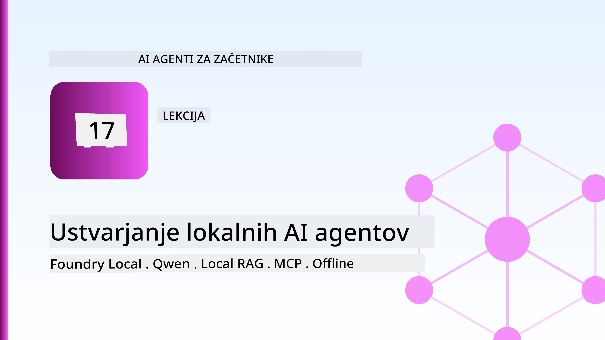
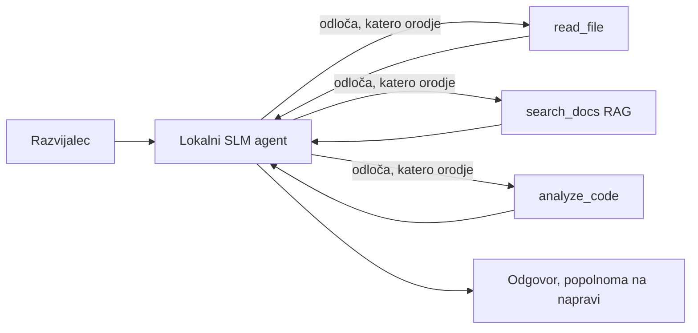
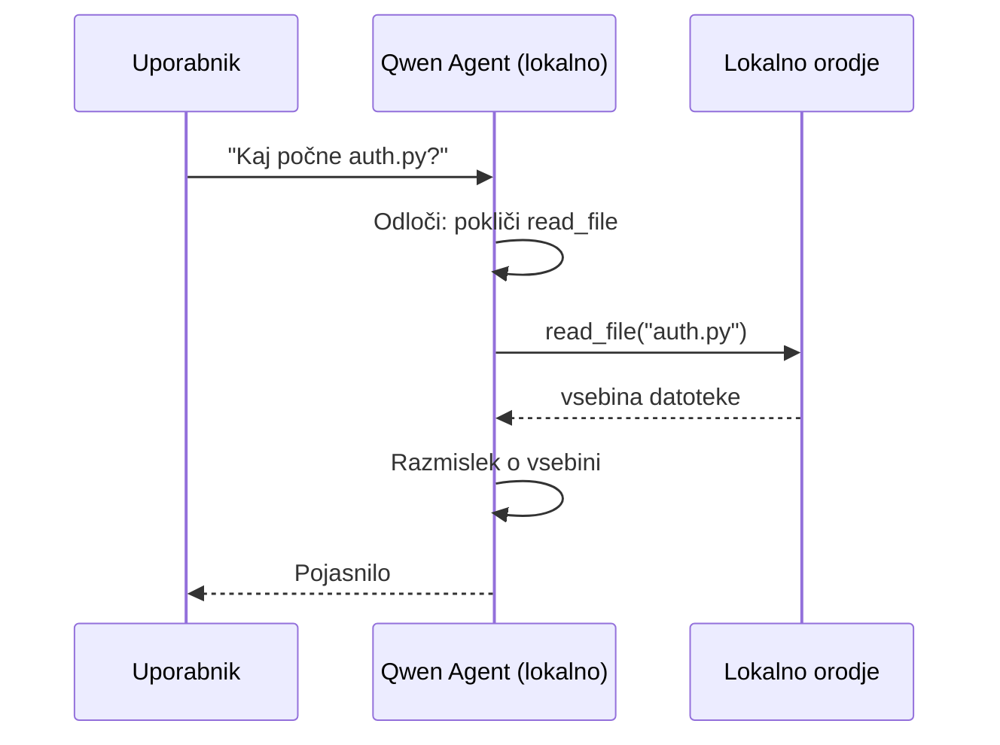
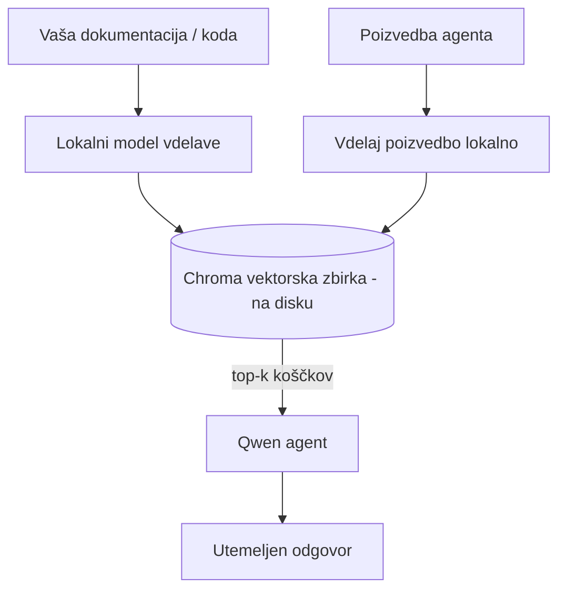
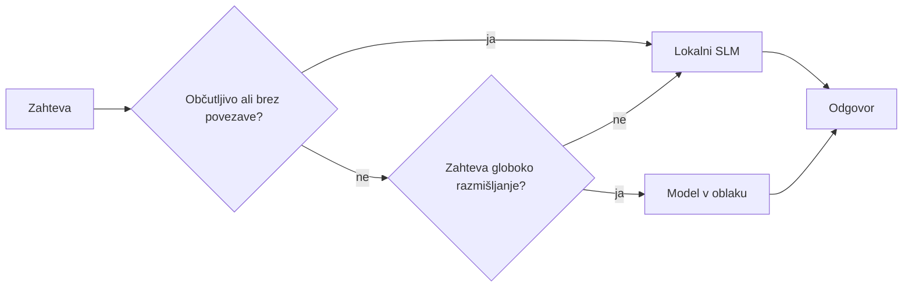

# Ustvarjanje lokalnih AI agentov z Microsoft Foundry Local in Qwen



Prejšnja lekcija je agente *razširila* v oblak. Ta pa jih prinese *dol* na en računalnik. Do konca boste imeli delujočega inženirskega asistenta, ki razmišlja, kliče orodja, bere vaše datoteke in išče v vaši dokumentaciji — **brez enega samega klica v oblaku.**

Zakaj bi to želeli? Trije razlogi, ki se pogosto pojavljajo v resničnem inženiringu:

- **Zasebnost.** Koda in dokumenti ne zapustijo naprave. Noben poziv, noben odlomek, nobeni podatki stranke ne prečkajo omrežne meje.
- **Stroški.** Lokalno sklepanje ni vezano na stroške na žeton. Lahko iterirate ves dan za ceno elektrike.
- **Brez povezave.** Na letalu, v varni ustanovi ali med izpadom, agent še vedno deluje.

Pomanjkljivost je, da zamenjate napreden oblačni model za **Majhen jezikovni model (SLM)**, ki teče na vaši CPU, GPU ali NPU. Ta lekcija govori o gradnji agentov, ki so *dober* znotraj teh omejitev, namesto da bi se pretvarjali, da omejitev ni.

## Uvod

Ta lekcija bo zajemala:

- **Majhne jezikovne modele (SLM)** — kaj so, kje izstopajo in kje ne.
- **Microsoft Foundry Local** — runtime, ki prenese in postreže modele lokalno preko **OpenAI združljivega API-ja**.
- **Qwen modele za klicanje funkcij** — SLM, ki zanesljivo izdelujejo klice orodjem, kar omogoča lokalne *agente* (ne le lokalni klepet).
- **Lokalna orodja, lokalni RAG in lokalni MCP** — ki agentu omogočijo delovanje brez oblaka.
- **Hibridni vzorci** — kdaj obdržati stvari lokalno in kdaj poseči po oblaku.

## Cilji učenja

Po končani tej lekciji boste znali:

- Pojasniti kompromise SLM-ov in izbrati primerne primere uporabe lokalnih agentov.
- Postreči Qwen model lokalno z Foundry Local in se nanj povezati preko OpenAI združljive točke.
- Zgraditi agenta za klic orodij, ki teče popolnoma na vaši delovni postaji.
- Dodati lokalni RAG preko lastnih dokumentov z lokalno vektorsko bazo podatkov (Chroma).
- Povezati agenta z lokalnim MCP strežnikom in razmisliti o hibridnih lokalnih/oblačnih zasnovah.

## Predpogoji

Ta lekcija predvideva, da ste opravili prejšnje lekcije in ste vešči:

- [Uporaba orodij](../04-tool-use/README.md) (Lekcija 4) in [Agentic RAG](../05-agentic-rag/README.md) (Lekcija 5).
- [Agentni protokoli / MCP](../11-agentic-protocols/README.md) (Lekcija 11).
- [Microsoft Agent Framework](../14-microsoft-agent-framework/README.md) (Lekcija 14).

Prav tako boste potrebovali:

- Delovno postajo za razvijalce. **8 GB RAM-a je realistična minimum**; 16 GB+ je udobno. GPU ali NPU pomaga, a ni nujno.
- **Microsoft Foundry Local** nameščen (glejte spodnji razdelek za nastavitev).
- Python 3.12+ in pakete v repozitoriju [`requirements.txt`](../../../requirements.txt), plus `foundry-local-sdk`, `openai` in `chromadb` za to lekcijo.

## Majhni jezikovni modeli: Pravo orodje za lokalno delo

Napreden oblačni model ima sto milijard parametrov in podatkovni center za sabo. SLM ima nekaj milijard parametrov in mora stati v RAM-u vašega prenosnika. Ta razlika postavlja jasna pričakovanja.

**SLM-i so dobri pri:**

- Strukturiranih, omejenih opravilih — klasifikacija, ekstrakcija, povzemanje poznanega dokumenta.
- **Klicanju orodij** — odločanju, katero funkcijo klicati in s kakšnimi argumenti.
- Hitrih, poceni in zasebnih iteracijah na lastnih podatkih.

**SLM-i so šibkejši pri:**

- Odprtih, večstopenjskih zaključkih preko velikega konteksta.
- Širokem svetovnem znanju (videli so manj stvari in pozabijo več).

Zmagovalna strategija za lokalne agente je torej: **naj SLM usklajuje, naj orodja opravljajo težje delo.** Model ne potrebuje, da *pozna* vašo kodo — potrebuje vedeti, kdaj poklicati `read_file` in `search_docs`. To neposredno izkorišča prednosti SLM.



## Microsoft Foundry Local

**Microsoft Foundry Local** je lahkoten runtime, ki prenese, upravlja in postreže modele popolnoma na vašem računalniku. Najpomembnejša funkcija za nas je, da izpostavlja **OpenAI združljivo HTTP točko** — to pomeni, da OpenAI SDK in Microsoft Agent Framework-ov OpenAI odjemalec delujeta proti njej samo z zamenjavo `base_url`. Vse, kar ste se naučili o gradnji agentov, lahko neposredno uporabite; le točka se premakne iz oblaka na `localhost`.

Foundry Local tudi samodejno izbere najboljšo verzijo modela za vašo strojno opremo — CPU build, CUDA/GPU build ali NPU build — tako da vam ni treba ročno optimizirati za vsako napravo.

### Namestitev

Namestite Foundry Local (glejte [dokumentacijo](https://learn.microsoft.com/azure/ai-foundry/foundry-local/) za vaš OS), nato preverite, ali deluje:

```bash
# Namestite (primer; sledite dokumentaciji za vašo platformo)
winget install Microsoft.FoundryLocal      # Windows
# brew install microsoft/foundrylocal/foundrylocal   # macOS

# Prenesite in zaženite model Qwen, nato zaženite lokalno storitev
foundry model run qwen2.5-7b-instruct
foundry service status
```

Ko storitev teče, imate lokalno, OpenAI združljivo točko (običajno `http://localhost:PORT/v1`). Zvezek uporablja `foundry-local-sdk`, da samodejno odkrije točko, zato vam ni treba ročno določati vrat.

## Qwen klic funkcij: zakaj je pomembno

Agent je agent le, če lahko kliče orodja. Veliko SLM lahko klepeta, a izdeluje nezanesljive, nepravilne klice orodij. **Qwen** modeli so usposobljeni za klic funkcij in dosledno proizvajajo pravilno oblikovane strukture klicev orodij — kar je tisto, kar lokalni klepetalni model spremeni v lokalnega *agenta*.

Potek je standardni cikel klicev orodij, ki ga že poznate, le da teče lokalno:



## Lokalni RAG

Iskanje v dokumentaciji je področje, kjer lokalni agenti pokažejo svojo vrednost. Namesto da upamo, da je SLM zapomnil dokumentacijo vašega ogrodja, te dokumente vstavimo v **lokalno vektorsko bazo podatkov** in agentu omogočimo, da po potrebi poišče ustrezne dele.

Uporabljamo **Chroma**, vgrajeno vektorsko skladišče, ki deluje v istem procesu brez strežnika za upravljanje. Celotna cev je popolnoma lokalna: lokalni vstavitveni model → lokalni vektorji → lokalno iskanje → lokalni SLM.



To je isti vzorec Agentic RAG iz Lekcije 5 — edina sprememba je, da vsak del teče na vaši napravi.

## Lokalni MCP strežniki

[MCP](../11-agentic-protocols/README.md) je transport, ne oblačna storitev. MCP strežnik lahko teče kot lokalni proces na `stdio`, kar orodjem omogoča povezavo z agentom preko standardnega protokola. S tem lahko ponovno uporabite rastoči ekosistem MCP strežnikov — dostop do datotečnega sistema, operacije git, poizvedbe baz podatkov — popolnoma brez povezave.

Varnostni položaj je drugačen kot v oblaku, a ni odsoten: lokalni MCP strežnik še vedno teče z dovoljenji vašega uporabnika, zato omejite njegov dostop (na projektno mapo, ne celotno domačo mapo) in rezultate ravnajte kot vhodne podatke za validacijo.

## Hibridni oblaki in lokalni vzorci

Lokalno najprej ne pomeni samo lokalno. Zrele rešitve usmerjajo tok glede na občutljivost in zahtevnost:

| Situacija | Kje teče |
| --- | --- |
| Občutljiva koda/podatki ali brez povezave | **Lokalni SLM** |
| Preprosto, omejeno opravilo | **Lokalni SLM** (poceni, hitro) |
| Zahtevna večstopenjska odločitev o neobčutljivih podatkih | **Oblačni model** |
| Vse med izpadom | **Lokalni SLM** (prijazno degradiranje) |

To ponavlja idejo **usmerjanja modelov** iz Lekcije 16 — razen da je ena izmed "modelov" zdaj vaš lasten računalnik. Robustna zasnova se v oblak ne poveže, ko ni na voljo, tako da agent izgublja na kakovosti namesto, da povsem odpove.



## Praktična vaja: Lokalen inženirski asistent

Odprite [`code_samples/17-local-agent-foundry-local.ipynb`](./code_samples/17-local-agent-foundry-local.ipynb) in ga preglejte. Zgradili boste **lokalnega inženirskega asistenta**, ki teče popolnoma na vaši delovni postaji in lahko:

1. **Kliče orodja** — preko Qwen klicanja funkcij skozi Foundry Local.
2. **Izvaja lokalne operacije z datotekami** — našteje in bere datoteke v projektni mapi.
3. **Analizira kodo** — poroča osnovne metrike o izvorni datoteki.
4. **Išče v dokumentaciji** — lokalni RAG preko mape z dokumenti s pomočjo Chroma.
5. **Uporablja MCP** — poveže se z lokalnim MCP strežnikom (z nežnim preskakovanjem, če ni konfiguriran).

V nobenem trenutku ne uporabi oblačnega sklepanja.

### Pregled

Asistent se poveže s Foundry Local preko OpenAI združljive točke, tako da je koda agenta skoraj enaka kot pri oblačnih lekcijah — spremeni se le odjemalec:

```python
from foundry_local import FoundryLocalManager
from openai import OpenAI

# Foundry Local odkrije/prekine model in nam da lokalno končno točko.
manager = FoundryLocalManager(\"qwen2.5-7b-instruct\")
client = OpenAI(base_url=manager.endpoint, api_key=manager.api_key)  # api_key je lokalni nadomestni znak
```

Orodja so običajne Python funkcije omejene na projektno mapo:

```python
def read_file(path: str) -> str:
    \"\"\"Read a file, but only inside the sandboxed project directory.\"\"\"
    full = (PROJECT_ROOT / path).resolve()
    if PROJECT_ROOT not in full.parents and full != PROJECT_ROOT:
        return \"Access denied: path is outside the project directory.\"
    return full.read_text(encoding=\"utf-8\")
```

Opazite preverjanje peskovnika — tudi lokalno je orodje, ki bere poljubne poti, tveganje. Zvezek omeji vsa orodja na eno samo korensko mapo projekta.

## Preverjanje znanja

Preizkusite svoje razumevanje, preden nadaljujete z nalogo.

**1. Navedite dva konkretna razloga, zakaj bi agenta zagnali lokalno namesto v oblaku.**

<details>
<summary>Odgovor</summary>

Katera koli dva od: **zasebnost** (koda in podatki ne zapustijo naprave), **stroški** (ni računa na žeton za sklepanje), in **delovanje brez povezave** (deluje brez omrežja — na letalu, v varni ustanovi ali med izpadom). Regulatorne omejitve, ki prepovedujejo pošiljanje podatkov iz naprave, so pogost vzrok zasebnosti.
</details>

**2. Kakšna je priporočena delitev dela med SLM in njegovimi orodji v lokalnem agentu in zakaj?**

<details>
<summary>Odgovor</summary>

Naj SLM **usklajuje** (odloči, katero orodje klicati in s kakšnimi argumenti), orodjem pa dovolite **težka opravila** (branje datotek, pridobivanje dokumentov, računanje rezultatov). SLM so močni pri omejenih odločitvah, kot je izbira orodja, a šibkejši pri širšem znanju in dolgem večstopenjskem sklepanju, zato zanašanje na orodja izkorišča njihove prednosti.
</details>

**3. Kaj omogoča ponovno uporabo kode agenta iz oblaka s Foundry Local?**

<details>
<summary>Odgovor</summary>

Foundry Local izpostavlja **OpenAI združljivo HTTP točko**. OpenAI SDK in Agent Framework-ov OpenAI odjemalec delujeta proti njej z zamenjavo samo `base_url` (in uporabo lokalnega API ključa kot nadomestnega znaka). Vse drugo o kodi agenta ostane enako.
</details>

**4. Zakaj prav posebej uporabljamo Qwen model za klic funkcij namesto kateregakoli SLM?**

<details>
<summary>Odgovor</summary>

Ker mora agent proizvajati zanesljive, pravilno oblikovane **klice orodij**. Veliko SLM lahko klepeta, a oddaja nepravilne ali nezanesljive strukture klicev orodij. Qwen modeli so usposobljeni za klic funkcij in dosledno ustvarjajo klice orodij, kar lokalni klepetalni model spremeni v delujočega lokalnega agenta.
</details>

**5. Kateri sestavni deli v lokalni RAG cevovodu tečejo na napravi?**

<details>
<summary>Odgovor</summary>

Vsi: model vstavitve, vektorska baza podatkov (Chroma, na disku), korak iskanja in SLM. Dokumenti so lokalno vstavljeni, lokalno shranjeni, lokalno pridobljeni in lokalno obdelani — noben sestavni del ne uporablja oblaka.
</details>

**6. Lokalni MCP strežnik teče na vašem računalniku. Ali to pomeni, da je avtomatično varen? Katero previdnost morate še vedno upoštevati?**

<details>
<summary>Odgovor</summary>

Ne. Lokalni MCP strežnik teče z dovoljenji vašega uporabnika, zato lahko dostopa do vsega, kar lahko vi. Omejite ga na tisto, kar potrebuje (na primer eno samo projektno mapo in ne celotno domačo) in rezultate obravnavajte kot vhodne podatke, ki jih pred uporabo validirajte.
</details>

**7. Opišite smiselno hibridno pravilo usmerjanja, ki vključuje lokalni model.**

<details>
<summary>Odgovor</summary>

Usmerite občutljive ali brez-povezave zahteve lokalnemu SLM; usmerite preprosta omejena opravila lokalnemu SLM za hitrost in nizke stroške; zahtevno večstopenjsko sklepanje o neobčutljivih podatkih usmerite k oblačnemu modelu; in v primeru nedostopnosti oblaka preklopite na lokalni SLM, da agent prijazno degradira namesto popolne napake. To je usmerjanje modelov (Lekcija 16) z lokalnim računalnikom kot enim izmed modelov.
</details>

**8. Kakšen je realističen minimalni RAM za zagon lokalnega agenta v tej lekciji in kaj dobite z več RAM-a?**

<details>
<summary>Odgovor</summary>

Približno **8 GB** je realističen minimum; 16 GB+ je udobno. Več RAM-a omogoča uporabo večjih, zmogljivejših modelov in shranjevanje več konteksta v spomin. GPU ali NPU pospešuje sklepanje, a ni nujno — Foundry Local izbere CPU verzijo, če ni pospeševalca.
</details>

## Naloga

Razširite lokalnega inženirskega asistenta v **lokalnega recenzenta dokumentacije** za majhen projekt po vaši izbiri (lahko uporabite eno izmed lekcijskih map tega repozitorija).

Vaša oddaja naj:

1. **Indeksira pravo mapo dokumentov/kode** v Chromo (vsaj pet datotek).
2. **Doda orodje `find_todos`**, ki pregleda projekt za komentarje `TODO`/`FIXME` in jih vrne skupaj z imenom datoteke in številko vrstice — ob uporabi istega preverjanja peskovnika kot `read_file`.

3. **Vprašajte agenta tri vprašanja**, ki ga prisilijo, da združi orodja: eno čisto RAG vprašanje, eno, ki zahteva branje določenega datotek, in eno, ki zahteva iskanje TODO-jev.
4. **Izmerite ga**: zabeležite čas za vsak od treh odgovorov v markdown celico. Kommentirajte, ali je zakasnitev sprejemljiva za vaš namenjeni potek dela.

Nato napišite kratek odstavek o tem, **kaj bi premaknili v oblak in kaj bi obdržali lokalno** za tega recenzenta, in zakaj. Ocenjuje se, ali so lokalne komponente pravilno povezane in ali je vaše hibridno razmišljanje pravilno — ne pa kakovost modela.

## Povzetek

V tej lekciji ste zgradili agenta, ki deluje v celoti na vašem lastnem računalniku:

- **SLM-i** zamenjajo širino z zasebnostjo, stroški in delovanjem brez povezave — in izstopajo, ko **orkestrirajo orodja** namesto, da bi imeli vse znanje sami.
- **Foundry Local** služi modele na napravi znotraj **OpenAI združljivega končnega mesta**, tako da se vaša koda oblaka za agente prenese z eno vrstico spremembe.
- **Qwen modeli za klic funkcij** omogočajo zanesljivo lokalno klicanje orodij — in s tem lokalne *agente*.
- **Lokalni RAG** (Chroma) in **lokalni MCP** agentu omogočata funkcionalnost brez zapuščanja naprave.
- **Hibridni vzorci** vam omogočajo usmerjanje glede na občutljivost in zahtevnost, z lokalnim kot elegantnim rezervnim načinom.

To zaključi razvojno zgodbo: Lekcija 16 je razširila agente v Microsoft Foundry, ta lekcija pa jih je skrčila na en sam delovni postajo. Naslednja lekcija se posveča varnosti nameščenih agentov.

## Dodatni viri

- <a href="https://learn.microsoft.com/azure/ai-foundry/foundry-local/" target="_blank">Dokumentacija Microsoft Foundry Local</a>
- <a href="https://learn.microsoft.com/azure/ai-foundry/what-is-azure-ai-foundry" target="_blank">Dokumentacija Microsoft Foundry</a>
- <a href="https://aka.ms/ai-agents-beginners/agent-framework" target="_blank">Microsoft Agent Framework</a>
- <a href="https://qwen.readthedocs.io/en/latest/framework/function_call.html" target="_blank">Dokumentacija za klic funkcij Qwen</a>
- <a href="https://modelcontextprotocol.io/" target="_blank">Protokol konteksta modela (MCP)</a>
- <a href="https://docs.trychroma.com/" target="_blank">Chroma vektorska baza podatkov</a>

## Prejšnja lekcija

[Nameščanje razširljivih agentov](../16-deploying-scalable-agents/README.md)

## Naslednja lekcija

[Zagotavljanje varnosti AI agentov](../18-securing-ai-agents/README.md)

---

<!-- CO-OP TRANSLATOR DISCLAIMER START -->
**Omejitev odgovornosti**:
Ta dokument je bil preveden z uporabo AI prevajalske storitve [Co-op Translator](https://github.com/Azure/co-op-translator). Čeprav si prizadevamo za natančnost, vas prosimo, da upoštevate, da avtomatizirani prevodi lahko vsebujejo napake ali netočnosti. Izvirni dokument v njegovem izvirnem jeziku je treba obravnavati kot avtoritativni vir. Za kritične informacije je priporočljiv strokovni človeški prevod. Ne odgovarjamo za morebitna nesporazume ali napačne interpretacije, ki izhajajo iz uporabe tega prevoda.
<!-- CO-OP TRANSLATOR DISCLAIMER END -->