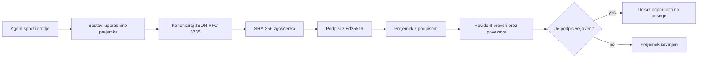
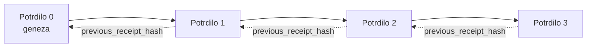

[Oglejte si video lekcije: Zavarovanje AI agentov s kriptografskimi prejemki](https://youtu.be/PLACEHOLDER_VIDEO_ID)

> _(Video lekcije in sličica bosta dodana s strani Microsoftove ekipe za vsebino po združitvi, v skladu z vzorcem lekcije 14 / 15.)_

# Zavarovanje AI agentov s kriptografskimi prejemki

## Uvod

Ta lekcija bo zajemala:

- Zakaj so revizijske sledi za AI agente pomembne za skladnost, odpravljanje napak in zaupanje.
- Kaj je kriptografski prejemek in kako se razlikuje od nepotpisane vrstice dnevnika.
- Kako ustvariti podpisan prejemek za klic orodja agenta s pomočjo navadnega Pythona.
- Kako offline preveriti prejemek in zaznati poseg.
- Kako povezati prejemke tako, da odstranitev ali prerazporeditev enega prekine verigo.
- Kaj prejemki dokazujejo in kaj izrecno ne dokazujejo.

## Cilji učenja

Po zaključku te lekcije boste znali:

- Prepoznati načine okvar, ki motivirajo kriptografsko sledljivost dejanj agenta.
- Ustvariti prejemek podpisan z Ed25519 na canonical JSON podatku.
- Neodvisno preveriti prejemek samo s pomočjo javnega ključa podpisnika.
- Zaznati poseg z ponovnim izvajanjem preverjanja na spremenjenem prejemku.
- Zgraditi zaporedje prejemkov z zgoščeno verigo in razložiti pomen verige.
- Prepoznati mejo med tem, kaj prejemki dokazujejo (pripis, celovitost, zaporedje) in kaj ne (pravilnost dejanja, ustreznost politike).

## Problem: revizijska sled vašega agenta

Predstavljajte si, da ste uvedli AI agenta za Contoso Travel. Agent bere zahteve strank, kliče API za lete za iskanje možnosti in rezervira sedeže v imenu stranke. V zadnjem četrtletju je agent obdelal 50.000 rezervacij.

Danes pride revizor. Postavi preprosto vprašanje: "Pokažite mi, kaj je vaš agent storil."

Predložite svoje datoteke dnevnika. Revizor jih pregleda in postavi težje vprašanje: "Kako vem, da ti dnevniki niso bili spremenjeni?"

To je problem revizijske sledi. Večina današnjih uvedb agentov se zanaša na:

- **Aplikacijske dnevnike**: zapisane s strani samega agenta, ki jih lahko ureja kdorkoli z dostopom do datotečnega sistema.
- **Spletne storitve za beleženje v oblaku**: dokazljivo varne na ravni platforme, vendar samo če revizor zaupa upravljavcu platforme.
- **Transakcijske dnevnike baze podatkov**: primerni za spremembe baze, ne pa za poljubne klice orodij.

Nobeden od teh ne more na vprašanje revizorja odgovoriti brez zahteve po zaupanju nekomu (vam, vašemu ponudniku oblaka, vašemu ponudniku baze podatkov). Za notranjo uporabo je to pogosto sprejemljivo. Za regulirane obremenitve (finance, zdravstvo, karkoli, kar je predmet zakonodaje EU o AI) ni.

Kriptografski prejemki to rešijo tako, da je vsako dejanje agenta neodvisno preverljivo. Revizor vam ne mora zaupati. Potrebuje samo vaš javni ključ in sam prejemek.

## Kaj je kriptografski prejemek?

Prejemek je JSON objekt, ki beleži, kaj je agent storil, podpisan z digitalnim podpisom.



Minimalni prejemek izgleda takole:

```json
{
  "type": "agent.tool_call.v1",
  "agent_id": "contoso-travel-bot",
  "tool_name": "lookup_flights",
  "tool_args_hash": "sha256:a3f9c1...",
  "result_hash": "sha256:7b2e1d...",
  "policy_id": "contoso-travel-policy-v3",
  "timestamp": "2026-04-25T14:30:00Z",
  "sequence": 47,
  "previous_receipt_hash": "sha256:9d4e6a...",
  "signature": {
    "alg": "EdDSA",
    "sig": "c5af83...",
    "public_key": "8f3b2c..."
  }
}
```

Tri lastnosti opravljajo delo:

1. **Podpis**. Prejemek je podpisan vstopno-točkovni agent s pomočjo Ed25519 zasebnega ključa. Kdor ima ustrezni javni ključ, lahko offline preveri podpis. Vsaka sprememba polja velja podpis za neveljaven.

2. **Kanonizirana kodifikacija**. Pred podpisovanjem je prejemek serializiran s pomočjo JSON Canonicalization Scheme (JCS, RFC 8785). To zagotavlja, da dve implementaciji, ki ustvarita isti logični prejemek, dajeta bit-po-bit identičen izhod. Brez kanonizacije bi različni JSON serializatorji proizvajali različne podpise za isto vsebino.

3. **Zgoščena veriga**. Polje `previous_receipt_hash` povezuje vsak prejemek s predhodnim. Odstranitev ali prerazporeditev enega prekine vsak naslednji prejemek. Poseg je viden na ravni verige, tudi če so posamezni podpisi obšli.

Skupaj te lastnosti zagotavljajo tri zagotovila:

- **Pripis**: ta ključ je podpisal to vsebino.
- **Celovitost**: vsebina od podpisa ni bila spremenjena.
- **Zaporedje**: ta prejemek je prišel po tistem prejemku v verigi.

## Ustvarjanje prejemka v Pythonu

Za izdelavo prejemka ne potrebujete posebne knjižnice. Kriptografski gradniki so široko dostopni, logika pa je nekaj deset vrstic Pythona.

Vaje v `code_samples/18-signed-receipts.ipynb` prikazujejo celoten potek. Povzetek:

```python
import json
import hashlib
import base64
from nacl import signing
from jcs import canonicalize  # RFC 8785 kanonični JSON

def b64url_nopad(data: bytes) -> str:
    return base64.urlsafe_b64encode(data).decode("ascii").rstrip("=")

def sha256_canonical(obj) -> str:
    """SHA-256 of a Python object's JCS-canonical JSON form."""
    return f"sha256:{hashlib.sha256(canonicalize(obj)).hexdigest()}"

# Ustvari ali naloži ključ za podpisovanje (v produkciji shrani v ključavnico ključev)
signing_key = signing.SigningKey.generate()
verify_key = signing_key.verify_key

# Oblikuj vsebino potrdila (še brez podpisa)
tool_args = {"origin": "SYD", "destination": "LAX"}
tool_result = [{"flight": "QF11", "price": 1850, "stops": 0}]

payload = {
    "type": "agent.tool_call.v1",
    "agent_id": "contoso-travel-bot",
    "tool_name": "lookup_flights",
    "tool_args_hash": sha256_canonical(tool_args),
    "result_hash": sha256_canonical(tool_result),
    "policy_id": "contoso-travel-policy-v3",
    "timestamp": "2026-04-25T14:30:00Z",
    "sequence": 0,
    "previous_receipt_hash": None,
}

# Kanoniziraj, zmešaj, podpiši.
canonical_bytes = canonicalize(payload)
message_hash = hashlib.sha256(canonical_bytes).digest()
signature_bytes = signing_key.sign(message_hash).signature

# Pripni strukturiran podpisni objekt.
receipt = {
    **payload,
    "signature": {
        "alg": "EdDSA",
        "sig": b64url_nopad(signature_bytes),
        "public_key": b64url_nopad(bytes(verify_key)),
    },
}
```

To je celotni postopek podpisovanja. Vaje v zvezku prikazujejo vsak korak.

## Preverjanje prejemka in zaznavanje posega

Preverjanje je obratna operacija:

```python
import base64
import hashlib
from nacl import signing
from nacl.exceptions import BadSignatureError
from jcs import canonicalize

def b64url_decode(s: str) -> bytes:
    padding = "=" * ((4 - len(s) % 4) % 4)
    return base64.urlsafe_b64decode(s + padding)

def verify_receipt(receipt: dict) -> bool:
    # Podpis je strukturiran objekt: {"alg", "sig", "public_key"}.
    sig_obj = receipt.get("signature")
    if not sig_obj or sig_obj.get("alg") != "EdDSA":
        return False

    # Rekonstruirajte uporabno vsebino, ki je bila dejansko podpisana (vse razen podpisa).
    payload = {k: v for k, v in receipt.items() if k != "signature"}

    canonical_bytes = canonicalize(payload)
    message_hash = hashlib.sha256(canonical_bytes).digest()

    try:
        verify_key = signing.VerifyKey(b64url_decode(sig_obj["public_key"]))
        verify_key.verify(message_hash, b64url_decode(sig_obj["sig"]))
        return True
    except BadSignatureError:
        return False
```

Ta funkcija sprejme prejemek in vrne `True`, če je podpis veljaven, sicer `False`. Brez klicev v omrežje, brez odvisnosti od storitve, brez zaupanja v tretjo osebo.

Za ogled zaznavanja posega v praksi zvezek prikazuje:

1. Ustvarjanje veljavnega prejemka in potrditev, da se preverjanje uspe.
2. Spreminjanje enega bajta v polju `tool_args_hash`.
3. Ponovno preverjanje in opazovanje neuspeha.

To je praktični dokaz, da so prejemki odporni na posege: vsaka sprememba, še tako majhna, prekine podpis.

## Verižna povezava prejemkov za večstopenjske agente

En sam podpisan prejemek ščiti eno dejanje. Veriga prejemkov ščiti zaporedje.



Vsak prejemek beleži zgoščeno vrednost prejšnjega prejemka. Za tiho odstranitev prejemka 2 bi napadalec moral:

- Spremeniti polje `previous_receipt_hash` prejemka 3 (prekine podpis prejemka 3), ALI
- Ustvariti nov podpis na spremenjenem prejemku 3 (zahteva zasebni ključ agenta).

Če je zasebni ključ v strojni shrambi ključev in javni ključ objavite z vsakim prejemkom, nobeden od teh napadov ni možen brez odkritja.

Zvezek prikazuje:

1. Gradnjo verige treh prejemkov.
2. Preverjanje, da se `previous_receipt_hash` vsakega prejemka ujema z dejansko zgoščeno vrednostjo prejšnjega prejemka.
3. Poseg v en prejemek sredi verige in opazovanje prekinitve verige prav na tem mestu.

Tako ustvarite revizijsko sled, ki jo lahko zunanji revizor preveri brez zaupanja v vas.

## Kaj prejemki dokazujejo (in kaj ne dokazujejo)

Ta del je najpomembnejši v tej lekciji. Prejemki so močni, a imajo omejitve.

**Prejemki dokazujejo tri stvari:**

1. **Pripis**: določen ključ je podpisal določen naklad.
2. **Celovitost**: naklad od podpisa ni bil spremenjen.
3. **Zaporedje**: ta prejemek je prišel po tistem prejemku v zgoščeni verigi.

**Prejemki ne dokazujejo:**

1. **Pravilnost**: da je bilo dejanje agenta pravilno. Prejemek je lahko podpisan za napačen odgovor prav tako čisto kot za pravilen.
2. **Upoštevanje politike**: da je bila politika v `policy_id` dejansko ocenjena, ali da bi dovolila to dejanje, če bi bila preverjena. Prejemek beleži, kaj je bilo trjeno, ne kaj je bilo izvršeno.
3. **Identiteta onkraj ključa**: prejemek pravi "ta ključ je podpisal to vsebino." Ne pravi "ta človek je pooblastil to." Povezava ključa s človekom ali organizacijo zahteva ločeno infrastrukturo identitete (imenik, register javnih ključev itd.).
4. **Resničnost vhodov**: če agent prejme manipuliran poziv in na njem temelji, prejemek zvesto beleži dejanje. Prejemki so posledica validacije vhodov, ne nadomestek zanjo.

Ta meja je pomembna iz dveh razlogov:

- Pove, za kaj so prejemki uporabni: za revizijsko sledljivo in odporen na posege agentovo vedenje, tudi preko organizacijskih meja.
- Pove, katere dodatne plasti še potrebujete: validacijo vhodov (lekcija 6), izvrševanje politike (na kratko obravnavano spodaj) in infrastrukturo identitete (izven obsega te lekcije).

Pogosta zmota je domnevati, da "imamo prejemke" pomeni "imamo upravljanje". Ne pomeni. Prejemki so temelj. Upravljanje je sistem, ki ga gradite na temu temelju.

## Dokazati, da je človek odobril točno to dejanje

Točka 3 zgoraj velja svojo ločeno sekcijo: prejemek dejanja pravi "ta ključ je podpisal to vsebino," nikoli "človek je to odobril". Za dejanja z visokim tveganjem (vračila denarja, izbrisi, bančna nakazila) okviri upravljanja vedno bolj zahtevajo natanko to manjkajočo izjavo, ki jo je mogoče realizirati z enakimi gradniki, ki ste jih že izdelali v tej lekciji.

Naslednji zvezek `code_samples/human-authorization-receipts.ipynb` doda drugo vrsto prejemka, `human.approval.v1`, v isti obliki ovojnice kot prejemki te lekcije (tipiziran naklad podpisan z Ed25519 prek njegove kanonične SHA-256, z objektom `signature` zunaj podpisanih bajtov). Imenovani odobravalec podpiše **celotno kanonično dejanje in njegov digest** pred izvršitvijo; prejemek dejanja agenta nosi **isti digest dejanja** in `parent_approval_ref`, `receipt_hash` odobritve, enako konvencijo kot `previous_receipt_hash` v verigi zgoraj. Ena `verify_chain` poteka za oba artefakta pod **ločenimi registri pripetih ključev** (ključi odobravateljev proti ključem agentov), torej je koda skupna, a oblasti nikoli niso.

Lastnost, ki jo to omogoča, izraženo natančno: *človek je odobril točno to dejanje, agent pa je izvedel ravno to odobreno dejanje.* Objekti zavrnitve v zvezku so tisto, kar lastnost dejansko potrdi, ne le potrdi:

- klasični nabor: posegi, zmeden zaščitnik, ponovitve, ponarejeni ključi na obeh straneh, nepravilni vhodi;
- **zastarela pristojnost**: podpis, ki se še vedno preverja, zavrnjen zaradi premika verzije politike, rotacije ključa odobravatelja ali poteka odobritve pred izvršitvijo;
- **zamenjava digesta**: veljaven podpis prejemka dejanja, ki kaže na *resnično* odobritev drugega *kanoničnega* dejanja.

Vsaka napaka zavrne z razlikovalnim razlogom, tako da revizor ob branju zavrnitve vidi, ali je pristojnost zastarala ali se je dejanje spremenilo. Pravilo, ki ga uči zvezek: podpisana odobritev sama po sebi ni pristojnost. Pristojnost obstaja le, če oba prejemka še vedno pripadata istemu kanoničnemu dejanju ob izvršitvi. Pot sobeležnika v istem Internet-Draftu, ki ga ta lekcija sledi (`draft-farley-acta-signed-receipts`), je standardni vzorec tega modela.

## Referenčne rešitve za produkcijo

Python koda v tej lekciji je namenoma minimalna, da lahko preberete vsako vrstico in natančno razumete, kaj se dogaja. V produkciji imate dve možnosti:

1. **Gradite neposredno na kriptografskih gradnikih.** 50 vrstic, ki ste jih zgoraj videli, zadostuje za veliko primerov uporabe. PyNaCl (Ed25519) in paket `jcs` (kanonični JSON) so dobro vzdrževani in verificirani knjižnici.

2. **Uporabite knjižnico za produkcijske prejemke.** Več odprtokodnih projektov implementira isti vzorec z dodatnimi funkcijami (rotacija ključev, serijsko preverjanje, distribucija JWK seta, integracija s politiko):
   - Format prejemkov v tej lekciji sledi IETF Internet-Draftu ([`draft-farley-acta-signed-receipts`](https://datatracker.ietf.org/doc/draft-farley-acta-signed-receipts/), revizija 02), ki je trenutno v postopku standardizacije, z deljenim paketom skladnosti ([agent-governance-testvectors](https://github.com/ScopeBlind/agent-governance-testvectors)), ki ga neodvisne implementacije vzajemno preverjajo za bit-identičen kanonični izhod.
   - Microsoft Agent Governance Toolkit sestavlja prejemke s pravili Cedar; glejte Tutorial 33 v tem repozitoriju za primer od začetka do konca.
   - Paketa `protect-mcp` (npm) in `@veritasacta/verify` (npm) zagotavljata implementacijo podpisovanja prejemkov in offline preverjanje v Node okolju, namenjeni ovitju kateregakoli MCP strežnika s protivohunsko revizijsko sledjo, vključno s tokom zadrževalnega sobeležnika, kjer pavzirano dejanje sproži prejemek odobritve, vezan na digest dejanja (WebAuthn-podprt v namiznem toku), isti vzorec odobritvenega prejemka kot zgornji zvezek za avtorizacijo ljudi.
   - **[nobulex](https://github.com/arian-gogani/nobulex)** Python SDK (`pip install nobulex`) zagotavlja isti Ed25519 + JCS podpisovalni vzorec v Pythonu z integracijami LangChain in CrewAI, vključno z objavljenimi testnimi vektorji in prispevkom skladnostne preslikave prek [OWASP PR #2210](https://github.com/OWASP/CheatSheetSeries/pull/2210).

Odločitev med lastno implementacijo in uporabo knjižnice je podobna izbiri med pisanjem svoje JWT knjižnice in uporabo preizkušene: oba pristopa sta razumna; knjižnica prihrani čas in zmanjša površino revizije; pristop od začetka vas sili, da razumete vsak gradnik. Ta lekcija uči pot od začetka, da imate osnovo za katerokoli izbiro.

## Preverjanje znanja

Preizkusite svoje razumevanje, preden nadaljujete na praktično vajo.

**1. Prejemek je podpisan z zasebnim Ed25519 ključem agenta. Revizor ima le javni ključ. Ali lahko revizor prejemek preveri offline?**

<details>
<summary>Odgovor</summary>

Da. Preverjanje Ed25519 zahteva samo javni ključ in podpisane bajte. Brez klicev v omrežje, brez odvisnosti od storitev. To je lastnost, ki naredi prejemke uporabne v zavarovanih, medorganizacijskih ali nizko-zaupljivih revizijskih okoljih.
</details>

**2. Napadalec spremeni polje `policy_id` prejemka, da trdi, da ga upravlja bolj permisivna politika. Podpis je bil nad izvirnim nakladom. Kaj se zgodi med preverjanjem?**

<details>
<summary>Odgovor</summary>


Preverjanje ne uspe. Podpis je bil izračunan preko kanoničnih bajtov izvirne obremenitve; sprememba katerega koli polja spremeni kanonične bajte, kar spremeni SHA-256 hash, s čimer postane podpis neveljaven. Napadalec bi potreboval zasebni ključ za izdelavo novega veljavnega podpisa, česar nima.
</details>

**3. Zakaj prejem vsebuje `tool_args_hash` in `result_hash` namesto surovih argumentov in rezultata?**

<details>
<summary>Odgovor</summary>

Dva razloga. Prvič, prejem je morda treba arhivirati ali prenašati v okoljih, kjer je uhajanje surove vsebine (PII, poslovni podatki) problem. Hasiranje ohranja prejem majhen in vsebino zasebno; revizor preveri, da hash ustreza ločeno shranjeni kopiji dejanske vsebine. Drugič, hashi imajo fiksno velikost; prejem z hashi je velikostno omejen ne glede na velikost vhodov in izhodov.
</details>

**4. Polje `previous_receipt_hash` povezuje vsak prejem z njegovim predhodnikom. Če napadalec tiho izbriše en prejem sredi verige, kaj postane neveljavno?**

<details>
<summary>Odgovor</summary>

Vsak prejem, ki je sledil po izbrisanem. Njihova polja `previous_receipt_hash` se ne ujemajo več z dejansko verigo (ker prejem, na katerega so se sklicevali, ne obstaja več, ali veriga zdaj kaže na drugačnega predhodnika). Da bi prikril izbris, bi moral napadalec znova podpisati vsak kasnejši prejem, kar zahteva zasebni ključ.
</details>

**5. Prejem se uspešno preveri. Ali to dokazuje, da je bila dejanja agenta pravilna, smiselna ali skladna s politiko?**

<details>
<summary>Odgovor</summary>

Ne. Veljaven prejem dokazuje tri stvari: pripis (ta ključ je podpisal to vsebino), integriteto (vsebina ni bila spremenjena) in vrstni red (ta prejem je prišel po tistem). Ne dokazuje, da je bilo dejanje pravilno, da je bila politika z `policy_id` dejansko ocenjena ali da je agent upošteval vsako pravilo. Prejemi omogočajo revizijo vedenja agenta, ne zagotavljajo nujno pravilnosti. To je najpomembnejša meja v lekciji.
</details>

## Praktična vaja

Odprite `code_samples/18-signed-receipts.ipynb` in dokončajte vseh štiri razdelke:

1. **Razdelek 1**: Podpišite svoj prvi prejem in ga preverite.
2. **Razdelek 2**: Spremenite prejem in opazujte, kako preverjanje ne uspe.
3. **Razdelek 3**: Ustvarite verigo s tremi prejemi in preverite integriteto verige.
4. **Razdelek 4**: Uporabite vzorec v agentu, ustvarjenem z Microsoft Agent Framework: v prejem vključite klic orodja, nato samostojno preverite prejem.

**Razširjen izziv 1:** razširite shemo prejema z dodatnim poljem po lastni izbiri (npr. ID zahteve za sledenje), posodobite kanonično logiko podpisa, da ga vključite, in potrdite, da prejem še vedno prehaja preverjanje. Nato spremenite polje po podpisu in potrdite, da preverjanje ne uspe. To vas prisili razumeti, kako vsak bajt kanoničnega kodiranja prispeva k podpisu.

**Razširjen izziv 2:** združite SHA-256 hash dveh vaših prejemov (zaporedno združite kanonične bajte v determinističnem vrstnem redu) in vstavite nastali digest kot novo polje v tretji prejem pred podpisom. Preverite, da vsi trije prejemi še vedno preidejo preverjanje. Pravkar ste zgradili dokaz o vključitvi v enem koraku: vsak, ki ima tretji prejem, lahko dokaže, da sta prva dva obstajala v času podpisa, brez razkrivanja vsebine. To je vzorec, ki ga prejmi z selektivno razkritostjo množično uporabljajo (Merkle zaveze, RFC 6962).

## Zaključek

Kriptografski prejmi dajo AI agentom revizijsko sled, ki je:

- **Neodvisno preverljiva**: kdorkoli z javnim ključem lahko preveri, brez odvisnosti od storitev.
- **Spremembe razkrijejo**: vsaka sprememba razveljavi podpis.
- **Prenosljiva**: prejem je majhna JSON datoteka; lahko jo arhivirate, prenašate in preverjate kjerkoli.
- **Skladna s standardi**: zgrajena na Ed25519 (RFC 8032), JCS (RFC 8785) in SHA-256, vse široko uporabljene primitive.

Niso nadomestilo za validacijo vhodov, izvajanje politik ali infrastrukturo identitete. So temelj za te plasti. Ko uvajate agente v regulirane delovne obremenitve, večorganizacijske delovne tokove ali kjer koli, kjer prihodnji revizor ne more vam zaupati, so prejmi način, da revizijska sled ostane poštena.

Najpomembnejše spoznanje: prejmi dokazujejo, kdo je kaj rekel in kdaj. Ne dokazujejo, da je bilo rečeno res ali pravilno. To razliko tesno ohranite. Je razlika med poštenim sistemom izvora in zavajajočim.

## Kontrolni seznam za produkcijo

Ko ste pripravljeni prestopiti v izvajanje agentov s podpisi prejema v resničnem okolju:

- [ ] **Premaknite podpisni ključ s prenosnika razvijalca.** Uporabite Azure Key Vault, AWS KMS ali strojni varnostni modul. Zasebni ključ, s katerim podpisujete prejme, nikoli ne sme biti v izvorni kodi ali v nešifrirani obliki na aplikacijskih napravah.
- [ ] **Objavite javni preverjevalni ključ.** Revizorji ga potrebujejo za preverjanje brez povezave. Standardni vzorec je JWK Set na znanem URL-ju (RFC 7517), npr. `https://your-org.example.com/.well-known/agent-keys.json`.
- [ ] **Zunanje pripnite verigo.** Občasno zapišite zadnji hash glave verige v transparentni dnevnik (Sigstore Rekor, RFC 3161 časovni žig ali drugi interni sistem), da lahko zunanji deležnik potrdi "ta veriga je obstajala ob tem času."
- [ ] **Hranite prejme nespremenljivo.** Shramba samo za dodajanje (Azure Storage z neizbrisnimi politiki, AWS S3 Object Lock) preprečuje notranjim osebam prepisovanje zgodovine na sloju shranjevanja.
- [ ] **Odločite o hranjenju.** Veliko skladnostnih režimov zahteva večletno hranjenje. Načrtujte rast prejmov (vsak prejem je ~500 bajtov; agent, ki dnevno ustvari 10K klicev, proizvede ~1,8 GB na leto).
- [ ] **Dokumentirajte, kaj prejmi ne pokrivajo.** Prejmi dokazujejo pripis, integriteto in vrstni red. Vaš delovni načrt naj jasno navede dodatne kontrole (validacijo vhodov, izvajanje politik, omejevanje hitrosti, infrastrukturo identitete), ki stojijo ob prejmih v vaši upravljavski drži.

### Imate več vprašanj o varovanju AI agentov?

Pridružite se [Microsoft Foundry Discord](https://aka.ms/ai-agents/discord), da se srečate z drugimi učenci, se udeležite uradnih ur in dobite odgovore na vprašanja o AI agentih.

## Za tem lekcijo

Ta lekcija pokriva podpisovanje posameznega prejema in verige z hashi. Enake primitive sestavljajo več naprednih vzorcev, s katerimi se lahko srečate, ko se vaša upravljavska drža razvija:

- **Selektivna razkritost.** Ko so polja prejema neodvisno zavezana (Merkle drevo po RFC 6962), lahko določena polja razkrijete določenim revizorjem in dokažete, da ostala niso spremenjena, brez, da jih odkrijete. Uporabno, ko mora isti prejem ustrezati tako celoviti reviziji (ki želi popolnost) kot predpisom o minimizaciji podatkov, kot je GDPR (ki želi, da revizor vidi le najmanj potrebno).
- **Razveljavitev prejmov.** Če je bil podpisni ključ ogrožen, morate imeti način označevanja vseh prej podpisanih prejemov kot nezaupanja vrednih od določenega trenutka naprej. Standardni vzorci: kratkotrajni podpisni ključi s seznamom razveljavitev, ali transparentni dnevnik z vnosi razveljavitve.
- **Dvostranski / razdeljeni podpisi prejmov.** Nekatere implementacije razdelijo podpisano obremenitev na pred-izvedbene (`authorization_*`) in po-izvedbene (`result_*`) polovice z neodvisnimi podpisi, uporabno, kadar odločitev o avtorizaciji in opažen rezultat ustvarita različni strani ali ob različnih časih. To nadgradi format prejema, predstavljen v tej lekciji.
- **Sestavljanje obremenitve.** Prejem zapečati katerikoli bajt, ki ga vstavite v `result_hash`. Realni primeri obremenitev so pogosto bogatejši od samega rezultata klica orodja: premisleki pred odločitvijo (modelna napoved, opcije, dokazila in njihova popolnost, ocena tveganja, veriga odgovornosti, izhod vrata) lahko živijo znotraj obremenitve, zapečatene z enim samim prejemom. To ohranja format prejema minimalen in hkrati omogoča razvoj shem po domenah.
- **Skladnost več implementacij.** Več neodvisnih implementacij istega formata prejma (Python, TypeScript, Rust, Go) se medsebojno preverja z deljenimi testnimi vektorji. Če izdelate lastno izvedbo, validacija z objavljenimi vektorji potrjuje združljivost.
- **Migracija po kvantnem računalniku.** Ed25519 je danes široko uporabljen, ni pa odporen na kvantne računalnike. Format prejma je algoritemsko agilen: polje `signature.alg` lahko nosi `ML-DSA-65` (NIST po-kvanten podpisni standard), ko boste morali migrirati. Načrtujte prehodno obdobje, ko bodo prejmi podpisani dvojno.

## Dodatni viri

- <a href="https://datatracker.ietf.org/doc/draft-farley-acta-signed-receipts/" target="_blank">IETF internetni osnutek: Podpisani odločitveni prejmi za nadzor dostopa med stroji</a>
- <a href="https://learn.microsoft.com/azure/ai-studio/responsible-use-of-ai-overview" target="_blank">Pregled odgovorne uporabe AI (Azure AI)</a>
- <a href="https://datatracker.ietf.org/doc/html/rfc8032" target="_blank">RFC 8032: Algoritem digitalnega podpisa na Edwardsovi krivulji (EdDSA)</a>
- <a href="https://datatracker.ietf.org/doc/html/rfc8785" target="_blank">RFC 8785: Shema kanonizacije JSON (JCS)</a>
- <a href="https://datatracker.ietf.org/doc/html/rfc6962" target="_blank">RFC 6962: Transparentnost certifikatov</a> (uporaba Merkle drevesa v prejmih s selektivno razkritostjo)
- <a href="https://github.com/microsoft/agent-governance-toolkit/blob/main/docs/tutorials/33-offline-verifiable-receipts.md" target="_blank">Microsoft Agent Governance Toolkit, vodič 33: Prejmi odločitev, preverljivi brez povezave</a>
- <a href="https://github.com/ScopeBlind/agent-governance-testvectors" target="_blank">Preveritveni vektorji skladnosti več implementacij</a> za format prejma, uporabljen v tej lekciji (Apache-2.0)
- <a href="https://pynacl.readthedocs.io/" target="_blank">Dokumentacija PyNaCl</a> (Ed25519 v Pythonu)

## Prejšnja lekcija

[Ustvarjanje lokalnih AI agentov](../17-creating-local-ai-agents/README.md)

---

<!-- CO-OP TRANSLATOR DISCLAIMER START -->
**Omejitev odgovornosti**:
Ta dokument je bil preveden z uporabo AI prevajalske storitve [Co-op Translator](https://github.com/Azure/co-op-translator). Čeprav si prizadevamo za natančnost, vas prosimo, da upoštevate, da avtomatizirani prevodi lahko vsebujejo napake ali netočnosti. Izvirni dokument v njegovem izvirnem jeziku je treba obravnavati kot avtoritativni vir. Za kritične informacije je priporočljiv strokovni človeški prevod. Ne odgovarjamo za morebitna nesporazume ali napačne interpretacije, ki izhajajo iz uporabe tega prevoda.
<!-- CO-OP TRANSLATOR DISCLAIMER END -->