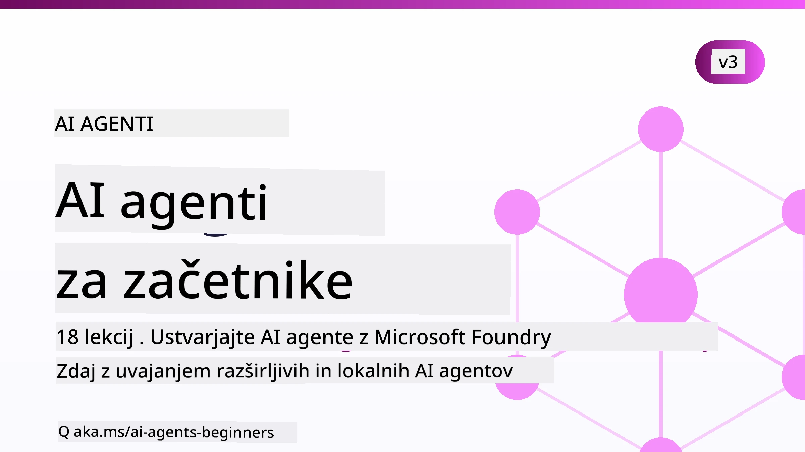

# AI agenti za začetnike - tečaj



## Tečaj, ki vas nauči vse, kar morate vedeti za začetek izdelave AI agentov

[](https://github.com/microsoft/ai-agents-for-beginners/blob/master/LICENSE?WT.mc_id=academic-105485-koreyst)
[](https://GitHub.com/microsoft/ai-agents-for-beginners/graphs/contributors/?WT.mc_id=academic-105485-koreyst)
[](https://GitHub.com/microsoft/ai-agents-for-beginners/issues/?WT.mc_id=academic-105485-koreyst)
[](https://GitHub.com/microsoft/ai-agents-for-beginners/pulls/?WT.mc_id=academic-105485-koreyst)
[](http://makeapullrequest.com?WT.mc_id=academic-105485-koreyst)

### 🌐 Podpora za več jezikov

#### Podprto prek GitHub Action (avtomatizirano in vedno posodobljeno)

<!-- CO-OP TRANSLATOR LANGUAGES TABLE START -->
[Arabski](../ar/README.md) | [Bengalski](../bn/README.md) | [Bolgarščina](../bg/README.md) | [Burmanski (Mjanmar)](../my/README.md) | [Kitajski (poenostavljen)](../zh-CN/README.md) | [Kitajski (tradicionalni, Hong Kong)](../zh-HK/README.md) | [Kitajski (tradicionalni, Macau)](../zh-MO/README.md) | [Kitajski (tradicionalni, Tajvan)](../zh-TW/README.md) | [Hrvaščina](../hr/README.md) | [Češčina](../cs/README.md) | [Danščina](../da/README.md) | [Nizozemščina](../nl/README.md) | [Estonščina](../et/README.md) | [Finščina](../fi/README.md) | [Francoščina](../fr/README.md) | [Nemščina](../de/README.md) | [Grščina](../el/README.md) | [Hebrejščina](../he/README.md) | [Hinduščina](../hi/README.md) | [Madžarščina](../hu/README.md) | [Indonezijščina](../id/README.md) | [Italijanščina](../it/README.md) | [Japonščina](../ja/README.md) | [Kannada](../kn/README.md) | [Khmer](../km/README.md) | [Korejščina](../ko/README.md) | [Litovščina](../lt/README.md) | [Malajščina](../ms/README.md) | [Malayalam](../ml/README.md) | [Marathi](../mr/README.md) | [Nepalščina](../ne/README.md) | [Nigerijski pidgin](../pcm/README.md) | [Norveščina](../no/README.md) | [Perzijščina (Farsi)](../fa/README.md) | [Poljščina](../pl/README.md) | [Portugalski (Brazilija)](../pt-BR/README.md) | [Portugalski (Portugalska)](../pt-PT/README.md) | [Punjabi (Gurmukhi)](../pa/README.md) | [Romunščina](../ro/README.md) | [Ruščina](../ru/README.md) | [Srbščina (cirilica)](../sr/README.md) | [Slovaščina](../sk/README.md) | [Slovenščina](./README.md) | [Španščina](../es/README.md) | [Svahili](../sw/README.md) | [Švedščina](../sv/README.md) | [Tagalog (filipinski)](../tl/README.md) | [Tamilščina](../ta/README.md) | [Telugu](../te/README.md) | [Tajščina](../th/README.md) | [Turščina](../tr/README.md) | [Ukrajinščina](../uk/README.md) | [Urdu](../ur/README.md) | [Vietnamščina](../vi/README.md)

> **Raje klonirate lokalno?**
>
> Ta repozitorij vključuje več kot 50 prevodov, zaradi česar se velikost prenosa znatno poveča. Za kloniranje brez prevodov uporabite sparse checkout:
>
> **Bash / macOS / Linux:**
> ```bash
> git clone --filter=blob:none --sparse https://github.com/microsoft/ai-agents-for-beginners.git
> cd ai-agents-for-beginners
> git sparse-checkout set --no-cone '/*' '!translations' '!translated_images'
> ```
>
> **CMD (Windows):**
> ```cmd
> git clone --filter=blob:none --sparse https://github.com/microsoft/ai-agents-for-beginners.git
> cd ai-agents-for-beginners
> git sparse-checkout set --no-cone "/*" "!translations" "!translated_images"
> ```
>
> Tako boste dobili vse potrebno za dokončanje tečaja z veliko hitrejšim prenosom.
<!-- CO-OP TRANSLATOR LANGUAGES TABLE END -->

**Če želite podpreti dodatne jezike prevodov, so ti navedeni [tukaj](https://github.com/Azure/co-op-translator/blob/main/getting_started/supported-languages.md).**

[](https://GitHub.com/microsoft/ai-agents-for-beginners/watchers/?WT.mc_id=academic-105485-koreyst)
[](https://GitHub.com/microsoft/ai-agents-for-beginners/network/?WT.mc_id=academic-105485-koreyst)
[](https://GitHub.com/microsoft/ai-agents-for-beginners/stargazers/?WT.mc_id=academic-105485-koreyst)

[](https://discord.com/invite/ATgtXmAS5D)


## 🌱 Začetek

Ta tečaj vsebuje lekcije, ki pokrivajo osnove izdelave AI agentov. Vsaka lekcija pokriva svojo temo, zato začnite kjerkoli želite!

Ta tečaj ima podporo za več jezikov. Obiščite naše [razpoložljive jezike tukaj](#-multi-language-support). 

Če je to vaš prvič, da delate z generativnimi AI modeli, si oglejte naš tečaj [Generative AI For Beginners](https://aka.ms/genai-beginners), ki vključuje 21 lekcij o izdelavi z GenAI.

Ne pozabite [ozvezditi (🌟) tega repozitorija](https://docs.github.com/en/get-started/exploring-projects-on-github/saving-repositories-with-stars?WT.mc_id=academic-105485-koreyst) in [viliciti ta repozitorij](https://github.com/microsoft/ai-agents-for-beginners/fork), da boste lahko uporabljali kodo.

### Spoznajte druge učence, dobite odgovore na svoja vprašanja

Če se zataknete ali imate kakršna koli vprašanja o izdelavi AI agentov, se pridružite našemu namenskem Discord kanalu v [Microsoft Foundry Discord](https://aka.ms/ai-agents/discord).

### Kaj potrebujete 

Vsaka lekcija tega tečaja vključuje primerke kode, ki jih najdete v mapi code_samples. Lahko [vilicite ta repozitorij](https://github.com/microsoft/ai-agents-for-beginners/fork), da ustvarite svojo kopijo.  

Primeri kode v teh vajah uporabljajo Microsoft Agent Framework z Microsoft Foundry Agent Service V2:

- [Microsoft Foundry](https://aka.ms/ai-agents-beginners/ai-foundry) - zahtevani Azure račun

Ta tečaj uporablja naslednje okvirje in storitve AI agentov od Microsofta:

- [Microsoft Agent Framework (MAF)](https://aka.ms/ai-agents-beginners/agent-framework)
- [Microsoft Foundry Agent Service V2](https://aka.ms/ai-agents-beginners/ai-agent-service)

Nekateri primeri kode podpirajo tudi alternativne ponudnike združljive z OpenAI, kot je [MiniMax](https://platform.minimaxi.com/), ki ponuja modele z velikim kontekstom (do 204K tokenov). Za podrobnosti o nastavitvah glejte [Course Setup](./00-course-setup/README.md).

Za več informacij o zagonu kode za ta tečaj obiščite [Course Setup](./00-course-setup/README.md).

## 🙏 Želite pomagati?

Imate predloge ali ste našli napake v pravopisu ali kodi? [Odprite težavo](https://github.com/microsoft/ai-agents-for-beginners/issues?WT.mc_id=academic-105485-koreyst) ali [ustvarite pull request](https://github.com/microsoft/ai-agents-for-beginners/pulls?WT.mc_id=academic-105485-koreyst)


## 📂 Vsaka lekcija vsebuje

- Pisno lekcijo, ki je v datoteki README, in kratek video
- Python primere kode, ki uporabljajo Microsoft Agent Framework z Microsoft Foundry
- Povezave do dodatnih virov za nadaljevanje učenja


## 🗃️ Lekcije

| **Lekcija**                                   | **Besedilo in koda**                                    | **Video**                                                  | **Dodatno učenje**                                                                     |
|----------------------------------------------|----------------------------------------------------|------------------------------------------------------------|----------------------------------------------------------------------------------------|
| Uvod v AI agente in primere uporabe agentov  | [Povezava](./01-intro-to-ai-agents/README.md)          | [Video](https://youtu.be/3zgm60bXmQk?si=z8QygFvYQv-9WtO1)  | [Povezava](https://aka.ms/ai-agents-beginners/collection?WT.mc_id=academic-105485-koreyst) |
| Raziščite AI agentni okvirji                   | [Povezava](./02-explore-agentic-frameworks/README.md)  | [Video](https://youtu.be/ODwF-EZo_O8?si=Vawth4hzVaHv-u0H)  | [Povezava](https://aka.ms/ai-agents-beginners/collection?WT.mc_id=academic-105485-koreyst) |
| Razumevanje vzorcev načrtovanja AI agentov    | [Povezava](./03-agentic-design-patterns/README.md)     | [Video](https://youtu.be/m9lM8qqoOEA?si=BIzHwzstTPL8o9GF)  | [Povezava](https://aka.ms/ai-agents-beginners/collection?WT.mc_id=academic-105485-koreyst) |
| Vzorec uporabe orodij                         | [Povezava](./04-tool-use/README.md)                    | [Video](https://youtu.be/vieRiPRx-gI?si=2z6O2Xu2cu_Jz46N)  | [Povezava](https://aka.ms/ai-agents-beginners/collection?WT.mc_id=academic-105485-koreyst) |
| Agentic RAG                                  | [Povezava](./05-agentic-rag/README.md)                 | [Video](https://youtu.be/WcjAARvdL7I?si=gKPWsQpKiIlDH9A3)  | [Povezava](https://aka.ms/ai-agents-beginners/collection?WT.mc_id=academic-105485-koreyst) |
| Izdelava zaupanja vrednih AI agentov         | [Povezava](./06-building-trustworthy-agents/README.md) | [Video](https://youtu.be/iZKkMEGBCUQ?si=jZjpiMnGFOE9L8OK ) | [Povezava](https://aka.ms/ai-agents-beginners/collection?WT.mc_id=academic-105485-koreyst) |
| Vzorec načrtovanja                             | [Povezava](./07-planning-design/README.md)             | [Video](https://youtu.be/kPfJ2BrBCMY?si=6SC_iv_E5-mzucnC)  | [Povezava](https://aka.ms/ai-agents-beginners/collection?WT.mc_id=academic-105485-koreyst) |
| Vzorec za večagentno načrtovanje              | [Povezava](./08-multi-agent/README.md)                 | [Video](https://youtu.be/V6HpE9hZEx0?si=rMgDhEu7wXo2uo6g)  | [Povezava](https://aka.ms/ai-agents-beginners/collection?WT.mc_id=academic-105485-koreyst) |

| Vzorec metakognicije                   | [Povezava](./09-metacognition/README.md)               | [Video](https://youtu.be/His9R6gw6Ec?si=8gck6vvdSNCt6OcF)  | [Povezava](https://aka.ms/ai-agents-beginners/collection?WT.mc_id=academic-105485-koreyst) |
| AI agenti v produkciji                 | [Povezava](./10-ai-agents-production/README.md)        | [Video](https://youtu.be/l4TP6IyJxmQ?si=31dnhexRo6yLRJDl)  | [Povezava](https://aka.ms/ai-agents-beginners/collection?WT.mc_id=academic-105485-koreyst) |
| Uporaba agentnih protokolov (MCP, A2A in NLWeb) | [Povezava](./11-agentic-protocols/README.md)           | [Video](https://youtu.be/X-Dh9R3Opn8)                                 | [Povezava](https://aka.ms/ai-agents-beginners/collection?WT.mc_id=academic-105485-koreyst) |
| Inženiring konteksta za AI agente      | [Povezava](./12-context-engineering/README.md)         | [Video](https://youtu.be/F5zqRV7gEag)                                 | [Povezava](https://aka.ms/ai-agents-beginners/collection?WT.mc_id=academic-105485-koreyst) |
| Upravljanje agentnega spomina          | [Povezava](./13-agent-memory/README.md)     |      [Video](https://youtu.be/QrYbHesIxpw?si=vZkVwKrQ4ieCcIPx)                                                      |                                                                                        |
| Raziskovanje Microsoft agentnega ogrodja | [Povezava](./14-microsoft-agent-framework/README.md)                            |                                                            |                                                                                        |
| Gradnja agentov za uporabo računalnika (CUA) | [Povezava](./15-browser-use/README.md)     |                                                            | [Povezava](https://docs.browser-use.com/examples/templates/playwright-integration)         |
| Uvajanje razširljivih agentov          | [Povezava](./16-deploying-scalable-agents/README.md) |                                                    | [Povezava](https://learn.microsoft.com/azure/ai-foundry/agents/overview)                   |
| Ustvarjanje lokalnih AI agentov         | [Povezava](./17-creating-local-ai-agents/README.md)  |                                                    | [Povezava](https://learn.microsoft.com/azure/ai-foundry/foundry-local/)                    |
| Zavarovanje AI agentov                 | [Povezava](./18-securing-ai-agents/README.md)  |                                                            | [Povezava](https://aka.ms/ai-agents-beginners/collection?WT.mc_id=academic-105485-koreyst) |

## 🎒 Drugi tečaji

Naša ekipa pripravlja tudi druge tečaje! Oglejte si:

<!-- CO-OP TRANSLATOR OTHER COURSES START -->
### LangChain
[](https://aka.ms/langchain4j-for-beginners)
[](https://aka.ms/langchainjs-for-beginners?WT.mc_id=m365-94501-dwahlin)
[](https://github.com/microsoft/langchain-for-beginners?WT.mc_id=m365-94501-dwahlin)
---

### Azure / Edge / MCP / Agenti
[](https://github.com/microsoft/AZD-for-beginners?WT.mc_id=academic-105485-koreyst)
[](https://github.com/microsoft/edgeai-for-beginners?WT.mc_id=academic-105485-koreyst)
[](https://github.com/microsoft/mcp-for-beginners?WT.mc_id=academic-105485-koreyst)
[](https://github.com/microsoft/ai-agents-for-beginners?WT.mc_id=academic-105485-koreyst)

---
 
### Serija generativne AI
[](https://github.com/microsoft/generative-ai-for-beginners?WT.mc_id=academic-105485-koreyst)
[-9333EA?style=for-the-badge&labelColor=E5E7EB&color=9333EA)](https://github.com/microsoft/Generative-AI-for-beginners-dotnet?WT.mc_id=academic-105485-koreyst)
[-C084FC?style=for-the-badge&labelColor=E5E7EB&color=C084FC)](https://github.com/microsoft/generative-ai-for-beginners-java?WT.mc_id=academic-105485-koreyst)
[-E879F9?style=for-the-badge&labelColor=E5E7EB&color=E879F9)](https://github.com/microsoft/generative-ai-with-javascript?WT.mc_id=academic-105485-koreyst)

---
 
### Osnovno učenje
[](https://aka.ms/ml-beginners?WT.mc_id=academic-105485-koreyst)
[](https://aka.ms/datascience-beginners?WT.mc_id=academic-105485-koreyst)
[](https://aka.ms/ai-beginners?WT.mc_id=academic-105485-koreyst)
[](https://github.com/microsoft/Security-101?WT.mc_id=academic-96948-sayoung)
[](https://aka.ms/webdev-beginners?WT.mc_id=academic-105485-koreyst)
[](https://aka.ms/iot-beginners?WT.mc_id=academic-105485-koreyst)
[](https://github.com/microsoft/xr-development-for-beginners?WT.mc_id=academic-105485-koreyst)

---
 
### Serija Copilot
[](https://aka.ms/GitHubCopilotAI?WT.mc_id=academic-105485-koreyst)
[](https://github.com/microsoft/mastering-github-copilot-for-dotnet-csharp-developers?WT.mc_id=academic-105485-koreyst)
[](https://github.com/microsoft/CopilotAdventures?WT.mc_id=academic-105485-koreyst)
<!-- CO-OP TRANSLATOR OTHER COURSES END -->

## 🌟 Zahvala skupnosti

Zahvala [Shivamu Goyalu](https://www.linkedin.com/in/shivam2003/) za prispevek pomembnih kodnih primerov, ki prikazujejo Agentic RAG.

## Prispevanje

Ta projekt sprejema prispevke in predloge. Večina prispevkov zahteva, da se strinjate s
Pogodbo o licenci prispevka (CLA), s katero izjavljate, da imate pravico in dejansko dovolite
uporabo vašega prispevka. Za podrobnosti obiščite <https://cla.opensource.microsoft.com>.

Ko oddate zahtevo za združitev (pull request), bo bot CLA samodejno ugotovil, ali morate
predložiti CLA in ustrezno označil PR (npr. statusni pregled, komentar). Preprosto sledite
navodilom bota. To boste morali storiti samo enkrat za vse repozitorije, ki uporabljajo naš CLA.

Ta projekt je sprejel [Microsoftov kodeks ravnanja za odprto kodo](https://opensource.microsoft.com/codeofconduct/).
Za več informacij glejte [Pogosta vprašanja o kodeksu ravnanja](https://opensource.microsoft.com/codeofconduct/faq/) ali
se obrnite na [opencode@microsoft.com](mailto:opencode@microsoft.com) za dodatna vprašanja ali komentarje.

## Trgovske znamke

Ta projekt lahko vsebuje trgovske znamke ali logotipe za projekte, izdelke ali storitve. Dovoljena uporaba Microsoftovih
trgovskih znamk ali logotipov je podvržena in mora slediti
[Microsoftovim smernicam za uporabo trgovskih znamk in blagovnih znamk](https://www.microsoft.com/legal/intellectualproperty/trademarks/usage/general).
Uporaba Microsoftovih trgovskih znamk ali logotipov v spremenjenih različicah tega projekta ne sme povzročiti zmede ali nakazovati Microsoftovega sponzorstva.
Vsaka uporaba trgovskih znamk ali logotipov tretjih oseb je podrejena politikam teh tretjih oseb.

## Iskanje pomoči


Če se zataknete ali imate kakršnakoli vprašanja o gradnji AI aplikacij, se pridružite:

[](https://aka.ms/foundry/discord)

Če imate povratne informacije o izdelku ali napake med razvojem, obiščite:

[](https://aka.ms/foundry/forum)

---

<!-- CO-OP TRANSLATOR DISCLAIMER START -->
**Omejitev odgovornosti**:
Ta dokument je bil preveden z uporabo AI prevajalske storitve [Co-op Translator](https://github.com/Azure/co-op-translator). Čeprav si prizadevamo za natančnost, vas prosimo, da upoštevate, da avtomatizirani prevodi lahko vsebujejo napake ali netočnosti. Izvirni dokument v njegovem izvirnem jeziku je treba obravnavati kot avtoritativni vir. Za kritične informacije je priporočljiv strokovni človeški prevod. Ne odgovarjamo za morebitna nesporazume ali napačne interpretacije, ki izhajajo iz uporabe tega prevoda.
<!-- CO-OP TRANSLATOR DISCLAIMER END -->