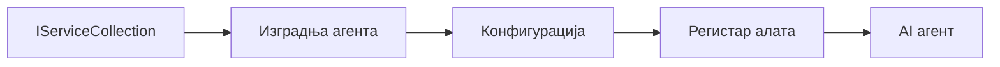

# 🎨 Agentic Дизајн Паттерни са Azure OpenAI (Responses API) (.NET)

## 📋 Циљеви учења

Овај пример показује дизајн паттерне предузећа за израду интелигентних агената користећи Microsoft Agent Framework у .NET-у са интеграцијом Azure OpenAI (Responses API). Научићете професионалне паттерне и архитектонске приступе који чине агенте спремним за производњу, одрживим и скалабилним.

### Дизајн паттерни предузећа

- 🏭 **Factory паттерн**: Стандардизовано креирање агената са dependency injection
- 🔧 **Builder паттерн**: Плавиран конфигурација и подешавање агената
- 🧵 **Thread-Safe паттерни**: Управљање конколрентним конверзацијама
- 📋 **Repository паттерн**: Организовано управљање алатима и могућностима

## 🎯 .NET-Специфичне Архитектонске Предности

### Карактеристике предузећа

- **Strong Typing**: Валидација у време компилације и IntelliSense подршка
- **Dependency Injection**: Укључена интеграција DI контејнера
- **Управљање Конфигурацијом**: IConfiguration и Options паттерни
- **Async/Await**: Прва класа асинхрони програмски подршка

### Паттерни спремни за производњу

- **Интеграција евиденције**: ILogger и структурирана евиденција
- **Контрола здравља**: Уграђено праћење и дијагностика
- **Валидација конфигурације**: Јака типизација са анотацијама података
- **Обрада грешака**: Структурирано управљање изузецима

## 🔧 Техничка архитектура

### Основне .NET компоненте

- **Microsoft.Extensions.AI**: Унифициране абстракције AI сервиса
- **Microsoft.Agents.AI**: Фрејмворк за оркестрацију агената предузећа
- **Azure OpenAI (Responses API)**: Паттерни клијента API-а високе перформансе
- **Систем конфигурације**: appsettings.json и интеграција окружења

### Имплементација дизајн паттерна



## 🏗️ Приказани паттерни предузећа

### 1. **Креирајући паттерни**

- **Agent Factory**: Централизовано креирање агената са конзистентном конфигурацијом
- **Builder паттерн**: Fluent API за сложену конфигурацију агената
- **Singleton паттерн**: Заједнички ресурси и управљање конфигурацијом
- **Dependency Injection**: Лагано повезивање и тестабилност

### 2. **Паттерни понашања**

- **Strategy паттерн**: Мењиве стратегије извршења алата
- **Command паттерн**: Енкапсулиране операције агената са undo/redo
- **Observer паттерн**: Управљање животним циклусом агената засновано на догађајима
- **Template Method**: Стандардизовани токови извршења агената

### 3. **Структурни паттерни**

- **Adapter паттерн**: Интеграциони слој Azure OpenAI (Responses API)
- **Decorator паттерн**: Побољшање могућности агената
- **Facade паттерн**: Поједностављени интерфејси за интеракцију са агентом
- **Proxy паттерн**: Лењо учитавање и кеширање ради перформанси

## 📚 .NET Принципи дизајна

### SOLID принципи

- **Single Responsibility**: Свакој компоненти једна јасна сврха
- **Open/Closed**: Проширив без измена
- **Liskov Substitution**: Имплементације алата базиране на интерфејсима
- **Interface Segregation**: Фокусирани, кохезивни интерфејси
- **Dependency Inversion**: Зависи од абстракција, а не од конкретних имплементација

### Чиста архитектура

- **Domain Layer**: Основне апстракције агената и алата
- **Application Layer**: Оркестрација агената и токови рада
- **Infrastructure Layer**: Интеграција Azure OpenAI (Responses API) и екстерних сервиса
- **Presentation Layer**: Корисничка интеракција и форматирање одговора

## 🔒 Разматрања предузећа

### Безбедност

- **Управљање креденцијалима**: Безбедно руковање API кључевима са IConfiguration
- **Валидација уноса**: Јака типизација и валидација помоћу анотација података
- **Санирање излаза**: Безбедна обрада и филтрирање одговора
- **Аудит логовање**: Комплетно праћење операција

### Перформансе

- **Async паттерни**: Не-блокирајуће I/O операције
- **Connection Pooling**: Ефикасно управљање HTTP клијентом
- **Кеширање**: Кеширање одговора за побољшане перформансе
- **Управљање ресурсима**: Исправно одлагање и образац чишћења

### Скалабилност

- **Thread Safety**: Подршка за конкурентно извршење агената
- **Resource Pooling**: Ефикасна искоришћеност ресурса
- **Load Management**: Ограничење брзине и руковање оптерећењем
- **Надгледање**: Метричке перформанси и здравствени прегледи

## 🚀 Деплојмент у производњу

- **Управљање конфигурацијом**: Поставке специфичне за окружење
- **Стратегија евиденције**: Структурирана евиденција са Correlation ID-јевима
- **Обрада грешака**: Глобално руковођење изузецима са исправним опоравком
- **Надгледање**: Application Insights и бројачи перформанси
- **Тестирање**: Јединични тестови, интеграциони тестови и паттерни оптерећења

Спремни да градите интелигентне агенте предузећа са .NET-ом? Ајде да архитектирамо нешто робусно! 🏢✨

## 🚀 Како почети

### Захтеви

- [.NET 10 SDK](https://dotnet.microsoft.com/download/dotnet/10.0) или новији
- Azure претплата са Azure OpenAI ресурсом и имплементацијом модела
- Azure CLI — пријавите се помоћу `az login`

### Потребне променљиве окружења

```bash
# zsh/bash
export AZURE_OPENAI_ENDPOINT=https://<your-resource>.openai.azure.com
export AZURE_OPENAI_DEPLOYMENT=gpt-5-mini
# Затим се пријавите како би AzureCliCredential могао да добије токен
az login
```

```powershell
# PowerShell
$env:AZURE_OPENAI_ENDPOINT = "https://<your-resource>.openai.azure.com"
$env:AZURE_OPENAI_DEPLOYMENT = "gpt-5-mini"
# Затим се пријавите да би AzureCliCredential могао да добије токен
az login
```

### Пример кода

Да бисте покренули пример кода,

```bash
# zsh/bash
chmod +x ./03-dotnet-agent-framework.cs
./03-dotnet-agent-framework.cs
```

Или користећи dotnet CLI:

```bash
dotnet run ./03-dotnet-agent-framework.cs
```

Погледајте [`03-dotnet-agent-framework.cs`](../../../../03-agentic-design-patterns/code_samples/03-dotnet-agent-framework.cs) за комплетан код.

```csharp
#!/usr/bin/dotnet run

#:package Microsoft.Extensions.AI@10.*
#:package Microsoft.Agents.AI.OpenAI@1.*-*
#:package Azure.AI.OpenAI@2.1.0
#:package Azure.Identity@1.13.1

using System.ComponentModel;

using Microsoft.Agents.AI;
using Microsoft.Extensions.AI;

using Azure.AI.OpenAI;
using Azure.Identity;

// Tool Function: Random Destination Generator
// This static method will be available to the agent as a callable tool
// The [Description] attribute helps the AI understand when to use this function
// This demonstrates how to create custom tools for AI agents
[Description("Provides a random vacation destination.")]
static string GetRandomDestination()
{
    // List of popular vacation destinations around the world
    // The agent will randomly select from these options
    var destinations = new List<string>
    {
        "Paris, France",
        "Tokyo, Japan",
        "New York City, USA",
        "Sydney, Australia",
        "Rome, Italy",
        "Barcelona, Spain",
        "Cape Town, South Africa",
        "Rio de Janeiro, Brazil",
        "Bangkok, Thailand",
        "Vancouver, Canada"
    };

    // Generate random index and return selected destination
    // Uses System.Random for simple random selection
    var random = new Random();
    int index = random.Next(destinations.Count);
    return destinations[index];
}

// Azure OpenAI with the Responses API (stable v1 endpoint). Sign in with `az login`.
var azureEndpoint = Environment.GetEnvironmentVariable("AZURE_OPENAI_ENDPOINT")
    ?? throw new InvalidOperationException("AZURE_OPENAI_ENDPOINT is not set.");
var deployment = Environment.GetEnvironmentVariable("AZURE_OPENAI_DEPLOYMENT") ?? "gpt-5-mini";

var azureClient = new AzureOpenAIClient(new Uri(azureEndpoint), new AzureCliCredential());

// Define Agent Identity and Comprehensive Instructions
// Agent name for identification and logging purposes
var AGENT_NAME = "TravelAgent";

// Detailed instructions that define the agent's personality, capabilities, and behavior
// This system prompt shapes how the agent responds and interacts with users
var AGENT_INSTRUCTIONS = """
You are a helpful AI Agent that can help plan vacations for customers.

Important: When users specify a destination, always plan for that location. Only suggest random destinations when the user hasn't specified a preference.

When the conversation begins, introduce yourself with this message:
"Hello! I'm your TravelAgent assistant. I can help plan vacations and suggest interesting destinations for you. Here are some things you can ask me:
1. Plan a day trip to a specific location
2. Suggest a random vacation destination
3. Find destinations with specific features (beaches, mountains, historical sites, etc.)
4. Plan an alternative trip if you don't like my first suggestion

What kind of trip would you like me to help you plan today?"

Always prioritize user preferences. If they mention a specific destination like "Bali" or "Paris," focus your planning on that location rather than suggesting alternatives.
""";

// Create AI Agent with Advanced Travel Planning Capabilities
// Get the Responses client for the deployment and create the AI agent
// Configure agent with name, detailed instructions, and available tools
// This demonstrates the .NET agent creation pattern with full configuration
AIAgent agent = azureClient
    .GetChatClient(deployment)
    .AsAIAgent(
        name: AGENT_NAME,
        instructions: AGENT_INSTRUCTIONS,
        tools: [AIFunctionFactory.Create(GetRandomDestination)]
    );

// Create New Conversation Session for Context Management
// Initialize a new conversation session to maintain context across multiple interactions
// Sessions enable the agent to remember previous exchanges and maintain conversational state
// This is essential for multi-turn conversations and contextual understanding
var session = await agent.CreateSessionAsync();

// Execute Agent: First Travel Planning Request
// Run the agent with an initial request that will likely trigger the random destination tool
// The agent will analyze the request, use the GetRandomDestination tool, and create an itinerary
// Using the session parameter maintains conversation context for subsequent interactions
await foreach (var update in agent.RunStreamingAsync("Plan me a day trip", session))
{
    await Task.Delay(10);
    Console.Write(update);
}

Console.WriteLine();

// Execute Agent: Follow-up Request with Context Awareness
// Demonstrate contextual conversation by referencing the previous response
// The agent remembers the previous destination suggestion and will provide an alternative
// This showcases the power of conversation sessions and contextual understanding in .NET agents
await foreach (var update in agent.RunStreamingAsync("I don't like that destination. Plan me another vacation.", session))
{
    await Task.Delay(10);
    Console.Write(update);
}
```

---

<!-- CO-OP TRANSLATOR DISCLAIMER START -->
**Изјава о одрицању одговорности**:
Овај документ је преведен коришћењем услуге за аутоматски превод [Co-op Translator](https://github.com/Azure/co-op-translator). Иако тежимо тачности, имајте у виду да аутоматски преводи могу садржати грешке или нетачности. Оригинални документ на његовом изворном језику треба сматрати ауторитативним извором. За критичне информације препоручује се професионални људски превод. Нисмо одговорни за било каква неспоразума или погрешна тумачења која произилазе из коришћења овог превода.
<!-- CO-OP TRANSLATOR DISCLAIMER END -->