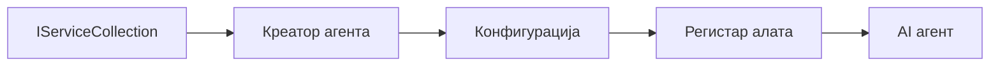

# 🎨 Обрасци агентског дизајна са Azure OpenAI (Responses API) (.NET)

## 📋 Циљеви учења

Овај пример демонстрира предузетничке обрасце дизајна за изградњу интелигентних агената користећи Microsoft Agent Framework у .NET-у интегрисан са Azure OpenAI (Responses API). Учите професионалне обрасце и архитектонске приступе који агенате чине спремним за производњу, одрживим и скалабилним.

### Предузетнички обрасци дизајна

- 🏭 **Factory Pattern**: Стандаризована креирања агената са dependency injection
- 🔧 **Builder Pattern**: Флуентна конфигурација и подешавање агената
- 🧵 **Thread-Safe Patterns**: Савремено управљање разговорима
- 📋 **Repository Pattern**: Организовано управљање алаткама и способностима

## 🎯 Архитектонске предности специфичне за .NET

### Карактеристике предузећа

- **Strong Typing**: Валидација у време компилације и подршка IntelliSense-а
- **Dependency Injection**: Уграђена интеграција DI контејнера
- **Configuration Management**: IConfiguration и Options обрасци
- **Async/Await**: Подршка за асинхрони програмски приступ првог реда

### Обрасци спремни за производњу

- **Logging Integration**: Подршка ILogger-а и структурисаног логовања
- **Health Checks**: Уграђени надзор и дијагностика
- **Configuration Validation**: Јака типизација са анотацијама података
- **Error Handling**: Структурисано управљање изузецима

## 🔧 Техничка архитектура

### Основне .NET компоненте

- **Microsoft.Extensions.AI**: Уједињене апстракције AI услуга
- **Microsoft.Agents.AI**: Предузетнички оквир за оркестрацију агената
- **Azure OpenAI (Responses API)**: Обрасци клијентa API високих перформанси
- **Configuration System**: appsettings.json и интеграција окружења

### Имплементација обрасца дизајна



## 🏗️ Приказани предузетнички обрасци

### 1. **Креирајући обрасци**

- **Agent Factory**: Централизовано креирање агената са конзистентном конфигурацијом
- **Builder Pattern**: Флуентни API за комплексну конфигурацију агената
- **Singleton Pattern**: Заједничко управљање ресурсима и конфигурацијом
- **Dependency Injection**: Слаба повезаност и тестирање

### 2. **Понашајни обрасци**

- **Strategy Pattern**: Интерпретабилне стратегије извршавања алата
- **Command Pattern**: Енкапсулиране операције агената са undo/redo функцијама
- **Observer Pattern**: Догађајима вођено управљање животним циклусом агената
- **Template Method**: Стандаризовани токови извршења агената

### 3. **Структурни обрасци**

- **Adapter Pattern**: Слој интеграције Azure OpenAI (Responses API)
- **Decorator Pattern**: Побољшање способностa агената
- **Facade Pattern**: Поједностављени интерфејси за интеракцију са агентом
- **Proxy Pattern**: Лено учитавање и кеширање ради перформанси

## 📚 .NET принципи дизајна

### SOLID принципи

- **Single Responsibility**: Свака компонента има једну јасну сврху
- **Open/Closed**: Проширив без модификација
- **Liskov Substitution**: Имплементације алата на бази интерфејса
- **Interface Segregation**: Фокусирани и кохезивни интерфејси
- **Dependency Inversion**: Зависи од апстракција, не од конкретног

### Чиста архитектура

- **Domain Layer**: Основне апстракције агената и алата
- **Application Layer**: Оркестрација агената и токова рада
- **Infrastructure Layer**: Интеграција Azure OpenAI (Responses API) и екстерне услуге
- **Presentation Layer**: Корисничка интеракција и форматирање одговора

## 🔒 Предузетнички аспекти

### Безбедност

- **Credential Management**: Сигурно руковање API кључевима са IConfiguration-ом
- **Input Validation**: Јака типизација и валидација анотацијама података
- **Output Sanitization**: Сигурна обрада и филтрирање одговора
- **Audit Logging**: Комплетно праћење операција

### Перформансе

- **Async Patterns**: Не-блокирајуће I/O операције
- **Connection Pooling**: Ефикасно управљање HTTP клијентом
- **Caching**: Кеширање одговора за побољшане перформансе
- **Resource Management**: Правилни обрасци чишћења и ослобађања ресурса

### Скалабилност

- **Thread Safety**: Подршка конкурентном извршавању агената
- **Resource Pooling**: Ефикасна употреба ресурса
- **Load Management**: Ограничење учесталости и руковање притиском
- **Monitoring**: Метрике перформанси и здравствене провере

## 🚀 Производна имплементација

- **Configuration Management**: Подешавања специфична за окружење
- **Logging Strategy**: Структурисано логовање са корелационим ID-јевима
- **Error Handling**: Глобално руковање изузецима са одговарајућим опоравком
- **Monitoring**: Application insights и бројачи перформанси
- **Testing**: Јединични тестови, интеграциони тестови и обрасци тестирања оптерећења

Спремни сте да изградите интелигентне агенте предузетничког нивоа са .NET-ом? Хајде да архитектурамо нешто робусно! 🏢✨

## 🚀 Почетак рада

### Предуслови

- [.NET 10 SDK](https://dotnet.microsoft.com/download/dotnet/10.0) или новији
- [Azure претплата](https://azure.microsoft.com/free/) са Azure OpenAI ресурсом и имплементацијом модела
- [Azure CLI](https://learn.microsoft.com/cli/azure/install-azure-cli) — пријавите се помоћу `az login`

### Потребне променљиве окружења

```bash
# zsh/bash
export AZURE_OPENAI_ENDPOINT=https://<your-resource>.openai.azure.com
export AZURE_OPENAI_DEPLOYMENT=gpt-4.1-mini
# Затим се пријавите да би AzureCliCredential могао да добије токен
az login
```

```powershell
# PowerShell
$env:AZURE_OPENAI_ENDPOINT = "https://<your-resource>.openai.azure.com"
$env:AZURE_OPENAI_DEPLOYMENT = "gpt-4.1-mini"
# Затим се пријавите да би AzureCliCredential могао да добије токен
az login
```

### Пример кода

За покретање примера кода,

```bash
# зш/баш
chmod +x ./03-dotnet-agent-framework.cs
./03-dotnet-agent-framework.cs
```

Или користећи dotnet CLI:

```bash
dotnet run ./03-dotnet-agent-framework.cs
```

Погледајте [`03-dotnet-agent-framework.cs`](../../../../03-agentic-design-patterns/code_samples/03-dotnet-agent-framework.cs) за комплетан код.

```csharp
#!/usr/bin/dotnet run

#:package Microsoft.Extensions.AI@10.*
#:package Microsoft.Agents.AI.OpenAI@1.*-*
#:package Azure.AI.OpenAI@2.1.0
#:package Azure.Identity@1.13.1

using System.ComponentModel;

using Microsoft.Agents.AI;
using Microsoft.Extensions.AI;

using Azure.AI.OpenAI;
using Azure.Identity;

// Tool Function: Random Destination Generator
// This static method will be available to the agent as a callable tool
// The [Description] attribute helps the AI understand when to use this function
// This demonstrates how to create custom tools for AI agents
[Description("Provides a random vacation destination.")]
static string GetRandomDestination()
{
    // List of popular vacation destinations around the world
    // The agent will randomly select from these options
    var destinations = new List<string>
    {
        "Paris, France",
        "Tokyo, Japan",
        "New York City, USA",
        "Sydney, Australia",
        "Rome, Italy",
        "Barcelona, Spain",
        "Cape Town, South Africa",
        "Rio de Janeiro, Brazil",
        "Bangkok, Thailand",
        "Vancouver, Canada"
    };

    // Generate random index and return selected destination
    // Uses System.Random for simple random selection
    var random = new Random();
    int index = random.Next(destinations.Count);
    return destinations[index];
}

// Azure OpenAI with the Responses API (stable v1 endpoint). Sign in with `az login`.
var azureEndpoint = Environment.GetEnvironmentVariable("AZURE_OPENAI_ENDPOINT")
    ?? throw new InvalidOperationException("AZURE_OPENAI_ENDPOINT is not set.");
var deployment = Environment.GetEnvironmentVariable("AZURE_OPENAI_DEPLOYMENT") ?? "gpt-4.1-mini";

var azureClient = new AzureOpenAIClient(new Uri(azureEndpoint), new AzureCliCredential());

// Define Agent Identity and Comprehensive Instructions
// Agent name for identification and logging purposes
var AGENT_NAME = "TravelAgent";

// Detailed instructions that define the agent's personality, capabilities, and behavior
// This system prompt shapes how the agent responds and interacts with users
var AGENT_INSTRUCTIONS = """
You are a helpful AI Agent that can help plan vacations for customers.

Important: When users specify a destination, always plan for that location. Only suggest random destinations when the user hasn't specified a preference.

When the conversation begins, introduce yourself with this message:
"Hello! I'm your TravelAgent assistant. I can help plan vacations and suggest interesting destinations for you. Here are some things you can ask me:
1. Plan a day trip to a specific location
2. Suggest a random vacation destination
3. Find destinations with specific features (beaches, mountains, historical sites, etc.)
4. Plan an alternative trip if you don't like my first suggestion

What kind of trip would you like me to help you plan today?"

Always prioritize user preferences. If they mention a specific destination like "Bali" or "Paris," focus your planning on that location rather than suggesting alternatives.
""";

// Create AI Agent with Advanced Travel Planning Capabilities
// Get the Responses client for the deployment and create the AI agent
// Configure agent with name, detailed instructions, and available tools
// This demonstrates the .NET agent creation pattern with full configuration
AIAgent agent = azureClient
    .GetChatClient(deployment)
    .AsAIAgent(
        name: AGENT_NAME,
        instructions: AGENT_INSTRUCTIONS,
        tools: [AIFunctionFactory.Create(GetRandomDestination)]
    );

// Create New Conversation Session for Context Management
// Initialize a new conversation session to maintain context across multiple interactions
// Sessions enable the agent to remember previous exchanges and maintain conversational state
// This is essential for multi-turn conversations and contextual understanding
var session = await agent.CreateSessionAsync();

// Execute Agent: First Travel Planning Request
// Run the agent with an initial request that will likely trigger the random destination tool
// The agent will analyze the request, use the GetRandomDestination tool, and create an itinerary
// Using the session parameter maintains conversation context for subsequent interactions
await foreach (var update in agent.RunStreamingAsync("Plan me a day trip", session))
{
    await Task.Delay(10);
    Console.Write(update);
}

Console.WriteLine();

// Execute Agent: Follow-up Request with Context Awareness
// Demonstrate contextual conversation by referencing the previous response
// The agent remembers the previous destination suggestion and will provide an alternative
// This showcases the power of conversation sessions and contextual understanding in .NET agents
await foreach (var update in agent.RunStreamingAsync("I don't like that destination. Plan me another vacation.", session))
{
    await Task.Delay(10);
    Console.Write(update);
}
```

---

<!-- CO-OP TRANSLATOR DISCLAIMER START -->
**Изјава о одрицању одговорности**:
Овај документ је преведен коришћењем услуге за аутоматски превод [Co-op Translator](https://github.com/Azure/co-op-translator). Иако тежимо тачности, имајте у виду да аутоматски преводи могу садржати грешке или нетачности. Оригинални документ на његовом изворном језику треба сматрати ауторитативним извором. За критичне информације препоручује се професионални људски превод. Нисмо одговорни за било каква неспоразума или погрешна тумачења која произилазе из коришћења овог превода.
<!-- CO-OP TRANSLATOR DISCLAIMER END -->