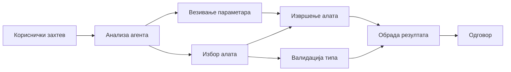

# 🛠️ Напредна употреба алата са Azure OpenAI (Responses API) (.NET)

## 📋 Циљеви учења

Овај нотебоок демонстрира обрасце интеграције алата за пословни ниво користећи Microsoft Agent Framework у .NET са Azure OpenAI (Responses API). Научићете како да изградите софистициране агенте са више специјализованих алата, користећи снажну типизацију C# и пословне могућности .NET-а.

### Напредне могућности алата које ћете савладати

- 🔧 **Архитектура са више алата**: Изградња агената са више специјализованих функција
- 🎯 **Сигурно извршење алата по типу**: Коришћење компајл времена провере у C#
- 📊 **Обрасци за корпоративне алате**: Дизајн алата спремних за производњу и руковање грешкама
- 🔗 **Композиција алата**: Комбиновање алата за комплексне пословне токове

## 🎯 Предности .NET архитектуре алата

### Пословне карактеристике алата

- **Провера у време компајлирања**: Снажна типизација осигурава исправност параметара алата
- **Убризгавање зависности**: Интеграција IoC контејнера за управљање алатима
- **Async/Await обрасци**: Неблокирајуће извршење алата са исправним управљањем ресурсима
- **Структурирано логовање**: Уграђена интеграција за праћење извршења алата

### Обрасци спремни за производњу

- **Руковање изузецима**: Свеобухватно управљање грешкама са типизованим изузецима
- **Управљање ресурсима**: Исправни обрасци за ослобађање ресурса и управљање меморијом
- **Праћење перформанси**: Уграђени метрици и бројачи перформанси
- **Управљање конфигурацијом**: Сигурна конфигурација по типу са валидацијом

## 🔧 Техничка архитектура

### Основне .NET компоненте алата

- **Microsoft.Extensions.AI**: Јединисани слој апстракције алата
- **Microsoft.Agents.AI**: Оркестрација алата за корпоративни ниво
- **Azure OpenAI (Responses API)**: Високо перформантни API клијент са пулом веза

### Поницајна линија извршења алата



## 🛠️ Категорије и обрасци алата

### 1. **Алати за обраду података**

- **Валидација уноса**: Снажна типизација са анотацијама података
- **Операције трансформације**: Сигурна по типу конверзија и форматирање података
- **Пословна логика**: Алати за израчунавање и анализу специфичну за домен
- **Форматирање излаза**: Генерисање структурираних одговора

### 2. **Интеграциони алати**

- **API конектори**: Интеграција RESTful сервиса са HttpClient
- **Базе података**: Entity Framework интеграција за приступ подацима
- **Рад са фајловима**: Безбедне операције над фајловима са валидацијом
- **Спољни сервиси**: Обрасци интеграције сервисa трећих страна

### 3. **Корисни алати**

- **Обрада текста**: Манипулација стрингова и алати за форматирање
- **Операције са датумом/временом**: Израчунавања датума и времена у складу са културом
- **Математички алати**: Прецизни израчунавања и статистичке операције
- **Алатке за валидацију**: Валидација пословних правила и провера података

Спремни да направите агенте за корпоративни ниво са моћним, сигурним алатима по типу у .NET? Хајде да осмислимо професионална решења! 🏢⚡

## 🚀 Почетак рада

### Неопходни услови

- [.NET 10 SDK](https://dotnet.microsoft.com/download/dotnet/10.0) или новији
- [Azure претплата](https://azure.microsoft.com/free/) са Azure OpenAI ресурсом и распоређеним моделом
- [Azure CLI](https://learn.microsoft.com/cli/azure/install-azure-cli) — пријавите се помоћу `az login`

### Потребне системске променљиве

```bash
# zsh/bash
export AZURE_OPENAI_ENDPOINT=https://<your-resource>.openai.azure.com
export AZURE_OPENAI_DEPLOYMENT=gpt-4.1-mini
# Затим се пријавите да би AzureCliCredential могао да добије токен
az login
```

```powershell
# PowerShell
$env:AZURE_OPENAI_ENDPOINT = "https://<your-resource>.openai.azure.com"
$env:AZURE_OPENAI_DEPLOYMENT = "gpt-4.1-mini"
# Затим се пријавите како би AzureCliCredential могао да добије токен
az login
```

### Пример кода

Да бисте покренули пример кода,

```bash
# зш/баш
chmod +x ./04-dotnet-agent-framework.cs
./04-dotnet-agent-framework.cs
```

Или користећи dotnet CLI:

```bash
dotnet run ./04-dotnet-agent-framework.cs
```

Погледајте [`04-dotnet-agent-framework.cs`](../../../../04-tool-use/code_samples/04-dotnet-agent-framework.cs) за комплетан код.

```csharp
#!/usr/bin/dotnet run

#:package Microsoft.Extensions.AI@10.*
#:package Microsoft.Agents.AI.OpenAI@1.*-*
#:package Azure.AI.OpenAI@2.1.0
#:package Azure.Identity@1.13.1

using System.ComponentModel;

using Microsoft.Agents.AI;
using Microsoft.Extensions.AI;

using Azure.AI.OpenAI;
using Azure.Identity;

// Tool Function: Random Destination Generator
// This static method will be available to the agent as a callable tool
// The [Description] attribute helps the AI understand when to use this function
// This demonstrates how to create custom tools for AI agents
[Description("Provides a random vacation destination.")]
static string GetRandomDestination()
{
    // List of popular vacation destinations around the world
    // The agent will randomly select from these options
    var destinations = new List<string>
    {
        "Paris, France",
        "Tokyo, Japan",
        "New York City, USA",
        "Sydney, Australia",
        "Rome, Italy",
        "Barcelona, Spain",
        "Cape Town, South Africa",
        "Rio de Janeiro, Brazil",
        "Bangkok, Thailand",
        "Vancouver, Canada"
    };

    // Generate random index and return selected destination
    // Uses System.Random for simple random selection
    var random = new Random();
    int index = random.Next(destinations.Count);
    return destinations[index];
}

// Azure OpenAI with the Responses API (stable v1 endpoint). Sign in with `az login`.
var azureEndpoint = Environment.GetEnvironmentVariable("AZURE_OPENAI_ENDPOINT")
    ?? throw new InvalidOperationException("AZURE_OPENAI_ENDPOINT is not set.");
var deployment = Environment.GetEnvironmentVariable("AZURE_OPENAI_DEPLOYMENT") ?? "gpt-4.1-mini";

var azureClient = new AzureOpenAIClient(new Uri(azureEndpoint), new AzureCliCredential());

// Define Agent Identity and Comprehensive Instructions
// Agent name for identification and logging purposes
var AGENT_NAME = "TravelAgent";

// Detailed instructions that define the agent's personality, capabilities, and behavior
// This system prompt shapes how the agent responds and interacts with users
var AGENT_INSTRUCTIONS = """
You are a helpful AI Agent that can help plan vacations for customers.

Important: When users specify a destination, always plan for that location. Only suggest random destinations when the user hasn't specified a preference.

When the conversation begins, introduce yourself with this message:
"Hello! I'm your TravelAgent assistant. I can help plan vacations and suggest interesting destinations for you. Here are some things you can ask me:
1. Plan a day trip to a specific location
2. Suggest a random vacation destination
3. Find destinations with specific features (beaches, mountains, historical sites, etc.)
4. Plan an alternative trip if you don't like my first suggestion

What kind of trip would you like me to help you plan today?"

Always prioritize user preferences. If they mention a specific destination like "Bali" or "Paris," focus your planning on that location rather than suggesting alternatives.
""";

// Create AI Agent with Advanced Travel Planning Capabilities
// Get the Responses client for the deployment and create the AI agent
// Configure agent with name, detailed instructions, and available tools
// This demonstrates the .NET agent creation pattern with full configuration
AIAgent agent = azureClient
    .GetChatClient(deployment)
    .AsAIAgent(
        name: AGENT_NAME,
        instructions: AGENT_INSTRUCTIONS,
        tools: [AIFunctionFactory.Create(GetRandomDestination)]
    );

// Create New Conversation Session for Context Management
// Initialize a new conversation session to maintain context across multiple interactions
// Sessions enable the agent to remember previous exchanges and maintain conversational state
// This is essential for multi-turn conversations and contextual understanding
await using var session = await agent.CreateSessionAsync();

// Execute Agent: First Travel Planning Request
// Run the agent with an initial request that will likely trigger the random destination tool
// The agent will analyze the request, use the GetRandomDestination tool, and create an itinerary
// Using the session parameter maintains conversation context for subsequent interactions
await foreach (var update in agent.RunStreamingAsync("Plan me a day trip", session))
{
    await Task.Delay(10);
    Console.Write(update);
}

Console.WriteLine();

// Execute Agent: Follow-up Request with Context Awareness
// Demonstrate contextual conversation by referencing the previous response
// The agent remembers the previous destination suggestion and will provide an alternative
// This showcases the power of conversation sessions and contextual understanding in .NET agents
await foreach (var update in agent.RunStreamingAsync("I don't like that destination. Plan me another vacation.", session))
{
    await Task.Delay(10);
    Console.Write(update);
}
```

---

<!-- CO-OP TRANSLATOR DISCLAIMER START -->
**Изјава о одрицању одговорности**:
Овај документ је преведен коришћењем услуге за аутоматски превод [Co-op Translator](https://github.com/Azure/co-op-translator). Иако тежимо тачности, имајте у виду да аутоматски преводи могу садржати грешке или нетачности. Оригинални документ на његовом изворном језику треба сматрати ауторитативним извором. За критичне информације препоручује се професионални људски превод. Нисмо одговорни за било каква неспоразума или погрешна тумачења која произилазе из коришћења овог превода.
<!-- CO-OP TRANSLATOR DISCLAIMER END -->