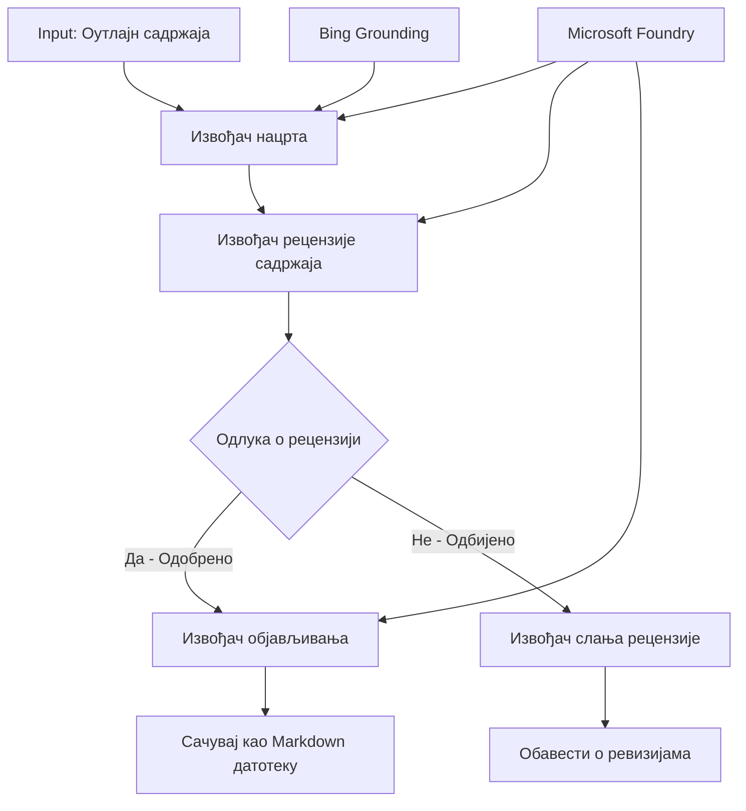

# 🔀 Условни токови агената са Microsoft Foundry (.NET)

## 📋 Туторијал о интелигентним токовима заснованим на одлукама

Овај нотебоок демонстрира **условне обрасце радних токова** користећи Microsoft Foundry и Microsoft Agent Framework за .NET. Научићете како да изградите софистициране, одлукама вођене токове који интелигентно усмеравају обраду на основу АИ анализе, пословних правила и динамичких услова за аутоматизацију на нивоу предузећа.

## 🎯 Циљеви учења

### 🧠 **Архитектура интелигентних одлука**
- **Имплементација условне логике**: Изградња сложених стабала одлука са више разгранатака
- **Роутинг покретан АИ**: Користите Microsoft Foundry моделе за интелигентне одлуке о усмеравању
- **Динамична адаптација тока рада**: Модификовање понашања тока на основу анализе у време извршења и услова
- **Интеграција пословних правила за предузеће**: Укључивање пословне логике и захтева усаглашености у токове рада

### 🔀 **Напредни условни обрасци**
- **Доношење одлука на више критеријума**: Процена више фактора за одлуке о усмеравању
- **Обрада свесна контекста**: Доношење одлука на основу акумулираног контекста и историје тока рада
- **Прилагодљива модификација тока рада**: Динамичко подешавање путева обраде на основу услова у реалном времену
- **Интеграција мотора правила**: Имплементација софистицираних пословних мотора правила у токове рада

### 🏢 **Условне апликације за предузећа**
- **Класификација и усмеравање докумената**: Аутоматска класификација и усмеравање докумената у одговарајуће токове рада
- **Тријажа корисничке службе**: Интелигентно усмеравање корисничких упита ка специјализованим тимовима за обраду
- **Усклађеност и обработка ризика**: Применa различитих валидационих и прегледних процеса на основу процене ризика
- **Токови рада за контролу квалитета**: Усмеравање садржаја кроз одговарајуће прегледне процесе на основу метрика квалитета

## ⚙️ Захтеви и подешавање

### 📦 **Потребни NuGet пакети**

Напредни пакети за обраду условних токова рада:

```xml
<!-- Core AI Framework -->
<PackageReference Include="Microsoft.Extensions.AI" Version="9.9.0" />

<!-- Azure AI Agents with Persistent State -->
<PackageReference Include="Azure.AI.Agents.Persistent" Version="1.2.0-beta.5" />

<!-- Azure Identity and Utilities -->
<PackageReference Include="Azure.Identity" Version="1.15.0" />
<PackageReference Include="System.Linq.Async" Version="6.0.3" />
<PackageReference Include="DotNetEnv" Version="3.1.1" />

<!-- Local Workflow Framework References -->
<!-- Microsoft.Agents.Workflows.dll - Advanced workflow orchestration -->
<!-- Microsoft.Agents.AI.AzureAI.dll - Microsoft Foundry integration -->
<!-- Microsoft.Agents.AI.dll - Core agent abstractions -->
```

### 🔑 **Конфигурација Microsoft Foundry**

**Потребни Azure ресурси:**
- Радни простор Microsoft Foundry са моделима за условну обраду
- Azure претплата са одговарајућим квотама и дозволама за рачунарство
- Распорђени АИ модели за доношење одлука и анализу садржаја
- (Опционо) Веза са Bing Search API за пребацивање темеља

**Конфигурација окружења (.env фајл):**
```env
# Microsoft Foundry Configuration
AZURE_AI_PROJECT_ENDPOINT=https://your-project.cognitiveservices.azure.com/
BING_CONNECTION_ID=your-bing-connection-id
```

**Подешавање аутентификације:**
```csharp
// Azure CLI or Managed Identity authentication
using Azure.Identity;
var credential = new AzureCliCredential();

// Load environment configuration
DotNetEnv.Env.Load("../../../.env");
```

### 🏗️ **Архитектура условног тока рада**



**Кључне компоненте:**
- **Draft Executor**: АИ агент који креира почетне нацрте садржаја из оквира
- **Content Review Executor**: АИ агент који процењује квалитет и усаглашеност нацрта
- **Conditional Routing**: Логика одлука која усмерава на основу резултата прегледа
- **Publish/Review Paths**: Одвојени прелазни путеви за одобрени и одбачени садржај
- **Управљање стањем**: Одржава контекст садржаја и прегледа кроз цео ток рада

## 🎨 **Обрасци дизајна условних токова рада**

### 📋 **Производња садржаја са контролним капијама квалитета**
```
Outline → Draft Creation → Quality Review → {Approve: Publish | Reject: Revise}
```

### 🎯 **Обрада докумената заснована на ризику**
```
Document → Risk Assessment → {Low: Standard | High: Enhanced Review}
```

### 🔍 **Интелигентно усмеравање корисничке службе**
```
Customer Query → Analysis → {Simple: FAQ Bot | Complex: Human Agent}
```

### 💼 **Токови рада усмерени на усаглашеност**
```
Content → Compliance Check → {Pass: Publish | Fail: Legal Review}
```

## 🏢 **Предности условних токова за предузећа**

### 🎯 **Интелигентна аутоматизација**
- **Паметно доношење одлука**: Одлуке о усмеравању покретане АИ на основу анализе садржаја и контекста
- **Прилагодљива обрада**: Токови рада који се аутоматски прилагођавају променљивим условима
- **Примена пословних правила**: Аутоматска примена сложене пословне логике и политика
- **Усмеравање свесно контекста**: Одлуке засноване на целокупној историји тока рада и акумулираном контексту

### 📈 **Оперативна изврсност**
- **Оптимизована расподела ресурса**: Усмеравање рада ка најодговарајућим стручњацима и процесима
- **Смањена ручна интервенција**: Аутоматизовано доношење одлука минимизира потребу за људским усмеравањем
- **Бржа решења**: Директно усмеравање ка одговарајућој експертизи и могућностима обраде
- **Конзистентна примена**: Једнака примена пословних правила и критеријума одлука

### 🛡️ **Управљање ризицима и усаглашеност**
- **Аутоматска процена ризика**: АИ покретана оцена нивоа ризика садржаја и ситуације
- **Примена усаглашености**: Аутоматско упућивање кроз потребне регулаторне процесе
- **Примена безбедносних протокола**: Појачане мере безбедности примене на основу процене ризика
- **Одржавање ревизионог трага**: Потпуна документација одлука о усмеравању и образложења

### 📊 **Аналитика и континуирано унапређење**
- **Аналитика одлука**: Праћење ефикасности и тачности одлука о усмеравању
- **Препознавање образаца**: Идентификовање трендова и образаца у одлукама о усмеравању током времена
- **Оптимизација перформанси**: Континуирано унапређење критеријума одлука и ефикасности усмеравања
- **Пословна интелигенција**: Увид у карактеристике садржаја и захтеве обраде

### 🔧 **Техничка изврсност**
- **Стално управљање стањем**: Одржавање сложеног стања током извршења тока рада
- **Масивна архитектура**: Руководи захтевима за условном обрадом великог обима
- **Капацитети интеграције**: Беспрекорна интеграција са постојећим пословним системима и процесима
- **Праћење и видљивост**: Свеобухватно праћење перформанси тока рада и доношења одлука

Хајде да изградимо интелигентне, одлукама вођене токове рада за предузећа са .NET! 🚀

## 💻 Покретање кода

Комплетна имплементација доступна је у `04.dotnet-agent-framework-workflow-aifoundry-condition.cs`. Ово демонстрира **ток производње садржаја са контролним капијама квалитета**:

### 🏗️ **Архитектура тока рада**

```
Content Outline → Draft Creation → Quality Review → Conditional Routing:
                                                      ├─ Approved (>200 words) → Publish
                                                      └─ Rejected (<200 words) → Review Notification
```

**Агенти у току рада:**
1. **Evangelist Agent**: Креира туторијалне нацрте из оквира са Bing претрагом
2. **Content Reviewer Agent**: Оцењује квалитет нацрта (број речи, потпуност)
3. **Publisher Agent**: Снима одобрени садржај као фајлове са временским жигом у Markdown формату

**Прилагођени извршиоци:**
1. **DraftExecutor**: Организује креирање нацрта
2. **ContentReviewExecutor**: Спроводи процену квалитета
3. **PublishExecutor**: Руководи објављивањем одобреног садржаја
4. **SendReviewExecutor**: Управља обавештењима о одбаченом садржају

### 🚀 Покретање примера

**Пре захтева:**
- Конфигурисан Microsoft Foundry радни простор
- Аутентификација Azure CLI (`az login`)
- (Опционо) Веза са Bing Search за пребацивање темеља

```bash
# Направите скрипту извршном (Unix/Linux/macOS)
chmod +x 04.dotnet-agent-framework-workflow-aifoundry-condition.cs

# Покрените условни ток рада
./04.dotnet-agent-framework-workflow-aifoundry-condition.cs
```

Или на Windows:
```powershell
dotnet run 04.dotnet-agent-framework-workflow-aifoundry-condition.cs
```

### 📝 Очекивани резултат

Ток рада ће:
1. **Креирати агенте**: Иницијализовати три специјализована Microsoft Foundry агента
2. **Генерисати нацрт**: Evangelist агент креира туторијални нацрт из оквира
3. **Прегледати садржај**: Content Reviewer оцењује квалитет нацрта
4. **Условно усмеравање**:
   - **Ако је одобрено (>200 речи)**: Publish executor чува као Markdown фајл
   - **Ако је одбачено (<200 речи)**: Слање обавештења о прегледу
5. **Приказати резултате**: Приказ крајњег исхода тока рада

### 🔧 Опције прилагођавања

**Модификујте критеријуме прегледа:**
```csharp
const string ContentReviewerInstructions = @"
You are a content reviewer...
1. Check if content is more than 500 words (instead of 200)
2. Verify technical accuracy
3. Ensure proper formatting
...";
```

**Додајте више условних путева:**
```csharp
var workflow = new WorkflowBuilder(draftExecutor)
    .AddEdge(draftExecutor, contentReviewerExecutor)
    .AddEdge(contentReviewerExecutor, publishExecutor, condition: GetCondition("Excellent"))
    .AddEdge(contentReviewerExecutor, editExecutor, condition: GetCondition("Good"))
    .AddEdge(contentReviewerExecutor, sendReviewerExecutor, condition: GetCondition("Poor"))
    .Build();
```

**Промените захтеве за садржај:**
```csharp
string OUTLINE_Content = @"
# Your Custom Topic
## Section 1
https://your-reference-url
## Section 2
...
";
```

### 🎯 Примене у стварном свету

Овај образац условног тока рада идеалан је за:
- **Системи за управљање садржајем**: Аутоматизовани уреднички токови са контролним капијама квалитета
- **Обрада докумената**: Усмеравање докумената на основу класификације и усаглашености
- **Корисничка подршка**: Интелигентно усмеравање тикета на основу комплексности и хитности
- **Правни преглед**: Усмеравање уговора на основу процене ризика и вредности
- **ХР процеси**: Усмеравање апликација кроз одговарајуће скрининшке токове рада

### 🔍 Разумевање условне логике

**Функција услова:**
```csharp
public Func<object?, bool> GetCondition(string expectedResult) =>
    reviewResult => reviewResult is ReviewResult review && review.Result == expectedResult;
```

Ова функција прави предикат који:
1. Проверава да ли је резултат типа `ReviewResult`
2. Упоређује својство `Result` са очекиваном вредношћу
3. Враћа true/false за одређивање усмеравања

**Ивице тока рада са условима:**
```csharp
.AddEdge(contentReviewerExecutor, publishExecutor, condition: GetCondition("Yes"))
.AddEdge(contentReviewerExecutor, sendReviewerExecutor, condition: GetCondition("No"))
```

### 📊 Напредне функције

**Валидација JSON шеме:**
Ток рада користи JSON шеме за осигурање структурираних одговора:

```csharp
// Define response structure
public class ReviewResult
{
    [JsonPropertyName("review_result")]
    public string Result { get; set; } = string.Empty;
    
    [JsonPropertyName("reason")]
    public string Reason { get; set; } = string.Empty;
    
    [JsonPropertyName("draft_content")]
    public string DraftContent { get; set; } = string.Empty;
}

// Apply to agent
ResponseFormat = ChatResponseFormat.ForJsonSchema(
    AIJsonUtilities.CreateJsonSchema(typeof(ReviewResult)), 
    "ReviewResult", 
    "Review Result From DraftContent"
)
```

**Интеграција Bing умећења:**
Evangelist агент користи Bing умећење за приступ информацијама у реалном времену:

```csharp
var bingGroundingConfig = new BingGroundingSearchConfiguration(bing_conn_id);
BingGroundingToolDefinition bingGroundingTool = new(
    new BingGroundingSearchToolParameters([bingGroundingConfig])
);
```

Ово омогућава агенту да прати URL-ове у оквиру и извлачи актуелне информације.

### 🛡️ Обрада грешака

Ток рада укључује робустну обраду грешака за одбачени садржај:
- Неуспеси у прегледу покрећу алтернативни пут
- Обавештења пружају јасне разлоге одбијања
- Садржај се чува за ревизију

### 🔄 Проширење тока рада

**Додајте круг ревизије:**
Креирајте петљу повратних информација која аутоматски поново креира садржај:

```csharp
.AddEdge(contentReviewerExecutor, publishExecutor, condition: GetCondition("Yes"))
.AddEdge(contentReviewerExecutor, draftExecutor, condition: GetCondition("No")) // Loop back
```

**Имплементирајте вишестепени преглед:**
Додајте више фаза прегледа са различитим критеријумима:

```csharp
.AddEdge(draftExecutor, technicalReviewer)
.AddEdge(technicalReviewer, editorialReviewer, condition: GetCondition("TechPass"))
.AddEdge(editorialReviewer, publishExecutor, condition: GetCondition("EditPass"))
```

Овај образац условног тока рада пружа темељ за изградњу софистицираних, интелигентних система аутоматизације за предузећа! 🚀

---

<!-- CO-OP TRANSLATOR DISCLAIMER START -->
**Изјава о одрицању одговорности**:
Овај документ је преведен коришћењем услуге за аутоматски превод [Co-op Translator](https://github.com/Azure/co-op-translator). Иако тежимо тачности, имајте у виду да аутоматски преводи могу садржати грешке или нетачности. Оригинални документ на његовом изворном језику треба сматрати ауторитативним извором. За критичне информације препоручује се професионални људски превод. Нисмо одговорни за било каква неспоразума или погрешна тумачења која произилазе из коришћења овог превода.
<!-- CO-OP TRANSLATOR DISCLAIMER END -->