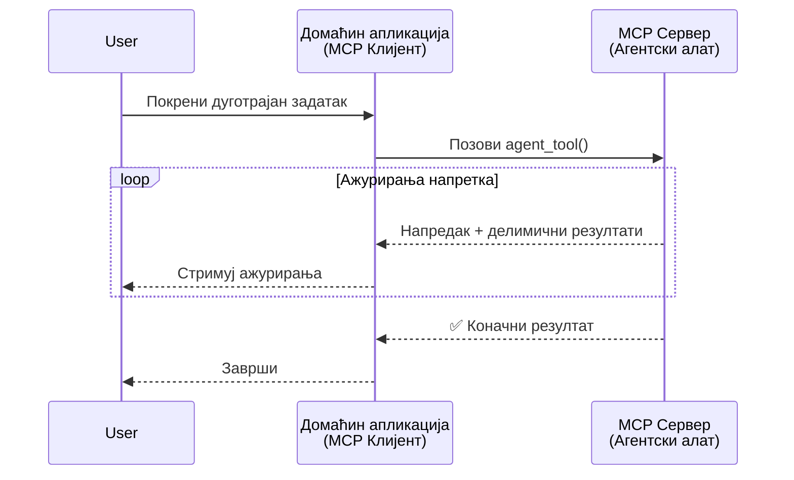
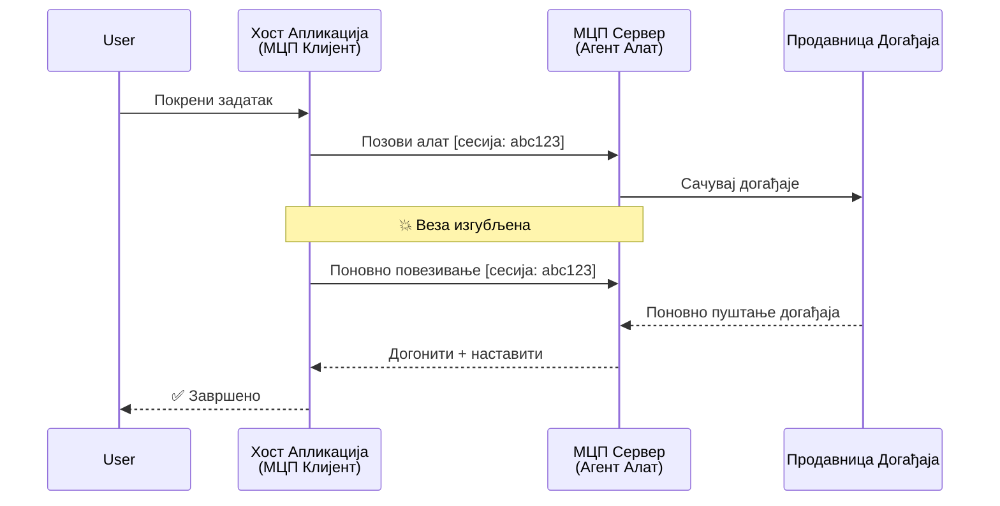
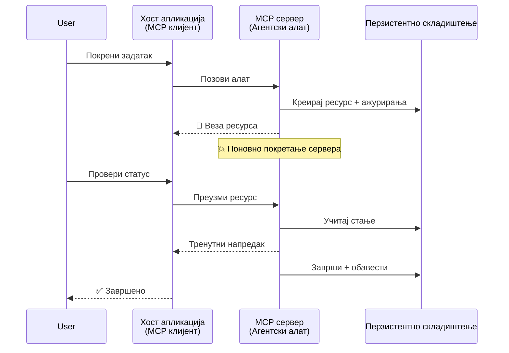
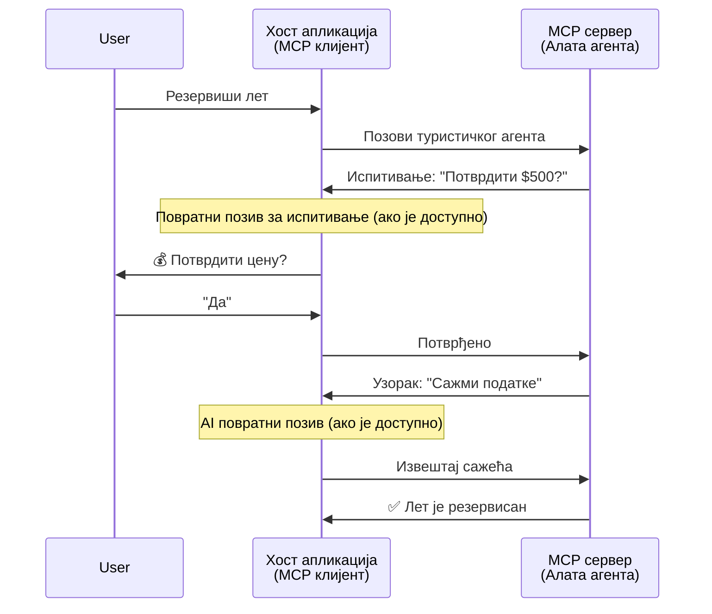
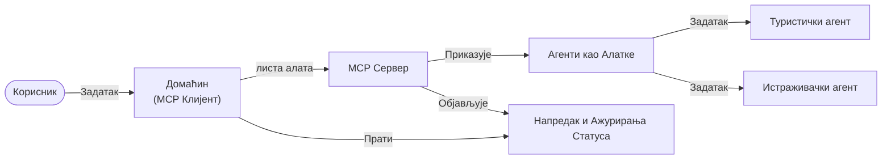

# Изградња система комуникације агент-према-агенту помоћу MCP

> Резиме - Можете ли изградити агент2агент комуникацију на MCP? Можете!

MCP се значајно развио изван своје почетне сврхе „пружања контекста LLM-овима“. Уз недавна побољшања као што су [поновљиви токови](https://modelcontextprotocol.io/docs/concepts/transports#resumability-and-redelivery), [истраживање](https://modelcontextprotocol.io/specification/2025-06-18/client/elicitation), [узорковање](https://modelcontextprotocol.io/specification/2025-06-18/client/sampling) и обавештења ([прогрес](https://modelcontextprotocol.io/specification/2025-06-18/basic/utilities/progress) и [ресурси](https://modelcontextprotocol.io/specification/2025-06-18/schema#resourceupdatednotification)), MCP сада пружа солидну основу за изградњу сложених система комуникације агент-према-агенту.

## Погрешан појам о Агенту/Алату

Како све више програмера истражује алате са агентским понашањима (који раде дуго, могу захтевати додатни унос током извршења итд.), уобичајена погрешна перцепција је да MCP није погодан, углавном зато што су рани примери његових алата били примитивни и фокусирани на једноставне шаблоне захтева-одговора.

Ова перцепција је застарела. MCP спецификација је значајно побољшана у последњих неколико месеци новим могућностима које смањују јаз у изградњи дугорочног агентског понашања:

- **Стреаминг и Делимични резултати**: Ажурирања напретка у реалном времену током извршења
- **Поновљивост**: Клијенти могу поново да се повежу и наставе након прекида везе
- **Трајност**: Резултати преживљавају поновне покрете сервера (нпр. путем линкова ка ресурсима)
- **Вишеокретни дијалог**: Интерактивни унос током извршења преко истраживања и узорковања

Ове функције се могу комбиновати како би омогућиле сложене агентске и вишенаменске апликације, све распоређене на MCP протоколу.

За референтну употребу, агент ћемо називати „алатом“ који је доступан на MCP серверу. Ово подразумева постојање апликације домаћина која имплементира MCP клијента, која успоставља сесију са MCP сервером и може позвати агента.

## Шта чини MCP алат „агентским“?

Пре него што пређемо на имплементацију, хајде да утврдимо које инфраструктурне могућности су потребне за подршку дугорочним агентима.

> Ми ћемо агента дефинисати као ентитет који може аутономно радити у продуженим периодима, способан да обрађује сложене задатке који могу захтевати више интеракција или прилагођавања у реалном времену.

### 1. Стреаминг и Делимични резултати

Традиционални шаблони захтев-одговор не раде за дуготрајне задатке. Агенти треба да обезбеде:

- Ажурирања напретка у реалном времену
- Прелиминарне резултате

**Подршка у MCP-у**: Обавештења о ажурирању ресурса омогућавају стреаминг делимичних резултата, мада је потребан опрезан дизајн да би се избегли конфликти са JSON-RPC моделом 1:1 захтева/одговора.

| Карактеристика               | Случај коришћења                                                                                                                                                                  | Подршка у MCP-у                                                                             |
| ---------------------------- | ------------------------------------------------------------------------------------------------------------------------------------------------------------------------------- | -------------------------------------------------------------------------------------------- |
| Ажурирања напретка у реалном времену | Корисник тражи задатак миграције кодне базе. Агенат струјно шаље напредак: „10% - Анализа зависности... 25% - Претварање TypeScript фајлова... 50% - Ажурирање увоза...“           | ✅ Обавештења о напретку                                                                     |
| Делимични резултати          | Задатак „Генериши књигу“ струјно шаље делимичне резултате, нпр. 1) Обрис приче, 2) Листа поглавља, 3) Сваки поглавље по завршетку. Домаћин може да проверава, отказује или преусмерава у било ком тренутку. | ✅ Обавештења могу бити „проширена“ да укључују делимичне резултате, видети предлоге на PR 383, 776 |

<div align="center" style="font-style: italic; font-size: 0.95em; margin-bottom: 0.5em;">
<strong>Слика 1:</strong> Овај дијаграм илуструје како MCP агент струјно шаље ажурирања напретка у реалном времену и делимичне резултате апликацији домаћина током дугог задатка, омогућавајући кориснику праћење извршења у реалном времену.
</div>



### 2. Поновљивост

Агенти морају глатко да управљају прекидима мреже:

- Повезивање након (клијентског) прекида
- Наставак од места где су стали (поново слање порука)

**Подршка у MCP-у**: MCP StreamableHTTP транспорт данас подржава наставак сесије и поновно слање порука уз помоћ ID сесије и последњег ID догађаја. Важно је напоменути да сервер мора да имплементира EventStore који омогућава репродукцију догађаја при поновном повезивању клијента.  
Имајући у виду, постоји предлог заједнице (PR #975) који истражује транспорта-агностичне резимабилне токове.

| Карактеристика | Случај коришћења                                                                                                                                                    | Подршка у MCP-у                                                           |
| -------------- | ------------------------------------------------------------------------------------------------------------------------------------------------------------------- | ------------------------------------------------------------------------- |
| Поновљивост    | Клијент се прекида током дугог задатка. При поновном повезивању, сесија се наставља са поновним пуштањем пропуштених догађаја, неприметно настављајући од места прекида. | ✅ StreamableHTTP транспорт са ID сесије, реплаy догађаја и EventStore     |

<div align="center" style="font-style: italic; font-size: 0.95em; margin-bottom: 0.5em;">
<strong>Слика 2:</strong> Овај дијаграм приказује како MCP-ов StreamableHTTP транспорт и EventStore омогућавају неприметан наставак сесије: ако се клијент искључи, може се поново повезати и репродуковати пропуштене догађаје, настављајући задатак без губитка напретка.
</div>



### 3. Трајност

Дуготрајни агенти захтевају упоран статус:

- Резултати преживљавају поновне покрете сервера
- Статус се може вановати ван везе
- Праћење напретка кроз сесије

**Подршка у MCP-у**: MCP сада подржава Resource link тип повратка за позиве алата. Данас је могући образац дизајна алата који креира ресурс и одмах враћа линк ресурса. Алат може наставити да рукује задатком у позадини и ажурира ресурс. Клијент пак може да бира да ли ће полл-овати стање овог ресурса за делимичне или пуне резултате (у зависности од тога које ресурсе сервер ажурира) или да се претплати на ресурс ради обавештења о промени.

Једно ограничење је то што полл-овање ресурса или претплата за ажурирања може конзумирати ресурсе са последицама на скали. Постоји отворени предлог заједнице (укључујући #992) који истражује могућност укључивања webhooks или тригера које сервер може позвати ради обавештавања клијента/домаћинске апликације о ажурирањима.

| Карактеристика | Случај коришћења                                                                                                                                          | Подршка у MCP-у                                                    |
| ------------- | --------------------------------------------------------------------------------------------------------------------------------------------------------- | ------------------------------------------------------------------ |
| Трајност      | Сервер се сруши током задатка миграције података. Резултати и напредак преживљавају поновни покретач, клијент може проверити статус и наставити са упорним ресурсом. | ✅ Линкови ка ресурсима са упорним складиштем и обавештењима о статусу |

Данас је чест образац дизајна алата који креира ресурс и одмах враћа линк ресурса. Алат може у позадини обрађивати задатак, слати обавештења о ресурсу која служе као ажурирања напретка или укључују делимичне резултате, и ажурирати садржај у ресурсу по потреби.

<div align="center" style="font-style: italic; font-size: 0.95em; margin-bottom: 0.5em;">
<strong>Слика 3:</strong> Овај дијаграм показује како MCP агенти користе упорне ресурсе и обавештења о статусу да би осигурали да дуготрајни задаци преживе поновне покрете сервера, омогућавајући клијентима да проверавају напредак и преузимају резултате чак и након кварова.
</div>



### 4. Вишеокретне интеракције

Агенти често захтевају додатни унос током извршења:

- Људска појашњења или одобрења
- AI помоћ за сложене одлуке
- Динамичка подешавања параметара

**Подршка у MCP-у**: Потпуно подржано преко узорковања (за AI унос) и истраживања (за људски унос).

| Карактеристика             | Случај коришћења                                                                                                                                      | Подршка у MCP-у                                       |
| ------------------------- | ----------------------------------------------------------------------------------------------------------------------------------------------------- | ----------------------------------------------------- |
| Вишеокретне интеракције  | Агент за резервацију путовања тражи потврду цене од корисника, затим тражи од AI да резимира податке о путовању пре завршетка трансакције резервације. | ✅ Истраживање за људски унос, узорковање за AI унос    |

<div align="center" style="font-style: italic; font-size: 0.95em; margin-bottom: 0.5em;">
<strong>Слика 4:</strong> Овај дијаграм приказује како MCP агенти могу интерактивно тражити људски унос или AI помоћ током извршења, подржавајући сложене, вишеокретне токове као што су потврде и динамичко доношење одлука.
</div>



## Имплементација дуготрајних агената на MCP - Преглед кода

Као део овог чланка, пружамо [репозиторијум кода](https://github.com/victordibia/ai-tutorials/tree/main/MCP%20Agents) који садржи потпуну имплементацију дуготрајних агената користећи MCP Python SDK са StreamableHTTP транспортом за наставак сесије и поновно слање порука. Имплементација показује како се MCP могућности могу комбиновати да би омогућиле сложена агентска понашања.

Конкретно, имплементирамо сервер са два примарна алата агента:

- **Агент за путовања** - Симулација сервиса за резервацију путовања са потврдом цене преко истраживања
- **Агент за истраживање** - Обавља истраживачке задатке са AI асистираним резимема преко узорковања

Оба агента демонстрирају ажурирања напретка у реалном времену, интерактивне потврде и пуну могућност наставка сесије.

### Кључни концепти имплементације

Следећи одељци показују имплементацију агената на серверској страни и руковање домаћина на клијентској страни за сваку могућност:

#### Стреаминг и ажурирања напретка - статус задатка у реалном времену

Стреаминг омогућава агентима да пружају ажурирања напретка у реалном времену током дуготрајних задатака, држећи кориснике информисаним о статусу и пређашњим резултатима.

**Имплементација сервера (агент шаље обавештења о напретку):**

```python
# Са server/server.py - Туристички агент шаље ажурирања о напретку
for i, step in enumerate(steps):
    await ctx.session.send_progress_notification(
        progress_token=ctx.request_id,
        progress=i * 25,
        total=100,
        message=step,
        related_request_id=str(ctx.request_id)
    )
    await anyio.sleep(2)  # Симулирај рад

# Алтернатива: Забележи поруке за детаљна корак-по-корак ажурирања
await ctx.session.send_log_message(
    level="info",
    data=f"Processing step {current_step}/{steps} ({progress_percent}%)",
    logger="long_running_agent",
    related_request_id=ctx.request_id,
)
```

**Имплементација клијента (домаћин прима ажурирања напретка):**

```python
# Из client/client.py - Клијент који обрађује нотификације у реалном времену
async def message_handler(message) -> None:
    if isinstance(message, types.ServerNotification):
        if isinstance(message.root, types.LoggingMessageNotification):
            console.print(f"📡 [dim]{message.root.params.data}[/dim]")
        elif isinstance(message.root, types.ProgressNotification):
            progress = message.root.params
            console.print(f"🔄 [yellow]{progress.message} ({progress.progress}/{progress.total})[/yellow]")

# Региструј обрађивач порука приликом креирања сесије
async with ClientSession(
    read_stream, write_stream,
    message_handler=message_handler
) as session:
```

#### Истраживање - захтев за корисничким уносом

Истраживање омогућава агентима да током извршења траже унос корисника. Ово је кључно за потврде, појашњења или одобрења током дуготрајних задатака.

**Имплементација сервера (агент тражи потврду):**

```python
# Из server/server.py - Путнички агент тражи потврду цене
elicit_result = await ctx.session.elicit(
    message=f"Please confirm the estimated price of $1200 for your trip to {destination}",
    requestedSchema=PriceConfirmationSchema.model_json_schema(),
    related_request_id=ctx.request_id,
)

if elicit_result and elicit_result.action == "accept":
    # Наставити са резервацијом
    logger.info(f"User confirmed price: {elicit_result.content}")
elif elicit_result and elicit_result.action == "decline":
    # Отказати резервацију
    booking_cancelled = True
```

**Имплементација клијента (домаћин обезбеђује callback за истраживање):**

```python
# Из client/client.py - Обрада клијентских захтева за прибављање
async def elicitation_callback(context, params):
    console.print(f"💬 Server is asking for confirmation:")
    console.print(f"   {params.message}")

    response = console.input("Do you accept? (y/n): ").strip().lower()

    if response in ['y', 'yes']:
        return types.ElicitResult(
            action="accept",
            content={"confirm": True, "notes": "Confirmed by user"}
        )
    else:
        return types.ElicitResult(
            action="decline",
            content={"confirm": False, "notes": "Declined by user"}
        )

# Регистрован је позив када се креира сесија
async with ClientSession(
    read_stream, write_stream,
    elicitation_callback=elicitation_callback
) as session:
```

#### Узорковање - захтев за AI помоћ

Узорковање омогућава агентима да током извршења траже помоћ LLM-а за сложене одлуке или генерисање садржаја. Ово омогућава хибридне радне токове човек-AI.

**Имплементација сервера (агент тражи AI помоћ):**

```python
# Са сервер/server.py - Истраживачки агент тражи АИ резиме
sampling_result = await ctx.session.create_message(
    messages=[
        SamplingMessage(
            role="user",
            content=TextContent(type="text", text=f"Please summarize the key findings for research on: {topic}")
        )
    ],
    max_tokens=100,
    related_request_id=ctx.request_id,
)

if sampling_result and sampling_result.content:
    if sampling_result.content.type == "text":
        sampling_summary = sampling_result.content.text
        logger.info(f"Received sampling summary: {sampling_summary}")
```

**Имплементација клијента (домаћин обезбеђује callback за узорковање):**

```python
# Из client/client.py - Руковање клијентским захтевима за узорковање
async def sampling_callback(context, params):
    message_text = params.messages[0].content.text if params.messages else 'No message'
    console.print(f"🧠 Server requested sampling: {message_text}")

    # У правом апликацији, ово би могло позивати LLM API
    # За демонстрацију, обезбеђујемо лажни одговор
    mock_response = "Based on current research, MCP has evolved significantly..."

    return types.CreateMessageResult(
        role="assistant",
        content=types.TextContent(type="text", text=mock_response),
        model="interactive-client",
        stopReason="endTurn"
    )

# Региструјте повратни позив при креирању сесије
async with ClientSession(
    read_stream, write_stream,
    sampling_callback=sampling_callback,
    elicitation_callback=elicitation_callback
) as session:
```

#### Поновљивост - континуитет сесије преко прекида везе

Поновљивост осигурава да дуготрајни задаци агената могу преживети прекиде везе са клијентом и неометано наставити при поновном повезивању. Ово се имплементира кроз EventStore и токене за наставак.

**Имплементација Event Store-а (сервер чува стање сесије):**

```python
# Из server/event_store.py - Једноставан ин-мемори складиште догађаја
class SimpleEventStore(EventStore):
    def __init__(self):
        self._events: list[tuple[StreamId, EventId, JSONRPCMessage]] = []
        self._event_id_counter = 0

    async def store_event(self, stream_id: StreamId, message: JSONRPCMessage) -> EventId:
        """Store an event and return its ID."""
        self._event_id_counter += 1
        event_id = str(self._event_id_counter)
        self._events.append((stream_id, event_id, message))
        return event_id

    async def replay_events_after(self, last_event_id: EventId, send_callback: EventCallback) -> StreamId | None:
        """Replay events after the specified ID for resumption."""
        # Пронађи догађаје након последњег познатог догађаја и репродукуј их
        for _, event_id, message in self._events[start_index:]:
            await send_callback(EventMessage(message, event_id))

# Из server/server.py - Прослеђивање складишта догађаја менаџеру сесије
def create_server_app(event_store: Optional[EventStore] = None) -> Starlette:
    server = ResumableServer()

    # Креирај менаџер сесије са складиштем догађаја за наставак
    session_manager = StreamableHTTPSessionManager(
        app=server,
        event_store=event_store,  # Складиште догађаја омогућава наставак сесије
        json_response=False,
        security_settings=security_settings,
    )

    return Starlette(routes=[Mount("/mcp", app=session_manager.handle_request)])

# Употреба: Иницијализуј са складиштем догађаја
event_store = SimpleEventStore()
app = create_server_app(event_store)
```

**Клијентски метаподаци са токеном за наставак (клијент се поново повезује користећи сачувано стање):**

```python
# Из client/client.py - Клијент наставак са метаподацима
if existing_tokens and existing_tokens.get("resumption_token"):
    # Користите постојећи токен наставка да бисте наставили тамо где смо стали
    metadata = ClientMessageMetadata(
        resumption_token=existing_tokens["resumption_token"],
    )
else:
    # Креирајте повратни позив за чување токена наставка када се прими
    def enhanced_callback(token: str):
        protocol_version = getattr(session, 'protocol_version', None)
        token_manager.save_tokens(session_id, token, protocol_version, command, args)

    metadata = ClientMessageMetadata(
        on_resumption_token_update=enhanced_callback,
    )

# Пошаљите захтев са метаподацима наставка
result = await session.send_request(
    types.ClientRequest(
        types.CallToolRequest(
            method="tools/call",
            params=types.CallToolRequestParams(name=command, arguments=args)
        )
    ),
    types.CallToolResult,
    metadata=metadata,
)
```

Апликација домаћина одржава локално ID сесије и токене за наставак, омогућавајући поновно повезивање на постојеће сесије без губитка напретка или стања.

### Организација кода

<div align="center" style="font-style: italic; font-size: 0.95em; margin-bottom: 0.5em;">
<strong>Слика 5:</strong> Архитектура агентског система базираног на MCP-у
</div>



**Кључни фајлови:**

- **`server/server.py`** - MCP сервер са могућношћу наставка рада са агентима за путовања и истраживање који демонстрирају истраживање, узорковање и ажурирања напретка
- **`client/client.py`** - Интерактивна апликација домаћина са подршком за наставак, руковаоцима повратних позива и управљањем токенима
- **`server/event_store.py`** - Имплементација Event Store-а који омогућава наставак сесије и поновно слање порука

## Проширење на вишенаменску комуникацију на MCP-у

Горња имплементација може се проширити на системе са више агената унапређењем интелигенције и домета апликације домаћина:

- **Интелигентна декомпозиција задатака**: Домаћин анализира сложене корисничке захтеве и разбија их на подзадатке за различите специјализоване агенте
- **Координација више сервера**: Домаћин одржава везе са више MCP сервера, од којих сваки излаже различите агентске могућности
- **Управљање стањем задатака**: Домаћин прати напредак кроз више паралелних агената, рукујући зависностима и секвенцом
- **Отпорност и поновни покушаји**: Домаћин управља кваровима, имплементира логику поновних покушаја и преусмерава задатке када агенти постану недоступни
- **Синтеза резултата**: Домаћин комбинује излазе од више агената у кохерентне крајње резултате

Домаћин се развија из једноставног клијента у интелигентног оркестратора, координишући распоређене агентске могућности уз одржавање исте MCP протоколне основе.

## Закључак

Побољшане могућности MCP-а - обавештења о ресурсима, истраживање/узорковање, резимабилни токови и упорни ресурси - омогућавају сложене интеракције агент-према-агенту уз одржавање једноставности протокола.

## Почетак рада

Спремни да изградите свој систем агент2агент? Пратите следеће кораке:

### 1. Покрените Демонстрацију

```bash
# Покрените сервер са сервисом догађаја за наставак
python -m server.server --port 8006

# У другом терминалу покрените интерактивног клијента
python -m client.client --url http://127.0.0.1:8006/mcp
```

**Доступне команде у интерактивном режиму:**

- `travel_agent` - Резервација путовања са потврдом цене преко истраживања
- `research_agent` - Истраживање тема са AI асистираном резимеом преко узорковања
- `list` - Прикажи све доступне алате
- `clean-tokens` - Очисти токене за наставак
- `help` - Прикажи детаљну помоћ за команде
- `quit` - Излази из клијента

### 2. Тестирајте могућности наставка

- Покрените дуготрајног агента (нпр. `travel_agent`)
- Прекидајте клијента током извршења (Ctrl+C)
- Поново покрените клијента - он ће аутоматски наставити од места где је стао

### 3. Истражујте и проширујте

- **Истражите примере**: Погледајте овај [mcp-agents](https://github.com/victordibia/ai-tutorials/tree/main/MCP%20Agents)
- **Придружите се заједници**: Учествујте у MCP дискусијама на GitHub-у
- **Експериментишите**: Почните са једноставним дуготрајним задатком и постепено додајте стреаминг, поновљивост и координацију више агената

Ово демонстрира како MCP омогућава интелигентна агентска понашања уз одржавање једноставности засноване на алатима.

Укупно, MCP протокол се брзо развија; препоручује се да читаоци прегледају званичну документацију за најновија ажурирања - https://modelcontextprotocol.io/introduction

---

<!-- CO-OP TRANSLATOR DISCLAIMER START -->
**Изјава о одрицању одговорности**:
Овај документ је преведен коришћењем услуге за аутоматски превод [Co-op Translator](https://github.com/Azure/co-op-translator). Иако тежимо тачности, имајте у виду да аутоматски преводи могу садржати грешке или нетачности. Оригинални документ на његовом изворном језику треба сматрати ауторитативним извором. За критичне информације препоручује се професионални људски превод. Нисмо одговорни за било каква неспоразума или погрешна тумачења која произилазе из коришћења овог превода.
<!-- CO-OP TRANSLATOR DISCLAIMER END -->