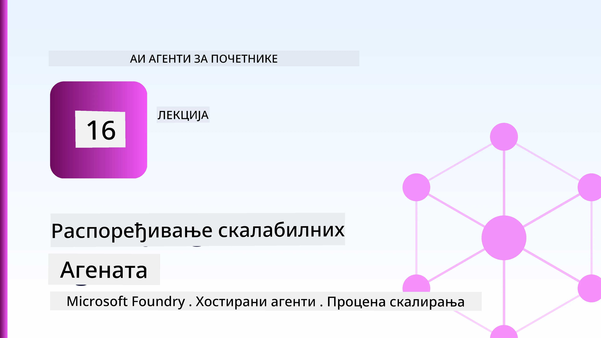
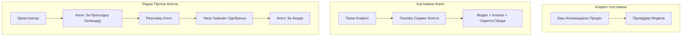
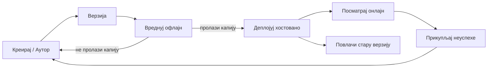
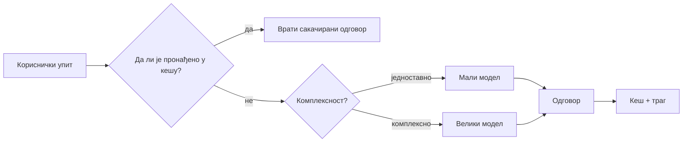

# Распоређивање скалабилних агената са Microsoft Foundry



До овог тренутка у курсу сте изграђивали агенте који раде на вашем лаптопу, унутар нотебоока, покретани помоћу `az login` и неколико променљивих окружења. То је управо прави начин учења. Није прави начин за покретање агента на којем хиљаде купаца зависе у 3 ујутру.

Ова лекција се бави јазом између „ради на мом рачунару“ и „ради поуздано и приступачно у продукцији.“ Тај јаз затварамо коришћењем **Microsoft Foundry** и **Microsoft Foundry Agent Service**, и радимо то тако што градимо правог агента за корисничку подршку који има алате, извлачење, меморију, евалуацију и надгледање.

## Увод

Ова лекција ће обухватити:

- Разлику између **прототип агента** и **распоређеног агента**, и зашто је прелазак углавном око свега *око* модела.
- **Обрасце распоређивања** за агенте: хостовани на клијенту, хостовани као сервис (Hosted Agents) и оркестрирани током рада.
- **Животни циклус агента** на Microsoft Foundry — креирање, верзионисање, распоређивање, евалуација, посматрање, пензионисање.
- **Стратегије скалирања**: рутирање модела, кеширање, конкорентност и дизајн без држања стања.
- **Посматрање** помоћу OpenTelemetry и Foundry праћења.
- **Оптимизација трошкова** кроз избор модела, рутирање и проверне капије евалуације.
- **Питања предузећа**: управљање, људско одобрење и безбедно покретање MCP сервера у продукцији.

## Циљеви учења

Након завршетка ове лекције, знаћете како да:

- Изаберете прави образац распоређивања за дати радни оптерећење агента.
- Распоредите агента у Microsoft Foundry Agent Service тако да буде верзионисан, управљан и посматран.
- Инструментирате агента за праћење и повежете евалуациони пипелине који се извршава пре сваког издања.
- Примените рутирање модела и кеширање да бисте држали латенцију и трошкове под контролом на скали.
- Додајете капију људског одобрења за радње великог ризика и интегришете MCP сервер на безбедан начин у продукцији.

## Предзнање

Ова лекција претпоставља да сте завршили претходне лекције и у потпуности разумете:

- Изградњу агената са [Microsoft Agent Framework](../14-microsoft-agent-framework/README.md) (Лекција 14).
- [Коришћење алата](../04-tool-use/README.md) (Лекција 4) и [Agentic RAG](../05-agentic-rag/README.md) (Лекција 5).
- [Меморију агента](../13-agent-memory/README.md) (Лекција 13) и [Agentic Protocols / MCP](../11-agentic-protocols/README.md) (Лекција 11).
- [Посматрање и евалуацију](../10-ai-agents-production/README.md) (Лекција 10) — ова лекција директно се надовезује на њу.

Биће вам потребно и:

- **Azure претплата** и **Microsoft Foundry пројекат** са најмање једним распоређеним моделом за чет.
- Аутентификовани **Azure CLI** (`az login`).
- Python 3.12+ и пакети из репозиторијума [`requirements.txt`](../../../requirements.txt).

## Од прототипа до продукције: шта се заправо мења

Прототип агента и продукцијски агент деле исти главни циклус — размишљати, позвати алате, одговорити. Оно што се мења је све што је омотано око тог циклуса. Модел чини можда 20% продукцијског агента; осталих 80% је оперативни скелет.

| Питање | Прототип | Продукција |
| --- | --- | --- |
| **Хостинг** | Ради у вашем ноутбоок-у | Ради као хостовани сервис, верзионисан и распоређен |
| **Идентификација** | Ваш `az login` токен | Управљана идентитет са ограниченим RBAC-ом |
| **Стање** | У меморији, губи се након рестарта | Екстернализовано (складиште нити, сервис меморије) |
| **Неуспех** | Видећете трацу грешке | Поновни покушаји, резерве, dead-letter, аларми |
| **Трошак** | "То је само неколико центи" | Праћено по захтеву, рутирано, кеширано, буџетирано |
| **Квалитет** | Погледате излаз | Аутоматски евалуирано пре сваког издања |
| **Поверење** | Одобравате сваку акцију | Политика + људско укључивање за ризичне радње |

Имајте ову табелу на уму. Сваки део испод одговара једном од ових редова.

## Обрасци распоређивања агената

Постоје три образца која ћете користити, често у комбинацији.

### 1. Клијентски хостовани агенти

Објекат агента живи унутар *вашег* апликационог процеса. Ваш код позива провајдера модела директно; циклус размишљања ради у вашем сервису. Ово је оно што је свакa претходна лекција радила.

- **Користите када** вам треба пуна контрола над циклусом, прилагођени middleware или уграђујете агента у постојећи backend.
- **Компромис**: сами управљате скалирањем, стањем и отпорношћу.

### 2. Хостовани агенти (Foundry Agent Service)

Агент је *регистрован као ресурс* у Microsoft Foundry. Foundry хостује циклус размишљања, чува нити, спроводи безбедност садржаја и RBAC, и чини агента видљивим у Foundry порталу. Ваша апликација постаје танак клијент који креира нити и чита одговоре.

- **Користите када** желите трајност, уграђено посматрање, управљање и мањи оперативни опсег.
- **Компромис**: мање низко-ниво контроле у замену за управљано време извршења.

### 3. Токови рада агената

Више агената (и алата) се саставља у граф са изричитом контролом тока — секвенцијални кораци, разгранчавање, чворови људског одобрења, и трајне контролне тачке које могу паузирати и наставити. Ово је могућност Microsoft Agent Framework **Workflows** примењена на скали распоређивања.

- **Користите када** један задатак обухвата неколико специјализованих агената или захтева корак одобрења на средини.
- **Компромис**: више покретних делова; потребна је видљивост на нивоу оркестрације.



## Животни циклус агента на Microsoft Foundry

Распоређивање агента није једнократни `push`. То је циклус који много подсећа на циклус издања софтвера јер је то управо то.



Кључна идеја, преузета из [Лекције 10](../10-ai-agents-production/README.md): **офлајн евалуација је капија, а не накнадна мисao.** Нова верзија агента не излази осим ако не прође ваше евалуационе прагове. Онлине посматрање онда враћа стварне неуспехе у ваш офлајн тест скуп. То је цео циклус.

## Стратегије скалирања

Скалирање агента је другачије од скалирања API-ја без стања, јер сваки захтев може покренути више скупих позива модела и алата. Четири технике носе већину оптерећења.

**Обрада захтева без стања.** Немојте чувати стање по кориснику у меморији процеса. Чувајте нитове разговора у Foundry thread store или сервису меморије тако да сваки инстанс може обрадити било који захтев. Ово вам омогућава хоризонтално скалирање — додајте инстансе, без статичких сесија.

**Рутирање модела.** Ниједан захтев не треба најмоћнији (и најскупљи) модел. Путујте једноставне захтеве — класификација намера, кратки чињенични одговори — ка малом, брзом моделу и резервишите велики модел за истинско закључивање. Foundry-јева **Model Router** то може урадити за вас, или можете сами имплементирати лагани класификатор. Бићете урадите DIY верзију у лабораторији.

**Кеширање одговора.** Многи упити корисничке подршке су скоро дупликати ("како да ресетујем лозинку?"). Кеширајте одговоре на честа питања и послужите их без позива модела. Чак и умерен проценат успешних кеш удараца значајно смањује трошкове и латенцију.

**Конкорентност и повратни притисак.** Провајдери модела имају ограничења брзине. Ограничите своју конкорентност, користите покушаје са експоненцијалним повећањем интервала, и неуспехе обрадите пристојно (одговор у реду "ради се на томе" бољи је од 500 грешке).



## Посматрање у продукцији

Не можете управљати оним што не видите. Као што је објашњено у Лекцији 10, Microsoft Agent Framework излаже **OpenTelemetry** траговање нативно — сваки позив модела, позив алата и корак оркестрације постају спен. У продукцији те спенове извозите у Microsoft Foundry (или било који OTel-компатибилан backend) да бисте могли:

- Пратити једну корисничку жалбу од почетка до краја кроз сваки позив модела и алата.
- Пратити p50/p95 латенцију и трошкове по захтеву током времена.
- Упозоравати на скокове у стопи грешака и аномалије у трошковима пре корисника (или вашег финансијског тима).

```python
from agent_framework.observability import get_tracer

tracer = get_tracer()

with tracer.start_as_current_span("support_request") as span:
    span.set_attribute("customer.tier", "enterprise")
    span.set_attribute("routed.model", "gpt-4.1-mini")
    # извршавање агента се аутоматски прати унутар овог спана
```

Атрибути као `customer.tier` и `routed.model` претварају зид трагова у одговарајућа питања ("да ли се корпоративни купци превише често рутирају ка малом моделу?").

## Оптимизација трошкова

Трошкови у продукцијским агентима доминирају по токуена. Три полуге по утицају:

1. **Правилно димензионишите модел.** Мали модел који прође вашу капију евалуације је скоро увек јефтинији од великог који такође прође. Користите евалуацију да *докажете* да је мали модел довољно добар уместо да по дефолту узимате највећи из предострожности.
2. **Рутирјте по сложености.** Као горе — плаћајте цену великог модела само за захтеве који захтевају разматрање великог модела.
3. **Кеширајте агресивно.** Најефтинији позив модела је онај који никада не направите.

Капије евалуације и контрола трошкова су иста дисциплина посматрана из два угла: евалуација вам каже *дно квалитета*, рутирање и кеширање вас држе што ближе том *трошку*.

## Разматрања за распоређивање у предузећу

**Управљање.** Hosted агенти наследљују Foundry-јев RBAC, безбедност садржаја и евиденцију ревизије. Дајте сваком агенту управљану идентификацију са најмање привилегија које му требају — приступ само за читање бази знања, ограничен приступ тикет API-ју, ништа више.

**Људско укључивање.** Неке акције су превише важне да би се аутоматизовале директно — издавање повраћаја новца, брисање налога, ескалација правном тиму. Microsoft Agent Framework подржава алате који захтевају **одобрење**: агент предлаже акцију, извршење се паузира, човек одобрава или одбија, а ток рада наставља. Ово сте видели као примитив у [Лекцији 6](../06-building-trustworthy-agents/README.md); овде га распоређујете.

**MCP у продукцији.** [MCP](../11-agentic-protocols/README.md) омогућава вашем агенту да користи екстерне алате кроз стандардни интерфејс. У продукцији, третирајте сваки MCP сервер као непоуздану границу: закуцајте верзију сервера, покрећите га са ограниченом идентитетом, валидајте његове излазе и никада му не откривајте тајне. MCP сервер је зависност, а зависности се пеглају, ревидирају и ограничено су доступне.


Та три дијаграма — развој, распоређивање, покретање — иста је агента у три фазе живота. Лабораторија која следи вас води кроз његову изградњу.

## Практична лабораторија: Агент корисничке подршке спреман за продукцију

Отворите [`code_samples/16-python-agent-framework.ipynb`](./code_samples/16-python-agent-framework.ipynb) и радите кроз њега од почетка до краја. Саставићете **Contoso агента корисничке подршке** са свим продукцијским аспектима унетим:

1. **Позив алата** — претрага статуса наруџбине и отварање тикета за подршку.
2. **RAG** — одговарање на питања о политици из базе знања (Azure AI Search, са унутрашњом резеривом да нотебоок ради без Search ресурса).
3. **Меморија** — памти корисника током окрета разговора.
4. **Рутирање модела** — класификатор сложености усмерава сваки захтев ка малом или великом моделу.
5. **Кеширање одговора** — поновљена питања се служе из кеша.
6. **Људско одобрење** — повраћаји изнад прага паузирају за људско одобрење.
7. **Пипелине евалуације** — мали офлајн тест скуп оцењује агента и делује као капија за издање.
8. **Посматрање** — OpenTelemetry праћење око сваког захтева.

### Проводник

Нотебоок је организован тако да је сваки продукцијски аспект самостална, покретна секција. Срце тога је руковаоац захтева са рутирањем и кеширањем:

```python
async def handle_support_request(query: str, customer_id: str) -> str:
    # 1. Послужити из кеша кад можемо.
    cached = response_cache.get(normalize(query))
    if cached:
        return cached

    # 2. Усмерити према сложености да бисмо контролисали трошкове.
    model = "gpt-4.1-mini" if is_simple(query) else "gpt-4.1"

    # 3. Покренути агента унутар трага ради посматрања.
    with tracer.start_as_current_span("support_request") as span:
        span.set_attribute("routed.model", model)
        span.set_attribute("customer.id", customer_id)
        response = await support_agent.run(query, model=model)

    # 4. Кеширати и вратити.
    response_cache.set(normalize(query), response.text)
    return response.text
```

Капија евалуације која штити издање изгледа овако:

```python
async def evaluation_gate(agent, test_cases, threshold: float = 0.8) -> bool:
    passed = 0
    for case in test_cases:
        result = await agent.run(case["input"])
        if score_response(result.text, case["expected"]) >= 0.8:
            passed += 1
    pass_rate = passed / len(test_cases)
    print(f"Evaluation pass rate: {pass_rate:.0%} (gate: {threshold:.0%})")
    return pass_rate >= threshold  # само распростирај ако пролаз врата успе
```

Прочитајте сваки ред — нотебоок намерно држи примитиве малим тако да ништа није сакривено иза позива оквира.

## Валидација распоређеног агента помоћу smoke тестова

Капија евалуације изнад ради *офлајн* против вашег агент објекта. Када је агент распоређен као Hosted Agent, потребна вам је још једна, још јефтинија провера: **да ли распоређени крај заправо одговара?**

Распоређивање "успешно" само доказује да је контролна радна површина прихватила дефиницију — не доказује да агент одговара. Недостајућа зависност, лоше рутирање модела или истекла веза могу оставити зелено распоређивање које не враћа ништа. **Smoke тест** то ухвати у секунди, на сваком распоређивању, без трошкова пуног теста.

Овај репозиторијум испоручује спремну за употребу smoke-тест пипелину изграђену на основу [AI Smoke Test](https://github.com/marketplace/actions/ai-smoke-test) GitHub акције:

- **Каталог** — [`tests/lesson-16-smoke-tests.json`](../../../tests/lesson-16-smoke-tests.json) садржи подсетнике и тврдње за Contoso агента за подршку (одговори засновани на политици, претрага наруџбине, одржавање теме, и континуитет вишекратног окрета нити). Каталози агената из других лекција налазе се поред њега — видети [`tests/README.md`](../tests/README.md).
- **Ток рада** — [`.github/workflows/smoke-test.yml`](../../../.github/workflows/smoke-test.yml) пријављује се са Azure OIDC и POST-ује сваки подсетник на Responses крајњу тачку агента, неуспех посла при било којој пропусти тврдње.

```yaml
- name: Smoke-test hosted agent
  uses: JFolberth/ai-smoketest@v1
  with:
    project_endpoint: ${{ inputs.project_endpoint }}
    agent_name: ContosoSupportAgent
    tests_file: tests/lesson-16-smoke-tests.json
```


Покрените га из картице **Actions** када ваш агент буде распоређен, достављајући ваш Foundry пројектни крајњи налог и име агента. Федеративни идентитет мора имати улогу **Azure AI User** у опсегу Foundry пројекта. Размислите о слојевима као о пирамиди: тестови дима (да ли је доступан и одговара?) се покрећу при сваком распоређивању, офлајн евалуација (да ли је довољно добра за пуштање?) се покреће пре промоције, а онлајн евалуација (како се показује у пракси?) се непрекидно извршава.

## Провера знања

Испитајте своје разумевање пре него што пређете на задатак.

**1. Колико отприлике један продукциони агент чини "модел", а шта је остатак?**

<details>
<summary>Одговор</summary>

Модел чини мањину система — често се наводи око 20%. Остатак је оперативни скелет: хостовање и верзионисање, идентитет и RBAC, екстернализовано стање, руковање грешкама, праћење трошкова, евалуација и контроле са људским учешћем. Прелазак у продукцију је углавном око градње свега *око* петље резоновања.
</details>

**2. Када бисте изабрали Hosted Agent уместо агента хостованог на клијенту?**

<details>
<summary>Одговор</summary>

Када желите управљано окружење са уграђеном издржљивошћу (нитима који трају и могу наставити), посматрањем, безбедношћу садржаја и RBAC, а спремни сте да жртвујете део нижег нивоа контроле петље резоновања за мању оперативну површину. Хостовање на клијенту је пожељније када вам је потребна пуна контрола над петљом или кад уграђујете агента у постојећи бекенд.
</details>

**3. Зашто скалабилни агент мора бити бездржаван у својој меморији процеса?**

<details>
<summary>Одговор</summary>

Да би било која инстанца могла да обради било који захтев, што омогућава хоризонтално скалирање без „лепљивих“ сесија. Стање разговора по кориснику се екстернализује у продавницу нити или меморијску услугу. Ако би стање живело у меморији процеса, изгубили бисте га приликом поновног покретања и не бисте могли слободно да распоређујете оптерећење.
</details>

**4. Који проблем решава усмеравање модела, и како се односи на евалуацију?**

<details>
<summary>Одговор</summary>

Усмеравање шаље једноставне захтеве малом, јефтинијем и брзом моделу и задржава велики модел за право резоновање, контролишући и латенцију и трошкове. Односи се на евалуацију јер евалуација доказује да је мали модел довољно добар за одређену класу захтева — усмеравање без евалуације је нагађање.
</details>

**5. Шта је "evaluation gate" и где се налази у животном циклусу?**

<details>
<summary>Одговор</summary>

Evaluation gate покреће офлајн сет тестова на новој верзији агента и блокира распоређивање осим ако проценат пролаза не пређе праг. Налази се између "верзије" и "распоређивања" у животном циклусу, чинећи квалитет предусловом за пуштање уместо нечега што проверавате након пуштања.
</details>

**6. Зашто MCP сервер треба третирати као непоуздану границу у продукцији?**

<details>
<summary>Одговор</summary>

Јер је то спољна зависност ка којој ваш агент упућује позиве. Треба да закућате његову верзију, покрећете га са скопираним идентитетом, верификујете његове излазе, ограничавајте брзину позива и никада не излажите тајне — истом дисциплином коју примењујете на било коју трећу страну. Његови излази улазе у резоновање вашег агента, тако да непроверено поверење представља безбедносни ризик.
</details>

**7. Која појединачна промена обично има највећи утицај на трошкове продукционог агента и зашто?**

<details>
<summary>Одговор</summary>

Правилно одабран модел — коришћење најмањег модела који још увек пролази кроз ваш evaluation gate. Трошкове углавном одређују токени, а мањи модел који испуњава квалитетни праг је скоро увек јефтинији од већег. Кеширање и усмеравање даље смањују трошкове, али избор правог базног модела има највећи примарни ефекат.
</details>

**8. Коју улогу играју атрибути span-а као `customer.tier` и `routed.model` у посматрању?**

<details>
<summary>Одговор</summary>

Они претварају сирове трагове у пословне питања на која се може одговорити. Без атрибута имате зид сегмената; са њима можете питати "да ли се корпоративни корисници премало често усмеравају ка малом моделу?" или "који модел обрађује наше најспорије захтеве?" Атрибути су начин на који резимирате телеметрију по димензијама које су важне за вашу операцију.
</details>

## Задатак

Узмите агента за корисничку подршку из лабораторије и ојачате га за конкретан сценарио: **агента за подршку наплати претплате у SaaS компанији.**

Ваш поднесак треба да:

1. **Замените алате** алатима релевантним за наплату: `get_subscription_status`, `get_invoice`, и `issue_credit` (кредит већи од $50 захтева људску одобрење).
2. **Додајте три RAG документа** која покривају политику повраћаја новца, циклус наплате и политику отказивања компаније.
3. **Проширите сет евалуације** на најмање осам случајева, укључујући најмање два која *тачно треба* да покрену пут одобрења од стране људи, и потврдите да ваш evaluation gate исправно одобрава или одбија.
4. **Додајте један извештај о трошковима**: након извршавања десет мешовитих упита кроз агента, прикажите колико је ишло малом моделу, колико великом моделу и колико је послужено из кеша.

Напишете кратак параграф (у markdown ћелији) објашњавајући која сте правило за усмеравање модела изабрали и како бисте га верификовали са стварним саобраћајем. Не постоји један тачан одговор — бићете оцењивани по томе да ли су продукционе бриге повезане у складу.

## Резиме

У овој лекцији сте преместили агента из прототипа у продукцију помоћу Microsoft Foundry:

- Прелазак у продукцију је углавном око **оперативног скелета** око модела — хостинг, идентитет, стање, руковање грешкама, трошкови, квалитет и поверење.
- Научили сте три **појединaчна паттерна распоређивања** — хостинг на клијенту, Hosted Agents и Agent Workflows — и када је који прикладан.
- Прошли сте кроз **животни циклус агента**, где офлајн **евалуација делује као капија за пуштање** а онлајн посматрање враћа грешке натраг у скуп тестова.
- Применили сте **стратегије скалирања** — бездржавни дизајн, усмеравање модела, кеширање и ограничену конкурентност — и спојили их са **оптимизацијом трошкова**.
- Имплементирали сте **контроле за предузећа**: RBAC, одобрење људи у петљи и продукционо безбедну MCP интеграцију.
- Изградили сте **продукционог агента за корисничку подршку** који повезује све ове бриге у извршни код.

Следећа лекција иде у супротном смеру: уместо скалирања агената у облак, спустићете их *на једну развојну машину* и покренути их потпуно локално.

## Додатни ресурси

- <a href="https://learn.microsoft.com/azure/ai-foundry/what-is-azure-ai-foundry" target="_blank">Microsoft Foundry документација</a>
- <a href="https://learn.microsoft.com/azure/ai-foundry/agents/overview" target="_blank">Преглед Microsoft Foundry Agent Service</a>
- <a href="https://aka.ms/ai-agents-beginners/agent-framework" target="_blank">Microsoft Agent Framework</a>
- <a href="https://learn.microsoft.com/azure/ai-foundry/concepts/model-router" target="_blank">Model Router у Microsoft Foundry</a>
- <a href="https://learn.microsoft.com/azure/search/search-what-is-azure-search" target="_blank">Azure AI Search</a>
- <a href="https://opentelemetry.io/" target="_blank">OpenTelemetry</a>
- <a href="https://github.com/marketplace/actions/ai-smoke-test" target="_blank">AI Smoke Test GitHub Action</a>
- <a href="https://modelcontextprotocol.io/" target="_blank">Model Context Protocol (MCP)</a>

## Претходна лекција

[Прављење агената за коришћење рачунара (CUA)](../15-browser-use/README.md)

## Следећа лекција

[Креирање Локалних AI Агентa](../17-creating-local-ai-agents/README.md)

---

<!-- CO-OP TRANSLATOR DISCLAIMER START -->
**Изјава о одрицању одговорности**:
Овај документ је преведен коришћењем услуге за аутоматски превод [Co-op Translator](https://github.com/Azure/co-op-translator). Иако тежимо тачности, имајте у виду да аутоматски преводи могу садржати грешке или нетачности. Оригинални документ на његовом изворном језику треба сматрати ауторитативним извором. За критичне информације препоручује се професионални људски превод. Нисмо одговорни за било каква неспоразума или погрешна тумачења која произилазе из коришћења овог превода.
<!-- CO-OP TRANSLATOR DISCLAIMER END -->