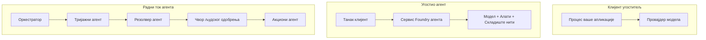
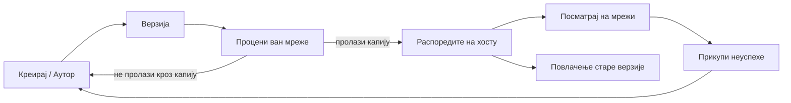
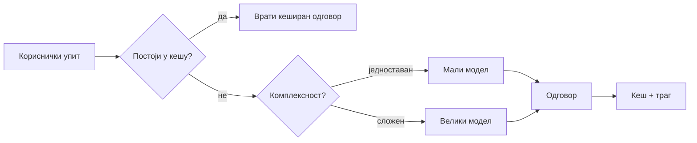
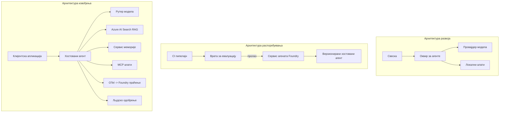

# Распоређивање скалабилних агената са Microsoft Foundry


До овог тренутка у курсу сте правили агенте који раде на вашем лаптопу, унутар бележнице, покретани командом `az login` и неколико променљивих окружења. То је управо прави начин за учење. Али није прави начин за покретање агента од кога хиљаде корисника зависи у 3 ујутру.

Ова лекција говори о јазу између "ради на мом рачунару" и "ради поуздано и приступачно у продукцији". Тај јаз затварамо коришћењем **Microsoft Foundry** и **Microsoft Foundry Agent Service**, а радимо то правећи правог корисничког агента за подршку који има алате, проналазак, меморију, процену и надгледање.

## Увод

Ова лекција ће обухватити:

- Разлику између **прототип агента** и **распоређеног агента**, и зашто је прелазак углавном око свега *около* модела.
- **Обрасци распоређивања** за агенте: подржани од стране клијента, сервисно подржани (Hosted Agents), и оркестрирани радни токови.
- **Животни циклус агента** на Microsoft Foundry — креирање, верзионисање, распоређивање, евалуација, надгледање, повлачење.
- **Стратегије скалирања**: рутирање модела, кеширање, конкурентност и бездржавни дизајн.
- **Посматрање** коришћењем OpenTelemetry и Foundry трагања.
- **Оптимизација трошкова** кроз избор модела, рутирање и капије евалуације.
- **Позајмице за претпријемство**: управљање, људско одобрење и безбедно покретање MCP сервера у продукцији.

## Циљеви учења

Након завршетка ове лекције, знаћете како да:

- Изаберете прави образац распоређивања за одређени радни терет агента.
- Распоредите агента у Microsoft Foundry Agent Service тако да буде верзионисан, управљан и посматран.
- Инструментујете агента за тражење и повежете евалуациони цевовод који ради пре сваког издања.
- Примените рутирање и кеширање модела да бисте држали латенцију и трошкове под контролом на скали.
- Додате људско одобрење за радње са високим ризиком и интегришете MCP сервер на безбедан начин у производњу.

## Претпоставке

Ова лекција претпоставља да сте завршили претходне лекције и да сте сигурни у:

- Прављење агената са [Microsoft Agent Framework](../14-microsoft-agent-framework/README.md) (Лекција 14).
- [Коришћење алата](../04-tool-use/README.md) (Лекција 4) и [Agentic RAG](../05-agentic-rag/README.md) (Лекција 5).
- [Меморија агента](../13-agent-memory/README.md) (Лекција 13) и [Agentic протоколи / MCP](../11-agentic-protocols/README.md) (Лекција 11).
- [Посматрање и евалуација](../10-ai-agents-production/README.md) (Лекција 10) — ова лекција директно гради на њему.

Такође ће вам требати:

- **Azure претплата** и **Microsoft Foundry пројекат** са најмање једним распоређеним моделом за ћаскање.
- Аутентификовани **Azure CLI** (`az login`).
- Python 3.12+ и пакети у репозиторијуму [`requirements.txt`](../../../requirements.txt).

## Од прототипа до продукције: шта се заправо мења

Прототип агента и продукцијски агент деле исти основни циклус — размишљање, позивање алата, одговарање. Оно што се мења је све што окружује тај циклус. Модел је можда 20% продукцијског агента; осталих 80% је оперативни скелет.

| Забринутост | Прототип | Продукција |
| --- | --- | --- |
| **Хостирање** | Ради у вашој бележници | Ради као сервис хостиран, верзионисан и уведен |
| **Идентитет** | Ваш `az login` токен | Управљани идентитет са контролом приступа по улогама (RBAC) |
| **Стабло** | У меморији, губи се при рестарту | Екстернализован (складиште нити, меморијска служба) |
| **Неуспех** | Видите пропратне информације о грешци | Поновни покушаји, резервне варијанте, погрешне поруке, аларми |
| **Трошак** | "Неколико центи" | Праћи по захтеву, рутирати, кеширати, буџетирати |
| **Квалитет** | Погледате излаз | Аутоматски оцењено пре сваког издања |
| **Поверење** | Одобрите сваку радњу | Политика + човек у петљи за ризичне радње |

Имајте ову табелу на уму. Сваки одељак доле одговара једном од ових редова.

## Обрасци распоређивања агената

Постоје три обрасца које ћете користити, често у комбинацији.

### 1. Клијентски хостирани агенти

Објекат агента живи унутар *вашег* процеса апликације. Ваш код директно позива провајдера модела; циклус размишљања ради у вашој служби. Ово је оно што је свака претходна лекција радилила.

- **Користите када** вам је потребна потпуна контрола над циклусом, прилагођеним middleware-ом, или уграђујете агента у постојећи backend.
- **Компромис**: сами се бринете о скалирању, стању и отпорности.

### 2. Хостирани агенти (Foundry Agent Service)

Агент је *регистрован као ресурс* у Microsoft Foundry. Foundry хостира циклус размишљања, чува нити, спроводи сигурност садржаја и RBAC, и чини агента видљивим у Foundry порталу. Ваша апликација постаје танки клијент који креира нити и чита одговоре.

- **Користите када** желите издржљивост, уграђено посматрање, управљање и мање оперативног оптерећења.
- **Компромис**: мање нискониво контроле у замену за управљано извођење.

### 3. Работни токови агента

Више агената (и алата) се саставља у граф са експлицитним током контроле — секвенцијални кораци, разгранате одлуке, чворови за људско одобрење и трајне контролне тачке које могу паузирати и наставити. Ово је могућност Microsoft Agent Framework **Workflows** примењена на скали распоређивања.

- **Користите када** један задатак обухвата више специјализованих агената или захтева корак одобрења у средини.
- **Компромис**: више покретних делова; захтева посматрање на нивоу оркестрације.



## Животни циклус агента на Microsoft Foundry

Распоређивање агента није једнократни `push`. То је циклус који изгледа као циклус издања софтвера јер то заправо јесте.



Кључна идеја, преузета из [Лекција 10](../10-ai-agents-production/README.md): **офлајн евалуација је капија, а не накнадна мисao.** Нова верзија агента се не пуштује док не прође ваше прагеве евалуације. Онлајн посматрање затим враћа стварне грешке у ваш офлајн скуп тестова. То је цео циклус.

## Стратегије скалирања

Скалирање агента се разликује од скалирања бездржавног веб API-ја, јер сваки захтев може покренути више скупих позива модела и алата. Четири технике носе већину оптерећења.

**Бездржавна обрада захтева.** Немојте чувати стање по кориснику у меморији вашег процеса. Сачувајте нити конверзације у Foundry складиште нити или услугу меморије тако да било која инстанца може обрадити било који захтев. Ово вам омогућава хоризонтално скалирање — додајете инстанце, без "лепљивих" сесија.

**Рутирање модела.** Не сваки захтев треба ваш најспособнији (и најскупљи) модел. Рутирајте једноставне захтеве — класификација намере, кратки фактички одговори — ка малом, брзом моделу, и резервишите велики модел за прави разлог. Foundry-јев **Model Router** може то учинити за вас, или можете сами имплементирати лагани класификатор. Направићете DIY верзију у лабораторији.

**Кеширање одговора.** Много упита за подршку су скоро-дупликати ("како да ресетујем лозинку?"). Кеширајте одговоре на уобичајена питања и сервирајте их без позива модела. Чак и умерена стопа кеш удара значајно смањује трошкове и латенцију.

**Конкурентност и обратни притисак (backpressure).** Провајдери модела имају лимите учесталости. Ограничите своју конкурентност, користите поновне покушаје са експоненцијалним повећањем интервала, и пропадајте глатко (одговор "радимо на томе" у реду чекања бољи је од 500 грешке).



## Посматрање у продукцији

Не можете управљати тиме што не можете видети. Као што је обухваћено у Лекцији 10, Microsoft Agent Framework емитује **OpenTelemetry** трагове нативно — сваки позив модела, позив алата и корак оркестрације постају span. У продукцији извозите те span-ове у Microsoft Foundry (или било који ОТел-компатибилан backend) како бисте могли:

- Пратити једну корисничку жалбу од почетка до краја кроз сваки позив модела и алата.
- Пратити p50/p95 латенцију и трошкове по захтеву током времена.
- Алармирати на скокове у стопи грешака и аномалије трошкова пре корисника (или финансијског тима).

```python
from agent_framework.observability import get_tracer

tracer = get_tracer()

with tracer.start_as_current_span("support_request") as span:
    span.set_attribute("customer.tier", "enterprise")
    span.set_attribute("routed.model", "gpt-5-nano")
    # извршавање агента се аутоматски прати унутар овог опсега
```

Атрибути као што су `customer.tier` и `routed.model` претварају зид трагова у питања која имају одговоре ("да ли се корпоративни корисници пребрзо преусмеравају на мали модел?").

## Оптимизација трошкова

Трошак у продукцијским агентима доминирају токени. Три ручке, по редоследу утицаја:

1. **Правилна величина модела.** Мали модел који прође вашу евалуациону капију је готово увек јефтинији од великог који такође прође. Користите евалуацију да *докажете* да је мали модел довољно добар уместо да из предострожности подразумевано узимате највећи модел.
2. **Рутирање по сложености.** Као горе — плаћате цену великог модела само за захтеве који захтевају резоновање великог модела.
3. **Агресивно кеширање.** Најјефтинији позив модела је онај који никада не направите.

Капије евалуације и контрола трошкова су иста дисциплина посматрана из два угла: евалуација вам говори *квалитетни под* док рутирање и кеширање чувају трошкове што ближе том поду.

## Разматрања за претпријемства

**Управљање.** Hosted Agents наслеђују Foundry-јев RBAC, безбедност садржаја и евиденцију ревизије. Доделите сваком агенту управљани идентитет са најмањом привилегијом која му је потребна — само приступ за читање базе знања, ограничен приступ тикетинг API-ју, ништа више.

**Човек у петљи.** Неке радње су превише значајне да би се аутоматизовале без предаха — враћање новца, брисање налога, ескалација правном тиму. Microsoft Agent Framework подржава алате који захтевају **одобрење**: агент предлаже радњу, извршење се паузира, човек одобрава или одбија, и радни ток наставља. Ово сте видели као примитив у [Лекцији 6](../06-building-trustworthy-agents/README.md); овде га распоређујете.

**MCP у продукцији.** [MCP](../11-agentic-protocols/README.md) омогућава вашем агенту да користи екстерне алате преко стандардног интерфејса. У продукцији третирајте сваки MCP сервер као непоуздану границу: закуцајте верзију сервера, покрећите га са ограниченим идентитетом, верификујте његове излазе и никада му не дајте приступ тајнама. MCP сервер је зависност, а зависности се патчују, ревидирају и имају ограничења у учесталости позива.



Та три дијаграма — развој, распоређивање, извођење — су исти агент у три фазе живота. Лабораторијски рад који следи води вас кроз његову изградњу.

## Практична лаба: Производно способан агент за подршку корисницима

Отворите [`code_samples/16-python-agent-framework.ipynb`](./code_samples/16-python-agent-framework.ipynb) и прођите га од почетка до краја. Склопићете **Contoso агента за подршку корисницима** са свим производним захтевима урађеним:

1. **Позив алатки** — протражите статус наруџбине и отворите тикете за подршку.
2. **RAG** — одговарајте на питања о политици из базе знања (Azure AI Search, са унутрашњом резервом тако да бележница ради без Search ресурса).
3. **Меморија** — памти корисника кроз окрете разговора.
4. **Рутирање модела** — класификатор сложености рутира сваки захтев малом или великом моделу.
5. **Кеширање одговора** — поновљена питања се сервирају из кеша.
6. **Људско одобрење** — враћања новца изнад прага чекају људски потпис.
7. **Цевовод евалуације** — мали офлајн скуп тестова оцењује агента и служи као капија издања.
8. **Посматрање** — OpenTelemetry праћење око сваког захтева.

### Прелазак кроз код

Бележница је организована тако да је сваки производни захтев самосталан, изводљив одељак. Срж је руковалац захтева са рутирањем и кеширањем:

```python
async def handle_support_request(query: str, customer_id: str) -> str:
    # 1. Послужи из кеша кад год можемо.
    cached = response_cache.get(normalize(query))
    if cached:
        return cached

    # 2. Усмеравај по сложености ради контроле трошкова.
    model = "gpt-5-nano" if is_simple(query) else "gpt-5-mini"

    # 3. Покрени агента унутар трасиране зоне за посматрањем.
    with tracer.start_as_current_span("support_request") as span:
        span.set_attribute("routed.model", model)
        span.set_attribute("customer.id", customer_id)
        response = await support_agent.run(query, model=model)

    # 4. Кеширај и врати.
    response_cache.set(normalize(query), response.text)
    return response.text
```

Капија евалуације која штити издање изгледа овако:

```python
async def evaluation_gate(agent, test_cases, threshold: float = 0.8) -> bool:
    passed = 0
    for case in test_cases:
        result = await agent.run(case["input"])
        if score_response(result.text, case["expected"]) >= 0.8:
            passed += 1
    pass_rate = passed / len(test_cases)
    print(f"Evaluation pass rate: {pass_rate:.0%} (gate: {threshold:.0%})")
    return pass_rate >= threshold  # постави само ако пролаз капије успе
```

Прочитајте сваки ред — бележница држи примитиве намерно малим тако да ништа није сакривено иза позива у оквир.

## Валидација распоређеног агента преко Smoke тестова

Капија евалуације горе ради *офлајн* против вашег објекта агента. Када је агент распоређен као Hosted Agent, потребна је још једна, још јефтинија провера: **да ли распоређена крајња тачка заиста одговара?**

Распоређивање "успешно" доказује само да контролна равнина прихвати дефиницију — не доказује да агент одговара. Недостајућа зависност, лоша рута модела или истекла веза могу оставити зелену имплементацију која не враћа ништа. **Smoke тест** то хвата за неколико секунди, при сваком распоређивању, без трошкова пуног тестирања.

Овај репозиторијум испоручује спреман pipeline smoke-тестова базиран на GitHub акцији [AI Smoke Test](https://github.com/marketplace/actions/ai-smoke-test):

- **Каталог** — [`tests/lesson-16-smoke-tests.json`](../../../tests/lesson-16-smoke-tests.json) садржи упите и потврде за Contoso агента за подршку (одговори на основе политике, проналазак наруџбине, останак на теми и континуитет више корака). Каталози за агенте из других лекција су поред њега — видети [`tests/README.md`](../tests/README.md).
- **Работни ток** — [`.github/workflows/smoke-test.yml`](../../../.github/workflows/smoke-test.yml) пријављује се помоћу Azure OIDC и шаље сваки упит на агентов Responses endpoint, проглашавајући посао неуспешним ако било која потврда не прође.

```yaml
- name: Smoke-test hosted agent
  uses: JFolberth/ai-smoketest@v1
  with:
    project_endpoint: ${{ inputs.project_endpoint }}
    agent_name: ContosoSupportAgent
    tests_file: tests/lesson-16-smoke-tests.json
```


Покрените га из картице **Actions** када ваш агент буде распоређен, уносећи крајњу тачку вашег Foundry пројекта и име агента. Федеративни идентитет треба да има улогу **Azure AI User** у оквиру Foundry пројекта. Размишљајте о слојевима као о пирамидама:	smoke тестови (да ли је доступан и одговара?) се покрећу при сваком распоређивању, офлајн процена (да ли је довољно добар за испоруку?) се извршава пре промоције, а онлајн процена (како се понаша у реалном окружењу?) се извршава непрекидно.

## Проверa знања

Тестирајте своје разумевање пре него што пређете на задатак.

**1. Отprilike колики део продукционог агента је „модел“, а шта је остатак?**

<details>
<summary>Одговор</summary>

Модел је мањина система — често се наводи око 20%. Остатак је оперативни скелет: хостирање и верзионисање, идентитет и RBAC, екстернализовано стање, руковање неуспесима, праћење трошкова, евалуација и контроле са људским учешћем. Прелазак у продукцију се углавном односи на изградњу свега *око* петље резоновања.
</details>

**2. Када бисте изабрали Hosted Agent уместо агента хостираног на клијенту?**

<details>
<summary>Одговор</summary>

Када желите управљано извршно окружење са уграђеном отпорношћу (тредови који опстају и могу се наставити), посматрањем, безбедношћу садржаја и RBAC, а спремни сте да тргујете делом ниско-нивоу контроле петље резоновања за мањи оперативни оквир. Клијентски хостирани агент је пожељан када вам је потребна потпуна контрола над петљом или када уграђујете агента у постојећи бекенд.
</details>

**3. Зашто скалабилни агент мора бити бездржаван у својој меморији процеса?**

<details>
<summary>Одговор</summary>

Да било која инстанца може обрадити било који захтев, што омогућава хоризонтално скалирање без везаних сесија. Конверзационо стање по кориснику је екстернализовано у продавницу тредова или меморијску услугу. Ако би стање било у меморији процеса, изгубили бисте га при рестарту и не бисте могли слободно да расподелите оптерећење.
</details>

**4. Који проблем решава усмеравање модела и како је повезано са евалуацијом?**

<details>
<summary>Одговор</summary>

Усмеравање шаље једноставне захтеве малом, јефтином и брзом моделу и резервише велики модел за истинско резоновање, контролишући и латенцију и трошкове. Повезано је са евалуацијом јер је евалуација то што *доказа* да је мали модел довољно добар за одређену класу захтева — усмеравање без евалуације је нагађање.
</details>

**5. Шта је „evaluation gate“ и где се налази у животном циклусу?**

<details>
<summary>Одговор</summary>

Evaluation gate извршава офлајн скуп тестова на новој верзији агента и блокира распоређивање осим ако стопа успешно положених тестова не прелази постављени праг. Налази се између „верзије“ и „распоређивања“ у животном циклусу, чинећи квалитет предусловом за пуштање у рад уместо нечега што проверавате након испоруке.
</details>

**6. Зашто сервер MCP мора бити третира као непоуздана граница у производњи?**

<details>
<summary>Одговор</summary>

Јер је екстерни зависни сервис на који ваш агент позива. Треба уткати његову верзију, покретати га са ограниченим идентитетом, валидарати његове излазе, ограничити број позива и никад му не излагати тајне — исту дисциплину коју примењујете на сваку трећу страну. Његови излази улазе у размишљање вашег агента, тако да невалидарана поверења представљају безбедносни ризик.
</details>

**7. Која појединачна промена обично има највећи утицај на цену продукционог агента и зашто?**

<details>
<summary>Одговор</summary>

Правилна величина модела — коришћење најмањег модела који и даље пролази ваш evaluation gate. Трошкове углавном одређују токени, а мањи модел који задовољава критеријум квалитета је готово увек јефтинији од већег. Кеширање и усмеравање додатно смањују трошкове, али избор правог основног модела има највећи примарни ефекат.
</details>

**8. Коју улогу играју span атрибути као што су `customer.tier` и `routed.model` у посматрању (observability)?**

<details>
<summary>Одговор</summary>

Они претварају сирове трагове у одговоре на пословна питања. Без атрибута имате зид spans-а; са њима можете питати „да ли се корпоративни купци превише често усмеравају на мали модел?“ или „који модел обрађује наше најспорије захтеве?“ Атрибути су начин како да резирате телеметрију према димензијама које су битне за вашу операцију.
</details>

## Задатак

Узмите агента за корисничку подршку из лабораторије и учврстите га за конкретан сценарио: **агент за подршку при наплати претплата за SaaS компанију.**

Ваш поднесак треба да:

1. **Замените алате** алатима релевантним за наплату: `get_subscription_status`, `get_invoice`, и `issue_credit` (кредити изнад 50$ захтевају људско одобрење).
2. **Додајте три RAG документа** која обухватају политику повраћаја новца компаније, циклус наплате и политику отказивања.
3. **Проширите сет евалуације** на најмање осам случајева, укључујући најмање два која *треба* да покрену пут одобрења од стране човека, и проверите да ли ваш evaluation gate исправно пролази или не пролази.
4. **Додајте један извештај о трошковима**: након покретања десет мешаних упита кроз агента, одштампајте колико је ишло на мали модел, колико на велики модел и колико је послужено из кеша.

Напишите кратак пасус (у markdown ћелији) објашњавајући који сте модел-рутирајуће правило изабрали и како бисте га валидирали са стварним саобраћајем. Не постоји један тачан одговор — оцењује се да ли су производни аспекти повезани кохерентно.

## Резиме

У овој лекцији сте прелазили агента са прототипа на продукцију са Microsoft Foundry:

- Прелазак у продукцију углавном се односи на **оперативни скелет** око модела — хостирање, идентитет, стање, руковање неуспесима, трошкови, квалитет и поверење.
- Научили сте три **шаблона распореда** — клијентски хостирани, Hosted Agents и Agent Workflows — и када који одговара.
- Прошли сте кроз **животни циклус агента**, где офлајн ** процена делује као капија за пуштање у рад** а онлајн посматрање враћа неуспехе назад у скуп тестова.
- Примењивали сте **стратегије скалирања** — бездржавни дизајн, усмеравање модела, кеширање и ограничену конкуренцију — и повезали их са **оптимизацијом трошкова**.
- Уткали сте **корпоративне контроле**: RBAC, људско одобрење и интеграцију MCP безбедну за продукцију.
- Направили сте **агента за корисничку подршку спремног за продукцију** који повезује све ове аспекте у извршив код.

Следећа лекција води у супротном смеру: уместо да скалирате агенте у облак, довешћете их *доле* на једну развојну машину и покренути их потпуно локално.

## Додатни ресурси

- <a href="https://learn.microsoft.com/azure/ai-foundry/what-is-azure-ai-foundry" target="_blank">Документација Microsoft Foundry</a>
- <a href="https://learn.microsoft.com/azure/ai-foundry/agents/overview" target="_blank">Преглед Microsoft Foundry Agent Service</a>
- <a href="https://aka.ms/ai-agents-beginners/agent-framework" target="_blank">Microsoft Agent Framework</a>
- <a href="https://learn.microsoft.com/azure/ai-foundry/concepts/model-router" target="_blank">Model Router у Microsoft Foundry</a>
- <a href="https://learn.microsoft.com/azure/search/search-what-is-azure-search" target="_blank">Azure AI Search</a>
- <a href="https://opentelemetry.io/" target="_blank">OpenTelemetry</a>
- <a href="https://github.com/marketplace/actions/ai-smoke-test" target="_blank">AI Smoke Test GitHub Action</a>
- <a href="https://modelcontextprotocol.io/" target="_blank">Model Context Protocol (MCP)</a>

## Претходна лекција

[Прављење агената за коришћење рачунара (CUA)](../15-browser-use/README.md)

## Следећа лекција

[Креирање локалних AI агената](../17-creating-local-ai-agents/README.md)

---

<!-- CO-OP TRANSLATOR DISCLAIMER START -->
**Изјава о одрицању одговорности**:
Овај документ је преведен коришћењем услуге за аутоматски превод [Co-op Translator](https://github.com/Azure/co-op-translator). Иако тежимо тачности, имајте у виду да аутоматски преводи могу садржати грешке или нетачности. Оригинални документ на његовом изворном језику треба сматрати ауторитативним извором. За критичне информације препоручује се професионални људски превод. Нисмо одговорни за било каква неспоразума или погрешна тумачења која произилазе из коришћења овог превода.
<!-- CO-OP TRANSLATOR DISCLAIMER END -->