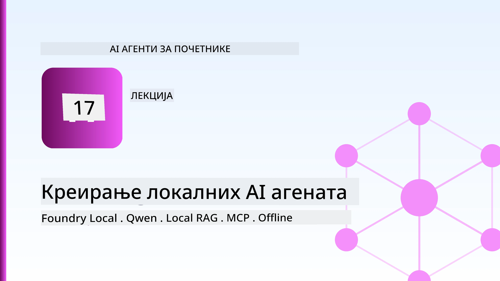
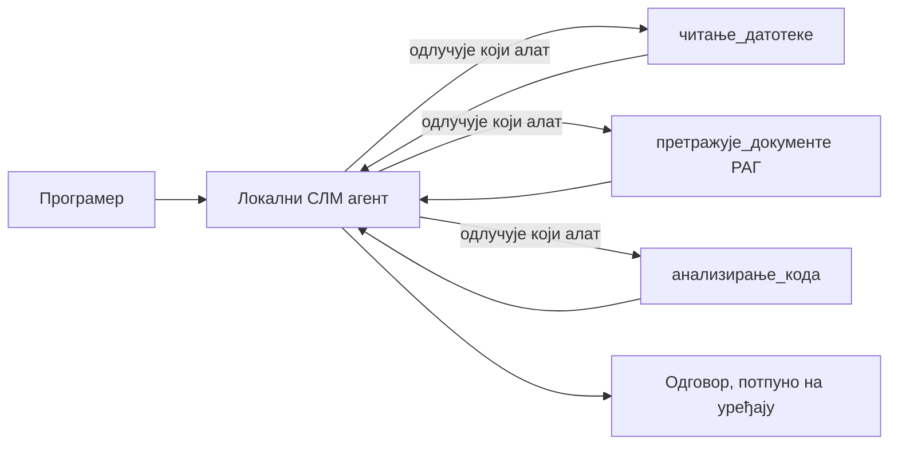
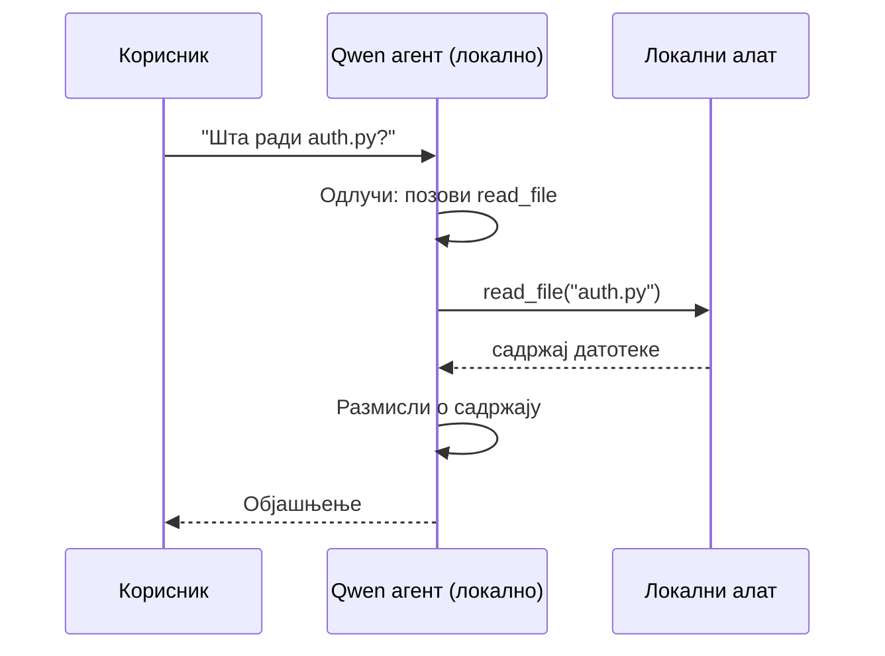
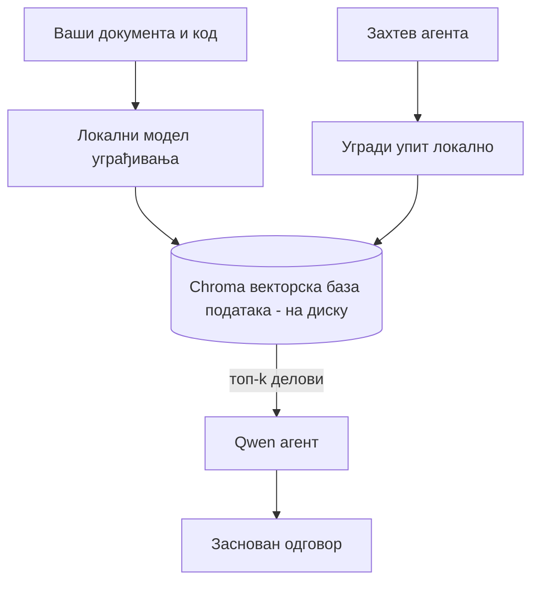
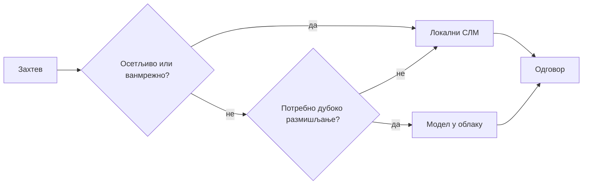

# Креирање Локалних AI Агената помоћу Microsoft Foundry Local и Qwen



Претходна лекција је скалирала агенте *нагоре* у облак. Ова их доводи *доле* на једну машину. До краја ћете имати радног инжењерског асистента који размишља, позива алате, чита ваше фајлове и претражује вашу документацију — **без иједног позива на облачни inference.**

Зашто бисте то хтели? Три разлога која се често јављају у правом инжењерском раду:

- **Приватност.** Код и документи никада не напуштају машину. Нема упита, нема исечака, нема корисничких података који прелазе мрежну границу.
- **Цена.** Локални inference нема цену по токену. Можете непрекидно итератирати колико желите за цену струје.
- **Оффлајн.** На авиону, у безбедном објекту или током прекида рада, агент и даље ради.

Фатаморгана је у томе што тргујете моделом из врха облака за **Мали Језички Модел (SLM)** који ради на вашем CPU-у, GPU-у или NPU-у. Ова лекција говори о изградњи агената који су *добри* у оквиру тог ограничења, уместо да претендује да ограничења нема.

## Увод

Ова лекција ће покрити:

- **Мале Језичке Моделе (SLM-ове)** — шта су, где сјаје и где не.
- **Microsoft Foundry Local** — runtime који преузима и сервисира моделе на уређају преко **OpenAI-у компатибилног API-ja**.
- **Qwen модели за позив функција** — SLM-ови који поуздано производе позиве алатима, што омогућава локалне *агенте* (не само локални ћаскање).
- **Локални алати, локални RAG и локални MCP** — давање агената способности без облака.
- **Хибридни модели** — када држати ствари локално, а када се окренути облаку.

## Циљеви учења

Након завршетка ове лекције, знаћете како да:

- Објасните компромисе SLM-ова и одаберете одговарајуће случајеве употребе локалних агената.
- Локално сервисирати Qwen модел помоћу Foundry Local и повезати га преко OpenAI компатибилног ендпоинта.
- Креирати агента за позив алата који ради у потпуности на вашем радном месту.
- Додати локални RAG преко ваших сопствених докумената користећи локалну векторску базу (Chroma).
- Повезати агента са локалним MCP сервером и размишљати о хибридним локалним/облачним решењима.

## Предуслови

Ова лекција претпоставља да сте завршили претходне лекције и осећате се уверено са:

- [Коришћење алата](../04-tool-use/README.md) (Лекција 4) и [Агентски RAG](../05-agentic-rag/README.md) (Лекција 5).
- [Агентски протоколи / MCP](../11-agentic-protocols/README.md) (Лекција 11).
- [Microsoft Agent Framework](../14-microsoft-agent-framework/README.md) (Лекција 14).

Такође ће вам требати:

- Развојно радно место. **8 GB RAM је реалан минимум**; 16 GB+ је угодно. GPU или NPU помаже али није обавезно.
- Инсталиран **Microsoft Foundry Local** (погледајте одељак за подешавање доле).
- Python 3.12+ и пакети у репозиторијуму [`requirements.txt`](../../../requirements.txt), плус `foundry-local-sdk`, `openai`, и `chromadb` за ову лекцију.

## Мали Језички Модели: Погодно средство за локални рад

Модел са врха облака има стотине милијарди параметара и дата центар иза себе. SLM има неколико милијарди параметара и мора да стане у RAM вашег лаптопа. Та разлика поставља јасна очекивања.

**SLM-ови су добри у:**

- Структурираним, ограниченим задацима — класификација, екстракција, резимирање познатог документа.
- **Позив алата** — одлучивање коју функцију позвати и са којим аргументима.
- Брзо, јефтино и приватно итерирање на властитим подацима.

**SLM-ови су слабији у:**

- Отвореној, мултихоп резонанци кроз велики контекст.
- Широким светским знањем (видели су мање и више заборављају).

Победничка стратегија за локалне агенте је стога: **нека SLM оркестрира, а нека алати носе тежак терет.** Модел не мора *познавати* ваш код — мора знати када да позове `read_file` и `search_docs`. То директно игра у корист SLM-ових снага.



## Microsoft Foundry Local

**Microsoft Foundry Local** је лагани runtime који преузима, управља и сервисира моделе у потпуности на вашем уређају. Најважнија карактеристика за нас је што излаже **OpenAI-у компатибилан HTTP ендпоинт** — што значи да OpenAI SDK и Microsoft Agent Framework OpenAI клијент функционишу са њим само променом `base_url`. Све што сте научили о прављењу агената преноси се директно; само се ендпоинт помера из облака на `localhost`.

Foundry Local такође аутоматски изабира најбоље грађење модела за ваш хардвер — CPU build, CUDA/GPU build, или NPU build — тако да не морате ручно да оптимизујете по машини.

### Подешавање

Инсталирајте Foundry Local (погледајте [документацију](https://learn.microsoft.com/azure/ai-foundry/foundry-local/) за ваш ОС), а затим потврдите да ради:

```bash
# Инсталирајте (нпр; пратите документацију за вашу платформу)
winget install Microsoft.FoundryLocal      # Виндоус
# brew install microsoft/foundrylocal/foundrylocal   # macOS

# Преузмите и покрените Qwen модел, затим покрените локалну услугу
foundry model run qwen2.5-7b-instruct
foundry service status
```

Када сервис ради, имате локални OpenAI-у компатибилан ендпоинт (типично `http://localhost:PORT/v1`). Бележница користи `foundry-local-sdk` да аутоматски пронађе ендпоинт, тако да не морате ручно да уносите порт.

## Qwen Позив Функција: Зашто је Важно

Агент је агент само ако може позивати алате. Многи SLM-ови могу ћаскати али производе непоуздане, неисправне позиве алата. **Qwen** модели су обучени за позив функција и конзистентно издају исправне структуре позива алата — што је управо оно што претвара локални ћаскање модел у локалног *агента*.

Ток је стандардна петља позива алата коју већ знате, само што ради на уређају:



## Локални RAG

Претрага документације је место где локални агенти оправдавају сваку уложену енергију. Уместо да се надају да је SLM запамтио документацију вашег фрејмворка, уграђујете те документе у **локалну векторску базу података** и дозвољавате агенту да по потреби враћа релевантне делове.

Користимо **Chroma**, уграђену продавницу вектора која ради у процесу без сервера за управљање. Пипелина је у потпуности локална: локални модел уграђивања → локални вектори → локална претрага → локални SLM.



Ово је исти Agentic RAG модел као из Лекције 5 — једина промена је да сваки део ради на вашој машини.

## Локални MCP Сервери

[MCP](../11-agentic-protocols/README.md) је транспорт, а не облачна услуга. MCP сервер може да ради као локални процес на `stdio`, изложивши алате вашем агенту преко стандардног протокола. Ово вам омогућава поновну употребу растућег екосистема MCP сервера — приступ фајлсистему, git операције, упити базе података — у потпуности оффлајн.

Безбедносна позиција је другачија него у облаку, али није одсутна: локални MCP сервер и даље ради са дозволама вашег корисника, зато ограничите шта може да додирне (директоријум пројекта, а не цео ваш кућни фолдер) и третирајте његове излазе као улаз за валидацију.

## Хибридни Облачно-Локални Модели

Локално-прво не значи само локално. Модерни системи раде рутинг по осетљивости и тешкоћи:

| Ситуација | Где се извршава |
| --- | --- |
| Осетљив код / подаци, или оффлајн | **Локални SLM** |
| Једноставан, ограничен задатак | **Локални SLM** (јефтин, брз) |
| Тешко мултихоп резоновање на неосетљивим подацима | **Облачни модел** |
| Све време, током прекида рада | **Локални SLM** (грејсфул деградација) |

Ово огледа идеју **рутирања модела** из Лекције 16 — осим што је један од „модела“ сада ваша сопствена машина. Робустан дизајн се враћа локално кад облак није доступан, тако да агент деградира у квалитету уместо да потпуно падне.



## Практична Радионица: Локални Инжењерски Асистент

Отворите [`code_samples/17-local-agent-foundry-local.ipynb`](./code_samples/17-local-agent-foundry-local.ipynb) и прођите кроз њега. Направићете **локалног инжењерског асистента** који ради у потпуности на вашем радном месту и може:

1. **Позивати алате** — преко Qwen позива функција кроз Foundry Local.
2. **Обављати локалне операције над фајловима** — листати и читати фајлове у директоријуму пројекта.
3. **Анализирати код** — известити основне метрике о изворном фајлу.
4. **Претраживати документацију** — локални RAG преко фасцикле са документима користећи Chroma.
5. **Користити MCP** — повезати се са локалним MCP сервером (са грејсфул скоком ако ниједан није конфигурисан).

Ни на једном месту није коришћен облачни inference.

### Проход

Асистент се повезује са Foundry Local преко OpenAI компатибилног ендпоинта, па код агента изгледа скоро идентично као у облачним лекцијама — само се клијент мења:

```python
from foundry_local import FoundryLocalManager
from openai import OpenAI

# Foundry Local открива/преузима модел и даје нам локалну адресу.
manager = FoundryLocalManager(\"qwen2.5-7b-instruct\")
client = OpenAI(base_url=manager.endpoint, api_key=manager.api_key)  # api_key је локални привремени знак
```

Алатке су обичне Python функције ограничене на директоријум пројекта:

```python
def read_file(path: str) -> str:
    \"\"\"Read a file, but only inside the sandboxed project directory.\"\"\"
    full = (PROJECT_ROOT / path).resolve()
    if PROJECT_ROOT not in full.parents and full != PROJECT_ROOT:
        return \"Access denied: path is outside the project directory.\"
    return full.read_text(encoding=\"utf-8\")
```

Обратите пажњу на проверу sandbox-а — чак и локално, алат који чита произвољне путеве представља ризик. Бележница чува све алатке ограничене на једну коренску фасциклу пројекта.

## Провера Знања

Тестирајте своје разумевање пре него што пређете на задатак.

**1. Наведите два конкретна разлога за покретање агента локално уместо у облаку.**

<details>
<summary>Одговор</summary>

Било која два од: **приватност** (код и подаци никада не напуштају машину), **трошкови** (нема рачуна по токену за inference), и **способност оффлајн рада** (ради без мреже — на авиону, у безбедном објекту или током прекида рада). Регулаторна/комплајнс ограничења која забрањују слање података ван уређаја често су покретач разлога приватности.
</details>

**2. Како се препоручује подела рада између SLM-а и његових алата у локалном агенту, и зашто?**

<details>
<summary>Одговор</summary>

Нека SLM **оркестрира** (одлучује који алат позвати и са којим аргументима), а нека **алати носе тежак терет** (читање фајлова, проналажење докумената, рачунање резултата). SLM-ови су јаки у ограниченим одлукама као избор алата, али слабији у широкој бази знања и дугом мултихоп резоновању, па ослањање на алате иде у прилог њиховим снагама.
</details>

**3. Шта омогућава поновну употребу кода облачног агента са Foundry Local?**

<details>
<summary>Одговор</summary>

Foundry Local излаже **OpenAI-у компатибилан HTTP ендпоинт**. OpenAI SDK и OpenAI клијент Agent Framework-а раде са њим само променом `base_url` (и коришћењем локалног placeholder API кључа). Све остало у коду агента остаје исто.
</details>

**4. Зашто и користимо управо Qwen модел за позив функција, а не било који SLM?**

<details>
<summary>Одговор</summary>

Јер агент мора производити поуздане, добро формиране **позиве алата**. Многи SLM-ови могу да ћаскају али издају неисправне или неконзистентне структуре позива алата. Qwen модели су обучени за позив функција и конзистентно производе позиве алата, што преводи локални ћаскање модел у радног локалног агента.
</details>

**5. Који се компоненти у локалној RAG пипелини извршавају на машини?**

<details>
<summary>Одговор</summary>

Сви: модел уградње, векторска база (Chroma, на диску), корак претраге и SLM. Документи се уграђују локално, чувају локално, враћају локално и резонује се над њима локални модел — ниједан део се не дотиче облака.
</details>

**6. Локални MCP сервер ради на вашој машини. Да ли то аутоматски значи да је безбедан? Коју меру предострожности и даље треба предузети?**

<details>
<summary>Одговор</summary>

Не. Локални MCP сервер ради са дозволама вашег корисника, те може додирнути све што и ви. Ограничите га на оно што му треба (на пример, један директоријум пројекта уместо целог кућног фолдера) и третирајте излазе као улаз за валидацију пре реаговања.
</details>

**7. Описати разумно правило хибридног рутирања које укључује локални модел.**

<details>
<summary>Одговор</summary>

Усмеравати осетљиве или оффлајн захтеве ка локалном SLM-у; једноставне ограничене задатке ка локалном SLM-у због брзине и цене; тешко мултихоп резоновање на неосетљивим подацима ка облачном моделу; и враћати се локалном SLM-у ако облак није доступан тако да агент грациозно деградира уместо да падне. Ово је рутирање модела (Лекција 16) са локалном машином као једним од модела.
</details>

**8. Која је реална минимална количина RAM-а за покретање локалног агента у овој лекцији и шта вам доноси више RAM-а?**

<details>
<summary>Одговор</summary>

Око **8 GB** је реалан минимум; 16 GB+ је угодно. Више RAM-а вам омогућава да покрећете веће, способностији моделе и да чувате више контекста у меморији. GPU или NPU убрзава inference али није обавезно — Foundry Local бира CPU build кад нема акцелератора.
</details>

## Задатак

Проширите локалног инжењерског асистента у **локалног рецензента документације** за мали пројекат по вашем избору (користите једну од фасцикли лекција у овом репозиторијуму ако желите).

Ваш рад треба да:

1. **Индексира стварну фасциклу са документацијом/кодом** у Chromu (најмање пет фајлова).
2. **Дода алат `find_todos`** који прегледа пројекат за `TODO`/`FIXME` коментаре и враћа их са именом фајла и бројем линије — уз исту проверу sandbox-а као `read_file`.

3. **Питајте агента три питања** која га приморавaју да комбинује алате: једно чисто RAG питање, једно које захтева читање одређене датотеке и једно које захтева проналажење TODO ставки.
4. **Измерите то**: мерите време сва три одговора и забележите их у markdown ћелији. Коментаришите да ли је кашњење прихватљиво за ваш намеравани ток рада.

Затим напишите кратак пасус о томе **шта бисте преместили у облак а шта бисте задржали локално** за овог рецензента, и зашто. Оцјењујете се према томе да ли су локалне компоненте исправно повезане и да ли је ваша хибридна резоновања исправна — а не према квалитету модела.

## Резиме

У овом лекцији сте направили агента који ради у потпуности на вашем рачунару:

- **SLM-ови** жртвују ширину опсега због приватности, трошкова и рада ван мреже — и сјајни су када **оркестрирају алате** уместо да поседују сва знања сами.
- **Foundry Local** служи моделе на уређају иза **OpenAI компатибилног крајњег тачка**, тако да се ваш код агента у облаку преноси са једном линијом измене.
- **Qwen модели за позив функција** омогућавају поуздан локални позив алата — и самим тим локалне *агенте*.
- **Локални RAG** (Chroma) и **локални MCP** дају агенту могућности без напуштања машине.
- **Хибридни модели** вам омогућавају рутирање по осетљивости и тешкоћи, са локалним као елегантном резервом.

Овиме се завршава лук распоређивања: Лекција 16 је скалирала агенте у Microsoft Foundry, а ова лекција их је смањила на једну радну станицу. Следећа лекција се окреће ка обезбеђивању распоређених агената.

## Додатни ресурси

- <a href="https://learn.microsoft.com/azure/ai-foundry/foundry-local/" target="_blank">Microsoft Foundry Local документација</a>
- <a href="https://learn.microsoft.com/azure/ai-foundry/what-is-azure-ai-foundry" target="_blank">Microsoft Foundry документација</a>
- <a href="https://aka.ms/ai-agents-beginners/agent-framework" target="_blank">Microsoft Agent Framework</a>
- <a href="https://qwen.readthedocs.io/en/latest/framework/function_call.html" target="_blank">Qwen документација за позив функција</a>
- <a href="https://modelcontextprotocol.io/" target="_blank">Model Context Protocol (MCP)</a>
- <a href="https://docs.trychroma.com/" target="_blank">Chroma векторска база</a>

## Претходна лекција

[Deploying Scalable Agents](../16-deploying-scalable-agents/README.md)

## Следећа лекција

[Securing AI Agents](../18-securing-ai-agents/README.md)

---

<!-- CO-OP TRANSLATOR DISCLAIMER START -->
**Изјава о одрицању одговорности**:
Овај документ је преведен коришћењем услуге за аутоматски превод [Co-op Translator](https://github.com/Azure/co-op-translator). Иако тежимо тачности, имајте у виду да аутоматски преводи могу садржати грешке или нетачности. Оригинални документ на његовом изворном језику треба сматрати ауторитативним извором. За критичне информације препоручује се професионални људски превод. Нисмо одговорни за било каква неспоразума или погрешна тумачења која произилазе из коришћења овог превода.
<!-- CO-OP TRANSLATOR DISCLAIMER END -->