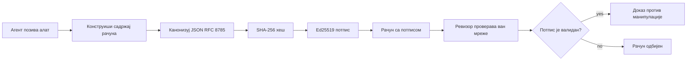
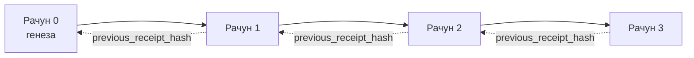

[Погледајте видео лекцију: Осигурање AI агената криптографским потврдама](https://youtu.be/PLACEHOLDER_VIDEO_ID)

> _(Видео лекције и минијатура биће додати од стране Microsoft тима за садржај након обједињавања, у складу са обрасцем лекције 14 / 15.)_

# Осигурање AI агената криптографским потврдама

## Увод

Ова лекција ће обухватити:

- Зашто су записи ревизорске стазе за AI агенте важни за усаглашеност, отклањање грешака и поверење.
- Шта је криптографска потврда и како се разликује од непотписане линије дневника.
- Како произвести потписану потврду за позив алата агента у обичном Python-у.
- Како верификовати потврду офлајн и открити манипулације.
- Како повезивати потврде тако да уклањање или препоређивање једне разбија ланац.
- Шта потврде доказују, а шта изричито не доказују.

## Циљеви учења

Након што завршите ову лекцију, знаћете како да:

- Идентификујете начине неуспеха који мотивишу криптографски порекло за агенцијске активности.
- Производите Ed25519-потписану потврду над канонским JSON садржајем.
- Верификујете потврду независно користећи само јавни кључ потписивача.
- Откријете манипулације поновним покретањем верификације над измењеном потврдом.
- Изградите низ потврда повезаних хешевима и објасните зашто је ланац важан.
- Препознате раздаљину између тога шта потврде доказују (приписивање, интегритет, редослед) и шта не доказују (исправност акције, исправност политике).

## Проблем: Ревизорска стаза вашег агента

Замислите да сте поставили AI агента за Contoso Travel. АгенT чита захтеве корисника, позива API за летове да погледа опције и резервише седишта у име корисника. Прошлог тромесечја, агент је обрадио 50.000 резервација.

Данас долази ревизор и поставља једноставно питање: „Покажи ми шта је твој агент радио.“

Предајете му ваше датотеке дневника. Ревизор их погледа и поставља теже питање: „Како знам да ови дневници нису измењени?“

Ово је проблем ревизорске стазе. Већина данашњих распоређивања агената ослања се на:

- **Применске дневнике**: које пише сам агент, може их изменити сваки ко има приступ датотечном систему.
- **Услуге облачног логовања**: доказиво непромењиве на нивоу платформе, али само ако ревизор верује оператеру платформе.
- **Дневнике транзација базе података**: погодне за промене у бази, али не и за произвољне позиве алата.

Никао од ових не може одговорити на питање ревизора без да ревизор верује некоме (вама, вашем провајдеру облака, произвођачу базе). За интерну употребу, то поверење је често прихватљиво. За регулисане радне оптерећења (финансије, здравство, све што подлеже EU AI Закону), није.

Криптографске потврде ово решавају тиме што сваку агенцијску акцију чине независно верификованом. Ревизору није потребно да вам верује. Потребан му је само ваш јавни кључ и сама потврда.

## Шта је криптографска потврда?

Потврда је JSON објекат који записује шта је агент урадио, потписан дигиталним потписом.



Мала потврда изгледа овако:

```json
{
  "type": "agent.tool_call.v1",
  "agent_id": "contoso-travel-bot",
  "tool_name": "lookup_flights",
  "tool_args_hash": "sha256:a3f9c1...",
  "result_hash": "sha256:7b2e1d...",
  "policy_id": "contoso-travel-policy-v3",
  "timestamp": "2026-04-25T14:30:00Z",
  "sequence": 47,
  "previous_receipt_hash": "sha256:9d4e6a...",
  "signature": {
    "alg": "EdDSA",
    "sig": "c5af83...",
    "public_key": "8f3b2c..."
  }
}
```

Три својства раде посао:

1. **Потпис**. Потврду потписује агентски гатеwаy користећи Ed25519 приватни кључ. Сваки ко има одговарајући јавни кључ може офлајн верификовати потпис. Манипулација било којим пољем чини потпис неважећим.

2. **Канонска енкодирања**. Пре потписивања, потврда се сериализује користећи JSON Канонски Шема (JCS, RFC 8785). Ово обезбеђује да две имплементације које производе исту логичку потврду генеришу бајт-идентичан резултат. Без каноникализације, различити JSON серијализатори дали би различите потписе за исти садржај.

3. **Повезивање хешевима**. Поље `previous_receipt_hash` повезује сваку потврду са претходном. Уклањање или препоредивање потврде разбија сваки следећи запис. Манипулације постају видљиве на нивоу ланца, чак и ако се заобиђу појединачни потписи.

Заједно ова својства пружају три гаранције:

- **Приписивање**: овај кључ је потписао овај садржај.
- **Интегритет**: садржај није мењан од тренутка потписа.
- **Редослед**: ова потврда је након те претходне у ланцу.

## Произвођење потврде у Python-у

Не треба вам посебна библиотека да бисте произвели потврду. Криптографски примитиви су широко доступни и логику је могуће написати у неколико десетина линија Python кода.

Практичне вежбе у `code_samples/18-signed-receipts.ipynb` воде кроз цео процес. Почетни преглед:

```python
import json
import hashlib
import base64
from nacl import signing
from jcs import canonicalize  # РФЦ 8785 канонски JSON

def b64url_nopad(data: bytes) -> str:
    return base64.urlsafe_b64encode(data).decode("ascii").rstrip("=")

def sha256_canonical(obj) -> str:
    """SHA-256 of a Python object's JCS-canonical JSON form."""
    return f"sha256:{hashlib.sha256(canonicalize(obj)).hexdigest()}"

# Генеришите или учитајте потписни кључ (у продукцији, чувајте у сигурносној каси)
signing_key = signing.SigningKey.generate()
verify_key = signing_key.verify_key

# Изградите пунило потврде (још без потписа)
tool_args = {"origin": "SYD", "destination": "LAX"}
tool_result = [{"flight": "QF11", "price": 1850, "stops": 0}]

payload = {
    "type": "agent.tool_call.v1",
    "agent_id": "contoso-travel-bot",
    "tool_name": "lookup_flights",
    "tool_args_hash": sha256_canonical(tool_args),
    "result_hash": sha256_canonical(tool_result),
    "policy_id": "contoso-travel-policy-v3",
    "timestamp": "2026-04-25T14:30:00Z",
    "sequence": 0,
    "previous_receipt_hash": None,
}

# Канонизујте, хеширајте, потпишите.
canonical_bytes = canonicalize(payload)
message_hash = hashlib.sha256(canonical_bytes).digest()
signature_bytes = signing_key.sign(message_hash).signature

# Прикључите структуирани објекат потписа.
receipt = {
    **payload,
    "signature": {
        "alg": "EdDSA",
        "sig": b64url_nopad(signature_bytes),
        "public_key": b64url_nopad(bytes(verify_key)),
    },
}
```

То је цео процес потписивања. Вежбе у нотебооку објашњавају сваки корак.

## Верификација потврде и откривање манипулација

Верификација је обрнути процес:

```python
import base64
import hashlib
from nacl import signing
from nacl.exceptions import BadSignatureError
from jcs import canonicalize

def b64url_decode(s: str) -> bytes:
    padding = "=" * ((4 - len(s) % 4) % 4)
    return base64.urlsafe_b64decode(s + padding)

def verify_receipt(receipt: dict) -> bool:
    # Потпис је структуирани објекат: {"alg", "sig", "public_key"}.
    sig_obj = receipt.get("signature")
    if not sig_obj or sig_obj.get("alg") != "EdDSA":
        return False

    # Реконструишите садржај који је заправо потписан (све осим потписа).
    payload = {k: v for k, v in receipt.items() if k != "signature"}

    canonical_bytes = canonicalize(payload)
    message_hash = hashlib.sha256(canonical_bytes).digest()

    try:
        verify_key = signing.VerifyKey(b64url_decode(sig_obj["public_key"]))
        verify_key.verify(message_hash, b64url_decode(sig_obj["sig"]))
        return True
    except BadSignatureError:
        return False
```

Ова функција прима потврду и враћа `True` ако је потпис валидан, иначе `False`. Без позива мрежи, без зависности од сервиса, без потребе да се било коме верује.

Да бисте видели како се откривају манипулације у пракси, нотебоок иде кроз:

1. Произвођење валидне потврде и потврђивање да је верификација успела.
2. Измену једног бајта у пољу `tool_args_hash`.
3. Поново покретање верификације и уочавање да се верификација не успешна.

Ово је практична демонстрација да су потврде доказиве против манипулација: свака измена, ма колико мала, разбија потпис.

## Повезивање потврда за више корака агената

Једна потписана потврда штити једну акцију. Ланац потврда штити низ акција.



Свака потврда записује хеш претходне. Да би нападач тихо уклонио потврду 2, морао би или:

- Изменити поље `previous_receipt_hash` потврде 3 (разбија потпис потврде 3), ИЛИ
- Фабриковати нови потпис над измењеном потврдом 3 (захтева приватни кључ агента).

Ако је приватни кључ у хардуерском кључном сефу и објавите јавни кључ уз сваку потврду, ниједан напад није изводљив без откривања.

Нотебоок показује:

1. Изградњу ланца од три потврде.
2. Верификацију да сваки `previous_receipt_hash` одговара стварном хешу претходне потврде.
3. Манипулације једне потврде у средини и уочавање да ланац на том месту пукне.

Ово вам омогућава да произвежете ревизорску стазу коју спољни ревизор може верификовати без потребе да вам верује.

## Шта потврде доказују (и шта не доказују)

Ово је најважнији део ове лекције. Потврде су моћне, али њихова моћ је ограничена.

**Потврде доказују три ствари:**

1. **Приписивање**: одређени кључ је потписао одређени садржај.
2. **Интегритет**: садржај није мењан од тренутка потписа.
3. **Редослед**: ова потврда је дошла након те потврде у хеш ланцу.

**Потврде НЕ доказују:**

1. **Исправност**: да је радња агента била исправна. Потврда може бити потписана и за погрешан одговор као и за прави.
2. **Усклађеност са политиком**: да је политика у `policy_id` заиста процењена или да би дозволила ову акцију ако би се проверила. Потврда бележи што је тврђено, не што је примењено.
3. **Идентитет изван кључа**: потврда каже „овaj кључ је потписао овај садржај.“ Не каже „овог човека је овлаштио.“ Повезивање кључа са лицем или организацијом захтева посебну инфраструктуру за идентитет (каталог, регистар јавних кључева итд.).
4. **Истинитост улаза**: ако агент добије манипулисан упит и делује по њему, потврда лојално бележи радњу. Потврде су након провере улаза, а не њен заменик.

Ова граница је важна из два разлога:

- Кажe за шта су потврде корисне: омогућавају ревизију и доказивост манипулација у понашању агента, чак и преко организационих граница.
- Кажe какве додатне слојеве и даље требају: валидацију улаза (Лекција 6), примену политике (укратко описану доле) и инфраструктуру за идентитет (ван домена ове лекције).

Уобичајена грешка је мислити да „имамо потврде“ значи „имамо управљање.“ Нису. Потврде су темељ. Управљање је систем који градите на тој основи.

## Доказивање да је човека одобрио тачну акцију

Тачка 3 изнад заслужује посебан поднаслов: потврда радње каже „овој кључ је потписао овај садржај“, никад „човек је овластио“. За ризичне радње (повраћај новца, брисања, банковни трансфери), оквири управљања све чешће захтевају баш ту изостављену изјаву, коју је могуће произвести истим примитивима које сте већ изградили у овој лекцији.

Следећи нотебоок `code_samples/human-authorization-receipts.ipynb` додаје другу врсту потврде, `human.approval.v1`, у истом облику коверте као потврде из лекције (типизовани садржај потписан Ed25519 преко канонског SHA-256, са `signature` објектом ван потписаних бајтова). Названи оверилац потписује **целу канонску радњу и њен дигест** пре извршења; агенцијска потврда носи исти **дигест акције** и `parent_approval_ref`, `receipt_hash` овере, исту конвенцију као `previous_receipt_hash` из претходног ланца. Један `verify_chain` процес у исто време проверава оба артефакта под **одвојеним фиксним регистрима кључева** (кључеви оверилаца против кључева агената), тако да је код за верификацију заједнички, али власти никада нису.

Особина коју ово купује, пажљиво изражена: *човек је одобрио ову тачну акцију и агент је извршио баш ту одобрену акцију.* Нотебоок користи фиксе одбијања који овај императив чине стварним, а не само тврдњом:

- класични сет: манипулације, конфузни дворник, реплеј, лажни кључеви са обе стране, неисправни улази;
- **застарела власт**: потпис који и даље пролази верификацију, ипак одбијен јер је верзија политике промењена, кључ овлашћеника ротационисан напоље из фиксног регистра или је одобрење истекло пре извршења;
- **замена дигеста**: ваљани потпис потврде акције који показује на *стварно* одобрење које обавезује *различиту* канонску акцију.

Сваки неуспех одбија са јединственим разлогом, тако да ревизор који чита одбијање може рећи да ли је власт застарела или је извршена акција промењена. Правило које нотебоок учи: потписано одобрење само по себи није власт. Власт постоји само ако обе потврде још увек обавезују исту канонску акцију у тренутку извршења. Пут са ко-потписом у истом Internet-Draft-у на који се ова лекција односи (`draft-farley-acta-signed-receipts`) је стандардни облик овог модела.

## Приредни референци

Python код у овој лекцији је намерно минималан да бисте могли да прочитате сваки ред и тачно разумете шта се дешава. У продукцији имате две опције:

1. **Градите директно на криптографским примитивима.** 50 линија кода које сте видели горе је довољно за многе употребе. PyNaCl (Ed25519) и пакет `jcs` (канонски JSON) су добро одржаване и ревидиране библиотеке.

2. **Користите производну библиотеку за потврде.** Неколико пројеката отвореног кода имплементира исти образац са додатним функцијама (ротација кључева, верификација у серији, дистрибуција JWK скупа, интеграција са покретачима политика):
   - Формат потврде који се користи у овој лекцији прати IETF Internet-Draft ([`draft-farley-acta-signed-receipts`](https://datatracker.ietf.org/doc/draft-farley-acta-signed-receipts/), ревизија 02) који је тренутно у процесу стандардизације, са заједничким набором конформности ([agent-governance-testvectors](https://github.com/ScopeBlind/agent-governance-testvectors)) који независне имплементације међусобно проверавају за идентичан канонски резултат.
   - Microsoft Agent Governance Toolkit састаје потврде са политикама на бази Cedar; видети Туторијал 33 у том репозиторијуму за пример од почетка до краја.
   - Пакети `protect-mcp` (npm) и `@veritasacta/verify` (npm) пружају Node.js имплементацију потписивања потврда и офлајн верификацију, намењену за омотавање било ког MCP сервера са доказивом ревизорском стазом, укључујући радни ток задржаног коскаталошког потписа у коме паузирана акција емитује потврду о одобрењу везану за дигест акције (WebAuthn подржан у десктоп протоку), исти образац потврде одобрења као у горе поменутом нотебооку за људску ауторизацију.
   - **[nobulex](https://github.com/arian-gogani/nobulex)** Python SDK (`pip install nobulex`) пружа исти Ed25519 + JCS образац потписивања у Python-у са интеграцијама LangChain и CrewAI, укључујући објављене тест векторе за проверу крос-контроле и мапирање усаглашености које је допринело путем [OWASP PR #2210](https://github.com/OWASP/CheatSheetSeries/pull/2210).

Одлука између писања свог и коришћења библиотеке подсећа на избор између писања своје JWT библиотеке и коришћења оне која је тестирана: оба приступа су разумна; библиотека штеди време и смањује површину за ревизију; приступ од почетка принуђује вас да разумете сваки примитив. Ова лекција учи пут од почетка тако да имате темеље за било који избор.

## Провера знања

Испитајте ваше разумевање пре него што пређете на практичну вежбу.

**1. Потврда је потписана приватним Ed25519 кључем агента. Ревизор има само јавни кључ. Може ли ревизор верификовати потврду офлајн?**

<details>
<summary>Одговор</summary>

Да. Ed25519 верификација захтева само јавни кључ и потписане бајтове. Без позива мрежи, без зависности од сервиса. Ово је својство које чини потврде корисним у окружењима са раздвојеним мрежама, мулти-организационим или са ниским степеном поверења.
</details>

**2. Нападач измењује поље `policy_id` потврде да би тврдио да је била регулисана попустљивијом политиком. Потпис се односио на оригинални садржај. Шта се догађа током верификације?**

<details>
<summary>Одговор</summary>


Верификација неуспева. Потпис је израчунат преко канонских бајтова оригиналног садржаја; измјена било ког поља мијења канонске бајтове, што мијења SHA-256 хеш, чиме потпис постаје неважећи. Нападач би морао да поседује приватни кључ да би произвео нови важећи потпис, а он га нема.
</details>

**3. Зашто примљени документ садржи `tool_args_hash` и `result_hash` уместо неуређених аргумената и резултата?**

<details>
<summary>Одговор</summary>

Два разлога. Прво, примљени документ може бити архивиран или послат у окружењима где би откривање неуређеног садржаја (ПИИ, пословни подаци) представљало проблем. Хеширање држи примљени документ малим и садржај приватним; ревизор проверава да ли хеш одговара засебно сачуваној копији стварног садржаја. Друго, хешеви имају фиксну величину; примљени документ са хешевима има ограничену величину без обзира колико су уноси и резултати велики.
</details>

**4. Поље `previous_receipt_hash` повезује сваки примљени документ са претходним. Ако нападач тиха уклони један примљени документ из средине ланца, шта постаје неважеће?**

<details>
<summary>Одговор</summary>

Сваки примљени документ који је дошао после обрисаног. Њихова поља `previous_receipt_hash` више не одговарају стварној ланцу (јер примљени документ на који се позивају више не постоји, или ланац сада показује на другог претходника). Да би прикрио брисање, нападач би морао поново да потпише сваки наконњи примљени документ, што захтева приватни кључ.
</details>

**5. Примљени документ се чисто верификује. Да ли то доказује да је деловање агента било исправно, ваљано или у складу са политиком?**

<details>
<summary>Одговор</summary>

Не. Важећи примљени документ доказује три ствари: атрибуцију (овај кључ је потписао овај садржај), интегритет (садржај није промењен) и редослед (овај примљени документ је дошао после оног другог). НЕ доказује да је деловање било исправно, да је политика наведена у `policy_id` заиста процењена, или да је агент поштио сва правила. Примљени документи чине понашање агента ревизибилним, али не нужно исправним. Ово је најважнија граница у лекцији.
</details>

## Вежба за праксу

Отворите `code_samples/18-signed-receipts.ipynb` и завршите сва четири дела:

1. **Део 1**: Потпишите свој први примљени документ и проверите га.
2. **Део 2**: Измени примљени документ и посматрај неуспех верификације.
3. **Део 3**: Направи ланац са три примљена документа и провери интегритет ланца.
4. **Део 4**: Примени образац на агента направљеног са Microsoft Agent Framework: обави позив алата у потписивању примљених докумената, затим независно верификуј примљени документ.

**Допунски изазов 1:** проширите шему примљених докумената додатним пољем по свом избору (на пример, ИД захтева за праћење), ажурирајте канонску логику потписивања да га укључује, и потврдите да примљени документ и даље пролази верификацију. Затим измените поље после потписа и потврдите да верификација не успева. Ово вас приморава да разумете како сваки бајт канонског кодирања доприноси потпису.

**Допунски изазов 2:** SHA-256-хеширајте два своја примљена документа заједно (конкатенирајући њихове канонске бајтове у детерминистичком редоследу) и уградите добијени сажеци као ново поље на трећи примљени документ пре потписивања. Проверите да сва три примљена документа и даље пролазе верификацију. Управо сте направили доказ укључивања у једном кораку: сваки ко поседује трећи примљени документ може доказати да су прва два постојала у време када је тај документа потписан, без потребе да открива њихов садржај. Ово је образац који примљени документи са селективним откривањем користе у великом обиму (Merkle комити, RFC 6962).

## Закључак

Криптографски примљени документи дају АИ агентима евиденцију која је:

- **Независно проверљива**: било која страна са јавним кључем може проверити, без зависности од сервиса.
- **Отпоран на фалсификовање**: било каква измена поништава потпис.
- **Преносив**: примљени документ је мала JSON датотека; може се архивирати, преносити и верификовати било где.
- **У складу са стандардима**: базиран на Ed25519 (RFC 8032), JCS (RFC 8785), и SHA-256, сви широко коришћени примитиви.

Они нису замена за проверу уноса, спровођење политика или инфраструктуру идентитета. Они су темељ за те слојеве. Када распоређујете агенте у регулисане радне оптерећења, мултиорганизационе процесе, или било које окружење где се не може претпоставити да вам будући ревизор верује, примљени документи су начин на који евиденција остаје поштена.

Најважнија поука: примљени документи доказују ко је шта рекао и када. Они не доказују да је оно што је речено било истина или исправно. Држите ту разлику чврсто. То је разлика између поштованог система порекла и збуњујућег.

## Контролна листа за производњу

Када будете спремни да прелазите са ове лекције на распоређивање агената који потписују примљене документе у стварном окружењу:

- [ ] **Преместите кључ за потписивање са лаптопа развојног инжењера.** Користите Azure Key Vault, AWS KMS или хардверски сигурносни модул. Приватни кључ за потписивање ваших примљених докумената никада не сме бити у систему контроле верзија или у нешифрованом облику на апликационим машинама.
- [ ] **Објавите јавни кључ за верификацију.** Ревизори га требају да би проверили офлајн. Стандардни образац је JWK сет на добро познатом URL-у (RFC 7517), нпр. `https://your-org.example.com/.well-known/agent-keys.json`.
- [ ] **Прикључите ланац споља.** Периодично бележите хеш најновијег врха ланца у транспарентном дневнику (Sigstore Rekor, RFC 3161 службеник временске ознаке, или други интерни систем) да би спољна страна могла да потврди „овај ланац је постојао у овом тренутку“.
- [ ] **Чувајте примљене документе неизмјењивим.** Складиште само за додавање (Azure Storage са политикама непромињивости, AWS S3 Object Lock) спречава унутрашњег лица да преписује историју на нивоу складишта.
- [ ] **Одлучите о задржавању.** Многи регулативни оквири захтевају вишегодишње задржавање. Планирајте раст примљених докумената (сваки примљени је ~500 бајтова; агент који направи 10.000 позива дневно производи ~1.8 ГБ годишње).
- [ ] **Документујте шта примљени документи не покривају.** Примљени документи доказују атрибуцију, интегритет и редослед. Ваш оперативни план треба јасно навести које додатне контроле (провера уноса, спровођење правила, ограничење брзине, инфраструктура идентитета) се налазе поред примљених докумената у вашој позицији управљања.

### Још питања о осигурању АИ агената?

Придружите се [Microsoft Foundry Discord](https://aka.ms/ai-agents/discord) да се упознате са другим ученницима, присуствујете канцеларијским сатима и добијете одговоре на питања о АИ агентима.

## Изван ове лекције

Ова лекција покрива потписивање појединачног примљеног документа и низове са хеш-ланцем. Исти примитиви чине неколико напреднијих образаца који се могу појавити како ваш положај управљања сазрева:

- **Селективно откривање.** Када су поља примљеног документа независно обавезана (Merkle стабло по RFC 6962), можете открити специфична поља одређеним ревизорима и доказати да су остала непромењена без њиховог откривања. Корисно када исти примљени документ мора задовољити и свеобухватну ревизију (која захтева потпуност) и регулативе о минимизацији података као што је GDPR (које желе да ревизор види што мање).
- **Поништавање примљених докумената.** Ако је кључ за потписивање компромитован, потребан је начин да се сви примљени документи потписани тим кључем означе као непоуздани од одређеног тренутка. Стандардни обрасци: краткорочни кључеви за потпис плус објављена листа поништавања, или транспарентни дневник са уносима о поништавању.
- **Дводелни / подељени потписни примљени документи.** Нека решења деле потписани садржај на претходно-извршне (`authorization_*`) и после-извршне (`result_*`) половине са независним потписима, корисно када одлуку о овласти и посматрани резултат производе различити актери или у различито време. Ово се адитивно надовезује на формат примљених докумената представљен у овој лекцији.
- **Композиција садржаја.** Примљени документ запечаћује било које бајтове које ставите у `result_hash`. Реални садржаји су често богатији од резултата једног позива алата: размишљање пре одлуке (прогноза модела, разматране опције, доказ и његова потпуност, ризик, ланац одговорности, исход контролне тачке) све може бити унутар садржаја, запечаћено једним примљеним документом. Ово држи формат примљеног документа минималним док дозвољава еволуцију шема по доменима.
- **Усклађеност између имплементација.** Више независних имплементација истог формата примљених докумената (Python, TypeScript, Rust, Go) међусобно верификују упражњене тест-векторе. Ако направите своју имплементацију, валидација на објављеним векторима потврђује компатибилност формата.
- **Миграција након квантне ере.** Ed25519 је данас широко коришћен али није квантно отпоран. Формат примљеног документа је алгоритамски флексибилан: поље `signature.alg` може носити `ML-DSA-65` (NIST стандард за постквантни потпис) када вам затреба миграција. Планирајте период транзиције са двоструко потписаним примљеним документима.

## Додатни ресурси

- <a href="https://datatracker.ietf.org/doc/draft-farley-acta-signed-receipts/" target="_blank">IETF Internet-Draft: Потписани потврди одлука за контролу приступа машина-машина</a>
- <a href="https://learn.microsoft.com/azure/ai-studio/responsible-use-of-ai-overview" target="_blank">Поглед на одговорну АИ (Azure AI)</a>
- <a href="https://datatracker.ietf.org/doc/html/rfc8032" target="_blank">RFC 8032: Едвардсов крива дигитални потписни алгоритам (EdDSA)</a>
- <a href="https://datatracker.ietf.org/doc/html/rfc8785" target="_blank">RFC 8785: JSON канонска схема (JCS)</a>
- <a href="https://datatracker.ietf.org/doc/html/rfc6962" target="_blank">RFC 6962: Сертификатска транспарентност</a> (Merkle стабло конструкција која се користи у примљеним документима са селективним откривањем)
- <a href="https://github.com/microsoft/agent-governance-toolkit/blob/main/docs/tutorials/33-offline-verifiable-receipts.md" target="_blank">Microsoft Agent Governance Toolkit, Туторијал 33: Офлајн проверљиви потврђени примљени документи</a>
- <a href="https://github.com/ScopeBlind/agent-governance-testvectors" target="_blank">Тест-вектори за усклађеност између имплементација</a> за формат примљених докумената коришћен у овој лекцији (Apache-2.0)
- <a href="https://pynacl.readthedocs.io/" target="_blank">PyNaCl документација</a> (Ed25519 у Python-у)

## Претходна лекција

[Креирање локалних АИ агената](../17-creating-local-ai-agents/README.md)

---

<!-- CO-OP TRANSLATOR DISCLAIMER START -->
**Изјава о одрицању одговорности**:
Овај документ је преведен коришћењем услуге за аутоматски превод [Co-op Translator](https://github.com/Azure/co-op-translator). Иако тежимо тачности, имајте у виду да аутоматски преводи могу садржати грешке или нетачности. Оригинални документ на његовом изворном језику треба сматрати ауторитативним извором. За критичне информације препоручује се професионални људски превод. Нисмо одговорни за било каква неспоразума или погрешна тумачења која произилазе из коришћења овог превода.
<!-- CO-OP TRANSLATOR DISCLAIMER END -->