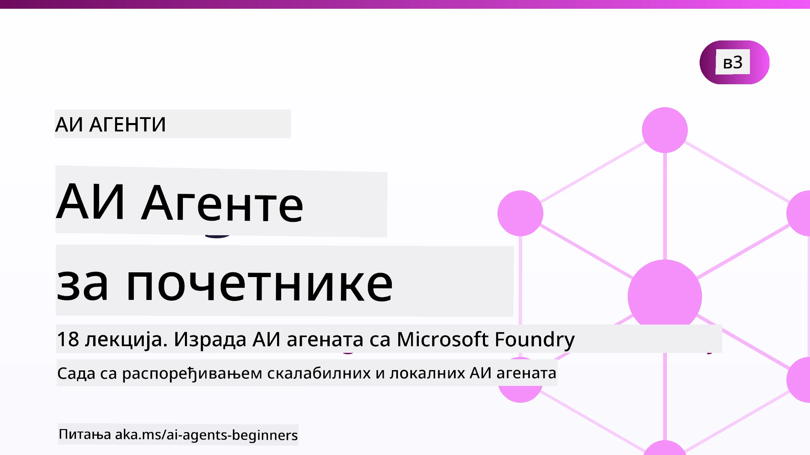

# AI агенти за почетнике - курс



## Курс који вас учи свему што треба да знате да бисте почели да правите AI агенте

[](https://github.com/microsoft/ai-agents-for-beginners/blob/master/LICENSE?WT.mc_id=academic-105485-koreyst)
[](https://GitHub.com/microsoft/ai-agents-for-beginners/graphs/contributors/?WT.mc_id=academic-105485-koreyst)
[](https://GitHub.com/microsoft/ai-agents-for-beginners/issues/?WT.mc_id=academic-105485-koreyst)
[](https://GitHub.com/microsoft/ai-agents-for-beginners/pulls/?WT.mc_id=academic-105485-koreyst)
[](http://makeapullrequest.com?WT.mc_id=academic-105485-koreyst)

### 🌐 Подршка за више језика

#### Подржано преко GitHub акције (аутоматски и увек ажурирано)

<!-- CO-OP TRANSLATOR LANGUAGES TABLE START -->
[Arabic](../ar/README.md) | [Bengali](../bn/README.md) | [Bulgarian](../bg/README.md) | [Burmese (Myanmar)](../my/README.md) | [Chinese (Simplified)](../zh-CN/README.md) | [Chinese (Traditional, Hong Kong)](../zh-HK/README.md) | [Chinese (Traditional, Macau)](../zh-MO/README.md) | [Chinese (Traditional, Taiwan)](../zh-TW/README.md) | [Croatian](../hr/README.md) | [Czech](../cs/README.md) | [Danish](../da/README.md) | [Dutch](../nl/README.md) | [Estonian](../et/README.md) | [Finnish](../fi/README.md) | [French](../fr/README.md) | [German](../de/README.md) | [Greek](../el/README.md) | [Hebrew](../he/README.md) | [Hindi](../hi/README.md) | [Hungarian](../hu/README.md) | [Indonesian](../id/README.md) | [Italian](../it/README.md) | [Japanese](../ja/README.md) | [Kannada](../kn/README.md) | [Khmer](../km/README.md) | [Korean](../ko/README.md) | [Lithuanian](../lt/README.md) | [Malay](../ms/README.md) | [Malayalam](../ml/README.md) | [Marathi](../mr/README.md) | [Nepali](../ne/README.md) | [Nigerian Pidgin](../pcm/README.md) | [Norwegian](../no/README.md) | [Persian (Farsi)](../fa/README.md) | [Polish](../pl/README.md) | [Portuguese (Brazil)](../pt-BR/README.md) | [Portuguese (Portugal)](../pt-PT/README.md) | [Punjabi (Gurmukhi)](../pa/README.md) | [Romanian](../ro/README.md) | [Russian](../ru/README.md) | [Serbian (Cyrillic)](./README.md) | [Slovak](../sk/README.md) | [Slovenian](../sl/README.md) | [Spanish](../es/README.md) | [Swahili](../sw/README.md) | [Swedish](../sv/README.md) | [Tagalog (Filipino)](../tl/README.md) | [Tamil](../ta/README.md) | [Telugu](../te/README.md) | [Thai](../th/README.md) | [Turkish](../tr/README.md) | [Ukrainian](../uk/README.md) | [Urdu](../ur/README.md) | [Vietnamese](../vi/README.md)

> **Волите да клонирате локално?**
>
> Овај репозиторијум укључује преко 50 превода на различите језике, што знатно повећава величину преузимања. Да бисте клонирали без превода, користите sparse checkout:
>
> **Bash / macOS / Linux:**
> ```bash
> git clone --filter=blob:none --sparse https://github.com/microsoft/ai-agents-for-beginners.git
> cd ai-agents-for-beginners
> git sparse-checkout set --no-cone '/*' '!translations' '!translated_images'
> ```
>
> **CMD (Windows):**
> ```cmd
> git clone --filter=blob:none --sparse https://github.com/microsoft/ai-agents-for-beginners.git
> cd ai-agents-for-beginners
> git sparse-checkout set --no-cone "/*" "!translations" "!translated_images"
> ```
>
> Ово вам даје све што вам је потребно за завршетак курса са много бржим преузимањем.
<!-- CO-OP TRANSLATOR LANGUAGES TABLE END -->

**Ако желите да имате подршку за додатне језике превода, они су наведени [овде](https://github.com/Azure/co-op-translator/blob/main/getting_started/supported-languages.md).**

[](https://GitHub.com/microsoft/ai-agents-for-beginners/watchers/?WT.mc_id=academic-105485-koreyst)
[](https://GitHub.com/microsoft/ai-agents-for-beginners/network/?WT.mc_id=academic-105485-koreyst)
[](https://GitHub.com/microsoft/ai-agents-for-beginners/stargazers/?WT.mc_id=academic-105485-koreyst)

[](https://discord.com/invite/ATgtXmAS5D)


## 🌱 Почетак

Овај курс садржи лекције које покривају основе прављења AI агената. Свака лекција има своју тему, па започните где год желите!

Постоји подршка за више језика у овом курсу. Погледајте наше [доступне језике овде](#-multi-language-support). 

Ако вам је ово први пут да радите са генеративним AI моделима, погледајте наш курс [Generative AI For Beginners](https://aka.ms/genai-beginners), који садржи 21 лекцију о изградњи са GenAI.

Не заборавите да [означите (🌟) овај репо](https://docs.github.com/en/get-started/exploring-projects-on-github/saving-repositories-with-stars?WT.mc_id=academic-105485-koreyst) и [форкујете овај репо](https://github.com/microsoft/ai-agents-for-beginners/fork) да бисте покренули код.

### Упознајте друге ученике, добијте одговоре на ваша питања

Ако запнете или имате питања о прављењу AI агената, придружите се нашем посвећеном Discord каналу у [Microsoft Foundry Discord](https://aka.ms/ai-agents/discord).

### Шта вам треба

Свака лекција у овом курсу укључује примере кода, који се налазе у фолдеру code_samples. Можете [форковати овај репо](https://github.com/microsoft/ai-agents-for-beginners/fork) да бисте направили своју копију.  

Примери кода у овим вежбама користе Microsoft Agent Framework са Microsoft Foundry Agent Service V2:

- [Microsoft Foundry](https://aka.ms/ai-agents-beginners/ai-foundry) - потребан Azure налог

Овај курс користи следеће AI Agent оквире и услуге из Microsoft-а:

- [Microsoft Agent Framework (MAF)](https://aka.ms/ai-agents-beginners/agent-framework)
- [Microsoft Foundry Agent Service V2](https://aka.ms/ai-agents-beginners/ai-agent-service)

Неки примери кода такође подржавају алтернативне провајдере компатибилне са OpenAI као што је [MiniMax](https://platform.minimaxi.com/), који нуди моделе са великим контекстом (до 204К токена). Погледајте [Course Setup](./00-course-setup/README.md) за детаље конфигурације.

За више информација о покретању кода за овај курс, идите на [Course Setup](./00-course-setup/README.md).

## 🙏 Желите да помогнете?

Имате предлоге или сте пронашли правописне или кодне грешке? [Подигните проблем](https://github.com/microsoft/ai-agents-for-beginners/issues?WT.mc_id=academic-105485-koreyst) или [Креирајте pull захтев](https://github.com/microsoft/ai-agents-for-beginners/pulls?WT.mc_id=academic-105485-koreyst)


## 📂 Свака лекција садржи

- Писану лекцију у README-у и кратки видео
- Python примере кода који користе Microsoft Agent Framework са Microsoft Foundry
- Линкове ка додатним ресурсима за наставак учења


## 🗃️ Лекције

| **Лекција**                                  | **Текст и Код**                                    | **Видео**                                                  | **Додатно учење**                                                                     |
|----------------------------------------------|----------------------------------------------------|------------------------------------------------------------|----------------------------------------------------------------------------------------|
| Увод у AI агенте и случајеве коришћења агената | [Линк](./01-intro-to-ai-agents/README.md)          | [Видео](https://youtu.be/3zgm60bXmQk?si=z8QygFvYQv-9WtO1)  | [Линк](https://aka.ms/ai-agents-beginners/collection?WT.mc_id=academic-105485-koreyst) |
| Истраживање AI Agentic оквира                  | [Линк](./02-explore-agentic-frameworks/README.md)  | [Видео](https://youtu.be/ODwF-EZo_O8?si=Vawth4hzVaHv-u0H)  | [Линк](https://aka.ms/ai-agents-beginners/collection?WT.mc_id=academic-105485-koreyst) |
| Разумевање AI Agentic образаца дизајна          | [Линк](./03-agentic-design-patterns/README.md)     | [Видео](https://youtu.be/m9lM8qqoOEA?si=BIzHwzstTPL8o9GF)  | [Линк](https://aka.ms/ai-agents-beginners/collection?WT.mc_id=academic-105485-koreyst) |
| Образац употребе алата                         | [Линк](./04-tool-use/README.md)                    | [Видео](https://youtu.be/vieRiPRx-gI?si=2z6O2Xu2cu_Jz46N)  | [Линк](https://aka.ms/ai-agents-beginners/collection?WT.mc_id=academic-105485-koreyst) |
| Agentic RAG                                   | [Линк](./05-agentic-rag/README.md)                 | [Видео](https://youtu.be/WcjAARvdL7I?si=gKPWsQpKiIlDH9A3)  | [Линк](https://aka.ms/ai-agents-beginners/collection?WT.mc_id=academic-105485-koreyst) |
| Прављење поузданих AI агената                  | [Линк](./06-building-trustworthy-agents/README.md) | [Видео](https://youtu.be/iZKkMEGBCUQ?si=jZjpiMnGFOE9L8OK ) | [Линк](https://aka.ms/ai-agents-beginners/collection?WT.mc_id=academic-105485-koreyst) |
| Образац планирања                              | [Линк](./07-planning-design/README.md)             | [Видео](https://youtu.be/kPfJ2BrBCMY?si=6SC_iv_E5-mzucnC)  | [Линк](https://aka.ms/ai-agents-beginners/collection?WT.mc_id=academic-105485-koreyst) |
| Образац вишеструких агената                     | [Линк](./08-multi-agent/README.md)                 | [Видео](https://youtu.be/V6HpE9hZEx0?si=rMgDhEu7wXo2uo6g)  | [Линк](https://aka.ms/ai-agents-beginners/collection?WT.mc_id=academic-105485-koreyst) |

| Образац дизајна метакогниције                 | [Линк](./09-metacognition/README.md)               | [Видео](https://youtu.be/His9R6gw6Ec?si=8gck6vvdSNCt6OcF)  | [Линк](https://aka.ms/ai-agents-beginners/collection?WT.mc_id=academic-105485-koreyst) |
| AI агенти у продукцији                        | [Линк](./10-ai-agents-production/README.md)        | [Видео](https://youtu.be/l4TP6IyJxmQ?si=31dnhexRo6yLRJDl)  | [Линк](https://aka.ms/ai-agents-beginners/collection?WT.mc_id=academic-105485-koreyst) |
| Коришћење агентских протокола (MCP, A2A и NLWeb) | [Линк](./11-agentic-protocols/README.md)           | [Видео](https://youtu.be/X-Dh9R3Opn8)                                 | [Линк](https://aka.ms/ai-agents-beginners/collection?WT.mc_id=academic-105485-koreyst) |
| Контекстуални инжењеринг за AI агенте         | [Линк](./12-context-engineering/README.md)         | [Видео](https://youtu.be/F5zqRV7gEag)                                 | [Линк](https://aka.ms/ai-agents-beginners/collection?WT.mc_id=academic-105485-koreyst) |
| Управљање агентском меморијом                  | [Линк](./13-agent-memory/README.md)     |      [Видео](https://youtu.be/QrYbHesIxpw?si=vZkVwKrQ4ieCcIPx)                                                      |                                                                                        |
| Истраживање Microsoft Agent Framework           | [Линк](./14-microsoft-agent-framework/README.md)                            |                                                            |                                                                                        |
| Прављење агената за коришћење компјутера (CUA) | [Линк](./15-browser-use/README.md)     |                                                            | [Линк](https://docs.browser-use.com/examples/templates/playwright-integration)         |
| Деплојовање скалабилних агената                  | [Линк](./16-deploying-scalable-agents/README.md) |                                                    | [Линк](https://learn.microsoft.com/azure/ai-foundry/agents/overview)                   |
| Креирање локалних AI агената                      | [Линк](./17-creating-local-ai-agents/README.md)  |                                                    | [Линк](https://learn.microsoft.com/azure/ai-foundry/foundry-local/)                    |
| Откривање сигурности AI агената                   | [Линк](./18-securing-ai-agents/README.md)  |                                                            | [Линк](https://aka.ms/ai-agents-beginners/collection?WT.mc_id=academic-105485-koreyst) |

## 🎒 Остали курсеви

Наш тим производи и друге курсеве! Погледајте:

<!-- CO-OP TRANSLATOR OTHER COURSES START -->
### LangChain
[](https://aka.ms/langchain4j-for-beginners)
[](https://aka.ms/langchainjs-for-beginners?WT.mc_id=m365-94501-dwahlin)
[](https://github.com/microsoft/langchain-for-beginners?WT.mc_id=m365-94501-dwahlin)
---

### Azure / Edge / MCP / Агенти
[](https://github.com/microsoft/AZD-for-beginners?WT.mc_id=academic-105485-koreyst)
[](https://github.com/microsoft/edgeai-for-beginners?WT.mc_id=academic-105485-koreyst)
[](https://github.com/microsoft/mcp-for-beginners?WT.mc_id=academic-105485-koreyst)
[](https://github.com/microsoft/ai-agents-for-beginners?WT.mc_id=academic-105485-koreyst)

---
 
### Серии генеративног AI
[](https://github.com/microsoft/generative-ai-for-beginners?WT.mc_id=academic-105485-koreyst)
[-9333EA?style=for-the-badge&labelColor=E5E7EB&color=9333EA)](https://github.com/microsoft/Generative-AI-for-beginners-dotnet?WT.mc_id=academic-105485-koreyst)
[-C084FC?style=for-the-badge&labelColor=E5E7EB&color=C084FC)](https://github.com/microsoft/generative-ai-for-beginners-java?WT.mc_id=academic-105485-koreyst)
[-E879F9?style=for-the-badge&labelColor=E5E7EB&color=E879F9)](https://github.com/microsoft/generative-ai-with-javascript?WT.mc_id=academic-105485-koreyst)

---
 
### Основно учење
[](https://aka.ms/ml-beginners?WT.mc_id=academic-105485-koreyst)
[](https://aka.ms/datascience-beginners?WT.mc_id=academic-105485-koreyst)
[](https://aka.ms/ai-beginners?WT.mc_id=academic-105485-koreyst)
[](https://github.com/microsoft/Security-101?WT.mc_id=academic-96948-sayoung)
[](https://aka.ms/webdev-beginners?WT.mc_id=academic-105485-koreyst)
[](https://aka.ms/iot-beginners?WT.mc_id=academic-105485-koreyst)
[](https://github.com/microsoft/xr-development-for-beginners?WT.mc_id=academic-105485-koreyst)

---
 
### Copilot серија
[](https://aka.ms/GitHubCopilotAI?WT.mc_id=academic-105485-koreyst)
[](https://github.com/microsoft/mastering-github-copilot-for-dotnet-csharp-developers?WT.mc_id=academic-105485-koreyst)
[](https://github.com/microsoft/CopilotAdventures?WT.mc_id=academic-105485-koreyst)
<!-- CO-OP TRANSLATOR OTHER COURSES END -->

## 🌟 Захвалница за заједницу

Захваљујемо [Shivam Goyal](https://www.linkedin.com/in/shivam2003/) на доприносу важних примера кода који демонстрирају Agentic RAG.

## Допринoс

Овај пројекат поздравља доприносе и сугестије. Већина доприноса захтева да се сагласите са
Уговором о лиценцирању доприноса (CLA) који изјављује да имате право, и заиста дали сте нам
права за коришћење вашег доприноса. За детаље, посетите <https://cla.opensource.microsoft.com>.

Када поднесете захтев за промену, CLA бот ће аутоматски одредити да ли треба да доставите
CLA и одговарајуће означити ПР (нпр., проверу статуса, коментар). Једноставно пратите упутства
које пружа бот. Ово ћете морати да урадите само једном у свим репозиторijумима који користе наш CLA.

Овај пројекат је усвојио [Microsoft Отворени Кодекс Понашања](https://opensource.microsoft.com/codeofconduct/).
За више информација погледајте [ЧПП кодекса понашања](https://opensource.microsoft.com/codeofconduct/faq/) или
контактирајте [opencode@microsoft.com](mailto:opencode@microsoft.com) за додатна питања или коментаре.

## Заштитни знаци

Овај пројекат можда садржи заштитне знаке или логотипе пројеката, производа или услуга. Овлашћена употреба Microsoft
заштитних знакова или логотипа подлеже и мора да следи
[Microsoft Упутства за знакове и бренд](https://www.microsoft.com/legal/intellectualproperty/trademarks/usage/general).
Употреба Microsoft заштитних знакова или логотипа у модификованим верзијама овог пројекта не сме да изазове конфузију или да имплицира спонзорство од стране Microsoft-а.
Свака употреба знакова или логотипа трећих страна подлеже политикама тих трећих страна.

## Добијање помоћи


Ако запнете или имате питања у вези са прављењем AI апликација, придружите се:

[](https://aka.ms/foundry/discord)

Ако имате повратне информације о производу или грешке током прављења посетите:

[](https://aka.ms/foundry/forum)

---

<!-- CO-OP TRANSLATOR DISCLAIMER START -->
**Изјава о одрицању одговорности**:
Овај документ је преведен коришћењем услуге за аутоматски превод [Co-op Translator](https://github.com/Azure/co-op-translator). Иако тежимо тачности, имајте у виду да аутоматски преводи могу садржати грешке или нетачности. Оригинални документ на његовом изворном језику треба сматрати ауторитативним извором. За критичне информације препоручује се професионални људски превод. Нисмо одговорни за било каква неспоразума или погрешна тумачења која произилазе из коришћења овог превода.
<!-- CO-OP TRANSLATOR DISCLAIMER END -->