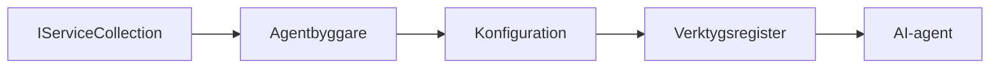

# 🎨 Agentbaserade designmönster med Azure OpenAI (Responses API) (.NET)

## 📋 Lernmål

Detta exempel visar designmönster i företagsklass för att bygga intelligenta agenter med Microsoft Agent Framework i .NET med Azure OpenAI (Responses API) integration. Du kommer att lära dig professionella mönster och arkitektoniska angreppssätt som gör agenter produktionsklara, underhållbara och skalbara.

### Företagsdesignmönster

- 🏭 **Factory Pattern**: Standardiserad agentproduktion med dependency injection
- 🔧 **Builder Pattern**: Fluent agentkonfiguration och setup
- 🧵 **Trådsäkra mönster**: Samtida samtalshantering
- 📋 **Repository Pattern**: Organiserad hantering av verktyg och kapaciteter

## 🎯 .NET-specifika arkitekturfördelar

### Företagsfunktioner

- **Stark typning**: Kompileringstid validering och IntelliSense-stöd
- **Dependency Injection**: Inbyggd DI-behållarintegration
- **Konfigurationshantering**: IConfiguration och Options-mönster
- **Async/Await**: Förstklassigt stöd för asynkron programmering

### Produktionsklara mönster

- **Loggningsintegration**: ILogger och strukturerat loggsupport
- **Hälsokontroller**: Inbyggd övervakning och diagnostik
- **Konfigurationsvalidering**: Stark typning med dataanoteringar
- **Felhantering**: Strukturerad undantagshantering

## 🔧 Teknisk arkitektur

### Kärnkomponenter i .NET

- **Microsoft.Extensions.AI**: Enhetliga AI-tjänsteabstraktioner
- **Microsoft.Agents.AI**: Företagsramverk för agentorkestrering
- **Azure OpenAI (Responses API)**: Högpresterande API-klientmönster
- **Konfigurationssystem**: appsettings.json och miljöintegration

### Implementering av designmönster



## 🏗️ Företagsmönster som demonstreras

### 1. **Skapandemönster**

- **Agent Factory**: Centraliserad agentproduktion med konsekvent konfiguration
- **Builder Pattern**: Fluent API för komplex agentkonfiguration
- **Singleton Pattern**: Delade resurser och konfigurationshantering
- **Dependency Injection**: Lös koppling och testbarhet

### 2. **Beteendemönster**

- **Strategy Pattern**: Utbytbara verktygsutförandestrategier
- **Command Pattern**: Inkapslade agentoperationer med undo/redo
- **Observer Pattern**: Händelsestyrd agentlivscykelhantering
- **Template Method**: Standardiserade agentutförandeflöden

### 3. **Strukturella mönster**

- **Adapter Pattern**: Azure OpenAI (Responses API) integrationslager
- **Decorator Pattern**: Agentkapacitetsförbättring
- **Facade Pattern**: Förenklade agentinteraktionsgränssnitt
- **Proxy Pattern**: Lat laddning och caching för prestanda

## 📚 .NET Designprinciper

### SOLID-principerna

- **Single Responsibility**: Varje komponent har ett tydligt syfte
- **Open/Closed**: Utbyggbar utan modifiering
- **Liskov Substitution**: Gränssnittsbaserade verktygsimplementeringar
- **Interface Segregation**: Fokuserade, sammanhållna gränssnitt
- **Dependency Inversion**: Bero på abstraktioner, inte konkretioner

### Clean Architecture

- **Domänlager**: Kärnagent- och verktygsabstraktioner
- **Applikationslager**: Agentorkestrering och arbetsflöden
- **Infrastrukturlager**: Azure OpenAI (Responses API) integration och externa tjänster
- **Presentationslager**: Användarinteraktion och svarformatering

## 🔒 Företagshänsyn

### Säkerhet

- **Referenshantering**: Säker hantering av API-nycklar med IConfiguration
- **Inmatningsvalidering**: Stark typning och validering med dataanoteringar
- **Utmatningssanering**: Säker svarshantering och filtrering
- **Revisionsloggning**: Omfattande operationsspårning

### Prestanda

- **Async-mönster**: Icke-blockerande I/O-operationer
- **Anslutningspoolning**: Effektiv hantering av HTTP-klienter
- **Caching**: Svarscaching för förbättrad prestanda
- **Resurshantering**: Korrekt nedstädning och disposal-mönster

### Skalbarhet

- **Trådsäkerhet**: Samtidigt agentsutförandestöd
- **Resursuthyrning**: Effektiv resursutnyttjande
- **Belastningshantering**: Begränsning av hastighet och backpressure-hantering
- **Övervakning**: Prestandamått och hälsokontroller

## 🚀 Produktionsdistribution

- **Konfigurationshantering**: Miljöspecifika inställningar
- **Loggningsstrategi**: Strukturerad loggning med korrelations-ID:n
- **Felhantering**: Global undantagshantering med korrekt återhämtning
- **Övervakning**: Application Insights och prestandaräknare
- **Testning**: Enhetstester, integrationstester och belastningstestningsmönster

Redo att bygga intelligenta agenter i företagsklass med .NET? Låt oss arkitektera något robust! 🏢✨

## 🚀 Komma igång

### Förutsättningar

- [.NET 10 SDK](https://dotnet.microsoft.com/download/dotnet/10.0) eller högre
- En [Azure-prenumeration](https://azure.microsoft.com/free/) med en Azure OpenAI-resurs och en modellutplacering
- Azure CLI (https://learn.microsoft.com/cli/azure/install-azure-cli) — logga in med `az login`

### Obligatoriska miljövariabler

```bash
# zsh/bash
export AZURE_OPENAI_ENDPOINT=https://<your-resource>.openai.azure.com
export AZURE_OPENAI_DEPLOYMENT=gpt-5-mini
# Logga in så att AzureCliCredential kan hämta en token
az login
```

```powershell
# PowerShell
$env:AZURE_OPENAI_ENDPOINT = "https://<your-resource>.openai.azure.com"
$env:AZURE_OPENAI_DEPLOYMENT = "gpt-5-mini"
# Logga in så att AzureCliCredential kan få en token
az login
```

### Exempelkod

För att köra kodexemplet,

```bash
# zsh/bash
chmod +x ./03-dotnet-agent-framework.cs
./03-dotnet-agent-framework.cs
```

Eller med dotnet CLI:

```bash
dotnet run ./03-dotnet-agent-framework.cs
```

Se [`03-dotnet-agent-framework.cs`](../../../../03-agentic-design-patterns/code_samples/03-dotnet-agent-framework.cs) för komplett kod.

```csharp
#!/usr/bin/dotnet run

#:package Microsoft.Extensions.AI@10.*
#:package Microsoft.Agents.AI.OpenAI@1.*-*
#:package Azure.AI.OpenAI@2.1.0
#:package Azure.Identity@1.13.1

using System.ComponentModel;

using Microsoft.Agents.AI;
using Microsoft.Extensions.AI;

using Azure.AI.OpenAI;
using Azure.Identity;

// Tool Function: Random Destination Generator
// This static method will be available to the agent as a callable tool
// The [Description] attribute helps the AI understand when to use this function
// This demonstrates how to create custom tools for AI agents
[Description("Provides a random vacation destination.")]
static string GetRandomDestination()
{
    // List of popular vacation destinations around the world
    // The agent will randomly select from these options
    var destinations = new List<string>
    {
        "Paris, France",
        "Tokyo, Japan",
        "New York City, USA",
        "Sydney, Australia",
        "Rome, Italy",
        "Barcelona, Spain",
        "Cape Town, South Africa",
        "Rio de Janeiro, Brazil",
        "Bangkok, Thailand",
        "Vancouver, Canada"
    };

    // Generate random index and return selected destination
    // Uses System.Random for simple random selection
    var random = new Random();
    int index = random.Next(destinations.Count);
    return destinations[index];
}

// Azure OpenAI with the Responses API (stable v1 endpoint). Sign in with `az login`.
var azureEndpoint = Environment.GetEnvironmentVariable("AZURE_OPENAI_ENDPOINT")
    ?? throw new InvalidOperationException("AZURE_OPENAI_ENDPOINT is not set.");
var deployment = Environment.GetEnvironmentVariable("AZURE_OPENAI_DEPLOYMENT") ?? "gpt-5-mini";

var azureClient = new AzureOpenAIClient(new Uri(azureEndpoint), new AzureCliCredential());

// Define Agent Identity and Comprehensive Instructions
// Agent name for identification and logging purposes
var AGENT_NAME = "TravelAgent";

// Detailed instructions that define the agent's personality, capabilities, and behavior
// This system prompt shapes how the agent responds and interacts with users
var AGENT_INSTRUCTIONS = """
You are a helpful AI Agent that can help plan vacations for customers.

Important: When users specify a destination, always plan for that location. Only suggest random destinations when the user hasn't specified a preference.

When the conversation begins, introduce yourself with this message:
"Hello! I'm your TravelAgent assistant. I can help plan vacations and suggest interesting destinations for you. Here are some things you can ask me:
1. Plan a day trip to a specific location
2. Suggest a random vacation destination
3. Find destinations with specific features (beaches, mountains, historical sites, etc.)
4. Plan an alternative trip if you don't like my first suggestion

What kind of trip would you like me to help you plan today?"

Always prioritize user preferences. If they mention a specific destination like "Bali" or "Paris," focus your planning on that location rather than suggesting alternatives.
""";

// Create AI Agent with Advanced Travel Planning Capabilities
// Get the Responses client for the deployment and create the AI agent
// Configure agent with name, detailed instructions, and available tools
// This demonstrates the .NET agent creation pattern with full configuration
AIAgent agent = azureClient
    .GetChatClient(deployment)
    .AsAIAgent(
        name: AGENT_NAME,
        instructions: AGENT_INSTRUCTIONS,
        tools: [AIFunctionFactory.Create(GetRandomDestination)]
    );

// Create New Conversation Session for Context Management
// Initialize a new conversation session to maintain context across multiple interactions
// Sessions enable the agent to remember previous exchanges and maintain conversational state
// This is essential for multi-turn conversations and contextual understanding
var session = await agent.CreateSessionAsync();

// Execute Agent: First Travel Planning Request
// Run the agent with an initial request that will likely trigger the random destination tool
// The agent will analyze the request, use the GetRandomDestination tool, and create an itinerary
// Using the session parameter maintains conversation context for subsequent interactions
await foreach (var update in agent.RunStreamingAsync("Plan me a day trip", session))
{
    await Task.Delay(10);
    Console.Write(update);
}

Console.WriteLine();

// Execute Agent: Follow-up Request with Context Awareness
// Demonstrate contextual conversation by referencing the previous response
// The agent remembers the previous destination suggestion and will provide an alternative
// This showcases the power of conversation sessions and contextual understanding in .NET agents
await foreach (var update in agent.RunStreamingAsync("I don't like that destination. Plan me another vacation.", session))
{
    await Task.Delay(10);
    Console.Write(update);
}
```

---

<!-- CO-OP TRANSLATOR DISCLAIMER START -->
**Ansvarsfriskrivning**:
Detta dokument har översatts med hjälp av AI-översättningstjänsten [Co-op Translator](https://github.com/Azure/co-op-translator). Även om vi strävar efter noggrannhet, var vänlig notera att automatiska översättningar kan innehålla fel eller brister. Det ursprungliga dokumentet på dess modersmål bör betraktas som den auktoritativa källan. För kritisk information rekommenderas professionell mänsklig översättning. Vi ansvarar inte för några missförstånd eller feltolkningar som uppstår till följd av användningen av denna översättning.
<!-- CO-OP TRANSLATOR DISCLAIMER END -->