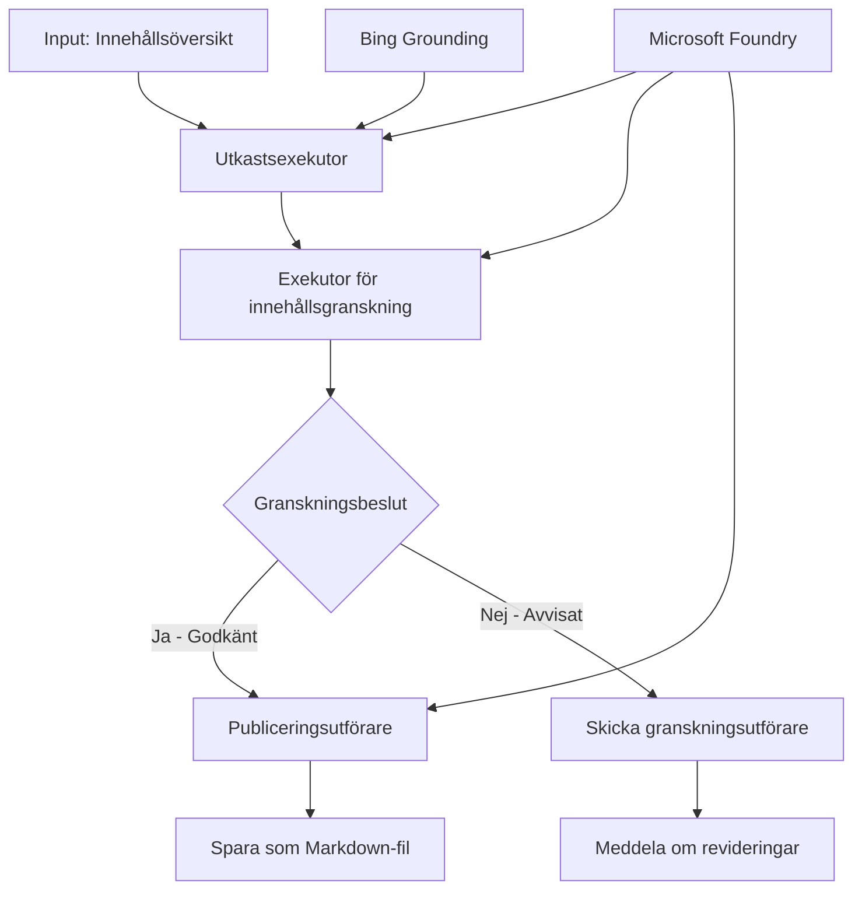

# 🔀 Villkorliga Agentarbetsflöden med Microsoft Foundry (.NET)

## 📋 Tutorial för Intelligenta Beslutsbaserade Arbetsflöden

Denna anteckningsbok demonstrerar **villkorliga arbetsflödesmönster** med Microsoft Foundry och Microsoft Agent Framework för .NET. Du lär dig hur du bygger sofistikerade, beslutsdrivna arbetsflöden som intelligent styr processer baserat på AI-analys, affärsregler och dynamiska villkor för automation i företagsklass.

## 🎯 Inlärningsmål

### 🧠 **Intelligent Beslutsarkitektur**
- **Implementering av Villkorslogik**: Bygg komplexa beslutsträd med flera förgreningar
- **AI-Driven Styrning**: Använd Microsoft Foundry-modeller för att fatta intelligenta styrningsbeslut
- **Dynamisk Anpassning av Arbetsflöde**: Anpassa arbetsflödets beteende baserat på körningens analys och villkor
- **Integrering av Företagsregler**: Införliva affärslogik och efterlevnadskrav i arbetsflöden

### 🔀 **Avancerade Villkorliga Mönster**
- **Beslutstagning med Flera Kriterier**: Utvärdera flera faktorer för styrningsbeslut
- **Kontextmedveten Bearbetning**: Fatta beslut baserat på ackumulerad arbetsflödeskontekst och historik
- **Adaptiv Modifiering av Arbetsflöde**: Justera bearbetningsvägar dynamiskt baserat på realtidsvillkor
- **Integrering av Regelmotor**: Implementera sofistikerade affärsregelmotorn inom arbetsflöden

### 🏢 **Företagsanpassade Villkorliga Applikationer**
- **Dokumentklassificering & Styrning**: Automatiskt klassificera och styra dokument till lämpliga arbetsflöden
- **Kundservice Triage**: Intelligent styrning av kundförfrågningar till specialiserade hanteringsteam
- **Efterlevnad & Riskhantering**: Tillämpa olika validerings- och granskningsprocesser baserat på riskbedömning
- **Kvalitetssäkringsarbetsflöden**: Styr innehåll genom lämpliga granskningsprocesser baserat på kvalitetsmått

## ⚙️ Förutsättningar & Installation

### 📦 **Nödvändiga NuGet Paket**

Avancerade paket för villkorlig arbetsflödesbearbetning:

```xml
<!-- Core AI Framework -->
<PackageReference Include="Microsoft.Extensions.AI" Version="9.9.0" />

<!-- Azure AI Agents with Persistent State -->
<PackageReference Include="Azure.AI.Agents.Persistent" Version="1.2.0-beta.5" />

<!-- Azure Identity and Utilities -->
<PackageReference Include="Azure.Identity" Version="1.15.0" />
<PackageReference Include="System.Linq.Async" Version="6.0.3" />
<PackageReference Include="DotNetEnv" Version="3.1.1" />

<!-- Local Workflow Framework References -->
<!-- Microsoft.Agents.Workflows.dll - Advanced workflow orchestration -->
<!-- Microsoft.Agents.AI.AzureAI.dll - Microsoft Foundry integration -->
<!-- Microsoft.Agents.AI.dll - Core agent abstractions -->
```

### 🔑 **Microsoft Foundry-konfiguration**

**Nödvändiga Azure-resurser:**
- Microsoft Foundry-arbetsyta med villkorliga bearbetningsmodeller
- Azure-prenumeration med lämpliga beräkningskvoter och behörigheter
- Distribuerade AI-modeller för beslutsfattande och innehållsanalys
- (Valfritt) Bing Search API-anslutning för grundläggande funktioner

**Miljökonfiguration (.env-fil):**
```env
# Microsoft Foundry Configuration
AZURE_AI_PROJECT_ENDPOINT=https://your-project.cognitiveservices.azure.com/
BING_CONNECTION_ID=your-bing-connection-id
```

**Autentiseringsinställningar:**
```csharp
// Azure CLI or Managed Identity authentication
using Azure.Identity;
var credential = new AzureCliCredential();

// Load environment configuration
DotNetEnv.Env.Load("../../../.env");
```

### 🏗️ **Arkitektur för Villkorligt Arbetsflöde**



**Viktiga Komponenter:**
- **Draft Executor**: AI-agent som skapar initiala innehållsutkast från dispositioner
- **Content Review Executor**: AI-agent som utvärderar utkastkvalitet och efterlevnad
- **Villkorlig Styrning**: Beslutslogik som styr baserat på granskningsresultat
- **Publicerings-/Granskningsvägar**: Separata bearbetningsvägar för godkänt vs avvisat innehåll
- **Tillståndshantering**: Underhåller innehålls- och granskningskontekst genom arbetsflödet

## 🎨 **Designmönster för Villkorliga Arbetsflöden**

### 📋 **Innehållsproduktion med Kvalitetskontroller**
```
Outline → Draft Creation → Quality Review → {Approve: Publish | Reject: Revise}
```

### 🎯 **Riskbaserad Dokumentbearbetning**
```
Document → Risk Assessment → {Low: Standard | High: Enhanced Review}
```

### 🔍 **Intelligent Kundservicestyrning**
```
Customer Query → Analysis → {Simple: FAQ Bot | Complex: Human Agent}
```

### 💼 **Efterlevnadsdrivna Arbetsflöden**
```
Content → Compliance Check → {Pass: Publish | Fail: Legal Review}
```

## 🏢 **Företagsfördelar med Villkorlighet**

### 🎯 **Intelligent Automation**
- **Smart Beslutsfattande**: AI-baserade styrningsbeslut baserade på innehållsanalys och kontext
- **Adaptiv Bearbetning**: Arbetsflöden som automatiskt anpassar sig efter förändrade villkor
- **Tillämpning av Affärsregler**: Automatisk tillämpning av komplex affärslogik och policyer
- **Kontextmedveten Styrning**: Beslut baserade på fullständig arbetsflödeshistorik och ackumulerad kontext

### 📈 **Operativ Förträfflighet**
- **Optimerad Resursallokering**: Styr arbete till mest lämpliga specialister och processer
- **Minskad Manuell Inblandning**: Automatiserat beslutsfattande minimerar behov av mänsklig styrning
- **Snabbare Lösningstider**: Direkt styrning till rätt expertis och bearbetningskapacitet
- **Konsekvent Tillämpning**: Enhetlig tillämpning av affärsregler och beslutskriterier

### 🛡️ **Riskhantering & Efterlevnad**
- **Automatisk Riskbedömning**: AI-drivna utvärderingar av innehålls- och situationsrisker
- **Efterlevnadstillämpning**: Automatisk styrning genom nödvändiga regulatoriska processer
- **Tillämpning av Säkerhetsprotokoll**: Förbättrade säkerhetsåtgärder baserade på riskbedömning
- **Underhåll av Revisionsspår**: Fullständig dokumentation av styrningsbeslut och motivering

### 📊 **Analyser & Kontinuerlig Förbättring**
- **Beslutsanalys**: Spåra effektivitet och noggrannhet i styrningsbeslut
- **Mönsterigenkänning**: Identifiera trender och mönster i styrningsbeslut över tid
- **Prestandaoptimering**: Kontinuerlig förbättring av beslutskriterier och styrningseffektivitet
- **Affärsintelligens**: Insikter i innehållskaraktäristik och bearbetningskrav

### 🔧 **Teknisk Förträfflighet**
- **Beständig Tillståndshantering**: Behåll komplexa tillstånd under arbetsflödets körning
- **Skalbar Arkitektur**: Hantera högvolyms krav på villkorlig bearbetning
- **Integrationsmöjligheter**: Sömlös integrering med befintliga affärssystem och processer
- **Övervakning & Observerbarhet**: Omfattande spårning av arbetsflödets prestanda och beslut

Låt oss bygga intelligenta, beslutsdrivna företagsarbetsflöden med .NET! 🚀

## 💻 Köra Koden

Fullständig implementering finns i `04.dotnet-agent-framework-workflow-aifoundry-condition.cs`. Detta demonstrerar ett **arbetsflöde för innehållsproduktion med kvalitetskontroller**:

### 🏗️ **Arkitektur för Arbetsflödet**

```
Content Outline → Draft Creation → Quality Review → Conditional Routing:
                                                      ├─ Approved (>200 words) → Publish
                                                      └─ Rejected (<200 words) → Review Notification
```

**Agenter i Arbetsflödet:**
1. **Evangelist Agent**: Skapar tutorialutkast från dispositioner med Bing-grundning
2. **Content Reviewer Agent**: Utvärderar utkastets kvalitet (ordantal, fullständighet)
3. **Publisher Agent**: Sparar godkänt innehåll som tidsstämplade Markdown-filer

**Anpassade Utförare:**
1. **DraftExecutor**: Koordinerar utkastskapandet
2. **ContentReviewExecutor**: Utför kvalitetsbedömning
3. **PublishExecutor**: Hanterar publicering av godkänt innehåll
4. **SendReviewExecutor**: Hanterar notifieringar för avvisat innehåll

### 🚀 Köra Exemplet

**Förutsättningar:**
- Microsoft Foundry-arbetsyta konfigurerad
- Azure CLI-autentisering (`az login`)
- (Valfritt) Bing Search-anslutning för grundning

```bash
# Gör skriptet körbart (Unix/Linux/macOS)
chmod +x 04.dotnet-agent-framework-workflow-aifoundry-condition.cs

# Kör det villkorade arbetsflödet
./04.dotnet-agent-framework-workflow-aifoundry-condition.cs
```

Eller på Windows:
```powershell
dotnet run 04.dotnet-agent-framework-workflow-aifoundry-condition.cs
```

### 📝 Förväntat Utdata

Arbetsflödet kommer att:
1. **Skapa Agenter**: Initiera tre specialiserade Microsoft Foundry-agenter
2. **Generera Utkast**: Evangelist-agenten skapar tutorialutkast från disposition
3. **Granska Innehåll**: Content Reviewer utvärderar utkastkvaliteten
4. **Villkorlig Styrning**:
   - **Om godkänt (>200 ord)**: PublishExecutor sparar som Markdown-fil
   - **Om avvisat (<200 ord)**: Skicka granskningsnotifiering
5. **Visa Resultat**: Visa slutligt arbetsflödesresultat

### 🔧 Anpassningsmöjligheter

**Modifiera Granskningskriterier:**
```csharp
const string ContentReviewerInstructions = @"
You are a content reviewer...
1. Check if content is more than 500 words (instead of 200)
2. Verify technical accuracy
3. Ensure proper formatting
...";
```

**Lägg Till Fler Villkorliga Vägar:**
```csharp
var workflow = new WorkflowBuilder(draftExecutor)
    .AddEdge(draftExecutor, contentReviewerExecutor)
    .AddEdge(contentReviewerExecutor, publishExecutor, condition: GetCondition("Excellent"))
    .AddEdge(contentReviewerExecutor, editExecutor, condition: GetCondition("Good"))
    .AddEdge(contentReviewerExecutor, sendReviewerExecutor, condition: GetCondition("Poor"))
    .Build();
```

**Ändra Innehållskrav:**
```csharp
string OUTLINE_Content = @"
# Your Custom Topic
## Section 1
https://your-reference-url
## Section 2
...
";
```

### 🎯 Verkliga Applikationer

Detta villkorliga arbetsflödesmönster är idealiskt för:
- **Innehållshanteringssystem**: Automatiserade redaktionella arbetsflöden med kvalitetskontroller
- **Dokumenthantering**: Styr dokument baserat på klassificering och efterlevnad
- **Kundsupport**: Intelligent ticket-styrning baserat på komplexitet och brådska
- **Juridisk Granskning**: Styr kontrakt baserat på riskbedömning och värde
- **HR-processer**: Styr ansökningar genom lämpliga screeningsarbetsflöden

### 🔍 Förstå Villkorslogik

**Villkorsfunktion:**
```csharp
public Func<object?, bool> GetCondition(string expectedResult) =>
    reviewResult => reviewResult is ReviewResult review && review.Result == expectedResult;
```

Denna funktion skapar en predikat som:
1. Kontrollerar om resultatet är av typen `ReviewResult`
2. Jämför egenskapen `Result` med det förväntade värdet
3. Returnerar sant/falskt för att bestämma styrning

**Arbetsflödets Kanter med Villkor:**
```csharp
.AddEdge(contentReviewerExecutor, publishExecutor, condition: GetCondition("Yes"))
.AddEdge(contentReviewerExecutor, sendReviewerExecutor, condition: GetCondition("No"))
```

### 📊 Avancerade Funktioner

**JSON Schema-validering:**
Arbetsflödet använder JSON-scheman för att säkerställa strukturerade svar:

```csharp
// Define response structure
public class ReviewResult
{
    [JsonPropertyName("review_result")]
    public string Result { get; set; } = string.Empty;
    
    [JsonPropertyName("reason")]
    public string Reason { get; set; } = string.Empty;
    
    [JsonPropertyName("draft_content")]
    public string DraftContent { get; set; } = string.Empty;
}

// Apply to agent
ResponseFormat = ChatResponseFormat.ForJsonSchema(
    AIJsonUtilities.CreateJsonSchema(typeof(ReviewResult)), 
    "ReviewResult", 
    "Review Result From DraftContent"
)
```

**Bing-grundningsintegration:**
Evangelist-agenten använder Bing-grundning för att få åtkomst till realtidsinformation:

```csharp
var bingGroundingConfig = new BingGroundingSearchConfiguration(bing_conn_id);
BingGroundingToolDefinition bingGroundingTool = new(
    new BingGroundingSearchToolParameters([bingGroundingConfig])
);
```

Detta gör det möjligt för agenten att följa länkar i dispositionen och hämta aktuell information.

### 🛡️ Felhantering

Arbetsflödet inkluderar robust felhantering för avvisat innehåll:
- Granskningsfel triggar alternativ väg
- Notifieringar ger tydliga avvisningsorsaker
- Innehåll sparas för omarbetning

### 🔄 Utvidga Arbetsflödet

**Lägg till en omarbetningsslinga:**
Skapa en återkopplingsslinga som automatiskt omskriver innehållet:

```csharp
.AddEdge(contentReviewerExecutor, publishExecutor, condition: GetCondition("Yes"))
.AddEdge(contentReviewerExecutor, draftExecutor, condition: GetCondition("No")) // Loop back
```

**Implementera Flernivågranskning:**
Lägg till flera granskningssteg med olika kriterier:

```csharp
.AddEdge(draftExecutor, technicalReviewer)
.AddEdge(technicalReviewer, editorialReviewer, condition: GetCondition("TechPass"))
.AddEdge(editorialReviewer, publishExecutor, condition: GetCondition("EditPass"))
```

Detta villkorliga arbetsflödesmönster ger grunden för att bygga sofistikerade, intelligenta företagsautomationssystem! 🚀

---

<!-- CO-OP TRANSLATOR DISCLAIMER START -->
**Ansvarsfriskrivning**:
Detta dokument har översatts med hjälp av AI-översättningstjänsten [Co-op Translator](https://github.com/Azure/co-op-translator). Även om vi strävar efter noggrannhet, var vänlig notera att automatiska översättningar kan innehålla fel eller brister. Det ursprungliga dokumentet på dess modersmål bör betraktas som den auktoritativa källan. För kritisk information rekommenderas professionell mänsklig översättning. Vi ansvarar inte för några missförstånd eller feltolkningar som uppstår till följd av användningen av denna översättning.
<!-- CO-OP TRANSLATOR DISCLAIMER END -->