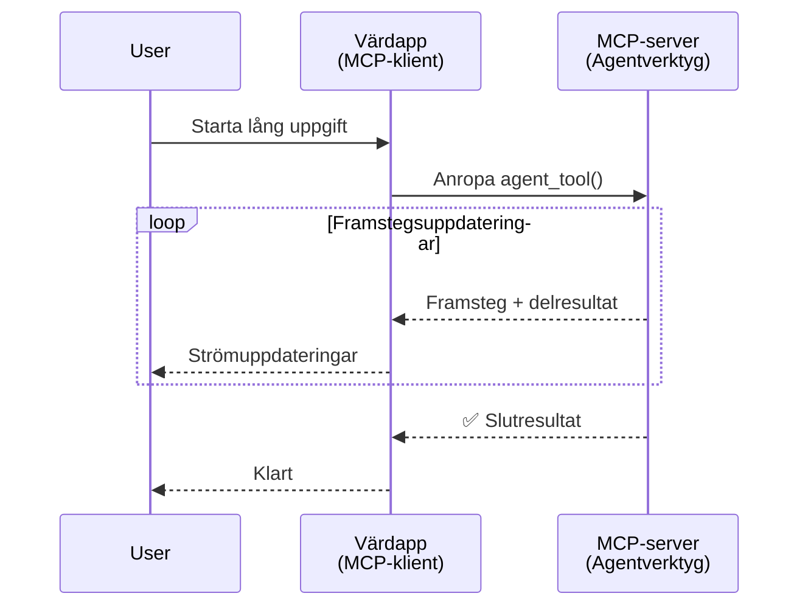
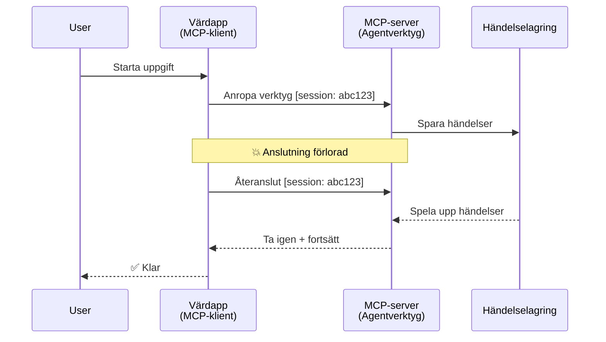
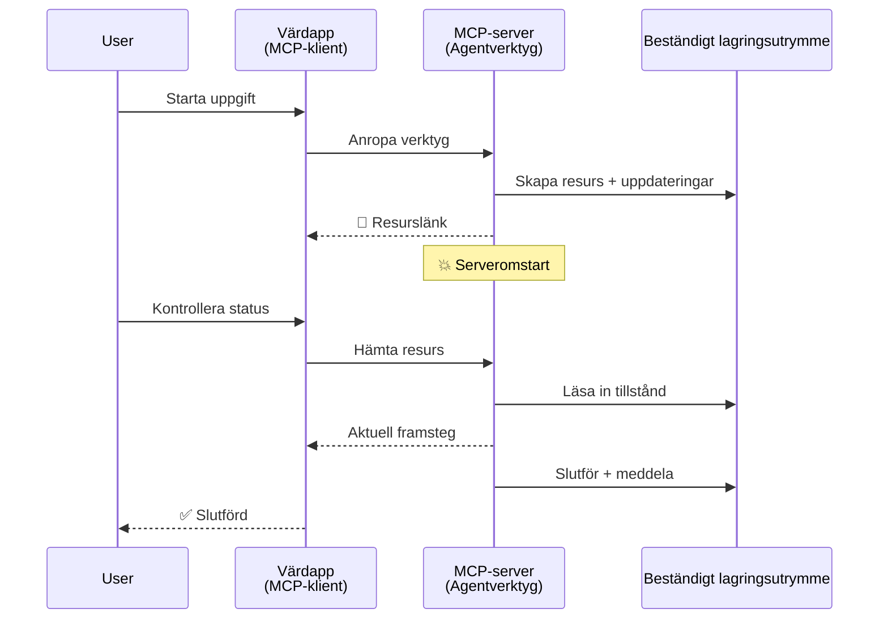
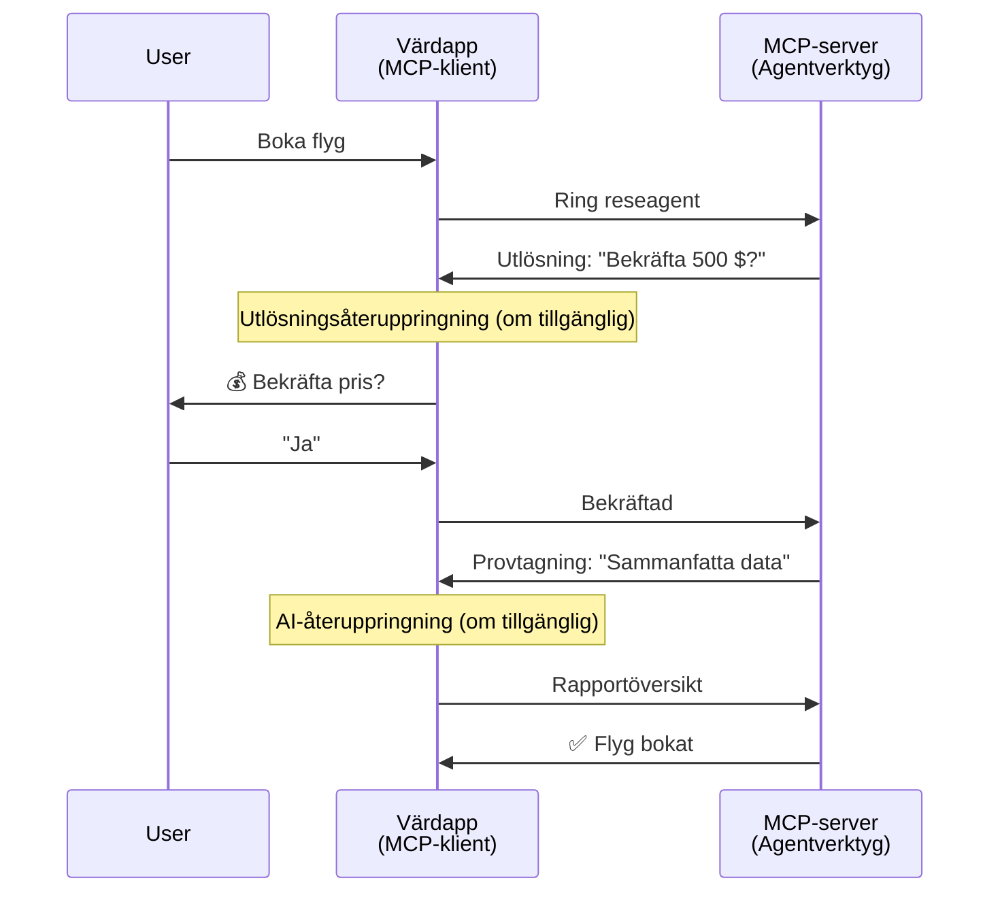
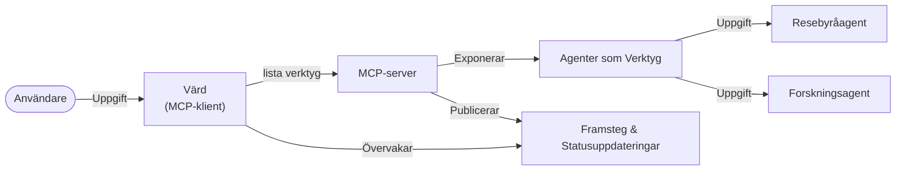

# Bygga Kommunikationssystem mellan Agenter med MCP

> TL;DR - Kan du bygga Agent2Agent-kommunikation på MCP? Ja!

MCP har utvecklats avsevärt bortom sitt ursprungliga mål att "tillhandahålla kontext till LLMs". Med nyliga förbättringar som inkluderar [återupptagningsbara strömmar](https://modelcontextprotocol.io/docs/concepts/transports#resumability-and-redelivery), [elicitation](https://modelcontextprotocol.io/specification/2025-06-18/client/elicitation), [sampling](https://modelcontextprotocol.io/specification/2025-06-18/client/sampling), och notifikationer ([progress](https://modelcontextprotocol.io/specification/2025-06-18/basic/utilities/progress) och [resources](https://modelcontextprotocol.io/specification/2025-06-18/schema#resourceupdatednotification)), erbjuder MCP nu en robust grund för att bygga komplexa kommunikationssystem mellan agenter.

## Missuppfattningen om Agent/Verktyg

När fler utvecklare utforskar verktyg med agentlika beteenden (kör under lång tid, kan kräva ytterligare input under körning, etc.), är en vanlig missuppfattning att MCP är olämpligt främst för att tidiga exempel på dess verktygsprimitiver fokuserade på enkla förfrågan-svar-mönster.

Denna uppfattning är föråldrad. MCP-specifikationen har förbättrats avsevärt under de senaste månaderna med funktioner som sluter gapet för att bygga långvariga agentliknande beteenden:

- **Strömning & Delresultat**: Realtidsuppdateringar under körning
- **Återupptagningsbarhet**: Klienter kan återansluta och fortsätta efter frånkoppling
- **Varaktighet**: Resultat överlever serveromstarter (t.ex. via resurslänkar)
- **Flera omgångar**: Interaktiv input under körning via elicitation och sampling

Dessa egenskaper kan kombineras för att möjliggöra komplexa agent- och multi-agent-applikationer, alla implementerade på MCP-protokollet.

För referens kommer vi att kalla en agent för ett "verktyg" som finns på en MCP-server. Detta förutsätter existensen av en värdapplikation som implementerar en MCP-klient som etablerar en session med MCP-servern och kan anropa agenten.

## Vad gör ett MCP-verktyg "Agentlikt"?

Innan vi går in på implementation, låt oss fastställa vilka infrastrukturfunktioner som behövs för att stödja långvariga agenter.

> Vi definierar en agent som en enhet som kan operera autonomt under längre perioder, kapabel att hantera komplexa uppgifter som kan kräva flera interaktioner eller justeringar baserat på realtidsfeedback.

### 1. Strömning & Delresultat

Traditionella förfrågan-svar-mönster fungerar inte för långvariga uppgifter. Agenter behöver tillhandahålla:

- Realtidsuppdateringar om framsteg
- Mellanresultat

**MCP-Stöd**: Notifikationer om resursuppdateringar möjliggör strömning av delresultat, även om detta kräver noggrann design för att undvika konflikter med JSON-RPC:s 1:1 förfrågan/svar-modell.

| Funktion                   | Användningsfall                                                                                                                                                                  | MCP-Stöd                                                                                   |
| -------------------------- | ------------------------------------------------------------------------------------------------------------------------------------------------------------------------------ | ------------------------------------------------------------------------------------------ |
| Realtidsuppdateringar       | Användare begär en migreringsuppgift för kodbas. Agenten strömmar framsteg: "10% - Analyserar beroenden... 25% - Konverterar TypeScript-filer... 50% - Uppdaterar imports..." | ✅ Progress-notifikationer                                                                 |
| Delresultat                | "Generera en bok"-uppgift strömmar delresultat, t.ex. 1) Storybåge-översikt, 2) Kapitel-lista, 3) Varje kapitel när klart. Värden kan inspektera, avbryta eller styra om när som helst. | ✅ Notifikationer kan "utökas" för att inkludera delresultat se förslag i PR 383, 776        |

<div align="center" style="font-style: italic; font-size: 0.95em; margin-bottom: 0.5em;">
<strong>Figur 1:</strong> Denna diagram visar hur en MCP-agent strömmar realtidsuppdateringar och delresultat till värdapplikationen under en långvarig uppgift, vilket möjliggör för användaren att övervaka körningen i realtid.
</div>



### 2. Återupptagningsbarhet

Agenter måste hantera nätverksavbrott på ett smidigt sätt:

- Återansluta efter (klient) frånkoppling
- Fortsätta från där de slutade (meddelande-återleverans)

**MCP-Stöd**: MCP StreamableHTTP-transport stödjer idag sessionsåterupptagning och meddelandeåterleverans med sessions-ID:n och senaste händelse-ID:n. Viktigt att notera är att servern måste implementera ett EventStore som möjliggör avspelning av händelser vid klientåteranslutning.  
Observera att det finns ett samhällsförslag (PR #975) som utforskar transport-agnostiska återupptagningsbara strömmar.

| Funktion        | Användningsfall                                                                                                                                                 | MCP-Stöd                                                                  |
| -------------- | -------------------------------------------------------------------------------------------------------------------------------------------------------------- | ------------------------------------------------------------------------ |
| Återupptagningsbarhet | Klienten kopplas från under långvarig uppgift. Vid återanslutning återupptas sessionen med missade händelser avspelade, och fortsätter sömlöst där den lämnade. | ✅ StreamableHTTP-transport med sessions-ID, händelseavspelning och EventStore |

<div align="center" style="font-style: italic; font-size: 0.95em; margin-bottom: 0.5em;">
<strong>Figur 2:</strong> Denna diagram visar hur MCP:s StreamableHTTP-transport och event store möjliggör sömlös sessionåterupptagning: om klienten kopplas bort, kan den återansluta och spela upp missade händelser, och fortsätta uppgiften utan förlust av framsteg.
</div>



### 3. Varaktighet

Långvariga agenter behöver bestående status:

- Resultat överlever serveromstarter
- Status kan hämtas utanför band
- Framstegsspårning över sessioner

**MCP-Stöd**: MCP stödjer nu en resurslänk som returtyp för verktygsanrop. En vanlig metod är att designa ett verktyg som skapar en resurs och omedelbart returnerar en resurslänk. Verktyget kan fortsätta att hantera uppgiften i bakgrunden och uppdatera resursen. Klienten kan då välja att poll:a tillståndet för denna resurs för att få del- eller fullständiga resultat (baserat på vilka resursuppdateringar servern tillhandahåller) eller prenumerera på resursen för uppdateringsnotifikationer.

En begränsning här är att pollning av resurser eller prenumeration på uppdateringar kan konsumera resurser med konsekvenser i stor skala. Det finns ett öppet samhällsförslag (inklusive #992) som utforskar möjligheten att inkludera webhooks eller triggers som servern kan kalla för att notifiera klienten/värdapplikationen om uppdateringar.

| Funktion      | Användningsfall                                                                                                                                | MCP-Stöd                                                  |
| ------------ | --------------------------------------------------------------------------------------------------------------------------------------------- | ---------------------------------------------------------- |
| Varaktighet  | Server kraschar under datamigreringsuppgift. Resultat och framsteg överlever omstart, klient kan kontrollera status och fortsätta från resursen. | ✅ Resurslänkar med beständig lagring och statusnotifikationer |

Idag är ett vanligt mönster att designa ett verktyg som skapar en resurs och omedelbart returnerar en resurslänk. Verktyget kan i bakgrunden hantera uppgiften, skicka resursnotifikationer som tjänar som framstegsuppdateringar eller inkluderar delresultat, och uppdatera innehållet i resursen efter behov.

<div align="center" style="font-style: italic; font-size: 0.95em; margin-bottom: 0.5em;">
<strong>Figur 3:</strong> Denna diagram visar hur MCP-agenter använder beständiga resurser och statusnotifikationer för att säkerställa att långvariga uppgifter överlever serveromstarter, vilket tillåter klienter att kontrollera framsteg och hämta resultat även efter fel.
</div>



### 4. Flera Omgångar

Agenter behöver ofta ytterligare input under körning:

- Mänsklig förtydligande eller godkännande
- AI-hjälp för komplexa beslut
- Dynamisk justering av parametrar

**MCP-Stöd**: Fullt stöd via sampling (för AI-input) och elicitation (för mänsklig input).

| Funktion                | Användningsfall                                                                                                                                    | MCP-Stöd                                               |
| ---------------------- | ------------------------------------------------------------------------------------------------------------------------------------------------- | ------------------------------------------------------- |
| Flera Omgångar          | Resebokningsagent begär prisbekräftelse från användaren, sedan ber AI sammanfatta resedata innan bokningen slutförs.                              | ✅ Elicitation för mänsklig input, sampling för AI-input |

<div align="center" style="font-style: italic; font-size: 0.95em; margin-bottom: 0.5em;">
<strong>Figur 4:</strong> Denna diagram visar hur MCP-agenter interaktivt kan framkalla mänsklig input eller begära AI-hjälp under körning, som stödjer komplexa, flergångsarbetsflöden som bekräftelser och dynamiskt beslutsfattande.
</div>



## Implementera Långvariga Agenter på MCP - Kodöversikt

Som en del av denna artikel tillhandahåller vi ett [kodförråd](https://github.com/victordibia/ai-tutorials/tree/main/MCP%20Agents) som innehåller en komplett implementation av långvariga agenter med MCP Python SDK med StreamableHTTP-transport för sessionåterupptagning och meddelandeåterleverans. Implementationen demonstrerar hur MCP-funktioner kan kombineras för att möjliggöra sofistikerade agentlika beteenden.

Specifikt implementerar vi en server med två primära agentverktyg:

- **Reseagent** - Simulerar en resetjänst med prisbekräftelse via elicitation
- **Forskningsagent** - Utför forskningsuppgifter med AI-assisterade sammanfattningar via sampling

Båda agenter demonstrerar realtidsuppdateringar, interaktiva bekräftelser, och fulla sessionsåterupptagningsfunktioner.

### Viktiga implementationskoncept

Följande sektioner visar server-side agentimplementation och klient-side värdhantering för varje funktion:

#### Strömning & Framstegsuppdateringar - Realtidsstatus för uppgifter

Strömning gör det möjligt för agenter att ge realtidsuppdateringar under långvariga uppgifter, så att användare hålls informerade om uppgiftens status och mellanresultat.

**Serverimplementation (agent skickar progress-notifikationer):**

```python
# Från server/server.py - Resebyrå som skickar uppdateringar om framsteg
for i, step in enumerate(steps):
    await ctx.session.send_progress_notification(
        progress_token=ctx.request_id,
        progress=i * 25,
        total=100,
        message=step,
        related_request_id=str(ctx.request_id)
    )
    await anyio.sleep(2)  # Simulera arbete

# Alternativ: Logga meddelanden för detaljerade steg-för-steg-uppdateringar
await ctx.session.send_log_message(
    level="info",
    data=f"Processing step {current_step}/{steps} ({progress_percent}%)",
    logger="long_running_agent",
    related_request_id=ctx.request_id,
)
```

**Klientimplementation (värd tar emot framstegsuppdateringar):**

```python
# Från client/client.py - Klient som hanterar realtidsaviseringar
async def message_handler(message) -> None:
    if isinstance(message, types.ServerNotification):
        if isinstance(message.root, types.LoggingMessageNotification):
            console.print(f"📡 [dim]{message.root.params.data}[/dim]")
        elif isinstance(message.root, types.ProgressNotification):
            progress = message.root.params
            console.print(f"🔄 [yellow]{progress.message} ({progress.progress}/{progress.total})[/yellow]")

# Registrera meddelandehanterare när session skapas
async with ClientSession(
    read_stream, write_stream,
    message_handler=message_handler
) as session:
```

#### Elicitation - Begäran om Användarinput

Elicitation möjliggör för agenter att begära användarinput under körning. Detta är viktigt för bekräftelser, förtydliganden eller godkännanden under långvariga uppgifter.

**Serverimplementation (agent begär bekräftelse):**

```python
# Från server/server.py - Resebyrå som begär prisbekräftelse
elicit_result = await ctx.session.elicit(
    message=f"Please confirm the estimated price of $1200 for your trip to {destination}",
    requestedSchema=PriceConfirmationSchema.model_json_schema(),
    related_request_id=ctx.request_id,
)

if elicit_result and elicit_result.action == "accept":
    # Fortsätt med bokningen
    logger.info(f"User confirmed price: {elicit_result.content}")
elif elicit_result and elicit_result.action == "decline":
    # Avbryt bokningen
    booking_cancelled = True
```

**Klientimplementation (värd tillhandahåller elicitation-callback):**

```python
# Från client/client.py - Klienthantering av eliciteringsförfrågningar
async def elicitation_callback(context, params):
    console.print(f"💬 Server is asking for confirmation:")
    console.print(f"   {params.message}")

    response = console.input("Do you accept? (y/n): ").strip().lower()

    if response in ['y', 'yes']:
        return types.ElicitResult(
            action="accept",
            content={"confirm": True, "notes": "Confirmed by user"}
        )
    else:
        return types.ElicitResult(
            action="decline",
            content={"confirm": False, "notes": "Declined by user"}
        )

# Registrera återuppringningen vid skapandet av sessionen
async with ClientSession(
    read_stream, write_stream,
    elicitation_callback=elicitation_callback
) as session:
```

#### Sampling - Begär AI-assistans

Sampling gör att agenter kan begära hjälp från LLM för komplexa beslut eller innehållsgenerering under körning. Detta möjliggör hybrida människa-AI arbetsflöden.

**Serverimplementation (agent begär AI-assistans):**

```python
# Från server/server.py - Forskningsagent som begär AI-sammanfattning
sampling_result = await ctx.session.create_message(
    messages=[
        SamplingMessage(
            role="user",
            content=TextContent(type="text", text=f"Please summarize the key findings for research on: {topic}")
        )
    ],
    max_tokens=100,
    related_request_id=ctx.request_id,
)

if sampling_result and sampling_result.content:
    if sampling_result.content.type == "text":
        sampling_summary = sampling_result.content.text
        logger.info(f"Received sampling summary: {sampling_summary}")
```

**Klientimplementation (värd tillhandahåller sampling-callback):**

```python
# Från client/client.py - Hantering av sampling-förfrågningar från klienten
async def sampling_callback(context, params):
    message_text = params.messages[0].content.text if params.messages else 'No message'
    console.print(f"🧠 Server requested sampling: {message_text}")

    # I en riktig applikation kan detta anropa ett LLM API
    # För demonstrationsändamål tillhandahåller vi ett simulerat svar
    mock_response = "Based on current research, MCP has evolved significantly..."

    return types.CreateMessageResult(
        role="assistant",
        content=types.TextContent(type="text", text=mock_response),
        model="interactive-client",
        stopReason="endTurn"
    )

# Registrera callback-funktionen vid skapande av sessionen
async with ClientSession(
    read_stream, write_stream,
    sampling_callback=sampling_callback,
    elicitation_callback=elicitation_callback
) as session:
```

#### Återupptagningsbarhet - Sessionskontinuitet vid frånkopplingar

Återupptagningsbarhet säkerställer att långvariga agentuppgifter kan överleva klientfrånkopplingar och fortsätta sömlöst vid återanslutning. Detta implementeras via event stores och återupptagnings tokens.

**Event Store-implementation (server håller sessionsstatus):**

```python
# Från server/event_store.py - Enkel minnesbaserad händelselagret
class SimpleEventStore(EventStore):
    def __init__(self):
        self._events: list[tuple[StreamId, EventId, JSONRPCMessage]] = []
        self._event_id_counter = 0

    async def store_event(self, stream_id: StreamId, message: JSONRPCMessage) -> EventId:
        """Store an event and return its ID."""
        self._event_id_counter += 1
        event_id = str(self._event_id_counter)
        self._events.append((stream_id, event_id, message))
        return event_id

    async def replay_events_after(self, last_event_id: EventId, send_callback: EventCallback) -> StreamId | None:
        """Replay events after the specified ID for resumption."""
        # Hitta händelser efter den senaste kända händelsen och spela upp dem
        for _, event_id, message in self._events[start_index:]:
            await send_callback(EventMessage(message, event_id))

# Från server/server.py - Skickar händelselager till sessionhanterare
def create_server_app(event_store: Optional[EventStore] = None) -> Starlette:
    server = ResumableServer()

    # Skapa sessionhanterare med händelselager för återupptagning
    session_manager = StreamableHTTPSessionManager(
        app=server,
        event_store=event_store,  # Händelselager möjliggör återupptagning av session
        json_response=False,
        security_settings=security_settings,
    )

    return Starlette(routes=[Mount("/mcp", app=session_manager.handle_request)])

# Användning: Initiera med händelselager
event_store = SimpleEventStore()
app = create_server_app(event_store)
```

**Klientmetadata med återupptagningstoken (klient återansluter med lagrat tillstånd):**

```python
# Från client/client.py - Klientåterupptagning med metadata
if existing_tokens and existing_tokens.get("resumption_token"):
    # Använd befintlig återupptagnings-token för att fortsätta där vi slutade
    metadata = ClientMessageMetadata(
        resumption_token=existing_tokens["resumption_token"],
    )
else:
    # Skapa callback för att spara återupptagnings-token när den mottas
    def enhanced_callback(token: str):
        protocol_version = getattr(session, 'protocol_version', None)
        token_manager.save_tokens(session_id, token, protocol_version, command, args)

    metadata = ClientMessageMetadata(
        on_resumption_token_update=enhanced_callback,
    )

# Skicka förfrågan med återupptagningsmetadata
result = await session.send_request(
    types.ClientRequest(
        types.CallToolRequest(
            method="tools/call",
            params=types.CallToolRequestParams(name=command, arguments=args)
        )
    ),
    types.CallToolResult,
    metadata=metadata,
)
```

Värdapplikationen underhåller session-ID:n och återupptagningstokens lokalt, vilket gör det möjligt att återansluta till befintliga sessioner utan att förlora framsteg eller status.

### Kodorganisation

<div align="center" style="font-style: italic; font-size: 0.95em; margin-bottom: 0.5em;">
<strong>Figur 5:</strong> Arkitektur för MCP-baserat agentsystem
</div>



**Viktiga filer:**

- **`server/server.py`** - Återupptagningsbar MCP-server med rese- och forskningsagenter som demonstrerar elicitation, sampling och framstegsuppdateringar
- **`client/client.py`** - Interaktiv värdapplikation med stöd för återupptagning, callback-hanterare och tokenhantering
- **`server/event_store.py`** - Event store-implementation som möjliggör sessionsåterupptagning och meddelandeåterleverans

## Utvidga till Multi-Agent-Kommunikation på MCP

Implementationen ovan kan utvidgas till multi-agent-system genom att förbättra värdapplikationens intelligens och omfång:

- **Intelligent Uppgiftsuppdelning**: Värden analyserar komplexa användarförfrågningar och bryter ner dem till deluppgifter för olika specialiserade agenter
- **Multi-Server-Koordination**: Värden upprätthåller anslutningar till flera MCP-servrar, var och en exponerar olika agentfunktioner
- **Uppgiftsstatushantering**: Värden spårar framsteg över flera samtidiga agentuppgifter, hanterar beroenden och sekvensering
- **Motståndskraft & Omgångar**: Värden hanterar fel, implementerar omförsök-logik och omdirigerar uppgifter när agenter blir otillgängliga
- **Resultatsyntes**: Värden kombinerar output från flera agenter till sammanhängande slutresultat

Värden utvecklas från en enkel klient till en intelligent orkestrator som koordinerar distribuerade agentfunktioner samtidigt som samma MCP-protokollgrund bevaras.

## Slutsats

MCP:s förbättrade funktioner - resursnotifikationer, elicitation/sampling, återupptagningsbara strömmar och beständiga resurser - möjliggör komplexa interaktioner agent-till-agent samtidigt som protokollets enkelhet bibehålls.

## Komma igång

Redo att bygga ditt eget agent2agent-system? Följ dessa steg:

### 1. Kör demon

```bash
# Starta servern med event store för återupptagning
python -m server.server --port 8006

# Kör den interaktiva klienten i en annan terminal
python -m client.client --url http://127.0.0.1:8006/mcp
```

**Tillgängliga kommandon i interaktivt läge:**

- `travel_agent` - Boka resa med prisbekräftelse via elicitation
- `research_agent` - Forska ämnen med AI-assisterade sammanfattningar via sampling
- `list` - Visa alla tillgängliga verktyg
- `clean-tokens` - Rensa återupptagningstokens
- `help` - Visa detaljerad kommandohjälp
- `quit` - Avsluta klienten

### 2. Testa återupptagningsfunktioner

- Starta en långvarig agent (t.ex. `travel_agent`)
- Avbryt klienten under körning (Ctrl+C)
- Starta om klienten - den återupptar automatiskt från där den lämnade

### 3. Utforska och utvidga

- **Utforska exemplen**: Kolla in denna [mcp-agents](https://github.com/victordibia/ai-tutorials/tree/main/MCP%20Agents)
- **Gå med i community**: Delta i MCP-diskussioner på GitHub
- **Experimentera**: Börja med en enkel långvarig uppgift och lägg successivt till strömning, återupptagningsbarhet och multi-agent-koordinering

Detta visar hur MCP möjliggör intelligenta agentbeteenden samtidigt som verktygsbaserad enkelhet bibehålls.

Övergripande utvecklas MCP-protokollspecifikationen snabbt; läsaren uppmuntras att besöka den officiella dokumentationswebbplatsen för de senaste uppdateringarna - https://modelcontextprotocol.io/introduction

---

<!-- CO-OP TRANSLATOR DISCLAIMER START -->
**Ansvarsfriskrivning**:
Detta dokument har översatts med hjälp av AI-översättningstjänsten [Co-op Translator](https://github.com/Azure/co-op-translator). Även om vi strävar efter noggrannhet, var vänlig notera att automatiska översättningar kan innehålla fel eller brister. Det ursprungliga dokumentet på dess modersmål bör betraktas som den auktoritativa källan. För kritisk information rekommenderas professionell mänsklig översättning. Vi ansvarar inte för några missförstånd eller feltolkningar som uppstår till följd av användningen av denna översättning.
<!-- CO-OP TRANSLATOR DISCLAIMER END -->