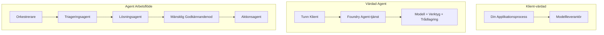
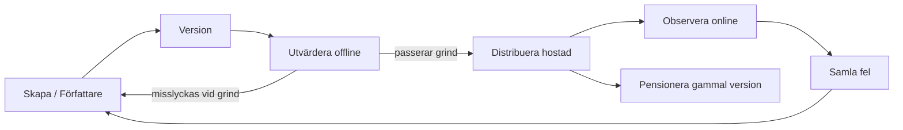
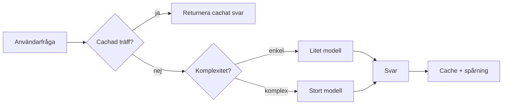
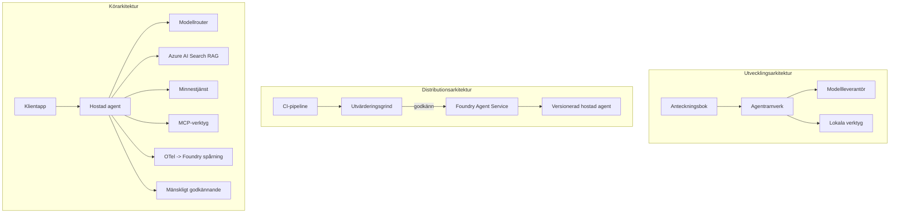

# Distribuera Skalbara Agenter med Microsoft Foundry


Fram till denna punkt i kursen har du byggt agenter som körs på din bärbara dator, inuti en notebook, styrda av `az login` och några miljövariabler. Det är precis rätt sätt att lära sig på. Det är inte rätt sätt att köra en agent som tusentals kunder är beroende av klockan 3 på morgonen.

Den här lektionen handlar om gapet mellan "det fungerar på min maskin" och "det fungerar, pålitligt och prisvärt, i produktion." Vi sluter det gapet med hjälp av **Microsoft Foundry** och **Microsoft Foundry Agent Service**, och vi gör det genom att bygga en verklig kundsupportagent som har verktyg, hämtning, minne, utvärdering och övervakning.

## Introduktion

Denna lektion kommer att täcka:

- Skillnaden mellan en **prototypagent** och en **distribuerad agent**, och varför övergången mest handlar om allt *runt* modellen.
- **Distributionsmönster** för agenter: klienthostad, tjänstehostad (Hosted Agents) och arbetsflödesorkestrerad.
- **Agentens livscykel** på Microsoft Foundry — skapa, versionera, distribuera, utvärdera, observera, pensionera.
- **Skalningsstrategier**: modell-routing, caching, samtidighet och statslös design.
- **Observerbarhet** med OpenTelemetry och Foundry-spårning.
- **Kostnadsoptimering** genom modellval, routing och utvärderingsgrindar.
- **Företagshänsyn**: styrning, mänskligt godkännande och att köra MCP-servrar säkert i produktion.

## Lärandemål

Efter att ha avslutat denna lektion kommer du att veta hur man:

- Väljer rätt distributionsmönster för en given agentarbetsbelastning.
- Distribuerar en agent till Microsoft Foundry Agent Service så att den är versionerad, styrd och observerbar.
- Instrumenterar en agent för spårning och kopplar samman en utvärderingspipeline som körs före varje release.
- Tillämpa modell-routing och caching för att hålla latens och kostnad under kontroll i skala.
- Lägger till en mänsklig godkännandetröskel för högriskåtgärder och integrerar en MCP-server på ett produktionssäkert sätt.

## Förkunskaper

Denna lektion förutsätter att du har slutfört tidigare lektioner och är bekväm med:

- Att bygga agenter med [Microsoft Agent Framework](../14-microsoft-agent-framework/README.md) (Lektionen 14).
- [Verktygsanvändning](../04-tool-use/README.md) (Lektionen 4) och [Agentic RAG](../05-agentic-rag/README.md) (Lektionen 5).
- [Agentminne](../13-agent-memory/README.md) (Lektionen 13) och [Agentiska protokoll / MCP](../11-agentic-protocols/README.md) (Lektionen 11).
- [Observerbarhet och Utvärdering](../10-ai-agents-production/README.md) (Lektionen 10) — denna lektion bygger direkt på den.

Du kommer också att behöva:

- En **Azure-prenumeration** och ett **Microsoft Foundry-projekt** med minst en distribuerad chattmodell.
- Den **Azure CLI** autentiserad (`az login`).
- Python 3.12+ och paketen i repositoryt [`requirements.txt`](../../../requirements.txt).

## Från Prototyp till Produktion: Vad Som Faktiskt Ändras

En prototypagent och en produktionsagent delar samma kärnloop — resonera, anropa verktyg, svara. Vad som ändras är allt runt den loopen. Modellen är kanske 20% av en produktionsagent; de andra 80% är den operativa skeletten.

| Bekymmer | Prototyp | Produktion |
| --- | --- | --- |
| **Hosting** | Körs i din notebook | Körs som en hostad tjänst, versionerad och utrullad |
| **Identitet** | Din `az login` token | Hanterad identitet med scoped RBAC |
| **Tillstånd** | I minnet, förloras vid omstart | Externifierat (trådstore, minnestjänst) |
| **Fel** | Du ser traceback | Försök igen, fallback, dead-letter, larm |
| **Kostnad** | "Det är några cent" | Spåras per förfrågan, routas, cachas, budgeteras |
| **Kvalitet** | Du granskare utdata | Utvärderas automatiskt före varje release |
| **Förtroende** | Du godkänner varje åtgärd | Policy + mänsklig i loopen för riskfyllda åtgärder |

Ha denna tabell i åtanke. Varje avsnitt nedan mappas till en av dessa rader.

## Distributionsmönster för Agenter

Det finns tre mönster du kommer att använda, ofta i kombination.

### 1. Klienthostade Agenter

Agentobjektet lever inuti *din* applikationsprocess. Din kod anropar modellleverantören direkt; resonansloopen körs i din tjänst. Detta är vad varje tidigare lektion har gjort.

- **Använd det när** du behöver full kontroll över loopen, anpassad mellanprogramvara eller du bäddar in agenten i en befintlig backend.
- **Avvägning**: du står själv för skalning, tillstånd och motståndskraft.

### 2. Hostade Agenter (Foundry Agent Service)

Agenten är *registrerad som en resurs* i Microsoft Foundry. Foundry hostar resonansloopen, sparar trådar, upprätthåller innehållssäkerhet och RBAC, och gör agenten synlig i Foundry-portalen. Din app blir en tunn klient som skapar trådar och läser svar.

- **Använd det när** du vill ha hållbarhet, inbyggd observerbarhet, styrning och mindre operativ yta.
- **Avvägning**: mindre lågnivåkontroll i utbyte mot en hanterad runtime.

### 3. Agentarbetsflöden

Flera agenter (och verktyg) komponeras till en graf med explicit kontrollflöde — sekventiella steg, förgreningar, mänskliga godkännandenoder och hållbara kontrollpunkter som kan pausas och återupptas. Detta är Microsoft Agent Frameworks **Workflows**-funktionalitet tillämpad i distributionsskala.

- **Använd det när** en uppgift sträcker sig över flera specialiserade agenter eller kräver ett godkännandesteg mitt i.
- **Avvägning**: fler rörliga delar; behöver observerbarhet på orkestreringsnivå.



## Agentens Livscykel på Microsoft Foundry

Att distribuera en agent är inte en engångs-`push`. Det är en loop, och det liknar mycket en mjukvarurelasecykel eftersom det är precis vad det är.



Det centrala idén, hämtad från [Lektion 10](../10-ai-agents-production/README.md): **offline utvärdering är en grind, inte en eftertanke.** En ny agentversion skickas inte ut om den inte klarar dina utvärderingströsklar. Online-observerbarhet matar sedan tillbaka verkliga fel till ditt offline testset. Det är hela loopen.

## Skalningsstrategier

Att skala en agent är annorlunda än att skala ett statslöst web-API, eftersom varje förfrågan kan trigga flera kostsamma modell- och verktygsanrop. Fyra tekniker bär den största belastningen.

**Statslös förfrågningshantering.** Behåll inget per-användare-tillstånd i processminnet. Persistenta konversations-trådar i Foundrys trådstore eller minnestjänst så att vilken instans som helst kan hantera vilken förfrågan som helst. Detta låter dig skala horisontellt — lägg till instanser, inga klibbiga sessioner.

**Modell-routing.** Inte varje förfrågan behöver din mest kapabla (och dyraste) modell. Rutta enkla förfrågningar — avsiktsklassificering, korta faktabaserade svar — till en liten, snabb modell, och reservera den stora modellen för riktig resonans. Foundrys **Model Router** kan göra detta åt dig, eller så kan du implementera en lättviktig klassificerare själv. Du kommer att bygga den DIY-versionen i labbet.

**Svarscaching.** Många supportfrågor är nästan dubbleringar ("hur återställer jag mitt lösenord?"). Cacha svar till vanliga frågor och servera dem utan att anropa modellen alls. Även en måttlig cacheträff minskar kostnad och latens avsevärt.

**Samtidighet och backpressure.** Modellleverantörer har hastighetsbegränsningar. Begränsa din samtidighet, använd försök igen med exponentiell backoff, och falla mjukt (ett köat "vi jobbar på det"-svar är bättre än en 500).



## Observerbarhet i Produktion

Du kan inte operera det du inte kan se. Som täckts i Lektion 10 sänder Microsoft Agent Framework **OpenTelemetry**-spårningar inbyggt — varje modellanrop, verktygsanrop och orkestreringssteg blir en span. I produktion exporterar du de spanerna till Microsoft Foundry (eller valfri OTel-kompatibel backend) så att du kan:

- Spåra ett enskilt kundklagomål från början till slut över alla modell- och verktygsanrop.
- Se p50/p95 latens och kostnad per förfrågan över tid.
- Larma vid felaktighetstoppar och kostnadsavvikelser innan dina användare (eller din ekonomiavdelning) märker det.

```python
from agent_framework.observability import get_tracer

tracer = get_tracer()

with tracer.start_as_current_span("support_request") as span:
    span.set_attribute("customer.tier", "enterprise")
    span.set_attribute("routed.model", "gpt-5-nano")
    # agentens körning spåras automatiskt inom denna span
```

Attribut som `customer.tier` och `routed.model` är vad som förvandlar en vägg av spår till svarbara frågor ("rerutas företagskunder för ofta till den lilla modellen?").

## Kostnadsoptimering

Kostnaden i produktionsagenter domineras av tokens. Tre spakar, i ordning efter påverkan:

1. **Rätt storlek på modellen.** En liten modell som klarar din utvärderingsgrind är nästan alltid billigare än en stor som också klarar den. Använd utvärdering för att *bevisa* att den lilla modellen är tillräckligt bra istället för att som standard ta den största modellen av försiktighet.
2. **Ruttta efter komplexitet.** Som ovan — betala stora-modell-pris bara för förfrågningar som behöver stor-modell-resonans.
3. **Cacha aggressivt.** Det billigaste modellanropet är det du aldrig gör.

Utvärderingsgrindar och kostnadskontroll är samma disciplin sedd från två vinklar: utvärdering visar dig *kvalitetsgolvet*, routing och caching håller dig så nära den golvets *kostnad* som möjligt.

## Företagsdistribution Överväganden

**Styrning.** Hostade Agenter ärver Foundrys RBAC, innehållssäkerhet och revisionsloggning. Ge varje agent en hanterad identitet med minsta privilegium den behöver — skrivskyddad åtkomst till kunskapsbasen, scoped åtkomst till ärende-API:et, inget mer.

**Mänsklig i loopen.** Vissa åtgärder är för avgörande för att automatiseras direkt — utfärda återbetalning, ta bort ett konto, eskalera till en juridisk avdelning. Microsoft Agent Framework stödjer **godkännande-krävande** verktyg: agenten föreslår åtgärden, utförandet pausas, en människa godkänner eller avvisar, och arbetsflödet återupptas. Du såg primitivet i [Lektion 6](../06-building-trustworthy-agents/README.md); här distribuerar du det.

**MCP i produktion.** [MCP](../11-agentic-protocols/README.md) låter din agent använda externa verktyg genom ett standardgränssnitt. I produktion, behandla varje MCP-server som en icke-betrodd gräns: peka serverversionen, kör den med en scoped identitet, validera dess utdata och exponera aldrig hemligheter för den. En MCP-server är ett beroende, och beroenden patchas, granskas och får hastighetsbegränsning.



De tre diagrammen — utveckling, distribution, runtime — är samma agent i tre stadier av dess liv. Labbet som följer går igenom hur du bygger den.

## Praktiskt Lab: En Produktionsklar Kundsupportagent

Öppna [`code_samples/16-python-agent-framework.ipynb`](./code_samples/16-python-agent-framework.ipynb) och arbeta igenom den från början till slut. Du kommer att sätta ihop en **Contoso kundsupportagent** med varje produktionsaspekt inkopplad:

1. **Verktygsanrop** — slå upp orderstatus och öppna supportärenden.
2. **RAG** — svara på policyfrågor från en kunskapsbas (Azure AI Search, med en fallback i minnet så att notebooken körs utan en Search-resurs).
3. **Minne** — kom ihåg kunden över konversationsvändningar.
4. **Modell-routing** — en komplexitetsklassificerare skickar varje förfrågan till en liten eller stor modell.
5. **Svarscaching** — upprepade frågor serveras från cache.
6. **Mänskligt godkännande** — återbetalningar över en gräns pausar för mänskligt godkännande.
7. **Utvärderingspipeline** — ett litet offline-testset poängsätter agenten och fungerar som en releasegrind.
8. **Observerbarhet** — OpenTelemetry-spårning kring varje förfrågan.

### Genomgång

Notebooken är organiserad så att varje produktionsaspekt är ett självständigt, körbart avsnitt. Hjärtat är routing-plus-caching-förfrågningshanteraren:

```python
async def handle_support_request(query: str, customer_id: str) -> str:
    # 1. Servera från cache när vi kan.
    cached = response_cache.get(normalize(query))
    if cached:
        return cached

    # 2. Rutta efter komplexitet för att kontrollera kostnad.
    model = "gpt-5-nano" if is_simple(query) else "gpt-5-mini"

    # 3. Kör agenten inuti ett spårningsspann för observabilitet.
    with tracer.start_as_current_span("support_request") as span:
        span.set_attribute("routed.model", model)
        span.set_attribute("customer.id", customer_id)
        response = await support_agent.run(query, model=model)

    # 4. Cachelagra och returnera.
    response_cache.set(normalize(query), response.text)
    return response.text
```

Utvärderingsgrinden som skyddar en release ser ut så här:

```python
async def evaluation_gate(agent, test_cases, threshold: float = 0.8) -> bool:
    passed = 0
    for case in test_cases:
        result = await agent.run(case["input"])
        if score_response(result.text, case["expected"]) >= 0.8:
            passed += 1
    pass_rate = passed / len(test_cases)
    print(f"Evaluation pass rate: {pass_rate:.0%} (gate: {threshold:.0%})")
    return pass_rate >= threshold  # distribuera endast om porten godkänns
```

Läs varje rad — notebooken håller primitiverna medvetet små så att inget döljs bakom ett ramverksanrop.

## Validera en Distribuerad Agent med Smoke Tester

Utvärderingsgrinden ovan körs *offline* mot ditt agentobjekt. När agenten är distribuerad som Hosted Agent behöver du en check till, som är ännu billigare: **svarar den distribuerade endpointen faktiskt?**

Att distribuera "framgångsrikt" bevisar bara att kontrollplanet accepterade definitionen — det bevisar inte att agenten svarar. En saknad beroende, en dålig modell-routing eller en utgången anslutning kan lämna en grön distribution som inte returnerar något. En **smoke test** fångar det på några sekunder, vid varje distribution, utan kostnaden för en full utvärdering.

Detta repository levererar en färdig smoke-testpipeline byggd på [AI Smoke Test](https://github.com/marketplace/actions/ai-smoke-test) GitHub Action:

- **Katalog** — [`tests/lesson-16-smoke-tests.json`](../../../tests/lesson-16-smoke-tests.json) innehåller prompts och påståenden för Contoso-supportagenten (grundade policy-svar, orderuppslag, hålla sig på ämnet och flervändkonsistens). Kataloger för andra lektionsagenter finns bredvid — se [`tests/README.md`](../tests/README.md).
- **Arbetsflöde** — [`.github/workflows/smoke-test.yml`](../../../.github/workflows/smoke-test.yml) loggar in med Azure OIDC och POSTar varje prompt till agentens Responses-endpoint, och misslyckar jobbet vid varje påståendefel.

```yaml
- name: Smoke-test hosted agent
  uses: JFolberth/ai-smoketest@v1
  with:
    project_endpoint: ${{ inputs.project_endpoint }}
    agent_name: ContosoSupportAgent
    tests_file: tests/lesson-16-smoke-tests.json
```


Kör den från fliken **Actions** när din agent har distribuerats, och ange din Foundry-projektendpoint och agentnamn. Den federerade identiteten behöver rollen **Azure AI User** på Foundry-projektnivå. Tänk på lagren som en pyramid: röktester (är den nåbar och svarar?) körs vid varje distribution, offline-utvärdering (är den tillräckligt bra för att levereras?) körs före befordran, och online-utvärdering (hur går det i verkligheten?) körs kontinuerligt.

## Kunskapskontroll

Testa din förståelse innan du går vidare till uppgiften.

**1. Ungefär hur mycket av en produktionsagent är "modellen," och vad är resten?**

<details>
<summary>Svar</summary>

Modellen är en minoritet av systemet — ofta angivet till omkring 20%. Resten är den operativa skelettet: hosting och versionering, identitet och RBAC, externt tillstånd, felhantering, kostnadsspårning, utvärdering och mänskliga kontrollmekanismer. Att gå till produktion handlar mest om att bygga allt *runt* resonemangsloopen.
</details>

**2. När skulle du välja en Hosted Agent framför en klienthostad agent?**

<details>
<summary>Svar</summary>

När du vill ha en hanterad runtime med inbyggd uthållighet (trådar som kvarstår och kan återupptas), observerbarhet, innehållssäkerhet och RBAC, och du är villig att byta bort en del låg-nivåkontroll av resonemangsloopen för en mindre operativ yta. Klienthostad är att föredra när du behöver full kontroll över loopen eller inbäddar agenten i en redan existerande backend.
</details>

**3. Varför måste en skalbar agent vara tillståndslös i sin egna processminne?**

<details>
<summary>Svar</summary>

Så att vilken instans som helst kan hantera vilken förfrågan som helst, vilket möjliggör horisontell skalning utan ”sticky sessions”. Per-användar konversationsstatus externaliseras till en trådlagring eller minnestjänst. Om tillståndet levde i processminnet skulle du förlora det vid omstart och inte kunna distribuera belastningen fritt.
</details>

**4. Vilket problem löser modellrutning och hur relaterar det till utvärdering?**

<details>
<summary>Svar</summary>

Rutning skickar enkla förfrågningar till en liten, billig, snabb modell och reserverar den stora modellen för verklig resonemang, vilket kontrollerar både latens och kostnad. Det relaterar till utvärdering eftersom utvärdering är vad som *bevisar* att den lilla modellen är tillräckligt bra för en viss sorts förfrågningar — rutning utan utvärdering är gissningar.
</details>

**5. Vad är en "utvärderingsgrind" och var befinner den sig i livscykeln?**

<details>
<summary>Svar</summary>

En utvärderingsgrind kör ett offline-testsats mot en ny agentversion och blockerar distribution om inte godkännandefrekvensen överstiger en tröskel. Den ligger mellan "version" och "distribuera" i livscykeln, vilket gör kvalitet till en förutsättning för publicering snarare än något du kontrollerar efter leverans.
</details>

**6. Varför ska en MCP-server behandlas som en opålitlig gräns i produktion?**

<details>
<summary>Svar</summary>

Eftersom det är en extern beroende som din agent anropar. Du bör låsa dess version, köra den med en begränsad identitet, validera dess output, begränsa anropstakten och aldrig exponera hemligheter för den — samma disciplin som du tillämpar för alla tredjepartsberoenden. Dess output påverkar din agents resonemang, så obekräftat förtroende är en säkerhetsrisk.
</details>

**7. Vilken enskild förändring har vanligtvis störst påverkan på produktionsagentens kostnad, och varför?**

<details>
<summary>Svar</summary>

Att rätt dimensionera modellen — använda den minsta modellen som fortfarande klarar din utvärderingsgrind. Kostnaden domineras av token-användning, och en mindre modell som uppfyller kvalitetskraven är nästan alltid billigare än en större. Cachelagring och rutning minskar sen kostnaden ytterligare, men valet av grundmodell har störst förstahands-effekt.
</details>

**8. Vilken roll spelar spånattribut som `customer.tier` och `routed.model` i observerbarhet?**

<details>
<summary>Svar</summary>

De förvandlar råa spår till besvarbara affärsfrågor. Utan attribut har du en vägg av spår; med dem kan du fråga "blir företagskunder routade till den lilla modellen för ofta?" eller "vilken modell hanterar våra långsammaste förfrågningar?" Attribut är hur du kan skiva telemetri efter de dimensioner som är viktiga för din verksamhet.
</details>

## Uppgift

Ta kundsupportagenten från labbet och härda den för ett specifikt scenario: **en supportagent för prenumerationsfakturering för ett SaaS-företag.**

Din inlämning ska:

1. **Byta ut verktygen** mot faktureringsrelevanta: `get_subscription_status`, `get_invoice` och `issue_credit` (krediter över $50 kräver mänskligt godkännande).
2. **Lägga till tre RAG-dokument** som täcker företagets återbetalningspolicy, faktureringscykel och avbokningspolicy.
3. **Utöka utvärderingssetet** till minst åtta fall, inklusive minst två som *ska* trigga den mänskliga godkännandevägen, och bekräfta att din utvärderingsgrind korrekt godkänner eller underkänner.
4. **Lägg till en kostnadsrapport**: efter att ha kört tio blandade förfrågningar genom agenten, skriv ut hur många som gick till den lilla modellen, hur många till den stora modellen och hur många som serverades från cache.

Skriv ett kort stycke (i en markdown-cell) som förklarar vilken modellroutningsregel du valde och hur du skulle validera den med verklig trafik. Det finns inget rätt eller fel svar – du bedöms på om produktionsaspekterna är sammanlänkade på ett koherent sätt.

## Sammanfattning

I denna lektion flyttade du en agent från prototyp till produktion med Microsoft Foundry:

- Steget till produktion handlar mest om **det operativa skelettet** runt modellen — hosting, identitet, tillstånd, felhantering, kostnad, kvalitet och förtroende.
- Du lärde dig de tre **distributionsmönstren** — klienthostad, Hosted Agents och Agent Workflows — och när varje passar.
- Du gick igenom **agentens livscykel**, där offline-**utvärdering fungerar som en releasespärr** och online-observerbarhet matar tillbaka fel till testsatsen.
- Du tillämpade **skalningsstrategier** — tillståndslös design, modellroutning, cachelagring och begränsad samtidighet — och kopplade dem till **kostnadsoptimering**.
- Du kopplade in **företagskontroller**: RBAC, mänskligt godkännande i loopen och produktionssäker MCP-integration.
- Du byggde en **produktionsklar kundsupportagent** som förenar alla dessa aspekter till körbar kod.

Nästa lektion går motsatt väg: istället för att skala upp agenter till molnet, kommer du att ta ner dem till en enskild utvecklarmaskin och köra dem helt lokalt.

## Ytterligare resurser

- <a href="https://learn.microsoft.com/azure/ai-foundry/what-is-azure-ai-foundry" target="_blank">Microsoft Foundry-dokumentation</a>
- <a href="https://learn.microsoft.com/azure/ai-foundry/agents/overview" target="_blank">Översikt Microsoft Foundry Agent Service</a>
- <a href="https://aka.ms/ai-agents-beginners/agent-framework" target="_blank">Microsoft Agent Framework</a>
- <a href="https://learn.microsoft.com/azure/ai-foundry/concepts/model-router" target="_blank">Model Router i Microsoft Foundry</a>
- <a href="https://learn.microsoft.com/azure/search/search-what-is-azure-search" target="_blank">Azure AI Search</a>
- <a href="https://opentelemetry.io/" target="_blank">OpenTelemetry</a>
- <a href="https://github.com/marketplace/actions/ai-smoke-test" target="_blank">AI Smoke Test GitHub Action</a>
- <a href="https://modelcontextprotocol.io/" target="_blank">Model Context Protocol (MCP)</a>

## Föregående lektion

[Bygga Computer Use Agents (CUA)](../15-browser-use/README.md)

## Nästa lektion

[Skapa Lokala AI-agenter](../17-creating-local-ai-agents/README.md)

---

<!-- CO-OP TRANSLATOR DISCLAIMER START -->
**Ansvarsfriskrivning**:
Detta dokument har översatts med hjälp av AI-översättningstjänsten [Co-op Translator](https://github.com/Azure/co-op-translator). Även om vi strävar efter noggrannhet, var vänlig notera att automatiska översättningar kan innehålla fel eller brister. Det ursprungliga dokumentet på dess modersmål bör betraktas som den auktoritativa källan. För kritisk information rekommenderas professionell mänsklig översättning. Vi ansvarar inte för några missförstånd eller feltolkningar som uppstår till följd av användningen av denna översättning.
<!-- CO-OP TRANSLATOR DISCLAIMER END -->