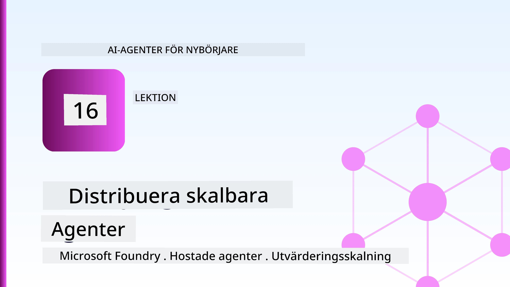
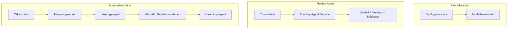
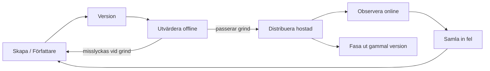
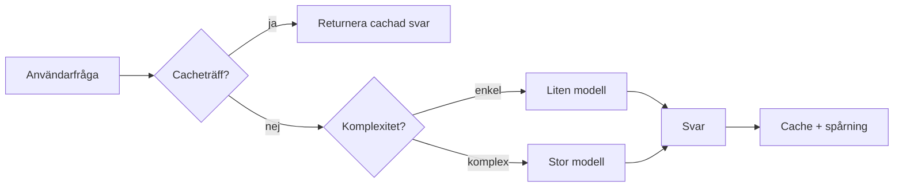
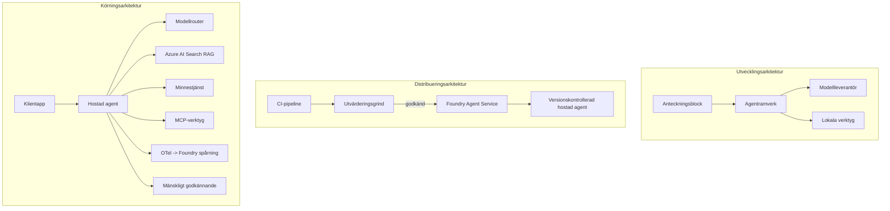

# Distribuera skalbara agenter med Microsoft Foundry



Hittills i kursen har du byggt agenter som körs på din laptop, inne i en notebook, drivna av `az login` och ett par miljövariabler. Det är exakt rätt sätt att lära sig på. Det är inte rätt sätt att köra en agent som tusentals kunder är beroende av klockan 3 på morgonen.

Den här lektionen handlar om gapet mellan "det fungerar på min maskin" och "det fungerar pålitligt och prisvärt i produktion." Vi sluter det gapet med **Microsoft Foundry** och **Microsoft Foundry Agent Service**, och vi gör det genom att bygga en riktig kundsupportagent med verktyg, hämtning, minne, utvärdering och övervakning.

## Introduktion

Den här lektionen kommer att täcka:

- Skillnaden mellan en **prototypagent** och en **distribuerad agent**, och varför övergången mest handlar om allt *runt* modellen.
- **Distributionsmönster** för agenter: klientvärd, tjänstevärd (Hosted Agents) och arbetsflödesorkestrerat.
- **Agentlivscykeln** på Microsoft Foundry — skapa, versionera, distribuera, utvärdera, observera, pensionera.
- **Skalningsstrategier**: modelrouting, cachning, samtidighet och tillståndslös design.
- **Observabilitet** med OpenTelemetry och Foundry-spårning.
- **Kostnadsoptimering** genom modellval, routing och utvärderingsportar.
- **Företagshänsyn**: styrning, mänskligt godkännande och säker drift av MCP-servrar i produktion.

## Lärandemål

Efter att ha genomfört denna lektion kommer du att kunna:

- Välja rätt distributionsmönster för en given agentbelastning.
- Distribuera en agent till Microsoft Foundry Agent Service så att den är versionerad, styrd och observerbar.
- Instrumentera en agent för spårning och koppla en utvärderingspipeline som körs före varje release.
- Använda modelrouting och cachning för att hålla latens och kostnad under kontroll i skala.
- Lägga till en mänsklig godkännandeport för hög-riskåtgärder och integrera en MCP-server på ett produktionssäkert sätt.

## Förkunskaper

Den här lektionen förutsätter att du har genomfört de tidigare lektionerna och är bekväm med:

- Att bygga agenter med [Microsoft Agent Framework](../14-microsoft-agent-framework/README.md) (Lektion 14).
- [Verktygsanvändning](../04-tool-use/README.md) (Lektion 4) och [Agentic RAG](../05-agentic-rag/README.md) (Lektion 5).
- [Agentminne](../13-agent-memory/README.md) (Lektion 13) och [Agentic Protocols / MCP](../11-agentic-protocols/README.md) (Lektion 11).
- [Observabilitet och utvärdering](../10-ai-agents-production/README.md) (Lektion 10) — den här lektionen bygger direkt på den.

Du behöver också:

- En **Azure-prenumeration** och ett **Microsoft Foundry-projekt** med minst en distribuerad chattmodell.
- Autentiserad **Azure CLI** (`az login`).
- Python 3.12+ och paketen i katalogen [`requirements.txt`](../../../requirements.txt).

## Från prototyp till produktion: Vad förändras egentligen

En prototypagent och en produktionsagent delar samma kärnloop — resonera, anropa verktyg, svara. Det som förändras är allt som är runt den loopen. Modellen är kanske 20 % av en produktionsagent; resten, 80 %, är den operativa stommen.

| Aspekt | Prototyp | Produktion |
| --- | --- | --- |
| **Hosting** | Körs i din notebook | Körs som en värdtjänst, versionerad och utrullad |
| **Identitet** | Din `az login`-token | Hanterad identitet med begränsad RBAC |
| **Tillstånd** | I minnet, förloras vid omstart | Externaliserat (trådlager, minnestjänst) |
| **Fel** | Du ser stackspåret | Försök igen, fallback, dead-letter, larm |
| **Kostnad** | "Det är några cent" | Spåras per förfrågan, routas, cachas, budgeteras |
| **Kvalitet** | Du granskar output | Utvärderas automatiskt före varje release |
| **Förtroende** | Du godkänner varje åtgärd | Policy + mänsklig i loopen för riskfyllda åtgärder |

Ha denna tabell i minnet. Varje sektion nedan motsvarar en av dessa rader.

## Agentdistributionsmönster

Det finns tre mönster du kommer att använda, ofta i kombination.

### 1. Klientvärda agenter

Agentobjektet lever inne i *din* applikationsprocess. Din kod anropar modellleverantören direkt; resonemangsloopen körs i din tjänst. Detta är vad varje tidigare lektion har gjort.

- **Använd när** du behöver full kontroll över loopen, anpassad middleware eller bäddar in agenten i en befintlig backend.
- **Avvägning**: du ansvarar själv för skalning, tillstånd och motståndskraft.

### 2. Värdade agenter (Foundry Agent Service)

Agenten är *registrerad som en resurs* i Microsoft Foundry. Foundry värdar resonemangsloopen, lagrar trådar, tillämpar innehållssäkerhet och RBAC, och gör agenten synlig i Foundry-portalen. Din app blir en tunn klient som skapar trådar och läser svar.

- **Använd när** du vill ha hållbarhet, inbyggd observerbarhet, styrning och mindre operativ yta.
- **Avvägning**: mindre lågnivåkontroll i utbyte mot en hanterad runtime.

### 3. Agentarbetsflöden

Flera agenter (och verktyg) komponerade i en graf med explicit kontrollflöde — sekventiella steg, villkorsgrenar, mänskliga godkännandenoder och hållbara kontrollpunkter som kan pausa och återupptas. Detta är Microsoft Agent Frameworks **Workflows**-funktionalitet applicerad i distributionsskala.

- **Använd när** en enskild uppgift spänner över flera specialiserade agenter eller kräver ett godkännandesteg mitt i.
- **Avvägning**: fler rörliga delar; kräver orkestrationsnivå-övervakning.



## Agentlivscykeln på Microsoft Foundry

Att distribuera en agent är inte ett engångs-`push`. Det är en loop, och den liknar starkt en mjukvarurelasecykel eftersom det är precis vad det är.



Nyckelidé, tagen från [Lektion 10](../10-ai-agents-production/README.md): **offline-utvärdering är en port, inte en eftertanke.** En ny agentversion släpps inte om den inte klarar dina utvärderingströsklar. Online-observerbarhet skickar sedan verkliga fel tillbaka till din offline-testuppsättning. Det är hela loopen.

## Skalningsstrategier

Skalning av en agent skiljer sig från skalning av ett tillståndslöst webb-API, eftersom varje förfrågan kan utlösa flera kostsamma anrop till modeller och verktyg. Fyra tekniker bär störst del av belastningen.

**Tillståndslös begäran hantering.** Behåll inget användarspecifikt tillstånd i din processminne. Persistenta konversations-trådar i Foundrys trådlager eller en minnestjänst så att vilken instans som helst kan hantera vilken förfrågan som helst. Detta låter dig skala horisontellt — lägg till instanser, inga klibbiga sessioner.

**Modelrouting.** Inte varje förfrågan behöver din mest kapabla (och dyraste) modell. Routa enkla förfrågningar — intentionsklassificering, korta faktabaserade svar — till en liten, snabb modell och reservera den stora modellen för genuint resonemang. Foundrys **Model Router** kan göra detta åt dig, eller så implementerar du en lättviktsklassificerare själv. Du bygger DIY-versionen i labbet.

**Svarscachning.** Många supportfrågor är nästan dubletter ("hur återställer jag mitt lösenord?"). Cach svar på vanliga frågor och servera dem utan att träffa modellen alls. Även en blygsam cacheträff avsevärt minskar kostnad och latency.

**Samtidighet och backpressure.** Modellleverantörer har hastighetsbegränsningar. Begränsa din samtidighet, använd omförsök med exponentiell backoff och hantera fel graciöst (ett köat "vi jobbar på det"-svar är bättre än en 500).



## Observabilitet i produktion

Du kan inte styra det du inte kan se. Som täckts i Lektion 10, emitterar Microsoft Agent Framework **OpenTelemetry**-spårningar nativt — varje modellanrop, verktygsanrop och orkestrationssteg blir ett span. I produktion exporterar du dessa spans till Microsoft Foundry (eller valfri OTel-kompatibel backend) så att du kan:

- Spåra ett enskilt kundklagomål från början till slut genom varje modell- och verktygsanrop.
- Övervaka p50/p95 latens och kostnad per förfrågan över tid.
- Larma vid felratetoppar och kostnadsavvikelser innan dina användare (eller din ekonomiavdelning) märker det.

```python
from agent_framework.observability import get_tracer

tracer = get_tracer()

with tracer.start_as_current_span("support_request") as span:
    span.set_attribute("customer.tier", "enterprise")
    span.set_attribute("routed.model", "gpt-4.1-mini")
    # agentens exekvering spåras automatiskt inom detta spann
```

Attribut som `customer.tier` och `routed.model` är det som förvandlar en vägg av spårningar till svarbara frågor ("routas företagskunder till den lilla modellen för ofta?").

## Kostnadsoptimering

Kostnaden i produktionsagenter domineras av tokens. Tre spakar, i ordning efter påverkan:

1. **Rätt storlek på modellen.** En liten modell som klarar din utvärderingsport är nästan alltid billigare än en stor som också klarar den. Använd utvärderingen för att *bevisa* att den lilla modellen är tillräckligt bra istället för att standardmässigt välja den största modellen av försiktighet.
2. **Routa efter komplexitet.** Som ovan — betala stora modellpriser endast för förfrågningar som behöver stort modellresonemang.
3. **Cacha aggressivt.** Det billigaste modellanropet är det du aldrig gör.

Utvärderingsportar och kostnadskontroll är samma disciplin sedd från två vinklar: utvärderingen berättar för dig *kvalitetsgolvet*, routing och caching håller dig så nära golvets *kostnad* som möjligt.

## Företagsdistribution - överväganden

**Styrning.** Hosted Agents ärver Foundrys RBAC, innehållssäkerhet och revisionsloggning. Ge varje agent en hanterad identitet med minsta privilegium den behöver — skrivskyddad åtkomst till kunskapsbasen, begränsad åtkomst till ticket-API:et, inget mer.

**Människa i loopen.** Vissa åtgärder är för betydelsefulla för att automatiseras helt — utfärda återbetalning, radera ett konto, eskalera till juridiskt team. Microsoft Agent Framework stödjer **godkännande-krävande** verktyg: agenten föreslår åtgärden, exekveringen pausas, en människa godkänner eller avvisar och arbetsflödet återupptas. Du såg primitivet i [Lektion 6](../06-building-trustworthy-agents/README.md); här distribuerar du det.

**MCP i produktion.** [MCP](../11-agentic-protocols/README.md) låter din agent konsumera externa verktyg via ett standardgränssnitt. I produktion behandlas varje MCP-server som en opålitlig gräns: lås serverversionen, kör den med en begränsad identitet, validera dess utdata och exponera aldrig hemligheter till den. En MCP-server är en beroende komponent och beroenden patchas, granskas och får hastighetsbegränsningar.



De tre diagrammen — utveckling, distribution, runtime — är samma agent i tre skeden av dess liv. Labbet som följer går igenom att bygga den.

## Praktiskt labb: En produktionsredo kundsupportagent

Öppna [`code_samples/16-python-agent-framework.ipynb`](./code_samples/16-python-agent-framework.ipynb) och arbeta igenom det från start till slut. Du monterar en **Contoso kundsupportagent** med varje produktionsaspekt inkopplad:

1. **Verktygsanrop** — slå upp orderstatus och öppna supporttickets.
2. **RAG** — svara på policyfrågor från en kunskapsbas (Azure AI Search, med ett fallback i minnet så notebooken kan köras utan en Search-resurs).
3. **Minne** — kom ihåg kunden över konversationsvängar.
4. **Modelrouting** — en komplexitetsklassificerare routar varje förfrågan till en liten eller stor modell.
5. **Svarscachning** — upprepade frågor serveras från cache.
6. **Mänskligt godkännande** — återbetalningar över tröskel pausar för mänskligt godkännande.
7. **Utvärderingspipeline** — ett litet offline-testset poängsätter agenten och fungerar som releasetrappa.
8. **Observabilitet** — OpenTelemetry-spårning runt varje förfrågan.

### Genomgång

Notebooken är organiserad så att varje produktionsaspekt är en självständig, körbar sektion. Hjärtat är routing-plus-caching-begäran hanteraren:

```python
async def handle_support_request(query: str, customer_id: str) -> str:
    # 1. Servera från cache när vi kan.
    cached = response_cache.get(normalize(query))
    if cached:
        return cached

    # 2. Rutt efter komplexitet för att kontrollera kostnad.
    model = "gpt-4.1-mini" if is_simple(query) else "gpt-4.1"

    # 3. Kör agenten inuti en spårningsspann för observerbarhet.
    with tracer.start_as_current_span("support_request") as span:
        span.set_attribute("routed.model", model)
        span.set_attribute("customer.id", customer_id)
        response = await support_agent.run(query, model=model)

    # 4. Cache och returnera.
    response_cache.set(normalize(query), response.text)
    return response.text
```

Utvärderingsporten som skyddar en release ser ut så här:

```python
async def evaluation_gate(agent, test_cases, threshold: float = 0.8) -> bool:
    passed = 0
    for case in test_cases:
        result = await agent.run(case["input"])
        if score_response(result.text, case["expected"]) >= 0.8:
            passed += 1
    pass_rate = passed / len(test_cases)
    print(f"Evaluation pass rate: {pass_rate:.0%} (gate: {threshold:.0%})")
    return pass_rate >= threshold  # distribuera endast om grinden godkänns
```

Läs varje rad — notebooken håller primitiv små så att inget är dolt bakom ett ramverksanrop.

## Validering av distribuerad agent med röktester

Utvärderingsporten ovan körs *offline* mot ditt agentobjekt. När agenten är distribuerad som Hosted Agent behöver du en till, ännu billigare kontroll: **svarar den distribuerade endpointen faktiskt?**

Att distribuera "framgångsrikt" bevisar bara att kontrollplanet accepterade definitionen — det bevisar inte att agenten svarar. En saknad beroende, dålig modelrouting eller en utgången anslutning kan lämna en grön distribution som inte ger något svar. Ett **röktest** fångar detta på sekunder, vid varje deployment, utan kostnaden för en full utvärdering.

Det här lagret levererar en färdig rök-testpipeline byggd på [AI Smoke Test](https://github.com/marketplace/actions/ai-smoke-test) GitHub Action:

- **Katalog** — [`tests/lesson-16-smoke-tests.json`](../../../tests/lesson-16-smoke-tests.json) innehåller promptar och assertioner för Contoso-supportagenten (grundade policy-svar, orderuppslag, hålla sig on-topic, och multivändningsorienterad tråd-kontinuitet). Kataloger för andra lektionsagenter finns intill — se [`tests/README.md`](../tests/README.md).
- **Arbetsflöde** — [`.github/workflows/smoke-test.yml`](../../../.github/workflows/smoke-test.yml) loggar in med Azure OIDC och POSTar varje prompt till agentens Responses-endpoint, misslyckas jobbet vid någon assertion miss.

```yaml
- name: Smoke-test hosted agent
  uses: JFolberth/ai-smoketest@v1
  with:
    project_endpoint: ${{ inputs.project_endpoint }}
    agent_name: ContosoSupportAgent
    tests_file: tests/lesson-16-smoke-tests.json
```


Kör den från fliken **Actions** när din agent är distribuerad, och ange din Foundry-projektendpunkt och agentnamn. Den federerade identiteten behöver rollen **Azure AI User** på Foundry-projektets nivå. Tänk på lagren som en pyramid: röktester (är den åtkomlig och svarar?) körs vid varje distribution, offline-utvärdering (är den tillräckligt bra för att levereras?) körs före promotion, och online-utvärdering (hur presterar den i verkligheten?) körs kontinuerligt.

## Kunskapskontroll

Testa din förståelse innan du går vidare till uppgiften.

**1. Ungefär hur stor del av en produktionsagent är "modellen," och vad består resten av?**

<details>
<summary>Svar</summary>

Modellen är en minoritet av systemet — ofta angiven till omkring 20%. Resten är den operativa stommen: hosting och versionering, identitet och RBAC, externaliserat tillstånd, felhantering, kostnadsspårning, utvärdering och människa-i-loopen-kontroller. Att gå till produktion handlar mest om att bygga allt *runt* resonemangsloopen.
</details>

**2. När skulle du välja en Hosted Agent framför en klienthostad agent?**

<details>
<summary>Svar</summary>

När du vill ha en hanterad runtime med inbyggd hållbarhet (trådar som består och kan återupptas), observerbarhet, innehållssäkerhet och RBAC, och du är villig att byta bort en del lågnivåkontroll över resonemangsloopen för en mindre operativ yta. Klienthostad är att föredra när du behöver full kontroll över loopen eller inbäddar agenten i en befintlig backend.
</details>

**3. Varför måste en skalbar agent vara tillståndslös i sin egen processminne?**

<details>
<summary>Svar</summary>

Så att vilken instans som helst kan hantera vilken förfrågan som helst, vilket möjliggör horisontell skalning utan sticky sessions. Per-användarsamtalets tillstånd externaliseras till en trådlagrings- eller minnestjänst. Om tillståndet bodde i processminnet skulle du förlora det vid omstart och inte kunna fördela belastningen fritt.
</details>

**4. Vilket problem löser modellroutning, och hur relaterar det till utvärdering?**

<details>
<summary>Svar</summary>

Routing skickar enkla förfrågningar till en liten, billig, snabb modell och reserverar den stora modellen för genuint resonemang, vilket kontrollerar både latens och kostnad. Det relaterar till utvärdering eftersom utvärdering är vad som *bevisar* att den lilla modellen är tillräckligt bra för en klass av förfrågningar — routing utan utvärdering är gissning.
</details>

**5. Vad är en "utvärderingsgrind" och var sitter den i livscykeln?**

<details>
<summary>Svar</summary>

En utvärderingsgrind kör ett offline-testset mot en ny agentversion och blockerar distribution om inte godkännandefrekvensen når en tröskel. Den sitter mellan "version" och "deploy" i livscykeln, vilket gör kvalitet till en förutsättning för release istället för något man kontrollerar efter leverans.
</details>

**6. Varför ska en MCP-server behandlas som en icke-tillförlitlig gräns i produktion?**

<details>
<summary>Svar</summary>

Eftersom det är ett externt beroende som din agent anropar. Du bör låsa dess version, köra den med en begränsad identitet, validera dess utdata, begränsa dess trafik, och aldrig exponera hemligheter för den — samma disciplin som för alla tredjepartsberoenden. Dess utdata påverkar agentens resonemang, så otillräcklig validerad tillit är en säkerhetsrisk.
</details>

**7. Vilken enskild förändring har vanligtvis störst påverkan på produktionsagentens kostnad, och varför?**

<details>
<summary>Svar</summary>

Att rätt dimensionera modellen — använda den minsta modellen som fortfarande klarar din utvärderingsgrind. Kostnaden domineras av token-användning, och en mindre modell som uppfyller kvalitetskravet är nästan alltid billigare än en större. Cachning och routing minskar sedan kostnaden ytterligare, men valet av rätt basmodell har den största förstahands-effekten.
</details>

**8. Vilken roll spelar span-attribut som `customer.tier` och `routed.model` i observerbarhet?**

<details>
<summary>Svar</summary>

De förvandlar råa spår till frågor som kan besvaras affärsmässigt. Utan attribut har du en vägg av spans; med dem kan du fråga "blir företagskunder för ofta routade till den lilla modellen?" eller "vilken modell hanterar våra långsammaste förfrågningar?" Attribut är hur du skär telemetrin efter de dimensioner som är viktiga för din verksamhet.
</details>

## Uppgift

Ta kundsupportagenten från labbet och förstärk den för ett specifikt scenario: **en supportagent för prenumerationsfakturering för ett SaaS-företag.**

Ditt inlämning ska:

1. **Byta ut verktygen** mot faktureringsrelevanta sådana: `get_subscription_status`, `get_invoice`, och `issue_credit` (krediter över $50 kräver manuellt godkännande).
2. **Lägga till tre RAG-dokument** som täcker företagets återbetalningspolicy, faktureringscykel och avbokningspolicy.
3. **Utöka utvärderingssetet** till minst åtta fall, inklusive minst två som *ska* trigga vägen för manuellt godkännande, och bekräfta att din utvärderingsgrind korrekt godkänner eller underkänner.
4. **Lägg till en kostnadsrapport**: efter att ha kört tio blandade frågor genom agenten, skriv ut hur många som gick till den lilla modellen, hur många till den stora modellen, och hur många som serverades från cache.

Skriv ett kort stycke (i en markdown-cell) som förklarar vilken modell-routningsregel du valde och hur du skulle validera den med verklig trafik. Det finns inget enda rätt svar — du bedöms på hur väl produktionsaspekterna är kopplade samman på ett koherent sätt.

## Sammanfattning

I denna lektion flyttade du en agent från prototyp till produktion med Microsoft Foundry:

- Steget till produktion handlar mest om **den operativa stommen** kring modellen — hosting, identitet, tillstånd, felhantering, kostnad, kvalitet och förtroende.
- Du lärde dig de tre **deploymönstren** — klienthostad, Hosted Agents och Agent Workflows — och när var och en passar.
- Du gick igenom **agentens livscykel**, där offline-**utvärdering agerar som en releasetröskel** och online-observerbarhet matar fel tillbaka till testsetet.
- Du tillämpade **skalningsstrategier** — tillståndslös design, modellroutning, cachning och begränsad samtidighet — och kopplade dem till **kostnadsoptimering**.
- Du kopplade in **företagskontroller**: RBAC, manuellt godkännande och produktionssäkert MCP-integrering.
- Du byggde en **produktionsfärdig kundsupportagent** som länkar samman alla dessa aspekter i körbar kod.

Nästa lektion tar motsatt väg: istället för att skala upp agenter till molnet, kommer du att ta ner dem *till* en enskild utvecklarmaskin och köra dem helt lokalt.

## Ytterligare resurser

- <a href="https://learn.microsoft.com/azure/ai-foundry/what-is-azure-ai-foundry" target="_blank">Microsoft Foundry-dokumentation</a>
- <a href="https://learn.microsoft.com/azure/ai-foundry/agents/overview" target="_blank">Översikt över Microsoft Foundry Agent Service</a>
- <a href="https://aka.ms/ai-agents-beginners/agent-framework" target="_blank">Microsoft Agent Framework</a>
- <a href="https://learn.microsoft.com/azure/ai-foundry/concepts/model-router" target="_blank">Model Router i Microsoft Foundry</a>
- <a href="https://learn.microsoft.com/azure/search/search-what-is-azure-search" target="_blank">Azure AI Search</a>
- <a href="https://opentelemetry.io/" target="_blank">OpenTelemetry</a>
- <a href="https://github.com/marketplace/actions/ai-smoke-test" target="_blank">AI Smoke Test GitHub Action</a>
- <a href="https://modelcontextprotocol.io/" target="_blank">Model Context Protocol (MCP)</a>

## Föregående lektion

[Building Computer Use Agents (CUA)](../15-browser-use/README.md)

## Nästa lektion

[Creating Local AI Agents](../17-creating-local-ai-agents/README.md)

---

<!-- CO-OP TRANSLATOR DISCLAIMER START -->
**Ansvarsfriskrivning**:
Detta dokument har översatts med hjälp av AI-översättningstjänsten [Co-op Translator](https://github.com/Azure/co-op-translator). Även om vi strävar efter noggrannhet, var vänlig notera att automatiska översättningar kan innehålla fel eller brister. Det ursprungliga dokumentet på dess modersmål bör betraktas som den auktoritativa källan. För kritisk information rekommenderas professionell mänsklig översättning. Vi ansvarar inte för några missförstånd eller feltolkningar som uppstår till följd av användningen av denna översättning.
<!-- CO-OP TRANSLATOR DISCLAIMER END -->