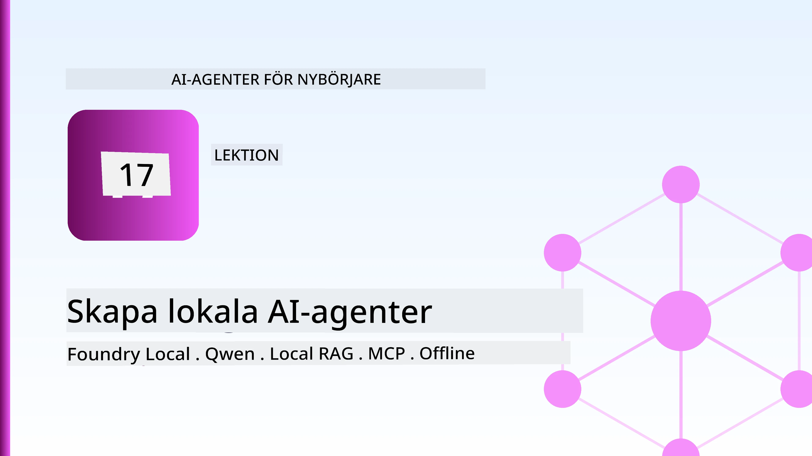
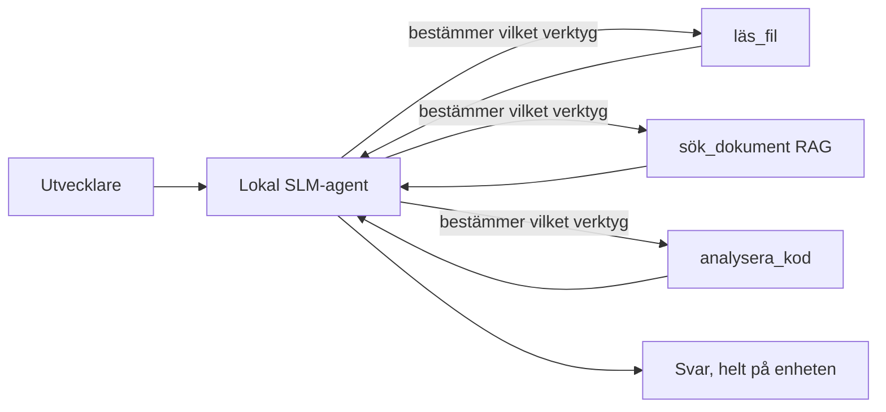
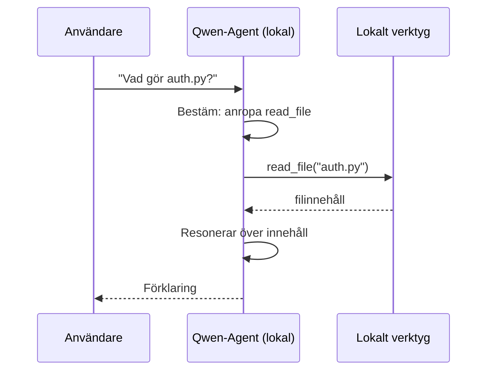
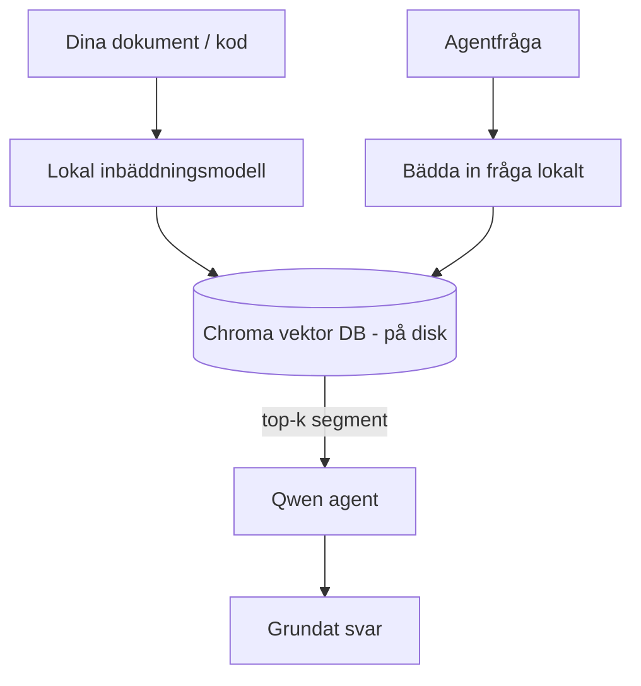
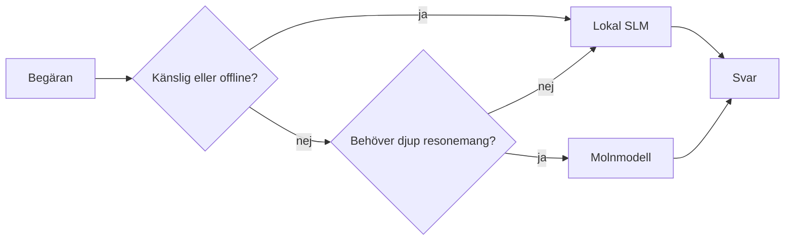

# Skapa Lokala AI-agenter med Microsoft Foundry Local och Qwen



Den föregående lektionen skalerade agenter *upp* till molnet. Den här tar dem *ner* till en enda maskin. I slutet kommer du att ha en fungerande ingenjörsassistent som resonerar, anropar verktyg, läser dina filer och söker i din dokumentation — **utan ett enda molninferensanrop.**

Varför skulle du vilja det? Tre anledningar som ständigt dyker upp i verkligt ingenjörsarbete:

- **Sekretess.** Koden och dokumenten lämnar aldrig maskinen. Inga promptar, inga kodsnuttar, inga kunddata korsar nätverksgränsen.
- **Kostnad.** Lokal inferens har ingen kostnad per token. Du kan iterera hela dagen till priset av elektricitet.
- **Offline.** På ett plan, i en säker anläggning eller under ett avbrott, fungerar agenten fortfarande.

Nackdelen är att du byter ut en topprankad molnmodell mot en **Small Language Model (SLM)** som körs på din CPU, GPU eller NPU. Den här lektionen handlar om att bygga agenter som är *bra* inom denna begränsning snarare än att låtsas att begränsningen inte finns.

## Introduktion

Den här lektionen kommer att täcka:

- **Small Language Models (SLM)** — vad de är, var de utmärker sig och var de inte gör det.
- **Microsoft Foundry Local** — en runtime som laddar ner och serverar modeller på enheten via ett **OpenAI-kompatibelt API**.
- **Qwen-funktionsanropande modeller** — SLM som pålitligt producerar verktygsanrop, vilket är vad som gör lokala *agenter* (inte bara lokal chatt) möjliga.
- **Lokala verktyg, lokal RAG och lokal MCP** — ger agenten kapacitet utan molnet.
- **Hybrida mönster** — när saker ska hållas lokala och när man ska nå ut till molnet.

## Lärandemål

Efter att ha genomfört denna lektion kommer du att kunna:

- Förklara kompromisserna med SLM och välja lämpliga användningsfall för lokala agenter.
- Servera en Qwen-modell lokalt med Foundry Local och ansluta till den via det OpenAI-kompatibla slutpunkten.
- Bygga en verktygsanropande agent som helt körs på din arbetsstation.
- Lägg till lokal RAG över dina egna dokument med en lokal vektordatabas (Chroma).
- Anslut agenten till en lokal MCP-server och resonera om hybrida lokal/moln-designs.

## Förkunskapskrav

Den här lektionen förutsätter att du har genomfört tidigare lektioner och är bekväm med:

- [Verktygsanvändning](../04-tool-use/README.md) (Lektion 4) och [Agentic RAG](../05-agentic-rag/README.md) (Lektion 5).
- [Agentiska Protokoll / MCP](../11-agentic-protocols/README.md) (Lektion 11).
- [Microsoft Agent Framework](../14-microsoft-agent-framework/README.md) (Lektion 14).

Du behöver också:

- En utvecklararbetsstation. **8 GB RAM är en realistisk minimum**; 16 GB+ är bekvämt. En GPU eller NPU hjälper men krävs inte.
- **Microsoft Foundry Local** installerad (se installationsavsnittet nedan).
- Python 3.12+ och paketen i förvaret [`requirements.txt`](../../../requirements.txt), plus `foundry-local-sdk`, `openai` och `chromadb` för denna lektion.

## Small Language Models: Rätt verktyg för lokalt arbete

En topprankad molnmodell har hundratals miljarder parametrar och ett datacenter bakom sig. En SLM har några få miljarder parametrar och måste rymmas i din laptops RAM. Den skillnaden sätter tydliga förväntningar.

**SLM är bra på:**

- Strukturerade, avgränsade uppgifter — klassificering, extraktion, sammanfattning av ett känt dokument.
- **Verktygsanrop** — besluta vilket funktion som ska anropas och med vilka argument.
- Snabb, billig, privat iteration på dina egna data.

**SLM är svagare på:**

- Öppen, flerstegsresonemang över stor kontext.
- Brett världskunskap (de har sett mindre och glömmer mer).

Den vinnande strategin för lokala agenter är alltså: **låt SLM orkestrera och låt verktyg göra tyngre lyft.** Modellen behöver inte *känna till* din kodbas — den behöver veta när den ska anropa `read_file` och `search_docs`. Det spelar direkt på en SLM:s styrkor.



## Microsoft Foundry Local

**Microsoft Foundry Local** är en lättviktig runtime som laddar ner, hanterar och serverar modeller helt på din maskin. Dess viktigaste funktion för oss är att den exponerar en **OpenAI-kompatibel HTTP-slutpunkt** — vilket betyder att OpenAI SDK och Microsoft Agent Frameworks OpenAI-klient fungerar med den med bara en ändring av `base_url`. Allt du lärt dig om att bygga agenter överförs direkt; bara slutpunkten flyttas från molnet till `localhost`.

Foundry Local väljer också automatiskt den bästa bygget för en modell för din hårdvara — en CPU-build, en CUDA/GPU-build eller en NPU-build — så du behöver inte optimera manuellt per maskin.

### Installation

Installera Foundry Local (se [dokumentationen](https://learn.microsoft.com/azure/ai-foundry/foundry-local/) för ditt OS), och kontrollera sedan att det fungerar:

```bash
# Installera (exempel; följ dokumentationen för din plattform)
winget install Microsoft.FoundryLocal      # Windows
# brew install microsoft/foundrylocal/foundrylocal   # macOS

# Ladda ner och kör en Qwen-modell, starta sedan den lokala tjänsten
foundry model run qwen2.5-7b-instruct
foundry service status
```

När tjänsten körs har du en lokal, OpenAI-kompatibel slutpunkt (vanligtvis `http://localhost:PORT/v1`). Notebooken använder `foundry-local-sdk` för att automatiskt upptäcka slutpunkten, så du behöver inte hårdkoda porten.

## Qwen Funktionsanrop: Varför det är viktigt

En agent är bara en agent om den kan anropa verktyg. Många SLM kan chatta men producerar opålitliga, felaktigt formade verktygsanrop. **Qwen**-modeller tränas för funktionsanrop och genererar konsekvent välformade verktygsanropsstrukturer — vilket är precis vad som gör en lokal chattmodell till en lokal *agent*.

Flödet är den standardiserade verktygsanropsloopen du redan känner till, men körs på enheten:



## Lokal RAG

Dokumentationssökning är där lokala agenter verkligen gör skillnad. Istället för att hoppas att SLM memorerat din ramverksdokumentation bäddar du in dessa dokument i en **lokal vektordatabas** och låter agenten hämta relevanta delar vid behov.

Vi använder **Chroma**, en inbäddad vektordatabas som körs i processen utan någon server att hantera. Pipeline är helt lokal: lokal inbäddningsmodell → lokala vektorer → lokal hämtning → lokal SLM.



Detta är samma Agentic RAG-mönster från Lektion 5 — enda skillnaden är att varje komponent körs på din maskin.

## Lokala MCP-servrar

[MCP](../11-agentic-protocols/README.md) är en transport, inte en molntjänst. En MCP-server kan köras som en lokal process på `stdio`, vilket exponerar verktyg till din agent över standardprotokollet. Detta låter dig återanvända det växande ekosystemet av MCP-servrar — filsystemåtkomst, git-operationer, databasfrågor — helt offline.

Säkerhetsinställningen skiljer sig från molnet, men är inte frånvarande: en lokal MCP-server körs fortfarande med dina användarbehörigheter, så begränsa vad den kan röra vid (en projektkatalog, inte hela din hemkatalog) och behandla dess utdata som indata för validering.

## Hybrida Moln- och Lokala Mönster

Lokalt först betyder inte bara lokalt. Mogna system styr baserat på känslighet och svårighetsgrad:

| Situation | Var det körs |
| --- | --- |
| Känslig kod / data, eller offline | **Lokal SLM** |
| Enkel, avgränsad uppgift | **Lokal SLM** (billigt, snabbt) |
| Svårt flerstegsresonemang på icke-känslig data | **Molnmodell** |
| Allt under ett avbrott | **Lokal SLM** (graciell degradering) |

Detta speglar idén om **modellriktning** från Lektion 16 — förutom att en av "modellerna" nu är din egen maskin. En robust design faller tillbaka på lokal när molnet inte är tillgängligt, så agenten degraderas i kvalitet istället för att helt misslyckas.



## Praktisk Laboration: En Lokal Ingenjörsassistent

Öppna [`code_samples/17-local-agent-foundry-local.ipynb`](./code_samples/17-local-agent-foundry-local.ipynb) och arbeta igenom den. Du kommer att bygga en **lokal ingenjörsassistent** som körs helt på din arbetsstation och kan:

1. **Anropa verktyg** — via Qwen funktionsanrop genom Foundry Local.
2. **Utföra lokala filoperationer** — lista och läsa filer i en projektmapp.
3. **Analysera kod** — rapportera grundläggande mått på en källkodfil.
4. **Söka dokumentation** — lokal RAG över en dokumentationsmapp med Chroma.
5. **Använda MCP** — anslut till en lokal MCP-server (med en graciös bortprioritering om ingen är konfigurerad).

Ingen molninferens används vid något tillfälle.

### Genomgång

Assistenten ansluter till Foundry Local via den OpenAI-kompatibla slutpunkten, så agentkoden ser nästan identisk ut med molnlektionerna — bara klienten ändras:

```python
from foundry_local import FoundryLocalManager
from openai import OpenAI

# Foundry Local upptäcker/laddar ner modellen och ger oss en lokal slutpunkt.
manager = FoundryLocalManager(\"qwen2.5-7b-instruct\")
client = OpenAI(base_url=manager.endpoint, api_key=manager.api_key)  # api_key är en lokal platshållare
```

Verktygen är vanliga Python-funktioner som begränsas till en projektmapp:

```python
def read_file(path: str) -> str:
    \"\"\"Read a file, but only inside the sandboxed project directory.\"\"\"
    full = (PROJECT_ROOT / path).resolve()
    if PROJECT_ROOT not in full.parents and full != PROJECT_ROOT:
        return \"Access denied: path is outside the project directory.\"
    return full.read_text(encoding=\"utf-8\")
```

Notera sandboxkontrollen — även lokalt är ett verktyg som läser godtyckliga sökvägar en risk. Notebooken håller varje verktyg begränsat till en projektrot.

## Kunskapskontroll

Testa din förståelse innan du går vidare till uppgiften.

**1. Ge två konkreta anledningar till att köra en agent lokalt istället för i molnet.**

<details>
<summary>Svar</summary>

Vilka två som helst av: **sekretess** (kod och data lämnar aldrig maskinen), **kostnad** (ingen kostnad per token), och **offline-förmåga** (fungerar utan nätverk — på ett plan, i en säker anläggning eller under ett avbrott). Regulatoriska/efterlevnadsbegränsningar som förbjuder att skicka data utanför enheten är en vanlig drivkraft för sekretessskälet.
</details>

**2. Vad är den rekommenderade arbetsfördelningen mellan en SLM och dess verktyg i en lokal agent, och varför?**

<details>
<summary>Svar</summary>

Låt SLM **orkestrera** (avgöra vilket verktyg som ska anropas och med vilka argument) och låt **verktygen göra det tunga arbetet** (läsa filer, hämta dokument, beräkna resultat). SLM är starka på avgränsade beslut som verktygsval men svaga på bred kunskap och långt flerstegsresonemang, så att luta sig mot verktyg spelar på deras styrkor.
</details>

**3. Vad gör det möjligt att återanvända molnagenter med Foundry Local?**

<details>
<summary>Svar</summary>

Foundry Local exponerar en **OpenAI-kompatibel HTTP-slutpunkt**. OpenAI SDK och Agent Frameworks OpenAI-klient fungerar mot den genom att bara ändra `base_url` (och använda en lokal platshållar-API-nyckel). Allt annat i agentkoden förblir samma.
</details>

**4. Varför använder vi specifikt en Qwen funktionsanropsmodell snarare än vilken SLM som helst?**

<details>
<summary>Svar</summary>

För att en agent måste producera pålitliga, välformade **verktygsanrop**. Många SLM kan chatta men genererar felaktiga eller inkonsekventa strukturer för verktygsanrop. Qwen-modeller är tränade för funktionsanrop och producerar konsekventa verktygsanrop, vilket förvandlar en lokal chattmodell till en fungerande lokal agent.
</details>

**5. Vilka komponenter körs på maskinen i den lokala RAG-pipelinen?**

<details>
<summary>Svar</summary>

Alla: inbäddningsmodellen, vektordatabasen (Chroma, på disk), hämtningsteget och SLM. Dokument bäddas in lokalt, lagras lokalt, hämtas lokalt och resonerar med en lokal modell — ingen komponent rör molnet.
</details>

**6. En lokal MCP-server körs på din maskin. Gör det den automatiskt säker? Vilken försiktighetsåtgärd bör du ändå vidta?**

<details>
<summary>Svar</summary>

Nej. En lokal MCP-server körs med dina användarbehörigheter, så den kan röra vid allt du kan. Begränsa den till vad den behöver (till exempel en enskild projektmapp snarare än hela din hemkatalog) och behandla dess utdata som indata som ska valideras innan du agerar på dem.
</details>

**7. Beskriv en rimlig hybridriktregel som inkluderar en lokal modell.**

<details>
<summary>Svar</summary>

Rikt känsliga eller offline-förfrågningar till lokal SLM; rikt enkla, avgränsade uppgifter till lokal SLM för snabbhet och kostnad; rikta svåra flerstegsresonemang på icke-känslig data till en molnmodell; och falla tillbaka på lokal SLM om molnet inte är tillgängligt så agenten degraderas graciöst istället för att misslyckas. Detta är modellriktning (Lektion 16) med den lokala maskinen som en av modellerna.
</details>

**8. Vad är en realistisk miniminivå av RAM för att köra den lokala agenten i denna lektion, och vad köper du med mer RAM?**

<details>
<summary>Svar</summary>

Runt **8 GB** är en realistisk minimum; 16 GB+ är bekvämt. Mer RAM låter dig köra större, mer kapabla modeller och hålla mer kontext i minnet. En GPU eller NPU snabbar upp inferens men krävs inte — Foundry Local väljer en CPU-build när ingen accelerator är tillgänglig.
</details>

## Uppgift

Utöka den lokala ingenjörsassistenten till en **lokal dokumentationsgranskare** för ett litet projekt du väljer (använd gärna någon av lektionens mappar i detta repot).

Din inlämning ska:

1. **Indexera en riktig dokumentations-/kodmapp** i Chroma (minst fem filer).
2. **Lägga till ett `find_todos`-verktyg** som skannar projektet efter `TODO`/`FIXME`-kommentarer och returnerar dem med fil och radnummer — med samma sandbox-kontroll som `read_file`.

3. **Ställ tre frågor till agenten** som tvingar den att kombinera verktyg: en ren RAG-fråga, en som kräver att läsa en specifik fil, och en som kräver att hitta TODOs.
4. **Mät det**: tidtag varje av de tre svaren och notera dem i en markdown-cell. Kommentera om latensen är acceptabel för din tänkta arbetsflöde.

Skriv sedan ett kort stycke om **vad du skulle flytta till molnet och vad du skulle behålla lokalt** för denna granskare, och varför. Du bedöms på om de lokala komponenterna är korrekt kopplade tillsammans och om din hybrida resonemang är sund — inte på modellkvaliteten.

## Sammanfattning

I denna lektion byggde du en agent som körs helt på din egen maskin:

- **SLMs** byter bredd mot integritet, kostnad och offlinefunktion — och utmärker sig när de **orkestrerar verktyg** snarare än att bära all kunskap själva.
- **Foundry Local** tjänstgör modeller på enheten bakom en **OpenAI-kompatibel endpoint**, så din molnagentkod överförs med en ändring på en rad.
- **Qwen funktionsanroppsmodeller** möjliggör pålitliga lokala verktygsanrop — och därmed lokala *agenter*.
- **Lokal RAG** (Chroma) och **lokal MCP** ger agenten kapacitet utan att lämna maskinen.
- **Hybrida mönster** låter dig routa efter känslighet och svårighetsgrad, med lokal som en smidig reservlösning.

Detta slutför distributionsbågen: Lektion 16 skalade upp agenter i Microsoft Foundry, och denna lektion skalade ned dem till en enskild arbetsstation. Nästa lektion handlar om att hålla distribuerade agenter säkra.

## Ytterligare resurser

- <a href="https://learn.microsoft.com/azure/ai-foundry/foundry-local/" target="_blank">Microsoft Foundry Local dokumentation</a>
- <a href="https://learn.microsoft.com/azure/ai-foundry/what-is-azure-ai-foundry" target="_blank">Microsoft Foundry dokumentation</a>
- <a href="https://aka.ms/ai-agents-beginners/agent-framework" target="_blank">Microsoft Agent Framework</a>
- <a href="https://qwen.readthedocs.io/en/latest/framework/function_call.html" target="_blank">Qwen funktionsanropsdokumentation</a>
- <a href="https://modelcontextprotocol.io/" target="_blank">Model Context Protocol (MCP)</a>
- <a href="https://docs.trychroma.com/" target="_blank">Chroma vektordatabas</a>

## Föregående lektion

[Distribuera skalbara agenter](../16-deploying-scalable-agents/README.md)

## Nästa lektion

[Säkra AI-agenter](../18-securing-ai-agents/README.md)

---

<!-- CO-OP TRANSLATOR DISCLAIMER START -->
**Ansvarsfriskrivning**:
Detta dokument har översatts med hjälp av AI-översättningstjänsten [Co-op Translator](https://github.com/Azure/co-op-translator). Även om vi strävar efter noggrannhet, var vänlig notera att automatiska översättningar kan innehålla fel eller brister. Det ursprungliga dokumentet på dess modersmål bör betraktas som den auktoritativa källan. För kritisk information rekommenderas professionell mänsklig översättning. Vi ansvarar inte för några missförstånd eller feltolkningar som uppstår till följd av användningen av denna översättning.
<!-- CO-OP TRANSLATOR DISCLAIMER END -->