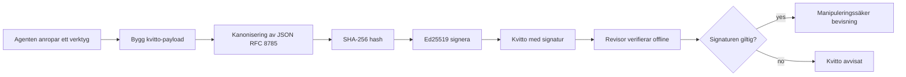
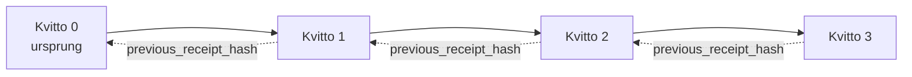

[Titta på lektionens video: Säkerställ AI-agenter med kryptografiska kvittenser](https://youtu.be/PLACEHOLDER_VIDEO_ID)

> _(Lektionsvideo och miniatyrbild kommer att läggas till av Microsofts innehållsteam efter sammanslagning, i enlighet med mönstret för lektion 14 / 15.)_

# Säkerställ AI-agenter med kryptografiska kvittenser

## Introduktion

Den här lektionen kommer att täcka:

- Varför revisionsspår för AI-agenter är viktiga för efterlevnad, felsökning och förtroende.
- Vad en kryptografisk kvittens är och hur den skiljer sig från en osignerad loggrad.
- Hur man producerar en signerad kvittens för en agents verktygsanrop i ren Python.
- Hur man verifierar en kvittens offline och upptäcker manipulation.
- Hur man kedjar kvittenser så att borttagning eller omordning av en bryter kedjan.
- Vad kvittenser bevisar och vad de uttryckligen inte bevisar.

## Lärandemål

Efter att ha slutfört denna lektion kommer du att kunna:

- Identifiera fel-lägen som motiverar kryptografisk härstamning för agenthandlingar.
- Producera en Ed25519-signerad kvittens över en kanonisk JSON-payload.
- Verifiera en kvittens oberoende med endast signerarens offentliga nyckel.
- Upptäcka manipulation genom att köra verifieringen igen på en modifierad kvittens.
- Bygga en haschkedjad sekvens av kvittenser och förklara varför kedjan är viktig.
- Känna igen gränsen mellan vad kvittenser bevisar (attribution, integritet, ordning) och vad de inte gör (riktigheten i handlingen, policyens riktighet).

## Problemet: Din agents revisionsspår

Föreställ dig att du har driftsatt en AI-agent för Contoso Travel. Agenten läser kundförfrågningar, anropar en flygAPI för att leta upp alternativ och bokar platser för kundens räkning. Förra kvartalet hanterade agenten 50 000 bokningar.

Idag kommer en revisor. De ställer en enkel fråga: "Visa mig vad din agent gjorde."

Du lämnar över dina loggfiler. Revisorn tittar på dem och ställer den svårare frågan: "Hur vet jag att dessa loggar inte har ändrats?"

Detta är problemet med revisionsspår. De flesta agentdriftsättningar idag förlitar sig på:

- **Applikationsloggar**: skrivs av agenten själv, kan redigeras av vem som helst med filsystemåtkomst.
- **Molnloggtjänster**: manipulationssynliga på plattformsnivå men endast om revisorn litar på plattformsoperatören.
- **Databas-transaktionsloggar**: väl lämpade för databasändringar men inte för godtyckliga verktygsanrop.

Ingen av dessa kan svara revisorns fråga utan att revisorn måste lita på någon (dig, din molnleverantör, din databaskund). För internt bruk är det ofta acceptabelt. För reglerade arbetsbelastningar (finans, vård, allt som omfattas av EU:s AI-förordning) är det inte det.

Kryptografiska kvittenser löser detta genom att göra varje agenthandling oberoende verifierbar. Revisorn behöver inte lita på dig. De behöver bara din offentliga nyckel och kvittensen.

## Vad är en kryptografisk kvittens?

En kvittens är ett JSON-objekt som registrerar vad en agent gjorde, signerat med en digital signatur.



En minimal kvittens ser ut så här:

```json
{
  "type": "agent.tool_call.v1",
  "agent_id": "contoso-travel-bot",
  "tool_name": "lookup_flights",
  "tool_args_hash": "sha256:a3f9c1...",
  "result_hash": "sha256:7b2e1d...",
  "policy_id": "contoso-travel-policy-v3",
  "timestamp": "2026-04-25T14:30:00Z",
  "sequence": 47,
  "previous_receipt_hash": "sha256:9d4e6a...",
  "signature": {
    "alg": "EdDSA",
    "sig": "c5af83...",
    "public_key": "8f3b2c..."
  }
}
```

Tre egenskaper gör jobbet:

1. **Signaturen**. Kvittensen signeras av agentens gateway med en privat Ed25519-nyckel. Vem som helst med motsvarande offentlig nyckel kan verifiera signaturen offline. Manipulation av något fält ogiltigförklarar signaturen.

2. **Kanonisk kodning**. Innan signering serialiseras kvittensen med JSON Canonicalization Scheme (JCS, RFC 8785). Detta säkerställer att två implementationer som producerar samma logiska kvittens ger byte-identisk output. Utan kanonisering skulle olika JSON-serialiserare ge olika signaturer för samma innehåll.

3. **Hash-kedjning**. Fältet `previous_receipt_hash` länkar varje kvittens till den före. Att ta bort eller omordna en kvittens bryter varje kvittens efter den. Manipulation blir synlig på kedjenivå även om individuella signaturer kringgås.

Tillsammans ger dessa egenskaper tre garantier:

- **Attribution**: denna nyckel signerade detta innehåll.
- **Integritet**: innehållet har inte ändrats sedan signering.
- **Ordning**: denna kvittens kom efter den kvittensen i kedjan.

## Producera en kvittens i Python

Du behöver inget speciellt bibliotek för att producera en kvittens. De kryptografiska primitiva funktionerna är allmänt tillgängliga och logiken är några tiotals rader Python.

De praktiska övningarna i `code_samples/18-signed-receipts.ipynb` går igenom hela flödet. Sammandraget:

```python
import json
import hashlib
import base64
from nacl import signing
from jcs import canonicalize  # RFC 8785 kanonisk JSON

def b64url_nopad(data: bytes) -> str:
    return base64.urlsafe_b64encode(data).decode("ascii").rstrip("=")

def sha256_canonical(obj) -> str:
    """SHA-256 of a Python object's JCS-canonical JSON form."""
    return f"sha256:{hashlib.sha256(canonicalize(obj)).hexdigest()}"

# Generera eller ladda en signeringsnyckel (i produktion, lagra i en nyckelvalv)
signing_key = signing.SigningKey.generate()
verify_key = signing_key.verify_key

# Bygg kvittots nyttolast (ingen signatur än)
tool_args = {"origin": "SYD", "destination": "LAX"}
tool_result = [{"flight": "QF11", "price": 1850, "stops": 0}]

payload = {
    "type": "agent.tool_call.v1",
    "agent_id": "contoso-travel-bot",
    "tool_name": "lookup_flights",
    "tool_args_hash": sha256_canonical(tool_args),
    "result_hash": sha256_canonical(tool_result),
    "policy_id": "contoso-travel-policy-v3",
    "timestamp": "2026-04-25T14:30:00Z",
    "sequence": 0,
    "previous_receipt_hash": None,
}

# Kanonisera, hasha, signera.
canonical_bytes = canonicalize(payload)
message_hash = hashlib.sha256(canonical_bytes).digest()
signature_bytes = signing_key.sign(message_hash).signature

# Bifoga ett strukturerat signaturobjekt.
receipt = {
    **payload,
    "signature": {
        "alg": "EdDSA",
        "sig": b64url_nopad(signature_bytes),
        "public_key": b64url_nopad(bytes(verify_key)),
    },
}
```

Det är hela signeringskedjan. Övningarna i notebooken går igenom varje steg.

## Verifiera en kvittens och upptäcka manipulation

Verifiering är den omvända operationen:

```python
import base64
import hashlib
from nacl import signing
from nacl.exceptions import BadSignatureError
from jcs import canonicalize

def b64url_decode(s: str) -> bytes:
    padding = "=" * ((4 - len(s) % 4) % 4)
    return base64.urlsafe_b64decode(s + padding)

def verify_receipt(receipt: dict) -> bool:
    # Signaturen är ett strukturerat objekt: {"alg", "sig", "public_key"}.
    sig_obj = receipt.get("signature")
    if not sig_obj or sig_obj.get("alg") != "EdDSA":
        return False

    # Återskapa den information som faktiskt signerades (allt utom signaturen).
    payload = {k: v for k, v in receipt.items() if k != "signature"}

    canonical_bytes = canonicalize(payload)
    message_hash = hashlib.sha256(canonical_bytes).digest()

    try:
        verify_key = signing.VerifyKey(b64url_decode(sig_obj["public_key"]))
        verify_key.verify(message_hash, b64url_decode(sig_obj["sig"]))
        return True
    except BadSignatureError:
        return False
```

Denna funktion tar en kvittens och returnerar `True` om signaturen är giltig, `False` annars. Ingen nätverksanrop, inget tjänsteberoende, ingen tredjepartstro behövs.

För att se upptäckt av manipulation i praktiken går notebooken igenom:

1. Att producera en giltig kvittens och bekräfta att den verifieras.
2. Ändra en byte i fältet `tool_args_hash`.
3. Köra verifieringen igen och se den misslyckas.

Detta är den praktiska demonstrationen att kvittenser är manipulationssynliga: varje ändring, hur liten som helst, bryter signaturen.

## Kedja kvittenser för agenter med flera steg

En enda signerad kvittens skyddar en handling. En kedja av kvittenser skyddar en sekvens.



Varje kvittens registrerar hashvärdet av föregående kvittens. För att tyst ta bort kvittens 2 skulle en angripare behöva antingen:

- Modifiera fältet `previous_receipt_hash` i kvittens 3 (bryter signaturen för kvittens 3), ELLER
- Förfalska en ny signatur på en modifierad kvittens 3 (kräver agentens privata nyckel).

Om den privata nyckeln finns i ett hårdvarunyckelförråd och du publicerar den offentliga nyckeln med varje kvittens, är ingen av dessa attacker genomförbar utan upptäckt.

Notebooken går igenom:

1. Att bygga en kedja med tre kvittenser.
2. Verifiera att varje kvittens `previous_receipt_hash` matchar den faktiska hashen av föregående kvittens.
3. Manipulera en kvittens mitt i kedjan och se kedjan brytas just där.

Så här producerar du ett revisionsspår som en extern revisor kan verifiera utan att behöva lita på dig.

## Vad kvittenser bevisar (och vad de inte gör)

Detta är lektionens viktigaste avsnitt. Kvittenser är kraftfulla men deras kraft är begränsad.

**Kvittenser bevisar tre saker:**

1. **Attribution**: en specifik nyckel signade en specifik data.
2. **Integritet**: datan har inte ändrats sedan signeringen.
3. **Ordning**: denna kvittens kom efter den kvittensen i hashkedjan.

**Kvittenser bevisar INTE:**

1. **Korrekthet**: att agentens handling var rätt beslut. En kvittens kan signeras för ett felaktigt svar lika lätt som för ett rätt.
2. **Policyefterlevnad**: att policyn som anges i `policy_id` faktiskt utvärderades, eller att den hade tillåtit denna handling om den kontrollerades. Kvittensen registrerar vad som påstås, inte vad som genomfördes.
3. **Identitet bortom nyckeln**: kvittensen säger "denna nyckel signerade detta innehåll." Den säger inte "denna människa auktoriserade detta." Att koppla en nyckel till en person eller organisation kräver separat identitetsinfrastruktur (en katalog, ett offentligt nyckelregister osv.).
4. **Sanningsenlighet hos ingångar**: om agenten får en manipulerad prompt och agerar på den, registrerar kvittensen handlingen korrekt. Kvittenser är efter inputvalidering, inte en ersättning för den.

Denna gräns är viktig av två skäl:

- Den förklarar vad kvittenser är användbara för: att göra agentbeteende granskningsbart och manipulationssynligt, även över organisationsgränser.
- Den förklarar vilka ytterligare lager du behöver: inputvalidering (Lektion 6), policyimplementation (behandlas kort nedan), och identitetsinfrastruktur (utanför detta lektionsomfång).

Ett vanligt misstag är att anta att "vi har kvittenser" betyder "vi är styrda." Det gör det inte. Kvittenser är en grund. Styrning är systemet du bygger ovanpå.

## Bevisa att en människa godkände exakt handling

Punkt 3 ovan förtjänar ett eget avsnitt: en handlingskvittens säger "denna nyckel signerade detta innehåll," aldrig "en människa auktoriserade detta." För högriskhandlingar (återbetalningar, raderingar, banköverföringar) kräver styrningsramverk alltmer just det saknade uttalandet, och det kan produceras med samma primitiva funktioner som du redan byggt i denna lektion.

Den efterföljande notebooken `code_samples/human-authorization-receipts.ipynb` lägger till en andra typ av kvittens, `human.approval.v1`, i samma kuvertform som lektionens kvittenser (en typad payload signerad med Ed25519 över dess kanoniska SHA-256, med `signature`-objektet utanför de signerade byten). En namngiven godkännare signerar **hela den kanoniska åtgärden och dess digest** före utförande; agentens handlingskvittens bär **samma åtgärdsdigest** och en `parent_approval_ref`, `receipt_hash` för godkännandet, samma konvention som `previous_receipt_hash` i kedjan du byggde ovan. En `verify_chain` går igenom båda artefakter under **separata fastlagda nyckelregister** (godkännar-nycklar vs agent-nycklar), så kodvägen delas men myndigheterna gör det aldrig.

Egenskapen detta ger, noggrant uttryckt: *människan godkände denna exakta handling, och agenten utförde exakt den godkända handlingen.* Notebookens vägran-fixturer gör att egenskapen är verklig och inte bara påstående:

- den klassiska uppsättningen: manipulation, förvirrad ombud, uppspelning, förfalskade nycklar på båda sidor, felaktig input;
- **föråldrad myndighet**: en signatur som fortfarande verifierar, ändå nekas eftersom policy-versionen ändrades, godkännarnyckeln roterades ut ur det fastlagda registret, eller godkännandet löpte ut före utförande;
- **digest-utbyte**: en giltigt signerad handlingskvittens pekande på ett *verkligt* godkännande som binder en *annan* kanonisk handling.

Varje fel nekas med en distinkt orsak, så en revisor som läser ett avslag kan avgöra om myndigheten blev föråldrad eller om den utförda handlingen ändrades. Reglen som notebooken lär ut: en signerad godkännande är inte myndighet i sig. Myndighet finns endast om båda kvittenserna fortfarande binder till samma kanoniska handling vid utförandet. Samtidig signeringsbanan i samma Internet-Draft som denna lektion följer (`draft-farley-acta-signed-receipts`) är standardspåret för detta mönster.

## Produktionsreferenser

Pythons koden i denna lektion är avsiktligt minimal så att du kan läsa varje rad och förstå exakt vad som händer. I produktion har du två alternativ:

1. **Bygg direkt på de kryptografiska primitiva.** De 50 rader du såg ovan räcker för många användningsfall. PyNaCl (Ed25519) och paketet `jcs` (kanonisk JSON) är väl underhållna och granskade bibliotek.

2. **Använd ett produktionsbibliotek för kvittenser.** Flera öppen källkod-projekt implementerar samma mönster med extra funktioner (nyckelrotation, batch-verifiering, JWK Set-distribution, integration med policymotorer):
   - Kvittensformatet som används i denna lektion följer ett IETF Internet-Draft ([`draft-farley-acta-signed-receipts`](https://datatracker.ietf.org/doc/draft-farley-acta-signed-receipts/), revision 02) som för närvarande är i standardiseringsprocessen, med en delad konformitetssvit ([agent-governance-testvectors](https://github.com/ScopeBlind/agent-governance-testvectors)) som oberoende implementationer korsverifierar mot för byte-identisk kanonisk output.
   - Microsoft Agent Governance Toolkit kombinerar kvittenser med Cedar-baserade policymeddelanden; se Tutorial 33 i det förrådet för ett komplett exempel.
   - Paketen `protect-mcp` (npm) och `@veritasacta/verify` (npm) tillhandahåller en Node-baserad implementering av kvittenssignering och offlineverifiering, avsedd för att omsluta vilken MCP-server som helst med ett manipulationssynligt revisionsspår, inklusive en håll-ved-kosignering-flöde där en pausad åtgärd avger en godkännandekvittens bunden till åtgärdsdigesten (WebAuthn-stödd i desktop-flödet), samma godkännande-kvittensmönster som den mänskliga auktorisations-notebooken ovan.
   - Det **[nobulex](https://github.com/arian-gogani/nobulex)** Python SDK (`pip install nobulex`) tillhandahåller samma Ed25519 + JCS-signaturmönster i Python med LangChain och CrewAI-integrationer, inklusive publicerade korsvalideringstestvektorer och en efterlevnadskarta bidragen via [OWASP PR #2210](https://github.com/OWASP/CheatSheetSeries/pull/2210).

Valet mellan att bygga eget och att använda ett bibliotek speglar valet mellan att skriva ett eget JWT-bibliotek och att använda ett testat: båda är rimliga; biblioteket spar tid och minskar granskningsyta; från-scratch tillvägagångssättet tvingar dig att förstå varje primitiv. Denna lektion lär ut från-scratch-vägen så att du har grunden för båda valen.

## Kunskapskontroll

Testa din förståelse innan du går vidare till praktikuppgiften.

**1. En kvittens är signerad med agentens privata Ed25519-nyckel. Revisorn har endast den offentliga nyckeln. Kan revisorn verifiera kvittensen offline?**

<details>
<summary>Svar</summary>

Ja. Ed25519-verifiering kräver endast den offentliga nyckeln och de signerade bytena. Inget nätverksanrop, inget tjänsteberoende. Detta är egenskapen som gör kvittenser användbara i luftgapade, multi-organisation eller låg-troende granskningsmiljöer.
</details>

**2. En angripare modifierar `policy_id`-fältet i en kvittens för att påstå att den styrdes av en mer tillåtande policy. Signaturen var över den ursprungliga payloaden. Vad händer vid verifiering?**

<details>
<summary>Svar</summary>


Verifieringen misslyckas. Signaturen beräknades över de kanoniska byten av den ursprungliga nyttolasten; att ändra något fält ändrar de kanoniska byten, vilket ändrar SHA-256-hashen, vilket gör signaturen ogiltig. Angriparen skulle behöva den privata nyckeln för att producera en ny giltig signatur, vilket de inte har.
</details>

**3. Varför inkluderar kvittot en `tool_args_hash` och `result_hash` istället för de råa argumenten och resultatet?**

<details>
<summary>Svar</summary>

Två anledningar. För det första kan kvittot behöva arkiveras eller skickas i miljöer där det är problematiskt att läcka det råa innehållet (PII, affärsdata). Hashning gör kvittot litet och innehållet privat; revisor verifierar att hashen stämmer överens med en separat lagrad kopia av det faktiska innehållet. För det andra har hasher en fast storlek; ett kvitto med hasher är begränsat i storlek oavsett hur stora in- och utdata var.
</details>

**4. Fältet `previous_receipt_hash` länkar varje kvitto till dess föregångare. Om en angripare tyst tar bort ett kvitto från mitten av en kedja, vad blir ogiltigt?**

<details>
<summary>Svar</summary>

Varje kvitto som kom efter det borttagna. Deras `previous_receipt_hash`-fält överensstämmer inte längre med den faktiska kedjan (eftersom kvittot de refererade till inte längre finns, eller kedjan nu pekar på en annan föregångare). För att dölja borttagningen skulle angriparen behöva skriva under alla senare kvitton på nytt, vilket kräver den privata nyckeln.
</details>

**5. Ett kvitto verifieras utan problem. Bevisar det att agentens handling var korrekt, giltig eller i enlighet med policyn?**

<details>
<summary>Svar</summary>

Nej. Ett giltigt kvitto bevisar tre saker: attributering (denna nyckel signerade detta innehåll), integritet (innehållet har inte ändrats), och ordning (detta kvitto kom efter det där kvittot). Det bevisar INTE att handlingen var korrekt, att policyn som nämns i `policy_id` faktiskt utvärderades, eller att agenten följde varje regel. Kvitton gör agentens beteende reviderbart, inte nödvändigtvis korrekt. Detta är den viktigaste gränsen i lektionen.
</details>

## Övning

Öppna `code_samples/18-signed-receipts.ipynb` och slutför alla fyra sektioner:

1. **Sektion 1**: Signera ditt första kvitto och verifiera det.
2. **Sektion 2**: Manipulera kvittot och observera att verifieringen misslyckas.
3. **Sektion 3**: Bygg en kedja av tre kvitton och verifiera kedjans integritet.
4. **Sektion 4**: Använd mönstret på en agent byggd med Microsoft Agent Framework: omslut ett verktygsanrop i kvitto-signering, och verifiera sedan kvittot oberoende.

**Extra utmaning 1:** Utöka kvittoschemat med ett ytterligare valfritt fält (till exempel en förfrågnings-ID för spårning), uppdatera den kanoniska signeringslogiken så att det inkluderas, och bekräfta att kvittot fortfarande kan verifieras fram och tillbaka. Ändra sedan fältet efter signering och bekräfta att verifieringen misslyckas. Detta tvingar dig att förstå hur varje byte av den kanoniska kodningen bidrar till signaturen.

**Extra utmaning 2:** SHA-256-hasha två av dina kvitton tillsammans (kombinera deras kanoniska byte i en deterministisk ordning) och bädda in den resulterande digesten som ett nytt fält på ett tredje kvitto innan du signerar det. Verifiera att alla tre kvitton fortfarande kan verifieras fram och tillbaka. Du har just byggt ett enstegs inklusionsbevis: vem som helst som har det tredje kvittot kan bevisa att de två första existerade vid tiden då det signerades, utan att behöva avslöja deras innehåll. Detta är mönstret som selektiva avslöjande-kvitton använder i stor skala (Merkle-åtaganden, RFC 6962).

## Slutsats

Kryptografiska kvitton ger AI-agenter en revisionskedja som är:

- **Oberoende verifierbar**: varje part med den publika nyckeln kan verifiera, utan beroende av tjänster.
- **Manipulationssäker**: varje förändring ogiltigförklarar signaturen.
- **Portabel**: ett kvitto är en liten JSON-fil; den kan arkiveras, överföras och verifieras var som helst.
- **Standardanpassad**: byggt på Ed25519 (RFC 8032), JCS (RFC 8785) och SHA-256, alla väl etablerade primitiva.

De ersätter inte inmatningsvalidering, policyimplementering eller identitetsinfrastruktur. De är en grund för dessa lager. När du distribuerar agenter i reglerade arbetsflöden, multi-organisationsarbetsflöden eller miljöer där en framtida revisor inte kan förväntas lita på dig, är kvitton hur du gör revisionskedjan ärlig.

Den viktigaste lärdomen: kvitton bevisar vem som sa vad och när. De bevisar inte att det som sades var sant eller rätt. Håll detta tydligt. Det är skillnaden mellan ett ärligt härledningssystem och ett vilseledande.

## Produktionschecklista

När du är redo att gå vidare från denna lektion till att distribuera kvittosignerade agenter i verklig miljö:

- [ ] **Flytta signeringsnyckeln från utvecklarens laptop.** Använd Azure Key Vault, AWS KMS eller en hårdvarusäkerhetsmodul. Den privata nyckeln som signerar dina kvitton får aldrig ligga i källkontroll eller i klartext på applikationsmaskiner.
- [ ] **Publicera verifieringsnyckeln.** Revisorer behöver den för att verifiera offline. Standardmönstret är en JWK Set på en välkänd URL (RFC 7517), t.ex. `https://your-org.example.com/.well-known/agent-keys.json`.
- [ ] **Ankare kedjan externt.** Skriv periodiskt det senaste kedjehuvudets hash till en transparenslogg (Sigstore Rekor, RFC 3161 tidsstämpelmyndighet eller ett andra internt system) så att en extern part kan bekräfta "denna kedja existerade vid denna tidpunkt."
- [ ] **Spara kvitton oföränderliga.** Append-only blob-lagring (Azure Storage med immutabilitetspolicys, AWS S3 Object Lock) förhindrar insiders från att skriva om historiken på lagringsnivå.
- [ ] **Bestäm lagringsperiod.** Många efterlevnadsregler kräver flera års bevarande. Planera för kvittoväxt (varje kvitto är ~500 bytes; en agent som gör 10 000 anrop per dag producerar ~1,8 GB per år).
- [ ] **Dokumentera vad kvitton inte täcker.** Kvitton bevisar attributering, integritet och ordning. Din runbook bör uttryckligen lista vilka ytterligare kontroller (inmatningsvalidering, policyimplementering, hastighetsbegränsning, identitetsinfrastruktur) som kompletterar kvittot i din styrningsstrategi.

### Fler frågor om att säkra AI-agenter?

Gå med i [Microsoft Foundry Discord](https://aka.ms/ai-agents/discord) för att träffa andra som lär sig, delta i office hours och få svar på dina frågor om AI-agenter.

## Utöver denna lektion

Denna lektion täcker enkel kvittosignering och hash-kedjade sekvenser. Samma primitiva byggstenar utgör flera mer avancerade mönster du kan stöta på när din styrningsstrategi mognar:

- **Selektivt avslöjande.** När ett kvittos fält är oberoende åtagna (RFC 6962-stil Merkle-träd) kan du avslöja specifika fält för specifika revisorer och bevisa att resten är oförändrade utan att exponera dem. Användbart när samma kvitto måste tillfredsställa både en omfattande revision (som vill ha fullständighet) och dataminimeringsregler som GDPR (som vill att revisorn ska se så lite som nödvändigt).
- **Kvittoåterkallelse.** Om en signeringsnyckel komprometteras behöver du ett sätt att markera alla kvitton signerade med den nyckeln som opålitliga från en viss tidpunkt och framåt. Standardmönster: kortlivade signeringsnycklar plus en publicerad återkallelselista, eller en transparenslogg med återkallelseposter.
- **Bilaterala / delade signaturkvitton.** Vissa implementationer delar upp den signerade nyttolasten i pre-exekverings- (`authorization_*`) och post-exekverings- (`result_*`) halvor med oberoende signaturer, användbart när auktorisationsbeslutet och det observerade resultatet produceras av olika aktörer eller vid olika tillfällen. Detta bygger additivt på kvittformatet som lärs i denna lektion.
- **Nyttolastkomposition.** Ett kvitto förseglas med de byten du lägger i `result_hash`. Verkliga nyttolaster är ofta rikare än ett enda verktygsanropsresultat: för-beslutsresonemang (modellprediktion, övervägda alternativ, bevis och dess fullständighet, riskposition, ansvarskedja, grindresultat) kan alla finnas inuti nyttolasten, förseglade av ett enda kvitto. Detta håller kvittoformatet minimalt samtidigt som nyttolastscheman kan utvecklas domän-för-domän.
- **Tvärimplementation konformitet.** Flera oberoende implementationer av samma kvittoformat (Python, TypeScript, Rust, Go) korsverifierar mot delade testvektorer. Om du bygger din egen implementation bekräftar validering mot publicerade vektorer trådkopplingskompatibilitet.
- **Post-kvantdator-migration.** Ed25519 är idag allmänt utbredd men är inte kvantresistent. Kvittoformatet är algoritmagilt: fältet `signature.alg` kan bära `ML-DSA-65` (NIST:s post-kvantums signaturstandard) när du behöver migrera. Planera för en övergångsperiod där kvitton är dubbel-signerade.

## Ytterligare resurser

- <a href="https://datatracker.ietf.org/doc/draft-farley-acta-signed-receipts/" target="_blank">IETF Internet-Draft: Signed Decision Receipts for Machine-to-Machine Access Control</a>
- <a href="https://learn.microsoft.com/azure/ai-studio/responsible-use-of-ai-overview" target="_blank">Ansvarsfull AI-översikt (Azure AI)</a>
- <a href="https://datatracker.ietf.org/doc/html/rfc8032" target="_blank">RFC 8032: Edwards-Curve Digital Signature Algorithm (EdDSA)</a>
- <a href="https://datatracker.ietf.org/doc/html/rfc8785" target="_blank">RFC 8785: JSON Canonicalization Scheme (JCS)</a>
- <a href="https://datatracker.ietf.org/doc/html/rfc6962" target="_blank">RFC 6962: Certificate Transparency</a> (Merkle-träd konstruktion som används av selektiva avslöjande-kvitton)
- <a href="https://github.com/microsoft/agent-governance-toolkit/blob/main/docs/tutorials/33-offline-verifiable-receipts.md" target="_blank">Microsoft Agent Governance Toolkit, Tutorial 33: Offline-Verifiable Decision Receipts</a>
- <a href="https://github.com/ScopeBlind/agent-governance-testvectors" target="_blank">Tvärimplementation-konformitetstestvektorer</a> för det kvittoformat som används i denna lektion (Apache-2.0)
- <a href="https://pynacl.readthedocs.io/" target="_blank">PyNaCl dokumentation</a> (Ed25519 i Python)

## Föregående lektion

[Skapa Lokala AI-agenter](../17-creating-local-ai-agents/README.md)

---

<!-- CO-OP TRANSLATOR DISCLAIMER START -->
**Ansvarsfriskrivning**:
Detta dokument har översatts med hjälp av AI-översättningstjänsten [Co-op Translator](https://github.com/Azure/co-op-translator). Även om vi strävar efter noggrannhet, var vänlig notera att automatiska översättningar kan innehålla fel eller brister. Det ursprungliga dokumentet på dess modersmål bör betraktas som den auktoritativa källan. För kritisk information rekommenderas professionell mänsklig översättning. Vi ansvarar inte för några missförstånd eller feltolkningar som uppstår till följd av användningen av denna översättning.
<!-- CO-OP TRANSLATOR DISCLAIMER END -->