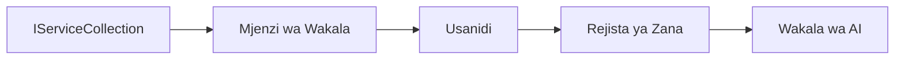

# 🎨 Mifumo ya Ubunifu ya Wakala na Azure OpenAI (API ya Majibu) (.NET)

## 📋 Malengo ya Kujifunza

Mfano huu unaonyesha mifumo ya ubunifu ya ngazi ya shirika kwa uundaji wa mawakala wenye akili kwa kutumia Microsoft Agent Framework katika .NET pamoja na ushirikiano wa Azure OpenAI (API ya Majibu). Utajifunza mifumo ya kitaalamu na mbinu za usanifu zinazofanya mawakala kuwa tayari kwa uzalishaji, rahisi kudumishwa, na yenye uwezo wa kupanuka.

### Mifumo ya Ubunifu ya Shirika

- 🏭 **Mfumo wa Kiwanda**: Uundaji wa wakala uliosanifishwa kwa kutumia utekelezaji wa utegemezi
- 🔧 **Mfumo wa Mjenzi**: Mpangilio wa wakala kwa mtiririko wa herufi
- 🧵 **Mifumo Inayolinda Mipangilio**: Usimamizi wa mazungumzo sambamba
- 📋 **Mfumo wa Hifadhi**: Usimamizi wa zana na uwezo kwa mpangilio

## 🎯 Faida Maalum za Usanifu wa .NET

### Vipengele vya Shirika

- **Aina Imara**: Uhakiki wa wakati wa kuunganisha na msaada wa IntelliSense
- **Utekelezaji wa Utegemezi**: Ushirikiano wa chombo cha DI kilicho jumuishwa
- **Usimamizi wa Mpangilio**: Mfumo wa IConfiguration na mifumo ya Options
- **Async/Await**: Msaada wa daraja la kwanza kwa programu zisizo za pamoja

### Mifumo Tayari kwa Uzalishaji

- **Ushirikiano wa Kumbukumbu**: ILogger na msaada wa kumbukumbu yenye muundo
- **Ukaguzi wa Afya**: Ufuatiliaji na uchunguzi uliojumuishwa
- **Uhakiki wa Mpangilio**: Uundaji imara kwa kutumia vielezi vya data
- **Usimamizi wa Makosa**: Usimamizi wa makosa yenye muundo

## 🔧 Usanifu wa Kiufundi

### Vipengele vya Msingi vya .NET

- **Microsoft.Extensions.AI**: Muhtasari wa huduma za AI zilizounganishwa
- **Microsoft.Agents.AI**: Mfumo wa kupanga mawakala wa ngazi ya shirika
- **Azure OpenAI (API ya Majibu)**: Mifumo ya mteja wa API yenye ufanisi mkubwa
- **Mfumo wa Mpangilio**: appsettings.json na ushirikiano wa mazingira

### Utekelezaji wa Mifumo ya Ubunifu



## 🏗️ Mifumo ya Shirika Imeonyeshwa

### 1. **Mifumo ya Ukuaji**

- **Kiwanda cha Wakala**: Uundaji wa wakala ulio na mpangilio thabiti
- **Mfumo wa Mjenzi**: API ya mtiririko kwa mpangilio tata wa wakala
- **Mfumo wa Singleton**: Usimamizi wa rasilimali na mpangilio wa pamoja
- **Utekelezaji wa Utegemezi**: Ushirikiano mpana na urahisi wa majaribio

### 2. **Mifumo ya Tabia**

- **Mfumo wa Mkakati**: Mikakati ya utekelezaji wa zana inayobadilika
- **Mfumo wa Amri**: Operesheni za wakala zilizo kufungwa na undo/redo
- **Mfumo wa Mshirikishi**: Usimamizi wa maisha ya wakala unaoendeshwa na matukio
- **Mbinu ya Kiolezo**: Mtiririko wa utekelezaji wa wakala uliosanifiwa

### 3. **Mifumo ya Muundo**

- **Mfumo wa Adapter**: Tabaka la ushirikiano wa Azure OpenAI (API ya Majibu)
- **Mfumo wa Decorator**: Uboreshaji wa uwezo wa wakala
- **Mfumo wa Facade**: Kiolesura rahisi cha mwingiliano wa wakala
- **Mfumo wa Proxy**: Upakiaji polepole na kuhifadhi kwa utendaji

## 📚 Kanuni za Ubunifu za .NET

### Kanuni za SOLID

- **Wajibu Mmoja**: Kila sehemu ina lengo moja wazi
- **Wazi/Mfungwa**: Inaweza kupanuliwa bila kuhariri
- **Mbadala wa Liskov**: Utekelezaji wa zana zinazotegemea kiolesura
- **Mgawanyo wa Kiolesura**: Violesura vyenye lengo na umoja
- **Kigeuzi cha Utegemezi**: Tegemea muhtasari, si utekelezaji thabiti

### Usanifu Safi

- **Tabaka la Kikoa**: Muhtasari wa wakala na zana kuu
- **Tabaka la Programu**: Mpangilio wa mawakala na mtiririko wa kazi
- **Tabaka la Miundombinu**: Ushirikiano wa Azure OpenAI (API ya Majibu) na huduma za nje
- **Tabaka la Uwasilishaji**: Mwingiliano wa mtumiaji na uundaji wa majibu

## 🔒 Mambo ya Kuzingatia kwa Shirika

### Usalama

- **Usimamizi wa Vibali**: Usimamizi salama wa ufunguo wa API kwa IConfiguration
- **Uhakiki wa Ingizo**: Uthabiti wa aina na uhakiki wa vielezi vya data
- **Usafishaji wa Matokeo**: Usindikaji salama na kuchuja majibu
- **Kumbukumbu za Ukaguzi**: Ufuatiliaji wa kina wa operesheni

### Utendaji

- **Mifumo ya Async**: Operesheni za I/O zisizozuia
- **Mradi wa Muunganisho**: Usimamizi mzuri wa mteja wa HTTP
- **Kuhifadhi**: Kuhifadhi majibu kwa utendaji ulioimarishwa
- **Usimamizi wa Rasilimali**: Mtindo sahihi wa kutupa na kusafisha

### Uwezo wa Kupanuka

- **Usalama wa Mida**: Msaada wa utekelezaji wa wakala sambamba
- **Mgawanyiko wa Rasilimali**: Matumizi bora ya rasilimali
- **Usimamizi wa Mzigo**: Kuzuia viwango na kushughulikia shinikizo la nyuma
- **Ufuatiliaji**: Vipimo vya utendaji na ukaguzi wa afya

## 🚀 Utekelezaji wa Uzalishaji

- **Usimamizi wa Mpangilio**: Mipangilio maalum ya mazingira
- **Mikakati ya Kumbukumbu**: Kumbukumbu yenye muundo na vitambulisho vya uhusiano
- **Usimamizi wa Makosa**: Usimamizi wa makosa globali na urejeshaji sahihi
- **Ufuatiliaji**: Maarifa ya programu na vipimo vya utendaji
- **Majaribio**: Majaribio ya vipande, majaribio ya ushirikiano, na mifumo ya majaribio ya mzigo

Uko tayari kuunda mawakala wenye akili wa ngazi ya shirika kwa .NET? Hebu turatibu kitu thabiti! 🏢✨

## 🚀 Kuanzisha

### Yanayohitajika Kabla

- [SDK ya .NET 10](https://dotnet.microsoft.com/download/dotnet/10.0) au toleo jipya zaidi
- [Usajili wa Azure](https://azure.microsoft.com/free/) wenye rasilimali ya Azure OpenAI na usambazaji wa mfano
- [CLI ya Azure](https://learn.microsoft.com/cli/azure/install-azure-cli) — ingia kwa `az login`

### Mabadiliko ya Mazingira Yanayohitajika

```bash
# zsh/bash
export AZURE_OPENAI_ENDPOINT=https://<your-resource>.openai.azure.com
export AZURE_OPENAI_DEPLOYMENT=gpt-4.1-mini
# Kisha ingia ili AzureCliCredential ipate tokeni
az login
```

```powershell
# PowerShell
$env:AZURE_OPENAI_ENDPOINT = "https://<your-resource>.openai.azure.com"
$env:AZURE_OPENAI_DEPLOYMENT = "gpt-4.1-mini"
# Kisha ingia ili AzureCliCredential ipate tokeni
az login
```

### Mfano wa Msimbo

Kuendesha mfano wa msimbo,

```bash
# zsh/bash
chmod +x ./03-dotnet-agent-framework.cs
./03-dotnet-agent-framework.cs
```

Au kwa kutumia CLI ya dotnet:

```bash
dotnet run ./03-dotnet-agent-framework.cs
```

Angalia [`03-dotnet-agent-framework.cs`](../../../../03-agentic-design-patterns/code_samples/03-dotnet-agent-framework.cs) kwa msimbo kamili.

```csharp
#!/usr/bin/dotnet run

#:package Microsoft.Extensions.AI@10.*
#:package Microsoft.Agents.AI.OpenAI@1.*-*
#:package Azure.AI.OpenAI@2.1.0
#:package Azure.Identity@1.13.1

using System.ComponentModel;

using Microsoft.Agents.AI;
using Microsoft.Extensions.AI;

using Azure.AI.OpenAI;
using Azure.Identity;

// Tool Function: Random Destination Generator
// This static method will be available to the agent as a callable tool
// The [Description] attribute helps the AI understand when to use this function
// This demonstrates how to create custom tools for AI agents
[Description("Provides a random vacation destination.")]
static string GetRandomDestination()
{
    // List of popular vacation destinations around the world
    // The agent will randomly select from these options
    var destinations = new List<string>
    {
        "Paris, France",
        "Tokyo, Japan",
        "New York City, USA",
        "Sydney, Australia",
        "Rome, Italy",
        "Barcelona, Spain",
        "Cape Town, South Africa",
        "Rio de Janeiro, Brazil",
        "Bangkok, Thailand",
        "Vancouver, Canada"
    };

    // Generate random index and return selected destination
    // Uses System.Random for simple random selection
    var random = new Random();
    int index = random.Next(destinations.Count);
    return destinations[index];
}

// Azure OpenAI with the Responses API (stable v1 endpoint). Sign in with `az login`.
var azureEndpoint = Environment.GetEnvironmentVariable("AZURE_OPENAI_ENDPOINT")
    ?? throw new InvalidOperationException("AZURE_OPENAI_ENDPOINT is not set.");
var deployment = Environment.GetEnvironmentVariable("AZURE_OPENAI_DEPLOYMENT") ?? "gpt-4.1-mini";

var azureClient = new AzureOpenAIClient(new Uri(azureEndpoint), new AzureCliCredential());

// Define Agent Identity and Comprehensive Instructions
// Agent name for identification and logging purposes
var AGENT_NAME = "TravelAgent";

// Detailed instructions that define the agent's personality, capabilities, and behavior
// This system prompt shapes how the agent responds and interacts with users
var AGENT_INSTRUCTIONS = """
You are a helpful AI Agent that can help plan vacations for customers.

Important: When users specify a destination, always plan for that location. Only suggest random destinations when the user hasn't specified a preference.

When the conversation begins, introduce yourself with this message:
"Hello! I'm your TravelAgent assistant. I can help plan vacations and suggest interesting destinations for you. Here are some things you can ask me:
1. Plan a day trip to a specific location
2. Suggest a random vacation destination
3. Find destinations with specific features (beaches, mountains, historical sites, etc.)
4. Plan an alternative trip if you don't like my first suggestion

What kind of trip would you like me to help you plan today?"

Always prioritize user preferences. If they mention a specific destination like "Bali" or "Paris," focus your planning on that location rather than suggesting alternatives.
""";

// Create AI Agent with Advanced Travel Planning Capabilities
// Get the Responses client for the deployment and create the AI agent
// Configure agent with name, detailed instructions, and available tools
// This demonstrates the .NET agent creation pattern with full configuration
AIAgent agent = azureClient
    .GetChatClient(deployment)
    .AsAIAgent(
        name: AGENT_NAME,
        instructions: AGENT_INSTRUCTIONS,
        tools: [AIFunctionFactory.Create(GetRandomDestination)]
    );

// Create New Conversation Session for Context Management
// Initialize a new conversation session to maintain context across multiple interactions
// Sessions enable the agent to remember previous exchanges and maintain conversational state
// This is essential for multi-turn conversations and contextual understanding
var session = await agent.CreateSessionAsync();

// Execute Agent: First Travel Planning Request
// Run the agent with an initial request that will likely trigger the random destination tool
// The agent will analyze the request, use the GetRandomDestination tool, and create an itinerary
// Using the session parameter maintains conversation context for subsequent interactions
await foreach (var update in agent.RunStreamingAsync("Plan me a day trip", session))
{
    await Task.Delay(10);
    Console.Write(update);
}

Console.WriteLine();

// Execute Agent: Follow-up Request with Context Awareness
// Demonstrate contextual conversation by referencing the previous response
// The agent remembers the previous destination suggestion and will provide an alternative
// This showcases the power of conversation sessions and contextual understanding in .NET agents
await foreach (var update in agent.RunStreamingAsync("I don't like that destination. Plan me another vacation.", session))
{
    await Task.Delay(10);
    Console.Write(update);
}
```

---

<!-- CO-OP TRANSLATOR DISCLAIMER START -->
**Kionyozo**:
Hati hii imetafsiriwa kwa kutumia huduma ya tafsiri ya AI [Co-op Translator](https://github.com/Azure/co-op-translator). Ingawa tunajitahidi kupata usahihi, tafadhali fahamu kwamba tafsiri za kiotomatiki zinaweza kuwa na makosa au upungufu wa usahihi. Hati ya asili katika lugha yake halisi inapaswa kuchukuliwa kama chanzo cha mamlaka. Kwa taarifa muhimu, tafsiri ya kitaalamu inayofanywa na binadamu inapendekezwa. Hatutojibu kwa kuelewa vibaya au tafsiri potofu zinazotokea kutokana na matumizi ya tafsiri hii.
<!-- CO-OP TRANSLATOR DISCLAIMER END -->