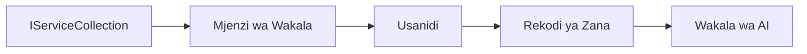

# 🎨 Mifumo ya Muundo wa Wakala na Azure OpenAI (Responses API) (.NET)

## 📋 Malengo ya Kujifunza

Mfano huu unaonyesha mifumo ya muundo ya daraja la biashara kwa ajili ya kujenga mawakala wa akili kwa kutumia Microsoft Agent Framework katika .NET pamoja na ushirikiano wa Azure OpenAI (Responses API). Utajifunza mifumo ya kitaalamu na mbinu za usanifu zinazowafanya mawakala wawe tayari kuzalishwa, rahisi kudumishwa, na wanaoweza kupanuka.

### Mifumo ya Muundo wa Biashara

- 🏭 **Mfumo wa Kiwanda (Factory Pattern)**: Utengenezaji wa wakala uliopangwa kwa kutumia injection ya utegemezi
- 🔧 **Mfumo wa Mjengaji (Builder Pattern)**: Usanidi na maandalizi ya wakala kwa mtiririko mzuri
- 🧵 **Mifumo Salama kwa Thread (Thread-Safe Patterns)**: Usimamizi wa mazungumzo yanayofanyika sambamba
- 📋 **Mfumo wa Hifadhi (Repository Pattern)**: Usimamizi wa zana na uwezo uliopangwa

## 🎯 Faida Maalum za Usanifu wa .NET

### Sifa za Biashara

- **Ubandishaji Mkali (Strong Typing)**: Uthibitishaji wakati wa kuunda na msaada wa IntelliSense
- **Injection ya Utegemezi (Dependency Injection)**: Ushirikiano wa kontena wa DI uliyojengwa ndani
- **Usimamizi wa Usanidi (Configuration Management)**: Mfumo wa IConfiguration na mifumo ya Chaguzi
- **Async/Await**: Msaada wa kiwango cha kwanza kwa programu zisizozuia

### Mifumo Tayari kwa Uzalishaji

- **Ushirikiano wa Uingiliaji wa Kumbukumbu (Logging Integration)**: ILogger na msaada wa kumbukumbu iliyoandaliwa
- **Ukaguzi wa Afya (Health Checks)**: Ufuatiliaji na uchunguzi uliomo ndani
- **Uthibitishaji wa Usanidi (Configuration Validation)**: Ubandishaji mkali kwa alama za data
- **Usimamizi wa Makosa (Error Handling)**: Usimamizi wa makosa uliopangwa

## 🔧 Usanifu wa Kiufundi

### Sehemu Muhimu za .NET

- **Microsoft.Extensions.AI**: Uwakilishaji wa huduma za AI zilizo kwenye mstari mmoja
- **Microsoft.Agents.AI**: Mfumo wa kuendesha mawakala wa biashara
- **Azure OpenAI (Responses API)**: Mifumo ya mteja wa API yenye utendaji wa juu
- **Mfumo wa Usanidi**: appsettings.json na ushirikiano wa mazingira

### Utekelezaji wa Mfumo wa Muundo



## 🏗️ Mifumo ya Biashara Imeonyeshwa

### 1. **Mifumo ya Uundaji**

- **Kiwanda cha Wakala (Agent Factory)**: Utengenezaji wa wakala uliowekwa katikati na usanidi thabiti
- **Mfumo wa Mjengaji (Builder Pattern)**: API yenye mtiririko mzuri wa usanidi wa wakala tata
- **Mfumo wa Singleton**: Usimamizi wa rasilimali na usanidi ulioshirikiwa
- **Injection ya Utegemezi (Dependency Injection)**: Kuunganishwa kwa nguvu kidogo na upimaji

### 2. **Mifumo ya Tabia**

- **Mfumo wa Mkakati (Strategy Pattern)**: Mikakati inayoweza kubadilishwa ya utekelezaji wa zana
- **Mfumo wa Amri (Command Pattern)**: Operesheni za wakala zilizofungirwa na undo/redo
- **Mfumo wa Msimamizi (Observer Pattern)**: Usimamizi wa maisha ya wakala unaoendeshwa na matukio
- **Njia ya Mfano (Template Method)**: Mikondo ya kazi ya utekelezaji wa wakala uliopangwa

### 3. **Mifumo ya Kimuundo**

- **Mfumo wa Adapter**: Tabaka la ushirikiano la Azure OpenAI (Responses API)
- **Mfumo wa Decorator**: Kuongeza uwezo wa wakala
- **Mfumo wa Facade**: Interfaces rahisi za mwingiliano wa wakala
- **Mfumo wa Proxy**: Kupakia kwa uvivu na caching kwa utendaji

## 📚 Kanuni za Muundo za .NET

### Kanuni za SOLID

- **Ujawabu Mmoja (Single Responsibility)**: Kila sehemu ina kusudi moja wazi
- **Wazi/Kufungwa (Open/Closed)**: Inaweza kupanuliwa bila kubadilishwa
- **Ubadilishaji wa Liskov (Liskov Substitution)**: Utekelezaji wa zana msingi wa interface
- **Ugawaji wa Interface (Interface Segregation)**: Interfaces zilizoelekezwa na zinazojumuisha
- **Kugeuza Utegemezi (Dependency Inversion)**: Tegemea abstraction, si utekelezaji halisi

### Usanifu Safi (Clean Architecture)

- **Tabaka la Domain**: Abstraction za msingi wa wakala na zana
- **Tabaka la Programu (Application Layer)**: Uratibu wa wakala na mikondo ya kazi
- **Tabaka la Miundombinu**: Ushirikiano wa Azure OpenAI (Responses API) na huduma za nje
- **Tabaka la Uwasilishaji**: Mwingiliano wa mtumiaji na upangaji wa majibu

## 🔒 Mambo ya Kuzingatia Biashara

### Usalama

- **Usimamizi wa Cheti**: Kushughulikia kwa usalama funguo za API kwa IConfiguration
- **Uthibitishaji wa Ingizo**: Ubandishaji mkali na uthibitishaji wa alama za data
- **Usafi wa Matokeo**: Usindikaji na kuchuja majibu kwa usalama
- **Kumbukumbu za Ukaguzi**: Ufuatiliaji wa kina wa operesheni

### Utendaji

- **Mifumo isiyo Zuia (Async Patterns)**: Operesheni za I/O zisizozuia
- **Uchimbaji wa Uunganisho (Connection Pooling)**: Usimamizi wa mteja wa HTTP kwa ufanisi
- **Kuhifadhiwa kwa Majibu (Caching)**: Kuhifadhi majibu kwa utendaji ulioboreshwa
- **Usimamizi wa Rasilimali**: Kutupa na kusafisha kwa mifumo sahihi

### Kupanuka

- **Usalama kwa Thread (Thread Safety)**: Msaada wa utekelezaji wa wakala sambamba
- **Uchimbaji wa Rasilimali (Resource Pooling)**: Matumizi bora ya rasilimali
- **Usimamizi wa Mzigo (Load Management)**: Kuzuia viwango na kushughulikia msukumo
- **Ufuatiliaji**: Vipimo vya utendaji na ukaguzi wa afya

## 🚀 Utekelezaji wa Uzalishaji

- **Usimamizi wa Usanidi**: Mipangilio maalum ya mazingira
- **Mkakati wa Kumbukumbu**: Kumbukumbu iliyoandaliwa na vitambulisho vya uhusiano
- **Usimamizi wa Makosa**: Usimamizi wa makosa ya duniani yote na uponyaji sahihi
- **Ufuatiliaji**: Maoni ya programu na vipimo vya utendaji
- **Ujaribu**: Vipimo vya vitengo, vipimo vya ushirikiano, na mifumo ya vipimo vya mzigo

Tayari kujenga mawakala wa akili wa kiwango cha biashara na .NET? Hebu tuanze kuunda kitu imara! 🏢✨

## 🚀 Kuanzia

### Mahitaji ya Awali

- [SDK ya .NET 10](https://dotnet.microsoft.com/download/dotnet/10.0) au zaidi
- Mkataba wa [Azure](https://azure.microsoft.com/free/) wenye rasilimali ya Azure OpenAI na usambazaji wa mfano
- CLI ya [Azure](https://learn.microsoft.com/cli/azure/install-azure-cli) — ingia kwa kutumia `az login`

### Mabadiliko ya Mazingira Yanayohitajika

```bash
# zsh/bash
export AZURE_OPENAI_ENDPOINT=https://<your-resource>.openai.azure.com
export AZURE_OPENAI_DEPLOYMENT=gpt-5-mini
# Kisha ingia ili AzureCliCredential ipate tokeni
az login
```

```powershell
# PowerShell
$env:AZURE_OPENAI_ENDPOINT = "https://<your-resource>.openai.azure.com"
$env:AZURE_OPENAI_DEPLOYMENT = "gpt-5-mini"
# Kisha ingia ili AzureCliCredential iweze kupata tokeni
az login
```

### Mfano wa Msimbo

Ili kuendesha mfano wa msimbo,

```bash
# zsh/bash
chmod +x ./03-dotnet-agent-framework.cs
./03-dotnet-agent-framework.cs
```

Au tumia CLI ya dotnet:

```bash
dotnet run ./03-dotnet-agent-framework.cs
```

Angalia [`03-dotnet-agent-framework.cs`](../../../../03-agentic-design-patterns/code_samples/03-dotnet-agent-framework.cs) kwa msimbo kamili.

```csharp
#!/usr/bin/dotnet run

#:package Microsoft.Extensions.AI@10.*
#:package Microsoft.Agents.AI.OpenAI@1.*-*
#:package Azure.AI.OpenAI@2.1.0
#:package Azure.Identity@1.13.1

using System.ComponentModel;

using Microsoft.Agents.AI;
using Microsoft.Extensions.AI;

using Azure.AI.OpenAI;
using Azure.Identity;

// Tool Function: Random Destination Generator
// This static method will be available to the agent as a callable tool
// The [Description] attribute helps the AI understand when to use this function
// This demonstrates how to create custom tools for AI agents
[Description("Provides a random vacation destination.")]
static string GetRandomDestination()
{
    // List of popular vacation destinations around the world
    // The agent will randomly select from these options
    var destinations = new List<string>
    {
        "Paris, France",
        "Tokyo, Japan",
        "New York City, USA",
        "Sydney, Australia",
        "Rome, Italy",
        "Barcelona, Spain",
        "Cape Town, South Africa",
        "Rio de Janeiro, Brazil",
        "Bangkok, Thailand",
        "Vancouver, Canada"
    };

    // Generate random index and return selected destination
    // Uses System.Random for simple random selection
    var random = new Random();
    int index = random.Next(destinations.Count);
    return destinations[index];
}

// Azure OpenAI with the Responses API (stable v1 endpoint). Sign in with `az login`.
var azureEndpoint = Environment.GetEnvironmentVariable("AZURE_OPENAI_ENDPOINT")
    ?? throw new InvalidOperationException("AZURE_OPENAI_ENDPOINT is not set.");
var deployment = Environment.GetEnvironmentVariable("AZURE_OPENAI_DEPLOYMENT") ?? "gpt-5-mini";

var azureClient = new AzureOpenAIClient(new Uri(azureEndpoint), new AzureCliCredential());

// Define Agent Identity and Comprehensive Instructions
// Agent name for identification and logging purposes
var AGENT_NAME = "TravelAgent";

// Detailed instructions that define the agent's personality, capabilities, and behavior
// This system prompt shapes how the agent responds and interacts with users
var AGENT_INSTRUCTIONS = """
You are a helpful AI Agent that can help plan vacations for customers.

Important: When users specify a destination, always plan for that location. Only suggest random destinations when the user hasn't specified a preference.

When the conversation begins, introduce yourself with this message:
"Hello! I'm your TravelAgent assistant. I can help plan vacations and suggest interesting destinations for you. Here are some things you can ask me:
1. Plan a day trip to a specific location
2. Suggest a random vacation destination
3. Find destinations with specific features (beaches, mountains, historical sites, etc.)
4. Plan an alternative trip if you don't like my first suggestion

What kind of trip would you like me to help you plan today?"

Always prioritize user preferences. If they mention a specific destination like "Bali" or "Paris," focus your planning on that location rather than suggesting alternatives.
""";

// Create AI Agent with Advanced Travel Planning Capabilities
// Get the Responses client for the deployment and create the AI agent
// Configure agent with name, detailed instructions, and available tools
// This demonstrates the .NET agent creation pattern with full configuration
AIAgent agent = azureClient
    .GetChatClient(deployment)
    .AsAIAgent(
        name: AGENT_NAME,
        instructions: AGENT_INSTRUCTIONS,
        tools: [AIFunctionFactory.Create(GetRandomDestination)]
    );

// Create New Conversation Session for Context Management
// Initialize a new conversation session to maintain context across multiple interactions
// Sessions enable the agent to remember previous exchanges and maintain conversational state
// This is essential for multi-turn conversations and contextual understanding
var session = await agent.CreateSessionAsync();

// Execute Agent: First Travel Planning Request
// Run the agent with an initial request that will likely trigger the random destination tool
// The agent will analyze the request, use the GetRandomDestination tool, and create an itinerary
// Using the session parameter maintains conversation context for subsequent interactions
await foreach (var update in agent.RunStreamingAsync("Plan me a day trip", session))
{
    await Task.Delay(10);
    Console.Write(update);
}

Console.WriteLine();

// Execute Agent: Follow-up Request with Context Awareness
// Demonstrate contextual conversation by referencing the previous response
// The agent remembers the previous destination suggestion and will provide an alternative
// This showcases the power of conversation sessions and contextual understanding in .NET agents
await foreach (var update in agent.RunStreamingAsync("I don't like that destination. Plan me another vacation.", session))
{
    await Task.Delay(10);
    Console.Write(update);
}
```

---

<!-- CO-OP TRANSLATOR DISCLAIMER START -->
**Kionyozo**:
Hati hii imetafsiriwa kwa kutumia huduma ya tafsiri ya AI [Co-op Translator](https://github.com/Azure/co-op-translator). Ingawa tunajitahidi kupata usahihi, tafadhali fahamu kwamba tafsiri za kiotomatiki zinaweza kuwa na makosa au upungufu wa usahihi. Hati ya asili katika lugha yake halisi inapaswa kuchukuliwa kama chanzo cha mamlaka. Kwa taarifa muhimu, tafsiri ya kitaalamu inayofanywa na binadamu inapendekezwa. Hatutojibu kwa kuelewa vibaya au tafsiri potofu zinazotokea kutokana na matumizi ya tafsiri hii.
<!-- CO-OP TRANSLATOR DISCLAIMER END -->