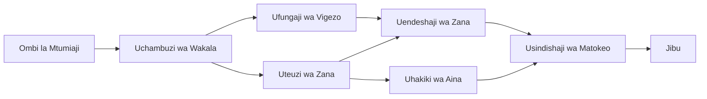

# 🛠️ Matumizi ya Zana Zinazoendelea na Azure OpenAI (API ya Majibu) (.NET)

## 📋 Malengo ya Kujifunza

Daftari hili linaonyesha mifumo ya ujumuishaji wa zana za daraja la biashara kwa kutumia Mfumo wa Wakala wa Microsoft katika .NET na Azure OpenAI (API ya Majibu). Utajifunza kujenga mawakala mahiri wenye zana nyingi maalum, ukitumia aina kali za C# na sifa za biashara za .NET.

### Uwezo wa Zana Zinazoendelea Utazizawadia

- 🔧 **Mimaaruba ya Zana Nyingi**: Kujenga mawakala wenye uwezo maalum mbalimbali
- 🎯 **Utendaji wa Zana Uliye Salama kwa Aina**: Kutumia uthibitishaji wa wakati wa kompyuta wa C#
- 📊 **Mifumo ya Zana za Biashara**: Ubunifu wa zana zinazotumika kwa uzalishaji na usimamizi wa makosa
- 🔗 **Muundo wa Zana**: Kuchanganya zana kwa ajili ya mtiririko tata wa biashara

## 🎯 Manufaa ya Mimaaruba ya Zana za .NET

### Sifa za Zana za Biashara

- **Uthibitishaji wa Wakati wa Kuunganisha**: Aina kali kuhakikisha usahihi wa vigezo vya zana
- **Uingizaji wa Tegemezi**: Ujumuishaji wa kontena ya IoC kwa usimamizi wa zana
- **Mifumo ya Async/Await**: Utendaji wa zana usiozuia kwa usimamizi mzuri wa rasilimali
- **Ufuatiliaji wa Kuraalishe**: Ujumuishaji wa ufuatiliaji wa uendeshaji wa zana

### Mifumo Tayari kwa Uzalishaji

- **Usimamizi wa Makosa**: Usimamizi kamili wa makosa yenye aina maalum
- **Usimamizi wa Rasilimali**: Mifumo sahihi ya utupa na usimamizi wa kumbukumbu
- **Ufuatiliaji wa Utendaji**: Vipimo na majumuisho ya utendaji yaliyojumuishwa
- **Usimamizi wa Mipangilio**: Mipangilio inayolindwa kwa aina na uthibitishaji

## 🔧 Mimaaruba ya Kiufundi

### Vipengele Muhimu vya Zana za .NET

- **Microsoft.Extensions.AI**: Tabaka la upendeleo la zana linalounganisha
- **Microsoft.Agents.AI**: Uendeshaji wa zana kwa daraja la biashara
- **Azure OpenAI (API ya Majibu)**: Mteja wa API mwenye utendaji wa juu na usimamizi wa muunganisho

### Mlolongo wa Utendaji wa Zana



## 🛠️ Makundi na Mifumo ya Zana

### 1. **Zana za Usindikaji Data**

- **Uthibitishaji wa Ingizo**: Aina kali pamoja na maelezo ya data
- **Uendeshaji wa Mabadiliko**: Ubadilishaji wa data salama kwa aina na uundaji
- **Mantiki ya Biashara**: Zana za mahesabu na uchambuzi maalum kwa uwanja
- **Uundaji wa Matokeo**: Uzalishaji wa majibu yenye muundo

### 2. **Zana za Ujumlishaji**

- **Vianzilishi vya API**: Ujumuishaji wa huduma za RESTful na HttpClient
- **Zana za Hifadhidata**: Ujumuishaji wa Entity Framework kwa upatikanaji wa data
- **Uendeshaji wa Faili**: Uendeshaji salama wa mfumo wa faili na uthibitishaji
- **Huduma za Nje**: Mifumo ya ujumuishaji wa huduma za pande tatu

### 3. **Zana za Huduma za Msingi**

- **Usindikaji wa Nyaraka**: Zana za utunzaji na uundaji maandishi
- **Uendeshaji wa Tarehe/Nakala**: Maambo ya tarehe/nyakati yenye utambuzi wa tamaduni
- **Zana za Hisabati**: Mahesabu sahihi na shughuli za takwimu
- **Zana za Uthibitishaji**: Uthibitishaji wa sheria za biashara na uhakikisho wa data

Tayari kujenga mawakala wa daraja la biashara wenye uwezo mkubwa, ulio salama kwa aina katika .NET? Chukua hatua za kusanifu suluhisho za kitaalamu! 🏢⚡

## 🚀 Kuanzia

### Mahitaji ya Awali

- [SDK ya .NET 10](https://dotnet.microsoft.com/download/dotnet/10.0) au zaidi
- Usajili wa [Azure](https://azure.microsoft.com/free/) wenye rasilimali ya Azure OpenAI na usambazaji wa mfano
- [Azure CLI](https://learn.microsoft.com/cli/azure/install-azure-cli) — ingia na `az login`

### Mabadiliko ya Mazingira Yanayohitajika

```bash
# zsh/bash
export AZURE_OPENAI_ENDPOINT=https://<your-resource>.openai.azure.com
export AZURE_OPENAI_DEPLOYMENT=gpt-4.1-mini
# Kisha ingia ili AzureCliCredential ipate tokeni
az login
```

```powershell
# PowerShell
$env:AZURE_OPENAI_ENDPOINT = "https://<your-resource>.openai.azure.com"
$env:AZURE_OPENAI_DEPLOYMENT = "gpt-4.1-mini"
# Kisha ingia ili AzureCliCredential iweze kupata tokeni
az login
```

### Mfano wa Msimbo

Ili kuendesha mfano wa msimbo,

```bash
# zsh/bash
chmod +x ./04-dotnet-agent-framework.cs
./04-dotnet-agent-framework.cs
```

Au kwa kutumia dotnet CLI:

```bash
dotnet run ./04-dotnet-agent-framework.cs
```

Angalia [`04-dotnet-agent-framework.cs`](../../../../04-tool-use/code_samples/04-dotnet-agent-framework.cs) kwa msimbo kamili.

```csharp
#!/usr/bin/dotnet run

#:package Microsoft.Extensions.AI@10.*
#:package Microsoft.Agents.AI.OpenAI@1.*-*
#:package Azure.AI.OpenAI@2.1.0
#:package Azure.Identity@1.13.1

using System.ComponentModel;

using Microsoft.Agents.AI;
using Microsoft.Extensions.AI;

using Azure.AI.OpenAI;
using Azure.Identity;

// Tool Function: Random Destination Generator
// This static method will be available to the agent as a callable tool
// The [Description] attribute helps the AI understand when to use this function
// This demonstrates how to create custom tools for AI agents
[Description("Provides a random vacation destination.")]
static string GetRandomDestination()
{
    // List of popular vacation destinations around the world
    // The agent will randomly select from these options
    var destinations = new List<string>
    {
        "Paris, France",
        "Tokyo, Japan",
        "New York City, USA",
        "Sydney, Australia",
        "Rome, Italy",
        "Barcelona, Spain",
        "Cape Town, South Africa",
        "Rio de Janeiro, Brazil",
        "Bangkok, Thailand",
        "Vancouver, Canada"
    };

    // Generate random index and return selected destination
    // Uses System.Random for simple random selection
    var random = new Random();
    int index = random.Next(destinations.Count);
    return destinations[index];
}

// Azure OpenAI with the Responses API (stable v1 endpoint). Sign in with `az login`.
var azureEndpoint = Environment.GetEnvironmentVariable("AZURE_OPENAI_ENDPOINT")
    ?? throw new InvalidOperationException("AZURE_OPENAI_ENDPOINT is not set.");
var deployment = Environment.GetEnvironmentVariable("AZURE_OPENAI_DEPLOYMENT") ?? "gpt-4.1-mini";

var azureClient = new AzureOpenAIClient(new Uri(azureEndpoint), new AzureCliCredential());

// Define Agent Identity and Comprehensive Instructions
// Agent name for identification and logging purposes
var AGENT_NAME = "TravelAgent";

// Detailed instructions that define the agent's personality, capabilities, and behavior
// This system prompt shapes how the agent responds and interacts with users
var AGENT_INSTRUCTIONS = """
You are a helpful AI Agent that can help plan vacations for customers.

Important: When users specify a destination, always plan for that location. Only suggest random destinations when the user hasn't specified a preference.

When the conversation begins, introduce yourself with this message:
"Hello! I'm your TravelAgent assistant. I can help plan vacations and suggest interesting destinations for you. Here are some things you can ask me:
1. Plan a day trip to a specific location
2. Suggest a random vacation destination
3. Find destinations with specific features (beaches, mountains, historical sites, etc.)
4. Plan an alternative trip if you don't like my first suggestion

What kind of trip would you like me to help you plan today?"

Always prioritize user preferences. If they mention a specific destination like "Bali" or "Paris," focus your planning on that location rather than suggesting alternatives.
""";

// Create AI Agent with Advanced Travel Planning Capabilities
// Get the Responses client for the deployment and create the AI agent
// Configure agent with name, detailed instructions, and available tools
// This demonstrates the .NET agent creation pattern with full configuration
AIAgent agent = azureClient
    .GetChatClient(deployment)
    .AsAIAgent(
        name: AGENT_NAME,
        instructions: AGENT_INSTRUCTIONS,
        tools: [AIFunctionFactory.Create(GetRandomDestination)]
    );

// Create New Conversation Session for Context Management
// Initialize a new conversation session to maintain context across multiple interactions
// Sessions enable the agent to remember previous exchanges and maintain conversational state
// This is essential for multi-turn conversations and contextual understanding
await using var session = await agent.CreateSessionAsync();

// Execute Agent: First Travel Planning Request
// Run the agent with an initial request that will likely trigger the random destination tool
// The agent will analyze the request, use the GetRandomDestination tool, and create an itinerary
// Using the session parameter maintains conversation context for subsequent interactions
await foreach (var update in agent.RunStreamingAsync("Plan me a day trip", session))
{
    await Task.Delay(10);
    Console.Write(update);
}

Console.WriteLine();

// Execute Agent: Follow-up Request with Context Awareness
// Demonstrate contextual conversation by referencing the previous response
// The agent remembers the previous destination suggestion and will provide an alternative
// This showcases the power of conversation sessions and contextual understanding in .NET agents
await foreach (var update in agent.RunStreamingAsync("I don't like that destination. Plan me another vacation.", session))
{
    await Task.Delay(10);
    Console.Write(update);
}
```

---

<!-- CO-OP TRANSLATOR DISCLAIMER START -->
**Kionyozo**:
Hati hii imetafsiriwa kwa kutumia huduma ya tafsiri ya AI [Co-op Translator](https://github.com/Azure/co-op-translator). Ingawa tunajitahidi kupata usahihi, tafadhali fahamu kwamba tafsiri za kiotomatiki zinaweza kuwa na makosa au upungufu wa usahihi. Hati ya asili katika lugha yake halisi inapaswa kuchukuliwa kama chanzo cha mamlaka. Kwa taarifa muhimu, tafsiri ya kitaalamu inayofanywa na binadamu inapendekezwa. Hatutojibu kwa kuelewa vibaya au tafsiri potofu zinazotokea kutokana na matumizi ya tafsiri hii.
<!-- CO-OP TRANSLATOR DISCLAIMER END -->