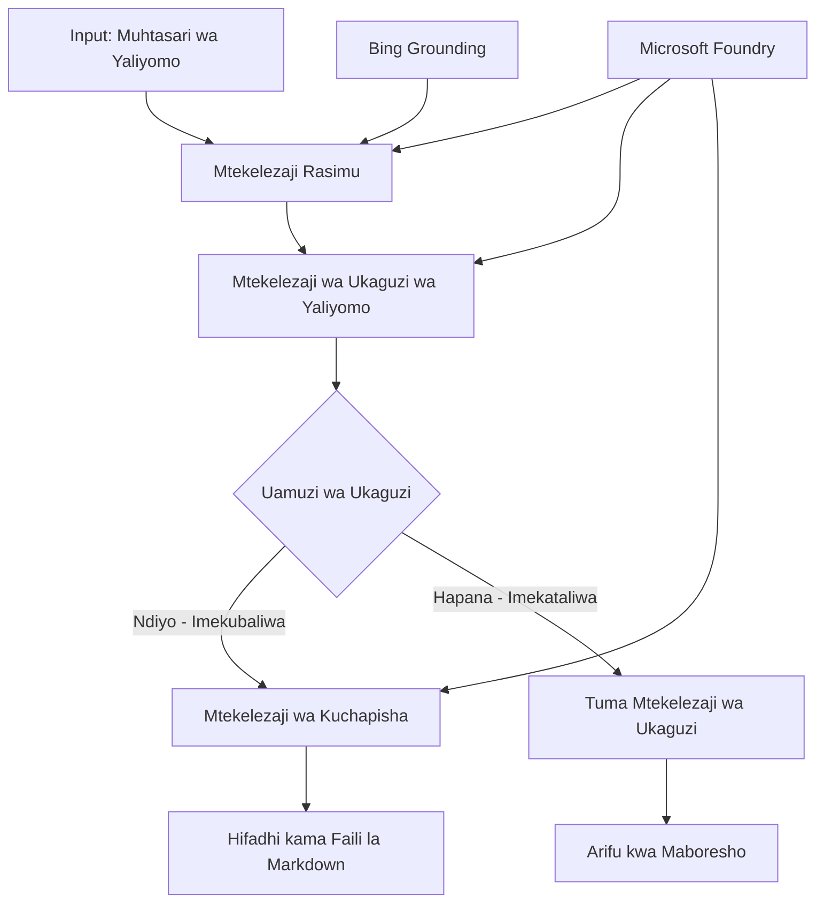

# 🔀 Mashirika ya Wakala wa Masharti na Microsoft Foundry (.NET)

## 📋 Mafunzo ya Mtiririko wa Kazi wa Uamuzi Mwenye Akili

Kitabu hiki cha maelezo kinaonyesha **mifumo ya mtiririko wa kazi ya masharti** kwa kutumia Microsoft Foundry na Mfumo wa Wakala wa Microsoft kwa .NET. Utajifunza jinsi ya kujenga mitiririko ya kazi tata, inayotegemea uamuzi, ambayo inaelekeza mchakato kwa akili kulingana na uchambuzi wa AI, sheria za biashara, na masharti yanayotegemea hali kwa uendeshaji wa kiwango cha biashara.

## 🎯 Malengo ya Kujifunza

### 🧠 **Mimari ya Uamuzi Mwenye Akili**
- **Utekelezaji wa Mantiki ya Masharti**: Jenga miti ya uamuzi tata yenye sehemu nyingi za matawi
- **Uelekezaji Unaotegemea AI**: Tumia mifano ya Microsoft Foundry kufanya maamuzi ya uelekezaji mwenye akili
- **Ubadilishaji wa Mtiririko wa Kazi unaobadilika**: Badilisha tabia ya mtiririko wa kazi kulingana na uchambuzi na masharti wakati wa utekelezaji
- **Muunganisho wa Sheria za Biashara**: Jumuisha mantiki za biashara na mahitaji ya utii katika mitiririko ya kazi

### 🔀 **Mifumo ya Masharti ya Juu**
- **Uamuzi wa Kigezo Mingi**: Tathmini sababu nyingi kwa ajili ya maamuzi ya uelekezaji
- **Usindikaji Unaotegemea Muktadha**: Fanya maamuzi kulingana na muktadha wa mtiririko wa kazi uliokusanywa na historia
- **Ubadilishaji wa Mtiririko wa Kazi unaobadilika**: Rekebisha njia za usindikaji kulingana na masharti ya wakati halisi
- **Muunganisho wa Injini ya Sheria**: Tekeleza injini za sheria za biashara tata ndani ya mitiririko ya kazi

### 🏢 **Maombi ya Masharti ya Biashara**
- **Uainishaji wa Nyaraka na Uelekezaji**: Panga moja kwa moja na elekeza nyaraka kwenye mitiririko sahihi ya kazi
- **Triage ya Huduma kwa Wateja**: Uelekezaji wenye akili wa maswali ya wateja kwa timu maalum za kushughulikia
- **Usindikaji wa Utii na Hatari**: Tumia michakato tofauti ya uthibitisho na ukaguzi kulingana na tathmini ya hatari
- **Mitiririko ya Uhakikisho wa Ubora**: Elekeza yaliyomo kupitia michakato sahihi ya ukaguzi kulingana na vipimo vya ubora

## ⚙️ Mahitaji ya Msingi na Usanidi

### 📦 **Pakiti zinazohitajika za NuGet**

Pakiti za hali ya juu kwa usindikaji wa mtiririko wa kazi wa masharti:

```xml
<!-- Core AI Framework -->
<PackageReference Include="Microsoft.Extensions.AI" Version="9.9.0" />

<!-- Azure AI Agents with Persistent State -->
<PackageReference Include="Azure.AI.Agents.Persistent" Version="1.2.0-beta.5" />

<!-- Azure Identity and Utilities -->
<PackageReference Include="Azure.Identity" Version="1.15.0" />
<PackageReference Include="System.Linq.Async" Version="6.0.3" />
<PackageReference Include="DotNetEnv" Version="3.1.1" />

<!-- Local Workflow Framework References -->
<!-- Microsoft.Agents.Workflows.dll - Advanced workflow orchestration -->
<!-- Microsoft.Agents.AI.AzureAI.dll - Microsoft Foundry integration -->
<!-- Microsoft.Agents.AI.dll - Core agent abstractions -->
```

### 🔑 **Usanidi wa Microsoft Foundry**

**Rasilimali za Azure Zinazohitajika:**
- Eneo la kazi la Microsoft Foundry lenye mifano ya usindikaji wa masharti
- Usajili wa Azure wenye viwango vya kompyuta na ruhusa zinazofaa
- Mifano ya AI iliyowekwa kwa ajili ya kufanya maamuzi na uchambuzi wa yaliyomo
- (Hiari) Muunganisho wa API ya Bing Search kwa uwezo wa kuthibitisha taarifa

**Usanidi wa Mazingira (faili la .env):**
```env
# Microsoft Foundry Configuration
AZURE_AI_PROJECT_ENDPOINT=https://your-project.cognitiveservices.azure.com/
BING_CONNECTION_ID=your-bing-connection-id
```

**Usanidi wa Uthibitishaji:**
```csharp
// Azure CLI or Managed Identity authentication
using Azure.Identity;
var credential = new AzureCliCredential();

// Load environment configuration
DotNetEnv.Env.Load("../../../.env");
```

### 🏗️ **Mimari ya Mtiririko wa Kazi wa Masharti**



**Vitu Muhimu:**
- **Mtekelezaji wa Rasimu**: Wakala wa AI anayefanya rasimu za awali kutoka kwa muhtasari
- **Mtekelezaji wa Ukaguzi wa Yaliyomo**: Wakala wa AI anayetathmini ubora na utii wa rasimu
- **Uelekezaji wa Masharti**: Mantiki ya maamuzi inayoelekeza kulingana na matokeo ya ukaguzi
- **Njia za Kuchapisha/Ukaguzi**: Njia tofauti za usindikaji kwa yaliyothibitishwa dhidi ya yaliyokataa
- **Usimamizi wa Hali**: Huhifadhi muktadha wa yaliyomo na ukaguzi katika mtiririko wa kazi wote

## 🎨 **Mifumo ya Ubunifu wa Mtiririko wa Kazi wa Masharti**

### 📋 **Uzalishaji wa Yaliyomo kwa Milango ya Ubora**
```
Outline → Draft Creation → Quality Review → {Approve: Publish | Reject: Revise}
```

### 🎯 **Usindikaji wa Nyaraka unaotegemea Hatari**
```
Document → Risk Assessment → {Low: Standard | High: Enhanced Review}
```

### 🔍 **Uelekezaji wenye Akili wa Huduma kwa Wateja**
```
Customer Query → Analysis → {Simple: FAQ Bot | Complex: Human Agent}
```

### 💼 **Mitiririko Inayotegemea Utii**
```
Content → Compliance Check → {Pass: Publish | Fail: Legal Review}
```

## 🏢 **Manufaa ya Masharti ya Biashara**

### 🎯 **Uendeshaji Mwenye Akili**
- **Uamuzi Mwerevu**: Maamuzi ya uelekezaji yanayotokana na uchambuzi wa yaliyomo na muktadha kwa kutumia AI
- **Usindikaji unaobadilika**: Mitiririko ya kazi inayojirekebisha kiotomatiki kulingana na mabadiliko ya hali
- **Utekelezaji wa Sheria za Biashara**: Matumizi ya moja kwa moja ya mantiki tata ya biashara na sera
- **Uelekeaji Unaotegemea Muktadha**: Maamuzi yanayotokana na historia kamili ya mtiririko wa kazi na muktadha uliokusanywa

### 📈 **Ufanisi wa Uendeshaji**
- **Ugawaji Rasilimali Ulioboreshwa**: Elekeza kazi kwa wataalamu na michakato inayofaa zaidi
- **Kupunguzwa kwa Msaada wa Mikono**: Uamuzi wa moja kwa moja hupunguza hitaji la uelekezaji wa binadamu
- **Nyakati za Ufumbuzi Haraka**: Uelekeaji wa moja kwa moja kwa utaalamu na uwezo wa usindikaji unaohitajika
- **Matumizi Yenye Mwelekeo Moja**: Matumizi ya kawaida ya sheria za biashara na vigezo vya uamuzi

### 🛡️ **Usimamizi wa Hatari na Utii**
- **Tathmini ya Hatari kwa Moja kwa Moja**: Tathmini ya AI ya viwango vya hatari vya yaliyomo na hali
- **Utekelezaji wa Utii**: Uelekezaji wa moja kwa moja kupitia michakato ya kitabibu
- **Matumizi ya Itifaki za Usalama**: Hatua za usalama zilizoboreshwa kulingana na tathmini ya hatari
- **Utunzaji wa Rekodi za Ukaguzi**: Nyaraka kamili za maamuzi ya uelekezaji na sababu zake

### 📊 **Uchambuzi na Maboresho Endelevu**
- **Uchambuzi wa Maamuzi**: Fuatilia ufanisi na usahihi wa maamuzi ya uelekezaji
- **Utambuzi wa Mifumo**: Tambua mwelekeo na mifumo katika maamuzi ya uelekezaji kwa muda
- **Uboreshaji wa Utendaji**: Maboresho endelevu ya vigezo vya uamuzi na ufanisi wa uelekezaji
- **Akili ya Biashara**: Maarifa kuhusu sifa za yaliyomo na mahitaji ya usindikaji

### 🔧 **Ubora wa Kiufundi**
- **Usimamizi Endelevu wa Hali**: Hifadhi hali tata katika utekelezaji wa mtiririko wa kazi
- **Mimari Inayoweza Kupanuka**: Shughulikia mahitaji ya usindikaji wa masharti wa kiasi kikubwa
- **Uwezo wa Muunganisho**: Muunganisho usiotatiza na mifumo na michakato ya biashara iliyopo
- **Ufuatiliaji na Uwezo wa Kuonekana**: Ufuatiliaji kamili wa utendaji wa mtiririko wa kazi na maamuzi

Hebu tujenge mitiririko ya kazi ya biashara yenye akili, inayoendeshwa na maamuzi na .NET! 🚀

## 💻 Kukimbia Msimbo

Utekelezaji kamili upo katika `04.dotnet-agent-framework-workflow-aifoundry-condition.cs`. Huu unaonyesha **mtiririko wa kazi wa uzalishaji wa yaliyomo kwa milango ya ubora**:

### 🏗️ **Mimari ya Mtiririko wa Kazi**

```
Content Outline → Draft Creation → Quality Review → Conditional Routing:
                                                      ├─ Approved (>200 words) → Publish
                                                      └─ Rejected (<200 words) → Review Notification
```

**Wakala katika Mtiririko wa Kazi:**
1. **Wakala Mhubiri**: Huunda rasimu za mafunzo kutoka kwa muhtasari kwa kutumia ulinzi wa Bing
2. **Wakala Mhakiki wa Yaliyomo**: Huwakilisha ubora wa rasimu (idadi ya maneno, ukamilifu)
3. **Wakala Mchapishaji**: Huhifadhi yaliyothibitishwa kama faili za Markdown zilizo na alama ya muda

**Watekelezaji Maalum:**
1. **DraftExecutor**: Huongoza uundaji wa rasimu
2. **ContentReviewExecutor**: Hufanya tathmini ya ubora
3. **PublishExecutor**: Hutekeleza uchapishaji wa yaliyothibitishwa
4. **SendReviewExecutor**: Husimamia arifa za yaliyokataa

### 🚀 Kukimbia Mfano

**Mahitaji ya awali:**
- Eneo la kazi la Microsoft Foundry limewekwa
- Uthibitishaji wa Azure CLI (`az login`)
- (Hiari) Muunganisho wa Bing Search kwa ulinzi

```bash
# Fanya script iwe ya kutekelezwa (Unix/Linux/macOS)
chmod +x 04.dotnet-agent-framework-workflow-aifoundry-condition.cs

# Endesha mtiririko wa kazi wa masharti
./04.dotnet-agent-framework-workflow-aifoundry-condition.cs
```

Au kwenye Windows:
```powershell
dotnet run 04.dotnet-agent-framework-workflow-aifoundry-condition.cs
```

### 📝 Matokeo Yanayotarajiwa

Mtiririko wa kazi utafanya:
1. **Unda Wakala**: Anzisha mawakala watatu maalum wa Microsoft Foundry
2. **Tengeneza Rasimu**: Wakala mhubiri huunda rasimu ya mafunzo kutoka muhtasari
3. **Kagua Yaliyomo**: Mhakiki wa yaliyomo hutathmini ubora wa rasimu
4. **Uelekezaji wa Masharti**:
   - **Ikiidhinishwa (>200 maneno)**: Mtendaji wa uchapishaji huhifadhi kama faili la Markdown
   - **Ikiwakatiwa (<200 maneno)**: Tuma arifa za ukaguzi
5. **Onyesha Matokeo**: Onyesha matokeo ya mwisho ya mtiririko wa kazi

### 🔧 Mipangilio ya Kipekee

**Badilisha Vigezo vya Ukaguzi:**
```csharp
const string ContentReviewerInstructions = @"
You are a content reviewer...
1. Check if content is more than 500 words (instead of 200)
2. Verify technical accuracy
3. Ensure proper formatting
...";
```

**Ongeza Njia Zaidi za Masharti:**
```csharp
var workflow = new WorkflowBuilder(draftExecutor)
    .AddEdge(draftExecutor, contentReviewerExecutor)
    .AddEdge(contentReviewerExecutor, publishExecutor, condition: GetCondition("Excellent"))
    .AddEdge(contentReviewerExecutor, editExecutor, condition: GetCondition("Good"))
    .AddEdge(contentReviewerExecutor, sendReviewerExecutor, condition: GetCondition("Poor"))
    .Build();
```

**Badilisha Mahitaji ya Yaliyomo:**
```csharp
string OUTLINE_Content = @"
# Your Custom Topic
## Section 1
https://your-reference-url
## Section 2
...
";
```

### 🎯 Maombi ya Ulimwengu Halisi

Mfumo huu wa mtiririko wa masharti ni bora kwa:
- **Mifumo ya Usimamizi wa Yaliyomo**: Mitiririko ya uhariri wa moja kwa moja yenye milango ya ubora
- **Usindikaji wa Nyaraka**: Elekeza nyaraka kulingana na uainishaji na utii
- **Msaada kwa Wateja**: Uelekezaji wa tiketi wenye akili kulingana na ugumu na haraka
- **Ukaguzi wa Kisheria**: Elekeza mikataba kulingana na tathmini ya hatari na thamani
- **Mchakato wa HR**: Elekeza maombi kupitia mitiririko sahihi ya skrini

### 🔍 Kuelewa Mantiki ya Masharti

**Kazi ya Hali:**
```csharp
public Func<object?, bool> GetCondition(string expectedResult) =>
    reviewResult => reviewResult is ReviewResult review && review.Result == expectedResult;
```

Kazi hii huunda prediketi ambayo:
1. Hukagua ikiwa matokeo ni ya aina `ReviewResult`
2. Hulinganisha kipengele cha `Result` na thamani inayotarajiwa
3. Hurejea kweli/sio kweli ili kuamua uelekezaji

**Mipaka ya Mtiririko wa Kazi na Masharti:**
```csharp
.AddEdge(contentReviewerExecutor, publishExecutor, condition: GetCondition("Yes"))
.AddEdge(contentReviewerExecutor, sendReviewerExecutor, condition: GetCondition("No"))
```

### 📊 Vipengele vya Juu

**Uthibitishaji wa Skima ya JSON:**
Mtiririko wa kazi hutumia skima za JSON kuhakikisha majibu yaliyo na muundo:

```csharp
// Define response structure
public class ReviewResult
{
    [JsonPropertyName("review_result")]
    public string Result { get; set; } = string.Empty;
    
    [JsonPropertyName("reason")]
    public string Reason { get; set; } = string.Empty;
    
    [JsonPropertyName("draft_content")]
    public string DraftContent { get; set; } = string.Empty;
}

// Apply to agent
ResponseFormat = ChatResponseFormat.ForJsonSchema(
    AIJsonUtilities.CreateJsonSchema(typeof(ReviewResult)), 
    "ReviewResult", 
    "Review Result From DraftContent"
)
```

**Muunganisho wa Ulinzi wa Bing:**
Wakala mhubiri hutumia ulinzi wa Bing kupata taarifa za wakati halisi:

```csharp
var bingGroundingConfig = new BingGroundingSearchConfiguration(bing_conn_id);
BingGroundingToolDefinition bingGroundingTool = new(
    new BingGroundingSearchToolParameters([bingGroundingConfig])
);
```

Hii inamwezesha wakala kufuata URL zilizomo katika muhtasari na kupata taarifa za sasa.

### 🛡️ Ushughulikiaji wa Makosa

Mtiririko wa kazi unajumuisha usimamizi thabiti wa makosa kwa yaliyokataa:
- Maini ya ukaguzi husababisha njia mbadala
- Arifa hutoa sababu wazi za kukataa
- Yaliyomo huhifadhiwa kwa marekebisho

### 🔄 Kuongeza Mtiririko wa Kazi

**Ongeza Mzunguko wa Marekebisho:**
Unda mzunguko wa mrejesho unaozalisha rasimu upya kiotomatiki:

```csharp
.AddEdge(contentReviewerExecutor, publishExecutor, condition: GetCondition("Yes"))
.AddEdge(contentReviewerExecutor, draftExecutor, condition: GetCondition("No")) // Loop back
```

**Tekeleza Ukaguzi wa Ngazi Nyingi:**
Ongeza hatua nyingi za ukaguzi zenye vigezo tofauti:

```csharp
.AddEdge(draftExecutor, technicalReviewer)
.AddEdge(technicalReviewer, editorialReviewer, condition: GetCondition("TechPass"))
.AddEdge(editorialReviewer, publishExecutor, condition: GetCondition("EditPass"))
```

Mfumo huu wa mtiririko wa masharti unatoa msingi wa kujenga mifumo tata ya uendeshaji wa biashara yenye akili! 🚀

---

<!-- CO-OP TRANSLATOR DISCLAIMER START -->
**Kionyozo**:
Hati hii imetafsiriwa kwa kutumia huduma ya tafsiri ya AI [Co-op Translator](https://github.com/Azure/co-op-translator). Ingawa tunajitahidi kupata usahihi, tafadhali fahamu kwamba tafsiri za kiotomatiki zinaweza kuwa na makosa au upungufu wa usahihi. Hati ya asili katika lugha yake halisi inapaswa kuchukuliwa kama chanzo cha mamlaka. Kwa taarifa muhimu, tafsiri ya kitaalamu inayofanywa na binadamu inapendekezwa. Hatutojibu kwa kuelewa vibaya au tafsiri potofu zinazotokea kutokana na matumizi ya tafsiri hii.
<!-- CO-OP TRANSLATOR DISCLAIMER END -->