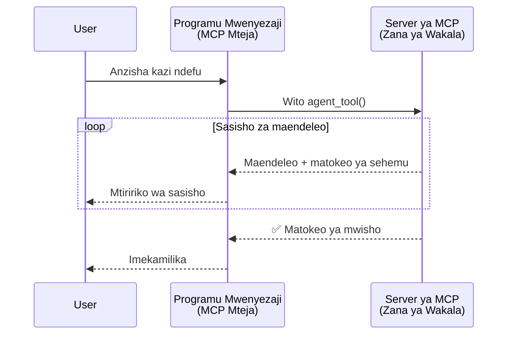
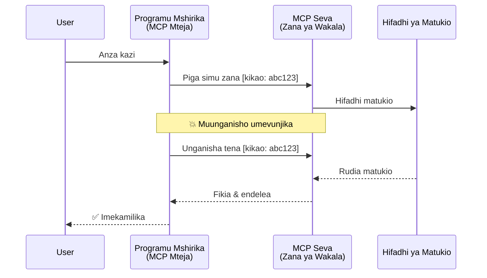
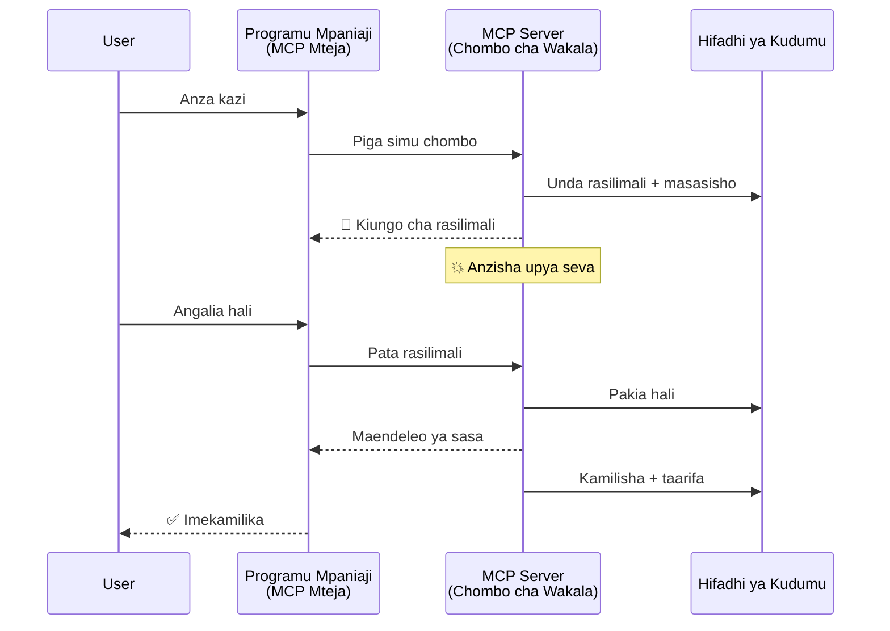
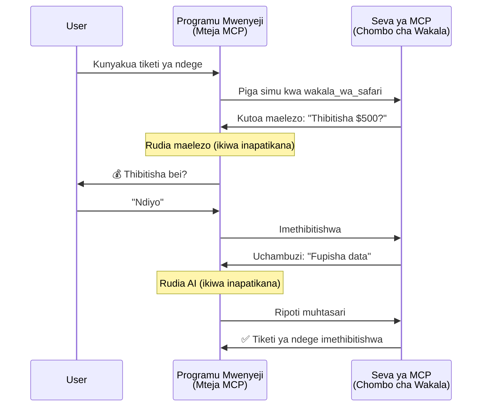
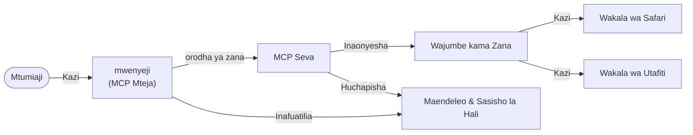

# Kujenga Mifumo ya Mawasiliano ya Mwakala kwa Mwakala kwa MCP

> TL;DR - Je, Unaweza Kujenga Mawasiliano ya Agent2Agent kwa MCP? Ndiyo!

MCP imeendelea kwa kiasi kikubwa zaidi ya lengo lake la awali la "kutoa muktadha kwa LLMs". Kwa maboresho ya hivi karibuni ikijumuisha [mito inayoweza kuendelea](https://modelcontextprotocol.io/docs/concepts/transports#resumability-and-redelivery), [kuchochea](https://modelcontextprotocol.io/specification/2025-06-18/client/elicitation), [kuchanganya](https://modelcontextprotocol.io/specification/2025-06-18/client/sampling), na arifa ([maendeleo](https://modelcontextprotocol.io/specification/2025-06-18/basic/utilities/progress) na [rasilimali](https://modelcontextprotocol.io/specification/2025-06-18/schema#resourceupdatednotification)), MCP sasa inatoa msingi thabiti wa kujenga mifumo tata ya mawasiliano ya mwakala kwa mwakala.

## Kuelewa Kosa Kuhusu Mwakala/Vifaa

Wakati wa waendelezaji wengi wanapochunguza zana zenye tabia za uwakala (kufanya kazi kwa kipindi kirefu, inaweza kuhitaji maoni zaidi katikati ya utekelezaji, n.k.), dhana inayokaribiana ni kwamba MCP haifai hasa kwa sababu mifano ya awali ya zana zake za msingi ilizingatia mifumo rahisi ya ombi-jibu.

Mtazamo huu ni wa zamani. Maelezo ya MCP yameboreshwa sana katika miezi michache iliyopita na uwezo ambao unafunika pengo la kujenga tabia za mwakala zinazofanya kazi kwa muda mrefu:

- **Utoaji wa Mito & Matokeo Sehemu**: Arifa za maendeleo kwa wakati halisi wakati wa utekelezaji
- **Uwezo wa Kuendelea**: Wateja wanaweza kuunganishwa tena na kuendelea baada ya kupoteza muunganisho
- **Uthabiti**: Matokeo hayapotei hata baada ya kuanzishwa upya kwa seva (kwa mfano, kupitia viungo vya rasilimali)
- **Mzunguko wa Mwingine**: Ingizo la mwingiliano katikati ya utekelezaji kupitia kuchochea na kuchanganya

Vipengele hivi vinaweza kuchanganywa kuweza kuanzisha programu tata za mwakala na wa wakala wengi, zote zikitumia itifaki ya MCP.

Kwa marejeleo, tutarejelea mwakala kama "kifaa" kinachopatikana kwenye seva ya MCP. Hii inaashiria kuwepo kwa programu mwenyeji inayotekeleza mteja wa MCP ambaye huanzisha kikao na seva ya MCP na anaweza kuita mwakala.

## Nini Kinafanya Kifaa cha MCP "Kiwakala"?

Kabla ya kuingia kwenye utekelezaji, hebu tuthibitishe ni uwezo gani wa miundombinu unahitajika kusaidia mawakala wanaofanya kazi kwa muda mrefu.

> Tutataja mwakala kama chombo kinachoweza kufanya kazi kwa kujitegemea kwa vipindi virefu, kinachoweza kushughulikia kazi ngumu ambazo zinaweza kuhitaji mwingiliano mingi au marekebisho kwa mujibu wa mrejesho wa wakati halisi.

### 1. Utoaji wa Mito & Matokeo Sehemu

Mifumo ya kawaida ya ombi-jibu haifanyi kazi kwa kazi zinazochukua muda mrefu. Mawakala wanahitaji kutoa:

- Arifa za maendeleo kwa wakati halisi
- Matokeo ya kati

**Msaada wa MCP**: Arifa za masasisho ya rasilimali zinaruhusu utoaji wa matokeo sehemu kwa njia ya mito, ingawa hii inahitaji muundo makini ili kuepuka migongano na mfano wa ombi/jibu wa JSON-RPC wa 1:1.

| Kipengele                  | Kesi ya Matumizi                                                                                                                                                             | Msaada wa MCP                                                                             |
| -------------------------- | ----------------------------------------------------------------------------------------------------------------------------------------------------------------------------- | ------------------------------------------------------------------------------------------ |
| Arifa za Maendeleo kwa Wakati Halisi | Mtumiaji anaomba kazi ya kuhama msimbo. Mwakala hutoa maendeleo kwa kupeleka: "10% - Kuchambua utegemezi... 25% - Kubadilisha faili za TypeScript... 50% - Kusasisha uingizaji..." | ✅ Arifa za maendeleo                                                                     |
| Matokeo Sehemu             | Kazi ya "Tengeneza kitabu" hutoa matokeo sehemu, kama vile 1) Muhtasari wa hadithi, 2) Orodha ya sura, 3) Kila sura imekamilika. Mwenyeji anaweza kuchunguza, kufuta, au kuelekeza kwa hatua yoyote. | ✅ Arifa zinaweza "kuongezwa" kushiriki matokeo sehemu angalia mapendekezo kwenye PR 383, 776 |

<div align="center" style="font-style: italic; font-size: 0.95em; margin-bottom: 0.5em;">
<strong>Mchoro 1:</strong> Kielelezo hiki kinaonyesha jinsi mwakala wa MCP hutuma arifa za maendeleo kwa wakati halisi na matokeo sehemu kwa programu mwenyeji wakati wa kazi inayochukua muda mrefu, kuruhusu mtumiaji kufuatilia utekelezaji kwa wakati halisi.
</div>



### 2. Uwezo wa Kuendelea

Mawakala lazima washughulikie ukatizo wa mtandao kwa h utanifu:

- Kuungana tena baada ya (mteja) kupoteza muunganisho
- Kuendelea kutoka walipoishia (kurudisha ujumbe)

**Msaada wa MCP**: Usafirishaji wa MCP StreamableHTTP leo unaunga mkono kuendelea kwa kikao na kurudisha ujumbe kwa vitambulisho vya kikao na vitambulisho vya tukio la mwisho. Kumbuka hapa ni kwamba seva lazima itekeleze Mgahawa wa Matukio (EventStore) unaowezesha kuchezwa upya kwa matukio wakati mteja anapounganishwa tena.  
Kumbuka kuna pendekezo la jamii (PR #975) linalochunguza utoaji wa mito inayoweza kuendelea isiyobebewa na usafirishaji maalum.

| Kipengele      | Kesi ya Matumizi                                                                                                                                             | Msaada wa MCP                                                            |
| ------------ | ------------------------------------------------------------------------------------------------------------------------------------------------------------ | ------------------------------------------------------------------------ |
| Uwezo wa Kuendelea | Mteja anatoka wakati wa kazi inayochukua muda mrefu. Baada ya kuungana tena, kikao kinaendelea na matukio yaliyokosekana yanachezwa tena, kuendelea bila matatizo kutoka walipoishia. | ✅ Usafirishaji wa StreamableHTTP na vitambulisho vya kikao, kucheza upya matukio na EventStore |

<div align="center" style="font-style: italic; font-size: 0.95em; margin-bottom: 0.5em;">
<strong>Mchoro 2:</strong> Mchoro huu unaonyesha jinsi usafirishaji wa MCP StreamableHTTP na mgahawa wa matukio unavyowawezesha kuendelea kwa kikao bila usumbufu: ikiwa mteja atakatika muunganisho, anaweza kuungana tena na kucheza matukio yaliyokosekana, kuendeleza kazi bila kupoteza maendeleo.
</div>



### 3. Uthabiti

Mawakala wanaochukua muda mrefu wanahitaji hali ya kudumu:

- Matokeo huishi hata baada ya seva kuanzishwa upya
- Hali inaweza kupatikana kwa njia tofauti
- Ufuatiliaji wa maendeleo kati ya vikao

**Msaada wa MCP**: MCP sasa inasaidia aina ya kuzua kiungo cha Rasilimali kwa simu za zana. Leo, mfumo unaoweza kufuatiliwa ni kubuni zana inayotengeneza rasilimali na mara moja kurudisha kiungo cha rasilimali. Zana inaweza kuendelea kushughulikia kazi hiyo kwa baadae na kusasisha rasilimali. Mteja anaweza kuchagua kuvutia hali ya rasilimali hii kupata matokeo sehemu au kamili (kulingana na masasisho ya rasilimali seva hutoa) au kujiandikisha kwa rasilimali kwa arifa za masasisho.

Kizuizi kimoja hapa ni kwamba kuvutia rasilimali au kujisajili kwa masasisho kunaweza kutumia rasilimali na kuleta athari kwa wingi. Kuna pendekezo la jamii lililopo (pamoja na #992) linachunguza uwezekano wa kujumuisha webhooks au vichocheo ambavyo seva inaweza kuita kutoa arifa kwa mteja/programu mwenyeji kuhusu masasisho.

| Kipengele    | Kesi ya Matumizi                                                                                                                                    | Msaada wa MCP                                                      |
| ---------- | -------------------------------------------------------------------------------------------------------------------------------------------------- | ------------------------------------------------------------------ |
| Uthabiti   | Seva inashindwa wakati wa kazi ya kuhama data. Matokeo na maendeleo hayapo, mteja anaweza kuangalia hali na kuendelea kutoka kwa rasilimali thabiti. | ✅ Viungo vya rasilimali vyenye uhifadhi thabiti na arifa za hali    |

Leo, mfumo wa kawaida ni kutengeneza zana inayotengeneza rasilimali na mara moja kurudisha kiungo cha rasilimali. Zana inaweza katika nyuma kushughulikia kazi, kutoa arifa za rasilimali zinazoonyesha maendeleo au kujumuisha matokeo sehemu, na kusasisha yaliyomo katika rasilimali kama inavyohitajika.

<div align="center" style="font-style: italic; font-size: 0.95em; margin-bottom: 0.5em;">
<strong>Mchoro 3:</strong> Mchoro huu unaonyesha jinsi mawakala wa MCP wanavyotumia rasilimali thabiti na arifa za hali kuhakikisha kwamba kazi zinazochukua muda mrefu zinaishi hata baada ya seva kuanzishwa upya, kuruhusu wateja kuangalia maendeleo na kupata matokeo hata baada ya kushindwa.
</div>



### 4. Mwingiliano wa Mzunguko Mwingi

Mawakala mara nyingi wanahitaji maoni zaidi katikati ya utekelezaji:

- Ufafanuzi au idhini ya binadamu
- Msaada wa AI kwa maamuzi magumu
- Marekebisho ya vigezo kwa mabadiliko

**Msaada wa MCP**: Umeungwa mkono kikamilifu kupitia kuchanganya (kwa maoni ya AI) na kuchochea (kwa maoni ya binadamu).

| Kipengele                 | Kesi ya Matumizi                                                                                                                                 | Msaada wa MCP                                           |
| ----------------------- | ------------------------------------------------------------------------------------------------------------------------------------------------ | ------------------------------------------------------ |
| Mwingiliano wa Mzunguko Mwingi | Mwakala wa kuhifadhi safari anaomba uthibitisho wa bei kutoka kwa mtumiaji, kisha anaomba AI ifupishe data za safari kabla ya kukamilisha muamala wa kuhifadhi. | ✅ Kuchochea kwa maoni ya binadamu, kuchanganya kwa maoni ya AI |

<div align="center" style="font-style: italic; font-size: 0.95em; margin-bottom: 0.5em;">
<strong>Mchoro 4:</strong> Mchoro huu unaonyesha jinsi mawakala wa MCP wanavyoweza kuanzisha mwingiliano wa kuchochea maoni ya binadamu au kuomba msaada wa AI katikati ya utekelezaji, kuunga mkono mtiririko wa kazi tata wa mzunguko mwingi kama uthibitisho na maamuzi ya mabadiliko.
</div>



## Kuanzisha Mawakala Wanaochukua Muda Mrefu kwenye MCP - Muhtasari wa Msimbo

Kama sehemu ya makala hii, tunatoa [hifadhi ya msimbo](https://github.com/victordibia/ai-tutorials/tree/main/MCP%20Agents) ambayo ina utekelezaji kamili wa mawakala wanaochukua muda mrefu kwa kutumia MCP Python SDK na usafirishaji wa StreamableHTTP kwa kuendelea kwa kikao na kurudisha ujumbe. Utekelezaji unaonyesha jinsi uwezo wa MCP unavyoweza kuchanganywa ili kuwezesha tabia za kisasa za mwakala.

Hasa, tunaweka seva yenye zana mbili kuu za mwakala:

- **Mwakala wa Safari** - Anasimulia huduma ya kuhifadhi safari na uthibitisho wa bei kupitia kuchochea
- **Mwakala wa Utafiti** - Hufanya kazi za utafiti kwa muhtasari unaosaidiwa na AI kupitia kuchanganya

Mawakala wote yanathibitisha arifa za maendeleo kwa wakati halisi, uthibitisho wa mwingiliano, na uwezo kamili wa kuendelea kwa kikao.

### Misingi Muhimu ya Utekelezaji

Sehemu zifuatazo zinaonyesha utekelezaji wa mwakala upande wa seva na usimamizi wa mwenyeji upande wa mteja kwa kila uwezo:

#### Utoaji wa Mito & Arifa za Maendeleo - Hali ya Kazi kwa Wakati Halisi

Utoaji wa mito unawawezesha mawakala kutoa arifa za maendeleo kwa wakati halisi wakati wa kazi zinazochukua muda mrefu, kuwajulisha watumiaji kuhusu hali ya kazi na matokeo ya kati.

**Utekelezaji wa Seva (mwakala hutuma arifa za maendeleo):**

```python
# Kutoka server/server.py - Wakala wa usafiri akituma masasisho ya maendeleo
for i, step in enumerate(steps):
    await ctx.session.send_progress_notification(
        progress_token=ctx.request_id,
        progress=i * 25,
        total=100,
        message=step,
        related_request_id=str(ctx.request_id)
    )
    await anyio.sleep(2)  # Kuiga kazi

# Mbadala: Andika ujumbe kwa kina wa masasisho ya hatua kwa hatua
await ctx.session.send_log_message(
    level="info",
    data=f"Processing step {current_step}/{steps} ({progress_percent}%)",
    logger="long_running_agent",
    related_request_id=ctx.request_id,
)
```

**Utekelezaji wa Mteja (mwenyeji anapokea arifa za maendeleo):**

```python
# Kutoka client/client.py - Mteja anashughulikia arifa za wakati halisi
async def message_handler(message) -> None:
    if isinstance(message, types.ServerNotification):
        if isinstance(message.root, types.LoggingMessageNotification):
            console.print(f"📡 [dim]{message.root.params.data}[/dim]")
        elif isinstance(message.root, types.ProgressNotification):
            progress = message.root.params
            console.print(f"🔄 [yellow]{progress.message} ({progress.progress}/{progress.total})[/yellow]")

# Sajili mshughulikiaji wa ujumbe wakati wa kuanzisha kikao
async with ClientSession(
    read_stream, write_stream,
    message_handler=message_handler
) as session:
```

#### Kuchochea - Kutoa Maoni kutoka kwa Mtumiaji

Kuchochea kunawawezesha mawakala kuomba maoni ya mtumiaji katikati ya utekelezaji. Hii ni muhimu kwa uthibitisho, ufafanuzi, au idhini wakati wa kazi zinazochukua muda mrefu.

**Utekelezaji wa Seva (mwakala anaomba uthibitisho):**

```python
# Kutoka kwa server/server.py - Wakala wa kusafiri akiomba uthibitisho wa bei
elicit_result = await ctx.session.elicit(
    message=f"Please confirm the estimated price of $1200 for your trip to {destination}",
    requestedSchema=PriceConfirmationSchema.model_json_schema(),
    related_request_id=ctx.request_id,
)

if elicit_result and elicit_result.action == "accept":
    # Endelea na uhifadhi
    logger.info(f"User confirmed price: {elicit_result.content}")
elif elicit_result and elicit_result.action == "decline":
    # Katiza uhifadhi
    booking_cancelled = True
```

**Utekelezaji wa Mteja (mwenyeji anatoa majibu ya kuchochea):**

```python
# Kutoka client/client.py - Kushughulikia maombi ya uhamasishaji wa mteja
async def elicitation_callback(context, params):
    console.print(f"💬 Server is asking for confirmation:")
    console.print(f"   {params.message}")

    response = console.input("Do you accept? (y/n): ").strip().lower()

    if response in ['y', 'yes']:
        return types.ElicitResult(
            action="accept",
            content={"confirm": True, "notes": "Confirmed by user"}
        )
    else:
        return types.ElicitResult(
            action="decline",
            content={"confirm": False, "notes": "Declined by user"}
        )

# Sajili mwito wa kurudi unapoanzisha kikao
async with ClientSession(
    read_stream, write_stream,
    elicitation_callback=elicitation_callback
) as session:
```

#### Kuchanganya - Kuomba Msaada wa AI

Kuchanganya kunawawezesha mawakala kuomba msaada wa LLM kwa maamuzi magumu au kizazi cha maudhui wakati wa utekelezaji. Hii inawezesha mtiririko mseto wa binadamu-AI.

**Utekelezaji wa Seva (mwakala anaomba msaada wa AI):**

```python
# Kutoka server/server.py - Wakala wa utafiti akiomba muhtasari wa AI
sampling_result = await ctx.session.create_message(
    messages=[
        SamplingMessage(
            role="user",
            content=TextContent(type="text", text=f"Please summarize the key findings for research on: {topic}")
        )
    ],
    max_tokens=100,
    related_request_id=ctx.request_id,
)

if sampling_result and sampling_result.content:
    if sampling_result.content.type == "text":
        sampling_summary = sampling_result.content.text
        logger.info(f"Received sampling summary: {sampling_summary}")
```

**Utekelezaji wa Mteja (mwenyeji anatoa majibu ya kuchanganya):**

```python
# Kutoka client/client.py - Usimamizi wa mteja wa maombi ya sampuli
async def sampling_callback(context, params):
    message_text = params.messages[0].content.text if params.messages else 'No message'
    console.print(f"🧠 Server requested sampling: {message_text}")

    # Katika programu halisi, hii inaweza kuita API ya LLM
    # Kwa madhumuni ya maonyesho, tunatoa jibu bandia
    mock_response = "Based on current research, MCP has evolved significantly..."

    return types.CreateMessageResult(
        role="assistant",
        content=types.TextContent(type="text", text=mock_response),
        model="interactive-client",
        stopReason="endTurn"
    )

# Sajili callback unapotengeneza kikao
async with ClientSession(
    read_stream, write_stream,
    sampling_callback=sampling_callback,
    elicitation_callback=elicitation_callback
) as session:
```

#### Uwezo wa Kuendelea - Kuendelezwa kwa Kikao Hata Baada ya Kutengwa

Uwezo wa kuendelea huhakikisha kwamba kazi za mawakala zinazochukua muda mrefu zinaweza kuishi hata baada ya kupoteza muunganisho wa mteja na kuendelea bila utata wakati wa kuunganishwa tena. Hii inateketezwa kupitia maghala ya matukio na vitambulisho vya kuendelea.

**Utekelezaji wa Ghala la Matukio (seva huhifadhi hali ya kikao):**

```python
# Kutoka server/event_store.py - Hifadhi rahisi ya matukio ya kumbukumbu ya ndani
class SimpleEventStore(EventStore):
    def __init__(self):
        self._events: list[tuple[StreamId, EventId, JSONRPCMessage]] = []
        self._event_id_counter = 0

    async def store_event(self, stream_id: StreamId, message: JSONRPCMessage) -> EventId:
        """Store an event and return its ID."""
        self._event_id_counter += 1
        event_id = str(self._event_id_counter)
        self._events.append((stream_id, event_id, message))
        return event_id

    async def replay_events_after(self, last_event_id: EventId, send_callback: EventCallback) -> StreamId | None:
        """Replay events after the specified ID for resumption."""
        # Tafuta matukio baada ya tukio la mwisho lililojulikana na uchezeshwe tena
        for _, event_id, message in self._events[start_index:]:
            await send_callback(EventMessage(message, event_id))

# Kutoka server/server.py - Kupitisha hifadhi ya matukio kwa meneja wa kikao
def create_server_app(event_store: Optional[EventStore] = None) -> Starlette:
    server = ResumableServer()

    # Unda meneja wa kikao na hifadhi ya matukio kwa ajili ya kuendelea
    session_manager = StreamableHTTPSessionManager(
        app=server,
        event_store=event_store,  # Hifadhi ya matukio inaruhusu kuendelea kwa kikao
        json_response=False,
        security_settings=security_settings,
    )

    return Starlette(routes=[Mount("/mcp", app=session_manager.handle_request)])

# Matumizi: Anzisha na hifadhi ya matukio
event_store = SimpleEventStore()
app = create_server_app(event_store)
```

**Metadata ya Mteja na Tokeni ya Kuendelea (mteja aungane tena kwa kutumia hali iliyohifadhiwa):**

```python
# Kutoka client/client.py - Kuendelea kwa mteja kwa metadata
if existing_tokens and existing_tokens.get("resumption_token"):
    # Tumia tokeni ya kuendelea iliyopo kuendelea mahali tulipomaliza
    metadata = ClientMessageMetadata(
        resumption_token=existing_tokens["resumption_token"],
    )
else:
    # Tengeneza callback kuhifadhi tokeni ya kuendelea inapopokelewa
    def enhanced_callback(token: str):
        protocol_version = getattr(session, 'protocol_version', None)
        token_manager.save_tokens(session_id, token, protocol_version, command, args)

    metadata = ClientMessageMetadata(
        on_resumption_token_update=enhanced_callback,
    )

# Tuma ombi lenye metadata ya kuendelea
result = await session.send_request(
    types.ClientRequest(
        types.CallToolRequest(
            method="tools/call",
            params=types.CallToolRequestParams(name=command, arguments=args)
        )
    ),
    types.CallToolResult,
    metadata=metadata,
)
```

Programu mwenyeji huhifadhi vitambulisho vya kikao na tokeni za kuendelea ndani, kuruhusu kuunganishwa tena kwenye vikao vilivyopo bila kupoteza maendeleo au hali.

### Muundo wa Msimbo

<div align="center" style="font-style: italic; font-size: 0.95em; margin-bottom: 0.5em;">
<strong>Mchoro 5:</strong> Muundo wa mfumo wa mwakala unaotegemea MCP
</div>



**Faili Muhimu:**

- **`server/server.py`** - Seva ya MCP inayoweza kuendelea na mawakala wa safari na utafiti wanaothibitisha kuchochea, kuchanganya, na arifa za maendeleo
- **`client/client.py`** - Programu ya mwenyeji yenye mwingiliano na msaada wa kuendelea, wasimamizi wa mwito, na usimamizi wa tokeni
- **`server/event_store.py`** - Utekelezaji wa ghala la matukio unaoruhusu kuendelea kwa kikao na kurudisha ujumbe

## Kuongeza Mawasiliano ya Wakala Wengi kwenye MCP

Utekelezaji ulio hapo juu unaweza kupanuliwa kwa mifumo ya mawakala wengi kwa kuboresha akili na upeo wa programu mwenyeji:

- **Ugawaji wa Kazi wa Kihirisi**: Mwenyeji anaangalia maombi magumu ya mtumiaji na kuyagawanya katika kazi ndogo kwa mawakala maalum tofauti
- **Uratibu wa Seva Nyingi**: Mwenyeji huhifadhi muunganisho na seva nyingi za MCP, kila moja ikionyesha uwezo tofauti wa mwakala
- **Usimamizi wa Hali ya Kazi**: Mwenyeji hufuatilia maendeleo kwenye kazi nyingi zinazoendeshwa kwa wakati mmoja, kushughulikia utegemezi na upangaji wa mfuatano
- **Ustahimilivu & Jaribio Upya**: Mwenyeji hushughulikia kushindwa, kutekeleza mantiki ya jaribio tena, na kuelekeza upya kazi wakati mawakala hawapatikani
- **Muundo wa Matokeo**: Mwenyeji huunganisha matokeo kutoka kwa mawakala wengi ili kupata matokeo kamili ya mwisho

Mwenyeji hubadilika kutoka mteja rahisi hadi mratibu mzuri wa akili, akirudisha nyuma uwezo wa mawakala waliogawanyika huku akidumisha msingi ule ule wa itifaki ya MCP.

## Hitimisho

Uwezo ulioboreshwa wa MCP - arifa za rasilimali, kuchochea/kuchanganya, mito inayoweza kuendelea, na rasilimali thabiti - unaruhusu mwingiliano tata wa mwakala kwa mwakala huku ukidumisha urahisi wa itifaki.

## Anza Leo

Tayari kwa kujenga mfumo wako wa agent2agent? Fuata hatua hizi:

### 1. Endesha Onyesho

```bash
# Anzisha seva na hifadhi ya matukio kwa ajili ya kuendelea
python -m server.server --port 8006

# Katika terminali nyingine, endesha mteja wa kuingiliana
python -m client.client --url http://127.0.0.1:8006/mcp
```

**Amri zinapatikana katika modi ya mwingiliano:**

- `travel_agent` - Hifadhi safari na uthibitisho wa bei kupitia kuchochea
- `research_agent` - Fanya utafiti na muhtasari unaosaidiwa na AI kupitia kuchanganya
- `list` - Onyesha zana zote zinazopatikana
- `clean-tokens` - Futa tokeni za kuendelea
- `help` - Onyesha msaada wa kina wa amri
- `quit` - Toka kwenye mteja

### 2. Jaribu Uwezo wa Kuendelea

- Anza mwakala anayechukua muda mrefu (mfano, `travel_agent`)
- Zuia mteja wakati wa utekelezaji (Ctrl+C)
- Anzisha tena mteja - ataendelea moja kwa moja kutoka walipoishia

### 3. Chunguza na Panua

- **Chunguza mifano**: Angalia hii [mcp-agents](https://github.com/victordibia/ai-tutorials/tree/main/MCP%20Agents)
- **Jiunge na jamii**: Shiriki katika mijadala ya MCP kwenye GitHub
- **Jaribu**: Anza na kazi rahisi inayochukua muda mrefu na ongeza taratibu mito, uimara, na uratibu wa mawakala wengi

Hii inaonyesha jinsi MCP inavyorahisisha tabia za mwakala wenye akili huku ikidumisha urahisi wa zana.

Kwa ujumla, maelezo ya itifaki ya MCP yanazidi kuboresha kwa kasi; msomaji anahimizwa kupitia tovuti rasmi ya nyaraka kwa masasisho ya hivi karibuni - https://modelcontextprotocol.io/introduction

---

<!-- CO-OP TRANSLATOR DISCLAIMER START -->
**Kionyozo**:
Hati hii imetafsiriwa kwa kutumia huduma ya tafsiri ya AI [Co-op Translator](https://github.com/Azure/co-op-translator). Ingawa tunajitahidi kupata usahihi, tafadhali fahamu kwamba tafsiri za kiotomatiki zinaweza kuwa na makosa au upungufu wa usahihi. Hati ya asili katika lugha yake halisi inapaswa kuchukuliwa kama chanzo cha mamlaka. Kwa taarifa muhimu, tafsiri ya kitaalamu inayofanywa na binadamu inapendekezwa. Hatutojibu kwa kuelewa vibaya au tafsiri potofu zinazotokea kutokana na matumizi ya tafsiri hii.
<!-- CO-OP TRANSLATOR DISCLAIMER END -->