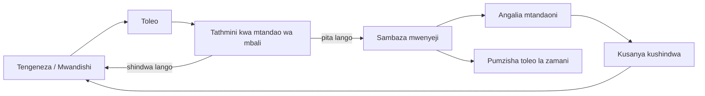
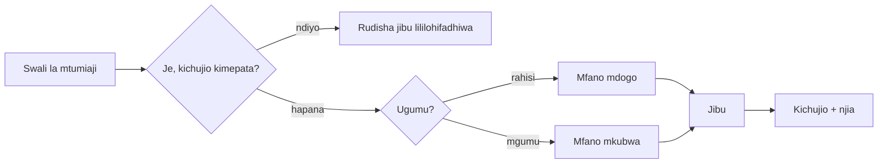
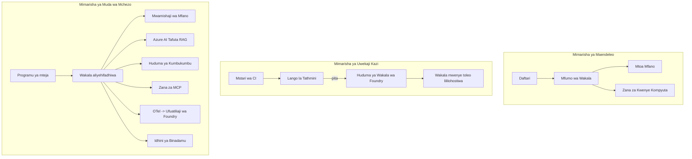

# Kuanzisha Maajenti Yanayoweza Kupanuka na Microsoft Foundry


Mpaka hatua hii katika kozi umetengeneza maajenti wanaofanya kazi kwenye kompyuta yako ya mkononi, ndani ya daftari, wakiongozwa na `az login` na baadhi ya mabadiliko ya mazingira. Hiyo ni njia sahihi kabisa ya kujifunza. Si njia sahihi ya kuendesha ajenti ambao maelfu ya wateja wanategemea saa 3 usiku.

Somo hili linahusu pengo kati ya "inafanya kazi kwenye mashine yangu" na "inafanya kazi, kwa uhakika na gharama nafuu, katika uzalishaji." Tunafunga pengo hilo kutumia **Microsoft Foundry** na **Huduma ya Maajenti ya Microsoft Foundry**, na tunafanya hivyo kwa kujenga ajenti halisi wa msaada kwa wateja ambaye ana zana, upataji, kumbukumbu, tathmini, na ufuatiliaji.

## Utangulizi

Somo hili litajumuisha:

- Tofauti kati ya **ajenti mfano** na **ajenti iliyowekwa**, na kwa nini mabadiliko ni hasa kuhusu kila kitu *kuzunguka* mfano.
- **Mifumo ya uanzishaji** kwa maajenti: mwenyeji-mteja, mwenyeji-wa huduma (Maajenti Waliowekwa), na utaratibu wa mchakato wa kazi.
- **Mzunguko wa maisha wa ajenti** kwenye Microsoft Foundry — tengeneza, toleo, anzisha, tathmini, chunguza, retire.
- **Mikakati ya kupanua**: usambazaji wa modeli, kuhifadhi tayari, ushirikiano, na muundo usiokuwa na hali.
- **Ufuatiliaji** kwa OpenTelemetry na ufuatiliaji wa Foundry.
- **Uboreshaji wa gharama** kupitia uchaguzi wa modeli, usambazaji, na milango ya tathmini.
- **Masuala ya kampuni**: uongozi, idhini ya binadamu, na kuendesha seva za MCP kwa usalama katika uzalishaji.

## Malengo ya Kujifunza

Baada ya kumaliza somo hili, utajua jinsi ya:

- Kuchagua mfumo wa uanzishaji unaofaa kwa kazi fulani ya ajenti.
- Kuanzisha ajenti kwenye Huduma ya Maajenti ya Microsoft Foundry ili iwe na toleo, iendeshwe kwa usimamizi, na iweze kupimika.
- Kuweka chombo cha kufuatilia ajenti na kuunganisha mstari wa tathmini unaodhibitiwa kabla ya kila toleo.
- Kutumia usambazaji wa modeli na kuhifadhi tayari kudhibiti ucheleweshaji na gharama kwa kiwango kikubwa.
- Kuongeza lango la idhini ya binadamu kwa vitendo vya hatari kubwa na kuunganisha seva ya MCP kwa njia salama uzalishaji.

## Mahitaji ya Awali

Somo hili linadhani umejifunza masomo ya awali na uko vizuri na:

- Kujenga maajenti kwa kutumia [Microsoft Agent Framework](../14-microsoft-agent-framework/README.md) (Somo 14).
- [Matumizi ya Zana](../04-tool-use/README.md) (Somo 4) na [Agentic RAG](../05-agentic-rag/README.md) (Somo 5).
- [Kumbukumbu ya Ajenti](../13-agent-memory/README.md) (Somo 13) na [Itifaki za Agentic / MCP](../11-agentic-protocols/README.md) (Somo 11).
- [Ufuatiliaji na Tathmini](../10-ai-agents-production/README.md) (Somo 10) — somo hili linajenga moja kwa moja juu yake.

Pia utahitaji:

- **Usajili wa Azure** na **mradi wa Microsoft Foundry** wenye angalau mfano mmoja wa mazungumzo uliowekwa.
- **Azure CLI** imethibitishwa (`az login`).
- Python 3.12+ na vifurushi vilivyoko kwenye hifadhidata [`requirements.txt`](../../../requirements.txt).

## Kutoka kwa Mfano hadi Uzalishaji: Nini Kinasobeka Kurekebishwa

Ajenti mfano na ajenti wa uzalishaji wana mzunguko mkuu mmoja — kutafakari, kuitisha zana, kujibu. Kinachobadilika ni kila kitu kilichozungukwa na mzunguko huo. Mfano ni karibu asilimia 20% ya ajenti wa uzalishaji; asilimia 80 nyingine ni mfumo wa kiutendaji.

| Masuala | Mfano | Uzalishaji |
| --- | --- | --- |
| **Uendeshaji** | Hufanya kazi ndani ya daftari lako | Hufanya kazi kama huduma iliyoandikwa, ina toleo na inafunguliwa |
| **Utambulisho** | Token yako ya `az login` | Utambulisho wa kusimamiwa ukitumia RBAC iliyopangwa |
| **Hali** | Kumbukumbu ya ndani, hupotea baada ya kuanza upya | Imehamishwa nje (hifadhi ya thread, huduma ya kumbukumbu) |
| **Kukosa** | Unaona taarifa ya makosa | Jaribu tena, chaguzi mbadala, barua za makosa, tahadhari |
| **Gharama** | "Ni senti chache" | Inafuatiliwa kwa kila ombi, inapangwa, kuhifadhiwa, ikabilizwe na bajeti |
| **Ubora** | Unaangalia matokeo | Inatathminiwa moja kwa moja kabla ya kila toleo |
| **Imani** | Unaruhusu kila kitendo | Sera + binadamu katika mzunguko kwa vitendo hatarishi |

Kumbuka jedwali hili. Kila sehemu hapa chini inaendana na moja ya safu hizi.

## Mifumo ya Uanzishaji wa Ajenti

Kuna mifumo mitatu utakayotumia, mara nyingi sambamba.

### 1. Maajenti Wanaojiendesha Mteja

Kitu cha ajenti kinaishi ndani ya mchakato wa programu *yako*. Msimbo wako unaitisha mtoaji wa mfano moja kwa moja; mzunguko wa kufikiri hufanya kazi katika huduma yako. Hii ndiyo kila somo lililopita limefanya.

- **Tumia wakati** unahitaji udhibiti wa mzunguko wote, kati ya katikati maalum, au unapojumuisha ajenti ndani ya backend iliyopo.
- **Ubadilishaji**: wewe unajitahidi kwa kupanua, hali, na ustahimilivu yenyewe.

### 2. Maajenti Waliowekwa (Huduma ya Maajenti ya Foundry)

Ajenti imeandikishwa kama rasilimali katika Microsoft Foundry. Foundry huendesha mzunguko wa kufikiri, huhifadhi mazungumzo, hutekeleza usalama wa maudhui na RBAC, na kuifanya ajenti ionekane kwenye lango la Foundry. Programu yako inakuwa mteja mwembamba anayetengeneza thread na kusoma majibu.

- **Tumia wakati** unataka uimara, ufuatiliaji wa ndani, usimamizi, na eneo dogo la operesheni.
- **Ubadilishaji**: udhibiti mdogo wa chini kwa kubadilisha kwa wakati unaosimamiwa.

### 3. Mifumo ya Utaratibu wa Ajenti

Maajenti mengi (na zana) huunganishwa kuwa mchoro wenye mizunguko ya udhibiti wazi — hatua mfululizo, kugawanyika, nodi za idhini ya binadamu, na vidokezo vya kudumu vinavyoweza kusimamishwa na kuendelea. Hii ni uwezo wa Microsoft Agent Framework **Workflows** unaotumika kwa kiwango cha uanzishaji.

- **Tumia wakati** kazi moja inahusisha maajenti maalum kadhaa au inahitaji hatua ya idhini katikati.
- **Ubadilishaji**: sehemu nyingi zinahamia, zinahitaji ufuatiliaji kwa kiwango cha utaratibu.

```mermaid
flowchart TB
    subgraph P1[Iliyohudumiwa na Mteja]
        A1[Mchakato wa Programu Yako] --> M1[Mtoaji wa Mfano]
    end
    subgraph P2[Mwakala Aliyesimamiwa]
        A2[Mteja Mwembamba] --> F2[Huduma ya Mwakala wa Foundry]
        F2 --> M2[Mfano + Zana + Hifadhi ya Mizunguko]
    end
    subgraph P3[Mtiririko wa Kazi wa Mwakala]
        A3[Mpangaji] --> S1[Mwakala wa Ufafanuzi wa Kwanza (Triage)]
        S1 --> S2[Mwakala wa Kutatua]
        S2 --> H[Kifungo cha Uidhinishaji wa Binadamu]
        H --> S3[Mwakala wa Hatua]
    end
```

## Mzunguko wa Maajenti kwenye Microsoft Foundry

Kuanzisha ajenti si kifungu cha `push` mara moja. Ni mzunguko, na inaonekana kama mzunguko wa kutolewa kwa programu kwa sababu ndiko kweli.



Wazo kuu, lililobeba kutoka [Somo 10](../10-ai-agents-production/README.md): **tathmini isiyojumuishwa ni lango, si dhihirisho la baada.** Toleo jipya la ajenti halitokewi kama halipitishi viwango vya tathmini zako. Ufuatiliaji mtandaoni hutoa makosa ya ulimwengu halisi nyuma kwenye seti ya majaribio isiyojumuishwa. Hiyo ni mzunguko mzima.

## Mikakati ya Kupanua

Kupanua ajenti ni tofauti na kupanua API bila hali, kwa sababu kila ombi linaweza kusababisha simu nyingi za modeli na zana ghali. Mbinu nne zinabeba mzigo mkubwa.

**Kushughulikia maombi bila hali.** Usihifadhi hali yoyote ya mtumiaji katika kumbukumbu yako ya mchakato. Hifadhi mazungumzo katika hifadhi ya thread ya Foundry au huduma ya kumbukumbu ili mfano wowote uweze kushughulikia ombi lolote. Hii ndilo linaoruhusu kupanua kwa usawa — ongeza mfano, hakuna kikao chenye kubandikwa.

**Usambazaji wa modeli.** Sio kila ombi linahitaji mfano wako mwenye uwezo mkubwa (na gharama kubwa). Sambaza maombi rahisi — utambuzi wa nia, majibu mafupi ya ukweli — kwa mfano mdogo, haraka, na hifadhi mfano mkubwa kwa ajili ya hoja halisi. **Model Router** ya Foundry inaweza kufanya hivyo kwa niaba yako, au unaweza kutekeleza mchanganuzi mwepesi mwenyewe. Utaijenga toleo la DIY katika maabara.

**Kuhifadhi majibu tayari.** Maswali mengi ya msaada ni karibu-kufanana ("ninavyorudisha nenosiri langu?"). Hifadhi majibu kwa maswali ya kawaida na kutumika bila kugonga mfano kabisa. Hata kiwango kidogo cha kufikia hifadhi kinapunguza gharama na kuchelewesha kwa maana.

**Ushirikiano na shinikizo la nyuma.** Watoa modeli wana mipaka ya kasi. Tenga ushirikiano wako, tumia jaribu tena kwa mdundo wa kimaendeleo, na tumia kufeli kwa upole (jibu la queued "tunaendelea" linaangusha kokuwa 500).



## Ufuatiliaji katika Uzalishaji

Huwezi kuendesha kile usichokiweka wazi. Kama ilivyozungumzwa katika Somo 10, Microsoft Agent Framework hutolea **OpenTelemetry** njia za kufuatilia kwa asili — kila simu ya mfano, uhamasishaji wa chombo, na hatua ya utaratibu huunda upanuzi. Katika uzalishaji hubeba upanuzi huo kwenda Microsoft Foundry (au backend yoyote inayotegemea OTel) ili uweze:

- Fuata malalamiko moja la mteja kutoka mwanzo mpaka mwisho kupitia kila simu ya mfano na zana.
- Tazama ucheleweshaji p50/p95 na gharama kwa kila ombi kwa muda.
- Toa tahadhari juu ya mabadiliko ya viwango vya makosa na utofauti wa gharama kabla ya watumiaji wako (au timu yako ya fedha) kuzingatia.

```python
from agent_framework.observability import get_tracer

tracer = get_tracer()

with tracer.start_as_current_span("support_request") as span:
    span.set_attribute("customer.tier", "enterprise")
    span.set_attribute("routed.model", "gpt-4.1-mini")
    # utekelezaji wa wakala unafuatiliwa kiotomatiki ndani ya eneo hili
```

Vigezo kama `customer.tier` na `routed.model` ndivyo vinavyotumia ukuta wa njia za kufuatilia kuwa maswali yanayoweza kujibiwa ("Je, wateja wa kampuni wanapelekwa kwa mfano mdogo sana mara nyingi?").

## Uboreshaji wa Gharama

Gharama katika maajenti wa uzalishaji inatawaliwa na tokeni. Kifaa tatu, kwa mpangilio wa athari:

1. **Kukadiri mfano kwa usahihi.** Mfano mdogo unaopita lango la tathmini ni karibu daima nafuu kuliko mkubwa ambaye pia anapita. Tumia tathmini kuonyesha mfano mdogo ni mzuri badala ya kuchagua mfano mkubwa kwa tahadhari.
2. **Sambaza kwa ugumu.** Kama hapo juu — lipa bei za mfano mkubwa tu kwa maombi yanayohitaji hoja ya mfano mkubwa.
3. **Hifadhi kwa nguvu.** Simu ya mfano ya gharama nafuu ni ile usiyoiita kabisa.

Milango ya tathmini na udhibiti wa gharama ni nidhamu hiyo ile inayotazamwa kutoka pande mbili: tathmini inakuambia *sakafu ya ubora*, usambazaji na kuhifadhi tayari hukuweka karibu na *gharama* ya sakafu hiyo.

## Masuala ya Uanzishaji wa Kampuni

**Uongozi.** Maajenti Waliowekwa huchukua RBAC, usalama wa maudhui, na kumbukumbu za ukaguzi za Foundry. Mpe kila ajenti utambulisho usimamizi wa dhamana ndogo inayohitaji — upatikanaji tu wa kusoma hifadhidata ya maarifa, upatikanaji wa kiwango cha API ya tiketi, na hakuna zaidi.

**Binadamu katika mzunguko.** Vitendo vingine ni vya maana sana kwa kuanzishwa moja kwa moja — kutoa malipo ya kifutio, kufuta akaunti, kupeleka kwa timu ya sheria. Microsoft Agent Framework inasaidia zana **zinazohitaji idhini**: ajenti inapendekeza kitendo, utekelezaji unasimamishwa, binadamu aruhusu au akatae, na mchakato unaendelea. Umeona kifungu hicho katika [Somo 6](../06-building-trustworthy-agents/README.md); hapa unaweka wazi.

**MCP katika uzalishaji.** [MCP](../11-agentic-protocols/README.md) inaruhusu ajenti yako kutumia zana za nje kwa kiolesura cha viwango. Katika uzalishaji, chukulia seva yoyote MCP kama mpaka usioweza kuaminiwa: weka toleo la seva, uendeshe kwa utambulisho wa kipengele, thibitisha matokeo yake, na usiwafunue siri yoyote. Seva ya MCP ni utegemezi, na utegemezi hupatiwa maboresho, ukaguzi, na mipaka ya kasi.



Mchoro huo mitatu — maendeleo, uanzishaji, wakati wa kufanya kazi — ni ajenti ile ile katika hatua tatu za maisha yake. Maabara inayofuata itakuongoza kujenga hiyo.

## Maabara ya Vitendo: Ajenti wa Msaada kwa Wateja Tayari kwa Uzalishaji

Fungua [`code_samples/16-python-agent-framework.ipynb`](./code_samples/16-python-agent-framework.ipynb) na kufanya kazi kuanzia mwanzo mpaka mwisho. Utaunganisha **ajenti wa msaada kwa wateja wa Contoso** yenye kila jambo la uzalishaji lililounganishwa:

1. **Kuaita zana** — angalia hali ya oda na fungua tiketi za msaada.
2. **RAG** — jibu maswali ya sera kutoka hifadhidata ya maarifa (Azure AI Search, na njia mbadala ya kumbukumbu ili daftari lifanye kazi bila rasilimali za Search).
3. **Kumbukumbu** — kumbuka mteja katika mizunguko ya mazungumzo.
4. **Usambazaji wa mfano** — kifuatiliaji wa ugumu husambaza kila ombi kwa mfano mdogo au mkubwa.
5. **Kuhifadhi majibu tayari** — maswali yanayorudiwa yanatumikia kutoka hifadhi.
6. **Idhini ya binadamu** — marejesho juu ya kikomo yanaguswa kusimamishwa kwa idhini ya binadamu.
7. **Mstari wa tathmini** — seti ndogo ya majaribio isiyojumuishwa inapima ajenti na kufanya lango la kutolewa.
8. **Ufuatiliaji** — ufuatiliaji wa OpenTelemetry kila ombi.

### Maelekezo

Daftari limesanifiwa ili kila jambo la uzalishaji liwe sehemu huru inayoweza kuendeshwa. Moyo wake ni msindikaji wa maombi ya usambazaji-na-kuhifadhi:

```python
async def handle_support_request(query: str, customer_id: str) -> str:
    # 1. Hudumia kutoka kwenye cache tunapoweza.
    cached = response_cache.get(normalize(query))
    if cached:
        return cached

    # 2. Panga kwa ugumu ili kudhibiti gharama.
    model = "gpt-4.1-mini" if is_simple(query) else "gpt-4.1"

    # 3. Endesha wakala ndani ya eneo la ufuatiliaji kwa ajili ya uangalizi.
    with tracer.start_as_current_span("support_request") as span:
        span.set_attribute("routed.model", model)
        span.set_attribute("customer.id", customer_id)
        response = await support_agent.run(query, model=model)

    # 4. Hifadhi kwenye cache na rudisha.
    response_cache.set(normalize(query), response.text)
    return response.text
```

Lango la tathmini linalolinda toleo linaweza kuonekana hivi:

```python
async def evaluation_gate(agent, test_cases, threshold: float = 0.8) -> bool:
    passed = 0
    for case in test_cases:
        result = await agent.run(case["input"])
        if score_response(result.text, case["expected"]) >= 0.8:
            passed += 1
    pass_rate = passed / len(test_cases)
    print(f"Evaluation pass rate: {pass_rate:.0%} (gate: {threshold:.0%})")
    return pass_rate >= threshold  # tengeneza tu kama lango lipitike
```

Soma kila mstari — daftari linahifadhi vipengele vidogo makusudi ili hakuna kitu kifichwe nyuma ya wito wa mfumo.

## Thibitisha Ajenti Iliyekuwekwa kwa Majaribio ya Mvuke

Lango la tathmini hapo juu linafanya kazi *kando* na kitu cha ajenti. Mara ajenti anapoanzishwa kama Ajenti Iliyohudumiwa, unahitaji angalau ukaguzi mwingine wa bei rahisi: **Je, mwisho aliowekwa unajibu kweli?**

Kuanzisha "kwa mafanikio" kunathibitisha tu usuli umekubali ufafanuzi — si kudhibitisha ajenti jibu. Kutokuwepo kwa utegemezi, usambazaji mbaya wa modeli, au muunganisho uliotimia kunaweza kuacha uwekaji wa kijani usiorejea chochote. **Jaribio la mvuke** linachukua hiyo ndani ya sekunde, kila uanzishaji, bila gharama ya tathmini kamili.

Hifadhidata hii hutumia mstari wa jaribio tayari kutumia uliojengwa kwenye Kitendo cha GitHub cha [AI Smoke Test](https://github.com/marketplace/actions/ai-smoke-test):

- **Katalogi** — [`tests/lesson-16-smoke-tests.json`](../../../tests/lesson-16-smoke-tests.json) ina maelekezo na uthibitisho kwa ajenti wa msaada wa Contoso (majibu ya sera yaliyopozwa, utafutaji wa oda, kukaa kwenye mada, na mfululizo wa mazungumzo ya mizunguko mingi). Katalogi za maajenti ya masomo mengine ziko pamoja nayo — tazama [`tests/README.md`](../tests/README.md).
- **Mchakato wa kazi** — [`.github/workflows/smoke-test.yml`](../../../.github/workflows/smoke-test.yml) hufanya login kwa Azure OIDC na POST kila maelekezo kwenye mwisho wa Majibu ya ajenti, ikikataa kazi kwa kosa lolote la uthibitisho.

```yaml
- name: Smoke-test hosted agent
  uses: JFolberth/ai-smoketest@v1
  with:
    project_endpoint: ${{ inputs.project_endpoint }}
    agent_name: ContosoSupportAgent
    tests_file: tests/lesson-16-smoke-tests.json
```


Zidhamini kutoka kwenye kichupo cha **Actions** mara tu wakala wako atakapowekwa, ukitoa mwisho wa mradi wako wa Foundry na jina la wakala. Kitambulisho cha pamoja kinahitaji jukumu la **Azure AI User** katika eneo la mradi wa Foundry. Fikiria tabaka kama piramidi: majaribio ya moshi (yanafikika na yanajibu?) hufanyika kila mara ya kuweka, tathmini ya nje ya mtandao (karibu nzuri ya kusafirisha?) hufanyika kabla ya kupandishwa madaraja, na tathmini ya mtandao (inaendaje jangwani?) hufanyika kila wakati.

## Mtihani wa Maarifa

Jaribu uelewa wako kabla ya kuendelea na kazi.

**1. Takriban ni kiasi gani cha wakala wa uzalishaji kinachojulikana kama "mfano," na ni nini kinachobaki?**

<details>
<summary>Jibu</summary>

Mfano ni sehemu ndogo ya mfumo — mara nyingi huitwa kama karibu 20%. Sehemu iliyobaki ni muundo wa uendeshaji: mwenyeji na usimamizi wa toleo, kitambulisho na RBAC, hali iliyotolewa nje, usimamizi wa kushindwa, ufuatiliaji wa gharama, tathmini, na vidhibiti wa binadamu-katika-mzunguko. Kuenda kwenye uzalishaji ni zaidi kuhusu kujenga kila kitu *kuzunguka* mzunguko wa uelewa.
</details>

**2. Utachagua lini Wakala Aliyejuwa (Hosted Agent) badala ya wakala anayeendeshwa na mteja?**

<details>
<summary>Jibu</summary>

Unapotaka mazingira ya kuendesha yaliyosimamiwa yenye uimara uliyojengwa ndani (thread zinazodumu na zinaweza kuendelea), uangalifu, usalama wa maudhui, na RBAC, na uko tayari kubadilishana udhibiti mdogo wa mzunguko wa uelewa kwa eneo dogo la uendeshaji. Wakala anayeendeshwa na mteja ni bora zaidi unapohitaji udhibiti kamili juu ya mzunguko au unapochanganya wakala kwenye backend iliyopo.
</details>

**3. Kwa nini wakala anayeenea lazima awe bila hali yake ya kumbukumbu ya mchakato?**

<details>
<summary>Jibu</summary>

Ili mfano wowote uweze kushughulikia ombi lolote, jambo ambalo linaruhusu upanuzi wa mlalo bila vikao vinavyoambatana. Hali ya mazungumzo kwa mtumiaji hufutwa nje hadi duka la thread au huduma ya kumbukumbu. Ikiwa hali ingekuwa katika kumbukumbu ya mchakato, ungeipoteza kwa kuanzisha upya na usingeweza kusambaza mzigo kwa uhuru.
</details>

**4. Tatizo gani linalotatuliwa na kupeleka mfano (model routing), na lina uhusiano gani na tathmini?**

<details>
<summary>Jibu</summary>

Kupeleka humtuma maombi rahisi kwa mfano mdogo, wa bei nafuu, na wa haraka na kuhifadhi mfano mkubwa kwa maana halisi ya uelewa, kudhibiti ucheleweshaji na gharama. Ina uhusiano na tathmini kwa sababu tathmini ndio *huthibitisha* kuwa mfano mdogo ni wa kutosha kwa darasa la maombi — kupeleka bila tathmini ni kubahatisha.
</details>

**5. Nini maana ya "lango la tathmini" na linapatikana wapi katika mzunguko wa maisha?**

<details>
<summary>Jibu</summary>

Lango la tathmini hufanya mtihani wa nje ya mtandao dhidi ya toleo jipya la wakala na haliza usambazaji isipokuwa kiwango cha kupita kiwe kimefikia kikomo fulani. Linapatikana kati ya "toleo" na "kusambaza" katika mzunguko wa maisha, likifanya ubora kuwa sharti la awali la kutoa badala ya kitu unachokagua baada ya kusafirisha.
</details>

**6. Kwa nini seva ya MCP inapaswa kuzingatiwa kama mpaka usioaminika katika uzalishaji?**

<details>
<summary>Jibu</summary>

Kwa sababu ni tegemezi ya nje ambayo wakala wako huipigia simu. Unapaswa kuweka toleo lake, kuendesha na kitambulisho kilichopangwa, kuthibitisha matokeo yake, kuweka ukomo wa kutumia, na usiweze kumfichua siri — nidhamu sawa unayoiweka kwa tegemezi zozote za wahusika wengine. Matokeo yake huingia katika mzunguko wa uelewa wa wakala wako, kwa hivyo kuamini bila uhakika ni hatari ya usalama.
</details>

**7. Mabadiliko gani moja mara nyingi huathiri zaidi gharama za wakala wa uzalishaji, na kwa nini?**

<details>
<summary>Jibu</summary>

Ukuaji wa mfano — kutumia mfano mdogo kabisa ambaye bado anafikia lango lako la tathmini. Gharama hutawaliwa na tokeni, na mfano mdogo unaokidhi viwango vya ubora karibu daima ni nafuu kuliko mkubwa. Kuhifadhi na kupeleka basi hupunguza gharama zaidi, lakini kuchagua mfano sahihi wa msingi kuna athari kubwa za daraja la kwanza.
</details>

**8. Je, tabia za span kama `customer.tier` na `routed.model` zina jukumu gani katika uangalifu?**

<details>
<summary>Jibu</summary>

Zinabadilisha rekodi ghafi kuwa maswali ya biashara yanayojibiwa. Bila tabia una kuta ya span; na tabia unaweza kuuliza "je, wateja wa biashara wanapelekwa kwa mfano mdogo mara nyingi sana?" au "mifano gani inashughulikia maombi yetu polepole zaidi?" Tabia ni jinsi unavyogawanya telemetry kwa vipimo vinavyohusu uendeshaji wako.
</details>

## Kazi

Chukua wakala wa msaada kwa wateja kutoka maabara na ulinde kwa hali maalum: **wakala wa msaada wa malipo kwa kampuni ya SaaS.**

Kiwango chako cha kazi kinapaswa:

1. **Badilisha zana** na zile zinazohusiana na malipo: `get_subscription_status`, `get_invoice`, na `issue_credit` (mikopo zaidi ya $50 inahitaji idhini ya binadamu).
2. **Ongeza hati tatu za RAG** zinazohusu sera ya kurejesha pesa ya kampuni, mzunguko wa malipo, na sera ya kughairi.
3. **Panua seti ya tathmini** hadi visa angalau nane, ikiwa ni pamoja na angalau viwili ambavyo *vinapaswa* kuamsha njia ya idhini ya binadamu, na thibitisha lango lako la tathmini linapita au kushindwa kwa usahihi.
4. **Ongeza ripoti moja ya gharama**: baada ya kuendesha maombi mchanganyiko kumi kupitia wakala, chapisha ni ngapi zilielekezwa kwa mfano mdogo, ni ngapi kwa mfano mkubwa, na ngapi zilihudumiwa kutoka kwenye cache.

Andika aya fupi (katika seli ya markdown) ikielezea sheria gani ya kupeleka mfano uliyochagua na jinsi unavyothibitisha na trafiki halisi. Hakuna jibu moja linalofaa — unathaminiwa kwa ikiwa masuala ya uzalishaji yameunganishwa kikamilifu.

## Muhtasari

Katika somo hili ulihamisha wakala kutoka mfano hadi uzalishaji na Microsoft Foundry:

- Kupanda hadi uzalishaji ni zaidi kuhusu **muundo wa uendeshaji** unaozunguka mfano — mwenyeji, kitambulisho, hali, usimamizi wa kushindwa, gharama, ubora, na kuaminika.
- Ulijifunza mifumo mitatu ya **usambazaji** — mteja-aliyejuwa mwenyewe, Wakala Waliojuwa, na Mikondo ya Wakala — na ni lini kila mojawapo inafaa.
- Utembelea **mzunguko wa maisha wa wakala**, ambapo tathmini ya nje ya mtandao **inatenda kama lango la utoaji** na uangalifu wa mtandao hurudisha kushindwa kwenye seti ya mtihani.
- Ulitumia **mikakati ya ukubwa** — muundo usio na hali, kupeleka mfano, kuhifadhi, na usawa uliwekewa mipaka — na kuziunganisha na **ubunifu wa gharama**.
- Uliunganisha **vidhibiti vya biashara**: RBAC, idhini ya binadamu-katika-mzunguko, na muingiliano wa MCP salama kwa uzalishaji.
- Ujenga wakala wa msaada kwa wateja anayeweza kuendesha uzalishaji anayelenga masuala haya yote kwa pamoja katika nambari inayoweza kuendeshwa.

Somo lijalo litachukua njia tofauti: badala ya kupanua mawakala hadi mawingu, utaweka mawakala *chini* kwenye kompyuta moja ya msanidi na kuyaendesha kabisa kiasili.

## Rasilimali Zaidi

- <a href="https://learn.microsoft.com/azure/ai-foundry/what-is-azure-ai-foundry" target="_blank">Nyaraka za Microsoft Foundry</a>
- <a href="https://learn.microsoft.com/azure/ai-foundry/agents/overview" target="_blank">Muhtasari wa Huduma za Wakala wa Microsoft Foundry</a>
- <a href="https://aka.ms/ai-agents-beginners/agent-framework" target="_blank">Mfumo wa Wakala wa Microsoft</a>
- <a href="https://learn.microsoft.com/azure/ai-foundry/concepts/model-router" target="_blank">Mpeleka Mfano katika Microsoft Foundry</a>
- <a href="https://learn.microsoft.com/azure/search/search-what-is-azure-search" target="_blank">Azure AI Search</a>
- <a href="https://opentelemetry.io/" target="_blank">OpenTelemetry</a>
- <a href="https://github.com/marketplace/actions/ai-smoke-test" target="_blank">Hatua ya AI Smoke Test GitHub</a>
- <a href="https://modelcontextprotocol.io/" target="_blank">Itifaki ya Muktadha wa Mfano (MCP)</a>

## Somo lililopita

[Kujenga Wakala wa Matumizi ya Kompyuta (CUA)](../15-browser-use/README.md)

## Somo lijalo

[Kuunda Ma Wakala wa AI Kiasili](../17-creating-local-ai-agents/README.md)

---

<!-- CO-OP TRANSLATOR DISCLAIMER START -->
**Kionyozo**:
Hati hii imetafsiriwa kwa kutumia huduma ya tafsiri ya AI [Co-op Translator](https://github.com/Azure/co-op-translator). Ingawa tunajitahidi kupata usahihi, tafadhali fahamu kwamba tafsiri za kiotomatiki zinaweza kuwa na makosa au upungufu wa usahihi. Hati ya asili katika lugha yake halisi inapaswa kuchukuliwa kama chanzo cha mamlaka. Kwa taarifa muhimu, tafsiri ya kitaalamu inayofanywa na binadamu inapendekezwa. Hatutojibu kwa kuelewa vibaya au tafsiri potofu zinazotokea kutokana na matumizi ya tafsiri hii.
<!-- CO-OP TRANSLATOR DISCLAIMER END -->