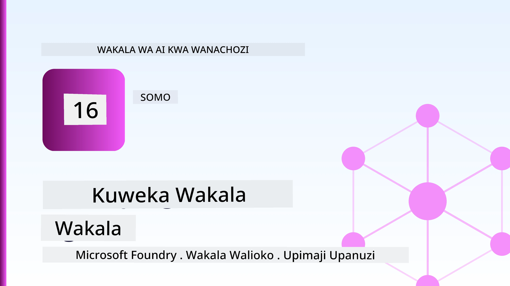
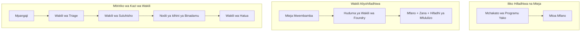
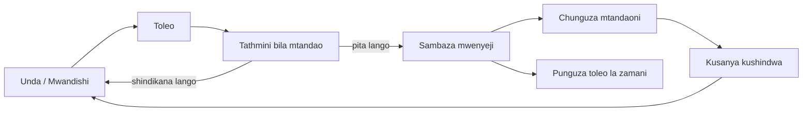
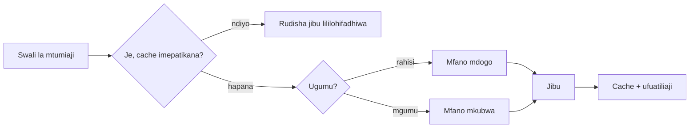
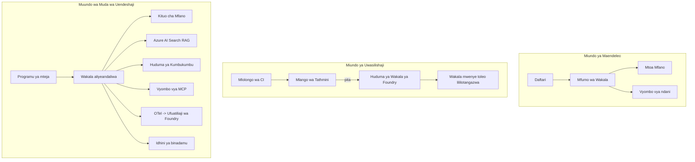

# Kuweka Wakala Zinazoweza Kupanuliwa na Microsoft Foundry



Hadi hatua hii katika kozi umetengeneza makala za mawakala zinazotumia kompyuta yako kibao, ndani ya daftari, zinazoendeshwa na `az login` na baadhi ya vigezo vya mazingira. Hiyo ndio njia sahihi ya kujifunza. Sio njia sahihi ya kuendesha wakala ambaye maelfu ya wateja wanategemea saa 3 asubuhi.

Somo hili linahusu pengo kati ya "inavyofanya kazi kwenye kompyuta yangu" na "inavyofanya kazi, kwa kuaminika na kwa gharama nafuu, katika uzalishaji." Tunafunga pengo hilo kutumia **Microsoft Foundry** na **Huduma ya Wakala ya Microsoft Foundry**, na tunafanya hivyo kwa kuunda wakala halisi wa msaada kwa wateja ambaye ana zana, utafutaji, kumbukumbu, tathmini, na ufuatiliaji.

## Utangulizi

Somo hili litashughulikia:

- Tofauti kati ya **wakala mfano** na **wakala aliyewekwa**, na kwa nini mabadiliko ni hasa kuhusu kila kitu *karibu* na mfano.
- **Mitindo ya kuweka makala** kwa mawakala: mwenyeji wa mteja, mwenyeji wa huduma (Mawakala Wenyeji), na utaratibu wa mtiririko wa kazi.
- **Mzunguko wa maisha wa wakala** kwenye Microsoft Foundry — tengeneza, toleo, weka, tathmini, tathmini, tembeza.
- **Mikutano ya kupanua**: njia ya mfano, kuweka kumbukumbu, mfululizo, na muundo usio na hali.
- **Ufuatiliaji** kwa OpenTelemetry na ufuatiliaji wa Foundry.
- **Uboreshaji wa gharama** kupitia uteuzi wa mfano, njia, na milango ya tathmini.
- **Mambo ya biashara**: usimamizi, idhini ya binadamu, na kuendesha seva za MCP kwa usalama katika uzalishaji.

## Malengo ya Kujifunza

Baada ya kumaliza somo hili, utajua jinsi ya:

- Kuchagua njia sahihi ya kuweka kazi kwa mzigo wa kazi wa wakala fulani.
- Kuongeza wakala kwenye Huduma ya Wakala ya Microsoft Foundry ili iwe na toleo, isimhamiwe, na iweze kuonekana.
- Kuweka zana za ufuatiliaji na kuunganisha mtiririko wa tathmini unaotendeka kabla ya kila toleo.
- Kutumia njia za mfano na kuweka kumbukumbu ili kudhibiti ucheleweshaji na gharama kwa kiwango kikubwa.
- Kuongeza mlango wa ruhusa ya binadamu kwa vitendo vya hatari kubwa na kuunganisha seva ya MCP kwa njia salama ya uzalishaji.

## Masharti ya Awali

Somo hili linadhani umehitimisha masomo ya awali na umeeleweka kwa:

- Kujenga mawakala kwa kutumia [Microsoft Agent Framework](../14-microsoft-agent-framework/README.md) (Somo 14).
- [Matumizi ya Zana](../04-tool-use/README.md) (Somo 4) na [Agentic RAG](../05-agentic-rag/README.md) (Somo 5).
- [Kumbukumbu ya Wakala](../13-agent-memory/README.md) (Somo 13) na [Itifaki za Wakala / MCP](../11-agentic-protocols/README.md) (Somo 11).
- [Ufuatiliaji na Tathmini](../10-ai-agents-production/README.md) (Somo 10) — somo hili linajengea moja kwa moja.

Pia utahitaji:

- **Usajili wa Azure** na **mradi wa Microsoft Foundry** wenye angalau mfano mmoja wa mazungumzo uliowekwa.
- CLI ya **Azure** iliyothibitishwa (`az login`).
- Python 3.12+ na vifurushi vilivyopo kwenye faili la kuhifadhi [`requirements.txt`](../../../requirements.txt).

## Kutoka Mfano hadi Uzalishaji: Nini Kinabadilika Kwanza

Wakala mfano na wakala wa uzalishaji wanashiriki mzunguko wa msingi — kufikiri, kuitisha zana, kujibu. Kinachobadilika ni kila kitu kilicho karibu na mzunguko huo. Mfano inaweza kuwa asilimia 20% ya wakala wa uzalishaji; asilimia 80% ni mfupa wa uendeshaji.

| Mambo | Mfano | Uzalishaji |
| --- | --- | --- |
| **Ukaribishaji** | Hufanya kazi ndani ya daftari lako | Hufanya kazi kama huduma yenyeji, ina toleo na inasambazwa |
| **Utambulisho** | Tokeni yako ya `az login` | Utambulisho uliodhibitiwa na RBAC inayozingatia mazingira |
| **Hali** | Kwenye kumbukumbu, hupotea baada ya kuanzisha tena | Imehamishwa (hifadhi ya minyororo, huduma ya kumbukumbu) |
| **Kushindwa** | Unaona kipindi cha hitilafu | Jaribu tena, kurudi nyuma, barua za kosa, tahadhari |
| **Gharama** | "Ni senti chache" | Inafuatiliwa kwa kila ombi, inapangwa njia, inahifadhiwa, ina bajeti |
| **Ubora** | Unatazama matokeo kwa jicho | Inathaminiwa kwa moja kwa moja kabla ya kila toleo |
| **Uaminifu** | Unathibitisha kila kitendo | Sera + binadamu katika mzunguko kwa vitendo vyenye hatari |

Kumbuka jedwali hili. Kila sehemu hapa chini inalingana na mstari mmoja wa meza hii.

## Mitindo ya Uwekaji wa Wakala

Kuna mitindo mitatu utakayotumia, mara nyingi kwa mchanganyiko.

### 1. Mawakala Wenyeji wa Mteja

Kitu cha wakala kiko ndani ya mchakato wa programu yako. Msimbo wako unaita msambazaji wa mfano moja kwa moja; mzunguko wa kufikiri unakimbia katika huduma yako. Hii ndio somo lolote lililopita lililofanya.

- **Tumia wakati** unahitaji udhibiti kamili wa mzunguko, middleware maalum, au unachoma wakala ndani ya backend iliyopo.
- **Hasara**: unajitawala wewe mwenyewe katika upanuzi, hali, na ustahimilivu.

### 2. Mawakala Wenyeji (Huduma ya Wakala ya Foundry)

Wakala hurekebishwa kama *rasilimali* katika Microsoft Foundry. Foundry inakuja na mzunguko wa kufikiri, huhifadhi minyororo, hutekeleza usalama wa maudhui na RBAC, na huweka wakala wazi katika lango la Foundry. Programu yako inakuwa mteja mwembamba anayetengeneza minyororo na kusoma majibu.

- **Tumia wakati** unataka uimara, ufuatiliaji uliomo ndani, usimamizi, na eneo dogo la uendeshaji.
- **Hasara**: udhibiti mdogo wa kiwango cha chini kwa kubadilishana na runtime iliyosimamiwa.

### 3. Mtiririko wa Kazi wa Wakala

Mawakala wengi (na zana) huundwa kuwa grafu yenye mtiririko wa udhibiti ulio wazi — hatua mfululizo, matawi, nodi za idhini ya binadamu, na alama za kudumu zinazoweza kusimamishwa na kuanzishwa tena. Hii ni kipengele cha Microsoft Agent Framework **Mtiririko wa Kazi** kinachotumika kwenye kiwango cha uwekaji.

- **Tumia wakati** kazi moja inahusisha mawakala maalum kadhaa au inahitaji hatua ya idhini katikati.
- **Hasara**: sehemu nyingi zinazohamishika; inahitaji ufuatiliaji wa kiwango cha upangaji.



## Mzunguko wa Maisha wa Wakala kwenye Microsoft Foundry

Kuweka wakala sio `push` mara moja tu. Ni mzunguko, na inaonekana kama mzunguko wa toleo la programu kwa sababu hiyo ndilo haswa jinsi ilivyo.



Wazo kuu, lililoletwa kutoka [Somo la 10](../10-ai-agents-production/README.md): **tathmini ya nje ya mtandao ni mlango, sio jambo la mawazo tu.** Toleo jipya la wakala halipelekwi isipokuwa litafikia vizingiti vya tathmini. Ufuatiliaji wa mtandaoni basi unarejesha makosa ya dunia halisi kwenye seti yako ya majaribio ya nje ya mtandao. Huo ndio mzunguko mzima.

## Mikakati ya Kupanua

Kupanua wakala ni tofauti na kupanua API isiyo na hali ya mtandao wa wavuti, kwa sababu kila ombi linaweza kusababisha miito ya mfano na zana ghali. Mbinu nne zinafanya mzigo mkubwa.

**Usimamizi wa ombi usio na hali.** Usihifadhi hali ya mtumiaji binafsi ndani ya kumbukumbu za mchakato wako. Hifadhi minyororo ya mazungumzo kwenye hifadhi ya minyororo ya Foundry au huduma ya kumbukumbu ili mfano wowote uweze kushughulikia ombi lolote. Hii ndio inakuwezesha kupanua kwa usawa — ongeza mifano, hakuna vikao vya kubana.

**Kuongoza mfano.** Sio kila ombi linahitaji mfano wako mwenye uwezo mkubwa (na gharama kubwa). Elekeza maombi rahisi — utofautishaji wa nia, majibu mafupi ya ukweli — kwa mfano mdogo, haraka, na uhifadhi mfano mkubwa kwa kufikiri halisi. **Model Router** ya Foundry inaweza kufanya hili kwa ajili yako, au unaweza kutekeleza kitambulisho cha mwanga mwenyewe. Utajenga toleo la DIY katika maabara.

**Kuweka majibu kwenye kumbukumbu.** Maswali mengi ya msaada ni karibu nakala ("jinsi ya kuweka upya nenosiri langu?"). Hifadhi majibu ya maswali ya kawaida na uyahudumie bila kuhitaji kuhitaji mfano kabisa. Hata viwango vya wastani vya kufikia kumbukumbu hupunguza gharama na ucheleweshaji kwa maana.

**Mfululizo na shinikizo la nyuma.** Watoa mfano wana mipaka ya viwango. Ziba mfululizo wako, tumia jaribio upya na kuongezeka kwa mvutano, na shindwa kwa heshima (jibu la queued "tuko kwenye hili" ni bora kuliko kosa la 500).



## Ufuatiliaji katika Uzalishaji

Huwezi kuendesha kile usichokiona. Kama ilivyofunikwa katika Somo la 10, Microsoft Agent Framework hutoa **OpenTelemetry** utaalamu moja kwa moja — kila wito wa mfano, mwitikio wa zana, na hatua ya upangaji huwa sehemu ya picha. Katika uzalishaji unaongoza picha hizo kwa Microsoft Foundry (au backend yoyote inayoungwa mkono na OTel) ili uweze:

- Kufuatilia malalamiko moja kwa moja ya mteja kutoka mwanzo hadi mwisho kwa kila wito wa mfano na zana.
- Kuangalia ucheleweshaji wa p50/p95 na gharama kwa kila ombi kwa muda.
- Kutoa tahadhari juu ya kuongezeka kwa viwango vya makosa na tofauti za gharama kabla ya watumiaji wako (au timu yako ya fedha) kuona.

```python
from agent_framework.observability import get_tracer

tracer = get_tracer()

with tracer.start_as_current_span("support_request") as span:
    span.set_attribute("customer.tier", "enterprise")
    span.set_attribute("routed.model", "gpt-5-nano")
    # utekelezaji wa wakala unafuatiliwa kiotomatiki ndani ya kipindi hiki
```

Sifa kama `customer.tier` na `routed.model` ndizo zinazofanya kuta za picha kuwa maswali yanayojibiwa ("je, wateja wa biashara wanaelekezwa kwa mfano mdogo sana mara nyingi?").

## Uboreshaji wa Gharama

Gharama katika mawakala wa uzalishaji inatawaliwa na tokens. Vifunguo vitatu, kwa mpangilio wa athari:

1. **Kuwa na mfano unaofaa.** Mfano mdogo unaopita mlango wako wa tathmini karibu daima ni nafuu kuliko mkubwa pia unaopita. Tumia tathmini kuthibitisha mfano mdogo unatosha badala ya kuchagua mfano mkubwa kwa tahadhari.
2. **Elekeza kwa ugumu.** Kama ilivyo hapo juu — linda gharama za mfano mkubwa kwa maombi yanayohitaji kufikiri kwa mfano mkubwa.
3. **Hifadhi kwa nguvu.** Wito wa mfano wa bei nafuu ni ule usiowahi kufanya.

Milango ya tathmini na udhibiti wa gharama ni nidhamu sawa inayotazamwa kutoka mwelekeo miwili: tathmini inakuambia *kifundo cha ubora*, njia na kuweka kumbukumbu zinakusogeza karibu na *gharama* ya msingi huo iwezekanavyo.

## Mambo ya Biashara katika Uwekaji

**Usimamizi.** Mawakala Wenyeji waletewa maeneo ya RBAC, usalama wa maudhui, na kumbukumbu za ukaguzi za Foundry. Mpa kila wakala utambulisho unaosimamiwa uliyo na njia ndogo inayohitajika — ufikiaji wa kusoma tu kwa hifadhi ya maarifa, ufikiaji wa kanda kwa API ya tiketi, hakuna zaidi.

**Binadamu katika mzunguko.** Vitendo vingine ni muhimu mno kufanya moja kwa moja — kutoa marejesho, kufuta akaunti, kuhamisha kwa timu ya sheria. Microsoft Agent Framework inaunga mkono zana za **inazohitaji idhini**: wakala hupendekeza kitendo, utekelezaji unasimamishwa, binadamu anathibitisha au kukataa, na mtiririko wa kazi unaendelea. Uliiona dhahiri katika [Somo 6](../06-building-trustworthy-agents/README.md); hapa unaweka.

**MCP katika uzalishaji.** [MCP](../11-agentic-protocols/README.md) inaruhusu wakala wako kutumia zana za nje kupitia kiolesura cha kawaida. Katika uzalishaji, chukulia seva yoyote ya MCP kama mpaka usio na kuaminika: weka toleo la seva, iendeshe na utambulisho wa kanda, hakikisha matokeo yake, na usiichulishe siri. Seva ya MCP ni tegemezi, na tegemezi hupata marekebisho, ukaguzi, na mipaka ya viwango.



Mchoro huo tatu — maendeleo, kuweka, wakati wa kuendesha — ni wakala mmoja katika hatua tatu za maisha yake. Maabara inayofuata itakuongoza unavyomjenga.

## Maabara ya Vitendo: Wakala wa Msaada wa Wateja Tayari kwa Uzalishaji

Fungua [`code_samples/16-python-agent-framework.ipynb`](./code_samples/16-python-agent-framework.ipynb) na fanya kazi yake kutoka mwanzo hadi mwisho. Utaunganisha **wakala wa msaada wa wateja wa Contoso** na kila jambo la uzalishaji limeunganishwa:

1. **Kuitisha zana** — angalia hali ya oda na fungua tiketi za msaada.
2. **RAG** — jibu maswali ya sera kutoka kwenye hifadhi ya maarifa (Azure AI Search, na mbadala wa kumbukumbu ya ndani ili daftari lifanye kazi bila rasilimali ya Search).
3. **Kumbukumbu** — kumbuka mteja katika mizunguko ya mazungumzo.
4. **Kuongoza mfano** — kitambulisho cha ugumu kinaelekeza kila ombi kwa mfano mdogo au mkubwa.
5. **Kuweka majibu kwenye kumbukumbu** — maswali yanayorudiwa huhudumiwa kutoka kumbukumbu.
6. **Idhini ya binadamu** — marejesho yaliyo juu ya kikomo yasimamishe mchakato kwa idhini ya binadamu.
7. **Mtiririko wa tathmini** — seti ndogo ya majaribio ya nje ya mtandao hupima wakala na kufanya kama mlango wa toleo.
8. **Ufuatiliaji** — ufuatiliaji wa OpenTelemetry karibu na kila ombi.

### Mwongozo

Daftari limepangwa hivyo kila jambo la uzalishaji ni sehemu huru yenyeweza kuendeshwa. Msingi wake ni msimamizi wa ombi wa njia na kumbukumbu:

```python
async def handle_support_request(query: str, customer_id: str) -> str:
    # 1. Hudumia kutoka kwenye cache tunapoweza.
    cached = response_cache.get(normalize(query))
    if cached:
        return cached

    # 2. Pitia kwa ugumu ili kudhibiti gharama.
    model = "gpt-5-nano" if is_simple(query) else "gpt-5-mini"

    # 3. Endesha wakala ndani ya eneo la kufuatilia kwa uangalifu.
    with tracer.start_as_current_span("support_request") as span:
        span.set_attribute("routed.model", model)
        span.set_attribute("customer.id", customer_id)
        response = await support_agent.run(query, model=model)

    # 4. Hifadhi kwenye cache na rudisha.
    response_cache.set(normalize(query), response.text)
    return response.text
```

Mlango wa tathmini unaolinda toleo unaonekana hivi:

```python
async def evaluation_gate(agent, test_cases, threshold: float = 0.8) -> bool:
    passed = 0
    for case in test_cases:
        result = await agent.run(case["input"])
        if score_response(result.text, case["expected"]) >= 0.8:
            passed += 1
    pass_rate = passed / len(test_cases)
    print(f"Evaluation pass rate: {pass_rate:.0%} (gate: {threshold:.0%})")
    return pass_rate >= threshold  # tuma tu ikiwa lango linafaa
```

Soma kila mstari — daftari linahifadhi vitu vya msingi kwa ukubwa mdogo ili hakuna kitu kifikie nyuma ya wito wa fremu.

## Kuhakiki Wakala Aliyewekwa kwa Majaribio ya Moshi

Mlango wa tathmini hapo juu unafanyika *nje ya mtandao* dhidi ya kitu cha wakala wako. Mara wakala anapowekwa kama Wakala Mwenyeji, unahitaji ukaguzi mwingine wa gharama nafuu zaidi: **je, sehemu ya kuweka ni kujibu kweli?**

Kuweka "kwa mafanikio" kunathibitisha tu kuwa bodi ya udhibiti ilikubali ufafanuzi — hakuthibitishi wakala anajibu. Kutokuwepo kwa tegemezi, njia mbaya ya mfano, au muunganisho uliokufa unaweza kuacha uwekaji wa kijani usilorejeshe chochote. **Jaribio la moshi** linakamata hilo kwa sekunde, kila kuweka, bila gharama ya tathmini kamili.

Hifadhi hii inaleta mtiririko wa jaribio la moshi tayari kutumika uliojengwa kwa Njia ya [AI Smoke Test](https://github.com/marketplace/actions/ai-smoke-test) GitHub:

- **Katalogi** — [`tests/lesson-16-smoke-tests.json`](../../../tests/lesson-16-smoke-tests.json) ina maelekezo na masharti kwa wakala wa msaada wa Contoso (majibu ya sera zilizo thibitishwa, utaftaji wa oda, kubaki katika mada, na mfululizo wa mazungumzo ya mizunguko mingi). Katalogi kwa mawakala wa masomo mengine zipo karibu nayo — angalia [`tests/README.md`](../tests/README.md).
- **Mtiririko wa kazi** — [`.github/workflows/smoke-test.yml`](../../../.github/workflows/smoke-test.yml) inaingia kwa Azure OIDC na POSTs kila maelekezo kwenye sehemu ya Majibu ya wakala, na kufeli kazi yoyote ikikosea katika masharti.

```yaml
- name: Smoke-test hosted agent
  uses: JFolberth/ai-smoketest@v1
  with:
    project_endpoint: ${{ inputs.project_endpoint }}
    agent_name: ContosoSupportAgent
    tests_file: tests/lesson-16-smoke-tests.json
```


Endesha kutoka kwenye kichupo cha **Actions** mara tu wakala wako anapowekwa, ukitoa endpoint ya mradi wa Foundry na jina la wakala. Kitambulisho cha kidemokrasia kinahitaji jukumu la **Azure AI User** katika muktadha wa mradi wa Foundry. Fikiria tabaka kama piramidi: majaribio ya moshi (yanafikika na kuyajibu?) yanaendeshwa kila mara kupelekwa, tathmini za nje ya mtandao (za kutosha kupeleka?) zinaendeshwa kabla ya kupandishwa hadhi, na tathmini za mtandao (inaendaje katika mazingira halisi?) zinaendeshwa mara kwa mara.

## Ukaguzi wa Maarifa

Jaribu uelewa wako kabla ya kuhamia kwenye kazi.

**1. Takriban wakala wa uzalishaji una kiasi gani cha "mfano," na sehemu nyingine ni nini?**

<details>
<summary>Jibu</summary>

Mfano ni asilimia ndogo ya mfumo — mara nyingi inatajwa kuwa takriban 20%. Sehemu nyingine ni mifupa ya uendeshaji: kuhifadhi na kusimamia matoleo, utambulisho na RBAC, hali iliyotolewa nje, kushughulikia mabaya, kufuatilia gharama, tathmini, na udhibiti wa mwanadamu ndani ya mzunguko. Kuenda kwenye uzalishaji ni zaidi kuhusu kujenga kila kitu *kuhusu* mzunguko wa hoja.
</details>

**2. Ungechagua lini Wakala Aliyehifadhiwa kwa mwenyeji kuliko wakala anayeendeshwa na mteja?**

<details>
<summary>Jibu</summary>

Unapotaka mazingira ya utekelezaji yaliyosimamiwa yenye uimara uliojengewa ndani (threadi zinazodumu na zinaweza kuendelea), uwezo wa kuangalia, usalama wa maudhui, na RBAC, na uko tayari kubadilisha udhibiti mdogo wa mzunguko wa hoja kwa eneo dogo zaidi la uendeshaji. Wakala aliyehifadhiwa na mteja ni bora wakati unahitaji udhibiti kamili juu ya mzunguko au unapojumuisha wakala katika backend iliyopo.
</details>

**3. Kwa nini wakala anayeweza kupanuka lazima awe hawezi kuhifadhi hali (stateless) kwenye kumbukumbu ya mchakato wake?**

<details>
<summary>Jibu</summary>

Ili mfano wowote uweze kushughulikia ombi lolote, hili ndilo linaloruhusu upanuzi wa wima (horizontal scaling) bila vipindi ambavyo vinabana (sticky sessions). Hali ya mazungumzo kwa mtumiaji huwekwa nje kwa kuhifadhi thread au huduma ya kumbukumbu. Ikiwa hali ingekaa kwenye kumbukumbu ya mchakato, ungeipoteza wakati wa kuanzisha tena na usingeweza kugawanya mzigo kwa uhuru.
</details>

**4. Nguvu gani ya kuongoza mfano (model routing) hutatua, na inahusishwaje na tathmini?**

<details>
<summary>Jibu</summary>

Kuongoza kunaelekeza maombi rahisi kwa mfano mdogo, wa bei nafuu na wa haraka na kuhifadhi mfano mkubwa kwa hoja halisi, kudhibiti ucheleweshaji na gharama. Inahusiana na tathmini kwa sababu tathmini ndiyo *inadhibitisha* kwamba mfano mdogo ni wa kutosha kwa daraja la maombi — kuongoza bila tathmini ni kufikiria tu.
</details>

**5. Ni nini "mlango wa tathmini" na unaekea wapi katika mzunguko wa maisha?**

<details>
<summary>Jibu</summary>

Mlango wa tathmini hufanya mtihani wa nje wa offline dhidi ya toleo jipya la wakala na kuzuia kupelekwa isipokuwa kiwango cha kupita kinavuka kikomo fulani. Unakaa kati ya "toleo" na "kupelekwa" katika mzunguko wa maisha, na kuifanya ubora kuwa sharti la awali la kutolewa badala ya kitu unachokagua baada ya kusafirisha.
</details>

**6. Kwa nini seva ya MCP inapaswa kutendewa kama mpaka usioaminika katika uzalishaji?**

<details>
<summary>Jibu</summary>

Kwa sababu ni utegemezi wa nje ambao wakala wako huuita. Unapaswa kuweka toleo lake mahususi, kulitumia kwa kitambulisho chenye muktadha maalum, kuthibitisha matokeo yake, kuweka kikomo cha mara kwa mara, na usiwafichue siri kamwe — nidhamu ileile unayoitumia kwa utegemezi wowote wa mtu wa tatu. Matokeo yake huingia katika hoja za wakala wako, hivyo kuamini bila kuthibitisha ni hatari ya usalama.
</details>

**7. Mabadiliko gani moja kwa moja mara nyingi huathiri zaidi gharama ya wakala wa uzalishaji, na kwa nini?**

<details>
<summary>Jibu</summary>

Kupanua mfano kwa ukubwa unaofaa — kutumia mfano mdogo zaidi unaopita mlango wako wa tathmini. Gharama hutawaliwa na tokeni, na mfano mdogo unaokidhi kiwango cha ubora mara nyingi ni ghali kidogo kuliko mkubwa. Kuweka kumbukumbu za muda na kuongoza kisha hupunguza gharama zaidi, lakini kuchagua mfano mzazi sahihi kuna athari kubwa zaidi ya ngazi ya kwanza.
</details>

**8. Je, sifa za spani kama `customer.tier` na `routed.model` zina jukumu gani katika ufuatiliaji?**

<details>
<summary>Jibu</summary>

Zinageuza nyaraka ghafi kuwa maswali ya kibiashara yanayoweza kujibiwa. Bila sifa unakuwa na kuta ya spani; nazo unauwezo wa kuuliza "je, wateja wa mashirika wanapelekwa kwa mfano mdogo mara nyingi sana?" au "mfano gani hushughulikia maombi yetu ya polepole zaidi?" Sifa ni jinsi unavyotenganisha telemetry kwa vipimo vinavyohusu uendeshaji wako.
</details>

## Kazi

Chukua wakala wa msaada wa wateja kutoka lab na uimarishe kwa hali maalum: **wakala wa msaada wa bili kwa kampuni ya SaaS.**

Usambazaji wako unapaswa:

1. **Badilisha zana** kwa zana zinazohusiana na bili: `get_subscription_status`, `get_invoice`, na `issue_credit` (mikopo zaidi ya $50 inahitaji idhini ya binadamu).
2. **Ongeza nyaraka tatu RAG** zinazohusu sera ya kurejesha pesa ya kampuni, mzunguko wa bili, na sera ya kufuta.
3. **Panua seti ya tathmini** hadi kesi nane angalau, ikijumuisha angalau mbili ambazo *zinapaswa* kusababisha njia ya idhini ya binadamu, na thibitisha mlango wako wa tathmini unapita au kushindwa kwa usahihi.
4. **Ongeza ripoti moja ya gharama**: baada ya kuendesha maswali kumi mchanganyiko kupitia wakala, chapisha ngapi zilienda kwa mfano mdogo, ngapi kwa mfano mkubwa, na ngapi zilihudumiwa kutoka kwa kumbukumbu ya muda.

Andika aya fupi (katika seli ya markdown) ikielezea kanuni gani ya kuongoza mfano uliyochagua na jinsi unavyothibitisha na trafiki halisi. Hakuna jibu moja sahihi — unakaguliwa kama masuala ya uzalishaji yameunganishwa kwa usahihi.

## Muhtasari

Katika somo hili umehamisha wakala kutoka toleo la jaribio hadi uzalishaji kwa Microsoft Foundry:

- Kurasimu hadi uzalishaji ni zaidi kuhusu **mifupa ya uendeshaji** kuzunguka mfano — kuhifadhi, utambulisho, hali, kushughulikia matatizo, gharama, ubora, na kuaminika.
- Umejifunza mifumo mitatu ya **kupelekwa** — iliyo hifadhiwa na mteja, Wakala Aliyehifadhiwa, na Mifumo ya Kazi za Wakala — na lini kila moja inafaa.
- Umefuatilia **mzunguko wa maisha wa wakala**, ambapo tathmini za nje ya mtandao **hufanya kama mlango wa kutolewa** na ufuatiliaji wa mtandao hurudisha matatizo kwenye seti ya mtihani.
- Umetumia **mikakati ya kupanua** — muundo usio na hali, kuongoza mfano, kuweka kumbukumbu za muda, na msongamano wa mipaka — na kuziunganisha na **uimarishaji wa gharama**.
- Umeunganishwa katika **udhibiti wa mashirika**: RBAC, idhini ya mwanadamu katika mzunguko, na usalama wa MCP katika uzalishaji.
- Umejenga wakala wa msaada wa wateja aliye tayari kwa uzalishaji anayehusisha wasiwasi haya yote katika msimbo wa kuendesha.

Somo lijalo linaelekea kinyume: badala ya kupanua mawakala hadi wingu, utaweka chini kwenye mashine ya mendeleaji mmoja na kuendesha kikamilifu kwa karibu.

## Rasilimali Zaidi

- <a href="https://learn.microsoft.com/azure/ai-foundry/what-is-azure-ai-foundry" target="_blank">Hati za Microsoft Foundry</a>
- <a href="https://learn.microsoft.com/azure/ai-foundry/agents/overview" target="_blank">Muhtasari wa Huduma ya Wakala wa Microsoft Foundry</a>
- <a href="https://aka.ms/ai-agents-beginners/agent-framework" target="_blank">Mfumo wa Wakala wa Microsoft</a>
- <a href="https://learn.microsoft.com/azure/ai-foundry/concepts/model-router" target="_blank">Kuongoza Mfano katika Microsoft Foundry</a>
- <a href="https://learn.microsoft.com/azure/search/search-what-is-azure-search" target="_blank">Azure AI Search</a>
- <a href="https://opentelemetry.io/" target="_blank">OpenTelemetry</a>
- <a href="https://github.com/marketplace/actions/ai-smoke-test" target="_blank">AI Smoke Test GitHub Action</a>
- <a href="https://modelcontextprotocol.io/" target="_blank">Model Context Protocol (MCP)</a>

## Somo Lililopita

[Kujenga Mawakala wa Matumizi ya Kompyuta (CUA)](../15-browser-use/README.md)

## Somo Lijalo

[Kuumba Mawakala wa AI Wananchi](../17-creating-local-ai-agents/README.md)

---

<!-- CO-OP TRANSLATOR DISCLAIMER START -->
**Kionyozo**:
Hati hii imetafsiriwa kwa kutumia huduma ya tafsiri ya AI [Co-op Translator](https://github.com/Azure/co-op-translator). Ingawa tunajitahidi kupata usahihi, tafadhali fahamu kwamba tafsiri za kiotomatiki zinaweza kuwa na makosa au upungufu wa usahihi. Hati ya asili katika lugha yake halisi inapaswa kuchukuliwa kama chanzo cha mamlaka. Kwa taarifa muhimu, tafsiri ya kitaalamu inayofanywa na binadamu inapendekezwa. Hatutojibu kwa kuelewa vibaya au tafsiri potofu zinazotokea kutokana na matumizi ya tafsiri hii.
<!-- CO-OP TRANSLATOR DISCLAIMER END -->