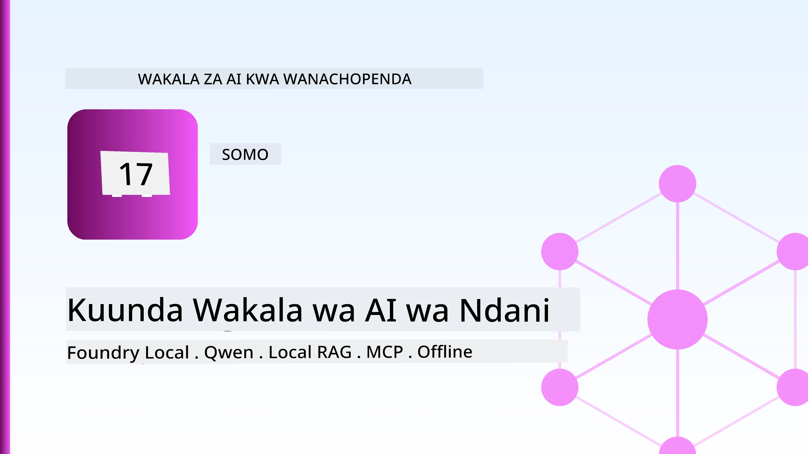
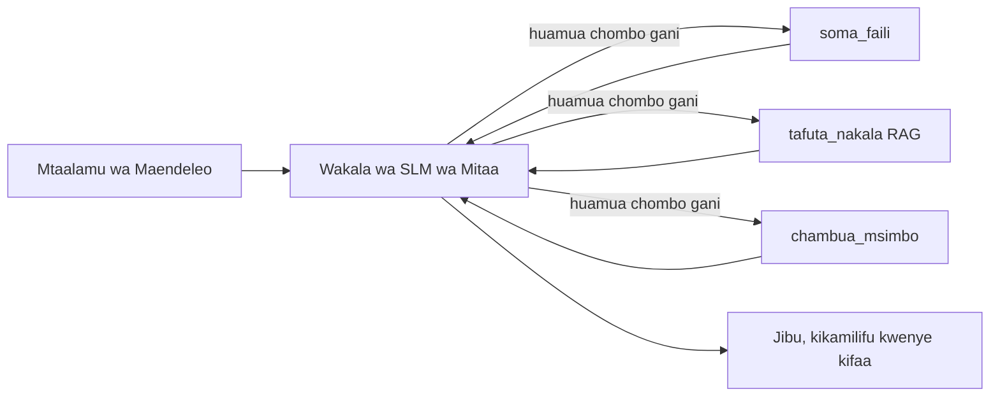
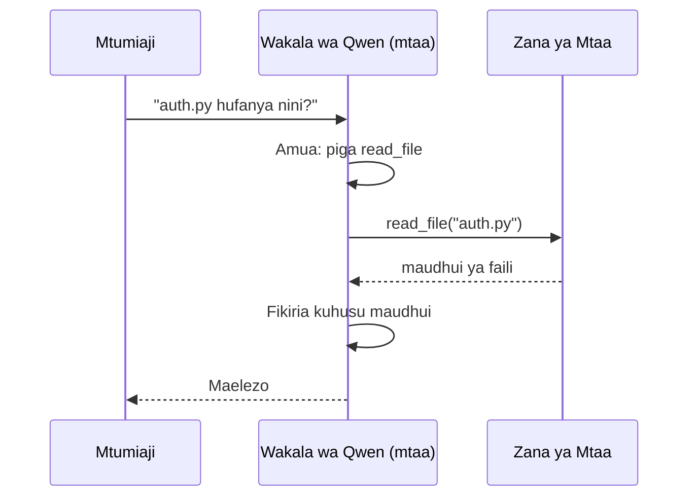
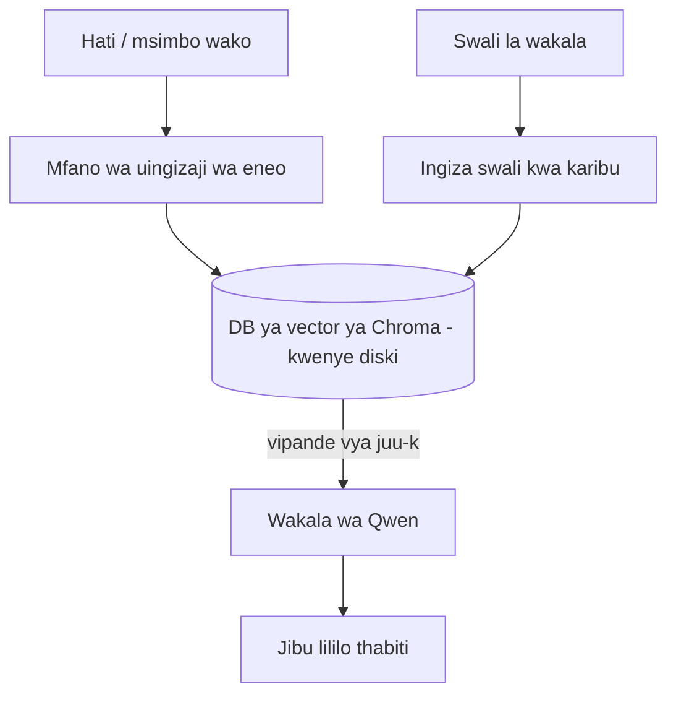
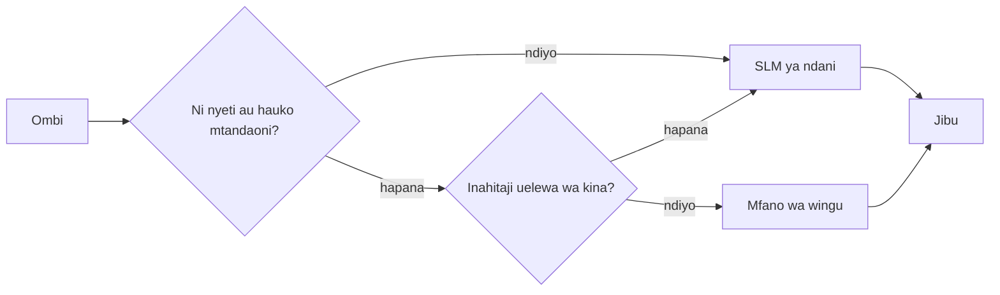

# Kuunda Maajenti wa AI wa Ndani kwa Kutumia Microsoft Foundry Local na Qwen



Somo lililopita lilipanua maajenti *hadi* kwenye wingu. Hili linaelekeza maajenti hao *chini* kwenye kompyuta moja. Mwishoni utakuwa na msaidizi wa uhandisi anayefanya kazi anayeweza kufikiria, kuitisha zana, kusoma faili zako, na kutafuta nyaraka zako — **bila kuita moja ya maamuzi ya wingu.**

Kwa nini ungependa hivyo? Sababu tatu zinazojitokeza mara kwa mara katika kazi halisi za uhandisi:

- **Faragha.** Msimbo na nyaraka haziondoki kwenye kompyuta. Hakuna agizo, hakuna kipande, hakuna data ya mteja inayovuka mpaka wa mtandao.
- **Gharama.** Uamuzi wa ndani haina bili kwa tokeni. Unaweza kurudia mchakato siku nzima kwa gharama ya umeme tu.
- **Bila Mtandao.** Kwenye ndege, katika eneo salama, au wakati wa tatizo la mtandao, maajenti bado hufanya kazi.

Changamoto ni kwamba unabadilisha mfano wa wingu wa kisasa kwa **Mfano Mdogo wa Lugha (SLM)** unaotumia CPU, GPU, au NPU yako. Somo hili ni kuhusu kujenga maajenti ambayo ni *mazuri* ndani ya kikomo hicho badala ya kudanganya kama kikomo hicho hakipo.

## Utangulizi

Somo hili litajumuisha:

- **Modeli Ndogo za Lugha (SLMs)** — ni nini, wapi zinafanikiwa, na wapi hazifanyi kazi vizuri.
- **Microsoft Foundry Local** — mfumo unaopakua na kuhudumia modeli kwenye kifaa kupitia **API inayolingana na OpenAI**.
- **Modeli za Qwen zinazopigia simu za kazi** — SLMs zinazotoa simu za zana kwa uaminifu, jambo linalowezesha maajenti wa ndani (siyo tu mazungumzo ya ndani).
- **Zana za ndani, RAG ya ndani, na MCP ya ndani** — kutoa uwezo kwa maajenti bila kutumia wingu.
- **Mifumo mseto** — lini kuweka mambo ndani na lini kufikia wingu.

## Malengo ya Kujifunza

Baada ya kumaliza somo hili, utajua jinsi ya:

- Eleza mabadilishano ya SLMs na chagua matumizi sahihi ya maajenti wa ndani.
- Hudumia mfano wa Qwen ndani kwa kutumia Foundry Local na kuungana kupitia endpoint inayolingana na OpenAI.
- Tengeneza msaidizi anayeita zana kwenda kufanya kazi zote kwenye kompyuta yako.
- Ongeza RAG ya ndani juu ya nyaraka zako mwenyewe kwa kutumia hifadhidata ya vektor za ndani (Chroma).
- Unganisha maajenti kwenye seva ya MCP ya ndani na ufikiri juu ya miundo mseto ya ndani/wingu.

## Mahitaji ya Awali

Somo hili linadhani umeamaliza masomo ya awali na umezoea:

- [Matumizi ya Zana](../04-tool-use/README.md) (Somo 4) na [Agentic RAG](../05-agentic-rag/README.md) (Somo 5).
- [Itifaki za Agentic / MCP](../11-agentic-protocols/README.md) (Somo 11).
- [Microsoft Agent Framework](../14-microsoft-agent-framework/README.md) (Somo 14).

Pia utahitaji:

- Kifaa cha mtengenezaji. **8 GB RAM ni chini kabisa halali**; 16 GB+ inafaa vizuri. GPU au NPU husaidia lakini si sharti.
- **Microsoft Foundry Local** imewekwa (angalia sehemu ya usanidi hapa chini).
- Python 3.12+ na vifurushi vilivyokoa kwenye repository [`requirements.txt`](../../../requirements.txt), pamoja na `foundry-local-sdk`, `openai`, na `chromadb` kwa somo hili.

## Modeling Ndogo za Lugha: Zana Sahihi kwa Kazi ya Ndani

Mfano wa wingu wa kisasa una mabilioni ya parameters na kituo cha data nyuma yake. SLM ina mabilioni machache ya parameters na lazima ifanye kazi kwenye RAM ya kompyuta ya mkononi. Tofauti hiyo inaweka matarajio wazi.

**SLMs ni nzuri kwa:**

- Kazi zilizo na muundo, zilizopangiliwa — upangaji, uchimbaji, muhtasari wa hati inayojulikana.
- **Kuitisha zana** — kuamua ni kazi gani ya kuita na na hoja gani.
- Kurudia kwa haraka, gharama nafuu, na kwa faragha juu ya data yako mwenyewe.

**SLMs ni dhaifu katika:**

- Kufikiria kwa hatua nyingi zisizo na kikomo juu ya muktadha mkubwa.
- Maarifa pana ya dunia (wameona kidogo, na husahau zaidi).

Mkakati bora kwa maajenti wa ndani ni: **ruhu SLM ipange mpango, na zana zifanye kazi nzito.** Mfano hauhitaji *kujua* msimbo wako — unahitaji kujua lini kuita `read_file` na `search_docs`. Hii inaonyesha nguvu za SLM moja kwa moja.



## Microsoft Foundry Local

**Microsoft Foundry Local** ni runtime nyepesi inayopakua, kudhibiti, na kuhudumia modeli zote kwenye kompyuta yako. Kipengele chake muhimu zaidi kwetu ni kwamba kinaonyesha **endpoint ya HTTP inayolingana na OpenAI** — ambayo inamaanisha SDK ya OpenAI na mteja wa Microsoft Agent Framework hufanya kazi nayo kwa kubadilisha tu `base_url`. Kila kitu ulichojifunza kuhusu kujenga maajenti kinahamisha moja kwa moja; endpoint tu inahamia kutoka wingu hadi `localhost`.

Foundry Local pia huchagua toleo bora la mfano kwa vifaa vyako moja kwa moja — toleo la CPU, toleo la CUDA/GPU, au toleo la NPU — hivyo huna haja ya kuboresha kwa mikono kwa kila kompyuta.

### Usanidi

Sakinisha Foundry Local (angalia [nyaraka](https://learn.microsoft.com/azure/ai-foundry/foundry-local/) kwa mfumo wako wa uendeshaji), kisha thibitisha inafanya kazi:

```bash
# Sakinisha (mfano; fuata nyaraka za jukwaa lako)
winget install Microsoft.FoundryLocal      # Windows
# brew install microsoft/foundrylocal/foundrylocal   # macOS

# Pakua na endesha mfano wa Qwen, kisha anzisha huduma ya ndani
foundry model run qwen2.5-7b-instruct
foundry service status
```

Mara huduma inapokuwa hai, una endpoint ya ndani inayolingana na OpenAI (kawaida `http://localhost:PORT/v1`). Daftari la maelezo hutumia `foundry-local-sdk` kugundua endpoint moja kwa moja, hivyo hautaji kuweka nambari ngumu ya bandari.

## Kuitisha Kazi za Qwen: Kwa Nini Ni Muhimu

Msaidizi ni msaidizi tu kama anaweza kuitisha zana. SLM nyingi zinaweza kuzungumza lakini hutengeneza simu za zana zisizoaminika, zenye muundo mbaya. **Qwen** modeli zafundishwa kuitisha kazi na hutolewa kwa miundo ya simu za zana zilizoeleweka kila wakati — ambayo ni hasa kinachofanya mfano wa mazungumzo wa ndani kuwa *msaidizi wa ndani*.

Mzunguko ni kama wa kawaida wa kuitisha zana uliyojua, unaofanya kazi kwenye kifaa:



## RAG ya Ndani

Utafutaji wa nyaraka ndio mahali ambapo maajenti wa ndani hupata thamani yao. Badala ya kutegemea SLM kuhubiri nyaraka za mfumo wako, unajumuisha nyaraka hizo kwenye **hifadhidata ya vektor ya ndani** na unampa msaidizi uwezo wa kutafuta vipande vinavyohitajika wakati wowote.

Tunatumia **Chroma**, hifadhidata iliyojumuishwa ya vektor inayoendesha ndani bila seva ya kusimamia. Mlolongo ni wa ndani kabisa: mfano wa kuingiza ndani → vekta za ndani → upatikanaji wa ndani → SLM wa ndani.



Hii ni muundo sawa wa Agentic RAG kutoka Somo 5 — mabadiliko pekee ni kwamba kila sehemu inaendesha kwenye kompyuta yako.

## Seva za MCP za Ndani

[MCP](../11-agentic-protocols/README.md) ni usafirishaji, si huduma ya wingu. Seva ya MCP inaweza kuendesha kama mchakato wa ndani kwa `stdio`, ikionesha zana kwa msaidizi wako kupitia itifaki ya kawaida. Hii inakuwezesha kutumia upya mfumo unaokua wa seva za MCP — upatikanaji wa faili, shughuli za git, maswali ya hifadhidata — zote bila mtandao.

Usalama ni tofauti na wingu, lakini sio hana kabisa: seva ya MCP ya ndani bado inaendesha kwa ruhusa za mtumiaji wako, kwa hivyo weka mipaka ya kile inaweza kugusa (kabrasha la mradi, si folda yako yote ya nyumbani) na chukulia matokeo yake kama ingizo la kuthibitisha.

## Miundo Mseto ya Wingu na Ndani

Kwanza ndani haimaanishi tu ndani. Mifumo imara hupeleka kazi kulingana na unyeti na ugumu:

| Hali | Mahali inayoendeshwa |
| --- | --- |
| Kanuni/data nyeti, au bila mtandao | **SLM ya Ndani** |
| Kazi rahisi, zilizopangwa | **SLM ya Ndani** (ghali nafuu, haraka) |
| Kufikiri kwa hatua nyingi katika data isiyo nyeti | **Mfano wa Wingu** |
| Yote, wakati wa tatizo | **SLM ya Ndani** (upungufu wa heshima) |

Hii inalingana na wazo la **kupelekwa kwa modeli** kutoka Somo 16 — isipokuwa moja ya "modeli" ni kompyuta yako mwenyewe. Ubunifu thabiti hurudi kwa ndani wakati wingu likipatikana, hivyo msaidizi hupungua kwa heshima badala ya kushindwa kabisa.



## Maabara ya Vitendo: Msaidizi wa Uhandisi wa Ndani

Fungua [`code_samples/17-local-agent-foundry-local.ipynb`](./code_samples/17-local-agent-foundry-local.ipynb) na fanya kazi nayo. Utajenga **msaidizi wa uhandisi wa ndani** anayeendesha kazi zote kwenye kompyuta yako na anaweza:

1. **Kuitisha zana** — kupitia kuitisha kazi za Qwen kupitia Foundry Local.
2. **Kutenda operesheni za faili za ndani** — orodha na soma faili kwenye kabrasha la mradi.
3. **Kuchambua msimbo** — ripoti takwimu za msingi kwenye faili chanzo.
4. **Kutafuta nyaraka** — RAG ya ndani juu ya folda ya nyaraka kwa kutumia Chroma.
5. **Kutumia MCP** — ungana na seva ya MCP ya ndani (na ruka kwa heshima ikiwa hakuna imewekwa).

Hakuna uamuzi wowote wa wingu unaotumiwa wakati wowote.

### Mwongozo

Msaidizi unaunganishwa na Foundry Local kupitia endpoint inayolingana na OpenAI, hivyo msimbo wa maajenti unaonekana karibu sawa na masomo ya wingu — mteja tu hubadilika:

```python
from foundry_local import FoundryLocalManager
from openai import OpenAI

# Foundry Local hugundua/hupakua mfano na hutupatia sehemu ya kuingilia ya ndani.
manager = FoundryLocalManager(\"qwen2.5-7b-instruct\")
client = OpenAI(base_url=manager.endpoint, api_key=manager.api_key)  # api_key ni kielekezi cha ndani
```

Zana ni kazi za kawaida za Python zilizo na uwezo wa kufikia kabrasha la mradi:

```python
def read_file(path: str) -> str:
    \"\"\"Read a file, but only inside the sandboxed project directory.\"\"\"
    full = (PROJECT_ROOT / path).resolve()
    if PROJECT_ROOT not in full.parents and full != PROJECT_ROOT:
        return \"Access denied: path is outside the project directory.\"
    return full.read_text(encoding=\"utf-8\")
```

Angalia ukaguzi wa sandbox — hata ndani, zana inayosoma njia zisizojulikana ni hatari. Daftari linaweka kila zana kuwa na mipaka ya mzizi wa mradi mmoja.

## Mtihani wa Maarifa

Jaribu uelewa wako kabla ya kuendelea na kazi.

**1. Toa sababu mbili halisi za kuendesha msaidizi kwa ndani badala ya kwenye wingu.**

<details>
<summary>Jibu</summary>

Chochote kati ya: **faragha** (msimbo na data hazitoki kwenye kompyuta), **gharama** (hakuna bili ya tokeni kwa uamuzi), na **uwezo wa kufanya kazi bila mtandao** (hufanya kazi bila mtandao — kwenye ndege, katika eneo salama, au wakati wa kukatika mtandao). Vizingiti vya kanuni/vilivyo wazi vinavyozuia kutuma data nje ya kifaa ni sababu ya kawaida ya faragha.
</details>

**2. Gawanya kazi kati ya SLM na zana zake kwa maajenti wa ndani kwa nini?**

<details>
<summary>Jibu</summary>

Ruhusu SLM ** kupanga** (kuamua zana gani ya kuitisha na hoja gani) na ruhusu **zana zifanye kazi kubwa** (kusoma faili, kupata nyaraka, kukokotoa matokeo). SLMs ni imara kwa maamuzi yaliyowekwa kama uteuzi wa zana lakini dhaifu kwa maarifa pana na njia nyingi za kufikiria za kina, hivyo kuitegemea zana kunatoa nguvu zake.
</details>

**3. Ni nini kinachowezesha kutumia tena msimbo wa maajenti wa wingu kwa Foundry Local?**

<details>
<summary>Jibu</summary>

Foundry Local inaonyesha **endpoint ya HTTP inayolingana na OpenAI**. SDK ya OpenAI na mteja wa Agent Framework hufanya kazi dhidi yake kwa kubadilisha tu `base_url` (na kutumia API key ya ndani). Kila kitu kingine katika msimbo wa maajenti hubaki kama ilivyo.
</details>

**4. Kwa nini tunatumia mfano wa kuitisha kazi wa Qwen badala ya SLM yoyote?**

<details>
<summary>Jibu</summary>

Kwa sababu msaidizi lazima atoe simu za zana zenye uaminifu na muundo mzuri. SLM nyingi zinaweza kuzungumza lakini hutoa miundo mbaya au isiyoendana ya simu za zana. Modeli za Qwen zafundishwa kuitisha kazi na kutoa simu za zana zenye mshikamano, jambo linalofanya mfano wa mazungumzo wa ndani kuwa msaidizi wa ndani.
</details>

**5. Katika mlolongo wa RAG ya ndani, ni vipengele gani vinaendesha kwenye kompyuta?**

<details>
<summary>Jibu</summary>

Vyote: mfano wa kuingiza ndani, hifadhidata ya vekta (Chroma, kwenye diski), hatua ya kupata, na SLM. Nyaraka zimeingizwa ndani, kuhifadhiwa ndani, kupatikana ndani, na kufikiriwa na mfano wa ndani — hakuna sehemu inayogusa wingu.
</details>

**6. Seva ya MCP ya ndani inaendesha kwenye kompyuta yako. Je, inafanya iwe salama moja kwa moja? Ni tahadhari gani bado unapaswa kuchukua?**

<details>
<summary>Jibu</summary>

Hapana. Seva ya MCP ya ndani inaendesha kwa ruhusa za mtumiaji wako, hivyo inaweza kugusa chochote unachoweza. Iweke kwenye mipaka ya kile inachohitaji (kwa mfano, kabrasha la mradi mmoja badala ya folda yako yote ya nyumbani) na chukulia matokeo yake kama ingizo la kuthibitisha kabla ya kuchukua hatua.
</details>

**7. Eleza kanuni nzuri ya kupitisha kazi mseto inayojumuisha mfano wa ndani.**

<details>
<summary>Jibu</summary>

Pitia maombi nyeti au yasiyo na mtandao kwa SLM ya ndani; pitishe kazi rahisi kwa SLM ya ndani kwa haraka na gharama nafuu; pitishe fikra ngumu nyingi za hatua kwenye data isiyo nyeti kwa mfano wa wingu; na rudia kwa SLM ya ndani ikiwa wingu halipatikani ili msaidizi apunguze kwa heshima badala ya kushindwa. Hii ni kupitisha kazi kwa modeli (Somo 16) na kompyuta ya ndani kama mojawapo ya modeli.
</details>

**8. Ni kiasi gani cha chini cha kweli cha RAM kinachohitajika kuendesha msaidizi wa ndani katika somo hili, na RAM zaidi inakuuzaje?**

<details>
<summary>Jibu</summary>

Karibu **8 GB** ni chini kabisa halali; 16 GB+ inafaa vizuri. RAM zaidi inakuwezesha kuendesha modeli kubwa, zenye uwezo zaidi na kuhifadhi muktadha zaidi akilini. GPU au NPU huwaharakisha uamuzi lakini si muhimu — Foundry Local huchagua toleo la CPU wakati hakuna kiinua nguvu kinachopatikana.
</details>

## Kazi

Panua msaidizi wa uhandisi wa ndani hadi **mchanganuzi wa nyaraka wa ndani** kwa mradi mdogo wa uchaguzi wako (tumia moja ya folda za somo katika repozitori hii kama unavyotaka).

Kitoo chako kinafaa:

1. **Andika faharasa ya kabrasha halisi la nyaraka/msimbo** kwenye Chroma (angalau faili tano).
2. **Ongeza zana ya `find_todos`** inayotafuta maoni ya `TODO`/`FIXME` kwenye mradi na kuyarudisha pamoja na faili na nambari ya mstari — ukiweka ukaguzi sawa wa sandbox kama `read_file`.

3. **Muulize wakala maswali matatu** yanayomlazimisha kuunganisha zana: suala moja la RAG halisi, moja linalohitaji kusoma faili mahususi, na moja linalohitaji kupata TODOs.
4. **Pima**: pima muda wa majibu matatu na uandike katika seli ya markdown. Toa maoni kama ucheleweshaji ni sawa kwa mtiririko wa kazi uliokusudiwa.

Kisha andika aya fupi kuhusu **ambacho utakigeuza kuwa wingu na ambacho utaweka mahali hapa kwa hakiki hii, na kwanini**. Utapimwa jinsi vipengele vya mahali hapa vinavyounganishwa ipasavyo na kama hoja yako ya mseto ni thabiti — si ubora wa mfano.

## Muhtasari

Katika somo hili uliunda wakala anayekimbia kabisa kwenye mashine yako mwenyewe:

- **SLMs** hubadilisha upana kwa faragha, gharama, na utendaji wa offline — na huangaza wanapokuwa **waandaji wa zana** badala ya kubeba maarifa yote wenyewe.
- **Foundry Local** huhudumia modeli kwenye kifaa nyuma ya **muhuri wa OpenAI-uliokubalika**, hivyo msimbo wako wa wakala wa wingu huhamishwa kwa mabadiliko wa mstari mmoja.
- **Modeli za kitoaji cha kazi za Qwen** hufanya wito wa zana wa ndani uwe thabiti — na kwa hivyo *wala wakala* wa ndani uwezekane.
- **RAG ya ndani** (Chroma) na **MCP wa ndani** hutoa uwezo wa wakala bila kuondoka mashineni.
- **Misheni ya mseto** huruhusu uelekezaji kwa msisitizo na ugumu, ukiwa na mahali hapa kama chaguo la kurejea kwa heshima.

Hii inakamilisha mzunguko wa uanzishaji: Somo la 16 liliongezea wakala hadi Microsoft Foundry, na somo hili linapunguza hadi kwenye terminal moja. Somo lijalo linahusu usalama wa wakala waliowezeshwa.

## Rasilimali Zaidi

- <a href="https://learn.microsoft.com/azure/ai-foundry/foundry-local/" target="_blank">Nyaraka za Microsoft Foundry Local</a>
- <a href="https://learn.microsoft.com/azure/ai-foundry/what-is-azure-ai-foundry" target="_blank">Nyaraka za Microsoft Foundry</a>
- <a href="https://aka.ms/ai-agents-beginners/agent-framework" target="_blank">Mfumo wa Wakala wa Microsoft</a>
- <a href="https://qwen.readthedocs.io/en/latest/framework/function_call.html" target="_blank">Nyaraka za Qwen kwa wito wa kazi</a>
- <a href="https://modelcontextprotocol.io/" target="_blank">Itifaki ya Muktadha wa Mifano (MCP)</a>
- <a href="https://docs.trychroma.com/" target="_blank">Hifadhidata ya vekta ya Chroma</a>

## Somo Lililopita

[Kutumia Wakala Wanaoweza Kuwekwa Kwenye Kiwango Kikubwa](../16-deploying-scalable-agents/README.md)

## Somo Linalofuata

[Kuweka Wakala wa AI Salama](../18-securing-ai-agents/README.md)

---

<!-- CO-OP TRANSLATOR DISCLAIMER START -->
**Kionyozo**:
Hati hii imetafsiriwa kwa kutumia huduma ya tafsiri ya AI [Co-op Translator](https://github.com/Azure/co-op-translator). Ingawa tunajitahidi kupata usahihi, tafadhali fahamu kwamba tafsiri za kiotomatiki zinaweza kuwa na makosa au upungufu wa usahihi. Hati ya asili katika lugha yake halisi inapaswa kuchukuliwa kama chanzo cha mamlaka. Kwa taarifa muhimu, tafsiri ya kitaalamu inayofanywa na binadamu inapendekezwa. Hatutojibu kwa kuelewa vibaya au tafsiri potofu zinazotokea kutokana na matumizi ya tafsiri hii.
<!-- CO-OP TRANSLATOR DISCLAIMER END -->