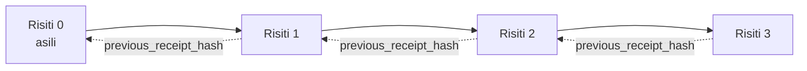

[Tazama video ya somo: Kuweka Salama Wakala za AI kwa Risiti za Kriptografia](https://youtu.be/PLACEHOLDER_VIDEO_ID)

> _(Video ya somo na kichwa vidogo vitatolewa na timu ya maudhui ya Microsoft baada ya kuunganishwa, vinavyolingana na muundo wa somo la 14 / 15.)_

# Kuweka Salama Wakala za AI kwa Risiti za Kriptografia

## Utangulizi

Somo hili litajumuisha:

- Kwa nini njia za ukaguzi wa shughuli za wakala wa AI ni muhimu kwa ufuataji wa sheria, utambuzi wa matatizo, na imani.
- Risiti ya kriptografia ni nini na inatofautianaje na mstari wa kumbukumbu usiosainiwa.
- Jinsi ya kutengeneza risiti iliyosainiwa kwa wito wa chombo cha wakala kwa kutumia Python rahisi.
- Jinsi ya kuthibitisha risiti kwa njia isiyo mtandao na kugundua mabadiliko yasiyoruhusiwa.
- Jinsi ya kuunganisha risiti ili kuondoa au kubadilisha mpangilio wa moja kuvunja mnyororo.
- Risiti huonesha nini na hasa hazionyeshi nini.

## Malengo ya Kujifunza

Baada ya kumaliza somo hili, utajua jinsi ya:

- Kutambua aina za kushindwa zinazochochea utambulisho wa kriptografia kwa vitendo vya wakala.
- Kutengeneza risiti iliyosainiwa kwa Ed25519 juu ya mzigo wa JSON wa kawaida.
- Kuthibitisha risiti kwa kujitegemea kwa kutumia ufunguo wa umma wa msaini pekee.
- Kugundua mabadiliko yasiyoruhusiwa kwa kuendesha tena uthibitisho kwa risiti iliyobadilishwa.
- Kujenga mfuatano wa risiti uliofungwa kwa hash na kueleza kwa nini mnyororo ni muhimu.
- Kutambua mipaka kati ya kile risiti huonesha (utatambulisho, usahihi, mpangilio) na kile hazionyeshi (usahihi wa kitendo, uhalali wa sera).

## Tatizo: Njia ya Ukaguzi ya Wakala Wako

Fikiria umeweka wakala wa AI kwa Contoso Travel. Wakala anasoma maombi ya mteja, anaita API ya ndege kutafuta chaguzi, na anakata nafasi kwa niaba ya mteja. Robo ya mwisho, wakala alishughulikia uhifadhi elfu 50,000.

Leo mkaguzi anakuja. Anauliza swali rahisi: "Nionyeshe ambacho wakala wako alifanya."

Unamkabidhi faili zako za kumbukumbu. Mkaguzi anazionyesha na kuuliza swali gumu zaidi: "Je, nawezaje kujua kuwa kumbukumbu hizi hazikuwasilishwa?"

Hili ndilo tatizo la njia ya ukaguzi. Mara nyingi usambazaji wa wakala leo hutegemea:

- **Faili za programu**: zinazoandikwa na wakala mwenyewe, zinaweza kuhaririwa na mtu yeyote mwenye ufikiaji wa mfumo wa faili.
- **Huduma za kuhifadhi kumbukumbu za anga**: zinathibitishwa kuwa hazijabadilishwa kwenye kiwango cha jukwaa lakini ni kwa mkaguzi kuamini msimamizi wa jukwaa.
- **Faili za shughuli za database**: zinazofaa kwa mabadiliko ya database lakini si kwa wito wowote wa chombo.

Hakuna kati ya hizi unaweza kujibu swali la mkaguzi bila kuhitaji mkaguzi aamini mtu fulani (wewe, muuzaji wako wa huduma ya anga, muuzaji wa database). Kwa matumizi ya ndani, imani hiyo mara nyingi hupokelewa. Kwa kazi zilizo chini ya kanuni (fedha, huduma za afya, chochote kinachodhibitiwa na Sheria ya AI ya EU), haipo.

Risiti za kriptografia hutatua hili kwa kufanya kila kitendo cha wakala kuthibitishwa kwa kujitegemea. Mkaguzi hahitaji kuamini wewe. Wanahitaji tu ufunguo wako wa umma na risiti yenyewe.

## Risiti ya Kriptografia ni Nini?

Risiti ni kitu cha JSON kinachoandika kile ambacho wakala alifanya, kilichosainiwa kwa saini ya kidijitali.


Risiti ndogo inaonekana kama hii:

```json
{
  "type": "agent.tool_call.v1",
  "agent_id": "contoso-travel-bot",
  "tool_name": "lookup_flights",
  "tool_args_hash": "sha256:a3f9c1...",
  "result_hash": "sha256:7b2e1d...",
  "policy_id": "contoso-travel-policy-v3",
  "timestamp": "2026-04-25T14:30:00Z",
  "sequence": 47,
  "previous_receipt_hash": "sha256:9d4e6a...",
  "signature": {
    "alg": "EdDSA",
    "sig": "c5af83...",
    "public_key": "8f3b2c..."
  }
}
```

Sifa tatu zinazofanya kazi:

1. **Saini**. Risiti imesainiwa na lango la wakala kwa kutumia ufunguo wa siri wa Ed25519. Mtu yeyote mwenye ufunguo wa umma unaohusiana anaweza kuthibitisha saini hiyo bila mtandao. Kubadilisha sehemu yoyote kunavunja saini.

2. **Uwasilishaji wa kawaida**. Kabla ya kusaini, risiti huhifadhiwa kwa matumizi ya Mpango wa Kawaida wa JSON (JCS, RFC 8785). Hii inahakikisha utekelezaji mbili zinazotengeneza risiti moja hutoa matokeo ya biti sawa. Bila uwasilishaji wa kawaida, wahifadhi wa JSON tofauti wangetoa saini tofauti kwa maudhui yale yale.

3. **Mnyororo wa hash**. Sehemu `previous_receipt_hash` inaunganisha kila risiti na ile iliyotangulia. Kuondoa au kubadilisha mpangilio wa risiti kuvunja kila risiti iliyofuata. Mabadiliko yanakuwa yanaonekana kwenye kiwango cha mnyororo hata kama saini za mtu binafsi zitasogezwa peke yake.

Sifa hizi pamoja zinatoa dhamana tatu:

- **Utambulisho**: ufunguo huu ulisaini maudhui haya.
- **Usahihi**: maudhui hayajabadilika tangu pasainiwa.
- **Mpangilio**: risiti hii ilifuata risiti ile kwenye mnyororo.

## Kutengeneza Risiti kwa Python

Huhitaji maktaba maalum kutengeneza risiti. Mbinu za kriptografia zinapatikana kwa wingi na mantiki ni mistari michache tu ya Python.

Mazoezi ya vitendo katika `code_samples/18-signed-receipts.ipynb` yanaeleza mchakato mzima. Toleo la muhtasari:

```python
import json
import hashlib
import base64
from nacl import signing
from jcs import canonicalize  # JSON ya RFC 8785 ya kawaida

def b64url_nopad(data: bytes) -> str:
    return base64.urlsafe_b64encode(data).decode("ascii").rstrip("=")

def sha256_canonical(obj) -> str:
    """SHA-256 of a Python object's JCS-canonical JSON form."""
    return f"sha256:{hashlib.sha256(canonicalize(obj)).hexdigest()}"

# Tengeneza au pakua kitufe cha kusaini (katika uzalishaji, hifadhi kwenye hifadhi ya funguo)
signing_key = signing.SigningKey.generate()
verify_key = signing_key.verify_key

# Jenga maudhui ya risiti (bado hakuna saini)
tool_args = {"origin": "SYD", "destination": "LAX"}
tool_result = [{"flight": "QF11", "price": 1850, "stops": 0}]

payload = {
    "type": "agent.tool_call.v1",
    "agent_id": "contoso-travel-bot",
    "tool_name": "lookup_flights",
    "tool_args_hash": sha256_canonical(tool_args),
    "result_hash": sha256_canonical(tool_result),
    "policy_id": "contoso-travel-policy-v3",
    "timestamp": "2026-04-25T14:30:00Z",
    "sequence": 0,
    "previous_receipt_hash": None,
}

# Fanya iwe ya kawaida, fanya hash, saini.
canonical_bytes = canonicalize(payload)
message_hash = hashlib.sha256(canonical_bytes).digest()
signature_bytes = signing_key.sign(message_hash).signature

# Ambatisha kitu cha saini kilicho na muundo.
receipt = {
    **payload,
    "signature": {
        "alg": "EdDSA",
        "sig": b64url_nopad(signature_bytes),
        "public_key": b64url_nopad(bytes(verify_key)),
    },
}
```

Huo ndio mchakato mzima wa kusaini. Mazoezi katika daftari la maelezo huleta kila hatua.

## Kuthibitisha Risiti na Kugundua Mabadiliko

Uthibitishaji ni operesheni ya kinyume:

```python
import base64
import hashlib
from nacl import signing
from nacl.exceptions import BadSignatureError
from jcs import canonicalize

def b64url_decode(s: str) -> bytes:
    padding = "=" * ((4 - len(s) % 4) % 4)
    return base64.urlsafe_b64decode(s + padding)

def verify_receipt(receipt: dict) -> bool:
    # Saini ni kitu kilicho katika muundo: {"alg", "sig", "public_key"}.
    sig_obj = receipt.get("signature")
    if not sig_obj or sig_obj.get("alg") != "EdDSA":
        return False

    # Tengenza tena mzigo wa data uliosainiwa kweli (kila kitu isipokuwa saini).
    payload = {k: v for k, v in receipt.items() if k != "signature"}

    canonical_bytes = canonicalize(payload)
    message_hash = hashlib.sha256(canonical_bytes).digest()

    try:
        verify_key = signing.VerifyKey(b64url_decode(sig_obj["public_key"]))
        verify_key.verify(message_hash, b64url_decode(sig_obj["sig"]))
        return True
    except BadSignatureError:
        return False
```

Kazi hii hupokea risiti na kurudisha `True` ikiwa saini ni halali, `False` vinginevyo. Hakuna wito wa mtandao, hakuna utegemezi wa huduma, hakuna imani inayohitajika kwa mtu wa tatu.

Ili kuona kugundua mabadiliko kwa vitendo, daftari la maelezo linaelekeza:

1. Kutengeneza risiti halali na kuthibitisha kuwa inathibitishwa.
2. Kubadilisha biti moja ya sehemu `tool_args_hash`.
3. Kuendesha uthibitisho tena na kuona kushindwa.

Hii ni onyesho la vitendo kuwa risiti zinathibitisha mabadiliko: mabadiliko yoyote, hata madogo, huvunja saini.

## Kuunganisha Risiti kwa Wakala wa Hatua Nyingi

Risiti moja iliyosainiwa inalinda kitendo kimoja. Mnyororo wa risiti unalinda mfuatano.



Kila risiti inaandika hash ya risiti iliyotangulia. Kuondoa risiti 2 kimya kimya, mshambuliaji angenahitaji au:

- Kubadilisha sehemu `previous_receipt_hash` ya risiti 3 (inavunja saini ya risiti 3), AU
- Kutengeneza saini mpya kwa risiti 3 iliyobadilishwa (inahitaji ufunguo wa siri wa wakala).

Ikiwa ufunguo wa siri uko kwenye ghala la funguo za vifaa na unachapisha ufunguo wa umma na kila risiti, hakuna shambulio linawezekana bila kugunduliwa.

Daftari la maelezo linaelekeza:

1. Kujenga mnyororo wa risiti tatu.
2. Kuthibitisha kuwa sehemu `previous_receipt_hash` ya kila risiti inalingana na hash halisi ya risiti iliyotangulia.
3. Kubadilisha risiti moja katikati na kuona mnyororo kuvunjika hapo hapo.

Hivyo ndivyo unavyotengeneza njia ya ukaguzi ambayo mkaguzi wa nje anaweza kuthibitisha bila kuamini wewe.

## Kile Risiti Huonesha (na Ambacho Hazionyeshi)

Huu ndio sehemu muhimu zaidi ya somo hili. Risiti ni zenye nguvu lakini nguvu zao zina mipaka.

**Risiti huonesha mambo matatu:**

1. **Utambulisho**: ufunguo maalum ulisaini mzigo maalum.
2. **Usahihi**: mzigo haukubadilika tangu pasainiwa.
3. **Mpangilio**: risiti hii ilifuata risiti ile kwenye mnyororo wa hash.

**Risiti HAZIONYESHI:**

1. **Usahihi wa kitendo**: kuwa kitendo cha wakala kilikuwa sahihi. Risiti inaweza kusainiwa kwa jibu lisilo sahihi kwa usafi sawa na jibu sahihi.
2. **Uzingatiaji wa sera**: kuwa sera iliyotajwa katika `policy_id` ilipiwa kipaumbele kweli, au kama ingeruhusu kitendo hiki ikiwa ingeangaliwa. Risiti inaandika kile kilichodaiwa, si kile kilichotekelezwa.
3. **Utambulisho zaidi ya ufunguo**: risiti inasema "ufunguo huu ulisaini maudhui haya." Haisi kusema "binadamu huyu aliruhusu hili." Kuunganishwa kwa ufunguo na mtu au shirika kunahitaji miundombinu ya utambulisho tofauti (katalogi, rejista ya funguo za umma, nk).
4. **Ukweli wa pembejeo**: ikiwa wakala anapokea maelekezo yaliyorekebishwa na kuyatekeleza, risiti inarekodi kitendo kwa uaminifu. Risiti ni baada ya ukaguzi wa pembejeo, si mbadala wa ukaguzi huo.

Mipaka hii ni muhimu kwa sababu mbili:

- Inakuambia kwa nini risiti ni muhimu: kufanya tabia ya wakala kuwa inayoweza kukaguliwa na kuonesha mabadiliko yasiyoruhusiwa, hata katika mipaka ya mashirika.
- Inakuambia ni tabaka gani za ziada bado unahitaji: ukaguzi wa pembejeo (Somo 6), utekelezaji wa sera (ulitajwa kidogo hapa chini), na miundombinu ya utambulisho (hayajajumuishwa katika somo hili).

Kosa la kawaida ni kudhani "tunayo risiti" ni sawa na "tunadhibitiwa." Sio sawa. Risiti ni msingi. Utawala ni mfumo unaojengwa juu yake.

## Kuonesha Binadamu Aliruhusu Kitendo Hicho Kabisa

Kifungu cha 3 hapo juu kinastahili sehemu yake mwenyewe: risiti ya kitendo inasema "ufunguo huu ulisaini maudhui haya," si "binadamu aliruhusu hili." Kwa vitendo vya hatari kubwa (mirudisho, kufuta, uhamisho wa fedha), mifumo ya utawala inazidi kuhitaji hadithi hiyo ndogo isiyokosekana, na inatengenezwa kwa kutumia mbinu ambazo tayari umejifunza katika somo hili.

Daftari la maelezo `code_samples/human-authorization-receipts.ipynb` linaongeza aina ya risiti ya pili, `human.approval.v1`, katika muundo sawa wa risiti za somo hili (mzigo uliopangwa ulioandikwa na Ed25519 juu ya SHA-256 ya kawaida, na kitu cha `signature` kikiwa nje ya biti zilizotiwa sahihi). Mhusika aliyepewa jina husaini **kitendo kamili cha kawaida na muhtasari wake** kabla ya utekelezaji; risiti ya kitendo cha wakala ina **muhtasari huo huo wa kitendo** na `parent_approval_ref`, `receipt_hash` ya ruhusa, ibada sawa na `previous_receipt_hash` katika mnyororo ulioujenga hapo juu. Kazi moja ya `verify_chain` hupitia vipengele vyote viwili chini ya **rejista tofauti za funguo zilizo imara** (funguo za muidhinishaji dhidi ya funguo za wakala), hivyo njia ya msimbo ni sawa lakini mamlaka hayawezi kuzidiwa.

Mali inayopatikana, kwa umakini: *binadamu aliruhusu kitendo hiki hasa, na wakala alitekeleza kitendo kilichoruhusiwa kamili.* Sehemu za kukataa za daftari la maelezo ndizo zinazofanya mali hii iwe halisi si tu kudhania:

- seti ya kawaida: mabadiliko yasiyoruhusiwa, mtu anayepelekea mchanganyiko, kurudia tena, funguo za kuigiza pande zote, pembejeo zilizofupishwa;
- **mamlaka iliyochakaa**: saini inayothibitisha bado, lakini imekataliwa kwa sababu toleo la sera lilibadilika, ufunguo wa muidhinishaji uliondolewa kwenye rejista, au ruhusa iliexpire kabla ya utekelezaji;
- **badiliko la muhtasari**: risiti ya kitendo iliyosainiwa kwa usahihi inayoonyesha ruhusa *halisi* inayowahusisha kitendo *kingine* cha kawaida.

Kila kushindwa kunakataa kwa sababu tofauti, hivyo mkaguzi anaposoma kukataa anaweza kusema kama mamlaka imechakaa au kitendo kilichotekelezwa kimerekebishwa. Kanuni inayofundishwa na daftari la maelezo: ruhusa iliyosainiwa si mamlaka yenyewe. Mamlaka ipo tu ikiwa risiti zote mbili bado zinaunganisha kitendo kimoja cha kawaida wakati wa utekelezaji. Njia ya kusaini pamoja katika Rasimu ya Mtandao inayoendana na somo hili (`draft-farley-acta-signed-receipts`) ndiyo mfumo wa viwango wa mfano huu.

## Marejeleo ya Uzalishaji

Msimbo wa Python katika somo hili ni mdogo kwa makusudi ili usome kila mstari na kuelewa kinachoendelea. Katika uzalishaji, una chaguzi mbili:

1. **Jenga moja kwa moja juu ya mbinu za kriptografia.** Mistari 50 uliyoiwona hapo juu ni ya kutosha kwa matumizi mengi. PyNaCl (Ed25519) na kifurushi cha `jcs` (JSON ya kawaida) ni maktaba zenye usimamizi mzuri na zimetangazwa.

2. **Tumia maktaba ya risiti ya uzalishaji.** Miradi kadhaa ya chanzo wazi hufuata muundo huo na vipengele vya ziada (mzunguko wa funguo, uthibitisho wa kundi, usambazaji wa Seti ya JWK, muunganiko na injini za sera):
   - Muundo wa risiti unaotumika katika somo hili unafuata Rasimu ya Mtandao ya IETF ([`draft-farley-acta-signed-receipts`](https://datatracker.ietf.org/doc/draft-farley-acta-signed-receipts/), marekebisho 02) ambayo kwa sasa iko mchakato wa viwango, na mkusanyiko wa ujumuishaji wa pamoja ([agent-governance-testvectors](https://github.com/ScopeBlind/agent-governance-testvectors)) ambao utekelezaji huru hupitia mara kwa mara kuthibitisha utoaji sawa wa biti.
   - Zana ya Usimamizi wa Wakala wa Microsoft huunganisha risiti na maamuzi ya sera ya Cedar; angalia Mafunzo 33 kwenye hifadhi hiyo kwa mfano wa mwanzo hadi mwisho.
   - Vifurushi `protect-mcp` (npm) na `@veritasacta/verify` (npm) vinatoa utekelezaji wa Node wa usaini wa risiti na uthibitisho wa nje ya mtandao, lengo likiwa kufunika seva yoyote ya MCP na njia inayothibitisha mabadiliko yasiyoruhusiwa, ikiwa ni pamoja na mtiririko wa kusimama kwa usaini wa pamoja ambapo kitendo kilichosimamishwa kimetuma risiti ya ruhusa inayounganishwa na muhtasari wa kitendo (WebAuthn inasaidiwa katika mtiririko wa eneo-kazi), mfano ule ule wa risiti ya ruhusa kama inavyoonekana katika daftari la maelezo ya idhini ya binadamu hapo juu.
   - SDK ya Python **[nobulex](https://github.com/arian-gogani/nobulex)** (`pip install nobulex`) inatoa muundo sawa wa kusaini Ed25519 + JCS katika Python na muunganiko wa LangChain na CrewAI, ikiwa na vipimo vya uthibitisho wa kidijitali vilivyochapishwa na ramani ya utangamano iliyotolewa kupitia [OWASP PR #2210](https://github.com/OWASP/CheatSheetSeries/pull/2210).

Uamuzi kati ya kuandika yako mwenyewe au kutumia maktaba unafanana na uamuzi kati ya kuandika maktaba yako ya JWT au kutumia ile iliyojaribiwa: zote ni za busara; maktaba huokoa muda na kupunguza hatari ya ukaguzi; njia ya kuanzia mwanzo inakulazimisha kuelewa kila primitive. Somo hili linasomesha njia ya kuanzia mwanzo ili uwe na msingi wa uchaguzi wowote.

## Ukaguzi wa Maarifa

Jaribu uelewa wako kabla ya kuingia katika mazoezi ya vitendo.

**1. Risiti imesainiwa kwa ufunguo wa siri wa Ed25519 wa wakala. Mkaguzi ana ufunguo wa umma tu. Je, mkaguzi anaweza kuthibitisha risiti bila mtandao?**

<details>
<summary>Jibu</summary>

Ndiyo. Uthibitishaji wa Ed25519 unahitaji ufunguo wa umma na biti zilizosainiwa tu. Hakuna wito wa mtandao, hakuna utegemezi wa huduma. Hii ni mali inayofanya risiti zifae katika mazingira ya ukaguzi bila mtandao, mashirika mengi, au ukaguzi unaohitaji imani kidogo.
</details>

**2. Mshambuliaji anabadilisha sehemu ya `policy_id` ya risiti kudai ilisimamiwa na sera inayoruhusu zaidi. Saini ilikuwa juu ya mzigo wa awali. Ni nini kinatokea wakati wa uthibitisho?**

<details>
<summary>Jibu</summary>


Uhakiki umeshindwa. Saini ilihesabiwa juu ya baiti za kanuni za mzigo wa asili; kubadili sehemu yoyote kunabadilisha baiti za kanuni, ambazo hubadilisha halo ya SHA-256, ambayo hufanya saini isiyokuwa halali. Mvamizi angehitaji ufunguo wa kibinafsi kuunda saini mpya halali, ambayo hana.
</details>

**3. Kwanini risiti inajumuisha `tool_args_hash` na `result_hash` badala ya hoja ghafi na matokeo?**

<details>
<summary>Jibu</summary>

Sababu mbili. Kwanza, risiti huenda ikahifadhiwa au kusambazwa katika mazingira ambapo kufichua maudhui ghafi (Taarifa Binafsi, data za biashara) ni tatizo. Kuzipatia hash kunahifadhi risiti kuwa ndogo na maudhui kuwa ya faragha; mkaguzi anathibitisha kuwa hash inaendana na toleo linalohifadhiwa kando la maudhui halisi. Pili, hashes zina ukubwa thabiti; risiti yenye hashes ina kikomo cha ukubwa bila kujali saizi ya ingizo na matokeo.
</details>

**4. Sehemu ya `previous_receipt_hash` inaunganisha kila risiti na ile iliyotangulia. Ikiwa mvamizi afuta risiti moja kimya kutoka katikati ya mnyororo, nini kinakuwa batili?**

<details>
<summary>Jibu</summary>

Kila risiti iliyofuata ile iliyofutwa. Sehemu zao za `previous_receipt_hash` hazilingani tena na mnyororo halisi (kwa sababu risiti waliorejelea haipo tena, au mnyororo sasa unaelekeza kwa mzazi tofauti). Kuficha ufutaji, mvamizi angesababisha kusaini tena kila risiti iliyofuata, ambayo inahitaji ufunguo wa kibinafsi.
</details>

**5. Risiti inathibitishwa kwa usahihi. Hii inaonyesha kuwa kitendo cha wakala kilikuwa sahihi, salama, au kinazingatia sera?**

<details>
<summary>Jibu</summary>

Hapana. Risiti halali inaonyesha mambo matatu: utekelezaji (ufunguo huu ulisaini maudhui haya), uadilifu (maudhui hayajabadilika), na upangaji (risiti hii ilikuja baada ya ile risiti). HAIONYESHI kuwa kitendo kilikuwa sahihi, kuwa sera iliyotajwa katika `policy_id` iliwaangaliwa kweli, au kuwa wakala alifuata kila kanuni. Risiti hufanya tabia za wakala ziweze kukaguliwa, sio lazima kuwa sahihi. Hii ndio mpaka muhimu katika somo.
</details>

## Mazoezi ya Kufanya

Fungua `code_samples/18-signed-receipts.ipynb` na ukamilishe sehemu zote nne:

1. **Sehemu ya 1**: Saini risiti yako ya kwanza na uiangalie.
2. **Sehemu ya 2**: Badilisha risiti na uone uhakiki usifanye kazi.
3. **Sehemu ya 3**: Tengeneza mnyororo wa risiti tatu na angalia uadilifu wa mnyororo.
4. **Sehemu ya 4**: Tekeleza muundo huo kwa wakala aliyejengwa na Microsoft Agent Framework: funika wito wa zana kwa kusaini risiti, kisha hakiki risiti kando.

**Changamoto ya kuongeza 1:** ongeza sehemu ya ziada katika muundo wa risiti unayochagua (kwa mfano, ID ya ombi kwa ufuatiliaji), sasisha mantiki ya kusaini ya kanuni ili ijumuishe, na thibitisha kuwa risiti bado inarudi kwenye ukaguzi. Kisha badilisha sehemu baada ya kusaini na thibitisha uhakiki umeshindwa. Hii inakufanya kuelewa kila baiti ya usimbaji wa kanuni inavyochangia saini.

**Changamoto ya kuongeza 2:** SHA-256-hash risiti zako mbili pamoja (unganisha baiti zao za kanuni kwa mpangilio thabiti) na weka athari inayotokana kama sehemu mpya kwenye risiti ya tatu kabla ya kusaini. Hakiki kuwa risiti zote tatu bado zinaweza kupimwa tena. Umejenga uthibitisho wa hatua moja wa ujumuishaji: mtu yeyote anayeweka mkono risiti ya tatu anaweza kuthibitisha mbili za kwanza zilikuwepo wakati ziliposasishwa, bila haja ya kufichua maudhui yao. Huu ndio muundo unaotumiwa na risiti za kufichua kwa hiari kwa kiwango kikubwa (ahadi za Merkle, RFC 6962).

## Hitimisho

Risiti za kriptografia hutoa wawakilishi wa AI njia ya ukaguzi ambayo ni:

- **Inayothibitishwa kwa uhuru**: mtu yeyote mwenye ufunguo wa umma anaweza kuangalia, hakuna utegemezi wa huduma.
- **Inayoonyesha yaliyobadilika**: mabadiliko yoyote hufuta saini.
- **Inayopelekwa**: risiti ni faili ndogo ya JSON; inaweza kuhifadhiwa, kusambazwa, na kuangaliwa mahali popote.
- **Inayoendana na viwango**: imejengwa juu ya Ed25519 (RFC 8032), JCS (RFC 8785), na SHA-256, wote ni vitendo vinavyotumika sana.

Hazibadilishi uthibitishaji wa ingizo, utekelezaji wa sera, au miundombinu ya utambulisho. Ni msingi wa tabaka hizo. Unapoweka wawakilishi katika kazi zilizo chini ya udhibiti, mtiririko wa kazi wa mashirika mengi, au mazingira yoyote ambapo mkaguzi wa baadaye hawezi kudhaniwa kukutegemea, risiti ndio unavyofanya mkondo wa ukaguzi kuwa wa uaminifu.

Ufunuo muhimu zaidi: risiti zinaonyesha nani alisema nini, lini. Hazionyeshi kuwa kilichosemwa ni kweli au sahihi. Shikilia tofauti hiyo kwa karibu. Hii ni tofauti kati ya mfumo wa uhalisia wa uaminifu na mfumo unaodanganya.

## Orodha ya Ukaguzi wa Uzalishaji

Unapokuwa tayari kutoka somo hili kwenda kuwatumia wawakilishi waliosaini risiti katika mazingira halisi:

- [ ] **Hamisha ufunguo wa kusaini zaidi ya kompyuta ya mtengenezaji.** Tumia Azure Key Vault, AWS KMS, au moduli ya usalama wa vifaa. Funguo binafsi inayosaini risiti zako haipaswi kuishi katika udhibiti wa chanzo au kwa maandishi wazi kwenye mashine za programu.
- [ ] **Chapisha ufunguo wa umma wa uhakiki.** Wakaguzi wanahitaji ili kuangalia offline. Muundo wa kawaida ni Seti ya JWK katika URL maarufu (RFC 7517), mfano, `https://your-org.example.com/.well-known/agent-keys.json`.
- [ ] **Shikilia mnyororo kwa nje.** Mara kwa mara andika halo ya kichwa cha mnyororo wa hivi karibuni kwenye kumbukumbu ya uwazi (Sigstore Rekor, mamlaka ya wakati ya RFC 3161, au mfumo wa ndani wa pili) ili upande wa nje uthibitishe "mnyororo huu ulipo wakati huu."
- [ ] **Hifadhi risiti bila mabadiliko.** Hifadhi ya blob ya append-only (Azure Storage na sera za utoaji wa uhifadhi, AWS S3 Object Lock) hulinda mtu wa ndani kuandika historia upya katika tabaka la uhifadhi.
- [ ] **Amua utunzaji.** Mifumo mingi ya uzingatiaji sheria inahitaji kuhifadhi mwaka mingi. Panga ukuaji wa risiti (kila risiti ni takribani baiti 500; wakala anapofanya simu 10,000 kwa siku huongeza GB 1.8 kwa mwaka).
- [ ] **Andika nini risiti hazijumuishi.** Risiti zinaonyesha utekelezaji, uadilifu, na upangaji. Kitabu chako cha kuendesha lazima kitatue kwa uwazi udhibiti wa ziada (uhakiki wa ingizo, utekelezaji wa sera, kufikia haraka, miundombinu ya utambulisho) ambayo ipo pamoja na risiti katika sera yako ya uwongozi.

### Una Maswali Zaidi Kuhusu Usalama wa Wawakilishi wa AI?

Jiunge na [Microsoft Foundry Discord](https://aka.ms/ai-agents/discord) kukutana na wanafunzi wengine, kuhudhuria saa za ofisi, na kupata majibu ya maswali yako kuhusu Wawakilishi wa AI.

## Zaidi ya Somo Hili

Somo hili linashughulikia kusaini risiti moja na mnyororo wa hash uliofungwa. Vifaa vile vile vinaunda mifumo mingi ya hali ya juu utakayokutana nayo unapoendelea kujifunza:

- **Ufichuzi wa kuchagua.** Wakati sehemu za risiti zimefungwa kipekee (mti wa Merkle wa mtindo wa RFC 6962), unaweza kufichua sehemu maalum kwa wakaguzi maalum na kuthibitisha nyingine hazijabadilika bila kuzifunua. Inafaa wakati risiti ile ile inapaswa kutimiza ukaguzi kamili (unaotaka ukamilifu) na sheria za kupunguza data kama GDPR (zinazotaka mkaguzi aone kidogo kadiri inavyowezekana).
- ** Kufuta risiti.** Ikiwa ufunguo wa kusaini umedhulumiwa, unahitaji njia ya kuweka alama risiti zote zilizoisainiwa na ufunguo huo kuwa hazitokiwa kuaminiwa kuanzia wakati fulani. Mifumo ya kawaida: funguo za kusaini za muda mfupi pamoja na orodha ya kufuta iliyochapishwa, au kumbukumbu ya uwazi yenye makala za kufuta.
- **Risiti za saini za pande mbili/mgawanyiko.** Baadhi ya utekelezaji hugawanya mzigo uliohifadhiwa kuwa sehemu za kabla ya utekelezaji (`authorization_*`) na baada ya utekelezaji (`result_*`) zenye saini huru, inafaa wakati uamuzi wa idhini na matokeo yaliyozuiliwa yanatolewa na wahusika tofauti au kwa nyakati tofauti. Hii inaongeza juu ya muundo wa risiti unaofundishwa katika somo hili.
- **Muundo wa mzigo.** Risiti huweka baiti zote unazoweka katika `result_hash`. Mizigo halisi mara nyingi huwa tajiri zaidi kuliko matokeo ya wito wa chombo kimoja: sababu za kabla ya uamuzi (utabiri wa mfano, chaguzi zilizozingatiwa, ushahidi na ukamilifu wake, hali ya hatari, mnyororo wa uwajibikaji, matokeo ya muhuri) yote yanaweza kuwepo ndani ya mzigo, umeambatishwa na risiti moja. Hii huwahifadhi muundo wa risiti kuwa mdogo huku kuruhusu miundo ya mzigo kubadilika kwa maeneo mbalimbali.
- **Ulinganifu kati ya utekelezaji.** Utekelezaji kadhaa huru wa muundo wa risiti ule ule (Python, TypeScript, Rust, Go) huangalia kupingana kwa kutumia vigezo vya mtihani vinavyoshirikiwa. Ukijenga utakaso wako, kuthibitisha dhidi ya vigezo vilivyochapishwa kunathibitisha usawa wa waya.
- **Uhamishaji baada ya quantum.** Ed25519 ni maarufu leo lakini haina kinga dhidi ya quantum. Muundo wa risiti ni rahisi kubadilika: sehemu `signature.alg` inaweza kubeba `ML-DSA-65` (afadhali za saini za baada ya quantum za NIST) unapo hitaji kuhamia. Panga kipindi cha mpito ambapo risiti zinatafsirizwa kwa saini mbili.

## Rasilimali Zaidi

- <a href="https://datatracker.ietf.org/doc/draft-farley-acta-signed-receipts/" target="_blank">IETF Internet-Draft: Risiti za Maamuzi Zilisainiwa kwa Udhibiti wa Upatikanaji wa Mashine kwa Mashine</a>
- <a href="https://learn.microsoft.com/azure/ai-studio/responsible-use-of-ai-overview" target="_blank">Muhtasari wa AI yenye Uwajibikaji (Azure AI)</a>
- <a href="https://datatracker.ietf.org/doc/html/rfc8032" target="_blank">RFC 8032: Algorithm ya Saini ya Kidijitali ya Mviringo wa Edwards (EdDSA)</a>
- <a href="https://datatracker.ietf.org/doc/html/rfc8785" target="_blank">RFC 8785: Mpangilio wa Kuanza JSON (JCS)</a>
- <a href="https://datatracker.ietf.org/doc/html/rfc6962" target="_blank">RFC 6962: Uwazi wa Cheti</a> (Ujenzi wa mti wa Merkle unaotumiwa na risiti za kufichua kwa hiari)
- <a href="https://github.com/microsoft/agent-governance-toolkit/blob/main/docs/tutorials/33-offline-verifiable-receipts.md" target="_blank">Microsoft Agent Governance Toolkit, Mafunzo 33: Risiti za Maamuzi Zinazothibitishwa Nje ya Mtandao</a>
- <a href="https://github.com/ScopeBlind/agent-governance-testvectors" target="_blank">Vigezo vya mtihani wa ulinganifu kati ya utekelezaji</a> kwa muundo wa risiti inavyotumika katika somo hili (Apache-2.0)
- <a href="https://pynacl.readthedocs.io/" target="_blank">Nyaraka za PyNaCl</a> (Ed25519 katika Python)

## Somo Lililotangulia

[Kuunda Wawakilishi wa AI wa Ndani](../17-creating-local-ai-agents/README.md)

---

<!-- CO-OP TRANSLATOR DISCLAIMER START -->
**Kionyozo**:
Hati hii imetafsiriwa kwa kutumia huduma ya tafsiri ya AI [Co-op Translator](https://github.com/Azure/co-op-translator). Ingawa tunajitahidi kupata usahihi, tafadhali fahamu kwamba tafsiri za kiotomatiki zinaweza kuwa na makosa au upungufu wa usahihi. Hati ya asili katika lugha yake halisi inapaswa kuchukuliwa kama chanzo cha mamlaka. Kwa taarifa muhimu, tafsiri ya kitaalamu inayofanywa na binadamu inapendekezwa. Hatutojibu kwa kuelewa vibaya au tafsiri potofu zinazotokea kutokana na matumizi ya tafsiri hii.
<!-- CO-OP TRANSLATOR DISCLAIMER END -->