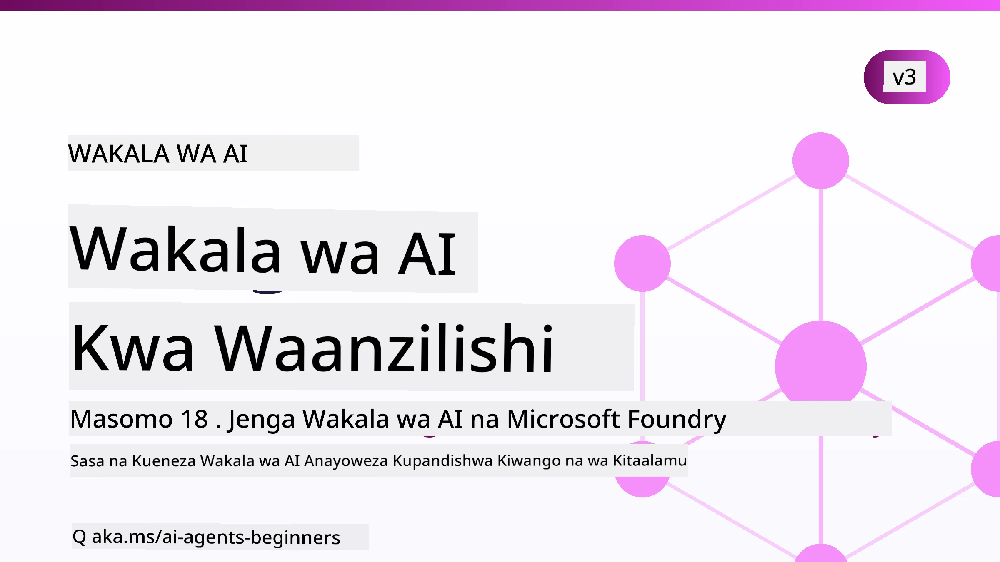

# Maajenti wa AI kwa Waanzilishi - Kozi



## Kozi inayofundisha kila kitu unachohitaji kujua kuanza kujenga Maajenti wa AI

[](https://github.com/microsoft/ai-agents-for-beginners/blob/master/LICENSE?WT.mc_id=academic-105485-koreyst)
[](https://GitHub.com/microsoft/ai-agents-for-beginners/graphs/contributors/?WT.mc_id=academic-105485-koreyst)
[](https://GitHub.com/microsoft/ai-agents-for-beginners/issues/?WT.mc_id=academic-105485-koreyst)
[](https://GitHub.com/microsoft/ai-agents-for-beginners/pulls/?WT.mc_id=academic-105485-koreyst)
[](http://makeapullrequest.com?WT.mc_id=academic-105485-koreyst)

### 🌐 Msaada wa Lugha Nyingi

#### Imeunganishwa kupitia Kitendo cha GitHub (Kiotomatiki & Kinabaki Kisasishwa Daima)

<!-- CO-OP TRANSLATOR LANGUAGES TABLE START -->
[Arabic](../ar/README.md) | [Bengali](../bn/README.md) | [Bulgarian](../bg/README.md) | [Burmese (Myanmar)](../my/README.md) | [Chinese (Simplified)](../zh-CN/README.md) | [Chinese (Traditional, Hong Kong)](../zh-HK/README.md) | [Chinese (Traditional, Macau)](../zh-MO/README.md) | [Chinese (Traditional, Taiwan)](../zh-TW/README.md) | [Croatian](../hr/README.md) | [Czech](../cs/README.md) | [Danish](../da/README.md) | [Dutch](../nl/README.md) | [Estonian](../et/README.md) | [Finnish](../fi/README.md) | [French](../fr/README.md) | [German](../de/README.md) | [Greek](../el/README.md) | [Hebrew](../he/README.md) | [Hindi](../hi/README.md) | [Hungarian](../hu/README.md) | [Indonesian](../id/README.md) | [Italian](../it/README.md) | [Japanese](../ja/README.md) | [Kannada](../kn/README.md) | [Khmer](../km/README.md) | [Korean](../ko/README.md) | [Lithuanian](../lt/README.md) | [Malay](../ms/README.md) | [Malayalam](../ml/README.md) | [Marathi](../mr/README.md) | [Nepali](../ne/README.md) | [Nigerian Pidgin](../pcm/README.md) | [Norwegian](../no/README.md) | [Persian (Farsi)](../fa/README.md) | [Polish](../pl/README.md) | [Portuguese (Brazil)](../pt-BR/README.md) | [Portuguese (Portugal)](../pt-PT/README.md) | [Punjabi (Gurmukhi)](../pa/README.md) | [Romanian](../ro/README.md) | [Russian](../ru/README.md) | [Serbian (Cyrillic)](../sr/README.md) | [Slovak](../sk/README.md) | [Slovenian](../sl/README.md) | [Spanish](../es/README.md) | [Swahili](./README.md) | [Swedish](../sv/README.md) | [Tagalog (Filipino)](../tl/README.md) | [Tamil](../ta/README.md) | [Telugu](../te/README.md) | [Thai](../th/README.md) | [Turkish](../tr/README.md) | [Ukrainian](../uk/README.md) | [Urdu](../ur/README.md) | [Vietnamese](../vi/README.md)

> **Unapendelea Kuiga Kwenye Kompyuta Binafsi?**
>
> Hii hazina ina tafsiri zaidi ya 50 za lugha ambazo huongeza kiasi kikubwa cha kupakua. Ili kuiga bila tafsiri, tumia sparse checkout:
>
> **Bash / macOS / Linux:**
> ```bash
> git clone --filter=blob:none --sparse https://github.com/microsoft/ai-agents-for-beginners.git
> cd ai-agents-for-beginners
> git sparse-checkout set --no-cone '/*' '!translations' '!translated_images'
> ```
>
> **CMD (Windows):**
> ```cmd
> git clone --filter=blob:none --sparse https://github.com/microsoft/ai-agents-for-beginners.git
> cd ai-agents-for-beginners
> git sparse-checkout set --no-cone "/*" "!translations" "!translated_images"
> ```
>
> Hii inakupa kila kitu unachohitaji kukamilisha kozi kwa upakuaji wa kasi zaidi.
<!-- CO-OP TRANSLATOR LANGUAGES TABLE END -->

**Ikiwa unataka lugha za ziada za tafsiri ziungewe mkono, zimetajwa [hapa](https://github.com/Azure/co-op-translator/blob/main/getting_started/supported-languages.md).**

[](https://GitHub.com/microsoft/ai-agents-for-beginners/watchers/?WT.mc_id=academic-105485-koreyst)
[](https://GitHub.com/microsoft/ai-agents-for-beginners/network/?WT.mc_id=academic-105485-koreyst)
[](https://GitHub.com/microsoft/ai-agents-for-beginners/stargazers/?WT.mc_id=academic-105485-koreyst)

[](https://discord.com/invite/ATgtXmAS5D)


## 🌱 Kuanzia

Kozi hii ina masomo yanayohusu misingi ya kujenga Maajenti wa AI. Kila somo linahusu mada yake, hivyo anza mahali popote unapotaka!

Kuna msaada wa lugha nyingi kwa kozi hii. Nenda kwa [lugha zinazopatikana hapa](#-multi-language-support).

Ikiwa huu ndio mara yako ya kwanza kujenga kwa kutumia mifano ya AI Inayotengeneza, angalia kozi yetu ya [Generative AI Kwa Waanzilishi](https://aka.ms/genai-beginners), ambayo ina masomo 21 juu ya kujenga kwa GenAI.

Usisahau [kutoa nyota (🌟) kwenye hazina hii](https://docs.github.com/en/get-started/exploring-projects-on-github/saving-repositories-with-stars?WT.mc_id=academic-105485-koreyst) na [kunakili hazina hii](https://github.com/microsoft/ai-agents-for-beginners/fork) ili kuendesha msimbo.

### Kutana na Wajifunza Wengine, Pata Majibu ya Maswali Yako

Ukikumbwa na shida au ukiwa na maswali kuhusu kujenga Maajenti wa AI, jiunge na Kituo chetu cha Discord kilicho maalum katika [Microsoft Foundry Discord](https://aka.ms/ai-agents/discord).

### Unachohitaji

Kila somo katika kozi hii lina mifano ya msimbo, ambayo unaweza kupata katika folda ya code_samples. Unaweza [kunakili hazina hii](https://github.com/microsoft/ai-agents-for-beginners/fork) ili kutengeneza nakala yako mwenyewe.

Mifano ya msimbo katika mazoezi haya inatumia Mfumo wa Maajenti wa Microsoft na Huduma ya Maajenti ya Microsoft Foundry V2:

- [Microsoft Foundry](https://aka.ms/ai-agents-beginners/ai-foundry) - Akaunti ya Azure Inahitajika

Kozi hii inatumia mifumo na huduma zifuatazo za AI Agent kutoka Microsoft:

- [Microsoft Agent Framework (MAF)](https://aka.ms/ai-agents-beginners/agent-framework)
- [Microsoft Foundry Agent Service V2](https://aka.ms/ai-agents-beginners/ai-agent-service)

Baadhi ya mifano ya msimbo pia inasaidia watoa huduma mbadala wanaoendana na OpenAI kama [MiniMax](https://platform.minimaxi.com/), anayetoa mifano ya muktadha mkubwa (hadi tokeni 204K). Angalia [Usanidi wa Kozi](./00-course-setup/README.md) kwa maelezo ya usanidi.

Kwa habari zaidi juu ya kuendesha msimbo wa kozi hii, nenda kwa [Usanidi wa Kozi](./00-course-setup/README.md).

## 🙏 Unataka kusaidia?

Je, una mapendekezo au umeona makosa ya tahajia au msimbo? [Tuma tatizo](https://github.com/microsoft/ai-agents-for-beginners/issues?WT.mc_id=academic-105485-koreyst) au [Tengeneza ombi la mabadiliko](https://github.com/microsoft/ai-agents-for-beginners/pulls?WT.mc_id=academic-105485-koreyst)


## 📂 Kila somo linajumuisha

- Somo la maandishi lililopo katika README na video fupi
- Mifano ya msimbo wa Python inayotumia Mfumo wa Maajenti wa Microsoft na Microsoft Foundry
- Viungo vya rasilimali za ziada ili kuendelea na mafunzo yako


## 🗃️ Masomo

| **Somo**                                   | **Maandishi & Msimbo**                                    | **Video**                                                  | **Mafunzo Zaidi**                                                                     |
|----------------------------------------------|----------------------------------------------------|------------------------------------------------------------|----------------------------------------------------------------------------------------|
| Utangulizi wa Maajenti wa AI na Matumizi yao | [Kiungo](./01-intro-to-ai-agents/README.md)          | [Video](https://youtu.be/3zgm60bXmQk?si=z8QygFvYQv-9WtO1)  | [Kiungo](https://aka.ms/ai-agents-beginners/collection?WT.mc_id=academic-105485-koreyst) |
| Kuchunguza Mifumo ya Maajenti wa AI              | [Kiungo](./02-explore-agentic-frameworks/README.md)  | [Video](https://youtu.be/ODwF-EZo_O8?si=Vawth4hzVaHv-u0H)  | [Kiungo](https://aka.ms/ai-agents-beginners/collection?WT.mc_id=academic-105485-koreyst) |
| Kuelewa Mifumo ya Ubunifu wa Maajenti wa AI     | [Kiungo](./03-agentic-design-patterns/README.md)     | [Video](https://youtu.be/m9lM8qqoOEA?si=BIzHwzstTPL8o9GF)  | [Kiungo](https://aka.ms/ai-agents-beginners/collection?WT.mc_id=academic-105485-koreyst) |
| Mfumo wa Ubunifu wa Matumizi ya Zana                      | [Kiungo](./04-tool-use/README.md)                    | [Video](https://youtu.be/vieRiPRx-gI?si=2z6O2Xu2cu_Jz46N)  | [Kiungo](https://aka.ms/ai-agents-beginners/collection?WT.mc_id=academic-105485-koreyst) |
| Agentic RAG                                  | [Kiungo](./05-agentic-rag/README.md)                 | [Video](https://youtu.be/WcjAARvdL7I?si=gKPWsQpKiIlDH9A3)  | [Kiungo](https://aka.ms/ai-agents-beginners/collection?WT.mc_id=academic-105485-koreyst) |
| Kujenga Maajenti wa AI wa Kuaminika               | [Kiungo](./06-building-trustworthy-agents/README.md) | [Video](https://youtu.be/iZKkMEGBCUQ?si=jZjpiMnGFOE9L8OK ) | [Kiungo](https://aka.ms/ai-agents-beginners/collection?WT.mc_id=academic-105485-koreyst) |
| Mfumo wa Ubunifu wa Mipango                      | [Kiungo](./07-planning-design/README.md)             | [Video](https://youtu.be/kPfJ2BrBCMY?si=6SC_iv_E5-mzucnC)  | [Kiungo](https://aka.ms/ai-agents-beginners/collection?WT.mc_id=academic-105485-koreyst) |
| Mfumo wa Ubunifu wa Maajenti Wengi                   | [Kiungo](./08-multi-agent/README.md)                 | [Video](https://youtu.be/V6HpE9hZEx0?si=rMgDhEu7wXo2uo6g)  | [Kiungo](https://aka.ms/ai-agents-beginners/collection?WT.mc_id=academic-105485-koreyst) |

| Mfano wa Ubunifu wa Metacognition           | [Link](./09-metacognition/README.md)               | [Video](https://youtu.be/His9R6gw6Ec?si=8gck6vvdSNCt6OcF)  | [Link](https://aka.ms/ai-agents-beginners/collection?WT.mc_id=academic-105485-koreyst) |
| Wakala wa AI Wakiwa Kazini                     | [Link](./10-ai-agents-production/README.md)        | [Video](https://youtu.be/l4TP6IyJxmQ?si=31dnhexRo6yLRJDl)  | [Link](https://aka.ms/ai-agents-beginners/collection?WT.mc_id=academic-105485-koreyst) |
| Kutumia Itifaki za Ageni (MCP, A2A na NLWeb) | [Link](./11-agentic-protocols/README.md)           | [Video](https://youtu.be/X-Dh9R3Opn8)                                 | [Link](https://aka.ms/ai-agents-beginners/collection?WT.mc_id=academic-105485-koreyst) |
| Uhandisi wa Muktadha kwa Wakala wa AI         | [Link](./12-context-engineering/README.md)         | [Video](https://youtu.be/F5zqRV7gEag)                                 | [Link](https://aka.ms/ai-agents-beginners/collection?WT.mc_id=academic-105485-koreyst) |
| Kusimamia Kumbukumbu ya Ageni                  | [Link](./13-agent-memory/README.md)     |      [Video](https://youtu.be/QrYbHesIxpw?si=vZkVwKrQ4ieCcIPx)                                                      |                                                                                        |
| Kuchunguza Mfumo wa Wakala wa Microsoft        | [Link](./14-microsoft-agent-framework/README.md)                            |                                                            |                                                                                        |
| Kujenga Wakala wa Matumizi ya Kompyuta (CUA)  | [Link](./15-browser-use/README.md)     |                                                            | [Link](https://docs.browser-use.com/examples/templates/playwright-integration)         |
| Kuweka Wakala Zinazoweza Kupanuka              | [Link](./16-deploying-scalable-agents/README.md) |                                                    | [Link](https://learn.microsoft.com/azure/ai-foundry/agents/overview)                   |
| Kuunda Wakala wa AI wa Kiwanda                 | [Link](./17-creating-local-ai-agents/README.md)  |                                                    | [Link](https://learn.microsoft.com/azure/ai-foundry/foundry-local/)                    |
| Kulinda Wakala wa AI                            | [Link](./18-securing-ai-agents/README.md)  |                                                            | [Link](https://aka.ms/ai-agents-beginners/collection?WT.mc_id=academic-105485-koreyst) |

## 🎒 Kozi Nyingine

Timu yetu hutengeneza kozi nyingine! Angalia:

<!-- CO-OP TRANSLATOR OTHER COURSES START -->
### LangChain
[](https://aka.ms/langchain4j-for-beginners)
[](https://aka.ms/langchainjs-for-beginners?WT.mc_id=m365-94501-dwahlin)
[](https://github.com/microsoft/langchain-for-beginners?WT.mc_id=m365-94501-dwahlin)
---

### Azure / Edge / MCP / Wakala
[](https://github.com/microsoft/AZD-for-beginners?WT.mc_id=academic-105485-koreyst)
[](https://github.com/microsoft/edgeai-for-beginners?WT.mc_id=academic-105485-koreyst)
[](https://github.com/microsoft/mcp-for-beginners?WT.mc_id=academic-105485-koreyst)
[](https://github.com/microsoft/ai-agents-for-beginners?WT.mc_id=academic-105485-koreyst)

---
 
### Mfululizo wa AI Inayozalisha
[](https://github.com/microsoft/generative-ai-for-beginners?WT.mc_id=academic-105485-koreyst)
[-9333EA?style=for-the-badge&labelColor=E5E7EB&color=9333EA)](https://github.com/microsoft/Generative-AI-for-beginners-dotnet?WT.mc_id=academic-105485-koreyst)
[-C084FC?style=for-the-badge&labelColor=E5E7EB&color=C084FC)](https://github.com/microsoft/generative-ai-for-beginners-java?WT.mc_id=academic-105485-koreyst)
[-E879F9?style=for-the-badge&labelColor=E5E7EB&color=E879F9)](https://github.com/microsoft/generative-ai-with-javascript?WT.mc_id=academic-105485-koreyst)

---
 
### Kujifunza Msingi
[](https://aka.ms/ml-beginners?WT.mc_id=academic-105485-koreyst)
[](https://aka.ms/datascience-beginners?WT.mc_id=academic-105485-koreyst)
[](https://aka.ms/ai-beginners?WT.mc_id=academic-105485-koreyst)
[](https://github.com/microsoft/Security-101?WT.mc_id=academic-96948-sayoung)
[](https://aka.ms/webdev-beginners?WT.mc_id=academic-105485-koreyst)
[](https://aka.ms/iot-beginners?WT.mc_id=academic-105485-koreyst)
[](https://github.com/microsoft/xr-development-for-beginners?WT.mc_id=academic-105485-koreyst)

---
 
### Mfululizo wa Copilot
[](https://aka.ms/GitHubCopilotAI?WT.mc_id=academic-105485-koreyst)
[](https://github.com/microsoft/mastering-github-copilot-for-dotnet-csharp-developers?WT.mc_id=academic-105485-koreyst)
[](https://github.com/microsoft/CopilotAdventures?WT.mc_id=academic-105485-koreyst)
<!-- CO-OP TRANSLATOR OTHER COURSES END -->

## 🌟 Shukrani za Jumuiya

Shukrani kwa [Shivam Goyal](https://www.linkedin.com/in/shivam2003/) kwa kuchangia sampuli muhimu za msimbo zinazothibitisha Agentic RAG. 

## Kuchangia

Mradi huu unakaribisha michango na mapendekezo. Michango mingi inahitaji utakubaliana na
Makubaliano ya Leseni ya Mchango (CLA) yanayoeleza kuwa una haki, na kwa kweli unatoa,
haki za kutumia mchango wako. Kwa maelezo, tembelea <https://cla.opensource.microsoft.com>.

Unapowasilisha ombi la kuvuta, bot ya CLA itagundua moja kwa moja ikiwa unahitaji kutoa
CLA na kuandaa PR ipasavyo (mfano, ukaguzi wa hali, maoni). Fuata tu maelekezo
yanayotolewa na bot. Hii utahitaji kuifanya mara moja tu kwa njia zote za kuhifadhi za kutumia CLA yetu.

Mradi huu umechukua [Kanuni ya Maadili ya Chanzo Huria ya Microsoft](https://opensource.microsoft.com/codeofconduct/).
Kwa taarifa zaidi angalia [Maswali Yanayoulizwa Mara kwa Mara kuhusu Kanuni ya Maadili](https://opensource.microsoft.com/codeofconduct/faq/) au
wasiliana na [opencode@microsoft.com](mailto:opencode@microsoft.com) kwa maswali au maoni zaidi.

## Alama Zaidi ya Biashara

Mradi huu unaweza kuwa na alama za biashara au nembo za miradi, bidhaa, au huduma. Matumizi yaliyothibitishwa ya alama za biashara
au nembo za Microsoft yanategemea na yanapaswa kufuata
[Mwongozo wa Alama za Biashara na Brand za Microsoft](https://www.microsoft.com/legal/intellectualproperty/trademarks/usage/general).
Matumizi ya alama za biashara au nembo za Microsoft katika matoleo yaliyorekebishwa ya mradi huu hayapaswi kusababisha mkanganyiko au kuashiria udhamini wa Microsoft.
Matumizi yoyote ya alama au nembo za wahusika wa tatu yanategemea sera za wahusika hao.

## Kupata Msaada


Ikiwa utakwama au una maswali yoyote kuhusu kujenga programu za AI, jiunge na:

[](https://aka.ms/foundry/discord)

Ikiwa una maoni kuhusu bidhaa au makosa wakati wa kujenga tembelea:

[](https://aka.ms/foundry/forum)

---

<!-- CO-OP TRANSLATOR DISCLAIMER START -->
**Kionyozo**:
Hati hii imetafsiriwa kwa kutumia huduma ya tafsiri ya AI [Co-op Translator](https://github.com/Azure/co-op-translator). Ingawa tunajitahidi kupata usahihi, tafadhali fahamu kwamba tafsiri za kiotomatiki zinaweza kuwa na makosa au upungufu wa usahihi. Hati ya asili katika lugha yake halisi inapaswa kuchukuliwa kama chanzo cha mamlaka. Kwa taarifa muhimu, tafsiri ya kitaalamu inayofanywa na binadamu inapendekezwa. Hatutojibu kwa kuelewa vibaya au tafsiri potofu zinazotokea kutokana na matumizi ya tafsiri hii.
<!-- CO-OP TRANSLATOR DISCLAIMER END -->