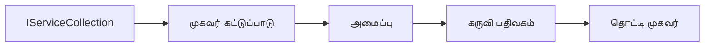

# 🎨 Azure OpenAI (Responses API) உடன் Agentic வடிவமைப்பு மாதிரிகள் (.NET)

## 📋 கற்றல் இலக்குகள்

இந்த உதாரணம் Microsoft Agent Framework ஐ .NET உடன் Azure OpenAI (Responses API) ஒருங்கிணைப்புடன் பயன்படுத்தி நுண்ணறிவு முகவர்கள் உருவாக்குவதற்கான நிறுவன தரமான வடிவமைப்பு மாதிரிகளை விளக்குகிறது. முகவர்கள் உற்பத்திக்கு தயாரான, பராமரிக்கக்கூடிய மற்றும் பரிமாணக்கூடியவையாக மாற்றும் தொழில்முறை மாதிரிகள் மற்றும் கட்டமைப்பு நடைமுறைகளை நீங்கள் கற்றுக்கொள்ளுவீர்கள்.

### நிறுவன வடிவமைப்பு மாதிரிகள்

- 🏭 **Factory Pattern**: சார்புகள் ஊடுருவலுடன் நிலையான முகவர் உருவாக்கம்
- 🔧 **Builder Pattern**: மிதமான முகவர் அமைப்பு மற்றும் வடிவமைப்பு
- 🧵 **Thread-Safe Patterns**: ஒரே சமய உரையாடல் நிர்வாகம்
- 📋 **Repository Pattern**: ஸீரியான கருவி மற்றும் திறன் நிர்வாகம்

## 🎯 .NET-இற்கான சிறப்பான கட்டமைப்புத் தன்மைகள்

### நிறுவன அம்சங்கள்

- **வலுவான டைப்பிங்**: தொகுப்பு நேரத்தில் சரிபார்ப்பு மற்றும் IntelliSense ஆதரவு
- **சார்பு ஊடுருவல்**: அடர்த்தியான DI கண்டெய்னர் ஒருங்கிணைப்பு
- **கட்டமைப்பு நிர்வாகம்**: IConfiguration மற்றும் Options மாதிரிகள்
- **Async/Await**: முதன்மை அசிங்க்ரோனஸ் நிரலாக்க ஆதரவு

### உற்பத்திக்கு தயாரான மாதிரிகள்

- **சுற்றறிக்கை ஒருங்கிணைப்பு**: ILogger மற்றும் கட்டமைக்கப்பட்ட சுற்றறிக்கை ஆதரவு
- **நிலைப்படுத்தல் சோதனைகள்**: அமைக்கப்பட்ட கண்காணிப்பு மற்றும் பகுப்பாய்வு
- **கட்டமைப்பு சரிபார்ப்பு**: வலுவான டைப்பிங் மற்றும் தரவு குறியீடுகள்
- **பிழை கையாண்டல்**: கட்டமைக்கப்பட்ட விளக்கம் நிர்வாகம்

## 🔧 தொழில்நுட்ப கட்டமைப்பு

### முதன்மை .NET கூறுகள்

- **Microsoft.Extensions.AI**: ஒருங்கிணைக்கப்பட்ட AI சேவை மாதிரிகள்
- **Microsoft.Agents.AI**: நிறுவன முகவர் ஒருங்கிணைப்பு கட்டமைப்பு
- **Azure OpenAI (Responses API)**: உயர் செயல்திறன் API கிளையன்ட் மாதிரிகள்
- **கட்டமைப்பு முறைமை**: appsettings.json மற்றும் சுற்றுச்சூழல் ஒருங்கிணைப்பு

### வடிவமைப்பு மாதிரி செயலாக்கம்



## 🏗️ நிறுவனம் காட்டியுள்ள மாதிரிகள்

### 1. **உருவாக்கும் மாதிரிகள்**

- **Agent Factory**: ஒரேமுறையான கட்டமைப்புடன் மையமிட்ட முகவர் உருவாக்கம்
- **Builder Pattern**: சிக்கலான முகவர் கட்டமைப்புக்கு மென்மையான API
- **Singleton Pattern**: பகிரப்பட்ட வளங்கள் மற்றும் கட்டமைப்பு நிர்வாகம்
- **Dependency Injection**: தவிர்க்கக்கூடிய கூட்டுரை மற்றும் சோதனைமுறைம்

### 2. **நடத்தும் மாதிரிகள்**

- **Strategy Pattern**: மாற்றக்கூடிய கருவி செயல்பாட்டு திட்டங்கள்
- **Command Pattern**: மறுசீரமைப்பு/திருத்தத்துடன் முகவர் செயல்பாடுகள் அடுக்கம்
- **Observer Pattern**: நிகழ்வு சார்ந்த முகவர் வாழ்க்கைச் சுழற்சி நிர்வாகம்
- **Template Method**: ஒருங்குறும்பான முகவர் செயல்பாட்டு செயல்முறைகள்

### 3. **உடைத்தமைவு மாதிரிகள்**

- **Adapter Pattern**: Azure OpenAI (Responses API) ஒருங்கிணைப்பு அடுக்கு
- **Decorator Pattern**: முகவர் திறன் மேம்பாடு
- **Facade Pattern**: எளிமையான முகவர் இடைமுகங்கள்
- **Proxy Pattern**: செயல்திறனை உயர்த்தும் மந்த நடவடிக்கை மற்றும் தேவைபூச்சி

## 📚 .NET வடிவமைப்பு கோட்பாடுகள்

### SOLID கோட்பாடுகள்

- **ஒருமை பொறுப்பு**: ஒவ்வொரு கூறும் தெளிவான நோக்கத்துடன்
- **திறந்த/மூடிய**: மாற்றமின்றி விரிவாக்கக்கூடியது
- **Liskov நிலைபேறு**: இடைமுக அடிப்படையிலான கருவி செயல்பாடுகள்
- **இடைமுக பிரிப்பாய்வு**: கவனிக்கப்பட்ட, ஒருங்கிணைந்த இடைமுகங்கள்
- **சார்பு மாற்றம்**: வகைப்படுத்தலை அல்லாது குறிக்கப்பட்டவற்றை சாரவும்

### தூய கட்டமைப்பு

- **கோட்பாடு நிலை**: முதன்மை முகவர் மற்றும் கருவி மாதிரிகள்
- **விண்ணப்ப நிலை**: முகவர் ஒருங்கிணைப்பு மற்றும் செயல்முறைகள்
- **உயிர்க்கட்டமைப்பு நிலை**: Azure OpenAI (Responses API) ஒருங்கிணைப்பு மற்றும் வெளிப்புற சேவைகள்
- **தொகுப்பு நிலை**: பயனர் தொடர்பு மற்றும் பதில் வடிவமைப்பு

## 🔒 நிறுவன பரிசீலனைகள்

### பாதுகாப்பு

- **சான்றிதழ் நிர்வாகம்**: IConfiguration உடன் பாதுகாப்பான API முக்கியம் கையாள்தல்
- **உள்ளீட்டுச் சரிபார்ப்பு**: வலுவான டைப்பிங் மற்றும் தரவு குறியீட்டு சரிபார்ப்பு
- **வெளியீடு சுத்திகரிப்பு**: பாதுகாப்பான பதில் செயலாக்கம் மற்றும் வடிகட்டி
- **ஆடிட் சுற்றறிக்கை**: முழுமையான செயல்பாட்டு கண்காணிப்பு

### செயல்திறன்

- **Async மாதிரிகள்**: தடை இல்லாத I/O செயல்பாடுகள்
- **இணைப்பு குளியல்**: திறமையான HTTP கிளையன்ட் நிர்வாகம்
- **தேவைபூச்சி**: மேம்படுத்தப்பட்ட செயல்திறனுக்கு பதில் தேவைபூச்சி
- **வளம் நிர்வாகம்**: சரியான வெளியேற்றல் மற்றும் சுத்தம் வடிவமைப்புகள்

### பரிமாணக்கூடிய தன்மை

- **தூடை பாதுகாப்பு**: ஒருங்கிணைந்த முகவர் செயல்பாடு ஆதரவு
- **வளம் சேமிப்பு**: திறமையான வளப் பயன்பாடு
- **பொதி நிர்வாகம்**: வீதக் கட்டுப்பாடு மற்றும் பின்னாம்பெருக்கு கையாள்தல்
- **கண்காணிப்பு**: செயல்திறன் அளவுகோல்கள் மற்றும் நிலைப்படுத்தல் சோதனைகள்

## 🚀 உற்பத்தி சமர்ப்பிப்பு

- **கட்டமைப்பு நிர்வாகம்**: சூழல்-சரியான அமைப்புகள்
- **சுற்றறிக்கை தந்திரம்**: ஒத்துழைப்பு IDகளுடன் கட்டமைக்கப்பட்ட சுற்றறிக்கை
- **பிழை கையாள்தல்**: சர்வதேச விளக்கம் கையாள்தல் மற்றும் சரியான மீட்பு
- **கண்காணிப்பு**: விண்ணப்பத் தகவல்கள் மற்றும் செயல்திறன் கணக்கீடுகள்
- **சோதனை**: அலகு சோதனைகள், ஒருங்கிணைப்பு சோதனைகள் மற்றும் பொதி சோதனை மாதிரிகள்

.NET உடன் நிறுவன தரமான நுண்ணறிவு முகவர்களை உருவாக்க தயாரா? வலுவான கட்டமைப்பை உருவாக்குவோம்! 🏢✨

## 🚀 தொடங்குவதற்கான வழிமுறை

### முன் நிபந்தனைகள்

- [.NET 10 SDK](https://dotnet.microsoft.com/download/dotnet/10.0) அல்லது மேலே
- Azure OpenAI வளத்துடன் Azure சந்தா மற்றும் மாதிரி சமர்ப்பிப்பு
- [Azure CLI](https://learn.microsoft.com/cli/azure/install-azure-cli) — `az login` கொண்டு உள்நுழையவும்

### தேவையான சுற்றுச்சூழல் மாறிகள்

```bash
# zsh/bash
export AZURE_OPENAI_ENDPOINT=https://<your-resource>.openai.azure.com
export AZURE_OPENAI_DEPLOYMENT=gpt-5-mini
# பிறகு AzureCliCredential ஒரு டோக்கன் பெற உள்நுழைக
az login
```

```powershell
# பவர்Shell
$env:AZURE_OPENAI_ENDPOINT = "https://<your-resource>.openai.azure.com"
$env:AZURE_OPENAI_DEPLOYMENT = "gpt-5-mini"
# அதனால் AzureCliCredential ஒரு டோக்கன் பெற சைன் இன் செய்யவும்
az login
```

### மாதிரி குறியீடு

குறியீடு உதாரணத்தை இயக்க,

```bash
# zsh/bash
chmod +x ./03-dotnet-agent-framework.cs
./03-dotnet-agent-framework.cs
```

அல்லது dotnet CLI உபயோகித்தல்:

```bash
dotnet run ./03-dotnet-agent-framework.cs
```

முழு குறியீட்டுக்கு [`03-dotnet-agent-framework.cs`](../../../../03-agentic-design-patterns/code_samples/03-dotnet-agent-framework.cs) பார்க்கவும்.

```csharp
#!/usr/bin/dotnet run

#:package Microsoft.Extensions.AI@10.*
#:package Microsoft.Agents.AI.OpenAI@1.*-*
#:package Azure.AI.OpenAI@2.1.0
#:package Azure.Identity@1.13.1

using System.ComponentModel;

using Microsoft.Agents.AI;
using Microsoft.Extensions.AI;

using Azure.AI.OpenAI;
using Azure.Identity;

// Tool Function: Random Destination Generator
// This static method will be available to the agent as a callable tool
// The [Description] attribute helps the AI understand when to use this function
// This demonstrates how to create custom tools for AI agents
[Description("Provides a random vacation destination.")]
static string GetRandomDestination()
{
    // List of popular vacation destinations around the world
    // The agent will randomly select from these options
    var destinations = new List<string>
    {
        "Paris, France",
        "Tokyo, Japan",
        "New York City, USA",
        "Sydney, Australia",
        "Rome, Italy",
        "Barcelona, Spain",
        "Cape Town, South Africa",
        "Rio de Janeiro, Brazil",
        "Bangkok, Thailand",
        "Vancouver, Canada"
    };

    // Generate random index and return selected destination
    // Uses System.Random for simple random selection
    var random = new Random();
    int index = random.Next(destinations.Count);
    return destinations[index];
}

// Azure OpenAI with the Responses API (stable v1 endpoint). Sign in with `az login`.
var azureEndpoint = Environment.GetEnvironmentVariable("AZURE_OPENAI_ENDPOINT")
    ?? throw new InvalidOperationException("AZURE_OPENAI_ENDPOINT is not set.");
var deployment = Environment.GetEnvironmentVariable("AZURE_OPENAI_DEPLOYMENT") ?? "gpt-5-mini";

var azureClient = new AzureOpenAIClient(new Uri(azureEndpoint), new AzureCliCredential());

// Define Agent Identity and Comprehensive Instructions
// Agent name for identification and logging purposes
var AGENT_NAME = "TravelAgent";

// Detailed instructions that define the agent's personality, capabilities, and behavior
// This system prompt shapes how the agent responds and interacts with users
var AGENT_INSTRUCTIONS = """
You are a helpful AI Agent that can help plan vacations for customers.

Important: When users specify a destination, always plan for that location. Only suggest random destinations when the user hasn't specified a preference.

When the conversation begins, introduce yourself with this message:
"Hello! I'm your TravelAgent assistant. I can help plan vacations and suggest interesting destinations for you. Here are some things you can ask me:
1. Plan a day trip to a specific location
2. Suggest a random vacation destination
3. Find destinations with specific features (beaches, mountains, historical sites, etc.)
4. Plan an alternative trip if you don't like my first suggestion

What kind of trip would you like me to help you plan today?"

Always prioritize user preferences. If they mention a specific destination like "Bali" or "Paris," focus your planning on that location rather than suggesting alternatives.
""";

// Create AI Agent with Advanced Travel Planning Capabilities
// Get the Responses client for the deployment and create the AI agent
// Configure agent with name, detailed instructions, and available tools
// This demonstrates the .NET agent creation pattern with full configuration
AIAgent agent = azureClient
    .GetChatClient(deployment)
    .AsAIAgent(
        name: AGENT_NAME,
        instructions: AGENT_INSTRUCTIONS,
        tools: [AIFunctionFactory.Create(GetRandomDestination)]
    );

// Create New Conversation Session for Context Management
// Initialize a new conversation session to maintain context across multiple interactions
// Sessions enable the agent to remember previous exchanges and maintain conversational state
// This is essential for multi-turn conversations and contextual understanding
var session = await agent.CreateSessionAsync();

// Execute Agent: First Travel Planning Request
// Run the agent with an initial request that will likely trigger the random destination tool
// The agent will analyze the request, use the GetRandomDestination tool, and create an itinerary
// Using the session parameter maintains conversation context for subsequent interactions
await foreach (var update in agent.RunStreamingAsync("Plan me a day trip", session))
{
    await Task.Delay(10);
    Console.Write(update);
}

Console.WriteLine();

// Execute Agent: Follow-up Request with Context Awareness
// Demonstrate contextual conversation by referencing the previous response
// The agent remembers the previous destination suggestion and will provide an alternative
// This showcases the power of conversation sessions and contextual understanding in .NET agents
await foreach (var update in agent.RunStreamingAsync("I don't like that destination. Plan me another vacation.", session))
{
    await Task.Delay(10);
    Console.Write(update);
}
```

---

<!-- CO-OP TRANSLATOR DISCLAIMER START -->
**மறுப்பு**:
இந்த ஆவணம் AI மொழிபெயர்ப்பு சேவை [Co-op Translator](https://github.com/Azure/co-op-translator) பயன்படுத்தி மொழிபெயர்க்கப்பட்டுள்ளது. நாங்கள் துல்லியத்திற்காக முயற்சி செய்துள்ளோம், ஆனால் தானாக செய்யப்படும் மொழிபெயர்ப்புகளில் பிழைகள் அல்லது தவறுகள் இருக்கலாம் என்பதை கவனத்தில் கொள்ளவும். அசல் ஆவணம் அதன் தாய்மொழியில் அதிகாரப்பூர்வ ஆதாரமாக கருதப்பட வேண்டும். முக்கியமான தகவல்களுக்கு, தொழில்நுட்பமான மனித மொழிபெயர்ப்பு பரிந்துரைக்கப்படுகிறது. இந்த மொழிபெயர்ப்பைப் பயன்படுத்துவதால் ஏற்படும் எந்த தவறான புரிதல்கள் அல்லது தவறான விளக்கத்திற்கும் நாங்கள் பொறுப்பில்வில்லை.
<!-- CO-OP TRANSLATOR DISCLAIMER END -->