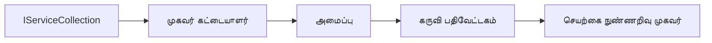

# 🎨 Azure OpenAI (Responses API) உடன் Agentic வடிவமைப்பு வடிவங்கள் (.NET)

## 📋 கற்றல் நோக்கங்கள்

இந்த எடுத்துக்காட்டு Microsoft Agent Framework ஐ பயன்படுத்தி .NET இல் Azure OpenAI (Responses API) ஒருங்கிணைப்புடன் அறிவு வாய்ந்த முகவரிகளை உருவாக்கும் தொழில் நிலை வடிவமைப்பு வடிவங்களை காண்பிக்கிறது. முகவரிகளை உற்பத்திக்குத் தயாரானவை, பராமரிக்கக்கூடியவை மற்றும் அளவிடக்கூடியவையாக மாற்றும் வணிகச் சான்றிதழ் வடிவங்கள் மற்றும் கட்டிடச் செயல்முறைகளை நீங்கள் கற்றுக் கொள்வீர்கள்.

### தொழில் நிலை வடிவமைப்பு வடிவங்கள்

- 🏭 **Factory Pattern**: சார்பு ஊற்றும் வழியாக ஒருங்கிணைந்த முகவர் உருவாக்கல்
- 🔧 **Builder Pattern**: மென்மையான முகவர் கட்டமைப்பு மற்றும் அமைப்பு
- 🧵 **Thread-Safe Patterns**: ஒருங்கிணைந்த உரையாடல் மேலாண்மை
- 📋 **Repository Pattern**: தொகுக்கப்பட்ட கருவி மற்றும் திறன் மேலாண்மை

## 🎯 .NET-க்குரிய கட்டிட நன்மைகள்

### தொழில் நிலை அம்சங்கள்

- **தாங்குமுறை வகை (Strong Typing)**: தொகுப்பு நேர சரிபார்ப்பு மற்றும் IntelliSense ஆதரவு
- **சார்பு ஊற்றல் (Dependency Injection)**: உட்படுத்தப்பட்ட DI கன்டெய்னர் ஒருங்கிணைப்பு
- **கட்டமைப்பு மேலாண்மை**: IConfiguration மற்றும் Options வடிவமைப்புகள்
- **Async/Await**: முதன்மை அசிங்க்ரோனஸ் நிரலாக்க ஆதரவு

### உற்பத்தி-தயார் வடிவங்கள்

- **உள்ளடக்கலோகம் (Logging) ஒருங்கிணைப்பு**: ILogger மற்றும் கட்டமைக்கப்பட்ட உள்ளடக்கலோகம் ஆதரவு
- **ஆரோக்கிய பரிசோதனைகள் (Health Checks)**: உட்பட்ட கண்காணிப்பு மற்றும் தனி நுண்ணறி
- **கட்டமைப்பு சரிபார்ப்பு (Configuration Validation)**: தரவு குறிப்புறுத்தலுடன் கூடிய வலுவான வகை
- **பிழை கையாளுதல்**: கட்டமைக்கப்பட்ட தவறு மேலாண்மை

## 🔧 தொழில்நுட்ப கட்டமைப்பு

### மூல .NET கூறுகள்

- **Microsoft.Extensions.AI**: ஒருங்கிணைந்த AI சேவை சுருக்கங்கள்
- **Microsoft.Agents.AI**: தொழில் நிலை முகவர் ஒருங்கிணைப்பு கட்டமைப்பு
- **Azure OpenAI (Responses API)**: திறம்பட செயல்படும் API வாடிக்கையாளர் வடிவங்கள்
- **கட்டமைப்பு முறைமை**: appsettings.json மற்றும் சூழல் ஒருங்கிணைப்பு

### வடிவமைப்பு வடிவம் அமலாக்கம்



## 🏗️ காண்பிக்கப்பட்ட தொழில்நிலை வடிவங்கள்

### 1. **உருவாக்கும் வடிவங்கள்**

- **Agent Factory**: ஒருமித்தமான கட்டமைப்புடன் மையமாக்கப்பட்ட முகவர் உருவாக்கல்
- **Builder Pattern**: சிக்கலான முகவர் கட்டமைப்புக்கான மென்மையான API
- **Singleton Pattern**: பகிரப்பட்ட வளங்கள் மற்றும் கட்டமைப்பு மேலாண்மை
- **Dependency Injection**: தளர்வான இணைப்பு மற்றும் சோதனைக்கூடிய தன்மை

### 2. **செல்கை வடிவங்கள்**

- **Strategy Pattern**: பரிமாறக்கூடிய கருவி அமல்படுத்தும் அடிப்படைகள்
- **Command Pattern**: முன்கூட்டிய/மீள்செயல்படுத்தும் கடமைச் செயல்பாடுகள்
- **Observer Pattern**: நிகழ்வு சார்ந்த முகவர் வாழ்நாள் மேலாண்மை
- **Template Method**: ஒருங்கிணைந்த முகவர் செயலாக்க பணிகள்

### 3. **கட்டமைப்பு வடிவங்கள்**

- **Adapter Pattern**: Azure OpenAI (Responses API) ஒருங்கிணைப்பு அடுக்கானது
- **Decorator Pattern**: முகவர் திறன் மேம்படுத்து
- **Facade Pattern**: எளிமைப்படுத்தப்பட்ட முகவர் தொடர்பு முகப்புகள்
- **Proxy Pattern**: செயல்திறனுக்கான சுருங்கிய ஏற்றும் மற்றும் சேமிப்பு

## 📚 .NET வடிவமைப்பு நெறிமுறைகள்

### SOLID நெறிமுறைகள்

- **ஒற்றை பொறுப்பு**: ஒவ்வொரு கூறுக்கும் ஒரு தெளிவான நோக்கம்
- **திறந்த/ மூடப்பட்ட**: மாற்றமின்றி விரிவாக்கக்கூடியது
- **Liskov Substitution**: இடைமுகத் தொழில்நுட்ப கருவி செயல்பாடுகள்
- **Interface Segregation**: கவனம் செலுத்திய, ஒருங்கிணைந்த இடைமுகங்கள்
- **Dependency Inversion**: வடிவுப்படுத்தல்களில் சார dependence

### சுத்தமான கட்டமைப்பு

- **அறிமுக அடுக்கு**: மைய முகவர் மற்றும் கருவி சுருக்கங்கள்
- **விண்ணப்ப அடுக்கு**: முகவர் ஒருங்கிணைப்பு மற்றும் செயல்முறைகள்
- **அடைக்கலம் அடுக்கு**: Azure OpenAI (Responses API) ஒருங்கிணைப்பு மற்றும் வெளிப்புற சேவைகள்
- **தெரிவிப்பு அடுக்கு**: பயனர் தொடர்பு மற்றும் பதில் வடிவமைப்பு

## 🔒 தொழில்நிலை கருத்துக்கள்

### பாதுகாப்பு

- **அங்கீகாரம் மேலாண்மை**: IConfiguration உடன் API விசை பாதுகாப்பு கையாளல்
- **உள்ளீடு சரிபார்ப்பு**: வலுவான வகை மற்றும் தரவு குறிப்புறுத்தல் சரிபார்ப்பு
- **வெளியீடு துப்புரவு**: பாதுகாப்பான பதில் செயலாக்கம் மற்றும் வடிகட்டி
- **ஆடிட் உள்ளடக்கல்**: விரிவான செயல்பாடு கண்காணிப்பு

### செயல்திறன்

- **Async வடிவங்கள்**: தடையில்லா I/O செயலிகள்
- **கொணெக்ஷன் தேரிக்கல்**: திறம்பட HTTP வாடிக்கையாளர் மேலாண்மை
- **சேமிப்பு**: செயல்திறனை மேம்படுத்த பதில் சேமிப்பு
- **வள மேலாண்மை**: சரியான அகற்றல் மற்றும் சுத்திகரிப்பு வடிவங்கள்

### அளவிடுகையகம்

- **Thread Safety**: ஒருங்கிணைந்த முகவர் செயலாக்க ஆதரவு
- **வளத் தொகுப்பு**: திறம்பட வள பயன்பாடு
- **புழக்கம் மேலாண்மை**: வீதம் கட்டுப்பாடு மற்றும் பின்செப்புக் கையாளுதல்
- **கண்காணிப்பு**: செயல்திறன் அளவைகள் மற்றும் ஆரோக்கிய பரிசோதனைகள்

## 🚀 உற்பத்தி பிரிக்கப்பட்ட பிரதி

- **கட்டமைப்பு மேலாண்மை**: சூழல்-விசேட அமைப்புகள்
- **உள்ளடக்கலோகம் திட்டம்**: தொடர்பு அடையாளங்களுடன் கட்டமைக்கப்பட்ட உள்ளடக்கலோகம்
- **பிழை கையாளுதல்**: சரியான மீட்பு உடன் உலகளாவிய தவறு மேலாண்மை
- **கண்காணிப்பு**: பயன்பாட்டு தெளிவுகள் மற்றும் செயல்திறன் கணக்கெடுப்புகள்
- **சோதனை**: அலகு சோதனைகள், ஒருங்கிணைந்த சோதனைகள் மற்றும் ஏற்றுதல் சோதனை வடிவங்கள்

.NET உடன் தொழில்நிலை நிலை அறிவாற்றல் முகவரிகளை உருவாக்க தயாரா? வாருங்கள் ஒரு உறுதியான கட்டமைப்பை வடிவமைப்போம்! 🏢✨

## 🚀 துவக்கம்

### தேவையானவை

- [.NET 10 SDK](https://dotnet.microsoft.com/download/dotnet/10.0) அல்லது அதற்கு மேல்
- Azure OpenAI வளம் மற்றும் மாதிரி பிரயோகத்துடன் ஒரு [Azure சந்தா](https://azure.microsoft.com/free/)
- [Azure CLI](https://learn.microsoft.com/cli/azure/install-azure-cli) — `az login` கொண்டு உள்நுழைக

### தேவையான சூழல் மாறிகள்

```bash
# zsh/bash
export AZURE_OPENAI_ENDPOINT=https://<your-resource>.openai.azure.com
export AZURE_OPENAI_DEPLOYMENT=gpt-4.1-mini
# பின்னர் AzureCliCredential ஒரு டோக்கனை பெற ஸைன்இன் செய்யவும்
az login
```

```powershell
# பவர் ஷெல்
$env:AZURE_OPENAI_ENDPOINT = "https://<your-resource>.openai.azure.com"
$env:AZURE_OPENAI_DEPLOYMENT = "gpt-4.1-mini"
# அதன் பிறகு AzureCliCredential ஒரு டோக்கனைப் பெற உள்நுழைக
az login
```

### உதாரணக் குறியீடு

குறியீடு எடுத்துக்காட்டை இயக்க,

```bash
# zsh/bash
chmod +x ./03-dotnet-agent-framework.cs
./03-dotnet-agent-framework.cs
```

அல்லது dotnet CLI பயன்படுத்தி:

```bash
dotnet run ./03-dotnet-agent-framework.cs
```

முழுமையான குறியீட்டுக்கு [`03-dotnet-agent-framework.cs`](../../../../03-agentic-design-patterns/code_samples/03-dotnet-agent-framework.cs) ஐ பாருங்கள்.

```csharp
#!/usr/bin/dotnet run

#:package Microsoft.Extensions.AI@10.*
#:package Microsoft.Agents.AI.OpenAI@1.*-*
#:package Azure.AI.OpenAI@2.1.0
#:package Azure.Identity@1.13.1

using System.ComponentModel;

using Microsoft.Agents.AI;
using Microsoft.Extensions.AI;

using Azure.AI.OpenAI;
using Azure.Identity;

// Tool Function: Random Destination Generator
// This static method will be available to the agent as a callable tool
// The [Description] attribute helps the AI understand when to use this function
// This demonstrates how to create custom tools for AI agents
[Description("Provides a random vacation destination.")]
static string GetRandomDestination()
{
    // List of popular vacation destinations around the world
    // The agent will randomly select from these options
    var destinations = new List<string>
    {
        "Paris, France",
        "Tokyo, Japan",
        "New York City, USA",
        "Sydney, Australia",
        "Rome, Italy",
        "Barcelona, Spain",
        "Cape Town, South Africa",
        "Rio de Janeiro, Brazil",
        "Bangkok, Thailand",
        "Vancouver, Canada"
    };

    // Generate random index and return selected destination
    // Uses System.Random for simple random selection
    var random = new Random();
    int index = random.Next(destinations.Count);
    return destinations[index];
}

// Azure OpenAI with the Responses API (stable v1 endpoint). Sign in with `az login`.
var azureEndpoint = Environment.GetEnvironmentVariable("AZURE_OPENAI_ENDPOINT")
    ?? throw new InvalidOperationException("AZURE_OPENAI_ENDPOINT is not set.");
var deployment = Environment.GetEnvironmentVariable("AZURE_OPENAI_DEPLOYMENT") ?? "gpt-4.1-mini";

var azureClient = new AzureOpenAIClient(new Uri(azureEndpoint), new AzureCliCredential());

// Define Agent Identity and Comprehensive Instructions
// Agent name for identification and logging purposes
var AGENT_NAME = "TravelAgent";

// Detailed instructions that define the agent's personality, capabilities, and behavior
// This system prompt shapes how the agent responds and interacts with users
var AGENT_INSTRUCTIONS = """
You are a helpful AI Agent that can help plan vacations for customers.

Important: When users specify a destination, always plan for that location. Only suggest random destinations when the user hasn't specified a preference.

When the conversation begins, introduce yourself with this message:
"Hello! I'm your TravelAgent assistant. I can help plan vacations and suggest interesting destinations for you. Here are some things you can ask me:
1. Plan a day trip to a specific location
2. Suggest a random vacation destination
3. Find destinations with specific features (beaches, mountains, historical sites, etc.)
4. Plan an alternative trip if you don't like my first suggestion

What kind of trip would you like me to help you plan today?"

Always prioritize user preferences. If they mention a specific destination like "Bali" or "Paris," focus your planning on that location rather than suggesting alternatives.
""";

// Create AI Agent with Advanced Travel Planning Capabilities
// Get the Responses client for the deployment and create the AI agent
// Configure agent with name, detailed instructions, and available tools
// This demonstrates the .NET agent creation pattern with full configuration
AIAgent agent = azureClient
    .GetChatClient(deployment)
    .AsAIAgent(
        name: AGENT_NAME,
        instructions: AGENT_INSTRUCTIONS,
        tools: [AIFunctionFactory.Create(GetRandomDestination)]
    );

// Create New Conversation Session for Context Management
// Initialize a new conversation session to maintain context across multiple interactions
// Sessions enable the agent to remember previous exchanges and maintain conversational state
// This is essential for multi-turn conversations and contextual understanding
var session = await agent.CreateSessionAsync();

// Execute Agent: First Travel Planning Request
// Run the agent with an initial request that will likely trigger the random destination tool
// The agent will analyze the request, use the GetRandomDestination tool, and create an itinerary
// Using the session parameter maintains conversation context for subsequent interactions
await foreach (var update in agent.RunStreamingAsync("Plan me a day trip", session))
{
    await Task.Delay(10);
    Console.Write(update);
}

Console.WriteLine();

// Execute Agent: Follow-up Request with Context Awareness
// Demonstrate contextual conversation by referencing the previous response
// The agent remembers the previous destination suggestion and will provide an alternative
// This showcases the power of conversation sessions and contextual understanding in .NET agents
await foreach (var update in agent.RunStreamingAsync("I don't like that destination. Plan me another vacation.", session))
{
    await Task.Delay(10);
    Console.Write(update);
}
```

---

<!-- CO-OP TRANSLATOR DISCLAIMER START -->
**மறுப்பு**:
இந்த ஆவணம் AI மொழிபெயர்ப்பு சேவை [Co-op Translator](https://github.com/Azure/co-op-translator) பயன்படுத்தி மொழிபெயர்க்கப்பட்டுள்ளது. நாங்கள் துல்லியத்திற்காக முயற்சி செய்துள்ளோம், ஆனால் தானாக செய்யப்படும் மொழிபெயர்ப்புகளில் பிழைகள் அல்லது தவறுகள் இருக்கலாம் என்பதை கவனத்தில் கொள்ளவும். அசல் ஆவணம் அதன் தாய்மொழியில் அதிகாரப்பூர்வ ஆதாரமாக கருதப்பட வேண்டும். முக்கியமான தகவல்களுக்கு, தொழில்நுட்பமான மனித மொழிபெயர்ப்பு பரிந்துரைக்கப்படுகிறது. இந்த மொழிபெயர்ப்பைப் பயன்படுத்துவதால் ஏற்படும் எந்த தவறான புரிதல்கள் அல்லது தவறான விளக்கத்திற்கும் நாங்கள் பொறுப்பில்வில்லை.
<!-- CO-OP TRANSLATOR DISCLAIMER END -->