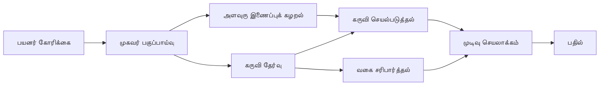

# 🛠️ Azure OpenAI (Responses API) உடன் மேம்பட்ட கருவி பயன்பாடு (.NET)

## 📋 கற்றல் நோக்கங்கள்

இந்த நோட்புக் Azure OpenAI (Responses API) உடன் .NET இல் Microsoft Agent Framework பயன்படுத்தி தொழிற்சாலை தரம் கருவி ஒருங்கிணைப்பு மாதிரிகளை காட்சி அளிக்கிறது. பல சிறப்பு கருவிகளுடன் கூடிய நுட்பமான முகவர் அமைப்புகளை கட்டமைக்க கற்றுக்கொள்வீர்கள், C# இன் வலுவான தட்டுப்பாட்டையும் .NET இன் தொழிற்சாலை அம்சங்களையும் பயன்படுத்தி.

### நீங்கள் கற்று கொள்ளும் மேம்பட்ட கருவி திறன்கள்

- 🔧 **பல்வேறு கருவி அமைப்பு**: பல சிறப்பு திறன்களுடன் முகவர்களை உருவாக்குதல்
- 🎯 **வகை-பாதுகாப்பான கருவி செயலாக்கம்**: C#இன் தொகுப்பு நேரச் சரிபார்ப்பு பயன்படுத்தல்
- 📊 **தொழிற்சாலை கருவி மாதிரிகள்**: தயாரிப்புக்கான கருவி வடிவமைப்பு மற்றும் பிழை கையாளுதல்
- 🔗 **கருவி அமைப்பு**: சரிப்பு வணிக செயல்முறைகளுக்காக கருவிகளை இணைத்தல்

## 🎯 .NET கருவி கட்டமைப்பு பயன்கள்

### தொழிற்சாலை கருவி அம்சங்கள்

- **தொகுப்பு-நேர சரிபார்ப்பு**: வலுவான தட்டுப்பாடு கருவி அளவுரு சரியானதாக்க உறுதி செய்கிறது
- **தேவை பொறுப்பு ஊசியிடுதல்**: கருவி மேலாண்மைக்கான IoC கெண்டெய்னர் ஒருங்கிணைப்பு
- **அசிங்க்/வேயிட் மாதிரிகள்**: உரிய வள மேலாண்மையுடன் தடையின்றி கருவி செயல்பாடு
- **கட்டமைக்கப்பட்ட பதிவு**: கருவி செயல்பாட்டுக்கான வடிவமைக்கப்பட்ட பதிவு ஒருங்கிணைப்பு

### தயாரிப்பிற்கான மாதிரிகள்

- **விலக்கு கையாளுதல்**: வகைப்படுத்தப்பட்ட விலக்குகளுடன் விரிவான பிழை மேலாண்மை
- **வள மேலாண்மை**: சரியான ஒதுக்கீடு மாதிரிகள் மற்றும் நினைவக மேலாண்மை
- **நிர்வாக கண்காணிப்பு**: கட்டமைக்கப்பட்ட அளவுரு மற்றும் செயல்திறன் கண்ணோட்டங்கள்
- **கட்டமைப்பு மேலாண்மை**: சரிபார்ப்புடன் வகை-பாதுகாப்பான கட்டமைப்பு

## 🔧 தொழில்நுட்ப கட்டமைப்பு

### கோர் .NET கருவி கூறுகள்

- **Microsoft.Extensions.AI**: ஒருங்கிணைந்த கருவி தவிர்க்கும் அடுக்கு
- **Microsoft.Agents.AI**: தொழிற்சாலை தரம் கருவி ஒருங்கிணைப்பு
- **Azure OpenAI (Responses API)**: உயர் செயல்திறன் API வாடிக்கையாளர் இணைப்பு பூலிங் உடன்

### கருவி செயலாக்க குழாய்



## 🛠️ கருவி வகைகள் & மாதிரிகள்

### 1. **தரவு செயலாக்க கருவிகள்**

- **உடைமை சரிபார்ப்பு**: தரவு குறிப்புகளுடன் வலுவான தட்டுப்பாடு
- **மாற்றும் செயற்பாடுகள்**: வகை-பாதுகாப்பான தரவு மாற்றம் மற்றும் வடிவமைப்பு
- **வணிக நியாயம்**: பிராந்தியத்துக்கு சொந்தமான கணக்கீடு மற்றும் பகுப்பாய்வு கருவிகள்
- **வெளியீடு வடிவமைப்பு**: கட்டமைக்கப்பட்ட பதிலை உருவாக்குதல்

### 2. **ஒன்றிணைப்பு கருவிகள்**

- **API இணைப்பிகள்**: HttpClient உடன் RESTful சேவை ஒருங்கிணைப்பு
- **தரவுத்தள கருவிகள்**: தரவு அணுகலுக்கான Entity Framework ஒருங்கிணைப்பு
- **கோப்பு செயல்பாடுகள்**: சரிபார்ப்புடன் பாதுகாக்கப்பட்ட கோப்பு அமைப்பு செயல்பாடுகள்
- **வெளிப்புற சேவைகள்**: மூன்றாம் தரப்பு சேவை ஒருங்கிணைப்பு மாதிரிகள்

### 3. **உபயோக கருவிகள்**

- **உரை செயலாக்கம்**: சரம் செயல்முறை மற்றும் வடிவமைப்பு உதவிகள்
- **தேதி/நேர செயல்பாடுகள்**: கலாச்சாரம் கவனித்த தேதி/நேர கணக்கீடுகள்
- **கணித கருவிகள்**: துல்லியக் கணக்கீடுகள் மற்றும் புள்ளியியல் செயற்பாடுகள்
- **சரிபார்ப்பு கருவிகள்**: வணிக விதி சரிபார்ப்பு மற்றும் தரவு சரிபார்ப்பு

வலுவான, வகை-பாதுகாப்பான கருவி திறன்களுடன் .NET இல் தொழிற்சாலை தரம் முகவர்களை கட்ட அமைக்க தயாரா? சில தொழிற்சாலை தர தீர்வுகளை கட்டமைப்போம்! 🏢⚡

## 🚀 துவங்கி உயர் செயலி பெற

### தேவையான முன் நிபந்தனைகள்

- [.NET 10 SDK](https://dotnet.microsoft.com/download/dotnet/10.0) அல்லது அதற்கு மேல்
- Azure OpenAI வளமும், மாதிரிployment  உதவும் [Azure சந்தா](https://azure.microsoft.com/free/)
- [Azure CLI](https://learn.microsoft.com/cli/azure/install-azure-cli) — `az login` மூலம் உள்நுழைக

### தேவையான சூழல் மாறிகள்

```bash
# zsh/bash
export AZURE_OPENAI_ENDPOINT=https://<your-resource>.openai.azure.com
export AZURE_OPENAI_DEPLOYMENT=gpt-4.1-mini
# பின்னர் உள்நுழையவும் அதன் மூலம் AzureCliCredential ஒரு டோக்கனை பெற முடியும்
az login
```

```powershell
# பவர் ஷெல்
$env:AZURE_OPENAI_ENDPOINT = "https://<your-resource>.openai.azure.com"
$env:AZURE_OPENAI_DEPLOYMENT = "gpt-4.1-mini"
# அப்பொழுது AzureCliCredential ஒரு டோக்கன் பெற கையொப்பமிடவும்
az login
```

### மாதிரிக் குறியீடு

குறியீடு உதாரணத்தை இயக்க,

```bash
# zsh/bash
chmod +x ./04-dotnet-agent-framework.cs
./04-dotnet-agent-framework.cs
```

அல்லது dotnet CLI பயன்படுத்தி:

```bash
dotnet run ./04-dotnet-agent-framework.cs
```

முழுத் குறியீட்டுக்கான [`04-dotnet-agent-framework.cs`](../../../../04-tool-use/code_samples/04-dotnet-agent-framework.cs) கோப்பைப் பார்த்து.

```csharp
#!/usr/bin/dotnet run

#:package Microsoft.Extensions.AI@10.*
#:package Microsoft.Agents.AI.OpenAI@1.*-*
#:package Azure.AI.OpenAI@2.1.0
#:package Azure.Identity@1.13.1

using System.ComponentModel;

using Microsoft.Agents.AI;
using Microsoft.Extensions.AI;

using Azure.AI.OpenAI;
using Azure.Identity;

// Tool Function: Random Destination Generator
// This static method will be available to the agent as a callable tool
// The [Description] attribute helps the AI understand when to use this function
// This demonstrates how to create custom tools for AI agents
[Description("Provides a random vacation destination.")]
static string GetRandomDestination()
{
    // List of popular vacation destinations around the world
    // The agent will randomly select from these options
    var destinations = new List<string>
    {
        "Paris, France",
        "Tokyo, Japan",
        "New York City, USA",
        "Sydney, Australia",
        "Rome, Italy",
        "Barcelona, Spain",
        "Cape Town, South Africa",
        "Rio de Janeiro, Brazil",
        "Bangkok, Thailand",
        "Vancouver, Canada"
    };

    // Generate random index and return selected destination
    // Uses System.Random for simple random selection
    var random = new Random();
    int index = random.Next(destinations.Count);
    return destinations[index];
}

// Azure OpenAI with the Responses API (stable v1 endpoint). Sign in with `az login`.
var azureEndpoint = Environment.GetEnvironmentVariable("AZURE_OPENAI_ENDPOINT")
    ?? throw new InvalidOperationException("AZURE_OPENAI_ENDPOINT is not set.");
var deployment = Environment.GetEnvironmentVariable("AZURE_OPENAI_DEPLOYMENT") ?? "gpt-4.1-mini";

var azureClient = new AzureOpenAIClient(new Uri(azureEndpoint), new AzureCliCredential());

// Define Agent Identity and Comprehensive Instructions
// Agent name for identification and logging purposes
var AGENT_NAME = "TravelAgent";

// Detailed instructions that define the agent's personality, capabilities, and behavior
// This system prompt shapes how the agent responds and interacts with users
var AGENT_INSTRUCTIONS = """
You are a helpful AI Agent that can help plan vacations for customers.

Important: When users specify a destination, always plan for that location. Only suggest random destinations when the user hasn't specified a preference.

When the conversation begins, introduce yourself with this message:
"Hello! I'm your TravelAgent assistant. I can help plan vacations and suggest interesting destinations for you. Here are some things you can ask me:
1. Plan a day trip to a specific location
2. Suggest a random vacation destination
3. Find destinations with specific features (beaches, mountains, historical sites, etc.)
4. Plan an alternative trip if you don't like my first suggestion

What kind of trip would you like me to help you plan today?"

Always prioritize user preferences. If they mention a specific destination like "Bali" or "Paris," focus your planning on that location rather than suggesting alternatives.
""";

// Create AI Agent with Advanced Travel Planning Capabilities
// Get the Responses client for the deployment and create the AI agent
// Configure agent with name, detailed instructions, and available tools
// This demonstrates the .NET agent creation pattern with full configuration
AIAgent agent = azureClient
    .GetChatClient(deployment)
    .AsAIAgent(
        name: AGENT_NAME,
        instructions: AGENT_INSTRUCTIONS,
        tools: [AIFunctionFactory.Create(GetRandomDestination)]
    );

// Create New Conversation Session for Context Management
// Initialize a new conversation session to maintain context across multiple interactions
// Sessions enable the agent to remember previous exchanges and maintain conversational state
// This is essential for multi-turn conversations and contextual understanding
await using var session = await agent.CreateSessionAsync();

// Execute Agent: First Travel Planning Request
// Run the agent with an initial request that will likely trigger the random destination tool
// The agent will analyze the request, use the GetRandomDestination tool, and create an itinerary
// Using the session parameter maintains conversation context for subsequent interactions
await foreach (var update in agent.RunStreamingAsync("Plan me a day trip", session))
{
    await Task.Delay(10);
    Console.Write(update);
}

Console.WriteLine();

// Execute Agent: Follow-up Request with Context Awareness
// Demonstrate contextual conversation by referencing the previous response
// The agent remembers the previous destination suggestion and will provide an alternative
// This showcases the power of conversation sessions and contextual understanding in .NET agents
await foreach (var update in agent.RunStreamingAsync("I don't like that destination. Plan me another vacation.", session))
{
    await Task.Delay(10);
    Console.Write(update);
}
```

---

<!-- CO-OP TRANSLATOR DISCLAIMER START -->
**மறுப்பு**:
இந்த ஆவணம் AI மொழிபெயர்ப்பு சேவை [Co-op Translator](https://github.com/Azure/co-op-translator) பயன்படுத்தி மொழிபெயர்க்கப்பட்டுள்ளது. நாங்கள் துல்லியத்திற்காக முயற்சி செய்துள்ளோம், ஆனால் தானாக செய்யப்படும் மொழிபெயர்ப்புகளில் பிழைகள் அல்லது தவறுகள் இருக்கலாம் என்பதை கவனத்தில் கொள்ளவும். அசல் ஆவணம் அதன் தாய்மொழியில் அதிகாரப்பூர்வ ஆதாரமாக கருதப்பட வேண்டும். முக்கியமான தகவல்களுக்கு, தொழில்நுட்பமான மனித மொழிபெயர்ப்பு பரிந்துரைக்கப்படுகிறது. இந்த மொழிபெயர்ப்பைப் பயன்படுத்துவதால் ஏற்படும் எந்த தவறான புரிதல்கள் அல்லது தவறான விளக்கத்திற்கும் நாங்கள் பொறுப்பில்வில்லை.
<!-- CO-OP TRANSLATOR DISCLAIMER END -->