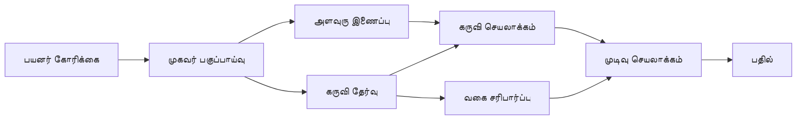

# 🛠️ Azure OpenAI (Responses API) (.NET) உடன் மேம்பட்ட கருவி பயன்படுத்தல்

## 📋 கற்றல் குறிக்கோள்கள்

இந்த நோட்புக் Microsoft Agent Framework-ஐ .NET மற்றும் Azure OpenAI (Responses API) உடன் பயன்படுத்தி தொழில்துறை தரமான கருவி ஒருங்கிணைப்பு முறைகளை காட்டுகிறது. பல நிபுணத்தன்மையான கருவிகளைக் கொண்ட சிக்கலான முகவர்களை உருவாக்க கற்றுக்கொள்ளுவீர்கள், C# இன் வலுவான டைப் பயன்பாட்டையும் .NET இன் தொழில்துறை அம்சங்களையும் பயன்படுத்தி.

### நீங்கள் பேரறிவு பெறும் மேம்பட்ட கருவி திறன்கள்

- 🔧 **பன்முக கருவி அமைப்பு**: பல நிபுணத்தன்மையான திறன்கள் உடைய முகவர்களை கட்டமைத்தல்
- 🎯 **வகை-பாதுகாப்பான கருவி செயல்பாடு**: C# இன் தொகுப்பு நேர சரிபார்ப்பை பயன்படுத்தல்
- 📊 **தொழில்துறை கருவி மாதிரிகள்**: உற்பத்திக்குத் தயாரான கருவி வடிவமைப்பு மற்றும் பிழை கையாளுதல்
- 🔗 **கருவி ஒருங்கிணைப்பு**: சிக்கலான வணிக பணிகளுக்கான கருவிகளை இணைத்தல்

## 🎯 .NET கருவி அமைப்பின் நன்மைகள்

### தொழில்துறை கருவி அம்சங்கள்

- **தொகுப்பு நேர சரிபார்ப்பு**: வலுவான டைப்பிங் கருவி பரிமாணங்களின் சரியான தன்மையை உறுதி செய்கிறது
- **நிலையான இருப்பிடச் சேவை (Dependency Injection)**: கருவி மேலாண்மைக்கு IoC தொட்டிப் பொருள் ஒருங்கிணைப்பு
- **Async/Await மாதிரிகள்**: அடுக்காது கருவி செயல்பாடு மற்றும் சரியான வள மேலாண்மை
- **மைமாற்றப்பட்ட பதிவுகள் (Structured Logging)**: கருவி செயல்பாட்டைக் கண்காணிக்கும் கட்டமைக்கப்பட்ட பதிவு ஒருங்கிணைப்பு

### உற்பத்திக்குத் தயாரான மாதிரிகள்

- **செயலிழப்பு கையாளுதல்**: வகைபற்றிய தவறுகள் உடன் விரிவான பிழை மேலாண்மை
- **வள மேலாண்மை**: சரியான அகற்றல் முறைகள் மற்றும் நினைவு மேலாண்மை
- **செயல்திறன் கண்காணிப்பு**: கட்டமைக்கப்பட்ட அளவுகோல்கள் மற்றும் செயல்திறன் எண்ணிகள்
- **கட்டமைப்பு மேலாண்மை**: சரிபார்ப்புடன் வகை-பாதுகாப்பான கட்டமைப்பு

## 🔧 தொழில்நுட்ப அமைப்பு

### மைய .NET கருவி கூறுகள்

- **Microsoft.Extensions.AI**: ஒன்றுசேர்க்கப்பட்ட கருவி 추상 நிலை
- **Microsoft.Agents.AI**: தொழில்துறை தரமான கருவி ஒழுங்கமைப்பு
- **Azure OpenAI (Responses API)**: உயர்தர செயல்திறன் API கிளையன்ட் மற்றும் இணைப்பு புலிங்

### கருவி செயல்பாட்டு பைப்லைன்



## 🛠️ கருவி வகைகள் & மாதிரிகள்

### 1. **தரவு செயலாக்க கருவிகள்**

- **உள்ளீடு சரிபார்ப்பு**: தரவு குறியீடுகளுடன் வலுவான டைப்பிங்
- **மாற்று செயல்பாடுகள்**: வகை-பாதுகாப்பான தரவு மாற்றம் மற்றும் வடிவமைப்பு
- **வணிக நியூனதளம்**: துறை நვეპ்புட்லான கணக்கீடு மற்றும் பகுப்பாய்வு கருவிகள்
- **வெளியீடு வடிவமைப்பு**: கட்டமைக்கப்பட்ட பதிலளிப்பு உருவாக்கம்

### 2. **ஒன்றுமையான கருவிகள்**

- **API இணைப்பிகள்**: HttpClient உடன் RESTful சேவை ஒத்திசைவு
- **தரவுத்தளம் கருவிகள்**: Entity Framework ஒருங்கிணைவு தரவுக்கு அணுகல்
- **கோப்பு செயல்பாடுகள்**: பாதுகாப்பான கோப்பு அமைப்பு செயலாக்கம் மற்றும் சரிபார்ப்பு
- **புறசேவை கருவிகள்**: மூன்றாம் தரப்பு சேவை ஒருங்கிணைப்பு மாதிரிகள்

### 3. **பயனுள்ள கருவிகள்**

- **உரை செயலாக்கம்**: சரத்துக்கான திருத்தம் மற்றும் வடிவமைப்பு உதவியிகள்
- **தேதி/நேர செயல்பாடுகள்**: பண்பாட்டு அறிவூட்டல் தேதி/நேர கணக்கீடுகள்
- **கணித கருவிகள்**: துல்லிய கணக்கீடுகள் மற்றும் புள்ளியியல் செயல்பாடுகள்
- **சரிபார்ப்பு கருவிகள்**: வணிக விதி சரிபார்ப்பு மற்றும் தரவு சோதனை

அதிகாரபூர்வமாக, வகை-பாதுகாப்பான கருவி திறன்களுடன் .NET இல் தொழில்துறை தர முகவர்களை உருவாக்க தயாரா? வரவரும் தொழில்முறை தர தீர்வுகளைக் கட்டமைப்போம்! 🏢⚡

## 🚀 துவக்கம்

### தேவையான நிலையான சூழல்

- [.NET 10 SDK](https://dotnet.microsoft.com/download/dotnet/10.0) அல்லது அதற்கு மேல்
- [Azure சந்தா](https://azure.microsoft.com/free/) மற்றும் Azure OpenAI வளமும் ஒரு மாதிரி பரப்பும்
- [Azure CLI](https://learn.microsoft.com/cli/azure/install-azure-cli) — `az login` மூலம் உள்நுழைக

### தேவைப்படும் சூழல் மாறிகள்

```bash
# zsh/bash
export AZURE_OPENAI_ENDPOINT=https://<your-resource>.openai.azure.com
export AZURE_OPENAI_DEPLOYMENT=gpt-5-mini
# பின்னர் AzureCliCredential ஒரு குறியீட்டை பெற உள்நுழையவும்
az login
```

```powershell
# பவர் ஷெல்
$env:AZURE_OPENAI_ENDPOINT = "https://<your-resource>.openai.azure.com"
$env:AZURE_OPENAI_DEPLOYMENT = "gpt-5-mini"
# பிறகு AzureCliCredential ஒரு டோக்கனை பெற சைன் இன் செய்யவும்
az login
```

### மாதிரி குறியீடு

குறியீடு உதாரணத்தை இயக்க,

```bash
# zsh/bash
chmod +x ./04-dotnet-agent-framework.cs
./04-dotnet-agent-framework.cs
```

அல்லது dotnet CLI பயன்படுத்தி:

```bash
dotnet run ./04-dotnet-agent-framework.cs
```

முழுமையான குறியீட்டிற்குப் பார்க்க [`04-dotnet-agent-framework.cs`](../../../../04-tool-use/code_samples/04-dotnet-agent-framework.cs).

```csharp
#!/usr/bin/dotnet run

#:package Microsoft.Extensions.AI@10.*
#:package Microsoft.Agents.AI.OpenAI@1.*-*
#:package Azure.AI.OpenAI@2.1.0
#:package Azure.Identity@1.13.1

using System.ComponentModel;

using Microsoft.Agents.AI;
using Microsoft.Extensions.AI;

using Azure.AI.OpenAI;
using Azure.Identity;

// Tool Function: Random Destination Generator
// This static method will be available to the agent as a callable tool
// The [Description] attribute helps the AI understand when to use this function
// This demonstrates how to create custom tools for AI agents
[Description("Provides a random vacation destination.")]
static string GetRandomDestination()
{
    // List of popular vacation destinations around the world
    // The agent will randomly select from these options
    var destinations = new List<string>
    {
        "Paris, France",
        "Tokyo, Japan",
        "New York City, USA",
        "Sydney, Australia",
        "Rome, Italy",
        "Barcelona, Spain",
        "Cape Town, South Africa",
        "Rio de Janeiro, Brazil",
        "Bangkok, Thailand",
        "Vancouver, Canada"
    };

    // Generate random index and return selected destination
    // Uses System.Random for simple random selection
    var random = new Random();
    int index = random.Next(destinations.Count);
    return destinations[index];
}

// Azure OpenAI with the Responses API (stable v1 endpoint). Sign in with `az login`.
var azureEndpoint = Environment.GetEnvironmentVariable("AZURE_OPENAI_ENDPOINT")
    ?? throw new InvalidOperationException("AZURE_OPENAI_ENDPOINT is not set.");
var deployment = Environment.GetEnvironmentVariable("AZURE_OPENAI_DEPLOYMENT") ?? "gpt-5-mini";

var azureClient = new AzureOpenAIClient(new Uri(azureEndpoint), new AzureCliCredential());

// Define Agent Identity and Comprehensive Instructions
// Agent name for identification and logging purposes
var AGENT_NAME = "TravelAgent";

// Detailed instructions that define the agent's personality, capabilities, and behavior
// This system prompt shapes how the agent responds and interacts with users
var AGENT_INSTRUCTIONS = """
You are a helpful AI Agent that can help plan vacations for customers.

Important: When users specify a destination, always plan for that location. Only suggest random destinations when the user hasn't specified a preference.

When the conversation begins, introduce yourself with this message:
"Hello! I'm your TravelAgent assistant. I can help plan vacations and suggest interesting destinations for you. Here are some things you can ask me:
1. Plan a day trip to a specific location
2. Suggest a random vacation destination
3. Find destinations with specific features (beaches, mountains, historical sites, etc.)
4. Plan an alternative trip if you don't like my first suggestion

What kind of trip would you like me to help you plan today?"

Always prioritize user preferences. If they mention a specific destination like "Bali" or "Paris," focus your planning on that location rather than suggesting alternatives.
""";

// Create AI Agent with Advanced Travel Planning Capabilities
// Get the Responses client for the deployment and create the AI agent
// Configure agent with name, detailed instructions, and available tools
// This demonstrates the .NET agent creation pattern with full configuration
AIAgent agent = azureClient
    .GetChatClient(deployment)
    .AsAIAgent(
        name: AGENT_NAME,
        instructions: AGENT_INSTRUCTIONS,
        tools: [AIFunctionFactory.Create(GetRandomDestination)]
    );

// Create New Conversation Session for Context Management
// Initialize a new conversation session to maintain context across multiple interactions
// Sessions enable the agent to remember previous exchanges and maintain conversational state
// This is essential for multi-turn conversations and contextual understanding
await using var session = await agent.CreateSessionAsync();

// Execute Agent: First Travel Planning Request
// Run the agent with an initial request that will likely trigger the random destination tool
// The agent will analyze the request, use the GetRandomDestination tool, and create an itinerary
// Using the session parameter maintains conversation context for subsequent interactions
await foreach (var update in agent.RunStreamingAsync("Plan me a day trip", session))
{
    await Task.Delay(10);
    Console.Write(update);
}

Console.WriteLine();

// Execute Agent: Follow-up Request with Context Awareness
// Demonstrate contextual conversation by referencing the previous response
// The agent remembers the previous destination suggestion and will provide an alternative
// This showcases the power of conversation sessions and contextual understanding in .NET agents
await foreach (var update in agent.RunStreamingAsync("I don't like that destination. Plan me another vacation.", session))
{
    await Task.Delay(10);
    Console.Write(update);
}
```

---

<!-- CO-OP TRANSLATOR DISCLAIMER START -->
**மறுப்பு**:
இந்த ஆவணம் AI மொழிபெயர்ப்பு சேவை [Co-op Translator](https://github.com/Azure/co-op-translator) பயன்படுத்தி மொழிபெயர்க்கப்பட்டுள்ளது. நாங்கள் துல்லியத்திற்காக முயற்சி செய்துள்ளோம், ஆனால் தானாக செய்யப்படும் மொழிபெயர்ப்புகளில் பிழைகள் அல்லது தவறுகள் இருக்கலாம் என்பதை கவனத்தில் கொள்ளவும். அசல் ஆவணம் அதன் தாய்மொழியில் அதிகாரப்பூர்வ ஆதாரமாக கருதப்பட வேண்டும். முக்கியமான தகவல்களுக்கு, தொழில்நுட்பமான மனித மொழிபெயர்ப்பு பரிந்துரைக்கப்படுகிறது. இந்த மொழிபெயர்ப்பைப் பயன்படுத்துவதால் ஏற்படும் எந்த தவறான புரிதல்கள் அல்லது தவறான விளக்கத்திற்கும் நாங்கள் பொறுப்பில்வில்லை.
<!-- CO-OP TRANSLATOR DISCLAIMER END -->