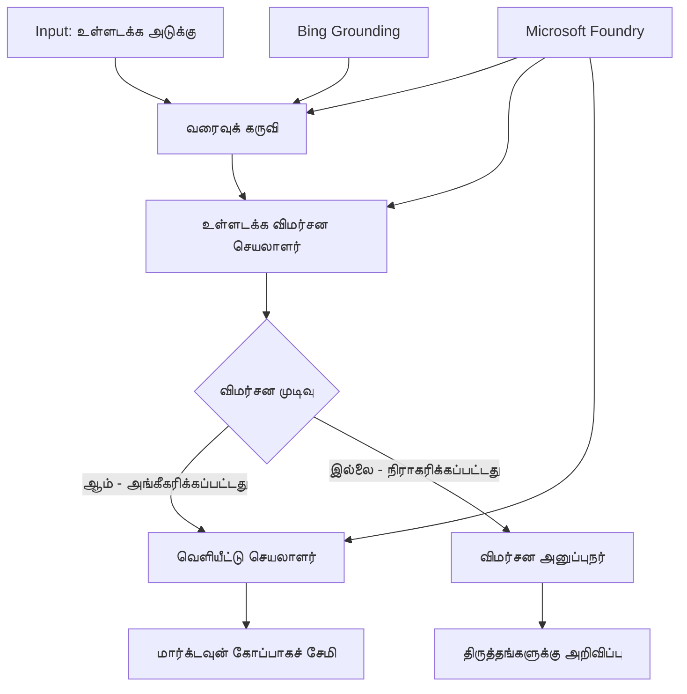

# 🔀 Microsoft Foundry (.NET) கொண்டு நிபந்தனை மூலமுள்ள முகவரியாளர் வேலைநடவடிக்கைகள்

## 📋 ஞானசுற்றிய முடிவெடுத்தல் அடிப்படையிலான வேலைநடவடிக்கை பாடநெறி

இந்த நோட்புக் Microsoft Foundry மற்றும் Microsoft Agent Framework for .NET பயன்படுத்தி **நிபந்தனை அடிப்படையிலான வேலைநடவடிக்கை படிமுறைகள்** ஐ விளக்குகிறது. AI 分析, வணிக விதிகள் மற்றும் இயக்கக நிலைகளுக்கேற்ப தொழிற்சாலை தர நிலையான தானியங்கப்பட்ட பணியில் சாதனமான, முடிவெடுத்தல் இயக்கப்பட்ட workflows உருவாக்கும் முறையை நீங்கள் கற்றுக் கொள்வீர்கள்.

## 🎯 கற்கும் நோக்கங்கள்

### 🧠 **ஞானசுற்றிய முடிவெடுக்கும் கட்டமைப்பு**
- **நிபந்தனை முகாந்திர நடைமுறை**: பல கிளைகளுடன் கூடிய சிக்கலான முடிவுப் மரங்களை கட்டியமைக்கவும்
- **AI இயக்கிய வழி நகர்த்தல்**: Microsoft Foundry மாதிரிகளை பயன்படுத்தி ஞானசுற்றிய வழிநோக்க முடிவுகள் செய்யவும்
- **இயக்கநிலை வேலைநடவடிக்கை தழுவல்**: இயக்க நேர அணுகுமுறையும் நிலைகளையும் பொறுத்து வேலைநடவடிக்கை நடத்தைகளை மாற்றவும்
- **தொழிற்சாலை விதிமுறை ஒருங்கிணைப்பு**: வணிக விதிகள் மற்றும் இணக்கமான தேவைகளை வேலைநடவடிக்கைகளில் சேர்க்கவும்

### 🔀 **மேம்பட்ட நிபந்தனை படிமுறைகள்**
- **பல சரிப்பார்க்கை முடிவெடுக்கும்**: மூலம் வழிநோக்க முடிவுகளுக்கு பல காரியங்களை மதிப்பீடு செய்யவும்
- **சூழல் விழிப்புடனான செயலாக்கம்**: சம்பந்தப்பட்ட வேலைநடவடிக்கை சூழல் மற்றும் வரலாற்றின் அடிப்படையில் முடிவுகள் எடுக்கவும்
- **உட்பொதிக்கப்பட்ட வேலைநடவடிக்கை மாற்றம்**: நேரடி நிலைகளின் அடிப்படையில் செயலாக்க பாதைகளை மாற்றவும்
- **விதி இயந்திரம் ஒருங்கிணைப்பு**: வேலைநடவடிக்கைகளுக்குள் நுண்ணறிந்த வணிக விதி இயந்திரங்களை செயல்படுத்து

### 🏢 **தொழிற்சாலை நிபந்தனை பயன்பாடுகள்**
- **ஆவண வகைப்படுத்தும் மற்றும் வழிநோக்கல்**: ஆவணங்களை தானாகவே வகைப்படுத்தி சரியான வேலைநடவடிக்கைகளுக்கு வழிநோக்கு செய்க
- **வாடிக்கையாளர் சேவை பிரிவு**: வாடிக்கையாளர் விசாரணைகளை நுட்பமான கையாளும் குழுக்களுக்கு ஞானசுற்றிய வழிநோக்கல்
- **இணக்கம் மற்றும் அபாய செயலாக்கம்**: அபாய மதிப்பீட்டின் அடிப்படையில் பல்வேறு சரிபார்ப்பு மற்றும் விமர்சன செயல்முறைகளை நடைமுறைப்படுத்துதல்
- **திறன் உறுதி வேலைநடவடிக்கைகள்**: தரநிலை அளவுகோல்களின் அடிப்படையில் சரியான விமர்சன செயல்முறைகளுக்கு உள்ளடக்கங்களை வழிநோக்குதல்

## ⚙️ முன் நிபந்தனைகள் மற்றும் அமைப்பு

### 📦 **தேவையான NuGet தொகுப்புகள்**

நிபந்தனை வேலைநடவடிக்கை செயலாக்கத்திற்கு மேம்பட்ட தொகுப்புகள்:

```xml
<!-- Core AI Framework -->
<PackageReference Include="Microsoft.Extensions.AI" Version="9.9.0" />

<!-- Azure AI Agents with Persistent State -->
<PackageReference Include="Azure.AI.Agents.Persistent" Version="1.2.0-beta.5" />

<!-- Azure Identity and Utilities -->
<PackageReference Include="Azure.Identity" Version="1.15.0" />
<PackageReference Include="System.Linq.Async" Version="6.0.3" />
<PackageReference Include="DotNetEnv" Version="3.1.1" />

<!-- Local Workflow Framework References -->
<!-- Microsoft.Agents.Workflows.dll - Advanced workflow orchestration -->
<!-- Microsoft.Agents.AI.AzureAI.dll - Microsoft Foundry integration -->
<!-- Microsoft.Agents.AI.dll - Core agent abstractions -->
```

### 🔑 **Microsoft Foundry கட்டமைப்பு**

**தேவையான Azure வளங்கள்:**
- நிபந்தனை செயலாக்க மாதிரிகள் உடன் Microsoft Foundry வேலைநிலையம்
- பொருத்தமான கணினி ஒதுக்கீடுகள் மற்றும் அனுமதிகள் உடன் Azure சந்தா
- முடிவெடுக்க மற்றும் உள்ளடக்க பகுப்பாய்வுக்கு AI மாதிரிகள் நிறுவப்பட்டவை
- (விருப்பமான) Bing Search API இணைப்பு தரவுற்றல் செயல்பாடுகளுக்கு

**சூழல் அமைப்பு (.env கோப்பு):**
```env
# Microsoft Foundry Configuration
AZURE_AI_PROJECT_ENDPOINT=https://your-project.cognitiveservices.azure.com/
BING_CONNECTION_ID=your-bing-connection-id
```

**அங்கீகாரம் அமைப்பு:**
```csharp
// Azure CLI or Managed Identity authentication
using Azure.Identity;
var credential = new AzureCliCredential();

// Load environment configuration
DotNetEnv.Env.Load("../../../.env");
```

### 🏗️ **நிபந்தனை வேலைநடவடிக்கை கட்டமைப்பு**



**முக்கிய கூறுகள்:**
- **வரைவாளர் செயல்படுத்துபவர்**: படி வரைவு உருவாக்கும் AI முகவரியாளர்
- **உள்ளடக்கம் விமர்சகர் செயல்படுத்துபவர்**: வரைவு தரம் மற்றும் இணக்கம் மதிப்பீடு செய்கின்ற AI முகவரி
- **நிபந்தனையுடைய வழிநோக்கல்**: விமர்சன முடிவுகளின் அடிப்படையில் வழிநோக்கும் முடிவ logic உள்ளடக்கம்
- **பதிப்பித்தல்/விமர்சன பாதைகள்**: அனுமதிக்கப்பட்ட மற்றும் மறுக்கப்பட்ட உள்ளடக்கத்திற்கான தனிவழி செயலாக்க பாதைகள்
- **நிலை மேலாண்மை**: வேலைநடவடிக்கையின் போது உள்ளடக்கம் மற்றும் விமர்சன சூழலை பராமரித்தல்

## 🎨 **நிபந்தனை வேலைநடவடிக்கை வடிவமைப்பு படிமுறைகள்**

### 📋 **தரநிலை கதவுகளுடன் உள்ளடக்கம் உற்பத்தி**
```
Outline → Draft Creation → Quality Review → {Approve: Publish | Reject: Revise}
```

### 🎯 **ஆபத்து அடிப்படையிலான ஆவண செயலாக்கம்** 
```
Document → Risk Assessment → {Low: Standard | High: Enhanced Review}
```

### 🔍 **ஞானசுற்றிய வாடிக்கையாளர் சேவை வழிநோக்கல்**
```
Customer Query → Analysis → {Simple: FAQ Bot | Complex: Human Agent}
```

### 💼 **இணக்க அடிப்படையிலான வேலைநடவடிக்கைகள்**
```
Content → Compliance Check → {Pass: Publish | Fail: Legal Review}
```

## 🏢 **தொழிற்சாலை நிபந்தனையுடைய நன்மைகள்**

### 🎯 **ஞானசுற்றிய தானியங்கி முறை**
- **அருவான முடிவெடுப்பு**: உள்ளடக்க பகுப்பாய்வு மற்றும் சூழலின் அடிப்படையில் AI இயக்கிய வழிநோக்கல் முடிவுகள்
- **ஏற்றுகொள்ளும் செயலாக்கம்**: மாறும் நிலைகளின் அடிப்படையில் தானாக வேலைநடவடிக்கைகள் தழுவல்
- **வணிக விதி கடைபிடிப்பு**: சிக்கலான வணிக logic மற்றும் கொள்கைகள் தானாகவே செயல்படுத்தப்படும்
- **சூழல் விழிப்புடனான வழிநோக்கல்**: முழு வேலைநடவடிக்கை வரலாறு மற்றும் சேகரிக்கப்பட்ட சூழலில் அடிப்படையிலான முடிவுகள்

### 📈 **செயற்பாட்டு சிறப்பு**
- **ஆற்றலான வள ஒதுக்கீடு**: பணியை பொருத்தமான நிபுணர்களுக்கும் செயல்முறைகளுக்கும் வழிநோக்கும்
- **கைமுறைhir ஒத்துழைப்பு குறைப்பு**: தானியக்க முடிவெடுப்பு மனித வழிநோக்கலை குறைக்கின்றது
- **வேகமான தீர்க்க நிலைகள்**: சரியான நுட்பத்திற்கும் செயல்முறைக் கற்றலக்கும் நேரடி வழிநோக்கல்
- **ஒத்தியாகும் செயல்பாடு**: வணிக விதிகள் மற்றும் முடிவு அளவுகோல்கள் ஒருங்கிணைந்த செயல்பாடு

### 🛡️ **ஆபத்து மேலாண்மை மற்றும் இணக்கம்**
- **தானியக்க ஆபத்து மதிப்பீடு**: உள்ளடக்கம் மற்றும் சூழலின் அபாய நிலைகளின் AI மதிப்பீடு
- **இணக்கம் கடைபிடிப்பான்**: சீர்திருத்த விதிமுறைகள் கடைப்பிடிக்க தானியக்க வழிநோக்கல்
- **பாதுகாப்பு நීட்சி செயல்படுத்தல்**: ஆபத்து மதிப்பீட்டின் அடிப்படையில் மேம்பட்ட பாதுகாப்பு நடவடிக்கைகள்
- **ஆடிட் பாதை பராமரிப்பு**: வழிநோக்கு முடிவுகளின் மற்றும் காரணங்களின் முழுமையான ஆவணம்

### 📊 **பகுப்பாய்வு மற்றும் தொடர்ச்சியான மேம்பாடு**
- **முடிவாய்வு பகுப்பாய்வு**: வழிநோக்கு முடிவுகளின் விளைவுத்தன்மையையும் துல்லியத்தையும் கண்காணிக்கவும்
- **படிமுறை அடையாளம்**: நேரத்தின் அடிப்படையில் வழிநோக்கு முடிவுகளில் நிகழ்ச்சிகளையும் படிமுறைகளையும் கண்டறிதல்
- **செய்தி மேம்பாடு**: முடிவு அளவுகோல்கள் மற்றும் வழிநோக்கு திறனை தொடர்ச்சியாக மேம்படுத்துதல்
- **வணிக நுண்ணறிவு**: உள்ளடக்க பண்புகள் மற்றும் செயலாக்க தேவைகள் பற்றிய பார்வைகள்

### 🔧 **தொழில்நுட்ப சிறப்புகள்**
- **நிலையான நிலை மேலாண்மை**: வேலைநடவடிக்கை நிறைவேற்றலின் போது சிக்கலான நிலை பராமரித்தல்
- **வலுவான கட்டமைப்பு**: அதிக அளவிலான நிபந்தனை செயலாக்க தேவைகளை கையாளுதல்
- **ஒருங்கிணைப்பு திறன்கள்**: உள்ளமைந்த வணிக அமைப்புகளுடனும் செயல்முறைகளுடனும் எளிமையான இணைப்பு
- **முறைமை கண்காணிப்பு மற்றும் கவனிப்பு**: வேலைநடவடிக்கை செயல்திறன் மற்றும் முடிவுகளை முழுமையாக கண்காணித்தல்

.NET கொண்டு ஞானசுற்றிய, முடிவெடுக்கும் தொழிற்சாலை வேலைநடவடிக்கைகளை உருவாக்குவோம்! 🚀

## 💻 குறியீட்டை இயக்குதல்

முழுமையான செயல்பாடு `04.dotnet-agent-framework-workflow-aifoundry-condition.cs` இல் கிடைக்கிறது. இது **தரநிலை கதவுகளுடன் உள்ளடக்கம் உற்பத்தி வேலைநடவடிக்கை** ஐ காட்டுகிறது:

### 🏗️ **வேலைநடவடிக்கை கட்டமைப்பு**

```
Content Outline → Draft Creation → Quality Review → Conditional Routing:
                                                      ├─ Approved (>200 words) → Publish
                                                      └─ Rejected (<200 words) → Review Notification
```

**வேலைநடவடிக்கையில் முகவரிமைகள்:**
1. **Evangelist Agent**: Bing தரவுற்றலுடன் ஒட்டுமொத்த விளக்கக் கோரிக்கைகளை உருவாக்குகிறது
2. **Content Reviewer Agent**: வரைவு தரத்தை ( வார்த்தை எண்ணிக்கை, முழுமை) மதிப்பாய்வு செய்கிறது
3. **Publisher Agent**: அனுமதிக்கப்பட்ட உள்ளடக்கத்தை நேர்காணல் செய்யப்பட்ட Markdown கோப்புகளாக சேமிக்கிறது

**தனிப்பயன் செயல்படுத்துபவர்கள்:**
1. **DraftExecutor**: வரைவு உருவாக்கத்தை ஒழுங்குபடுத்துகிறது
2. **ContentReviewExecutor**: தரம் மதிப்பீட்டை செய்யிறது
3. **PublishExecutor**: அனுமதிக்கப்பட்ட உள்ளடக்கம் வெளியிடல் செய்கிறது
4. **SendReviewExecutor**: மறுக்கப்பட்ட உள்ளடக்க அறிவிப்புகளை நிர்வகிக்கிறது

### 🚀 எடுத்துக்காட்டு இயக்குதல்

**முன் நிபந்தனைகள்:**
- Microsoft Foundry வேலைநிலைமை கட்டமைக்கப்பட்டிருக்கும்
- Azure CLI அங்கீகாரம் ( `az login` )
- (விருப்பமான) Bing Search இணைப்பு தரவுற்றலுக்காக

```bash
# ஸ்கிரிப்டை இயக்கக்கூடியதாக மாற்றுக (யுனிக்ஸ்/லினக்ஸ்/மැக்ஓஎஸ்)
chmod +x 04.dotnet-agent-framework-workflow-aifoundry-condition.cs

# நிபந்தனை அடிப்படையிலான வேலைப்ப"זலை இயக்குக
./04.dotnet-agent-framework-workflow-aifoundry-condition.cs
```

அல்லது Windows இல்:
```powershell
dotnet run 04.dotnet-agent-framework-workflow-aifoundry-condition.cs
```

### 📝 எதிர்பார்க்கப்படும் வெளியீடு

வேலைநடவடிக்கை:
1. **முகவரிகளை உருவாக்கும்**: மூன்று சிறப்பான Microsoft Foundry முகவரிகளை தொடங்கும்
2. **வரைவு உருவாக்குவதை**: Evangelist முகவரி விளக்க வரைவு உருவாக்கும்
3. **உள்ளடக்கத்தை விமர்சிக்கும்**: Content Reviewer வரைவு தரம் மதிப்பீடு செய்கிறது
4. **நிபந்தனை வழிநோக்கல்**:
   - **அனுமதிக்கப்பட்டால் (>200 வார்த்தைகள்)**: வெளியீட்டு செயல்பாட்டாளர் Markdown கோப்பாக சேமிக்கும்
   - **மறுக்கப்பட்டால் (<200 வார்த்தைகள்)**: விமர்சன அறிவிப்பு அனுப்பிடும்
5. **முடிவுகளை காட்சி செய்யும்**: இறுதி வேலைநடவடிக்கை முடிவை காண்பிக்கும்

### 🔧 தனிப்பயனாக்கும் விருப்பங்கள்

**விமர்சன அளவுகோல்களை மாற்றவும்:**
```csharp
const string ContentReviewerInstructions = @"
You are a content reviewer...
1. Check if content is more than 500 words (instead of 200)
2. Verify technical accuracy
3. Ensure proper formatting
...";
```

**மேலும் நிபந்தனை பாதைகளை சேர்க்கவும்:**
```csharp
var workflow = new WorkflowBuilder(draftExecutor)
    .AddEdge(draftExecutor, contentReviewerExecutor)
    .AddEdge(contentReviewerExecutor, publishExecutor, condition: GetCondition("Excellent"))
    .AddEdge(contentReviewerExecutor, editExecutor, condition: GetCondition("Good"))
    .AddEdge(contentReviewerExecutor, sendReviewerExecutor, condition: GetCondition("Poor"))
    .Build();
```

**உள்ளடக்க தேவைகளை மாற்றவும்:**
```csharp
string OUTLINE_Content = @"
# Your Custom Topic
## Section 1
https://your-reference-url
## Section 2
...
";
```

### 🎯 உண்மை உலக பயன்பாடுகள்

இந்த நிபந்தனை வேலைநடவடிக்கை படிமுறை சிறந்தது:
- **உள்ளடக்க மேலாண்மை அமைப்புகள்**: தரநிலை கதவுகளுடன் தானியக்க ஆசிரிய சுற்றுகள்
- **ஆவண செயலாக்கம்**: வகைப்படுத்தல் மற்றும் இணக்கத்தின்படி ஆவணங்களை வழிநோக்குதல்
- **வாடிக்கையாளர் ஆதரவு**: சிக்கலும் அவசரத்தன்மையும் அடிப்படையிலான அறிவார்ந்த டிக்கெட் வழிநோக்கம்
- **சட்ட விமர்சனம்**: அபாய மதிப்பீடு மற்றும் மதிப்பார்வையை பொறுத்து ஒப்பந்தங்களை வழிநோக்குதல்
- **மனிதவள செயல்முறைகள்**: பொருத்தமான திருத்த வேலைநடவடிக்கைகளின் வழியாக விண்ணப்பங்களை செலுத்துதல்

### 🔍 நிபந்தனை காரணி அறிதல்

**நிபந்தனை செயற்பாடு:**
```csharp
public Func<object?, bool> GetCondition(string expectedResult) =>
    reviewResult => reviewResult is ReviewResult review && review.Result == expectedResult;
```

இந்த செயற்பாடுpredicate உருவாக்குகிறது, இது:
1. முடிவு `ReviewResult` வகையைச் சேர்ந்ததா என்று சரிபார்க்கிறது
2. எதிர்பார்க்கப்படும் மதிப்புடன் `Result` சொத்து ஒப்பிடுகிறது
3. வழிநோக்க உள்ளிடலை true/false ஆகத் திருப்பிக் கொடுக்கும்

**வேலைநடவடிக்கை விளிம்புகள் நிபந்தனைகளுடன்:**
```csharp
.AddEdge(contentReviewerExecutor, publishExecutor, condition: GetCondition("Yes"))
.AddEdge(contentReviewerExecutor, sendReviewerExecutor, condition: GetCondition("No"))
```

### 📊 மேம்பட்ட அம்சங்கள்

**JSON ஸ்கீமா சரிபார்ப்பு:**
வேலைநடவடிக்கை அமைந்த பதில்களுக்கான கட்டமைக்கப்பட்ட வடிவீடுகளை உறுதிப்படுத்த JSON ஸ்கீமாக்களை பயன்படுத்துகிறது:

```csharp
// Define response structure
public class ReviewResult
{
    [JsonPropertyName("review_result")]
    public string Result { get; set; } = string.Empty;
    
    [JsonPropertyName("reason")]
    public string Reason { get; set; } = string.Empty;
    
    [JsonPropertyName("draft_content")]
    public string DraftContent { get; set; } = string.Empty;
}

// Apply to agent
ResponseFormat = ChatResponseFormat.ForJsonSchema(
    AIJsonUtilities.CreateJsonSchema(typeof(ReviewResult)), 
    "ReviewResult", 
    "Review Result From DraftContent"
)
```

**Bing தரவுற்றல் ஒருங்கிணைப்பு:**
Evangelist முகவரியாளர் நேரடி தகவலுக்குப் Bing தரவுற்றலைப் பயன்படுத்துகிறது:

```csharp
var bingGroundingConfig = new BingGroundingSearchConfiguration(bing_conn_id);
BingGroundingToolDefinition bingGroundingTool = new(
    new BingGroundingSearchToolParameters([bingGroundingConfig])
);
```

இதன் மூலம் முகவரியாளர் URL களை பின்பற்றி தற்போதைய தகவலை எடுத்துக்கொள்ள முடியும்.

### 🛡️ பிழை கையாளல்

வேலைநடவடிக்கை மறுத்த உள்ளடக்கத்திற்கு வலுவான பிழை கையாளல் கொண்டுள்ளது:
- விமர்சன தோல்விகள் மாற்று பாதையை இயக்கு
- அறிவிப்புகள் மறுப்பு காரணங்களை தெளிவாகக் காட்டுகின்றன
- உள்ளடக்கம் திருத்தத்திற்காக பாதுகாக்கப்படுகிறது

### 🔄 வேலைநடவடிக்கையை விரிவாக்குதல்

**திருத்த மடக்கு சேர்க்கவும்:**
உள்ளடக்கத்தை தானாக மறுவரைவு செய்யும் கருத்துப் பக்கவாட்டை உருவாக்கவும்:

```csharp
.AddEdge(contentReviewerExecutor, publishExecutor, condition: GetCondition("Yes"))
.AddEdge(contentReviewerExecutor, draftExecutor, condition: GetCondition("No")) // Loop back
```

**பல நிலை விமர்சனம் செயல்படுத்து:**
பல்வேறு அளவுகோல்களுடன் பல விமர்சன படிகள் சேர்க்கவும்:

```csharp
.AddEdge(draftExecutor, technicalReviewer)
.AddEdge(technicalReviewer, editorialReviewer, condition: GetCondition("TechPass"))
.AddEdge(editorialReviewer, publishExecutor, condition: GetCondition("EditPass"))
```

இந்த நிபந்தனை வேலைநடவடிக்கை படிமுறை பரீட்சை, ஞானசுற்றிய தொழிற்சாலை தானியக்கம் அமைப்புகளை கட்டுவதற்கான அடிப்படை வழங்குகிறது! 🚀

---

<!-- CO-OP TRANSLATOR DISCLAIMER START -->
**மறுப்பு**:
இந்த ஆவணம் AI மொழிபெயர்ப்பு சேவை [Co-op Translator](https://github.com/Azure/co-op-translator) பயன்படுத்தி மொழிபெயர்க்கப்பட்டுள்ளது. நாங்கள் துல்லியத்திற்காக முயற்சி செய்துள்ளோம், ஆனால் தானாக செய்யப்படும் மொழிபெயர்ப்புகளில் பிழைகள் அல்லது தவறுகள் இருக்கலாம் என்பதை கவனத்தில் கொள்ளவும். அசல் ஆவணம் அதன் தாய்மொழியில் அதிகாரப்பூர்வ ஆதாரமாக கருதப்பட வேண்டும். முக்கியமான தகவல்களுக்கு, தொழில்நுட்பமான மனித மொழிபெயர்ப்பு பரிந்துரைக்கப்படுகிறது. இந்த மொழிபெயர்ப்பைப் பயன்படுத்துவதால் ஏற்படும் எந்த தவறான புரிதல்கள் அல்லது தவறான விளக்கத்திற்கும் நாங்கள் பொறுப்பில்வில்லை.
<!-- CO-OP TRANSLATOR DISCLAIMER END -->