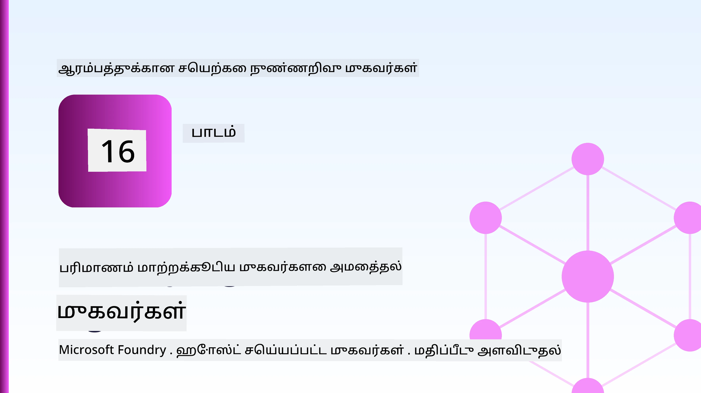
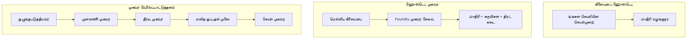
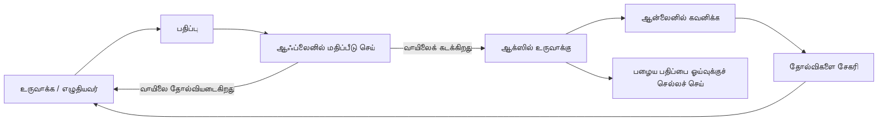
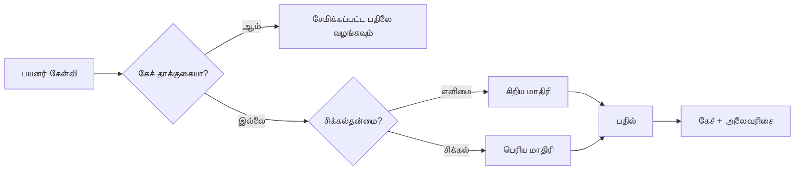
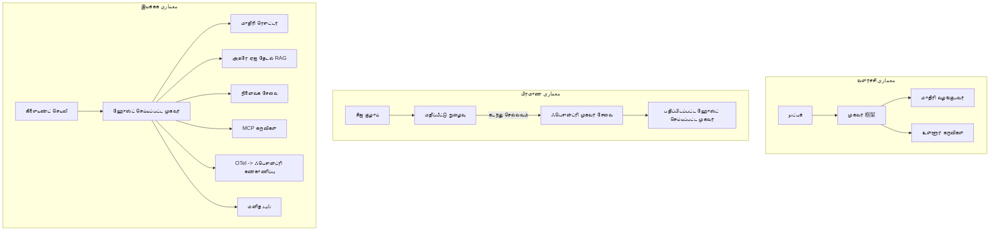

# மைக்ரோசாஃப்ட் ஃபவுண்ட்ரியுடன் அளவிடக்கூடிய முகவர்களை விதவிதமாக பயன்படுத்துதல்



இந்த பாடத்தில் இப்போது வரை நீங்கள் கட்டியுள்ள முகவர்கள் உங்கள் லேப்டாப்பில், குறிப்பு புத்தகத்தில், `az login` மற்றும் சில சுற்றுச்சூழல் மாறிலிகளால் இயக்கப்படுகின்றனர். அதுவே கற்றுக்கொள்ள சரியான வழி. ஆனால் அது ஆயிரக்கணக்கான வாடிக்கையாளர்கள் தங்கள் தேவைகளுக்கு வெளிச்சம் பெறும் 3 மணிக்கு ஓடும் முகவருக்கு சரியான வழி அல்ல.

இந்த பாடம் "என் இயந்திரத்தில் வேலை செய்கிறது" என்ற நிலை மற்றும் "தயாரிப்பில் நம்பகமாகவும் மலிவாகவும் வேலை செய்கிறது" என்ற நிலையின் இடையிலான விமானத்தை பற்றியது. நாம் அந்த இடைவெளியை **Microsoft Foundry** மற்றும் **Microsoft Foundry Agent Service** பயன்படுத்தி மூடும், மேலும் உண்மையான வாடிக்கையாளர் ஆதரவு முகவரைக் கட்டியமே செய்வோம், அதில் கருவிகள், மீட்டெடுப்பு, நினைவகம், மதிப்பீடு மற்றும் கண்காணிப்பு உள்ளன.

## அறிமுகம்

இந்த பாடத்தில் கையாளப்படும் தலைப்புகள்:

- ஒரு **முன்னோடி முகவர்** மற்றும் ஒரு **விதவிதமாக வைக்கப்பட்ட முகவர்** இடையேயான வித்தியாசம் மற்றும் மாற்றம் பெரும்பாலும் மாதிரியின் சுற்றிய மீதமான அனைத்தையும் பற்றியது என்பதைக் குறிப்பிடுவது.
- முகவர்களை விதவிதப்படுத்தும் முறைகள்: கிளையன்ட்-ஹோஸ்டட், சேவை-ஹோஸ்டட் (Hosted Agents), மற்றும் வேலை ஓய்வு இயக்கப்படுத்தப்பட்டது.
- மைக்ரோசாஃப்ட் ஃபவுண்ட்ரியில் முகவர் வாழ்க்கைசுழற்சி — உருவாக்கல், பதிப்பு, விதவிதம், மதிப்பீடு, கவனிப்பு, ஓய்வு.
- **அளவிடும் நுட்பங்கள்**: மாதிரி வழிநடத்தல், கேச்சிங், ஒருங்கிணைப்பு, மற்றும் நிலைமையற்ற வடிவமைப்பு.
- OpenTelemetry மற்றும் Foundry கண்காணிப்புடன் கூடிய **கவனிப்பு**.
- மாதிரி தேர்வு, வழிநடத்தல் மற்றும் மதிப்பீட்டு வாயில்களால் **செலவு குறைப்பு**.
- **நிறுவன கவனிப்புகள்**: ஆட்சி, மனித ஒப்புதல், மற்றும் MCP சர்வர்களை தயாரிப்பில் பாதுகாப்பாக இயக்குதல்.

## கற்றல் நோக்கங்கள்

இந்த பாடத்தை முடித்த பிறகு, நீங்கள் தெரிந்துகொள்ளுவீர்கள்:

- கொடுக்கப்பட்ட முகவர் பணிமனையில் சரியான விதவித முறையை தேர்ந்தெடுப்பது.
- மைக்ரோசாஃப்ட் ஃபவுண்ட்ரி முகவர் சேவையில் முகவரைப் பதிப்போடு, ஆட்சியோடு மற்றும் கவனிக்கப்படக்கூடிய வகையில் விதவிதம் செய்வது.
- முகவருக்கு கண்காணிப்புக்கான கருவி அமைத்தல் மற்றும் ஒவ்வொரு வெளியீட்டிற்கும் முன்பாக ஓடும் மதிப்பீட்டு குழாய் இணைத்தல்.
- அளவில் தாமதமும் செலவையும் கட்டுப்படுத்த மாதிரி வழிநடத்தலில் மற்றும் கேச்சிங்கில் செயல்படுத்தல்.
- உயர்-ஆபத்து நடவடிக்கைகளுக்கு மனித ஒப்புதல் வாயில்களைக் கூட்டுதல் மற்றும் MCP சர்வரை தயாரிப்பு-பாதுகாப்பான முறையில் ஒருங்கிணைத்தல்.

## முன் தேவைகள்

இந்த பாடம், முன் பாடங்களை முடித்திருப்பதும் இவற்றில் நன்கு தேர்ச்சி பெற்றிருப்பதும் கடைபிடிக்கிறது:

- [Microsoft Agent Framework](../14-microsoft-agent-framework/README.md) (பாடம் 14) மூலம் முகவர்களை கட்டுதல்.
- [கருவி பயன்பாடு](../04-tool-use/README.md) (பாடம் 4) மற்றும் [Agentic RAG](../05-agentic-rag/README.md) (பாடம் 5).
- [Agent நினைவகம்](../13-agent-memory/README.md) (பாடம் 13) மற்றும் [Agentic Protocols / MCP](../11-agentic-protocols/README.md) (பாடம் 11).
- [கவனிப்பு மற்றும் மதிப்பீடு](../10-ai-agents-production/README.md) (பாடம் 10) — இந்த பாடம் இதையே நேரடியாக கட்டமைக்கிறது.

நீங்கள் கூடவே தேவைப்படுவது:

- குறைந்தது ஒரு விதவிதமான சந்தை மாதிரி உடைய **Azure சப்ஸ்கிரிப்ஷன்** மற்றும் **Microsoft Foundry திட்டம்**.
- அங்கீகாரம் பெற்ற **Azure CLI** (`az login`).
- Python 3.12+ மற்றும் கோப்பகத்தில் உள்ள [`requirements.txt`](../../../requirements.txt) இன் தொகுப்புகள்.

## முன்னோட்டை தயாரிப்புக்கு மாற்றம்: என்ன மாற்றுகிறது

ஒரு முன்னோடி முகவரும் ஒரு தயாரிப்பு முகவரும் அதே அடிப்படை சுற்றத்துடன் சேர்ந்து இருக்கின்றன — காரணம், கருவிகளை அழைக்கவும், பதிலளிக்கவும். மாற்றம் அந்த சுற்றத்தின் சுற்றியுள்ளவை அனைத்துக்குமானது. தயாரிப்பு முகவரின் சுமார் 20% மாதிரி தான்; மற்ற 80% செயல்பாட்டு எலும்பு.

| கவலை | முன்னோடி | தயாரிப்பு |
| --- | --- | --- |
| **ஹோஸ்டிங்** | உங்கள் குறிப்பு புத்தகத்தில் இயங்கும் | சேவையாக இயங்கும், பதிப்பிடப்பட்ட மற்றும் வெளியிடப்படும் |
| **அடையாளம்** | உங்கள் `az login` டோக்கன் | எல்லாப் பகுதிகளைக் கொண்ட நிர்வகிக்கப்பட்ட அடையாளம் |
| **நிலை** | நினைவகத்தில், மறுதொடக்கம் உடனே இழக்கும் | வெளியூர்மயமாக்கப்பட்ட (தொடர் நிலையகம், நினைவக சேவை) |
| **தரம்** | நீங்கள் பிழை தடத்தைக் காண்பீர்கள் | மீண்டும் முயற்சி, தேர்வுகள், பல்கலைக்கழகம், எச்சரிக்கை |
| **செலவு** | "அது சில சென்டுகள்" | கோரிக்கையின்படியும் கண்காணிக்கப்பட்டு, வழிநடத்தப்பட்டு, பட்ஜெட் செய்யப்பட்டு |
| **தரநிலை** | நீங்கள் வெளியீட்டை கண்காணிப்பீர்கள் | ஒவ்வொரு வெளியீட்டிற்கும் முன்பாக தானாகவே மதிப்பீடு செய்யப்படுகிறது |
| **நம்பிக்கை** | நீங்கள் ஒவ்வொரு நடவடிக்கையையும் ஒப்புக்கொள்கிறீர்கள் | கொள்கை + ஆபத்தான நடவடிக்கைகளுக்கான மனித வழிசெலுத்தல் |

இந்த அட்டவணையை நினைவில் வைக்கவும். கீழ்காணும் ஒவ்வொரு பகுதியும் இவ்வாறு தொடர்புடையது.

## முகவர் விதவிதப்படுத்தல் முறைகள்

அடிக்கடி சேர்க்கப்படும், நீங்கள் பயன்படுத்தப் போகும் மூன்று விதவிதங்கள் உள்ளன.

### 1. கிளையன்ட்-ஹோஸ்ட்ட் முகவர்கள்

முகவர் பொருள் *உங்கள்* செயலியில் விளங்குகிறது. உங்கள் குறியீடு நேரடியாக மாதிரி வழங்கியவரை அழைக்கிறது; காரணச் சுற்றளம் உங்கள் சேவையில் இயங்கும். இது இதுவரை உள்ள அனைத்து பாடங்களின் செயல்.

- **இதை பயன்படுத்த வேண்டியது** நீங்கள் முழு கட்டுப்பாட்டைப் பெறவேண்டியபோது, தனிப்பட்ட இடைமுகம் வேண்டும், அல்லது முகவர்னை ஏற்கனவே இருக்கும் பின்னணி சேவையில் உட்படுத்த விரும்பும்போது.
- **பரிமாற்றம்**: மிகைப்படுத்தல், நிலை மற்றும் குறுக்கு நோயினிடம் நீங்கள் சொந்தமாக பதிலளிக்க வேண்டும்.

### 2. ஹோஸ்டட் முகவர்கள் (Foundry Agent Service)

முகவர் மைக்ரோசாஃப்ட் ஃபவுண்ட்ரியில் *வழிகாட்டி* ஆக பதிவு செய்யப்படுகிறது. ஃபவுண்ட்ரி காரணச் சுற்றளத்தைக் கொண்டுள்ளது, தொடருகளைச் சேமிக்கிறது, உள்ளடக்க பாதுகாப்பையும் RBAC-ஐ நடைமுறைபடுத்துகிறது, மற்றும் முகவரை ஃபவுண்ட்ரி போர்டலில் காட்சிப்படுத்துகிறது. உங்கள் செயலி ஒரு செம்மையான கிளையன்ட் ஆக மாறி, தொடருகளை உருவாக்கி பதில்கள் வாசிக்கும்.

- **இதை பயன்படுத்த வேண்டியது** நீடித்த தன்மை, உள்ளிருப்பு கவனிப்பு, ஆட்சி, மற்றும் குறைவான செயல்பாட்டு பரப்பை விரும்புமொழிக்காக.
- **பரிமாற்றம்**: குறைவான அடிப்படை கட்டுப்பாடு, மேலாண்மை இயங்கு நேரத்திற்கு மாற்றமாக.

### 3. முகவர் வேலை வேறு வாக்குகள்

பல முகவர்களும் (மற்றும் கருவிகளும்) ஒருங்கிணைக்கப்படும், இயக்க விதிகளுடன் கூடிய ஒரு கிராப் உருவாக்கப்படுகிறது — தொடர்ச்சியான படிகள், கிளையின் பிரிவுகள், மனித ஒப்புதல் முனைகள், மறுஇயக்கம் மற்றும் நிறுத்தக்கூடிய நிலைத்துப்புள்ளிகள். இது மைக்ரோசாஃப்ட் முகவர் கட்டமைப்பின் **வேலைச் சுட்டிகள்** திறன் மீது உருவாக்கப்பட்டுள்ளது.

- **இதை பயன்படுத்த வேண்டியது** ஒரு தனிப்பட்ட பணிக்கான பல நிபுண முகவர்களும், அல்லது நடுவில் ஒப்புதல் படியை வேண்டும்போது.
- **பரிமாற்றம்**: அதிக இயக்க உறுப்புகள்; ஒருங்கிணைப்பு-நிலை கவனிப்பு தேவை.



## மைக்ரோசாஃப்ட் ஃபவுண்ட்ரியில் முகவர் வாழ்க்கை சுழற்சி

முகவரைப் பதிப்பது ஒரு ஒரே முறையிலான `push` அல்ல. அது ஒரு சுற்றம், மற்றும் அது மென்பொருள் வெளியீட்டு சுழற்சியைப் போன்றது என்பது உண்மை.



முக்கியக் கருத்து, [பாடம் 10](../10-ai-agents-production/README.md) இலிருந்து எடுத்தது: **ஆஃப்லைன் மதிப்பீடு ஒரு வாயில், பின்னர் செய்தலை அல்ல.** புதிய முகவர் பதிப்பு உங்கள் மதிப்பீட்டு அளவை கடந்தால் மட்டுமே வெளியிடப்படுகிறது. ஆன்லைன் கவனிப்பு பின்னர் இயல்பான பிழைகளை உங்கள் ஆஃப்லைன் பரிசோதனைத் தொகுப்பிற்கு திருப்பிக் கூட்டுகிறது. அது முழு சுற்றமே.

## அளவிடும் முறைகள்

முகவரைக் அளவிடுவது நிலைமையற்ற வலை API அளவிடுவதிலிருந்து வேறுபடுகிறது, ஏனெனில் ஒவ்வொரு கோரிக்கையும் பல செலவான மாதிரி மற்றும் கருவி அழைப்புகளைத் தரக்கூடும். நான்கு முறைகள் பெரும்பாலான பாரத்தை எடுத்துக்கொள்ளும்.

**நிலைமையற்ற கோரிக்கை கையாளுதல்.** உங்கள் செயலி நினைவகத்தில் எந்த ஒரு பயனர் நிலையும் வைத்திருக்க வேண்டாம். உரையாடல் தொடருகளை ஃபவுண்ட்ரி தொடர் சேமிப்பகத்திலோ அல்லது நினைவக சேவையிலோ நிலைத்துவைக்கவும்; எதையாவது நிறுவல் எந்த கோரிக்கையையும் கையாள முடியும். இதுவே நீங்கள் ஏரியா அளவில் விரிவடைவதற்கு உதவுகிறது — எளிதாக அதிகப்படுத்துங்கள், ஒட்டிய அமர்வுகள் எதுவும் வேண்டாம்.

**மாதிரி வழிநடத்தல்.** அனைத்து கோரிக்கைகளும் உங்கள் மிக திறமை வாய்ந்த (மிகக் காசு செலவழிக்கும்) மாதிரியைக் காண வேண்டாம். எளிய கோரிக்கைகள் — நோக்க வகைப்படுத்தல், சிறிய உண்மை பதில்கள் — ஒரு சிறிய, வேகமான மாதிரிக்கு வழிநடத்தவும், பெரிய மாதிரியை உண்மையான காரணத்திற்காகத் தொடர்பு கொள்ளவும். ஃபவுண்ட்ரியின் **Model Router** இதைக் கையாளும், அல்லது நீங்கள் ஒரு எளிய வகைப்பணி நிரல் எழுதி முடிக்கலாம். நீங்கள் பயிற்சியில் DIY பதிப்பினை கட்டுவீர்கள்.

**பதிலளிப்பு கேச்சிங்.** பல ஆதரவு கேள்விகள் வேறு வேறு அரைப்பு ("எப்படி என் கடவுச்சொல்லை மீட்டெடுக்கலாம்?"). பொதுவான கேள்விகளுக்கான பதில்களை கேச்சில் சேமித்து தயாரிப்பில் மாதிரியைத் தொடாமல் சேவை செய்யவும். குறைந்த மட்டுமே கேச்ச் உணர்ச்சி கூட செலவும் தாமதமும் குறைக்கும்.

**ஓரங்கமாக்கல் மற்றும் பின்தள்ளல்.** மாதிரி வழங்குநர்களின் வீத வரம்புகள் உள்ளன. உங்களுடைய ஒருங்கிணைப்பை கட்டுங்கள், அதிகரித்த செல்வ்முறையோடு மீள்வழிகள் பயன்படுத்துங்கள், மற்றும் மெல்லிய முறையில் தோல்வியடையுங்கள் (வரிசைக்குப் படுத்தப்பட்ட "நாம் அதில் இருக்கிறோம்" பதில் 500 க்குப் பதிலாக பெற்று விடும்).



## தயாரிப்பில் கவனிப்பு

நீங்கள் காணாமல் இயங்க முடியாது. பாடம் 10 இல் விளக்கப்பட்டபடி, மைக்ரோசாஃப்ட் முகவர் கட்டமைப்பு нативாக **OpenTelemetry** தடங்களை வெளியிடுகிறது — ஒவ்வொரு மாதிரி அழைப்பும், கருவி இயக்கமும், ஒருங்கிணைப்பு படியும் ஒரு தடமாக மாறுகிறது. தயாரிப்பில் இந்த தடங்களை Microsoft Foundry (அல்லது எந்த OTel-ஐ தக்கவைக்கும் பின்னணி) க்கு ஏற்றுமதி செய்கின்றீர்கள், அதனால் நீங்கள்:

- ஒரு வாடிக்கையாளர் புகாரை மாதிரியும் கருவியும் எல்லா அழைப்புகளிலும் தொடர்ந்து தடம் பின்பற்றலாம்.
- p50/p95 தாமதமும் கோரிக்கை செலவும் காலத்துக்கு மேலே கவனிக்கலாம்.
- பிழை வீத உயர்வு மற்றும் செலவு வேறுபாடுகளில் எச்சரிக்கை அளிக்கலாம் அது உங்கள் பயனர்கள் (அல்லது உங்கள் நிதிக் குழு) கவனிக்கும் முன்.

```python
from agent_framework.observability import get_tracer

tracer = get_tracer()

with tracer.start_as_current_span("support_request") as span:
    span.set_attribute("customer.tier", "enterprise")
    span.set_attribute("routed.model", "gpt-4.1-mini")
    # இந்த ஸ்பானில் முகவர் நிறைவேற்றம் தானாக பதிவுசெய்யப்படுகிறது
```

`customer.tier` மற்றும் `routed.model` போன்ற பண்புகள் தடங்களின் சுவர்களை பதில் அளிக்கக்கூடிய கேள்விகளாக மாற்றுகின்றன ("நிறுவன வாடிக்கையாளர்கள் சிறிய மாதிரிக்கு மிகவும் அடிக்கடி அனுப்பப்படுகிறார்களா?").

## செலவு குறைப்பு

தயாரிப்பு முகவர்களில் செலவுக்கு மூன்றாவது முக்கிய காரணம் டோக்கன்கள் ஆகும். மூன்று முக்கிய ஆபரேட்டுகள், தாக்கம் முறைப்படி:

1. **மாதிரிக்கு சரியான அளவு.** ஒரு சிறிய மாதிரி உங்கள் மதிப்பீடு வாயிலை கடக்கிறது என்றால் பெரும்பாலும் பெரிய மாதிரியை விட அதிக விலை இல்லாதது. கவனமாக இரு மட்டும் பெரிய மாதிரியில் இடம் தராமல் சிறிய மாதிரி போதுமானது என்பதை மதிப்பீடு மூலம் நிரூபிக்கவும்.
2. **சிக்கலான நிர்வாகப்படி வழிநடத்தல்.** மேலேபோன்று — பெரிய மாதிரி காரணத்திற்கான கோரிக்கைகளுக்கு மட்டுமே பெரிய மாதிரி விலையை செலுத்தவும்.
3. **கேச்சிங்கை தீவிரமாக செய்க.** மிக மலிவான மாதிரி அழைப்பு என்பது நீங்கள் ஒருபோதும் செய்யாத அழைப்பே.

மதிப்பீட்டு வாயில்கள் மற்றும் செலவு கட்டுப்பாடு இரண்டும் ஒரே ஒழுங்கு, இரண்டு பார்வைகள்; மதிப்பீடு உங்களுக்கு *தர தரத்தை* சொல்கிறது, வழிநடத்தல் மற்றும் கேச்சிங்கு அந்த தரத்தின் *செலவுக்கு* அருகில் இருக்க உதவுகிறது.

## நிறுவன விதவிதப்படுத்தல் கவனிப்புகள்

**ஆட்சி.** ஹோஸ்டட் முகவர்கள் ஃபவுண்ட்ரியின் RBAC, உள்ளடக்க பாதுகாப்பு மற்றும் கண்காணிப்பு பதிவுகளை பெற்றுள்ளனர். ஒவ்வொரு முகவருக்கும் தேவையற்ற அனுமதிகள் இல்லாத ஒருங்கிணைந்த அடையாளத்தை வழங்கவும் — அறிவுக் கூட்டு படிக்க அனுமதி, டிக்கெட் API க்கு பரவலான அணுகல் இல்லை, அதற்கு மேல் எதுவும் இல்லை.

**மனிதன் வழிசெலுத்தல்.** சில நடவடிக்கைகள் நேரடியாக இயங்க இயலாத அளவில் முக்கியமாகும் — பணம் திரும்பச் செலுத்துதல், கணக்கை அழித்தல், சட்ட குழுவிற்கு உயர்த்தல். மைக்ரோசாஃப்ட் முகவர் கட்டமைப்பு **ஒப்புதல் அவசியம்** கருவிகளை ஆதரிக்கிறது: முகவர் நடவடிக்கையை பரிந்துரைக்கிறது, நடைமுறை நிறுத்தப்படுகிறது, மனிதன் ஒப்புக்கொள்கிறான் அல்லது மறுக்கிறான், மேலும் வேலை மறு தொடங்கும். நீங்கள் அதைக் [பாடம் 6](../06-building-trustworthy-agents/README.md) இல் பார்த்தீர்கள்; இங்கே அதை விதவிதம் செய்கிறோம்.

**தயாரிப்பில் MCP.** [MCP](../11-agentic-protocols/README.md) உங்கள் முகவருக்கு ஒரு ஒருங்கிணைந்த இடைமுகத்தைக் கொண்டு வெளிப்புற கருவிகளை பயன்படுத்த அனுமதிக்கிறது. தயாரிப்பில், ஒவ்வொரு MCP சர்வரையும் நம்பிக்கையற்ற எல்லை என்று கருதுங்கள்: சர்வர் பதிப்பை நிலைநிறுத்துங்கள், சொல்லப்பட்ட அடையாளத்துடன் இயக்குங்கள், அதன் உற்பத்தியை சரிபாருங்கள், மற்றும் அதற்கு ரகசியங்களை ஒருபோதும் அளிக்காதீர்கள். MCP சர்வர் என்பது சார்முறை, சார்முறைகள் புதுப்பிக்கப்படக்கூடும், கண்காணிக்கப்படக்கூடும் மற்றும் வீதமாக கட்டுப்படுத்தப்படக்கூடும்.



அந்த மூன்று வரைபடங்கள் — மேம்பாடு, விதவிதம், இயக்க நேரம் — அது ஒரே முகவர் வாழ்க்கையின் மூன்று அத்தியாயங்கள். பின்வரும் ஆய்வகம் அதன் கட்டுமானத்தை வழி நடத்தும்.

## கைபேசி ஆய்வகம்: தயாரிப்பு-தயார் வாடிக்கையாளர் ஆதரவு முகவர்

[`code_samples/16-python-agent-framework.ipynb`](./code_samples/16-python-agent-framework.ipynb) ஐ திறந்து முழுமையாக வேலை செய்யுங்கள். நீங்கள் தயாரிப்புத் தொலைநிலைக்கான அனைத்து கவனிப்புகளும் இணைக்கப்பட்ட **கொண்டோசோ வாடிக்கையாளர் ஆதரவு முகவரினை** ஒன்று சேர்ப்பீர்கள்:

1. **கருவி அழைப்பு** — ஆர்டர் நிலையை தேடுதல் மற்றும் ஆதரவு டிக்கெட்டுகளைத் திறத்தல்.
2. **RAG** — கொள்கை கேள்விகளுக்கு அறிவின் அடிப்படையில் பதிலளி (Azure AI Search, ஒரு நினைவக மீட்பு உடன், அதனால் குறிப்பு புத்தகம் Search ஆதாரமின்றி இயங்கும்).
3. **நினைவகம்** — உரையாடல் தடைகளின் போது வாடிக்கையாளரை நினைவில் வைக்கிறது.
4. **மாதிரி வழிநடத்தல்** — ஒரு சிக்கல் வகைப்பணி ஒவ்வொரு கோரிக்கையையும் சிறிய அல்லது பெரிய மாதிரிக்கு வழிநடத்துகிறது.
5. **பதிலளிப்பு கேச்சிங்** — பன்முறையும் கேட்கப்பட்ட கேள்விகள் கேச்சிலிருந்து வழங்கப்படுகின்றன.
6. **மனித ஒப்புதல்** — ஒரு வரம்புக்கு மேலான பணமழிவுகள் மனித ஒப்புதலுக்கு நிறுத்தப்படும்.
7. **மதிப்பீட்டு குழாய்** — சிறிய ஆஃப்லைன் பரிசோதனை தொகுப்பு முகவரின் மதிப்பீட்டை செய்யும் மற்றும் வெளியீட்டு வாயிலாக செயல்படும்.
8. **கவனிப்பு** — ஒவ்வொரு கோரிக்கைக்கும் OpenTelemetry தடங்கள்.

### நடைமுறை விளக்கம்

குறிப்பு புத்தகம் ஒவ்வொரு தயாரிப்பு கவனிப்பும் தனித்த செயல்பாடாகவும் இயங்கக்கூடியவை என்றும் அமைக்கப்பட்டுள்ளது. இதன் மையம் வழிநடத்தல் மற்றும் கேச்சிங் கோரிக்கை கையாண்டல்:

```python
async def handle_support_request(query: str, customer_id: str) -> str:
    # 1. நாம் முடிந்தவரை கேஷிலிருந்து வழங்கவும்.
    cached = response_cache.get(normalize(query))
    if cached:
        return cached

    # 2. செலவை கட்டுப்படுத்தக் கூட்டு மூலம் வழிமாற்று செய்யவும்.
    model = "gpt-4.1-mini" if is_simple(query) else "gpt-4.1"

    # 3. கண்காணிப்பிற்காக முகவரியை டிரேஸ் ஸ்பானுக்குள் இயக்கவும்.
    with tracer.start_as_current_span("support_request") as span:
        span.set_attribute("routed.model", model)
        span.set_attribute("customer.id", customer_id)
        response = await support_agent.run(query, model=model)

    # 4. கேஷ் செய் மற்றும் மீள வழங்கு.
    response_cache.set(normalize(query), response.text)
    return response.text
```

வெளியீட்டு வாயிலை பாதுகாக்கும் மதிப்பீடு வாயில் இவ்வாறு உள்ளது:

```python
async def evaluation_gate(agent, test_cases, threshold: float = 0.8) -> bool:
    passed = 0
    for case in test_cases:
        result = await agent.run(case["input"])
        if score_response(result.text, case["expected"]) >= 0.8:
            passed += 1
    pass_rate = passed / len(test_cases)
    print(f"Evaluation pass rate: {pass_rate:.0%} (gate: {threshold:.0%})")
    return pass_rate >= threshold  # வாசல் தோன்றினால் மட்டுமே மேற்கொள்ளவும்
```

எல்லா வரிகளையும் வாசிக்கவும் — குறிப்பு புத்தகம் மிகவும் எளிமையானதாக் கட்டமைக்கப்பட்டுள்ளது, எனவே யாருமொருவருக்கும் ஒரு கட்டமைப்பு அழைப்புக்குப் பின்னாலிருக்கும் எதுவும் மறைக்கப்படாது.

## விதவிதப்பட்ட முகவரைக் குமிழல் சோதனைகளுடன் சரிபார்த்தல்

மேலே உள்ள மதிப்பீடு வாயில் உங்கள் முகவர் பொருளுக்கு *ஆஃப்லைனில்* இயங்குகிறது. முகவரி ஹோஸ்டட் முகவராக விதவிதப்படுத்தப்பட்ட பிறகு, இன்னும் ஒரு இலகுவான சோதனை தேவை: **விதவித எண்ட்பாயிண்ட் உண்மையில் பதிலளிக்கிறதா?**

"வெற்றிகரமாக" விதவிதப்படுத்துவது மட்டுமே கட்டுப்பாட்டு தளம் வரையறையை ஏற்றுக் கொண்டதைக் காட்டுகிறது — முகவரி பதிலளிக்கிறது என்று அத்தனையும் இல்லை. ஒரு இல்லாத சார்முறை, தவறான மாதிரி வழிநடத்தல் அல்லது காலாவதியான இணைப்பு ஏதும் கிடையாமல் இருக்கலாம். ஒரு **குமிழல் சோதனை** அதை சில வினாடிகளில், ஒவ்வொரு விதவிதமும் செய்யும் போது பிடிக்கும்; முழு மதிப்பீட்டின் செலவு இல்லாமல்.

இந்த கோப்புறையில் பயன்படுத்த தயாரான குமிழல்-சோதனை குழாய்த் திட்டம் உள்ளது, இது [AI Smoke Test](https://github.com/marketplace/actions/ai-smoke-test) பெறுமதி கொண்ட GitHub செயலில் கட்டப்பட்டிருக்கிறது:

- **கட்டாக்** — [`tests/lesson-16-smoke-tests.json`](../../../tests/lesson-16-smoke-tests.json) இல் கொண்டோசோ ஆதரவு முகவருக்கான தூண்டலும் உறுதிப்படுத்தலும் இருக்கிறது (நிலைத்த கொள்கை பதில்கள், ஆர்டர் தேடல், தலையாயமான தலைப்பில் நிலைத்திருத்தல் மற்றும் பல முறைக் தொடர்ச்சி). பிற பாடங்களின் முகவர்களுக்கான கட்டாக்கள் இதோடு வாழ்கின்றன — பார்க்கவும் [`tests/README.md`](../tests/README.md).
- **வேலை ஓட்டம்** — [`.github/workflows/smoke-test.yml`](../../../.github/workflows/smoke-test.yml) Azure OIDC உடன் உள்நுழைந்து ஒவ்வொரு தூண்டலும் முகவரின் பதில்கள் எண்ட்பாயிண்ட்-க்கு POST செய்கிறது, எந்த உறுதி தவறும் போது பணியும் தோல்வியாகிறது.

```yaml
- name: Smoke-test hosted agent
  uses: JFolberth/ai-smoketest@v1
  with:
    project_endpoint: ${{ inputs.project_endpoint }}
    agent_name: ContosoSupportAgent
    tests_file: tests/lesson-16-smoke-tests.json
```


உங்கள் முகவர் நிறுவப்பட்ட பிறகு, உங்கள் Foundry திட்ட முடிவில்லையும் முகவர் பெயரையும் வழங்கி **Actions** தாவலை இருந்து இதைப் இயக்கவும். கூட்டமைக்கப்பட்ட அடையாளத்திற்கு Foundry திட்ட வரம்பில் **Azure AI User** பங்கு தேவை. அடுக்குகளை ஒரு திருஷ்டிபார்வையாக பாருங்கள்: புகைத் சோதனைகள் (எட்டும் மற்றும் பதிலளிக்கும்?) ஒவ்வொரு நிறுவலிலும் இயங்கும், ஆஃப்லைன் மதிப்பீடு (பரிமாற்றத்திற்கு போதும்?) முன்னேற்றத்திற்கு முன்னர் இயங்கும், மற்றும் ஆன்லைன் மதிப்பீடு (காடு எப்படி செயல்படுகிறது?) தொடர்ந்து இயங்கும்.

## அறிவு சரிபார்ப்பு

பணியில் செல்லும் முன் உங்கள் புரிதலைச் சோதிக்கவும்.

**1. ஒரு உற்பத்தியாளர் முகவரில் "மாதிரி" என்பது சுமார் எவ்வளவு பகுதியை占ப்பிடிக்கிறது மற்றும் மற்றவை என்ன?**

<details>
<summary>பதில்</summary>

மாதிரி என்பது அமைப்பின் குறுகிய பகுதி — பெரும்பாலும் சுமார் 20% ஆக குறிப்பிடப்படுகிறது. மற்றவை செயற்பாட்டு உடலமைப்பாகும்: இணைப்பு மற்றும் பதிப்புக்கான முகாம், அடையாளம் மற்றும் RBAC, வெளிச்சரிக்கப்பட்ட நிலை, தோல்வி கையாளல், செலவு கண்காணித்தல், மதிப்பீடு, மற்றும் மனிதன் நகர்வு கட்டுப்பாடுகள். உற்பத்திக்கு நகர்தல் பெரும்பாலும் கருத்தரங்குச் சுற்றியுள்ளவற்றை கட்டியமைப்பதே ஆகும்.
</details>

**2. நீண்டகால முகவராக (Hosted Agent) ஒரு கிளையன்ட்-ஓன் காரிய முகவருக்கு மேல் எப்போது தேர்வு செய்வீர்கள்?**

<details>
<summary>பதில்</summary>

நீங்கள் நிர்வகிக்கப்பட்ட ஓட்டமுறை பயன்பாட்டைப் பெற விரும்பும்போது, அதில் நிலைத்தன்மை (தினமும் கடந்து தொடரும் திரேட்கள்), கண்காணித்தல், உள்ளடக்க பாதுகாப்பு மற்றும் RBAC அமைப்பு உள்ளன, மேலும் குறைந்த நிலை கட்டுப்பாட்டுக்கு பரிவர்த்தனையை ஒப்படைக்க தயாராக இருந்தால், நீண்டகால முகவர் சிறந்தது. நீங்கள் முழு கட்டுப்பாட்டை விரும்பினால் அல்லது முகவரை தற்போதைய பின்புறத்தில் உள்ளமைக்கும் பொழுது கிளையன்ட்-ஓன் சிறந்தது.
</details>

**3. ஒரு விரிவாக்கக்கூடிய முகவர் தனது தனிப்பட்ட செயல்முறை நினைவகத்தில் நிலைமையற்றதாக இருக்க வேண்டும் என்றால் அது ஏன்?**

<details>
<summary>பதில்</summary>

எந்த ஒரு நகலும் எந்த அட்டை காட்டியையும் கையாள முடியும் என்பதற்காக, இதுவே ஒட்டுக்கட்டு அமர்வுகள் இல்லாமல் தடம் விரிவாக்கக் கையாள்வதற்கு உதவும். பயனரின் உரையாடல் நிலை திரேடு கடையோ நினைவக சேவையோ என்று வெளிச்சரிக்கப்படுகிறது. நிலை செயல்முறை நினைவகத்தில் இருந்தால் மீண்டும் துவங்கும்போது அது இழக்கப்பட்டிருக்கும் மற்றும் சரியேந்தப்பாட்டை சுதந்திரமாக பகிர முடியாது.
</details>

**4. மாதிரி வழிநடத்தல் என்னைத் தீர்க்கிறது, மேலும் அது மதிப்பீடு உடன் எப்படி தொடர்புடையது?**

<details>
<summary>பதில்</summary>

வழிநடத்தல் எளிய கோரிக்கைகளை சிறிய, மலிவான, வேகமான மாதிரிக்கு அனுப்பி, பெரிய மாதிரியை உண்மையான கருத்தரங்குக்காக ஒதுக்குகிறது, இது both எதிர்பார்ப்பு மற்றும் செலவை கட்டுப்படுத்தும். இது மதிப்பீட்டுடன் தொடர்புடையது, ஏனெனில் மதிப்பீடு *சரிபார்க்கும்* சிறிய மாதிரி ஒரு வகையான கோரிக்கைகளுக்கு போதும் என — மதிப்பீடு இல்லாத வழிநடத்தல் யூகி மட்டும்.
</details>

**5. "மதிப்பீடு கட்டுமானம்" என்றால் என்ன மற்றும் அது வாழ்க்கை சுழற்சியில் எங்கே இருக்கிறது?**

<details>
<summary>பதில்</summary>

ஒரு புதிய முகவர் பதிப்புக்கு எதிராக ஒரு ஆஃப்லைன் சோதனை தொகுப்பை இயக்கி, பாஸ் விகிதம் ஒரு பரிதாசியைக் கடக்கவில்லை என்றால் நிறுவலை தடுக்கும். அது வாழ்க்கைசுழற்சியின் "பதிப்பு" மற்றும் "நிறுவல்" இடையேயிருக்கின்றது, வெளியீட்டிற்கு தரத்தை முதலில் பிணைத்துக்கொள்கிறது, வெளியேறும் பின் மாதிரி சரிபார்ப்பது அல்ல.
</details>

**6. உற்பத்தியில் MCP சர்வரை நம்பாத எல்லையாக கருதவேண்டிய காரணம் என்ன?**

<details>
<summary>பதில்</summary>

அது உங்கள் முகவர் அழைக்கும் ஒரு வெளிப்புற சார்பு ஆகும். அதன் பதிப்பை பின்சுடுகாட்டி, வரம்புடைய அடையாளத்துடன் இயக்கி, அதன் வெளியீடுகளை சரிபார்க்கச் செய்ய வேண்டும், வரம்பு விதித்து, எப்போது வேண்டுமானாலும் அதற்கு ரகசியங்களை வெளிப்படுத்தக்கூடாது — மூன்றாம் தரப்பு சார்புக்கு நீங்கள் பின்பற்றும் அதே ஒழுங்கு. அதன் வெளியீடுகள் உங்கள் முகவரின் கருத்தரங்கிற்குள் செல்கின்றன, எனவே சரிபார்க்கப்படாத நம்பிக்கை ஒரு பாதுகாப்பு ஆபத்து.
</details>

**7. உற்பத்தி முகவர் செலவில் பொதுவாக மிகப்பெரிய தாக்கத்தை உண்டாக்கும் ஒரே மாற்றம் என்ன, மற்றும் ஏன்?**

<details>
<summary>பதில்</summary>

மாதிரியை சரியான அளவில் நிர்ணயிப்பது — உங்கள் மதிப்பீடு கட்டுவாயில் பாஸ் செய்யும் சிறிய மாதிரியை பயன்படுத்துதல். செலவு டோக்கன்களால் ஆட்கொள்ளப்படுகிறது, மற்றும் தர வழிகாட்டியுடன் செய்யும் சிறிய மாதிரி பெரும்பாலான நேரத்தில் பெரிய மாதிரியைவிட மலிவு. மறு பயன்பாடு மற்றும் வழிநடத்தலும் செலவை மேலும் குறைக்கும், ஆனால் சரியான அடிப்படை மாதிரியை தேர்வு செய்வது முதிலான தளவாட விளைவைக் கொண்டுள்ளது.
</details>

**8. `customer.tier` மற்றும் `routed.model` போன்ற ஸ்பேன் பண்புகளுக்கு கண்காணிப்பில் என்ன பங்கு உண்டு?**

<details>
<summary>பதில்</summary>

அவைகள் மூடான தடங்களை பதிலளிக்கக்கூடிய வணிகக் கேள்விகளாக மாற்றுகின்றன. பண்புகள் இல்லாமல் உங்களிடம் தடங்களின் சுவை உள்ளது; கொண்டிருக்கும்போது நீங்கள் கேட்க முடியும் "தொழில்முறை வாடிக்கையாளர்கள் சிறிய மாதிரிக்கு அடிக்கடி வழிநடத்தப்படுகிறார்களா?" அல்லது "எந்த மாதிரி நமது மிக மெதுவான கோரிக்கைகளை கையாள்கிறது?" பண்புகள் கண்காணிப்பை உங்கள் இயக்கத்திற்கு முக்கியமான பரிமாணங்களால் பகுக்க உதவுகிறது.
</details>

## பணித் தொடக்கம்

ஆய்வகத்திலிருந்து வாடிக்கையாளர் ஆதரவு முகவரைக் கொண்டு ஒரு குறிப்பிட்ட சூழலுக்கு அதை வலுப்படுத்தவும்: **ஒரு SaaS நிறுவனத்துக்கான சந்தா பில்லிங் ஆதரவு முகவர்.**

உங்கள் சமர்ப்பிப்பு:

1. பில்லிங் தொடர்பான கருவிகள் மூலம் **கருவிகளை மாற்றவும்**: `get_subscription_status`, `get_invoice`, மற்றும் `issue_credit` (50 டொலருக்கு மேற்பட்ட கிரெடிட்களுக்கு மனித அங்கீகாரம் தேவை).
2. நிறுவனத்தின் பணம் திருப்பி கொடுக்கும் கொள்கை, பில்லிங் சுழற்சி, மற்றும் ரத்து கொள்கை குறித்த மூன்று RAG ஆவணங்களை **சேர்க்கவும்**.
3. குறைந்தது எட்டு வழக்குகளை கொண்ட **மதிப்பீடு தொகுப்பை விரிவாக்கவும்**, அதில் குறைந்தது இரண்டு மனித அங்கீகாரம் பாதையைத் தொடங்கவேண்டியது வேண்டும் என்று உறுதி செய்து, உங்கள் மதிப்பீடு கட்டுவாயில் சரியாக செலவழிக்கிறதா என்று உறுதி செய்யவும்.
4. ஒரு **செலவு அறிக்கையை சேர்க்கவும்**: பத்து கலந்த குவியல்களை முகவருடன் இயக்கி, எத்தனை MICமாச்சுரைச் சிறிய மாதிரிக்கு சென்றது, எத்தனை பெரிய மாதிரிக்கு சென்றது, மற்றும் எத்தனை காசேச்சில் இருந்து வழங்கப்பட்டது என்பதை அச்சிடவும்.

நீங்கள் தேர்ந்தெடுத்த மாதிரி வழிநடத்தல் விதியை விளக்கும் ஒரு குறுகிய உபதலை (markdown செலலில்) எழுதவும், மற்றும் அதனை உண்மையான போக்குடன் எவ்வாறு சரிபார்ப்பீர்கள் என்பதைக் காண்பிக்கவும். ஒரே சரியான பதில் இல்லை — உற்பத்தி கவலைகள் ஒழுங்குபடுத்தப்பட்டு இணைக்கப்பட்டுள்ளதா என பரிசீலிக்கப்படுகிறீர்கள்.

## பகுப்பாய்வு

இந்த பாடத்தில் நீங்கள் Microsoft Foundry உடன் ஒரு முகவரைக் கட்டமைப்பிலிருந்து உற்பத்தி நிலைக்கு கொண்டு சென்றீர்கள்:

- உற்பத்திக்கு ஜம்ப் பொதுவாக மாதிரிக்கு சுற்றியுள்ள **செயற்பாட்டுக் கட்டமைப்புக்கானது** — முகாம், அடையாளம், நிலை, தோல்வி கையாளல், செலவு, தரம், மற்றும் நம்பிக்கை.
- நீங்கள் மூன்று **நிறுவல் மாதிரிகள்** — கிளையன்ட்-ஓன், நீண்டகால முகவர்கள், மற்றும் முகவர் பணிச்சுற்றங்கள் — மற்றும் அவை எப்போது பொருந்துகின்றன என்பதை கற்றுக்கொண்டீர்கள்.
- நீங்கள் **முகவர் வாழ்க்கை சுழற்சியை** நடந்தேற, அங்கு ஆஃப்லைன் மதிப்பீடு **வெளியீட்டு கட்டுமானமாக செயல்படுகிறது** மற்றும் ஆன்லைன் கண்காணிப்பு தோல்விகளை மீண்டும் சோதனை தொகுப்புக்கு கொடுக்கிறது.
- நீங்கள் **விரிவாக்கக் கொள்கைகளை** பயிற்றுவித்தீர்கள் — நிலைமையற்ற வடிவமைப்பு, மாதிரி வழிநடத்தல், காசே, மற்றும் வரம்பிடப்பட்ட ஒரே நேர பராமரிப்பு — மற்றும் அவற்றை **செலவு மிச்சிக்க முறைக்கு** இணைத்தீர்கள்.
- நீங்கள் **தொழில்முறை கட்டுப்பாடுகளை** அமைத்தீர்கள்: RBAC, மனிதன் நகர்வு அங்கீகாரம், மற்றும் உற்பத்தி பாதுகாப்பான MCP ஒருங்கிணைப்பு.
- நீங்கள் **உற்பத்தி-தயார் வாடிக்கையாளர் ஆதரவு முகவரைக்** கட்டியமைத்தீர்கள், அனைத்து கவலைகளையும் இயக்கக்கூடிய குறியீட்டில் இணைத்தீர்கள்.

அடுத்த பாடம் மாறுபட்ட பயணத்தை எடுத்துச் செல்கிறது: முகவர்களை மேகத்தில் விரிவாக்கும் பதிலாக, நீங்கள் அவற்றை ஒரு தனி வளர்ப்பாளரின் கணினிக்கு இறக்கி, முழுக்க உள்ளடக்கமாக இயக்கப் போகிறீர்கள்.

## கூடுதல் வளங்கள்

- <a href="https://learn.microsoft.com/azure/ai-foundry/what-is-azure-ai-foundry" target="_blank">Microsoft Foundry ஆவணங்கள்</a>
- <a href="https://learn.microsoft.com/azure/ai-foundry/agents/overview" target="_blank">Microsoft Foundry முகவர் சேவை கண்ணோட்டம்</a>
- <a href="https://aka.ms/ai-agents-beginners/agent-framework" target="_blank">Microsoft முகவர் கட்டமைப்பு</a>
- <a href="https://learn.microsoft.com/azure/ai-foundry/concepts/model-router" target="_blank">Microsoft Foundry இல் மாதிரி வழிநடத்தல்</a>
- <a href="https://learn.microsoft.com/azure/search/search-what-is-azure-search" target="_blank">Azure AI தேடல்</a>
- <a href="https://opentelemetry.io/" target="_blank">OpenTelemetry</a>
- <a href="https://github.com/marketplace/actions/ai-smoke-test" target="_blank">AI புகைச் சோதனை GitHub செயலி</a>
- <a href="https://modelcontextprotocol.io/" target="_blank">மாதிரி சூழ்நிலை நெறிமுறை (MCP)</a>

## முந்தைய பாடம்

[கணினி பயன்பாட்டு முகவர்களை உருவாக்குதல் (CUA)](../15-browser-use/README.md)

## அடுத்த பாடம்

[உள்ளூர் AI முகவர்களை உருவாக்குதல்](../17-creating-local-ai-agents/README.md)

---

<!-- CO-OP TRANSLATOR DISCLAIMER START -->
**மறுப்பு**:
இந்த ஆவணம் AI மொழிபெயர்ப்பு சேவை [Co-op Translator](https://github.com/Azure/co-op-translator) பயன்படுத்தி மொழிபெயர்க்கப்பட்டுள்ளது. நாங்கள் துல்லியத்திற்காக முயற்சி செய்துள்ளோம், ஆனால் தானாக செய்யப்படும் மொழிபெயர்ப்புகளில் பிழைகள் அல்லது தவறுகள் இருக்கலாம் என்பதை கவனத்தில் கொள்ளவும். அசல் ஆவணம் அதன் தாய்மொழியில் அதிகாரப்பூர்வ ஆதாரமாக கருதப்பட வேண்டும். முக்கியமான தகவல்களுக்கு, தொழில்நுட்பமான மனித மொழிபெயர்ப்பு பரிந்துரைக்கப்படுகிறது. இந்த மொழிபெயர்ப்பைப் பயன்படுத்துவதால் ஏற்படும் எந்த தவறான புரிதல்கள் அல்லது தவறான விளக்கத்திற்கும் நாங்கள் பொறுப்பில்வில்லை.
<!-- CO-OP TRANSLATOR DISCLAIMER END -->