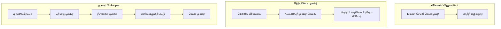
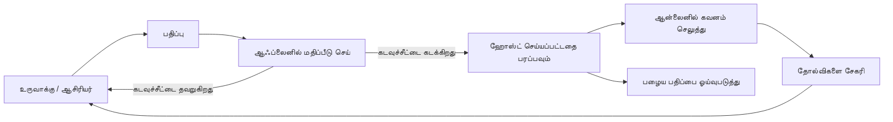
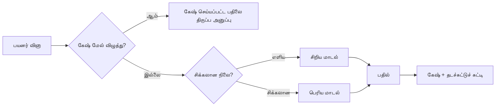
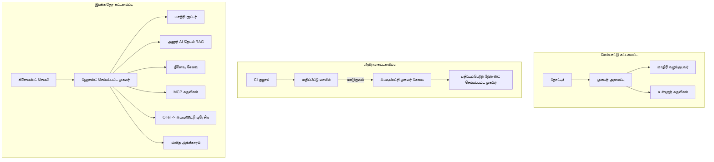

# Microsoft Foundry உடன் அளவீட்டுக்குரிய ஏஜென்டுகளை 배포செய்தல்


இதுவரை நீங்கள் படித்த பாடத்திட்டத்தில் உங்கள் லேப்டாப், ஒரு நோட்புக்கில் இயங்கும், `az login` மற்றும் சில சுற்றுச்சூழல் மாறிலிகளால் இயக்கப்படும் ஏஜென்டுகளை உருவாக்கி இருக்கிறீர்கள். இது கற்றுக்கொள்ள மிகவும் சரியான வழி. ஆனால் இது ஆயிரக்கணக்கான வாடிக்கையாளர்கள் திங்கட்கிழமை 3 மணி காலை நம்பி இருக்கும் ஏஜென்டை இயக்க சரியான வழி அல்ல.

இந்த பாடம் "என் இயந்திரத்தில் வேலை செய்கிறது" மற்றும் "அதில் வேலை செய்கிறது, நம்பகமாகவும், மலிவான விலையில், உற்பத்தியில்" என்ற இடைவெளியின் குறித்தது. நாம் அந்த இடைவெளியை **Microsoft Foundry** மற்றும் **Microsoft Foundry Agent Service** பயன்படுத்தி மூடுகிறோம், மேலும் அது உடனான கருவிகள், மீட்டெடுப்பு, நினைவகம், மதிப்பீடு மற்றும் கண்காணிப்பு கொண்ட ஒரு உண்மையான வாடிக்கையாளர் ஆதரவு ஏஜென்டைப் போல வடிவமைக்கிறோம்.

## அறிமுகம்

இந்த பாடத்தில் கீழ்காணும் விஷயங்கள் அடங்கும்:

- **மாதிரி ஏஜென்டு** மற்றும் **பதிவேற்றப்பட்ட ஏஜென்டு** இடையேயான வித்தியாசம், மேலும் மாற்றம் பெரும்பாலும் மாதிரிக்குச் சுற்றியுள்ள எல்லாவற்றையும் பற்றியது.
- ஏஜென்டுகளுக்கான **பதிவேற்ற முறைமைகள்**: கிளையண்ட்-ஹோஸ்டு, சேவை-ஹோஸ்டு (Hosted Agents), மற்றும் வேலைப்பதிவுப் பொருத்தப்பட்டது.
- Microsoft Foundry இல் **ஏஜென்ட் வாழ்நாள் சுழற்சி** — உருவாக்கு, பதிப்பு, பதிவேற்று, மதிப்பீடு செய், கவனிக்கவும், ஓய்வு எடுத்தல்.
- **அளவீட்டு நுட்பங்கள்**: மாதிரி வழித்தொடர், சேமிப்பகம், ஒத்துழைப்பு, மற்றும் நிலையற்ற வடிவமைப்பு.
- OpenTelemetry மற்றும் Foundry தடயங்களுடன் **கண்காணிப்பு**.
- **செலவு குறைப்புக்**: மாதிரி தேர்வு, வழித்தொடர் மற்றும் மதிப்பீட்டு வாயிலைகள்.
- **தொழிற்சாலை கருத்துக்கள்**: ஆட்சி, மனித அனுமதி, மற்றும் உற்பத்தியில் MCP சேவைகளை பாதுகாப்பாக இயக்குதல்.

## கற்றல் நோக்கங்கள்

இந்த பாடத்தை முடித்தவுடன், நீங்கள் தெரிந்து கொள்வீர்கள்:

- வழங்கப்பட்ட ஏஜென்ட் பணிப்பொறுப்புக்கு சரியான பதிவேற்ற முறைமையைத் தேர்ந்தெடுக்க.
- Microsoft Foundry Agent Service இல் ஒரு ஏஜென்டை பதிப்பிட்டு, ஆட்சி மற்றும் கண்காணிப்பு சேவைகளுடன் பதிவேற்ற.
- தடயபடுத்தும் உபகரணங்களை ஏஜென்டில் நிறுவி, வெளியீட்டுக்கு முன்பு ஓடும் மதிப்பீட்டு பாரம்பரியத்தை இணைத்தல்.
- மாதிரி வழித்தொடர் மற்றும் சேமிப்பகத்தை பயன்படுத்தி தாமதம் மற்றும் செலவை அளவீட்டுக்கு கீழ் வைத்தல்.
- அச்சுறுத்தலான செயல்களுக்காக ஒரு மனித அனுமதி வாயிலையைச் சேர்க்கவும் ஒரு பாதுகாப்பான வழியில் MCP சேவையகத்துடன் ஒருங்கிணைத்தல்.

## முன் நிபந்தனைகள்

இந்த பாடம் முன்பு நடந்த பாடங்களை முடித்துவிட்டீர்கள் என்று கருதுகிறது மற்றும் அதில் நீங்கள் நிமிர்ந்து இருக்க வேண்டும்:

- [Microsoft Agent Framework](../14-microsoft-agent-framework/README.md) உடன் ஏஜென்டுகளை உருவாக்குதல் (பாடம் 14).
- [கருவி பயன்பாடு](../04-tool-use/README.md) (பாடம் 4) மற்றும் [Agentic RAG](../05-agentic-rag/README.md) (பாடம் 5).
- [ஏஜென்ட் நினைவகம்](../13-agent-memory/README.md) (பாடம் 13) மற்றும் [Agentic Protocols / MCP](../11-agentic-protocols/README.md) (பாடம் 11).
- [கண்காணிப்பு மற்றும் மதிப்பீடு](../10-ai-agents-production/README.md) (பாடம் 10) — இந்த பாடம் அதன் மேல் நேரடியாக கட்டியெடுக்கப்பட்டுள்ளது.

மேலும் நீங்கள் தேவையாக இருக்கும்:

- ஒரு **Azure சந்தா** மற்றும் குறைந்தது ஒரு பதிவேற்றப்பட்ட உரையாடல் மாதிரியை கொண்ட **Microsoft Foundry திட்டம்**.
- **Azure CLI** அங்கீகாரம் பெற்றது (`az login`).
- Python 3.12+ மற்றும் ரெப்போசிட்டரியில் உள்ள தொகுதிகள் [`requirements.txt`](../../../requirements.txt).

## மாதிரியிலிருந்தும் உற்பத்தி வரை: உண்மையில் என்ன மாறுகிறது

ஒரு மாதிரி ஏஜென்டும் உற்பத்திச் சேவையும் ஒரே அத்தியாயத்தை பகிர்கின்றன — காரணி, கருவிகளை அழைக்கும், பதில் அளிக்கும். வேறுபாடு அத்தியாயத்தைச் சுற்றியுள்ள எல்லாப் பகுதிகளினதிலும் உள்ளது. மாதிரி ஒரு உற்பத்தி ஏஜென்டின் சுமார் 20%; மற்ற 80% இயங்குதளம் அமைப்பு.

| கவலை | மாதிரி | உற்பத்தி |
| --- | --- | --- |
| **ஹோஸ்டிங்** | உங்கள் நோட்புக்கில் இயங்கும் | ஹோஸ்டுட சேவையாக இயங்கும், பதிப்பிடப்பட்டு வெளியிடப்படும் |
| **அடையாளம்** | உங்கள் `az login` டோக்கன் | வரையறுக்கப்பட்ட RBAC ஐ கொண்ட நிர்வகிக்கப்படும் அடையாளம் |
| **நிலை** | நினைவகத்தில், மீண்டும் தொடங்கும்போது தொலைவு | வெளியே வைக்கப்பட்டது (தண்டாற்று சேமிப்பு, நினைவக சேவை) |
| **வெற்றி குறைவு** | பின்வலைப்பின்னல் காண்பிக்கப்படும் | மறு முயற்சிகள், தவிர்ப்புகள், என்ஜெட்-லேட்டர், அறிவிப்புகள் |
| **செலவு** | "சிறிது செலவு" | கோரிக்கைக்கேற்ப கண்காணிக்கப்படும், வழியமைக்கப்படும், சேமிக்கப்படும், பட்ஜெட்டிடப்பட்டது |
| **தரநிலை** | நீங்கள் வெளியீட்டைப் பார்வையிடுவீர்கள் | ஒவ்வொரு வெளியீட்டிற்கும் முன்பு தானாக மதிப்பீடு செய்யப்பட்டது |
| **நம்பிக்கை** | நீங்கள் ஒவ்வொரு நடவடிக்கைக்கும் அனுமதி அளிப்பீர்கள் | கொள்கை + ஆப்பத்துக்களுக்கான மனித மேற்பார்வை |

இந்த அட்டவணையை நினைவில் வையுங்கள். கீழே உள்ள ஒவ்வொரு பகுதியும் இவ்வகைத்த் தகுதியிலிருந்து உருவாகியுள்ளது.

## ஏஜென்ட் பதிவேற்ற பாணிகள்

நீங்கள் மூன்று பாணிகளைப் பயன்படுத்துவீர்கள், அடிக்கடி கலவையாக.

### 1. கிளையண்ட்-ஹோஸ்டு ஏஜென்ட்கள்

ஏஜென்ட் பொருள் உங்கள் பயன்பாட்டு செயல்முறையின் உள்ளே உள்ளது. உங்கள் குறியீடு நேரடியாக மாதிரி வழங்குநரை அழைக்கிறது; காரணிய சுழற்சி உங்கள் சேவையில் இயங்குகிறது. இது முன்பு அனைத்து பாடங்களிலும் செய்யப்பட்டது.

- **எப்பொழுது பயன்படுத்த வேண்டும்** நீங்கள் முழுமையான கட்டுப்பாடு, கஸ்டம் மிடில்வேர், அல்லது ஏஜென்டை ஏற்கனவே உள்ள பின்தளத்தில் நிருவாக்கும்போது.
- **விண்ணப்பம்**: அளவை, நிலை, மற்றும் மாற்றத்திறனை நீங்கள் தானாக கையாள வேண்டும்.

### 2. ஹோஸ்டு செய்யப்பட்ட ஏஜென்ட்கள் (Foundry Agent Service)

ஏஜென்ட் *Microsoft Foundry இல் ஒரு வளமாக பதிவு செய்யப்பட்டது*. Foundry காரணிய சுழற்சியை ஹோஸ்ட் செய்கிறது, தண்டாற்றுகளை சேமிக்கிறது, உள்ளடக்க பாதுகாப்பையும் RBAC-ஐ அமற்கிறது, மற்றும் ஏஜென்டை Foundry போர்டலில் காண்பிக்கிறது. உங்கள் பயன்பாடு ஒரு மென்மையான கிளையண்டாக மாறி தண்டாற்றுகளை உருவாக்கி பதில்களைப் படிக்கிறது.

- **எப்பொழுது பயன்படுத்த வேண்டும்** நீண்டநாள் நிலைத்தன்மை, உள்ளடக்கிய கண்காணிப்பு, ஆட்சி, மற்றும் குறைந்த இயக்கத் தளத்தைக் காப்பது வேண்டும்.
- **விண்ணப்பம்**: நிர்வகிக்கப்பட்ட இயக்கத்தை மாற்றி குறைந்த மட்ட கட்டுப்பாடு.

### 3. ஏஜென்ட் வேலைப்பாடுகள்

பல ஏஜென்ட்கள் (மற்றும் கருவிகள்) ஒன்றிணைத்து ஒரு விளக்கமான கட்டுப்பாட்டு ஓட்டப் படத்தை உருவாக்குகின்றன — தொடர் படிகள், கிளை பிரிப்பு, மனித அனுமதி மையங்கள், மற்றும் நிறுத்தி மீண்டும் துவக்கும் உறுதிப்படுத்தல்கள். இது Microsoft Agent Framework இன் **Workflows** திறனாகும், அதை அளவீட்டில் பதிவேற்றத்தில் பயன்படுத்துகிறோம்.

- **எப்பொழுது பயன்படுத்த வேண்டும்** ஒரே பணியை பல சிறப்பு ஏஜென்ட்கள் செய்யும் போது அல்லது நடுவிலான அனுமதி படி தேவைப்படும் போது.
- **விண்ணப்பம்**: கூடுதல் இயக்கங்கள்; ஒருங்கிணைப்புக் கட்டுப்பாட்டுக்கான கண்காணிப்பு தேவை.



## Microsoft Foundry இல் ஏஜென்ட் வாழ்நாள் சுழற்சி

ஏஜென்ட் பதிவேற்றம் ஒரேமுறை `push` அல்ல அது ஒரு சுழற்சி, அது மென்பொருள் வெளியீட்டு சுற்றத்தைப் போலவே நிகழ்கிறது.



முக்கியக் கருத்து, [பாடம் 10](../10-ai-agents-production/README.md) இலிருந்து எடுத்துக்கொள்ளப்பட்டது: **ஆஃப்லைன் மதிப்பீடு என்பது வாயில், பின்னர் நினைவுக்கு அல்ல.** புதிய ஏஜென்ட் பதிப்பு உங்கள் மதிப்பீடு அளவுகோல்களை கடந்தால் மட்டுமே வெளியிடப்படும். ஆன்லைன் கண்காணிப்பு பிறகு உலகம் முழுவதும் தோல்விகளை உங்கள் ஆஃப்லைன் சோதனை தொகுப்பிற்கு மீண்டும் அனுப்பும். அது முழு சுழற்சிதான்.

## அளவீட்டு நுட்பங்கள்

ஏஜென்டை உயர்த்துவது நிலையற்ற வலை API ஐ உயர்த்துவதிலிருந்து வேறுபடுகிறது, ஏனெனில் ஒவ்வொரு கோரிக்கையும் பல விலைமதிப்புடைய மாதிரி மற்றும் கருவிப் அழைப்புகளை ஏற்படுத்தலாம். நான்கு நுட்பங்கள் பெரும்பாலான சுமையை ஏற்றுகின்றன.

**நிலை இற்றைவான கோரிக்கை கையாளுதல்.** உங்கள் செயல்பாட்டில் பயனர் நிலையை நினைவில் வைக்காதீர்கள். உரையாடல் தண்டாற்றுகளை Foundry தீய கழிவுக் கூடத்தில் அல்லது நினைவக சேவையில் சேமியுங்கள், எனவே எந்த உதவி நிலையும் எந்த கோரிக்கையையும் கையாளலாம். இது தாண்டி அளவீட்டை (horizontal scale) அனுமதிக்கிறது — உதவி நிலையங்களைச் சேர், நிலைத்த அமர்வுகள் தேவையில்லை.

**மாதிரி வழித்தொடர்.** ஒவ்வொரு கோரிக்கையும் உங்கள் மிக திறமையான மற்றும் மிக விலையுயர்ந்த மாதிரியை தேவையில்லை. எளிய கோரிக்கைகளை — நோக்க வகைப்படுத்தல், குறுகிய உண்மையான பதில்கள் — ஒரு சிறிய மற்றும் விரைவான மாதிரிக்கு வழிமாற்றவும், பெரிய மாதிரியை உண்மையான காரணியத்திற்காக மட்டும் ஒதுக்கவும். Foundry இன் **Model Router** இதனை சாத்தியம் செய்யும், அல்லது நீங்கள் உங்களுக்கே ஒரு எளிய வகைப் படுத்தியை உருவாக்கலாம். நீங்கள் செய்முறை முறையில் அந்த DIY பதிப்பை கட்டுவீர்கள்.

**பதிலளிப்பு சேமிப்பு.** பல ஆதரவு கேள்விகள் ஒரே மாதிரியாக இருக்கும் ("எப்படி என் கடவுச்சொல்லை மீட்டமைப்பது?"). பொதுவான கேள்விகளுக்கு பதில்களை சேமித்து, மாதிரியைத் தொடர்புகொள்ளாமல் சேவை செய்யவும். ஒரு சாதாரண சேமிப்பு அடிபடுதல் கூட செலவு மற்றும் தாமதத்தை குறைக்கும்.

**ஒத்துழைப்பு மற்றும் பின்வேதனை.** மாதிரி வழங்குநர்களுக்கு வீத வரம்புகள் உள்ளன. உங்கள் ஒத்துழைப்பை எல்லைப்படுத்தவும், மறு முயற்சிகளை எக்ஸ்பொனென்ஷியல் பின்னோட்டத்துடன் பயன்படுத்தவும், மற்றும் மென்மையான தோல்வி கையாள்வை செய்க (வரிசைப்படுத்தப்பட்ட "நாங்கள் நடவடிக்கை எடுகிறோம்" பதில் 500 விட மேலானது).



## உற்பத்தியில் கண்காணிப்பு

நீங்கள் காணக்கூடியதையே நிர்வகிக்க முடியும். பாடம் 10 இல் விவாதிக்கப்பட்டு இருந்தபோல் Microsoft Agent Framework இயல்பாக **OpenTelemetry** தடயங்களை விடுகிறது — ஒவ்வொரு மாதிரி அழைப்பு, கருவி அழைப்பு மற்றும் ஒருங்கிணைப்பு படி ஒரு தொடர் ஆகிறது. உற்பத்தியில் நீங்கள் அந்த தொடர்களை Microsoft Foundry (அல்லது எந்த OTel-ஊட்ட இயன்ற பின்வட்டாரமாக) ஏற்ற முடியும, எனவே நீங்கள்:

- ஒவ்வொரு வாடிக்கையாளர் புகாரையும் முழுமையாக மாதிரியும் கருவியும் அடங்கி தடமாக பின்தொடர் செய்ய.
- p50/p95 தாமதம் மற்றும் கோரிக்கை பிரிவின் செலவை நேரத்தில் கவனிக்க.
- பிழை வீத உயர்வுகள் மற்றும் செலவு விசேஷங்களுக்கான அலர্টுகளை உங்கள் பயனர்கள் (அல்லது நிதி குழு) முன்பு அறிய.

```python
from agent_framework.observability import get_tracer

tracer = get_tracer()

with tracer.start_as_current_span("support_request") as span:
    span.set_attribute("customer.tier", "enterprise")
    span.set_attribute("routed.model", "gpt-5-nano")
    # முகவர் செயல்திறன் தானாகவே இந்த பரப்பில் கண்காணிக்கப்படுகிறது
```

`customer.tier` மற்றும் `routed.model` போன்ற பண்புகள் தடய அலைவிற்பேசிகளை பதிலளிக்கக்கூடிய கேள்விகளாக மாற்றுகின்றன ("தொழிற்சாலை வாடிக்கையாளர்கள் சிறிய மாதிரிக்கு அடிக்கடி வழிமாற்றப்படுகிறார்களா?").

## செலவு குறைத்தல்

உற்பத்தி ஏஜென்ட்களில் செலவு குறும்பட வடிவங்களில் அதிகமாகவே டோக்கன்களால் ஆட்கொள்ளப்படுகிறது. மூன்று எளிய வழிகள், தாக்கத்துக்கேற்ப:

1. **சரியான அளவுக்கு மாதிரியை தேர்ந்தெடு.** ஒரு சிறிய மாதிரி உங்கள் மதிப்பீடு வாயிலை கடந்து இருந்தால் பெரும்பாலும் ஒரு பெரிய மாதிரி விட மலிவாகும். உச்சமாக பெரிய மாதிரியைப் பயன்படுத்துவதை தவிர்த்து சிறிய மாதிரியும் போதுமானது என்பதை மதிப்பீடு மூலம் நிரூபி.
2. **இடைக்கட்டுப்பாட்டால் வழிமாற்று.** மேலதிகம் — பெரிய மாதிரி தேவையான கோரிக்கைகளுக்கே பெரும் மாதிரிக்கான கட்டணத்தை செலுத்து.
3. **தீவிர சேமிப்பு.** உங்கள் செய்யக்கூடிய மாதிரி அழைப்பின் மிக மலிவான பதிப்பு அது ஒன்றும் அழைக்காமல் போகிறது.

மதிப்பீட்டு வாயில்கள் மற்றும் செலவு கட்டுப்பாடு இரு கோணங்களில் ஒரே ஒழுங்கு: மதிப்பீடு தரத்தைக் குறிப்பிடுகிறது, வழி மற்றும் சேமிப்பு செலவை குறைக்கிறது.

## தொழிற்சாலை பதிவேற்ற கருத்துக்கள்

**ஆட்சி.** ஹோஸ்டு ஏஜென்ட்கள் Foundry இன் RBAC, உள்ளடக்க பாதுகாப்பு, கணக்கு பதிவு ஆகியவற்றை பெறுகின்றன. ஒவ்வொரு ஏஜென்டுக்கும் அது தேவையாயுள்ள குறைந்த அனுமதிகளுடன் ஒரு நிர்வகித்த அடையாளத்தை கொடுக்கவும் — அறிவுத் தளத்தை மாத்திரம் படிக்க, டிக்கெட் API க்கு வரையறுக்கப்பட்ட அனுமதி, அதற்கு மேல் எதுமில்லை.

**மனிதன்-இல்-ஒற்றை.** சில செயல்கள் முற்றிலும் தானாக்க முடியாத அளவு முக்கியமானவை — பணம் திருப்பிச் செலுத்துதல், கணக்கை கழித்தல், சட்ட குழுவுக்கு உயர்த்தல். Microsoft Agent Framework **approval-required** கருவிகளை ஆதரிக்கிறது: ஏஜென்ட் நடவடிக்கையை முன்மொழிகிறது, செயல்பாடு இடைநிறுத்தப்படுகிறது, மனிதன் அனுமதிக்க அல்லது நிராகரிக்கிறார், பின்னர் வேலைப்பாடு தொடர்கிறது. நீங்கள் [பாடம் 6](../06-building-trustworthy-agents/README.md) இல் அடிப்படையானது பார்த்தீர்கள்; இங்கு அதனை பதிவேற்றுகிறோம்.

**MCP உற்பத்தியில்.** [MCP](../11-agentic-protocols/README.md) உங்கள் ஏஜென்டுக்கு வெளிப்புற கருவிகளை ஒரு நியமிக்கப்பட்ட இடைமுகத்தால் பயன்படுத்த அனுமதிக்கிறது. உற்பத்தியில், ஒவ்வொரு MCP சேவையகத்தையும் நம்பக் கூடாத எல்லை என நினைத்து கையாளுங்கள்: சேவையக பதிப்பை சொடுக்கி வைத்துக் கொள்ளவும், தடவல் அடையாளத்துடன் இயக்கவும், வெளியீடுகளை உறுதிப்படுத்தவும், ரகசியங்களை எப்போதும் வெளிப்படுத்த வேண்டாம். MCP சேவையகம் ஒரு சார்பு, மற்றும் சார்புகள் பட்டி, கணக்காய்வு மற்றும் விகித வரம்பு அடைகின்றன.



அந்த மூன்று வரைபடங்கள் — மேம்பாடு, பதிவேற்றம், இயக்க நேரம் — ஒரு ஏஜென்டின் வாழ்க்கையின் மூன்று கட்டங்களாகும். பின்வரும் ஆய்வகம் அதைப் பின்பற்றுகிறது.

## கைகள்-இல் ஆய்வு: உற்பத்தி-செயல்படும் வாடிக்கையாளர் ஆதரவு ஏஜென்ட்

[`code_samples/16-python-agent-framework.ipynb`](./code_samples/16-python-agent-framework.ipynb) திறந்து முழுமையாகப் பணி செய்யவும். நீங்கள் ஒரு **Contoso வாடிக்கையாளர் ஆதரவு ஏஜென்டை** உருவாக்குவீர்கள், அனைத்து உற்பத்தி பேசுபடிகள் இணைக்கப்பட்டதாக:

1. **கருவி அழைப்பு** — ஆர்டர் நிலை திருத்தல் மற்றும் ஆதரவு டிக்கெட்டுகளை திறத்தல்.
2. **RAG** — அறிவுப் பரிசோதனை கேள்விகளுக்கு பதில் அளித்து (Azure AI Search உடன், மேலும் நோட்புக் Search வளம் இல்லாமல் இயங்கும் நினைவக ரீஃபால்).
3. **நினைவகம்** — உரையாடல் தொடரில் வாடிக்கையாளர் நினைவில் வைக்க.
4. **மாதிரி வழித்தொடர்** — ஒரு சிக்கல் வகைப்படுத்தி ஒவ்வொரு கோரிக்கையையும் சிறிய அல்லது பெரிய மாதிரிக்கு வழிமாற்றுகிறது.
5. **பதிலளிப்பு சேமிப்பு** — மீண்டும் கேட்கப்படும் கேள்விகள் கைவைக்கப்பட்ட பதில்களிலிருந்து வழங்கப்படும்.
6. **மனித அனுமதி** — ஒரு அளவைக் கடக்கும் திருப்பிச் செலுத்தல்கள் மனித ஒப்புதலுக்காக இடைவிடும்.
7. **மதிப்பீட்டு வழிகாட்டி** — சிறிய ஆஃப்லைன் சோதனை தொகுப்பு ஏஜென்டை மதிப்பீடு செய்து வெளியீட்டுக்கு வாயிலை இடுகிறது.
8. **கண்காணிப்பு** — ஒவ்வொரு கோரிக்கையிலும் OpenTelemetry தடயங்கள்.

### நடைமுறை விளக்கம்

நோட்புக் ஒவ்வொரு உற்பத்தி விஷயமும் தனித்து இயங்கக்கூடியதாக, இயக்கக்கூடியதாக அமைக்கப்பட்டுள்ளது. இதன் இதயம் வழித்தொடர் மற்றும் சேமிப்பு கோரிக்கை கைப்பொறி:

```python
async def handle_support_request(query: str, customer_id: str) -> str:
    # 1. முடிந்தால் கேஷில் இருந்து சேவை செய்யவும்.
    cached = response_cache.get(normalize(query))
    if cached:
        return cached

    # 2. செலவை கட்டுப்படுத்த சிக்கல்பாட்டின்படி பாதையை அமைக்கவும்.
    model = "gpt-5-nano" if is_simple(query) else "gpt-5-mini"

    # 3. கண்காணிப்பிற்காக ஏஜெண்டை டிரேஸ் ஸ்பானுக்கு உள்ளே இயக்கு.
    with tracer.start_as_current_span("support_request") as span:
        span.set_attribute("routed.model", model)
        span.set_attribute("customer.id", customer_id)
        response = await support_agent.run(query, model=model)

    # 4. கேஷ் செய்து திருப்பி உத்தரவிடு.
    response_cache.set(normalize(query), response.text)
    return response.text
```

வெளியீட்டை பாதுகாப்பது போல ஒரு மதிப்பீட்டு வாயில் இவ்வாறே தெரிகிறது:

```python
async def evaluation_gate(agent, test_cases, threshold: float = 0.8) -> bool:
    passed = 0
    for case in test_cases:
        result = await agent.run(case["input"])
        if score_response(result.text, case["expected"]) >= 0.8:
            passed += 1
    pass_rate = passed / len(test_cases)
    print(f"Evaluation pass rate: {pass_rate:.0%} (gate: {threshold:.0%})")
    return pass_rate >= threshold  # கதவு நிறைவுற்றால் மட்டுமேவை இடுக
```

ஒவ்வொரு வரியையும் படியுங்கள் — நோட்புக் அடிப்படைகளை சிறியதாக வைத்திருக்கிறது, எனவே ஏதுமிருந்தும் மறைக்கப்படவில்லை.

## பதிவேற்றப்பட்ட ஏஜென்டை புகைத்த தேடல்கள் மூலம் உறுதிப்படுத்தல்

மேற்படி மதிப்பீடு வாயில் உங்கள் ஏஜென்ட் பொருளுக்கு *ஆஃப்லைனில்* இயங்குகிறது. கோரிக்கை ஏஜென்ட் Hosted Agent ஆக பதிவேற்றப்பட்ட பிறகு, இன்னொரு, கூட மலிவு கூடிய சோதனை தேவைப்படுகிறது: **பதிவேற்றப்பட்ட இடமிருந்து உண்மையில் பதிலளிக்கிறதா?**

"வெற்றிகரமாக" பதிவேற்றத்தில் கட்டுப்பாட்டு அச்சு வரையறுப்பை ஏற்றுக்கொண்டதை மட்டும் நிரூபிக்கும் — ஏஜென்ட் பதிலளிக்கிறதா என்பதை நிரூபிப்பதில்லை. ஒரு இல்லாத சார்பு, ஒரு தவறான மாதிரி வழிமாற்றல், அல்லது காலாவதியான இணைப்பு வெற்றிகரமான பதிப்பை சகலப்படுத்தாமல் இருக்க முடியும். ஒரு **புகைத்த சோதனை** அந்த நிலையை சில விநாடிகளுக்குள், ஒவ்வொரு பதிவேற்றத்திலும், முழு மதிப்பீடு செலவின் கீழ் பிடிக்கும்.

இந்த ரெப்போசிட்டரி தயார் புகைத்த-சோதனை வழிகாட்டியை [AI Smoke Test](https://github.com/marketplace/actions/ai-smoke-test) GitHub செயல்பாட்டின் அடிப்படையில் வழங்குகிறது:

- **கேட்டலாக்** — [`tests/lesson-16-smoke-tests.json`](../../../tests/lesson-16-smoke-tests.json) உள்ளடக்குகிறது Contoso ஆதரவு ஏஜென்டுக்கான தூண்டுதல்கள் மற்றும் உறுதிப்பத்திரிகைகள் (அடிப்படையான கொள்கை பதில்கள், ஆர்டர் நுழைவுக் கிரியம், உல்லாசமான தலைப்பில் நிலையாக இருக்க, மற்றும் பல இணைக்கப்பட்ட உரையாடல் தொடர்ச்சி). மற்ற பாடங்களின் ஏஜென்ட்களுக்கு கேட்டலாக்கள் இதன் அருகே உள்ளன — பாருங்கள் [`tests/README.md`](../tests/README.md).
- **வேலைப்பாடு** — [`.github/workflows/smoke-test.yml`](../../../.github/workflows/smoke-test.yml) Azure OIDC உடன் உள்நுழையும் மற்றும் ஒவ்வொரு தூண்டுதலையும் ஏஜென்டின் பதில்கள் இடமுகத்திற்கு POST செய்யும், எந்த உறுதிப்பத்திரியும் தவறானால் வேலை தோல்வி ஆகும்.

```yaml
- name: Smoke-test hosted agent
  uses: JFolberth/ai-smoketest@v1
  with:
    project_endpoint: ${{ inputs.project_endpoint }}
    agent_name: ContosoSupportAgent
    tests_file: tests/lesson-16-smoke-tests.json
```


உங்கள் ஏஜெண்ட் துவக்கப்பட்டதும், உங்கள் Foundry திட்ட இறுதிக்கணக்கையும் ஏஜெண்ட் பெயரையும் வழங்கி **Actions** தாவலைத் தவிர இயக்கவும். கூட்டாட்சி அடையாளம் Foundry திட்ட பரப்பில் **Azure AI User** பங்கு வேண்டும். பரப்புகளை ஒரு piramit போல நினைவில் வைக்கவும்: புகை சோதனைகள் (அணுகக்கூடியதா மற்றும் பதிலளிக்கிறதா?) ஒவ்வொரு வெளியீட்டிலும் பாதுகாக்கப்படுகின்றன, செயலற்ற மதிப்பாய்வு (பரிமாற போதுமானதா?) முன்னோக்கில் চলে, ஆன்லைன் மதிப்பாய்வு (காட்டு சூழலில் அது எப்படி நடக்கிறது?) தொடர்ச்சியாக இயங்கி வருகிறது.

## அறிவு சோதனை

பணிக்குச் செல்லும் முன் உங்கள் புரிதலை சோதிக்கவும்.

**1. ஒரு தயாரிப்பு ஏஜெண்டின் "படிமம்" என்பது பொதுவாக எவ்வளவு அளவு ஆகும், மற்றவை என்ன?**

<details>
<summary>பதில்</summary>

படிமம் அமைப்பின் சிற்றினமாகும் — பொதுவாக சுமார் 20% என மேற்கோள்ப்படுகிறது. மற்றவை இயக்க அமைப்பின் எலும்புக்குழாய்: வழங்குதல் மற்றும் பதிப்பித்தல், அடையாளம் மற்றும் RBAC, வெளிப்படுத்தப்பட்ட நிலை, தோல்வி கையாளல், செலவு கண்காணிப்பு, மதிப்பாய்வு, மற்றும் மனித நடுவண் கட்டுப்பாடுகள். தயாரிப்புக்கு செல்லுவது பெரும்பாலும் *கருத்திரங்கின் அருகிலும்* அனைத்தையும் கட்டமைப்பதாகும்.
</details>

**2. ஒருபோதும் கிளையன்ட்-வழங்கிய ஏஜெண்ட் மேல் விருந்தான ஏஜெண்ட் தேர்வு செய்வது எப்போது?**

<details>
<summary>பதில்</summary>

நீங்கள் கட்டுப்பாட்டுடன் கூடிய ஒரு இயக்க நேரம் (தொடர்ந்து இருக்கும் தூண்டுதல்கள் மற்றும் மீண்டும் தொடங்கும்), பார்க்கும் திறன், உள்ளடக்க பாதுகாப்பு, மற்றும் RBAC உடன் மேலாண்மை இயக்க நேரத்தை விரும்பும் போது, மற்றும் நீங்கள் கருத்திரங்கில் குறைந்த மட்டத்தில் கட்டுப்பாட்டை மாற்ற தயாராக இருக்கும்போது. கிளையன்ட்-வழங்கிய ஏஜெண்ட் ஏஜெண்டின் முழு கட்டுப்பாடு தேவைப் படும்போது அல்லது ஏஜெண்டை இருக்கும் மீண்டும் மூலத்தை உள்ளமைக்கும் போது முன்னுரிமை வாய்ந்தது.
</details>

**3. ஒரு அளவிடக்கூடிய ஏஜெண்ட் தன் சொந்த செயல்முறை நினைவகத்தில் நிலையானது ஆகவேண்டும் என்பது ஏன்?**

<details>
<summary>பதில்</summary>

அனைத்து நிகழ்பொருள்களும் எந்த வேண்டுதலையும் கையாள முடியும், இது நிலையான அமர்த்தல்கள் இல்லாமல் அகலாக விரிவாக்கம் செய்ய அனுமதிக்கிறது. பயனர்-தனிப்பட்ட உரையாடல் நிலை ஒரு முத்திரை அங்காடி அல்லது நினைவகம் சேவைக்கு வெளியே விடப்படுகிறது. நிலை செயல்முறை நினைவகத்தில் இருந்தால், மீண்டும் துவங்கும்போது அது இழக்கப்படும் மற்றும் ஏஜெண்ட் சுமையை சுதந்திரமாக பகிர இயலாது.
</details>

**4. படிம வழிசெலுத்தல் எந்த பிரச்சனைக்கு தீர்வு அளிக்கிறது மற்றும் அது மதிப்பாய்வுடன் எவ்வாறு தொடர்புடையது?**

<details>
<summary>பதில்</summary>

வழிசெலுத்தல் எளிய கோரிக்கைகளை சிறிய, மலிவு, மற்றும் விரைவு படிமத்திற்கு அனுப்பி பெரிய படிமத்தை உண்மையான பகுப்பாய்வுக்காக ஒதுக்குகிறது, லேட்டென்சியையும் செலவையும் கட்டுப்படுத்துகிறது. இது மதிப்பாய்வுடன் தொடர்பு உள்ளது, ஏனெனில் மதிப்பாய்வு அந்த சிறிய படிமம் குறிப்பிட்ட கோரிக்கைகளுக்கு போதுமானது என்பதை நிரூபிக்கிறது — மதிப்பாய்வு இல்லாது வழிசெலுத்தல் எண் ஊகிப்பது மாதிரியாகும்.
</details>

**5. "மதிப்பாய்வு வாயில்" என்றால் என்ன மற்றும் அது வாழ்க்கைசுழற்சியில் எங்கு இருக்கும்?**

<details>
<summary>பதில்</summary>

ஒரு மதிப்பாய்வு வாயில் புதிய ஏஜெண்ட் பதிப்புக்கு எதிராக செயலற்ற சோதனை தொகுப்பை இயக்கு, மற்றும் கடந்து செல்லும் வீதம் ஒரு குறியீட்டைக் கடந்தால் மட்டுமே வெளியீட்டை அனுமதிக்கிறது. அது வாழ்க்கைசுழற்சியில் "பதிப்பு" மற்றும் "வெளியீடு" இடையே அமைந்துள்ளது, தரத்தை வெளியிட முன் நிபந்தனை ஆக்குகிறது அதற்குப் பிறகு இல்லை.
</details>

**6. தயாரிப்பில் MCP சேவையை ஒன்றும் நம்பாத எல்லையாக பரிசிலிக்க வேண்டியது ஏன்?**

<details>
<summary>பதில்</summary>

ஏனெனில் அது ஒரு வெளிப்புற சார்பு ஆகும், உங்கள் ஏஜெண்ட் அதை அழைக்கிறது. அதன் பதிப்பை உறுதி செய்ய வேண்டும், வரையறுக்கப்பட்ட அடையாளத்துடன் இயக்க வேண்டும், அதன் வெளியீடுகளை சரிபார்க்க வேண்டும், அளவை கட்டுப்படுத்த வேண்டும், மற்றும் அதற்கு ரகசியங்களை பகிரக்கூடாது — இது மூன்றாம் பக்கம் சார்புகளுக்கு நீங்கள் கடைப்பிடிக்கும் கட்டுப்பாடுகளே. அதன் வெளியீடுகள் உங்கள் ஏஜெண்டின் காரணப்படுத்தலில் செல்லும், எனவே சரிபாராத நம்பிக்கை ஒரு பாதுகாப்பு ஆபத்தாகும்.
</details>

**7. தயாரிப்பு ஏஜெண்ட் செலவுக்கு பெரும் தாக்கம் ஏற்படுத்தும் ஒரே மாற்றம் எது, மற்றும் ஏன்?**

<details>
<summary>பதில்</summary>

படிமத்தை சரியான அளவில் அமைத்தல் — உங்கள் மதிப்பாய்வு வாயிலை கடக்கும் மிகச் சிறிய படிமத்தை பயன்படுத்துதல். செலவு டோக்கன்களால் அதிக முதலீடு செய்யப்படுகிறது, மற்றும் தரம் கலந்த சிறிய படிமம் பெரும்பாலும் பெரிய படிமத்தைவிட மலிவானது. கேச்சிங் மற்றும் வழிசெலுத்தல் செலவை மேலும் குறைக்கின்றன, ஆனால் சரியான அடிப்படை படிமத்தை தேர்வு செய்வதற்கே மிகப்பெரிய முதன்மை தாக்கம் உள்ளது.
</details>

**8. `customer.tier` மற்றும் `routed.model` போன்ற களவட்ட பண்புகள் பார்க்குதலுக்குள் என்ன பங்கு வகிக்கின்றன?**

<details>
<summary>பதில்</summary>

அவை கச்சா தடங்களை விட பதிலளிக்கக்கூடிய வணிக கேள்விகளாக மாற்றுகின்றன. பண்புகள் இல்லாமல், நீங்கள் ஒரு தடங்களின் சுவர் உள்ளது; அவற்றுடன் நீங்கள் "எந்த அளவுக்கு நிறுவன வாடிக்கையாளர்கள் சிறிய படிமத்திற்கு அடிக்கடி வழிசெலுத்தப்படுகின்றனர்?" அல்லது "எந்த படிமம் எமது மெதுவான கோரிக்கைகளை கையாள்கிறது?" என்று கேட்க முடியும். பண்புகள் கண்காணிப்பை உங்கள் நடவடிக்கைக்கு பொருந்தும் பரிமாணங்களால் வெட்டுகின்றன.
</details>

## பணிமொழி

ஆய்வகத்திலிருந்து வாடிக்கையாளர் ஆதரவு ஏஜெண்டை எடுத்துக் கொண்டு, ஒரு குறிப்பிட்ட சூழ்நிலைக்கு வலுப்படுத்தவும்: **ஒரு SaaS நிறுவனத்திற்கான சந்தா பில்லிங் ஆதரவு ஏஜெண்ட்.**

உங்கள் சமர்ப்பிப்பு:

1. பில்லிங் தொடர்பான கருவிகள் `get_subscription_status`, `get_invoice`, மற்றும் `issue_credit` (50 டாலர் மேற்பட்ட கிரெடிட்களுக்கு மனித ஒப்புதல் தேவை) ஆகியவற்றுடன் **கருவிகளை மாற்று**.
2. நிறுவனத்தின் திரும்பப் பெறல் கொள்கை, பில்லிங் சுழற்சி, மற்றும் ரத்து கொள்கையை உள்ளடக்கும் மூன்று RAG ஆவணங்களை **சேர்க்கவும்**.
3. குறைந்தது எட்டு வழக்குகளை அடங்கும் மதிப்பாய்வு தொகுப்பை **விரிவாக்கவும்**, அதில் குறைந்தது இரண்டு மனித ஒப்புதல் பாதையைத் தொடங்க வேண்டும், மற்றும் உங்கள் மதிப்பாய்வு வாயில் சரியாக கடக்கின்றதா அல்லது தோல்வியடைகின்றதா என்பதை உறுதிப்படுத்தவும்.
4. கலந்த கேள்விகளை ஏஜெண்டின் வழியாக பதியவைத்து, சிறிய படிமத்திற்கு சென்றவை எத்தனை, பெரிய படிமத்திற்கு சென்றவை எத்தனை, மற்றும் கேச்சில் இருந்து வழங்கப்பட்டவை எத்தனை என்பதை அச்சிடும் **ஒரு செலவு அறிக்கையைச் சேர்க்கவும்**.

எது மாதிரிக் கையேடு விதி நீங்கள் தேர்ந்தெடுத்தீர்கள் மற்றும் அதை உண்மையான போக்குவரத்தியில் எப்படி சரிபார்க்கப்போகிறீர்கள் என்று ஒரு குறுகிய பத்தியை (markdown செலில்) எழுதவும். தனி சரியான பதில் இல்லை — உற்பத்தி கவலைகள் ஒழுங்குபடுத்தப்பட்டுள்ளதா என்பதையே மதிப்பீடு செய்கின்றனர்.

## சரமாரி

இந்த பாடத்தில் நீங்கள் Microsoft Foundry உடன் ஒரு ஏஜெண்டை முன்மொழிவிலிருந்து உற்பத்திக்காக நகர்த்தினீர்கள்:

- உற்பத்திக்கிடையில் அடி நிலையானது படிமத்தின் அருகிலும் இயங்கும் எலும்புக்கூறுகள் (வழங்குதல், அடையாளம், நிலை, தோல்வி கையாளல், செலவு, தரம் மற்றும் நம்பிக்கை) பற்றியது.
- நீங்கள் மூன்று **வெளியீட்டு வடிவங்கள்** — கிளையன்ட்-வழங்கிய, விருந்தான ஏஜெண்ட்கள், ஏஜெண்ட் பணியேற்றங்கள் — மற்றும் அவை எப்போது பொருந்துகின்றன என்பதைக் கற்றுக்கொண்டீர்கள்.
- நீங்கள் **ஏஜெண்ட் வாழ்க்கைசுழற்சி** பயணித்தீர்கள், அங்கே செயலற்ற **மதிப்பாய்வு வெளியீட்டு வாயிலுக்கு** ஆகச் செயல்படுகிறது மற்றும் ஆன்லைன் கண்காணிப்பு தோல்விகளின் பின்னூட்டத்தை சோதனைத் தொகுப்புக்கு அனுப்புகிறது.
- நீங்கள் **விரிவாக்கத் திட்டமிடல்** செய்தீர்கள் — நிலையான வடிவமைப்பு, மாதிரிக் கையேடு, கேச்சிங், மற்றும் பரிமாண concurrency — மற்றும் அவற்றை **செலவு மேம்படுத்தலுடன்** இணைத்தீர்கள்.
- நீங்கள் **நிறுவன கட்டுப்பாடுகளை** இணைத்தீர்கள்: RBAC, மனித நடுவண் ஒப்புதல் மற்றும் உற்பத்தி-பாதுகாப்பான MCP ஒருங்கிணைவு.
- நீங்கள் இயக்கக்கூடிய குறியீட்டில் இந்த கவலைகளை ஒவ்வொன்றும் இணைக்கும் **தயாரிப்பு-தயார் வாடிக்கையாளர் ஆதரவு ஏஜெண்டை** உருவாக்கினீர்கள்.

அடுத்த பாடம் எதிர்மாற்ற பயணம்: கிளவுட்டில் ஏஜெண்ட்களை மேம்படுத்துவது பதிலாக, ஒரே டெவலپرின் இயந்திரத்தில் கொண்டு வந்து முழுமையாக முற்றிலும் உள்ளகமாக இயக்கப்போகிறீர்கள்.

## கூடுதல் வளங்கள்

- <a href="https://learn.microsoft.com/azure/ai-foundry/what-is-azure-ai-foundry" target="_blank">Microsoft Foundry ஆவணம்</a>
- <a href="https://learn.microsoft.com/azure/ai-foundry/agents/overview" target="_blank">Microsoft Foundry ஏஜெண்ட் சேவை அவலோகம்</a>
- <a href="https://aka.ms/ai-agents-beginners/agent-framework" target="_blank">Microsoft ஏஜெண்ட் கட்டமைப்பு</a>
- <a href="https://learn.microsoft.com/azure/ai-foundry/concepts/model-router" target="_blank">Microsoft Foundry இல் மாதிரிக் கையேடு</a>
- <a href="https://learn.microsoft.com/azure/search/search-what-is-azure-search" target="_blank">Azure AI Search</a>
- <a href="https://opentelemetry.io/" target="_blank">OpenTelemetry</a>
- <a href="https://github.com/marketplace/actions/ai-smoke-test" target="_blank">AI Smoke Test GitHub செயல்</a>
- <a href="https://modelcontextprotocol.io/" target="_blank">Model Context Protocol (MCP)</a>

## முந்தைய பாடம்

[கணினி பயன்பாட்டு ஏஜெண்ட்களை உருவாக்குதல் (CUA)](../15-browser-use/README.md)

## அடுத்த பாடம்

[உள்ளூர் AI ஏஜெண்ட்களை உருவாக்குதல்](../17-creating-local-ai-agents/README.md)

---

<!-- CO-OP TRANSLATOR DISCLAIMER START -->
**மறுப்பு**:
இந்த ஆவணம் AI மொழிபெயர்ப்பு சேவை [Co-op Translator](https://github.com/Azure/co-op-translator) பயன்படுத்தி மொழிபெயர்க்கப்பட்டுள்ளது. நாங்கள் துல்லியத்திற்காக முயற்சி செய்துள்ளோம், ஆனால் தானாக செய்யப்படும் மொழிபெயர்ப்புகளில் பிழைகள் அல்லது தவறுகள் இருக்கலாம் என்பதை கவனத்தில் கொள்ளவும். அசல் ஆவணம் அதன் தாய்மொழியில் அதிகாரப்பூர்வ ஆதாரமாக கருதப்பட வேண்டும். முக்கியமான தகவல்களுக்கு, தொழில்நுட்பமான மனித மொழிபெயர்ப்பு பரிந்துரைக்கப்படுகிறது. இந்த மொழிபெயர்ப்பைப் பயன்படுத்துவதால் ஏற்படும் எந்த தவறான புரிதல்கள் அல்லது தவறான விளக்கத்திற்கும் நாங்கள் பொறுப்பில்வில்லை.
<!-- CO-OP TRANSLATOR DISCLAIMER END -->