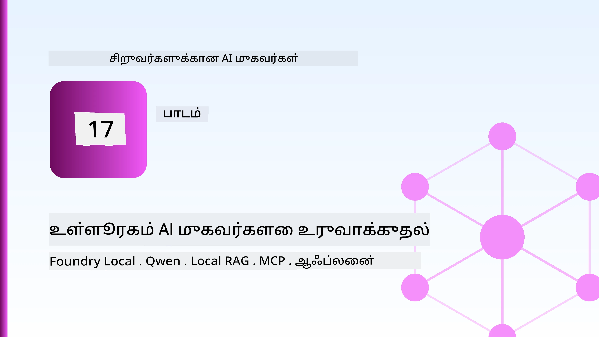
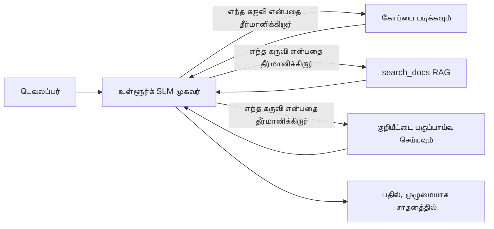
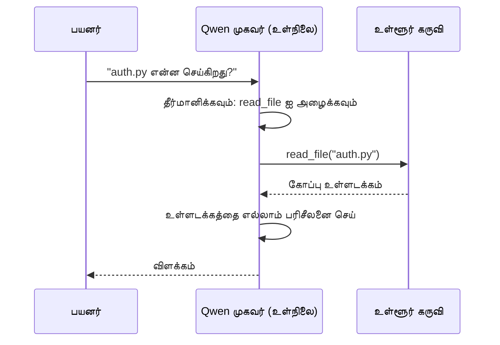
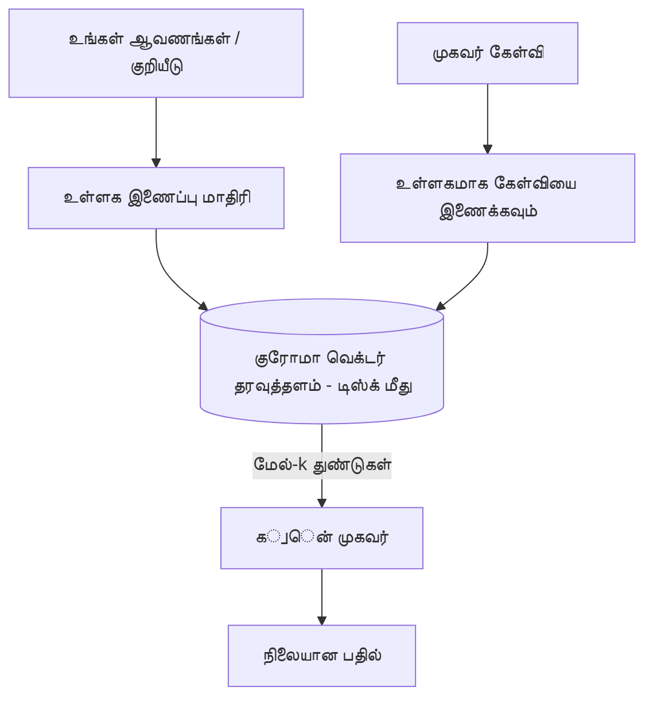
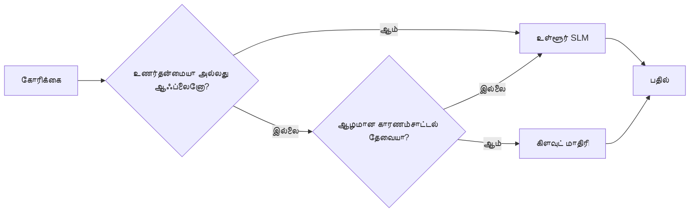

# Microsoft Foundry Local மற்றும் Qwen பயன்படுத்தி உள்ளூர் AI முகவரிகளை உருவாக்கல்



முந்தைய பாடம் முகவரிகளை மேகத்தில் *மேல்* அளவுக்கு எடுத்துச் சென்றது. இப்பாடம் அவற்றை ஒரு தனி கணினியில் *கீழ்* கொண்டு வருகிறது. இறுதிக்குத் துவக்கத்தில் நீங்கள் கோடுகளை விளக்கும், கருவிகளை அழைக்கும், உங்கள் கோப்புக்களைப் படிக்கும், மற்றும் உங்கள் ஆவணம் தேடும் வேலை செய்யும் ஒரு பொறியியல் உதவியாளரைப் பெறுவீர்கள் — **ஒரு முறையும் மேக முன்னறிவிப்பு அழைப்பு இல்லாமல்.**

நீங்கள் இதை ஏன் விரும்புவீர்கள்? உண்மையான பொறியியல் பணியில் அடிக்கடி எழும் மூன்று காரணங்கள்:

- **தனியுரிமை.** குறியீடும் ஆவணங்களும் ஒருபோதும் இயந்திரத்தை விட்டு வெளியே செல்லாது. எந்த வரிசை, குறுக்கு பகுதி, வாடிக்கையாளர் தரவும் நெட்வொர்க் எல்லையை கடந்துவிடாது.
- **செலவு.** உள்ளூர் முன்னறிவிப்புக்கு எந்த டோக்கன்-அமைப்புதலுக்கு கட்டணம் இல்லை. நீங்கள் விலைமதிப்பில்லாமல் முழுநாளும் செயல்படலாம்.
- **ஆஃப்லைன்.** விமானத்தில், பாதுகாக்கப்பட்ட இடத்தில் அல்லது மின்அழுத்தப்பகுதியில் முகவரி இன்னும் செயல்படும்.

பிடிவாதம் என்னவென்றால், நீங்கள் ஒரு முன்வட்ட மேக மாதிரியுடன் பரிமாறிக்கொண்டு உள்ளீர்கள் — உங்கள் CPU, GPU அல்லது NPU-யில் இயங்கும் **சிறிய மொழி மாதிரி (SLM)**. இந்த பாடம் அந்த வரையறுக்கத்தக்க நிபந்தனையில் நல்ல செயல்படும் முகவரிகளை உருவாக்குவதற்றே ஆகும், அந்தவரி இல்லாததுபோல நிழலாவதை முயற்சிப்பதில்லை.

## அறிமுகம்

இந்த பாடத்தில் சேர்க்கப்படும்:

- **சிறிய மொழி மாதிரிகள் (SLMs)** — அவை என்ன, எங்கே சிறப்பாக செயல்படுகின்றன, எங்கே செயல்படவில்லை.
- **Microsoft Foundry Local** — ஒரு இயங்குநிலை, இது சாதனத்திலேயே மாதிரிகளை பதிவிறக்கம் செய்து வழங்குகிறது, மேலும் **OpenAI-க்கு அமைவான API**-யை வழங்குகிறது.
- **Qwen செயலியக் கூப்பிடும் மாதிரிகள்** — உண்மையான உபகரண அழைப்புகளை நம்பகமாக உருவாக்கும் SLM-கள், இது உள்ளூர் *முகவரிகள்* (சொல்லுங்க, உள்ளூர் பேச்சுத்தலைமையே அல்லாமல்) சாத்தியமாக்குகிறது.
- **உள்ளூர் கருவிகள், உள்ளூர் RAG, மற்றும் உள்ளூர் MCP** — முகவரிக்கு மேகத் தடை இல்லாமல் செயல்திறன் தருகிறது.
- **முழுமையான நடைமுறைகள்** — எப்போது செயல்பாடுகளை உள்ளூராக வைத்துக் கொள்ள வேண்டும், எப்போது மேகத்துக்குப் புறப்பட வேண்டும் என்ற முடிவுகள்.

## கற்றல் குறிக்கோள்கள்

இந்த பாடத்தை முடித்தவுடன், நீங்கள் தெரிந்துகொள்ளும்:

- SLM-களின் வர்த்தக-offs-ஐ விளக்கவும் மற்றும் ஏற்ற உள்ளூர் முகவர் பயன்பாடுகளை தேர்ந்தெடுக்கவும்.
- Foundry Local மூலமாக ஒரு Qwen மாதிரியை உள்ளூரில் சேவை செய்யவும், OpenAI-க்கு அமைவான உள் முனையைப் பயன்படுத்தவும்.
- பூரணமாக உங்கள் தளத்தில் இயங்கும் கருவி அழைக்கும் முகவரியை உருவாக்கவும்.
- உள்ளூர் தேவையற்ற ஆவணங்களுக்கான உள்ளூர் RAG-ஐ உள்ளூர் வெக்டர் தரவுத்தளத்துடனான (Chroma) இணைப்பை கொண்டு சேர்க்கவும்.
- முகவரியை உள்ளூர் MCP சேவையகத்துடன் இணைக்கவும், மற்றும் கலவையான உள்ளூர்/மேக வடிவமைப்புக்களை அணுகவும்.

## முன்னுரிமைகள்

இந்த பாடம் முன் பாடங்களைக் கவனித்து முடித்துள்ளதாக கருதி:

- [கருவி பயன்பாடு](../04-tool-use/README.md) (பாடம் 4) மற்றும் [Agentic RAG](../05-agentic-rag/README.md) (பாடம் 5).
- [Agentic நெறிமுறைகள் / MCP](../11-agentic-protocols/README.md) (பாடம் 11).
- [Microsoft முகவர் கோடமைப்பு](../14-microsoft-agent-framework/README.md) (பாடம் 14).

மேலும் இதும் தேவையாகும்:

- ஒரு டெவலப்பர் வேலைப்பளு. **8 GB RAM நாடப்பட்ட குறைந்தபட்சம்**; 16 GB+ நிச்சயமாக வசதியாக இருக்கும். GPU அல்லது NPU உதவியாக இருக்கும், ஆனால் அவசியம் இல்லை.
- **Microsoft Foundry Local** நிறுவியிருக்க வேண்டும் (தளவமைப்பு பகுதியைப் பார்க்கவும்).
- பைத்தான் 3.12+ மற்றும் பொதியிலுள்ள [`requirements.txt`](../../../requirements.txt) பாக்குதல்கள், மற்றும் `foundry-local-sdk`, `openai`, மற்றும் `chromadb` இந்த பாடத்திற்கு.

## சிறிய மொழி மாதிரிகள்: உள்ளூர் பணிக்கான சரியான கருவி

ஒரு முன்றிய மேக மாதிரியில் நூறு கோடியின் மேற்பட்ட அளவுக்கான அளவுகோல்கள் உண்டு மற்றும் ஒரு தரவுத்தள மையம் உள்ளது. ஒரு SLM-க்கு சில கோடிய அளவுகோல்கள் உண்டு மற்றும் அது உங்கள் லேப்டாப் RAM-ல் இணைகின்றது. அந்த வேறுபாடு தெளிவான எதிர்பார்ப்புகளை உருவாக்குகிறது.

**SLM-கள் சிறப்பாக செய்கின்றன:**

- கட்டமைக்கப்பட்ட, வரம்பிடப்பட்ட பணிகள் — வகைப்படுத்தல், எடுக்கும், தெரிவுசெய்தல் ஒரு தெரிந்த ஆவணம்.
- **கருவி அழைத்தல்** — எந்த செயலியை எப்போது அழைக்குவது என்று முடிவு செய்தல்.
- விரைவான, மலிவான, தனியுரிமை உள்ளதான iteration உங்கள் தரவுகளில்.

**SLM-கள் பலவீனமானவை:**

- திறந்த முடிவில்லாத, பல-hop வாதுரைகள் பெரிய சூழலில்.
- விசாலமான உலக அறிவு (அவர்கள் குறைவாக பார்த்தனர் மேலும் மறக்கின்றனர்).

எனவே உள்ளூர் முகவரிகளுக்கான வெற்றிகரமான நெறிமுறை: **SLM க்கு ஒருங்கிணைப்புக் கையாள விடுங்கள், கருவிகள் கடுமையான வேலை செய்யட்டும்.** மாதிரி உங்கள் குறியீட்டையமைவைக் *கட்டாயமாக அறிவதில்லை* – ஆனால் எப்போது `read_file` மற்றும் `search_docs` அழைக்க வேண்டும் என்பதை அறிந்திருக்க வேண்டும். இது SLM-களின் வலிமைகளுக்கு நேரடியாக செல்லும்.



## Microsoft Foundry Local

**Microsoft Foundry Local** என்பது உங்கள் சாதனத்தில் முழுமையாக மாதிரிகளை பதிவிறக்கம் செய்து நிர்வகித்து வழங்கும் எளிதான ஓட்டுநிலை முறையாகும். இது மிக முக்கியமானது, அது ஒரு **OpenAI-க்கு அமைவான HTTP முனையை** வெளிப்படுத்துகிறது — இதன் மூலம் OpenAI SDK மற்றும் Microsoft முகவர் வடிவமைப்பின் OpenAI கிளையண்ட் `base_url` மாற்றத்துடன் மட்டுமே இயங்கும். முகவர் கட்டுமானம் பற்றி நீங்கள் கற்றது நேரடியாக மாறாது; மாற்றம் ஆனால் மேகம் இருந்து `localhost` ஆக முனையம் மாறுகிறது.

Foundry Local உங்கள் சாதனத்திற்கு மிகச்சிறந்த மாதிரி கட்டுமானத்தைத் தேர்வு செய்கிறது — CPU கட்டுமானம், CUDA/GPU கட்டுமானம் அல்லது NPU கட்டுமானம் — அதனால் நீங்கள் சாதனமென ஒவ்வொரு முறை கைராசிக்க வேண்டாம்.

### அமைப்பு

Foundry Local-ஐ நிறுவுக (உங்கள் OSக்கான [ஆவணங்களை](https://learn.microsoft.com/azure/ai-foundry/foundry-local/) பார்க்கவும்), பின்னர் அது வேலை செய்கிறதா என்பதை உறுதிசெய்க:

```bash
# நிறுவுக (உதாரணம்; உங்கள் தளத்தின் ஆவணங்களை பின்பற்றவும்)
winget install Microsoft.FoundryLocal      # விண்டோஸ்கள்
# brew install microsoft/foundrylocal/foundrylocal   # macOS

# ஒரு Qwen மாதிரியை பதிவிறக்கி இயக்கவும், பின்னர் உள்ளூர் சேவையை துவங்கவும்
foundry model run qwen2.5-7b-instruct
foundry service status
```

சேவை இயங்க ஆரம்பித்தவுடன் உங்களுக்கு உள்ளூர், OpenAI-க்கு அமைவான முனை (தொகுதியாக `http://localhost:PORT/v1`) கிடைக்கும். நோட்புக் `foundry-local-sdk` மூலம் முனையை தானாக கண்டுபிடிக்கும், எனவே நீங்கள் போர்ட்டை கடைப்பிடிக்க வேண்டாம்.

## Qwen செயலியக் கூப்பிடுதல்: இது ஏன் முக்கியம்

ஒரு முகவர் ஒரு முகவர் என்று இருப்பது கருவிகளை அழைக்க முடிந்தால் தான். நிறைய SLM-கள் பேசக்கூடியவையாக இருக்கலாம், ஆனால் அவை நம்பகமற்ற மற்றும் தவறான கருவி அழைப்புகளை உருவாக்குகிறார்கள். **Qwen** மாதிரிகள் செயலியக் கூப்பிடுவதற்கான பயிற்சியுடன் வருகின்றன மற்றும் நிலைத்த, சரியான கருவி அழைப்புகளை என்றும் உருவாக்குகின்றன — இதுவே உள்ளூர் பேச்சு மாதிரியை உள்ளூர் *முகவரியாக* மாற்றுகிறது.

ஓட்டப்பாதை நீங்கள் ஏற்கனவே அறிந்து கொண்ட சாதாரண கருவி அழைக்கும் சுழற்சியாகும், வெறும் சாதனத்திலேயே இயங்குகிறது:



## உள்ளூர் RAG

ஆவணத் தேடல் என்பது உள்ளூர் முகவரிகள் தங்களது மதிப்பை பெறும் இடம். SLM உங்கள் கட்டமைப்பினுடைய ஆவணங்களை நினைவில் வைத்திருக்கும் என நம்புவதை விட, அந்த ஆவணங்களை **உள்ளூர் வெக்டர் தரவுத்தளத்தில்** வைத்துக் கொண்டு, முகவர் தேவைக்கேற்ப சரியான பகுதிகளை மீட்டெடுக்க விடுவீர்கள்.

நாங்கள் **Chroma** uporabிச் செய்கிறோம், இது ஒரு சேர்க்கப்பட்ட வெக்டர் கடை, எந்த சேவையக நிர்வாகவும் இல்லாமல் செயல்படும். வழிச் செயல் முழுவதும் உள்ளூர்தான்: உள்ளூர் இணைப்பு மாதிரி → உள்ளூர் வெக்டர்கள் → உள்ளூர் மீட்பு → உள்ளூர் SLM.



இது பாடம் 5 இல் இருந்த Agentic RAG மாதிரியின் நகல்தான் — மாற்றமாக அனைத்து கூறுகளும் உங்கள் இயந்திரத்தில் இயங்குகின்றன.

## உள்ளூர் MCP சேவையகங்கள்

[MCP](../11-agentic-protocols/README.md) என்பது ஒரு போக்குவரத்து முறையாகும், மேக சேவையகமல்ல. MCP சேவையகம் உள்ளூர் செயலாக்கமாக `stdio`-வில் இயங்கி, உங்கள் முகவரிக்கு கருவிகளை வழங்கும். இதன் மூலம் MCP சேவையகங்களின் வளர்ந்துவரும் சூழலை இரத்து செய்துவிடாமலும், கோப்பு அமைப்பு அணுகல், git செயல்பாடுகள், தரவுத்தள விசாரணைகள் போன்றவற்றை முழுமையாக ஆஃப்லைனில் பயன்படுத்தலாம்.

பாதுகாப்பு நிலை மேகத்திலிருந்து மாறுபட்டதாக இருக்கிறது, ஆனால் இல்லாமல் இல்லை: உள்ளூர் MCP சேவையகம் உங்கள் பயனர் அனுமதிகளோடு இயங்குவதால், அது என்னைத் தொடலாம் (ஒரு திட்ட அடைவாய், முழு வீட்டுத்தேவையகம் அல்ல) என்பதைக் கட்டுப்படுத்துங்கள் மற்றும் அதன் வெளியீடுகளை உள்ளீடுகளாக மதிப்பாய்வு செய்யுங்கள்.

## கலவை மேக-வும்-உள்ளூர் நடைமுறைகள்

உள்ளூர் முதற்பாடு என்பது உள்ளூர் மட்டுமே அல்ல. முதிர்ந்த அமைப்புகள் உணர்ச்சிக்குணர்வு மற்றும் கடினத்தன்மையின் அடிப்படையில் மாறுபடுத்திக் கொண்டு விடுகின்றன:

| நிலைமை | எங்கே இயங்கும் |
| --- | --- |
| உணர்ச்சி நுட்ப குறியீடு / தரவு, அல்லது ஆஃப்லைன் | **உள்ளூர் SLM** |
| எளிய, வரம்பிடப்பட்ட பணி | **உள்ளூர் SLM** (மலிவு, விரைவு) |
| கடினமான பல-hop வாதுரை, உணர்ச்சி குறைந்த தரவு | **மேக மாதிரி** |
| எல்லாம், மின்கடத்தலில் | **உள்ளூர் SLM** (மிருதுவான குறைப்பு) |

இது பாடம் 16 இல் இருந்து **மாதிரி பங்கேற்பு** கருத்தை பிரதிபலிக்கிறது — வேறுபாடாக ஒரு "மாதிரியானது" உங்கள் சொந்த இயந்திரம் ஆகும். ஒரு வலுவான வடிவமைப்பு மேகம் கிடைக்கவில்லை என்றால் உள்ளூருக்குத் திரும்பும், அப்படியானால் முகவர் தரத்தில் குறைவு ஏற்பட்டு முற்றிலும் தோல்வி அடைவதில்லை.



## நடைமுறை ஆய்வகம்: உள்ளூர் பொறியியல் உதவியாளர்

[`code_samples/17-local-agent-foundry-local.ipynb`](./code_samples/17-local-agent-foundry-local.ipynb) திறந்து அதில் பணியாற்றவும். நீங்கள் பூரணமாக உங்கள் பணிக்கூடத்தில் இயங்கும் ஒரு **உள்ளூர் பொறியியல் உதவியாளரை** கட்டமைப்பீர்கள், அது செய்யும்:

1. **கருவிகளை அழைக்கவும்** — Foundry Local மூலமாக Qwen செயலியக் கூப்பிடுவதால்.
2. **உள்ளூர் கோப்பு செயல்பாடுகளை செய்யவும்** — ஒரு திட்ட அடைவாயிலுள்ள கோப்புக்களை பட்டியலிடுதல் மற்றும் வாசித்தல்.
3. **குறியீட்டை பகுப்பாய்வு செய்யவும்** — ஒரு மூல கோப்பின் அடிப்படை அளவைகள் அறிக்கை.
4. **ஆவணங்களை தேடுதல்** — Chroma உடன் உள்ளூர் RAG ஒரு ஆவண அடைவில்.
5. **MCP பயன்படுத்தல்** — உள்ளூர் MCP சேவையகத்துடன் இணைப்பது (ஒருவேளை ஒன்றும் உள்ளடக்கப்படவில்லை என்றால் மதிப்புமாற்றம்).

எந்த ஒரு நேரமும் மேக முன்னறிவிப்பினைப் பயன்படுத்தவில்லை.

### நடைமுறையிடல்

உதவியாளர் Foundry Local உடன் OpenAI-க்கு அமைவான முனை மூலம் இணைக்கப்படுகிறது, ஆகவே முகவர் குறியீட்டு மேக பாடத்துடன் சுமார் ஒத்துவகையில் இருக்கும் —唯 மாற்றம் தான் கிளையண்ட்:

```python
from foundry_local import FoundryLocalManager
from openai import OpenAI

# Foundry Local மாதிரியை கண்டறிந்து/பதிவிறக்கி எங்களுக்கு உள்ளூர் எண்ட்பாயிண்டை வழங்குகிறது.
manager = FoundryLocalManager(\"qwen2.5-7b-instruct\")
client = OpenAI(base_url=manager.endpoint, api_key=manager.api_key)  # api_key என்பது உள்ளூர் இடைக்கால இடம் உள்ளது
```

கருவிகள் சாதாரண பைத்தான் செயலிகள், ஒரு திட்ட அடைவுக்கு மட்டுமே வரம்பிட்டவை:

```python
def read_file(path: str) -> str:
    \"\"\"Read a file, but only inside the sandboxed project directory.\"\"\"
    full = (PROJECT_ROOT / path).resolve()
    if PROJECT_ROOT not in full.parents and full != PROJECT_ROOT:
        return \"Access denied: path is outside the project directory.\"
    return full.read_text(encoding=\"utf-8\")
```

சந்தைசேகர் சரிபார்ப்பு கவனியுங்கள் — உள்ளூராகவே, எந்த வழியிலும் கோப்புக்களை வாசிக்கும் கருவி பாதுகாப்பற்றது. நோட்புக் ஒவ்வொரு கருவியையும் ஒரு திட்ட அடைவுக்கு மட்டும் வரம்பிடுகிறது.

## அறிவு சோதனை

பணியின்போது உங்கள் புரிதலை சோதியுங்கள்.

**1. ஒரு முகவரியை மேகத்தில் அல்லாமல் உள்ளூர் இயக்குவதற்கான இரண்டு நிக்கரமான காரணங்களை கூறுக.**

<details>
<summary>பதில்</summary>

எந்த இரண்டு: **தனியுரிமை** (குறியீடு மற்றும் தரவு ஒருபோதும் இயந்திரத்தை விட்டு வெளியே செல்லாது), **செலவு** (ஒரு டோக்கன் கட்டணம் இல்லை), மற்றும் **ஆஃப்லைன் இயற்கை** (நெட்வொர்க் இல்லாதபடியும் — விமானத்தில், பாதுகாப்பான வசதியில், அல்லது மின்வெளிச்சம் இல்லாத போது வேலை செய்கிறது). தரவு சாதனத்திலிருந்து அனுப்புவதை தடுக்கும் விதிமுறைகள் தனியுரிமை காரணத்தை ஊக்குவிக்கின்றன.
</details>

**2. உள்ளூர் முகவரியில் SLM மற்றும் அவற்றின் கருவிகளுக்கு பரிந்துரைக்கப்படும் வேலைப் பகிர்வு என்ன மற்றும் ஏன்?**

<details>
<summary>பதில்</summary>

SLM **ஒருங்கிணைப்பாளராக** நடித்து (எந்த கருவியை எப்போது அழைக்க வேண்டும் மற்றும் எந்த வாதங்களுடன் என்று தீர்மானிக்க), மற்றும் **கருவிகள் கடுமையான பணி செய்யச் செய்யப்பட வேண்டும்** (கோப்புகளை வாசித்தல், ஆவணங்களை பெறுதல், முடிவுகளை கணக்கிடுதல்). SLM-கள் கருவி தேர்விலும் குறுகிய முடிவுகளில் வலுவாக இருப்பினும், பரந்த அறிவும் நீண்ட-hop வாதுரையும் குறைவாகச் செய்கின்றன, ஆகவே கருவிகளை சார்ந்திருத்தல் அவர்கள் வலிமைகளுக்கு ஏற்படும்.
</details>

**3. Foundry Local உடன் மேக முகவர் குறியீட்டை மாற்றாமல் பயன்படுத்துவதற்கு என்ன காரணம்?**

<details>
<summary>பதில்</summary>

Foundry Local ஒரு **OpenAI-க்கு அமைவான HTTP முனையை** வெளிப்படுத்துகிறது. OpenAI SDK மற்றும் முகவர் வடிவமைப்பின் OpenAI கிளையண்ட் `base_url`-ஐ மாற்றுவதன் மூலம் அதற்கு எதிராக செயல்படுகின்றன (உள்ளூர் இடைமுக API விசையைப் பயன்படுத்தி). முகவர் குறியீட்டின் மற்ற அனைத்தும் அதே மாதிரியே இருக்கும்.
</details>

**4. ஏன் நாம் எந்த SLMஆயிற்றாலும் அல்லாமல் Qwen செயலியக் கூப்பிடும் மாதிரியைப் பயன்படுத்துகிறோம்?**

<details>
<summary>பதில்</summary>

ஏனெனில் ஒரு முகவர் நம்பகமான, சரியான **கருவி அழைப்புகளை** உருவாக்க வேண்டும். நிறைய SLM-கள் பேசலாம், ஆனால் தவறான அல்லது ஒரே மாதிரியல்லாத கருவி அழைப்புகளை வெளியிடுகின்றன. Qwen மாதிரிகள் செயலியக் கூப்பிடுதலுக்காக பயிற்சிக்கப்பட்டவையாகும் மற்றும் நிலையான கருவி அழைப்புகளை உருவாக்குகின்றன, இது உள்ளூர் பேச்சு மாதிரியை இயங்கும் உள்ளூர் முகவரியாக மாற்றுகிறது.
</details>

**5. உள்ளூர் RAG நடைமுறையில், எந்த கூறுகள் இயந்திரத்தில் இயங்குகின்றன?**

<details>
<summary>பதில்</summary>

அவை எல்லாம்: இணைப்பு மாதிரி, வெக్టర్ தரவுத்தளம் (Chroma, பதிவாக நுழைந்தது), மீட்பு படி மற்றும் SLM. ஆவணங்கள் உள்ளூரிலேயே இணைக்கப்படுகின்றன, உள்ளூரிலேயே சேமிக்கப்படுகின்றன, உள்ளூரிலேயே மீட்கப்படுகின்றன, மற்றும் உள்ளூர் மாதிரியால் விளக்கப்படுகின்றன — எந்த கூறும் மேகத்தை தொடுவதில்லை.
</details>

**6. உங்களது கணினியில் உள்ளூர் MCP சேவையகம் இயங்குகிறது. அது தானாகவே பாதுகாப்பானதா? நீங்கள் எவ்வகை முன்னெச்சரிக்கை எடுப்பீர்கள்?**

<details>
<summary>பதில்</summary>

இல்லை. உள்ளூர் MCP சேவையகம் உங்கள் பயனர் அனுமதிகளுடன் இயங்கும், ஆகவே அது நீங்கள் தொடக்கக்கூடிய அனைத்தையும் தொடலாம். அதை இது தேவைப்படுகிற இடத்திற்கு மட்டும் வரையுங்கள் (ตัวอย่างเช่น திட்ட அடைவு மட்டுமே, வீட்டு முழு அடைவு அல்ல) மற்றும் அதன் வெளியீடுகளை உள்ளீடுகளைப் போன்றவையாக மதிப்பாய்வு செய்யவும்.
</details>

**7. உள்ளூர் மாதிரி உள்ள ஒரு தர்க்கமான கலவை வழிநடத்தல் விதியை விவரிக்கவும்.**

<details>
<summary>பதில்</summary>

உணர்ச்சிக்கொண்டவையோ ஆஃப்லைனில் உள்ளவையோ உள்ளூர் SLM-க்கு செல்க; எளிய வரம்பிடப்பட்ட பணி விரைவாகவும் மலிவாகவும் உள்ளூர் SLM-க்கு இடுக; கடினமான பல-hop வாதுரையை உணர்ச்சி குறைவான தரவில் மேக மாதிரிக்கு இடுக; மேகம் கிடைக்கவில்லை என்றால் உள்ளூர் SLM-க்கு திரும்பி முகவர் தரத்தில் மிருதுவான குறைவு ஏற்படுத்தவும் அதுவே தோல்வியடைவதில்லை. இது பாடம் 16-ன் மாதிரி வழிநடத்தல் (model routing) ஆகும், இதில் உள்ளூர் இயந்திரம் மாதிரியான ஒன்றாக உள்ளது.
</details>

**8. இந்த பாடத்தில் உள்ளூர் முகவரியை இயக்குவதற்கு ஒரு உள்ளூரான குறைந்தபட்ச RAM எவ்வளவு, மற்றும் அதிக RAM உங்களுக்கு என்ன வழங்கும்?**

<details>
<summary>பதில்</summary>

சுமார் **8 GB** ஒரு குறைந்தபட்சமாக உள்ளது; 16 GB+ வசதியாக இருக்கும். அதிக RAM மூலம் பெரிய, திறமையான மாதிரிகளை இயக்க முடியும் மற்றும் நீண்டகால சூழலை நினைவில் வைக்க முடியும். GPU அல்லது NPU முன்னறிவிப்பை விரைவுபடுத்துகிறது, ஆனால் அவசியம் இல்லை — Foundry Local எப்போதும் ஒரு CPU கட்டுமானத்தைத் தேர்ந்தெடுக்கிறது, ஏதேனும் விருத்தி இல்லாத போது.
</details>

## பணிச் செய்முறை

உள்ளூர் பொறியியல் உதவியாளரை விரிவாக்கி உங்கள் விருப்பமான ஒரு சிறிய திட்டத்திற்கு **உள்ளூர் ஆவண மதிப்பாய்வாளராக்கவும்** (இந்த பத்திரிகை பாட மடங்குகளிலுள்ள ஒன்றைக் பயன்படுத்தலாம்).

உங்கள் சமர்ப்பிப்பு:

1. ஒரு உண்மையான ஆவணங்கள்/குறியீட்டை Chroma இல் குறியீடு செய்யவும் (குறைந்தது ஐந்து கோப்புகள்).
2. திட்டத்தில் உள்ள `TODO`/`FIXME` கருத்துக்களைப் பார்வையிடும் மற்றும் கோப்பு மற்றும் வரிசை எண்ணுடன் அவற்றை மீட்டெறும் `find_todos` கருவியைச் சேர்க்கவும் — `read_file` போன்றே சந்தைசேகர் சரிபார்ப்பு கட்டுப்பாடு உண்டு.

3. **எஜன்டிடம் மூன்று கேள்விகளை கேளுங்கள்** அவை கருவிகளை ஒருங்கிணைக்க வற்புறுத்தும் வகையில்: ஒன்று தூய RAG கேள்வி, ஒன்று குறிப்பிட்ட கோப்பைப் படிக்க வேண்டிய கேள்வி, மற்றும் ஒன்று TODOக்கான விசாரணை கேள்வி.
4. **அதை அளவிடுங்கள்**: மூன்று பதில்களை ஒவ்வொன்றாக நேரத்தை கணக்கிட்டு, அவற்றை ஒரு மார்க்டவுன் செலிலில் குறியுங்கள். உங்கள் எதிர்பார்க்கும் வேலைநிரலைக்கான தாமதம் ஏற்றுக்கொள்ள கூடியதா என கருத்து தெரிவித்துக்கொள்ளுங்கள்.

பிறகு இந்த மதிப்பாய்வாளர் மெயின் மாற்ற எதை மேகத்திற்கு மாற்றுவீர்கள் மற்றும் எதை உள்ளூர் வைத்திருப்பீர்கள் என்பது குறித்த ஒரு சிறிய ஃபாராக்கிராபைப் பின்பற்றுங்கள், மற்றும் ஏன் என்பதை விளக்குங்கள். உள்ளூர் கூறுகள் சரியாக இணைக்கப்பட்டுள்ளனவா மற்றும் உங்கள் கலந்து முடிவு செய்வதைக் குறிக்கும் திறன் soundஆக இருக்கிறதா என்பதை மதிப்பிடுவார்கள் — மாதிரியின் தரத்தைப்பற்றியல்ல.

## சுருக்கம்

இந்த பாடத்தில், நீங்கள் முழுமையாக உங்கள் சொந்த இயந்திரத்தில் இயங்கும் ஒரு எஜன்டை கட்டியுள்ளீர்கள்:

- **SLMs** தனியுரிமை, செலவு மற்றும் ஆஃப்லைன் செயல்பாட்டிற்காக பரப்பளவை மாற்றுக் கொடுக்கின்றன — மற்றும் **கருவிகளை ஒதுக்கி இயக்குகையில்** சிறந்த விளைவு வழங்குகின்றன, அவர்கள் எல்லா அறிவையும் தாங்களே கையில் வைக்காமல்.
- **Foundry Local** OpenAI-க்கு இணக்கமான ஒரு இடைமுகத்தின் பின்னணியில் சாதனத்தில் மாதிரிகளை வழங்குகிறது, ஆகவே உங்கள் மேக எஜன்ட் குறியீடு ஒரு வரி மாற்றத்துடன் மாற்றப்படுகிறது.
- **Qwen function-calling மாதிரிகள்** நம்பகமான உள்ளூர்கருவி கால் செய்வதைக் கொள்கின்றன — இதனால் உள்ளூர் *எஜன்ட்கள்* சாத்தியமாகின்றன.
- **உள்ளூர் RAG** (குரோமா) மற்றும் **உள்ளூர் MCP** இயந்திரத்தை விட்டு வெளியேறாமல் எஜன்டுக்கு திறனை வழங்குகின்றன.
- **கலவை எடுத்துக்காட்டு வழிகள்** நீங்கள் உணர்திறன் மற்றும் கடினத்தன்மையின் அடிப்படையில் வழிமொழிய அனுமதிக்கின்றன, உள்ளூர்மயமாக ஒரு நற்குணமாக்கலாக.

இது பயன்படுத்தல் வளைவு (deployment arc) முடியும்: பாடம் 16 ஸ்கேல் செய்யக்கூடிய எஜன்ட்களை Microsoft Foundryக்கு மேல் உயர்த்தியது, இந்த பாடம் ஒரு தனி பணிப் பரிமாணத்தில் அவற்றை குறைத்தது. அடுத்த பாடம் பாதுகாப்புப் பெற்று எஜன்ட்களை வைக்கும்முறை பற்றியது.

## கூடுதல் வளங்கள்

- <a href="https://learn.microsoft.com/azure/ai-foundry/foundry-local/" target="_blank">Microsoft Foundry உள்ளூர் ஆவணங்கள்</a>
- <a href="https://learn.microsoft.com/azure/ai-foundry/what-is-azure-ai-foundry" target="_blank">Microsoft Foundry ஆவணங்கள்</a>
- <a href="https://aka.ms/ai-agents-beginners/agent-framework" target="_blank">Microsoft எஜன்ட் கட்டமைப்பு</a>
- <a href="https://qwen.readthedocs.io/en/latest/framework/function_call.html" target="_blank">Qwen செயலி அழைப்பு ஆவணங்கள்</a>
- <a href="https://modelcontextprotocol.io/" target="_blank">மாதிரி சூழல் நெறிமுறை (MCP)</a>
- <a href="https://docs.trychroma.com/" target="_blank">குரோமா வெக்டர் தரவுத்தளம்</a>

## முந்தைய பாடம்

[பெரிதாக்கக்கூடிய எஜன்ட்களை பயன்படுத்தல்](../16-deploying-scalable-agents/README.md)

## அடுத்த பாடம்

[பாதுகாப்பான AI எஜன்ட்கள்](../18-securing-ai-agents/README.md)

---

<!-- CO-OP TRANSLATOR DISCLAIMER START -->
**மறுப்பு**:
இந்த ஆவணம் AI மொழிபெயர்ப்பு சேவை [Co-op Translator](https://github.com/Azure/co-op-translator) பயன்படுத்தி மொழிபெயர்க்கப்பட்டுள்ளது. நாங்கள் துல்லியத்திற்காக முயற்சி செய்துள்ளோம், ஆனால் தானாக செய்யப்படும் மொழிபெயர்ப்புகளில் பிழைகள் அல்லது தவறுகள் இருக்கலாம் என்பதை கவனத்தில் கொள்ளவும். அசல் ஆவணம் அதன் தாய்மொழியில் அதிகாரப்பூர்வ ஆதாரமாக கருதப்பட வேண்டும். முக்கியமான தகவல்களுக்கு, தொழில்நுட்பமான மனித மொழிபெயர்ப்பு பரிந்துரைக்கப்படுகிறது. இந்த மொழிபெயர்ப்பைப் பயன்படுத்துவதால் ஏற்படும் எந்த தவறான புரிதல்கள் அல்லது தவறான விளக்கத்திற்கும் நாங்கள் பொறுப்பில்வில்லை.
<!-- CO-OP TRANSLATOR DISCLAIMER END -->