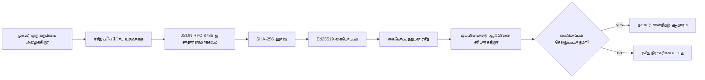
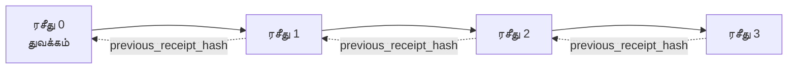

[பாடம் காணொளியைப் பாருங்கள்: குறியாக்க ரசீதுகளுடன் AI முகவர்களை பாதுகாப்பது](https://youtu.be/PLACEHOLDER_VIDEO_ID)

> _(பாடம் காணொளியும் அதன் குறுந்திரையும் Microsoft உள்ளடக்கக் குழுவினால் இணைப்புக்குப் பிறகு சேர்க்கப்படும், பாடம் 14 / 15 ஒற்றுமையில்.)_

# குறியாக்க ரசீதுகளுடன் AI முகவர்களை பாதுகாப்பது

## அறிமுகம்

இந்த பாடத்தில் கையாளப்படும் விஷயங்கள்:

- AI முகவர்களின் கணக்கீட்டுப் பாதைகள் இணக்கமான நிலை, பிழைத்திருத்தம் மற்றும் நம்பிக்கைக்காக முக்கியம் என்பது.
- குறியாக்க ரசீதுகள் என்றால் என்ன மற்றும் அது கையொப்பமிடப்படாத பதிவு வரிசையிலிருந்து எப்படி வேறுபடுகிறது என்பதைக்.
- ஒரு முகவரின் கருவி அழைப்புக்கு எளிய Python-ல் கையொப்பமிடப்பட்ட ரசீதைக் குறிக்க எப்படி உருவாக்குவது.
- ஒரு ரசீதினை ஆஃப்லைனில் சரிபார்த்து மாற்றங்களை கண்டுபிடிப்பது எப்படி.
- அடுத்ததிதான் சிக்கலான ரசீதுகளை தொடுசெய்தல், ஆனால் ஒன்று அகற்றப்படவோ அல்லது மறுசீரமைக்கப்படவோ செய்தால் சங்கிலி உடைகிறது என்பதை.
- ரசீதுகள் எதை நிரூபிக்கின்றன மற்றும் அவை தெளிவாக என்ன நிரூபிக்காமலிருக்கின்றன என்பதைக் குறித்து.

## பயில்வோர் இலக்குகள்

இந்த பாடத்தை முடித்த பிறகு நீங்கள் தெரிந்து கொள்வீர்கள்:

- முகவர் நடவடிக்கைகளுக்கான குறியாக்க வரலாற்றை ஊக்குவிக்கும் தோல்வி நிலைகளை அடையாளம் காண.
- பெரும்பான்மையான JSON பிதற்றுக் காப்பு மேலே Ed25519 கையொப்ப ரசீதினை உருவாக்குக.
- கையொப்பமிட்டவரின் பொது திறவுகோலை மட்டும் பயன்படுத்தி ரசீதினை சுயமாகச் சரிபார்க்க.
- மாற்றிய ரசீதினை மீண்டும் சரிபார்த்து மாற்றத்தை கண்டுபிடிக்க.
- ரசீதுகளின் ஒரு சங்கிலியைக் கட்டமைக்கவும் சங்கிலி அவசியம் என்று விளக்கவும்.
- ரசீதுகள் எதை நிரூபிக்கின்றன (கையொப்பமிடுதல், ஒருமையான தன்மை, வரிசை) மற்றும் அவை எதை நிரூபிக்காமலும் இருப்பது (நடவடிக்கை சரியானதா, கொள்கை நிலைத்தன்மை) ஆகியவற்றின் எல்லையை அடையாளமாக்க.

## பிரச்சனை: உங்கள் முகவரின் கண்காணிப்பு தடம்

Contoso Travel க்கான ஒரு AI முகவரியை உருவாக்கியுள்ளீர்கள் எனக் கற்பனை செய்யுங்கள். அந்த முகவர் வாடிக்கையாளர் கோரிக்கைகளை வாசித்து, விமானங்களுக்கான API-ஐ அழைத்து விருப்பங்களை காண்கிறது, பிறகு வாடிக்கையாளருக்காக இருக்கைகளை முன்பதிவு செய்கிறது. கடந்த காலாண்டில், அந்த முகவர் 50,000 முன்பதிவுகளை செயலாக்கியது.

இன்று ஒரு கணக்காய்வாளர் வருகிறார். அவரின் எளிய கேள்வி: "உங்கள் முகவர் என்ன செய்தது என்பதை காண்பிக்கவும்."

உங்கள் பதிவு கோப்புகளை நீங்கள் ஒப்படைக்கிறீர்கள். கணக்காய்வாளர் அவைகளைப் பார்த்து கடுமையான கேள்வி கேட்கிறார்: "இவை திருத்தப்படவில்லை என்று நான் எப்படி நம்புவேன்?"

இப்படிப்பட்டது கண்காணிப்பு தட பிரச்சனை. பெரும்பாலான முகவர் அமைப்புகள் இன்று சார்ந்திருக்கும்:

- **விண்ணப்ப பதிவு கோப்புகள்**: முၤவர் தக்கட்டி எழுதுகிறது, கோப்பு அமைப்பின் அணுகலைக்கொண்ட யாரும் திருத்தக்கூடியவை.
- **மேக பதிவு சேவைகள்**: மேடையால் மாற்றங்கள் உறுதிசெய்து காட்டப்படும் ஆனால் கணக்காய்வாளர் மேடை நிர்வாகியை நம்பினால் மட்டுமே.
- **தரவுத்தள பரிவர்த்தனை பதிவுகள்**: தரவுத்தள மாற்றங்களுக்கு பொருத்தமானவை ஆனால் எப்போதும் கருவி அழைப்புகளுக்கானவை அல்ல.

இவை ஒன்றும் கணக்காய்வாளரின் கேள்விக்கு பதிலளிக்க முடியாது, அணிஅணிபற்ற நிலத்தையும் வழங்குவதற்காக யாரையும் நம்ப மிகவும் அவசியமாகிறது (நீங்கள், உங்கள் மேக வழங்குநர், உங்கள் தரவுத்தள வழங்குநர்). உள்ளக பயன்பாட்டிற்காக, அந்த நம்பிக்கை போதுமானதாக இருக்கும். கட்டுப்படுத்தப்படும் வேலைக்கு (பணம், சுகாதாரம், ஐரோப்பிய AI சட்டம் உட்பட), அது பொருந்தாது.

குறியாக்க ரசீதுகள் இந்த பிரச்சனையை தீர்க்கின்றன, ஒவ்வொரு முகவர் நடவடிக்கும் சுயமாக சரிபார்க்கக்கூடியதாக ஆக்குவதன் மூலம். கணக்காய்வாளர் உங்களை நம்ப தேவையில்லை. அவருக்கு உங்கள் பொது திறவுகோலும் ரசீதும் மட்டும் வேண்டும்.

## குறியாக்க ரசீதென்ன?

ஒரு ரசೀತ் என்பது ஒரு JSON பொருள், ஒரு முகவர் என்ன செய்ததென பதிவு செய்கிறது மற்றும் ஒரு டிஜிட்டல் கையொப்பத்துடன் கையொப்பமிடப்பட்டுள்ளது.



ஒரு குறைந்தபட்ச ரசீத் இதுபோல் இருக்கும்:

```json
{
  "type": "agent.tool_call.v1",
  "agent_id": "contoso-travel-bot",
  "tool_name": "lookup_flights",
  "tool_args_hash": "sha256:a3f9c1...",
  "result_hash": "sha256:7b2e1d...",
  "policy_id": "contoso-travel-policy-v3",
  "timestamp": "2026-04-25T14:30:00Z",
  "sequence": 47,
  "previous_receipt_hash": "sha256:9d4e6a...",
  "signature": {
    "alg": "EdDSA",
    "sig": "c5af83...",
    "public_key": "8f3b2c..."
  }
}
```

இதன் பணி மூன்று பண்புகளால் அமைகிறது:

1. **கையொப்பம்**. இந்த ரசீத் முகவரின் வாசலால் Ed25519 தனிப்பட்ட திறவுகோலைப் பயன்படுத்தி கையொப்பமிடப்படுகிறது. தொடர்புடைய பொது திறவுகோலுள்ள எவரும் கையொப்பத்தை ஆஃப்லைனில் சரிபார்க்கலாம். எந்த புலத்திலும் மாற்றம் கையொப்பம் செல்லுபடியாகாது.

2. **கனோனிக்கல் குறியீடு**. கையொப்பமிடுவதற்கு முன், ரசீத் JSON Canonicalization Scheme (JCS, RFC 8785) பயன்படுத்தி தொடருக்கோட்டாக மாற்றப்படுகிறது. இதனால் இரண்டு செயலாக்கிகள் ஒரே தவறற்ற ரசீதினை அதேபோல் பைட்-அடையாளத்துடன் உருவாக்கும். கனோனிக்கல் முறையில்லாமல், வேறுபட்ட JSON தொடர்க்கருவிகள் ஒரே உள்ளடக்கத்திற்கு வெவ்வேறு கையொப்பங்களை உருவாக்குவார்கள்.

3. **ஹாஷ் சங்கிலி**. `previous_receipt_hash` புலம் ஒவ்வொரு ரசீதையும் அதன் முந்தைய ரசீதுக்குக் கட்டுப்படுத்துகிறது. ஒரு ரசீதை அகற்றினால் அல்லது மறுசீரமைத்தால் அதன் பின் வரும் அனைத்துத் தொக்கைகளின் ரசீதுகள் உடைந்து விடும். தனிப்பட்ட கையொப்பங்கள் செல்லுபடியாகவில்லை என இருந்தாலும் சங்கிலியில் மாற்றம் தெளிவாக இருக்கும்.

இந்த பண்புகள் மூன்று உறுதிப்படுத்துதலை வழங்குகின்றன:

- **கையொப்பமிடல்**: இந்த திறவுகோல் இந்த உள்ளடக்கத்தை கையொப்பமிட்டது.
- **ஒருமை**: கையொப்பமிடப்பட்ட பிறகு உள்ளடக்கம் மாற்றப்படவில்லை.
- **வரிசை**: இந்த ரசீத் அந்த ரசீதுக்குப் பின்னர் வந்தது.

## Python-ல் ரசீதை உருவாக்குதல்

ரசீதை உருவாக்க சிறப்பு நூலகம் தேவையில்லை. குறியாக்க கருவிகள் பரவலாகக் கிடைக்கின்றன மற்றும் மலர்ச்சியுள்ள லாஜிக் Python-ல் சில நூறு வரிகள்தான்.

`code_samples/18-signed-receipts.ipynb` எனும் கை-பணியிலுள்ள பயிற்சிகள் முழு சுழற்சியைக் காட்டுகின்றன. சுருக்கமாக:

```python
import json
import hashlib
import base64
from nacl import signing
from jcs import canonicalize  # RFC 8785 கதறிய JSON

def b64url_nopad(data: bytes) -> str:
    return base64.urlsafe_b64encode(data).decode("ascii").rstrip("=")

def sha256_canonical(obj) -> str:
    """SHA-256 of a Python object's JCS-canonical JSON form."""
    return f"sha256:{hashlib.sha256(canonicalize(obj)).hexdigest()}"

# கையொப்பக் கீயை உருவாக்கவும் அல்லது ஏற்றவும் (உற்பத்தியில், கீ வால்டில் சேமிக்கவும்)
signing_key = signing.SigningKey.generate()
verify_key = signing_key.verify_key

# ரசீதின் தரவை உருவாக்கவும் (கையொப்பு இன்றி)
tool_args = {"origin": "SYD", "destination": "LAX"}
tool_result = [{"flight": "QF11", "price": 1850, "stops": 0}]

payload = {
    "type": "agent.tool_call.v1",
    "agent_id": "contoso-travel-bot",
    "tool_name": "lookup_flights",
    "tool_args_hash": sha256_canonical(tool_args),
    "result_hash": sha256_canonical(tool_result),
    "policy_id": "contoso-travel-policy-v3",
    "timestamp": "2026-04-25T14:30:00Z",
    "sequence": 0,
    "previous_receipt_hash": None,
}

# கதறிய அளவை, ஹாஷ், கையொப்பமிடுக.
canonical_bytes = canonicalize(payload)
message_hash = hashlib.sha256(canonical_bytes).digest()
signature_bytes = signing_key.sign(message_hash).signature

# கட்டமைக்கப்பட்ட கையொப்ப பொருளை இணைக்கவும்.
receipt = {
    **payload,
    "signature": {
        "alg": "EdDSA",
        "sig": b64url_nopad(signature_bytes),
        "public_key": b64url_nopad(bytes(verify_key)),
    },
}
```

இதுவே முழு கையொப்ப முறை. நோட்டுப் புத்தகத்தில் ஒவ்வொரு படியும் விளக்கமாக உள்ளது.

## ரசீதின் சரிபார்ப்பு மற்றும் மாற்றத்தை கண்டுபிடித்தல்

சரிபார்ப்பு மறுபடியுமான செயல்:

```python
import base64
import hashlib
from nacl import signing
from nacl.exceptions import BadSignatureError
from jcs import canonicalize

def b64url_decode(s: str) -> bytes:
    padding = "=" * ((4 - len(s) % 4) % 4)
    return base64.urlsafe_b64decode(s + padding)

def verify_receipt(receipt: dict) -> bool:
    # கையொப்பம் ஒரு அமைந்த பொருள்: {"alg", "sig", "public_key"}.
    sig_obj = receipt.get("signature")
    if not sig_obj or sig_obj.get("alg") != "EdDSA":
        return False

    # உண்மையில் கையொப்பமிடப்பட்ட பையலோடு மறுஅமைக்கவும் (கையொப்பம் தவிர எல்லாவற்றையும்).
    payload = {k: v for k, v in receipt.items() if k != "signature"}

    canonical_bytes = canonicalize(payload)
    message_hash = hashlib.sha256(canonical_bytes).digest()

    try:
        verify_key = signing.VerifyKey(b64url_decode(sig_obj["public_key"]))
        verify_key.verify(message_hash, b64url_decode(sig_obj["sig"]))
        return True
    except BadSignatureError:
        return False
```

இந்த செயலி ஒரு ரசீதைப் பெற்று அதன் கையொப்பம் செல்லுபடியாக இருந்தால் `உண்மை` திருப்பும், இல்லை என்றால் `பொய்`. எந்த வலைப்பிணைய அழைப்பும் தேவையில்லை, எந்த சேவை சார்ந்தDEPENDENCY-லும் இல்லை, எந்த மூன்றாவது பக்கம் நம்பிக்கை தேவையில்லை.

மாற்றத்தை கண்டுபிடிப்பதற்கு தயாரிக்க, நோட்டுப் புத்தகம் பின்வரும் நிகழ்வுகளை நடத்துகிறது:

1. செல்லுபடியாகும் ரசீதைப் பெற்று சரிபார்த்தல்.
2. `tool_args_hash` புலத்தின் ஒரு பைட்டை மாற்றுதல்.
3. மீண்டும் சரிபார்த்து தோல்வியை காண்தல்.

இது ரசீதுகள் மாற்றத்தைக் காட்டுவதை செயல்பாட்டுக்கூறும்; சிறிய மாற்றமும் கையொப்பத்தை உடைக்கும்.

## பல படிகளுக்கான முகவர்களுக்கு ரசீதுகள் சங்கிலி

ஒரு கையொப்பமிடப்பட்ட ரசீதும் ஒரு நடவடிக்கையை பாதுகாக்கிறது. ரசீதுகளின் சங்கிலி ஒரு தொடரை பாதுகாக்கிறது.



ஒவ்வொரு ரசீதும் அதற்கு முன் இருந்த ரசீதின் ஹாஷை பதிவுசெய்கிறது. ரசீத 2-ஐ மவுன்தோட்டியாக அகற்றுவதற்கு, அதிபர்:

- ரசீத 3-இன் `previous_receipt_hash` புலத்தை மாற்றுவது (இது ரசீத 3-இன் கையொப்பத்தை உடைக்கும்), அல்லது
- மாற்றிய ரசீத 3-க்கு புதிய கையொப்பத்தை உருவாக்குவது (முகவரின் தனிப்பட்ட திறவுகோலை தேவைப்படும்).

தனிப்பட்ட திறவுகோல் ஹார்ட்வெர் கீ வால்டில் இருந்தால் மற்றும் ஒவ்வொரு ரசீதுடனும் பொது திறவுகோல் வெளியிடப்பட்டால், எந்தத் தாக்குதலும் கண்டுபிடிக்கப்படும் இல்லாமல் முடியாது.

நோட்டுப் புத்தகம் பின்வருவதை விளக்குகிறது:

1. மூன்று ரசீதுகளின் சங்கிலியை உருவாக்குதல்.
2. ஒவ்வொரு ரசீதின் `previous_receipt_hash` உண்மையான முன்னைய ரசீதின் ஹாஷுடன் பொருந்துகிறதா என்று சரிபார்க்க.
3. நடுவிலுள்ள ஒரு ரசீதை மாற்றி சங்கிலி அந்த இடத்தில் முறிந்து போனதை காண.

இதுவே நீங்கள் வெளிப்படையான கணக்காய்வாளர் நம்பவில்லை என்று இருப்பினும் சரிபார்க்கக்கூடிய கண்காணிப்பு தடத்தை உருவாக்கும் முறையாகும்.

## ரசீதுகள் நிரூபிக்கும் வண்ணம் (மற்றும் நிரூபிக்காதவை)

இது இந்த பாடத்தின் மிக முக்கியமான பகுதி. ரசீதுகள் சக்திமிக்கவை ஆனால் அவற்றின் சக்தி எல்லை கொண்டது.

**ரசீதுகள் மூன்று விஷயங்களை நிரூபிக்கின்றன:**

1. **கையொப்பமிடல்**: ஒரு தனிப்பட்ட திறவுகோல் ஒரு குறிப்பிட்ட பையை கையொப்பமிட்டது.
2. **ஒருமை**: கையொப்பமிடப்பட்ட பை மாற்றப்படவில்லை.
3. **வரிசை**: இந்த ரசீத் அந்த ரசீதுக்குப் பின் இந்த சங்கிலியில் வருகிறது.

**ரசீதுகள் நிரூபிக்கவில்லை:**

1. **சரியான செயல்முறை**: முகவரின் நடவடிக்கை சரியானதா என்பதைக். தவறான பதிலுக்காகவும் ரசீதம் நன்கு கையொப்பமிடப்படலாம்.
2. **கொள்கை தட்டுபாடு**: `policy_id`-இல் குறிக்கப்பட்ட கொள்கை மதிப்பீடு செய்யப்பட்டதா அல்லது இருந்தால் அனுமதிக்கப்படும் என்பதோ. ரசீதம் எப்படிக் கூறப்பட்டது அதுவே என பதிவுசெய்கிறது, யாரும் கட்டாயப்படுத்தவில்லை.
3. **திறவுகோலுக்கு அப்பாலுள்ள அடையாளம்**: ரசீதம் "இந்த திறவுகோல் இந்த உள்ளடக்கத்தை கையொப்பமிட்டது" என்று கூறுகிறது. "இந்த மனிதர் இதற்கான அனுமதி வைத்தார்" என்று கூறுவதில்லை. ஒருவரை அல்லது நிறுவனத்தைக் கீயுடன் இணைக்க தனித்த அடையாள முறைமை தேவை.
4. **உள்ளீடுகளின் உண்மைத்தன்மை**: முகவர் ஒரு குறியிடப்பட்ட அங்கீகாரத்தைக் கிடைத்து அதன்படி செயல்பட்டால், ரசீதம் அந்த நடவடிக்கையை உண்மையானதாகக் பதிவு செய்கிறது. ரசீதுகள் உள்ளீடு சோதனையின் கீழ் செயல்படுகின்றன, மாற்றுத் பதிலாக அல்ல.

இந்த எல்லை இரு காரணங்களுக்காக முக்கியம்:

- இது ரசீதுகள் எதற்கும் பயன்படுகிறது - முகவர் நடத்தையை கணக்காய்வு செய்யச் செய்ய மற்றும் மாற்றம் வெளிப்படைக்கும், கூடுதல் நிறுவனர் எல்லைகளுக்கு கடந்தும்.
- மேலும் நீங்கள் தேவைப்படும் அடுக்குகளை - உள்ளீடு சோதனை (பாடம் 6), கொள்கை அமலாக்கம் (கீழே சுருக்கமாக காணப்படும்), மற்றும் அடையாளம் முறைமை (இந்த பாடத்திற்கான வரம்பு வெளியே).

பொதுவாக "நமக்கு ரசீதுகள் உள்ளன" என்றால் "நாம் ஆட்சி பெற்றுள்ளோம்" என்று எண்ணுவது தவறானது. ரசீதுகள் ஒரு அடித்தளம். ஆட்சி என்பது நீங்கள் அதன் மேல் கட்டிய அமைப்பு.

## மனிதர் உறுதியான நடவடிக்கையை நிரூபித்தல்

மேல் உள்ள 3வது அம்சம் தனியான பகுதி பெறுகிறது: ஒரு செயல்முறை ரசீதம் "இந்த திறவுகோல் இந்த உள்ளடக்கத்தை கையொப்பமிட்டது" என்று சொல்கிறது, "ஒரு மனிதர் இதனை அனுமதி செய்தார்" என அல்ல. உயர்நிலை ஆபத்துகள் உள்ள நடவடிக்கைகளுக்கான ஆட்சி அமைப்புகள் இப்படி ஒரு சான்றிதழை வேண்டுகின்றன, இது இந்த பாடத்தில் நீங்கள் ஏற்கனவே உருவாக்கிய குறிப்போடு செய்யக்கூடியது.

தொடரான நோட்டுப் புத்தகம் `code_samples/human-authorization-receipts.ipynb` மறுபடியும் ஒரு ரசீதான `human.approval.v1`-ஐ இந்த பாடத்தின் ரசீதுகளின் உறையடிப்படையில் சேர்க்கிறது (Ed25519 கையொப்ப அடிப்படையிலான தொகுத்த SHA-256 உடன் டைப் செய்யப்பட்ட பை, கையொப்ப தொகுதி கையொப்பமிடப்பட்ட பை நடுவே அல்ல). ஒரு பெயரிட்ட அனுமதியாளர் **முழு கனோனிக்கல் செயல்முறை மற்றும் அதன் திரட்டலை** கையொப்பமிட்டு நிறைவேற்றுவதற்கு முன் கையொப்பமிடுவார்; முகவரின் செயல்முறை ரசீதம் அந்த **அதே செயல்முறை திரட்டலை** மற்றும் `parent_approval_ref`-ஐ கொண்டு இருக்கும், அனுமதியின் `receipt_hash`, இது மேலுள்ள சங்கிலியில் உள்ள `previous_receipt_hash` முறைமையைப் பயன்படுத்துகிறது. ஒரு `verify_chain` இரண்டு ஆவணங்களையும் **பிரித்துள்ள சுடுகாட்டப்பட்ட திறவுகோல் பதிவு மையங்களில்** (அனுமதியாளர் கீக்கள் மற்றும் முகவர் கீகள்) செயல்படுத்துகிறது, எனவே கோடிங் பாதை பொதுவாக இருக்கிறது ஆனால் அதிகாரிகள் ஒருபோதும் கூடியது அல்ல.

இதன் மூலம் கிடைக்கும் பண்பு, கவனமாகக் கூறப்படுகிறது: *மனிதர் இந்த சரியான நடவடிக்கையை அனுமதி செய்தார், மற்றும் முகவர் அதே அனுமதிக்கப்பட்ட செயல்பாட்டை ஏற்றார்.* நோட்டுப் புத்தகத்தில் நிராகரிப்பு நிலைகள் இதை உண்மையானதாக்காணச் செய்கின்றன:

- பாரம்பரிய தொகுப்பு: மாற்றம் செய்யுதலை, குழப்பத்தில் தவறானவர், மீண்டும் பாவனை, இரண்டு பக்கங்களிலும் உருவாக்கப்பட்ட கீகள், தவறான உள்ளீடு;
- **பழைய அதிகாரம்**: ஒரு கையொப்பம் இன்னும் சரிபார்க்கப்படுகிறது, இருந்தாலும் மறுப்பிக்கப்பட்டது, ஏனெனில் கொள்கை பதிப்பு மாற்றப்பட்டது, அனுமதியாளர் கீ சுடுகாடிலிருந்து அகற்றப்பட்டது, அல்லது அனுமதி நிறைவு செய்யப்படுவிடமுன் காலாவதியானது;
- **திரட்டல் மாற்றம்**: ஒரு சரியான கையொப்பக் கொண்ட செயல்முறை ரசீதம் ஒரு *வெவ்வேறு* கனோனிக்கல் செயல்முறைக்கான *உண்மையான* அனுமதியை குறிக்கும்.

ஒவ்வொரு தோல்வியும் வேறுபட்ட காரணத்துடன் மறுக்கும், எனவே கணக்காய்வாளர் அதை வாசிப்பதில் அதிகாரம் பழையதா அல்லது செயல்முறை மாற்றமா என்பதைக் காண முடியும். நோட்டுப் புத்தகம் கற்றுக் கொள்ளும் விதி: கையொப்பமிடப்பட்ட அனுமதி ஒரே தனக்கே அதிகாரம் அல்ல. ஆட்சி இருக்கும் என்பது இரு ரசீதுகளும் செயல்முறைக்கு ஒரே கனோனிக்கல் தொடர்பை கொண்டிருப்பதில் மட்டுமே. இந்த பாடம் பின்பற்றும் இணையமைப்பு-கையொப்ப பாதை (`draft-farley-acta-signed-receipts`) இந்த முறையின் தரநிலை வடிவம் ஆகும்.

## உருவாக்கக் குறிப்புகள்

இந்த பாடத்தில் உள்ள Python குறியீடு மிகக் குறைந்தது, அத்துடன் அனைத்து வரிகளையும் வாசித்து நிகழ்நிலை புரிந்து கொள்வதற்காக. தயாரிப்பில் இரண்டு விருப்பங்கள் உண்டு:

1. **குறியாக்க கருவிகளின் மேல் நேரடியாக கட்டமைக்க**. மேலே காண்பிக்கப்பட்ட 50 வரிகள் பல நியமங்களுக்குப் போதுமானவை. PyNaCl (Ed25519) மற்றும் `jcs` தொகுப்பு (கனோனிக்கல் JSON) பராமரிக்கப்பட்ட மற்றும் ஆய்வு செய்யப்பட்ட நூலகங்கள்.

2. **தயாரிப்பு ரசீத நூலகம் பயன்படுத்த**. பல திறந்த மூல திட்டங்கள் அதே வடிவத்தை கூடுதல் அம்சங்களுடன் (கீ சுழற்சி, தொகுப்பின் சரிபார்ப்பு, JWK தொகுப்பு விநியோகம், கொள்கை இயந்திர இணைப்பு) அமுல்படுத்துகின்றன:
   - இந்த பாடத்தில் பயன்படுத்தப்படும் ரசீத வடிவம் IETF இணையவழியில் நிலவிற்குள் இருப்பது ([`draft-farley-acta-signed-receipts`](https://datatracker.ietf.org/doc/draft-farley-acta-signed-receipts/), திருத்தம் 02), அதன் தரநிலை செயல்முறையில் உள்ளது, பொதுவான சரிபார்ப்பு தொகுப்புடன் ([agent-governance-testvectors](https://github.com/ScopeBlind/agent-governance-testvectors)) சுயாதீன செயலாக்கங்கள் அதற்கு ஒத்திசைவாக அறியப்படும்.
   - Microsoft Agent Governance Toolkit ரசீதுகளை சடர் அடிப்படையிலான கொள்கை முடிவுகளுடன் எடுக்கும்; அந்த களஞ்சியத்தில் பாடம் 33 காணவும் முழு உதாரணத்திற்காக.
   - `protect-mcp` (npm) மற்றும் `@veritasacta/verify` (npm) தொகுதிகள் Node அடிப்படையிலான ரசீத கையொப்பம் மற்றும் ஆஃப்லைன் சரிபார்ப்பை வழங்குகின்றன, எந்த MCP சேவையையும் மாற்றம் உறுதிப்படுத்தக்கூடிய கண்காணிப்பு தடத்துடன் மூடியது, வலைஅதிகாரம் கொண்ட இடைவிடுப்பு இயக்கத்தில் முறை அனுமதி ரசீதம் வெளியிடுகிறது (டெஸ்க்டாப் வழியில் WebAuthn ஆதரவு), மேலே மனித ஆத்தரிசேஷன் நோட்டுபுத்தகப் பொருத்தம் போலவே.
   - **[nobulex](https://github.com/arian-gogani/nobulex)** Python SDK (`pip install nobulex`) அதே Ed25519 + JCS கையொப்ப வடிவமைப்பை Python-ல் LangChain மற்றும் CrewAI இணைப்புகளுடன் வழங்குகிறது, வெளியிடப்பட்ட இணை சோதனை வஞ்சிகள் மற்றும் [OWASP PR #2210](https://github.com/OWASP/CheatSheetSeries/pull/2210) வழியாக வழங்கப்பட்ட இணக்கம் வரைபடத்துடன்.

உங்கள் சொருகியிருக்கும் மற்றும் நூலகம் பயன்படுத்தும் இடையே தீர்மானம் உங்கள் சொந்த JWT நூலகம் எழுதும் அல்லது பரிசோதிக்கப்பட்ட ஒன்றைப் பயன்படுத்தும் இடையில் உள்ள தீர்மானத்தை ஒத்தது: இரண்டும் பொருத்தமானவை; நூலகம் நேரத்தை சேமிக்கிறது மற்றும் ஆய்வு பரப்பை குறைக்கிறது; தொடக்கமாக எழுதுதல் ஒவ்வொரு குறியாக்கத்தையும் புரிந்துகொள்ள வைக்கிறது. இந்த பாடம் தொடக்க வழியை கற்றுத்தறிவிக்கிறது ஆகவே இரு வழிகளுக்கும் அடித்தளமாகும்.

## அறிவு சோதனை

பயிற்சிக்கு முன்னர் உங்கள் அறிவை சோதிக்கவும்.

**1. ஒரு ரசீதுக்கு முகவரின் தனிப்பட்ட Ed25519 திறவுகோல் கொண்டு கையொப்பமிடப்படுகிறது. கணக்காய்வாளருக்குக் கையொப்பமிடப்பட்ட பொது திறவுகோல் மட்டும் உள்ளது. கணக்காய்வாளர் ரசீதினை ஆஃப்லைனில் சரிபார்க்க முடியுமா?**

<details>
<summary>பதில்</summary>

ஆம். Ed25519 சரிபார்ப்பு கையொப்பமிடப்பட்ட பை மற்றும் பொது திறவுகோலை மட்டுமே தேவைப்படும். எதும் வலை அழைப்பும், சேவை சார்பறிக்கை இருக்காது. இது ரசீதுகளை வானசிலையைத் தவிர வாடிக்கையாளர் அமைப்புகளுக்குள் அல்லது குறைந்த நம்பிக்கை வெளியில் பயனுள்ளதாக ஆக்குகிறது.
</details>

**2. ஒரு தாக்குபவர் ஒரு ரசீதின் `policy_id` புலத்தை மேலாண்மை உரிமைகள் அதிகமான கொள்கை உட்பட்டதாக மாற்றுகிறார். கையொப்பம் அதை மாத்திரமே பாத்தமைப்பிலேயே உள்ளது. சரிபார்ப்பின் போது என்ன நடக்கும்?**

<details>
<summary>பதில்</summary>


சரிபார்ப்பு தோல்வியடைகிறது. கையொப்பம் அசல் பாவனையின் canonical எண்ணிக்கைகளில் கணக்கிடப்பட்டது; எந்த புலத்தையும் மாற்றுவது canonical எண்ணிக்கைகளை மாற்றுகிறது, அது SHA-256 ஹாஷை மாற்றுகிறது, இது கையொப்பத்தை செல்லாதபடியாக்கிறது. தாக்குபவர் புதிய செல்லுபடியான கையொப்பத்தை உருவாக்க தனிப்பட்ட விசையை தேவைப்படும், ஆனால் அவர்கள் அதனை வைத்திருக்கவில்லை.
</details>

**3. ராைக் காரணிகள் மற்றும் முடிவுகளை விட ரசீதில் `tool_args_hash` மற்றும் `result_hash` ஏன் சேர்க்கப்பட்டுள்ளன?**

<details>
<summary>பதில்</summary>

இரண்டு காரணங்கள். முதலில், ரசீது, அச்சிடப்படவோ அல்லது பரிமாறப்படவோ செய்யப்படும் சூழல்களில் ராைக உள்ளடக்கம் (PII, வணிக தகவல்) கசிவது பிரச்சனை ஆகியவை நிகழக்கூடும். ஹாஷிங் ரசீதை சிறியதாகவும் உள்ளடக்கத்தை தனிப்பட்டதாகவும் வைத்திருக்கிறது; பரிசோதகர் முற்பட்ட உள்ளடக்கத்தின் தனித்த பக்கலிசை பொருத்துகிறார் என்பதை சரிபார்க்கிறார். இரண்டாவதாக, ஹாஷ்களுக்கு நிலையான அளவு உண்டு; ஹாஷ்கள் உடைய ரசீது, உள்ளீடுகளின் மற்றும் வெளியீடுகளின் அளவு எந்த அளவிலும் இருந்தாலும், ஒரு கட்டுப்பாட்டில் இருக்கும். 
</details>

**4. `previous_receipt_hash` புலம் ஒவ்வொரு ரசீதையும் அதன் முன்கூட்டியவை கொண்டுசெல்லும். ஒரு தாக்குபவர் சங்கிலியில் நடுவில் உள்ளரு ரசீதை சுட்டிக்காட்டாமல் நீக்கினால், என்ன செல்லாது ஆகும்?**

<details>
<summary>பதில்</summary>

நீக்கப்பட்டதால் பிறகு வந்த ஒவ்வொரு ரசீதும் செல்லாது ஆகும். அவற்றின் `previous_receipt_hash` புலங்கள் உண்மையான சங்கிலிக்கு பொருந்தாது (ஏனெனில் அவர்கள் குறிப்பிடும் ரசீது இனிமில்லை அல்லது சங்கிலி இனிமேலும் வேறு முன்னோடியை குறிக்கிறது). நீக்கத்தை மறைக்க, தாக்குபவர் பிறகு வந்த ஒவ்வொரு ரசீதையும் மறுகையொப்பம் செய்யத் தேவைப்படும், அதற்கு தனிப்பட்ட விசை தேவை. 
</details>

**5. ஒரு ரசீது சுத்தமாக சரிபார்க்கிறது. அது முகவரின் செயல் சரியானதா, நியாயமானதா அல்லது கொள்கைக்கு இணங்குகிறதா என்பதை நிரூபிக்கிறதா?**

<details>
<summary>பதில்</summary>

இல்லை. ஒரு செல்லுபடியான ரசீது மூன்று விஷயங்களை நிரூபிக்கிறது: ஒதுக்கீடு (இந்த விசை இந்த உள்ளடக்கத்தை கையொப்பமிட்டது), ஒழுங்குமுறை (உள்ளடக்கம் மாறவில்லை), மற்றும் வரிசை (இப்போதைய ரசீது அந்த ரசீதுக்கு பிறகு வந்தது). இது செயல் சரியானது, `policy_id` இல் குறிப்பிடப்பட்ட கொள்கை உண்மையில் மதிப்பீடு செய்யப்பட்டுள்ளது, அல்லது முகவர் ஒவ்வொரு விதியையும் பின்பற்றியுள்ளார் என்பதை நிரூபிக்காது. ரசீதுகள் முகவர் செயல்பாட்டை ஆராயத்தக்கவையாக நிரூபிக்கின்றன, தவிர சரியானதல்ல. இது பாடத்தில் முக்கியமான எல்லை.
</details>

## பயிற்சி பயன்முறை

`code_samples/18-signed-receipts.ipynb` ஐ திறந்து நான்கு பிரிவுகளை முழுமைப்படுத்தவும்:

1. **பிரிவு 1**: முதல் ரசீதை கையொப்பமிட்டு சரிபார்க்கவும்.
2. **பிரிவு 2**: ரசீதுடன் சவால் செய்து சரிபார்ப்பு தோல்வி ஆனது கவனிக்கவும்.
3. **பிரிவு 3**: மூன்று ரசீது சங்கிலியை கட்டி சங்கிலி உண்மைத்தன்மையை சரிபார்க்கவும்.
4. **பிரிவு 4**: எண்ணெய் முக வழிமுறை ஊடாக தயாரிக்கப்பட்ட முகவரில் கையொப்பமிட்டு ரசீதமாக உருவாக்கி, அதனை தனியாகச் சரிபார்க்கவும்.

**விரிவாக்க சவால் 1:** நீங்கள் தேர்ந்தெடுக்கும் கூடுதல் புலத்துடன் ரசீது திட்டத்தை நீட்டு (உதாரணமாக, தடயத்திற்கான கோரிக்கை ஐடி), canonical கையொப்ப நிலையை புதுப்பித்து அதைச் சேர்க்கவும், ரசீது இன்னும் சரிபார்க்கப்படுவதை உறுதி செய்யவும். அதன் பிறகு கையொப்பம் பிறகு அந்த புலத்தை மாற்றி சரிபார்ப்பு தோல்வியடைந்ததை உறுதி செய்யவும். ஒவ்வொரு canonical குறியீட்டுக் குறிச்சொல்லின் ஒவ்வொரு பைட்டும் கையொப்பத்திற்கு எப்படி பங்கு கொடுக்கும் என்பதை நீங்கள் அறிந்து கொள்ள இது உதவும்.

**விரிவாக்க சவால் 2:** உங்கள் இரண்டு ரசீதுகளின் canonical எண்ணிக்கைகளை இணைத்து SHA-256 ஹாஷ் செய்யவும் மற்றும் மூன்றாம் ரசீதின் புதிய புலமாக உறுதி செய்யப்பட்ட ஹாஷை சேர்க்கவும். மூன்று ரசீதுகளும் இன்னும் சரிபார்க்கப்படுவதை உறுதி செய்யவும். நீங்கள் இப்போது ஒரு படி உட்புகுவதை நிரூபிப்பை கட்டியுள்ளீர்கள்: மூன்றாம் ரசீதை வைத்திருப்பவர் முதல் இரண்டு ரசீதுகள் கையொப்பமிடப்பட்ட நேரத்தில் இருந்ததென நிரூபிக்கலாம், அவற்றின் உள்ளடக்கங்களை வெளிப்படுத்த வேண்டியதில்லை. இது தேர்ந்தெடுக்கப்பட்ட வெளிப்பாட்டு ரசீதுகள் பெருமளவில் பயன்படுத்தும் வடிவமைப்பு (Merkle உறுதிமொழிகள், RFC 6962).

## முடிவு

குறியாக்க ரசீதுகள் AI முகவர்களுக்கு பின்வைக்கும் பாதையை வழங்குகின்றன, அது:

- **சுயமாக சரிபார்க்கக்கூடியது**: பொதுச்சாவி கொண்ட எந்தக் கட்சியும் சரிபார்க்கலாம், சேவை சார்பற்றது.
- **சவால் சான்று**: எந்த மாற்றமும் கையொப்பத்தை செல்லாதவனாக்கும்.
- **இடமாற்றக்கூடியது**: ரசீது ஒரு சிறிய JSON கோப்பு; அதனைச் சேமிக்கவும், பரிமாறவும், எங்கும் சரிபார்க்கவும் முடியும்.
- **معايير ஒத்துழைப்பு**: Ed25519 (RFC 8032), JCS (RFC 8785), மற்றும் SHA-256 ஆகியவற்றில் கட்டப்பட்டது, கடலாய் பரவலாக பயன்படுத்தப்படும் முறைகள்.

அவை உள்ளீடு சரிபார்ப்பு, கொள்கை அமலாக்கம், அல்லது அடையாள அமைப்பிற்கு மாற்றாக இல்லை. அவை அதே அடித்தளத்தை வழங்குகின்றன. நீங்கள் முகவர்களை கட்டுப்பட்ட பணி சூழல்களில், பன்முக கட்டுப்பாட்டு வேலைவாய்ப்புகளில் அல்லது எதிர்கால ஆய்வாளர் உங்களை நம்பலாம் என்பது உறுதிப்படுத்த முடியாத சூழலில் பயன்படுத்தும் போது, ரசீதுகள் ஆடிட் பாதையை நேர்மையாக நிரூபிக்க உதவும்.

மிக முக்கியமான எடுத்து செல்ல வேண்டிய விடயம்: ரசீதுகள் யார் என்ன சொன்னார்கள் மற்றும் எப்போது சொன்னார்கள் என்பதை நிரூபிக்கின்றன. அவர்கள் சொன்னது உண்மையா அல்லது தகுதியுள்ளதா என்பதை நிரூபிக்காது. அந்த வேறுபாட்டினை நிச்சயமாக வைத்துக் கொள்ளுங்கள். அது நேர்மையான தோற்றம் அமைப்பும் தவறான ஒன்றுக்கும் இடையேயான வேறுபாடு.

## உற்பத்தி சரிபார்ப்பு பட்டியல்

இந்த பாடத்தை முடித்த பிறகு বাস্তவ சூழலில் கையொப்பமிடப்பட்ட முகவர்களை பிரச்சு செய்ய தயாராகும்போது:

- [ ] **கையொப்ப விசையை உருவாக்குநர் லேப்டாப்பிலிருந்து அகற்றவும்.** Azure Key Vault, AWS KMS அல்லது ஒரு ஹார்ட்வேரு பாதுகாப்பு தொகுதி பயன்படுத்தவும். உங்கள் ரசீதங்களுக்கு கையொப்பமிடும் தனிப்பட்ட விசை ஒருபோதும் மூலக் கட்டுப்பாட்டில் அல்லது பயன்பாட்டு கணினிகளில் வைக்கப்படக் கூடாது.
- [ ] **சரிபார்ப்பு பொதுச்சாவியை வெளியிடவும்.** ஆய்வாளர்கள் அதை ஆஃப்லைனில் சரிபார்க்க வேண்டும். சாதாரண வடிவம் JWK தொகுப்பாகவும் பிரபல URL இல் கிடைக்கும் (RFC 7517), உதாரணம்: `https://your-org.example.com/.well-known/agent-keys.json`.
- [ ] **சங்கிலியை வெளிப்புறமாக அங்கீகரிக்கவும்.** காலந்தொடர்பாக சமீபத்திய சங்கிலி தலை ஹாஷை தெளிவுத்தாழ்வுக் குறிப்பில் எழுதுங்கள் (Sigstore Rekor, RFC 3161 நேர அங்கீகாரத்துவம், அல்லது இன்னொரு உள்ளக அமைப்பு) ஆகவே வெளிப்புறக் கட்சி "இந்த சங்கிலி இந்த நேரத்தில் இருந்தது" என்று உறுதி செய்யக்கூடும்.
- [ ] **ரசீதுகளை மாற்றமுடியாதவையாக சேமிக்கவும்.** சேமிப்பு அடுக்கில் மட்டும் சேர்க்கும் (Azure சேமிப்பு தொடர்ந்து நிலைத்தன்மை கொள்கைகள், AWS S3 பொருள் பூட்டு) உட்பட அன்று உள்ளமைப்பின் வரலாற்றை மறுபதிவு செய்வதை தடுக்கும்.
- [ ] **காப்பாற்றும் காலத்தை தீர்மானிக்கவும்.** பலக் கட்டுப்பாட்டு முறைமைகள் பல வருடங்கள் காப்பாற்ற கோருகிறன. ரசீதின் வளர்ச்சிக்கு திட்டமிடுங்கள் (ஒவ்வொரு ரசீதும் ~500 பைட்டுகள்; ஒரு முகவர் நாளைக்கு 10,000 அழைப்புகள் செய்யும் போது ஆண்டுக்கு ~1.8 GB ஆகும்).
- [ ] **ரசீதுகள் எந்த விஷயங்களை உள்ளடக்காது என்பதை ஆவணப்படுத்தவும்.** ரசீதுகள் ஒதுக்கீடு, ஒழுங்குமுறை மற்றும் வரிசையை நிரூபிக்கின்றன. உங்கள் ரன்புக் தெளிவாக எந்த கூடுதல் கட்டுப்பாடுகள் (உள்ளீடு சரிபார்ப்பு, கொள்கை அமலாக்கம், வீதம் வரம்பு, அடையாள அமைப்பு) உங்கள் ஆடிட் நிலைப்பாட்டுடன் ஜோடிக்கப்படுகின்றன என்பதை பட்டியலிட வேண்டும்.

### AI முகவர்களை பாதுகாப்பதற்கான கூடுதல் கேள்விகள் உள்ளதா?

Microsoft Foundry Discord ([https://aka.ms/ai-agents/discord](https://aka.ms/ai-agents/discord)) இல் இணைந்துகொண்டு பிற கற்கையாளர்களை சந்திக்கவும், அலுவலக நேரங்களில் கலந்து கொள்ளவும் மற்றும் உங்கள் AI முகவர் கேள்விகளுக்கு பதில்களை பெறவும்.

## இந்த பாடத்துக்கு அப்பால்

இந்த பாடம் ஒரே ரசீது கையொப்பம் மற்றும் ஹாஷ் சங்கிலிச் சீருடைகளை உள்ளடக்கியது. அதே துவக்கவியல் பல மேம்பட்ட மாதிரிகளாக இணைக்கப்படலாம், உங்கள் ஆடிட் நிலை மேம்படும் போது நீங்கள் சந்திக்கும்:

- **தேர்வு வெளிப்படைத்தன்மை.** ஒரு ரசீதின் புலங்கள் தனித்தனியாக உறுதிச்செய்யப்பட்டுவிட்டால் (RFC 6962 பாணி Merkle மரம்), நீங்கள் குறிப்பிட்ட புலங்களை குறிப்பிட்ட ஆய்வாளர்களுக்கு தெரிவிக்கலாம் மற்ற புலங்கள் மாற்றமில்லாமல் இருப்பதை நிரூபிக்கலாம். அதே ரசீது விரிவான ஆடிடுக்கு (முழுமையை விரும்பும்) மற்றும் தரவு குறைத்தல் விதிகள் போன்ற GDPR (ஆய்வாளர் மிகக் குறைவாகவே காணவேண்டும்) ஆகியோருக்கு இணங்க இருக்கும்போது பயன்படும்.
- **ரசீது ரத்து செய்யல்.** கையொப்ப விசை மீளச்செயலாக்கப்பட்டால், நீங்கள் அந்த விசை கையொப்பமிட்ட அனைத்து ரசீதுகளையும் ஒருநேரத்திலிருந்து நம்பமுடியாதவையாகக் குறிக்க வேண்டும். சாதாரண மாதிரிகள்: குறுகிய கால கையொப்ப விசைகள் மற்றும் வெளியிடப்பட்ட ரத்துச் பட்டியல், அல்லது ஒரு தெளிவுத்தாழ்வு பதிவேடு ரத்துச் குறிச்சொற்களுடன்.
- **இருமுக / பிளவுபட்ட கையொப்ப ரசீதுகள்.** சில நடைமுறைகள் கையொப்பமிடப்பட்ட பாவனை பகுதியை முன்-செயலாக்கம் (`authorization_*`) மற்றும் பின்-செயலாக்கம் (`result_*`) என்ற இரண்டு பகுதிகளாக பிரித்து தனித்தனி கையொப்பங்களுடன் வைப்பது, அங்கீகாரத் தீர்மானமும் மறைக்கப்பட்ட முடிவும் வேறு நடிகர்களால் வேறு நேரங்களில் தயாரிக்கப்படும்போது பயனுள்ளது. இது இந்த பாடத்தில் கற்ற ரசீது வடிவத்தில் மேலோட்டமாக சேர்க்கப்படுகிறது.
- **பாவனை தொகுப்பு.** ராசீது நீங்கள் `result_hash` இல் வைக்கும் எந்த பைட்டுகளை மூடுகிறது. உண்மையான உலக பாவனைகள் ஒரே ஒரு கருவி அழைப்பின் முடிவிற்குக் காட்டிலும் அதிகமானவை: முன்னோக்கிச் சிந்தனை (மாதிரி கணிப்புகள், பரிந்துரைகள், சாட்சி மற்றும் அதன் முழுமை, அபாய நிலை, பொறுப்புத்தாள் சங்கிலி, கதவை முடிவு) அனைத்தும் பாவனையில் இருக்கலாம், ஒரு ரசீதால் தட்டிக்கூடியது. இது ரசீது வடிவத்தை சிறியதாக வைத்திருக்க உதவுகிறது, பாவனை திட்டங்கள் துறைகுறித்து முன்னேறலாம்.
- **இணையலை மீறிய ஒத்துழைப்பு.** ஒரே ரசீது வடிவத்தின் பல சுதந்திரமாக செயல்படும் நடைமுறைகள் (Python, TypeScript, Rust, Go) பாடத்தில் பயன்படுத்திய பரிசோதனை வாக்களங்களுக்கு எதிராக தானாக சரிபார்க்கின்றன. நீங்கள் உங்கள் சொந்த நடைமுறையை கட்டிக்கொண்டால், வெளியிடப்பட்ட வாக்களங்களை எதிரொலிக்கும் வடிவமைப்பு தகுந்திருப்பதை உறுதி செய்யலாம்.
- **பின்-குவாண்டம் மாற்றம்.** Ed25519 இன்று பரவலாக பயன்படுத்தப்படுகிறது ஆனால் இது குவாண்டம்-தடையை வழங்காது. ரசீது வடிவம் நுட்ப அறிவியல் மாற்றம் செய்யும் வகை: `signature.alg` புலம் `ML-DSA-65` (NIST பின்-குவாண்டம் கையொப்ப முறை) என்பதை கொண்டு இனி மாற்ற வேண்டும் போது பயன்படுத்தலாம். ரசீதுகள் இரட்டை கையொப்பமிடப்பட்ட காலத்தை பிளான் செய்யவும்.

## கூடுதல் வளங்கள்

- <a href="https://datatracker.ietf.org/doc/draft-farley-acta-signed-receipts/" target="_blank">IETF Internet-Draft: Signed Decision Receipts for Machine-to-Machine Access Control</a>
- <a href="https://learn.microsoft.com/azure/ai-studio/responsible-use-of-ai-overview" target="_blank">பதில் சொல்லும் AI சார்ந்த பொறுப்பாக செயல்படும் பணிகள் (Azure AI)</a>
- <a href="https://datatracker.ietf.org/doc/html/rfc8032" target="_blank">RFC 8032: எட்வர்ட்ஸ்-வளைவு மின்முத்திரை கையொப்ப முறை (EdDSA)</a>
- <a href="https://datatracker.ietf.org/doc/html/rfc8785" target="_blank">RFC 8785: JSON Canonicalization திட்டம் (JCS)</a>
- <a href="https://datatracker.ietf.org/doc/html/rfc6962" target="_blank">RFC 6962: சான்றிதழ் தெளிவுத்தாழ்வு </a>(Merkle மரம் கட்டமைப்பு தேர்வு வெளிப்பாட்டுச் ரசீதுகளில் பயன்படும்)
- <a href="https://github.com/microsoft/agent-governance-toolkit/blob/main/docs/tutorials/33-offline-verifiable-receipts.md" target="_blank">Microsoft Agent Governance Toolkit, Tutorial 33: ஆஃப்லைன் சரிபார்க்கக்கூடிய முடிவு ரசீதுகள்</a>
- <a href="https://github.com/ScopeBlind/agent-governance-testvectors" target="_blank">இதே ரசீது வடிவத்திற்கு பல நடைமுறைகளின் ஒத்துழைப்பு சோதனை விகிதங்கள்</a> (Apache-2.0)
- <a href="https://pynacl.readthedocs.io/" target="_blank">PyNaCl ஆவணம்</a> (Python இல் Ed25519)

## முந்தய பாடம்

[நகர்ப்புற AI முகவர்களை உருவாக்குதல்](../17-creating-local-ai-agents/README.md)

---

<!-- CO-OP TRANSLATOR DISCLAIMER START -->
**மறுப்பு**:
இந்த ஆவணம் AI மொழிபெயர்ப்பு சேவை [Co-op Translator](https://github.com/Azure/co-op-translator) பயன்படுத்தி மொழிபெயர்க்கப்பட்டுள்ளது. நாங்கள் துல்லியத்திற்காக முயற்சி செய்துள்ளோம், ஆனால் தானாக செய்யப்படும் மொழிபெயர்ப்புகளில் பிழைகள் அல்லது தவறுகள் இருக்கலாம் என்பதை கவனத்தில் கொள்ளவும். அசல் ஆவணம் அதன் தாய்மொழியில் அதிகாரப்பூர்வ ஆதாரமாக கருதப்பட வேண்டும். முக்கியமான தகவல்களுக்கு, தொழில்நுட்பமான மனித மொழிபெயர்ப்பு பரிந்துரைக்கப்படுகிறது. இந்த மொழிபெயர்ப்பைப் பயன்படுத்துவதால் ஏற்படும் எந்த தவறான புரிதல்கள் அல்லது தவறான விளக்கத்திற்கும் நாங்கள் பொறுப்பில்வில்லை.
<!-- CO-OP TRANSLATOR DISCLAIMER END -->