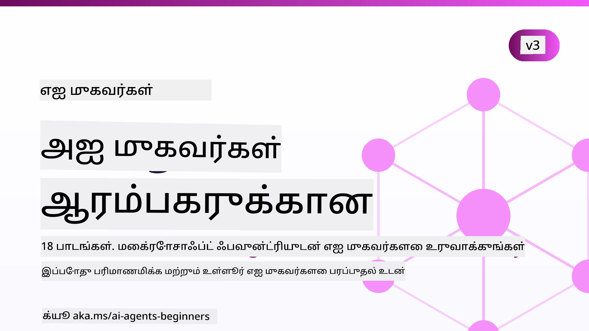

# தொடக்கத்திற்கான AI முகவர்கள் - ஒரு பாடநெறி



## AI முகவர்களை கட்டமைக்கத் தொடங்க அனைவருக்கும் தேவையான அனைத்தையும் கற்பது ஒரு பாடநெறி

[](https://github.com/microsoft/ai-agents-for-beginners/blob/master/LICENSE?WT.mc_id=academic-105485-koreyst)
[](https://GitHub.com/microsoft/ai-agents-for-beginners/graphs/contributors/?WT.mc_id=academic-105485-koreyst)
[](https://GitHub.com/microsoft/ai-agents-for-beginners/issues/?WT.mc_id=academic-105485-koreyst)
[](https://GitHub.com/microsoft/ai-agents-for-beginners/pulls/?WT.mc_id=academic-105485-koreyst)
[](http://makeapullrequest.com?WT.mc_id=academic-105485-koreyst)

### 🌐 பல மொழி ஆதரவு

#### GitHub செயல்முறை மூலம் ஆதரிக்கப்படுகிறது (தானாகவும் எப்போதும் புதுப்பிக்கப்பட்டதாகவும்)

<!-- CO-OP TRANSLATOR LANGUAGES TABLE START -->
[Arabic](../ar/README.md) | [Bengali](../bn/README.md) | [Bulgarian](../bg/README.md) | [Burmese (Myanmar)](../my/README.md) | [Chinese (Simplified)](../zh-CN/README.md) | [Chinese (Traditional, Hong Kong)](../zh-HK/README.md) | [Chinese (Traditional, Macau)](../zh-MO/README.md) | [Chinese (Traditional, Taiwan)](../zh-TW/README.md) | [Croatian](../hr/README.md) | [Czech](../cs/README.md) | [Danish](../da/README.md) | [Dutch](../nl/README.md) | [Estonian](../et/README.md) | [Finnish](../fi/README.md) | [French](../fr/README.md) | [German](../de/README.md) | [Greek](../el/README.md) | [Hebrew](../he/README.md) | [Hindi](../hi/README.md) | [Hungarian](../hu/README.md) | [Indonesian](../id/README.md) | [Italian](../it/README.md) | [Japanese](../ja/README.md) | [Kannada](../kn/README.md) | [Khmer](../km/README.md) | [Korean](../ko/README.md) | [Lithuanian](../lt/README.md) | [Malay](../ms/README.md) | [Malayalam](../ml/README.md) | [Marathi](../mr/README.md) | [Nepali](../ne/README.md) | [Nigerian Pidgin](../pcm/README.md) | [Norwegian](../no/README.md) | [Persian (Farsi)](../fa/README.md) | [Polish](../pl/README.md) | [Portuguese (Brazil)](../pt-BR/README.md) | [Portuguese (Portugal)](../pt-PT/README.md) | [Punjabi (Gurmukhi)](../pa/README.md) | [Romanian](../ro/README.md) | [Russian](../ru/README.md) | [Serbian (Cyrillic)](../sr/README.md) | [Slovak](../sk/README.md) | [Slovenian](../sl/README.md) | [Spanish](../es/README.md) | [Swahili](../sw/README.md) | [Swedish](../sv/README.md) | [Tagalog (Filipino)](../tl/README.md) | [Tamil](./README.md) | [Telugu](../te/README.md) | [Thai](../th/README.md) | [Turkish](../tr/README.md) | [Ukrainian](../uk/README.md) | [Urdu](../ur/README.md) | [Vietnamese](../vi/README.md)

> **உள்ளூரில் கிளோன் செய்வது விரும்பும்தா?**
>
> இந்த கிடங்கில் 50 க்கும் மேற்பட்ட மொழி மொழிபெயர்ப்புகள் அடங்கியுள்ளன, இது பதிவிறக்க அளவை பெரிய அளவு அதிகரிக்கிறது. மொழிபெயர்ப்புகள் இல்லாமல் கிளோன் செய்ய, sparse checkout ஐ பயன்படுத்தவும்:
>
> **Bash / macOS / Linux:**
> ```bash
> git clone --filter=blob:none --sparse https://github.com/microsoft/ai-agents-for-beginners.git
> cd ai-agents-for-beginners
> git sparse-checkout set --no-cone '/*' '!translations' '!translated_images'
> ```
>
> **CMD (Windows):**
> ```cmd
> git clone --filter=blob:none --sparse https://github.com/microsoft/ai-agents-for-beginners.git
> cd ai-agents-for-beginners
> git sparse-checkout set --no-cone "/*" "!translations" "!translated_images"
> ```
>
> இதனால் படிப்பை முடிக்க தேவையான அனைத்தும் வேகமான பதிவிறக்கத்துடன் கிடைக்கும்.
<!-- CO-OP TRANSLATOR LANGUAGES TABLE END -->

**மேலும் மொழிப் மொழிபெயர்ப்புகளை ஆதரிக்க விரும்பினால், அவை [இங்கே](https://github.com/Azure/co-op-translator/blob/main/getting_started/supported-languages.md) பட்டியலிடப்பட்டுள்ளன.**

[](https://GitHub.com/microsoft/ai-agents-for-beginners/watchers/?WT.mc_id=academic-105485-koreyst)
[](https://GitHub.com/microsoft/ai-agents-for-beginners/network/?WT.mc_id=academic-105485-koreyst)
[](https://GitHub.com/microsoft/ai-agents-for-beginners/stargazers/?WT.mc_id=academic-105485-koreyst)

[](https://discord.com/invite/ATgtXmAS5D)


## 🌱 தொடக்கம்

இந்த பாடநெறியில் AI முகவர்கள் கட்டமைப்பின் அடிப்படைகள் குறித்த பாடங்கள் உள்ளன. ஒவ்வொரு பாடமும் தனிப்பட்ட தலைப்பைக் கொண்டது, எனவே நீங்கள் விரும்பும் எந்த இடத்திலிருந்தும் தொடங்குங்கள்!

இந்த பாடநெறிக்குப் பல மொழி ஆதரவு உள்ளது. எங்கள் [கிடைக்கும் மொழிகள் இங்கே](#-multi-language-support) செல்லவும்.

நீங்கள் முதன்முறையாக ஜெனரேட்டிவ் AI மாதிரிகளுடன் கட்டமைக்கிறீர்களானால், எங்கள் [தொடக்கத்திற்கான ஜெனரேட்டிவ் AI](https://aka.ms/genai-beginners) பாடநெறியைப் பார்க்கவும், இதில் ஜெனAI உடன் கட்டமைப்பதற்கான 21 பாடங்கள் உள்ளன.

இந்த ரெப்போவை [நட்சத்திரம் (🌟) சேர்க்க](https://docs.github.com/en/get-started/exploring-projects-on-github/saving-repositories-with-stars?WT.mc_id=academic-105485-koreyst) மறக்காதீர்கள் மற்றும் [ரெப்போவை கிளோன் செய்ய](https://github.com/microsoft/ai-agents-for-beginners/fork) கோட் இயக்க.

### மற்ற கற்றாளர்களை சந்திக்கவும், உங்கள் கேள்விகளுக்கு பதில் பெறவும்

நீங்கள் கசிந்து கொண்டால் அல்லது AI முகவர்கள் கட்டமைப்பதில் ஏதேனும் கேள்விகள் இருந்தால், எங்கள் மிக்க அங்கு Microsoft Foundry Discord இல் உள்ள dedicated Discord சேனலுக்கு இணைந்துகொள்ளுங்கள்.

### நீங்கள் தேவையானவை

இந்த பாடநெறியில் ஒவ்வொரு பாடத்திலும் குறியீடு உதாரணங்கள் உட்படுகின்றன, அவைகள் code_samples கோப்புறையில் உள்ளன. உங்கள் சொந்த பிரதியை உருவாக்க [இந்த ரெப்போவை கிளோன் செய்யலாம்](https://github.com/microsoft/ai-agents-for-beginners/fork).

இந்த பயிற்சிகளின் குறியீடு உதாரணங்கள் Microsoft Agent Framework உடன் Microsoft Foundry Agent Service V2 ஐ பயன்படுத்துகின்றன:

- [Microsoft Foundry](https://aka.ms/ai-agents-beginners/ai-foundry) - Azure கணக்கு தேவையானது

இந்த பாடநெறி Microsoft இன் கீழ்வரும் AI முகவர் கட்டமைப்புகள் மற்றும் சேவைகளைப் பயன்படுத்துகிறது:

- [Microsoft Agent Framework (MAF)](https://aka.ms/ai-agents-beginners/agent-framework)
- [Microsoft Foundry Agent Service V2](https://aka.ms/ai-agents-beginners/ai-agent-service)

சில குறியீடு உதாரணங்கள் OpenAI-உடன் பொருந்தக்கூடிய மாற்று வழங்குநர்களான [MiniMax](https://platform.minimaxi.com/) ஐ ஆதரிக்கின்றன, இது பெரிய சிறுதொடர்கள் மாடல்களை (அதிவரை 204K டோக்கன்கள்) வழங்குகிறது. கட்டமைப்பு விவரங்களுக்கு [பாடநெறி செட்டப்பை](./00-course-setup/README.md) பார்க்கவும்.

இந்த பாடநெறிக்கு குறியீடு இயக்குவதற்கான மேலதிக தகவலுக்கு, [பாடநெறி செட்டப்பை](./00-course-setup/README.md) பார்க்கவும்.

## 🙏 உதவ விரும்புகிறீர்களா?

பரிந்துரைகள் அல்லது எழுத்து தவறுகள் அல்லது குறியீடு பிழைகள் இருந்தால், [ஒரு issue ஐ எழுப்பவும்](https://github.com/microsoft/ai-agents-for-beginners/issues?WT.mc_id=academic-105485-koreyst) அல்லது [ஒரு கோரிக்கைசெய்யவும் pull request உருவாக்கவும்](https://github.com/microsoft/ai-agents-for-beginners/pulls?WT.mc_id=academic-105485-koreyst)


## 📂 ஒவ்வொரு பாடத்திலும் உட்படுகின்றன

- README இல் உள்ள எழுதிய பாடமும் குறுகிய வீடியோவும்
- Microsoft Agent Framework உடன் Microsoft Foundry ஐ பயன்படுத்தி Python குறியீடு உதாரணங்கள்
- உங்கள் கற்றலை தொடர கூடுதல் வளங்களுக்கு இணைப்புகள்


## 🗃️ பாடங்கள்

| **பாடம்**                                  | **உரை மற்றும் குறியீடு**                              | **வீடியோ**                                               | **கூடுதல் கற்று கொள்ளுதல்**                                                          |
|----------------------------------------------|----------------------------------------------------|------------------------------------------------------------|----------------------------------------------------------------------------------------|
| AI முகவர்கள் அறிமுகமும் முகவர் பயன்பாடுகளும்    | [இணைப்பு](./01-intro-to-ai-agents/README.md)         | [வீடியோ](https://youtu.be/3zgm60bXmQk?si=z8QygFvYQv-9WtO1)  | [இணைப்பு](https://aka.ms/ai-agents-beginners/collection?WT.mc_id=academic-105485-koreyst) |
| AI முகவர் கட்டமைப்புகளை ஆராய்தல்                | [இணைப்பு](./02-explore-agentic-frameworks/README.md) | [வீடியோ](https://youtu.be/ODwF-EZo_O8?si=Vawth4hzVaHv-u0H)  | [இணைப்பு](https://aka.ms/ai-agents-beginners/collection?WT.mc_id=academic-105485-koreyst) |
| AI முகவர் வடிவமைப்பு முறைமைகள் புரிதல்           | [இணைப்பு](./03-agentic-design-patterns/README.md)    | [வீடியோ](https://youtu.be/m9lM8qqoOEA?si=BIzHwzstTPL8o9GF)  | [இணைப்பு](https://aka.ms/ai-agents-beginners/collection?WT.mc_id=academic-105485-koreyst) |
| கருவி பயன்படுத்தும் வடிவமைப்பு முறைமை               | [இணைப்பு](./04-tool-use/README.md)                   | [வீடியோ](https://youtu.be/vieRiPRx-gI?si=2z6O2Xu2cu_Jz46N)  | [இணைப்பு](https://aka.ms/ai-agents-beginners/collection?WT.mc_id=academic-105485-koreyst) |
| முகவர் RAG                                | [இணைப்பு](./05-agentic-rag/README.md)                | [வீடியோ](https://youtu.be/WcjAARvdL7I?si=gKPWsQpKiIlDH9A3)  | [இணைப்பு](https://aka.ms/ai-agents-beginners/collection?WT.mc_id=academic-105485-koreyst) |
| நம்பகமான AI முகவர்களை உருவாக்குதல்            | [இணைப்பு](./06-building-trustworthy-agents/README.md) | [வீடியோ](https://youtu.be/iZKkMEGBCUQ?si=jZjpiMnGFOE9L8OK )  | [இணைப்பு](https://aka.ms/ai-agents-beginners/collection?WT.mc_id=academic-105485-koreyst) |
| திட்டமிடும் வடிவமைப்பு முறைமை                       | [இணைப்பு](./07-planning-design/README.md)            | [வீடியோ](https://youtu.be/kPfJ2BrBCMY?si=6SC_iv_E5-mzucnC)  | [இணைப்பு](https://aka.ms/ai-agents-beginners/collection?WT.mc_id=academic-105485-koreyst) |
| பல முகவர் வடிவமைப்பு முறைமை                        | [இணைப்பு](./08-multi-agent/README.md)                | [வீடியோ](https://youtu.be/V6HpE9hZEx0?si=rMgDhEu7wXo2uo6g)  | [இணைப்பு](https://aka.ms/ai-agents-beginners/collection?WT.mc_id=academic-105485-koreyst) |

| மேடகாக்னிஷன் வடிவமைப்பு மாதிரி                 | [Link](./09-metacognition/README.md)               | [Video](https://youtu.be/His9R6gw6Ec?si=8gck6vvdSNCt6OcF)  | [Link](https://aka.ms/ai-agents-beginners/collection?WT.mc_id=academic-105485-koreyst) |
| தயாரிப்பில் AI முகவர்கள்                      | [Link](./10-ai-agents-production/README.md)        | [Video](https://youtu.be/l4TP6IyJxmQ?si=31dnhexRo6yLRJDl)  | [Link](https://aka.ms/ai-agents-beginners/collection?WT.mc_id=academic-105485-koreyst) |
| முகவரிக Protocols (MCP, A2A மற்றும் NLWeb) பயன்படுத்துவது | [Link](./11-agentic-protocols/README.md)           | [Video](https://youtu.be/X-Dh9R3Opn8)                                 | [Link](https://aka.ms/ai-agents-beginners/collection?WT.mc_id=academic-105485-koreyst) |
| AI முகவர்களுக்கான உள்ளடக்கக் கண்கருத்து            | [Link](./12-context-engineering/README.md)         | [Video](https://youtu.be/F5zqRV7gEag)                                 | [Link](https://aka.ms/ai-agents-beginners/collection?WT.mc_id=academic-105485-koreyst) |
| முகவரி நினைவுத்தகவை நிர்வகித்தல்                      | [Link](./13-agent-memory/README.md)     |      [Video](https://youtu.be/QrYbHesIxpw?si=vZkVwKrQ4ieCcIPx)                                                      |                                                                                        |
| மைக்ரோசாஃப்ட் முகவர் கட்டமைப்பை ஆராய்தல்                         | [Link](./14-microsoft-agent-framework/README.md)                            |                                                            |                                                                                        |
| கணனி பயன்பாட்டுக் முகவர்களை கட்டமைத்தல் (CUA)           | [Link](./15-browser-use/README.md)     |                                                            | [Link](https://docs.browser-use.com/examples/templates/playwright-integration)         |
| அளவிடத்தக்க முகவர்களை நிலைத்தல்                    | [Link](./16-deploying-scalable-agents/README.md) |                                                    | [Link](https://learn.microsoft.com/azure/ai-foundry/agents/overview)                   |
| உள்ளூர் AI முகவர்களை உருவாக்குதல்                     | [Link](./17-creating-local-ai-agents/README.md)  |                                                    | [Link](https://learn.microsoft.com/azure/ai-foundry/foundry-local/)                    |
| AI முகவர்களை பாதுகாப்பதன்                  | [Link](./18-securing-ai-agents/README.md)  |                                                            | [Link](https://aka.ms/ai-agents-beginners/collection?WT.mc_id=academic-105485-koreyst) |

## 🎒 பிற பாடச்சேரிகள்

எங்கள் குழு பிற பாடச்சேரிகளை உருவாக்குகிறது! பாருங்கள்:

<!-- CO-OP TRANSLATOR OTHER COURSES START -->
### லாங்செயின்
[](https://aka.ms/langchain4j-for-beginners)
[](https://aka.ms/langchainjs-for-beginners?WT.mc_id=m365-94501-dwahlin)
[](https://github.com/microsoft/langchain-for-beginners?WT.mc_id=m365-94501-dwahlin)
---

### அசூர் / எட்ஜ் / MCP / முகவர்கள்
[](https://github.com/microsoft/AZD-for-beginners?WT.mc_id=academic-105485-koreyst)
[](https://github.com/microsoft/edgeai-for-beginners?WT.mc_id=academic-105485-koreyst)
[](https://github.com/microsoft/mcp-for-beginners?WT.mc_id=academic-105485-koreyst)
[](https://github.com/microsoft/ai-agents-for-beginners?WT.mc_id=academic-105485-koreyst)

---
 
### உருவாக்கும் AI தொடர்
[](https://github.com/microsoft/generative-ai-for-beginners?WT.mc_id=academic-105485-koreyst)
[-9333EA?style=for-the-badge&labelColor=E5E7EB&color=9333EA)](https://github.com/microsoft/Generative-AI-for-beginners-dotnet?WT.mc_id=academic-105485-koreyst)
[-C084FC?style=for-the-badge&labelColor=E5E7EB&color=C084FC)](https://github.com/microsoft/generative-ai-for-beginners-java?WT.mc_id=academic-105485-koreyst)
[-E879F9?style=for-the-badge&labelColor=E5E7EB&color=E879F9)](https://github.com/microsoft/generative-ai-with-javascript?WT.mc_id=academic-105485-koreyst)

---
 
### மூல கற்றல்
[](https://aka.ms/ml-beginners?WT.mc_id=academic-105485-koreyst)
[](https://aka.ms/datascience-beginners?WT.mc_id=academic-105485-koreyst)
[](https://aka.ms/ai-beginners?WT.mc_id=academic-105485-koreyst)
[](https://github.com/microsoft/Security-101?WT.mc_id=academic-96948-sayoung)
[](https://aka.ms/webdev-beginners?WT.mc_id=academic-105485-koreyst)
[](https://aka.ms/iot-beginners?WT.mc_id=academic-105485-koreyst)
[](https://github.com/microsoft/xr-development-for-beginners?WT.mc_id=academic-105485-koreyst)

---
 
### கோபைலட் தொடர்
[](https://aka.ms/GitHubCopilotAI?WT.mc_id=academic-105485-koreyst)
[](https://github.com/microsoft/mastering-github-copilot-for-dotnet-csharp-developers?WT.mc_id=academic-105485-koreyst)
[](https://github.com/microsoft/CopilotAdventures?WT.mc_id=academic-105485-koreyst)
<!-- CO-OP TRANSLATOR OTHER COURSES END -->

## 🌟 சமூக நன்றி

முகварி RAGஐ விளக்கும் முக்கியமான குறியீடு மாதிரிகள் வழங்கியதற்கு [Shivam Goyal](https://www.linkedin.com/in/shivam2003/) அவர்களுக்கு நன்றி.

## பங்களிப்பு

இந்த திட்டம் பங்களிப்புகளையும் பரிந்துரைகளையும் வரவேற்கிறது. பெரும்பாலான பங்களிப்புகள்
உங்களிடம் உரிமை உள்ளதாகவும், உண்மையில் இருப்பதாகவும் அறிவிக்கும் ஒரு
பங்களிப்பாளரின் உரிமை ஒப்பந்தத்துடன் (CLA) இணங்குவதை நீங்கள் ஒப்புக்கொள்ள வேண்டும். விவரங்களுக்கு <https://cla.opensource.microsoft.com> ஐப் பாருங்கள்.

நீங்கள் ஒரு புல் கோரிக்கையை சமர்ப்பிக்கும் போதே, CLA பாணி தானாகவே உங்களுக்கு CLA வழங்க வேண்டுமா என்பதை தீர்மானித்து PR-ஐ ஏற்புடைய வகையிலும் (எ.கா., நிலை சரிபார்ப்பு, கருத்து) உருவாக்கும். பாணியால் கொடுக்கபடும் வழிமுறைகளை பின்பற்றவும். நாங்கள் வழங்கும் CLA உடன் அனைத்து சேமிப்பகங்களிலும் இதைப் ஒருமுறை மட்டும் செய்ய வேண்டும்.


இந்த திட்டம் [Microsoft திறந்தமுறைக் குறியீட்டு நடத்தை விதிகள்](https://opensource.microsoft.com/codeofconduct/)ஐ ஏற்றுக்கொண்டுள்ளது.
மேலும் தகவலுக்கு [நடத்தை விதிகளின் FAQ](https://opensource.microsoft.com/codeofconduct/faq/) ஐப் பார்க்கவும் அல்லது
கூடுதல் கேள்விகள் அல்லது கருத்துக்களுக்கு [opencode@microsoft.com](mailto:opencode@microsoft.com) என்ற முகவரிக்குத் தொடர்பு கொள்ளவும்.

## வர்த்தக அடையாளங்கள்

இந்த திட்டத்தில் திட்டங்கள், தயாரிப்புகள் அல்லது சேவைகளுக்கான வர்த்தக அடையாளங்கள் அல்லது லோகோக்கள் இருக்கக்கூடும். Microsoft
வர்த்தக அடையாளங்கள் அல்லது லோகோக்களை அங்கீகாரம் பெற்றவாறு பயன்படுத்துவதற்கு கீழ்க்காணும்
[Microsoft வர்த்தக அடையாள மற்றும் பிராண்ட் வழிகாட்டுதல்கள்](https://www.microsoft.com/legal/intellectualproperty/trademarks/usage/general)ஐ பின்பற்றவேண்டும்.
இந்த திட்டத்தின் மாற்றியமைக்கப்பட்ட பதிப்புகளில் Microsoft வர்த்தக அடையாளங்கள் அல்லது லோகோக்களை பயன்படுத்துவது குழப்பத்தை ஏற்படுத்தக்கூடாது அல்லது Microsoft ஆதரவாகக் குறிக்கக்கூடாது.
எந்த மூன்றாம் தரப்பின் வர்த்தக அடையாளங்கள் அல்லது லோகோக்களைப் பயன்படுத்துவது அந்த மூன்றாம் தரப்பின் கொள்கைகளுக்கு உட்பட்டது.

## உதவி பெறுதல்


நீங்கள் தவத்தில் சிக்கினால் அல்லது AI பயன்பாடுகள் உருவாக்கும் பொழுது ஏதேனும் கேள்விகள் இருந்தால், சேர்ந்துகொள்ளவும்:

[](https://aka.ms/foundry/discord)

நீங்கள் தயாரிப்பு பின்னூட்டம் அல்லது பிழைகள் அடையாளப்படுத்தினால், பார்வையிடவும்:

[](https://aka.ms/foundry/forum)

---

<!-- CO-OP TRANSLATOR DISCLAIMER START -->
**மறுப்பு**:
இந்த ஆவணம் AI மொழிபெயர்ப்பு சேவை [Co-op Translator](https://github.com/Azure/co-op-translator) பயன்படுத்தி மொழிபெயர்க்கப்பட்டுள்ளது. நாங்கள் துல்லியத்திற்காக முயற்சி செய்துள்ளோம், ஆனால் தானாக செய்யப்படும் மொழிபெயர்ப்புகளில் பிழைகள் அல்லது தவறுகள் இருக்கலாம் என்பதை கவனத்தில் கொள்ளவும். அசல் ஆவணம் அதன் தாய்மொழியில் அதிகாரப்பூர்வ ஆதாரமாக கருதப்பட வேண்டும். முக்கியமான தகவல்களுக்கு, தொழில்நுட்பமான மனித மொழிபெயர்ப்பு பரிந்துரைக்கப்படுகிறது. இந்த மொழிபெயர்ப்பைப் பயன்படுத்துவதால் ஏற்படும் எந்த தவறான புரிதல்கள் அல்லது தவறான விளக்கத்திற்கும் நாங்கள் பொறுப்பில்வில்லை.
<!-- CO-OP TRANSLATOR DISCLAIMER END -->