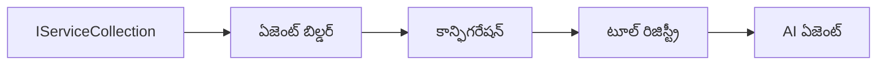

# 🎨 Azure OpenAI (Responses API) తో Agentic డిజైన్ ప్యాటర్న్లు (.NET)

## 📋 అభ్యాస లక్ష్యాలు

ఈ ఉదాహరణ Microsoft Agent Framework ను .NET లో Azure OpenAI (Responses API) సమగ్రతతో ఉపయోగించి ఇంటెలిజెంట్ ఏజెంట్లను నిర్మించడానికి ఎంటర్ప్రైజ్-గ్రేడ్ డిజైన్ ప్యాటర్న్లను చూపిస్తుంది. మీరు ఏజెంట్లను ప్రొడక్షన్‌కు సిద్ధంగా, నిర్వహణానికి తగినది, మరియు స్కేలబుల్‌గా చేసే ప్రొఫెషనల్ ప్యాటర్న్లు మరియు معماري దశలను నేర్చుకుంటారు.

### ఎంటర్ ప్రైజ్ డిజైన్ ప్యాటర్న్లు

- 🏭 **Factory Pattern**: డిపెండెన్సీ ఇంజెక్షన్ తో ప్రామాణిక ఏజెంట్ సృష్టి
- 🔧 **Builder Pattern**: సులభమైన ఏజెంట్ కాన్ఫిగరేషన్ మరియు సెటప్
- 🧵 **Thread-Safe Patterns**: ఏకకాల సంభాషణ నిర్వహణ
- 📋 **Repository Pattern**: పరికరం మరియు సామర్థ్య నిర్వహణ సరళీకరణ

## 🎯 .NET-స్పెసిఫిక్ معماري ప్రయోజనాలు

### ఎంటర్ ప్రైజ్ ఫీచర్స్

- **బలమైన టైపింగ్**: కంపైల్-టైమ్ ధృవీకరణ మరియు IntelliSense మద్దతు
- **డిపెండెన్సీ ఇంజెక్షన్**: నిర్మాణాత్మక DI కంటెయినర్ సమగ్రత
- **కాన్ఫిగరేషన్ నిర్వహణ**: IConfiguration మరియు Options ప్యాటర్న్లు
- **Async/Await**: మొదటి తరం అసిన్‌క్రోనస్ ప్రోగ్రామింగ్ మద్దతు

### ప్రొడక్షన్-రెడి ప్యాటర్న్లు

- **లాగింగ్ సమగ్రత**: ILogger మరియు నిర్మాణాత్మక లాగింగ్ మద్దతు
- **ఆరోగ్య తనిఖీలు**: బిల్ట్-ఇన్ మానిటరింగ్ మరియు డయాగ్నోస్టిక్స్
- **కాన్ఫిగరేషన్ ధృవీకరణ**: డేటా అనోటేషన్లతో బలమైన టైపింగ్
- **లోప నిర్వహణ**: నిర్మాణాత్మక Exception నిర్వహణ

## 🔧 సాంకేతిక معماري

### ములక .NET భాగాలు

- **Microsoft.Extensions.AI**: ఐక్య AI సేవా సారాంశాలు
- **Microsoft.Agents.AI**: ఎంటర్ ప్రైజ్ ఏజెంట్ నిర్వహణ ఫ్రేమ్‌వర్క్
- **Azure OpenAI (Responses API)**: అధిక-దక్షత API క్లయింట్ ప్యాటర్న్లు
- **కాన్ఫిగరేషన్ సిస్టమ్**: appsettings.json మరియు వాతావరణ సమగ్రత

### డిజైన్ ప్యాటర్న్ అమలుయొక్క ఉదాహరణ



## 🏗️ ఎంటర్ ప్రైజ్ ప్యాటర్న్లు ప్రదర్శించబడినవి

### 1. **సృష్టి ప్యాటర్న్లు**

- **ఏజెంట్ ఫ్యాక్టరీ**: సెంట్రలైజ్డ్ ఏజెంట్ సృష్టి సుసంపన్నమైన కాన్ఫిగరేషన్ తో
- **బిల్డర్ ప్యాటర్న్**: సంక్లిష్ట ఏజెంట్ కాన్ఫిగరేషన్ కోసం సున్నితమైన API
- **సింగిల్టన్ ప్యాటర్న్**: పంచుకునే వనరులు మరియు కాన్ఫిగరేషన్ నిర్వహణ
- **డిపెండెన్సీ ఇంజెక్షన్**: దీర్ఘ కాల అనువర్తనం మరియు పరీక్ష సాధ్యమయ్యే విధానం

### 2. **పాలన ప్యాటర్న్లు**

- **స్ట్రాటజీ ప్యాటర్న్**: మార్పిడి సాధ్యమైన పరికరం అమలు విధానాలు
- **కమాండ్ ప్యాటర్న్**: ఏజెంట్ ఆపరేషన్స్ సంకోచించి ఉంచబడి ఉంది, రద్దు/పునరావృతి తో
- **ఆబ్జర్వర్ ప్యాటర్న్**: ఈవెంట్ ఆధారిత ఏజెంట్ జీవకాల నిర్వహణ
- **టెంప్లేట్ మెథడ్**: ప్రామాణిక ఏజెంట్ అమలుయొక్క పనితీరు ప్రక్రియలు

### 3. **రూపకల్పనా ప్యాటర్న్లు**

- **అడాప్టర్ ప్యాటర్న్**: Azure OpenAI (Responses API) సమగ్రత تہ
- **డెకొరేటర్ ప్యాటర్న్**: ఏజెంట్ సామర్థ్య విస్తరణ
- **ఫసేడ్ ప్యాటర్న్**: సులభమైన ఏజెంట్ ఇంటరాక్షన్ ఇంటర్‌ఫేస్లు
- **ప్రాక్సీ ప్యాటర్న్**: పనితీరు కోసం ఆలస్యం లోడ్ మరియు క్యాచింగ్

## 📚 .NET డిజైన్ సూత్రాలు

### SOLID సూత్రాలు

- **సింగిల్ రిస్పాన్సిబిలిటీ**: ప్రతి భాగానికి ఒక స్పష్టమైన ప్రయోజనం
- **ఓపెన్/క్లోజ్డ్**: మార్పు లేకుండా విస్తరించగలిగే విధానం
- **లిస్కోవ్ సబ్‌స్టిట్యూషన్**: ఇంటర్‌ఫేస్ ఆధారిత పరికరం అమలు
- **ఇంటర్‌ఫేస్ విభాగం**: కేంద్రీకృత, ఏకత్వమైన ఇంటర్‌ఫేస్‌లు
- **డిపెండెన్సీ ఇన్వర్షన్**: అమలే కాకుండా సారాంశాలపై ఆధారపడటం

### శుభ్రమైన معماري

- **డొమైన్ లేయర్**: ప్రాథమిక ఏజెంట్ మరియు పరికరం సారాంశాలు
- **అప్లికేషన్ లేయర్**: ఏజెంట్ నిర్వహణ మరియు పనితీరు ప్రక్రియలు
- **ఇన్‌ఫ్రాస్ట్రక్చర్ లేయర్**: Azure OpenAI (Responses API) సమగ్రత మరియు బాహ్య సేవలు
- **ప్రెజంటేషన్ లేయర్**: వినియోగదారు ఇంటరాక్షన్ మరియు స్పందన ఫార్మాటింగ్

## 🔒 ఎంటర్ ప్రైజ్ పరిశీలనలు

### భద్రత

- **ప్రామాణీకరణ నిర్వహణ**: IConfiguration తో సురక్షిత API కీ నిర్వహణ
- **ఇన్‌పుట్ ధృవీకరణ**: బలమైన టైపింగ్ మరియు డేటా అనోటేషన్ ధృవీకరణ
- **అవుట్‌పుట్ శుభ్రపరిచే పద్ధతి**: సురక్షిత ప్రతిస్పందన ప్రక్షాళన మరియు ఫిల్టరింగ్
- **ఆడిట్ లాగింగ్**: సమగ్ర ఆపరేషన్ ట్రాకింగ్

### పనితీరు

- **Async ప్యాటర్న్లు**: అడ్డంకులేని I/O కార్యకలాపాలు
- **కనెక్షన్ పూలింగ్**: సమర్థవంతమైన HTTP క్లయింట్ నిర్వహణ
- **క్యాచింగ్**: పనితీరు మెరుగుపరచడానికి ప్రతిస్పందన క్యాచింగ్
- **వనరు నిర్వహణ**: సరైన వదిలివేత మరియు శుభ్రపరిచే పద్ధతులు

### స్కేలబిలిటీ

- **థ్రెడ్ భద ums###**: ఏకకాల ఏజెంట్ అమలు మద్దతు
- **వనరు పూలింగ్**: సమర్థవంతమైన వనరు వినియోగం
- **లొడ్డు నిర్వహణ**: రేట్ పరిమితి మరియు బ్యాక్‌ప్రెజర్ నిర్వహణ
- **మానిటరింగ్**: పనితీరు గణాంకాలు మరియు ఆరోగ్య తనిఖీలు

## 🚀 ప్రొడక్షన్ డిప్లాయ్‌మెంట్

- **కాన్ఫిగరేషన్ నిర్వహణ**: వాతావరణ-స్పెసిఫిక్ సెట్టింగులు
- **లాగింగ్ వ్యూహం**: సంబంధిత IDs తో నిర్మాణాత్మక లాగింగ్
- **లోప నిర్వహణ**: సరైన పునరుద్ధరణతో గ్లోబల్ Exception నిర్వహణ
- **మానిటరింగ్**: అప్లికేషన్ ఇన్సైట్స్ మరియు పనితీరు కౌంటర్లు
- **పరీక్ష**: యూనిట్ టెస్టులు, సమగ్రత టెస్టులు, మరియు లోడ్ టెస్టింగ్ ప్యాటర్న్లు

.NET తో ఎంటర్ ప్రైజ్-గ్రేడ్ ఇంటెలిజెంట్ ఏజెంట్లను తయారుచేయడానికి సిద్ధంగా ఉన్నారా? మనం బలమైన నిర్మాణాన్ని రూపకల్పన చేద్దాం! 🏢✨

## 🚀 ప్రారంభం

### అవసరాలు

- [.NET 10 SDK](https://dotnet.microsoft.com/download/dotnet/10.0) లేదా అంతకంటే ఎక్కువ
- ఒక [Azure సబ్స్క్రిప్షన్](https://azure.microsoft.com/free/) Azure OpenAI వనరు మరియు మోడల్ డిప్లాయ్‌మెంట్ తో
- [Azure CLI](https://learn.microsoft.com/cli/azure/install-azure-cli) — `az login` తో సైన్ ఇన్ చేయండి

### అవసరమైన వాతావరణ వేరియబుల్స్

```bash
# zsh/bash
export AZURE_OPENAI_ENDPOINT=https://<your-resource>.openai.azure.com
export AZURE_OPENAI_DEPLOYMENT=gpt-4.1-mini
# తరువాత AzureCliCredential టోకెన్ పొందేందుకు సైన్ ఇన్ అవ్వండి
az login
```

```powershell
# పవర్‌షెల్
$env:AZURE_OPENAI_ENDPOINT = "https://<your-resource>.openai.azure.com"
$env:AZURE_OPENAI_DEPLOYMENT = "gpt-4.1-mini"
# ఆజ్యూర్‌క్లీఐ క్రెడెన్షియల్ టోకెన్ పొందడానికి సైన్ ఇన్ అవ్వండి
az login
```

### నమూనా కోడ్

కోడ్ ఉదాహరణను నడపడానికి,

```bash
# zsh/bash
chmod +x ./03-dotnet-agent-framework.cs
./03-dotnet-agent-framework.cs
```

లేదా dotnet CLI ఉపయోగించి:

```bash
dotnet run ./03-dotnet-agent-framework.cs
```

పూర్తి కోడ్ కోసం [`03-dotnet-agent-framework.cs`](../../../../03-agentic-design-patterns/code_samples/03-dotnet-agent-framework.cs) చూడండి.

```csharp
#!/usr/bin/dotnet run

#:package Microsoft.Extensions.AI@10.*
#:package Microsoft.Agents.AI.OpenAI@1.*-*
#:package Azure.AI.OpenAI@2.1.0
#:package Azure.Identity@1.13.1

using System.ComponentModel;

using Microsoft.Agents.AI;
using Microsoft.Extensions.AI;

using Azure.AI.OpenAI;
using Azure.Identity;

// Tool Function: Random Destination Generator
// This static method will be available to the agent as a callable tool
// The [Description] attribute helps the AI understand when to use this function
// This demonstrates how to create custom tools for AI agents
[Description("Provides a random vacation destination.")]
static string GetRandomDestination()
{
    // List of popular vacation destinations around the world
    // The agent will randomly select from these options
    var destinations = new List<string>
    {
        "Paris, France",
        "Tokyo, Japan",
        "New York City, USA",
        "Sydney, Australia",
        "Rome, Italy",
        "Barcelona, Spain",
        "Cape Town, South Africa",
        "Rio de Janeiro, Brazil",
        "Bangkok, Thailand",
        "Vancouver, Canada"
    };

    // Generate random index and return selected destination
    // Uses System.Random for simple random selection
    var random = new Random();
    int index = random.Next(destinations.Count);
    return destinations[index];
}

// Azure OpenAI with the Responses API (stable v1 endpoint). Sign in with `az login`.
var azureEndpoint = Environment.GetEnvironmentVariable("AZURE_OPENAI_ENDPOINT")
    ?? throw new InvalidOperationException("AZURE_OPENAI_ENDPOINT is not set.");
var deployment = Environment.GetEnvironmentVariable("AZURE_OPENAI_DEPLOYMENT") ?? "gpt-4.1-mini";

var azureClient = new AzureOpenAIClient(new Uri(azureEndpoint), new AzureCliCredential());

// Define Agent Identity and Comprehensive Instructions
// Agent name for identification and logging purposes
var AGENT_NAME = "TravelAgent";

// Detailed instructions that define the agent's personality, capabilities, and behavior
// This system prompt shapes how the agent responds and interacts with users
var AGENT_INSTRUCTIONS = """
You are a helpful AI Agent that can help plan vacations for customers.

Important: When users specify a destination, always plan for that location. Only suggest random destinations when the user hasn't specified a preference.

When the conversation begins, introduce yourself with this message:
"Hello! I'm your TravelAgent assistant. I can help plan vacations and suggest interesting destinations for you. Here are some things you can ask me:
1. Plan a day trip to a specific location
2. Suggest a random vacation destination
3. Find destinations with specific features (beaches, mountains, historical sites, etc.)
4. Plan an alternative trip if you don't like my first suggestion

What kind of trip would you like me to help you plan today?"

Always prioritize user preferences. If they mention a specific destination like "Bali" or "Paris," focus your planning on that location rather than suggesting alternatives.
""";

// Create AI Agent with Advanced Travel Planning Capabilities
// Get the Responses client for the deployment and create the AI agent
// Configure agent with name, detailed instructions, and available tools
// This demonstrates the .NET agent creation pattern with full configuration
AIAgent agent = azureClient
    .GetChatClient(deployment)
    .AsAIAgent(
        name: AGENT_NAME,
        instructions: AGENT_INSTRUCTIONS,
        tools: [AIFunctionFactory.Create(GetRandomDestination)]
    );

// Create New Conversation Session for Context Management
// Initialize a new conversation session to maintain context across multiple interactions
// Sessions enable the agent to remember previous exchanges and maintain conversational state
// This is essential for multi-turn conversations and contextual understanding
var session = await agent.CreateSessionAsync();

// Execute Agent: First Travel Planning Request
// Run the agent with an initial request that will likely trigger the random destination tool
// The agent will analyze the request, use the GetRandomDestination tool, and create an itinerary
// Using the session parameter maintains conversation context for subsequent interactions
await foreach (var update in agent.RunStreamingAsync("Plan me a day trip", session))
{
    await Task.Delay(10);
    Console.Write(update);
}

Console.WriteLine();

// Execute Agent: Follow-up Request with Context Awareness
// Demonstrate contextual conversation by referencing the previous response
// The agent remembers the previous destination suggestion and will provide an alternative
// This showcases the power of conversation sessions and contextual understanding in .NET agents
await foreach (var update in agent.RunStreamingAsync("I don't like that destination. Plan me another vacation.", session))
{
    await Task.Delay(10);
    Console.Write(update);
}
```

---

<!-- CO-OP TRANSLATOR DISCLAIMER START -->
**అస్వీకరణ**:
ఈ పత్రం AI అనువాద సేవ [Co-op Translator](https://github.com/Azure/co-op-translator) ఉపయోగించి అనువదించబడింది. మేము ఖచ్చితత్వానికి ప్రయత్నిస్తున్నప్పటికీ, ఆటోమేటెడ్ అనువాదాలు తప్పులు లేదా అసమగ్రతలను కలిగి ఉండవచ్చు. దాని స్వదేశ భాషలో ఉన్న అసలు పత్రాన్ని అధికారం కలిగిన మూలంగా పరిగణించాలి. కీలకమైన సమాచారం కోసం, ప్రొఫెషనల్ మానవ అనువాదాన్ని సిఫారసు చేస్తాము. ఈ అనువాదం ఉపయోగం వల్ల కలిగే ఏవైనా అపార్థాలు లేదా తప్పుదారులు కోసం మేము బాధ్యత వహించము.
<!-- CO-OP TRANSLATOR DISCLAIMER END -->