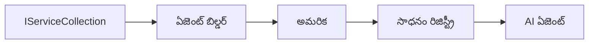

# 🎨 ఆజ్యూరే ఓపెన్AI (రెస్పాన్స్ API) తో ఏజెంటిక్ డిజైన్ నమూనాలు (.NET)

## 📋 అభ్యాస లక్ష్యాలు

ఈ ఉదాహరణ Microsoft ఏజెంట్ ఫ్రేమ్‌వర్క్ ను .NET లో ఆజ్యూర్ ఓపెన్AI (రెస్పాన్స్ API) ఇంటిగ్రేషన్ తో ఉపయోగించి బుద్ధిమంతులైన ఏజెంట్లను నిర్మించడానికి ఎంటర్‌ప్రైజ్-గ్రేడ్ డిజైన్ నమూనాలను ప్రదర్శిస్తుంది. మీరు ఏజెంట్లను ప్రొడక్షన్-రెడీ, నిర్వహించదగిన మరియు స్కేలబుల్ చేయడానికి ప్రొఫెషనల్ నమూనాలు మరియు ఆర్కిటెక్చరల్ దృక్పథాలను నేర్చుకుంటారు.

### ఎంటర్‌ప్రైజ్ డిజైన్ నమూనాలు

- 🏭 **ఫ్యాక్టరీ ప్యాటర్న్**: డిపెండెన్సీ ఇంజెక్షన్ తో ప్రామాణిక ఏజెంట్ సృష్టి  
- 🔧 **బిల్డర్ ప్యాటర్న్**: ఫ్లూయెంట్ ఏజెంట్ కాన్ఫిగరేషన్ మరియు సెటప్  
- 🧵 **థ్రెడ్-సేఫ్ ప్యాటర్న్లు**: సంక్రమ సంభాషణ నిర్వహణ  
- 📋 **రెపోజిటరీ ప్యాటర్న్**: టూల్ మరియు సామర్ధ్య నిర్వహణను సువ్యవస్థీకరించడం  

## 🎯 .NET-ప్రత్యేక ఆర్కిటెక్చరల్ లాభాలు

### ఎంటర్‌ప్రైజ్ ఫీచర్లు

- **స్ట్రాంగ్ టైపింగ్**: కంపైల్-టైమ్ вాలిడేషన్ మరియు ఇంటెల్లి‌సెన్స్ మద్దతు  
- **డిపెండెన్సీ ఇంజెక్షన్**: బిల్ట్-ఇన్ DI కంటెయినర్ ఇంటిగ్రేషన్  
- **కాన్ఫిగరేషన్ మేనేజ్‌మెంట్**: IConfiguration మరియు Options ప్యాటర్న్లు  
- **Async/Await**: ప్రథమశ్రేణి అసంక్రోనస్ ప్రోగ్రామింగ్ మద్దతు  

### ప్రొడక్షన్-రెడీ నమూనాలు

- **లాగింగ్ ఇంటిగ్రేషన్**: ILogger మరియు నిర్మిత లాగింగ్ మద్దతు  
- **హెల్త్ చెక్స్**: బిల్ట్-ఇన్ మానిటరింగ్ మరియు డయాగ్నోస్టిక్స్  
- **కాన్ఫిగరేషన్ వాలిడేషన్**: డేటా అనోటేషన్లతో స్ట్రాంగ్ టైపింగ్  
- **ఎర్రర్ హ్యాండ్లింగ్**: నిర్మిత Exception నిర్వహణ  

## 🔧 సాంకేతిక నిర్మాణం

### కోర్ .NET భాగాలు

- **Microsoft.Extensions.AI**: ఐక్య AI సేవా అభిప్రాయాలు  
- **Microsoft.Agents.AI**: ఎంటర్‌ప్రైజ్ ఏజెంట్ ఆర్కెస్ట్రేషన్ ఫ్రేమ్‌వర్క్  
- **Azure OpenAI (Responses API)**: అధిక పనితీరు API క్లయింట్ నమూనాలు  
- **కాన్ఫిగరేషన్ సిస్టమ్**: appsettings.json మరియు పర్యావరణ ఇంటిగ్రేషన్  

### డిజైన్ ప్యాటర్న్ అమలు



## 🏗️ ఎంటర్‌ప్రైజ్ నమూనాలు ప్రదర్శించబడినవి

### 1. **సృష్టి ప్యాటర్న్లు**

- **ఏజెంట్ ఫ్యాక్టరీ**: సారూప్య కాన్ఫిగరేషన్ తో కేంద్రీకృత ఏజెంట్ సృష్టి  
- **బిల్డర్ ప్యాటర్న్**: సంక్లిష్ట ఏజెంట్ కాన్ఫిగరేషన్ కోసం ఫ్లూయెంట్ API  
- **సింగ్ల్‌టన్ ప్యాటర్న్**: భాగస్వామ్య వనరులు మరియు కాన్ఫిగరేషన్ నిర్వహణ  
- **డిపెండెన్సీ ఇంజెక్షన్**: ఉష్ణోగ్రత తగ్గింపు మరియు టెస్టబిలిటీ  

### 2. **ప్రవర్తనా ప్యాటర్న్లు**

- **స్ట్రాటజీ ప్యాటర్న్**: మార్పిడి సాధ్యమైన టూల్ అమలు విధానాలు  
- **కమాండ్ ప్యాటర్న్**: అన్‌డూ/రిడూ తో ఏజెంట్ ఆపరేషన్‌లను కేపసులేట్ చేయడం  
- **ఆబ్జర్వర్ ప్యాటర్న్**: ఈవెంట్-ఆధారిత ఏజెంట్ జీవనచక్ర నిర్వహణ  
- **టెంప్లేట్ మెథడ్**: ప్రామాణిక ఏజెంట్ ఎగ్జిక్యూషన్ వర్క్‌ఫ్లోలు  

### 3. **స్థాపనా ప్యాటర్న్లు**

- **అడాప్టర్ ప్యాటర్న్**: ఆజ్యూర్ ఓపెన్AI (రెస్పాన్స్ API) ఇంటిగ్రేషన్ పట్టు  
- **డెక్టర్ ప్యాటర్న్**: ఏజెంట్ సామర్ధ్య పెంపును  
- **ఫసాడ్ ప్యాటర్న్**: సులభతర ఏజెంట్ పరస్పర చర్య ఇంటర్‌ఫేస్‌లు  
- **ప్రాక్సీ ప్యాటర్న్**: పనితీరు కోసం లేజీ లోడింగ్ మరియు క్యాషింగ్  

## 📚 .NET డిజైన్ సూత్రాలు

### SOLID సూత్రాలు

- **సింగిల్ రిస్పాన్సిబిలిటీ**: ప్రతి భాగానికి ఒక స్పష్టమైన ఉద్దేశ్యం  
- **ఓపెన్/క్లోజ్డ్**: మార్పు లేకుండా విస్తరించగలిగే విధానం  
- **లిస్కోవ్ సబ్స్టిట్యూషన్**: ఇంటర్‌ఫేస్‌-ఆధారిత టూల్ అమలు విధానాలు  
- **ఇంటర్‌ఫేస్ సెగ్రిగేషన్**: లక్ష్యిత, సంబంధించిన ఇంటర్‌ఫేస్‌లు  
- **డిపెండెన్సీ ఇన్వర్షన్**: కాంక్రీట్స్ కాదు, అభిప్రాయాలపై ఆధారపడటం  

### క్లీన్ఆర్కిటెక్చర్

- **డొమైన్ లేయర్**: కోర్ ఏజెంట్ మరియు టూల్ అభిప్రాయాలు  
- **అప్లికేషన్ లేయర్**: ఏజెంట్ ఆర్కెస్ట్రేషన్ మరియు వర్క్‌ఫ్లోలు  
- **ఇన్ఫ్రాస్ట్రక్చర్ లేయర్**: ఆజ్యూర్ ఓపెన్AI (రెస్పాన్స్ API) ఇంటిగ్రేషన్ మరియు బాహ్య సేవలు  
- **ప్రెజెంటేషన్ లేయర్**: వినియోగదారు పరస్పర క్రియ మరియు స్పందన ఫార్మాటింగ్  

## 🔒 ఎంటర్‌ప్రైజ్ పరామర్శలు

### భద్రత

- **ప్రామాణిక నిర్వహణ**: IConfiguration తో సురక్షిత API కీ నిర్వహణ  
- **ఇన్‌పుట్ వాలిడేషన్**: స్ట్రాంగ్ టైపింగ్ మరియు డేటా అనోటేషన్ వాలిడేషన్  
- **ఆట్పుట్ శుద్ధీకరణ**: సురక్షిత స్పందన ప్రాసెసింగ్ మరియు ఫిల్టరింగ్  
- **ఆడిట్ లాగింగ్**: వివరమైన ఆపరేషన్ ట్రాకింగ్  

### పనితీరు

- **అసింక్ ప్యాటర్న్లు**: అనిరోధక I/O ఆపరేషన్స్  
- **కనెక్షన్ పూలింగ్**: సమర్థవంతమైన HTTP క్లయింట్ నిర్వహణ  
- **క్యాషింగ్**: మెరుగైన పనితీరు కోసం స్పందన క్యాషింగ్  
- **వనరు నిర్వహణ**: సరైన తొలగింపు మరియు శుభ్రపరిచే ప్యాటర్న్లు  

### స్కేలబిలిటీ

- **థ్రెడ్ సేఫ్టీ**: సమకాలీన ఏజెంట్ ఎగ్జిక్యూషన్ మద్దతు  
- **వనరు పూలింగ్**: సమర్థవంతమైన వనరు వినియోగం  
- **లోడ్ మేనేజ్‌మెంట్**: రేట్ లిమిటింగ్ మరియు బ్యాక్‌ప్రెషర్ నిర్వహణ  
- **మానిటరింగ్**: పనితీరు కొలమానాలు మరియు ఆరోగ్య పరీక్షలు  

## 🚀 ప్రొడక్షన్ అమలు

- **కాన్ఫిగరేషన్ నిర్వహణ**: వాతావరణ-ప్రత్యేక సెట్టింగ్లు  
- **లాగింగ్ వ్యూహం**: కరణీయత IDsతో నిర్మిత లాగింగ్  
- **ఎర్రర్ హ్యాండ్లింగ్**: సరైన పునరుద్ధరణతో గ్లోబల్ ఎక్స్‌సెప్షన్ హ్యాండ్లింగ్  
- **మానిటరింగ్**: అప్లికేషన్ ఇన్‌సైట్స్ మరియు పనితీరు కౌంటర్లు  
- **పరీక్షలు**: యూనిట్ టెస్ట్‌లు, ఇంటిగ్రేషన్ టెస్ట్‌లు, మరియు లోడ్ టెస్టింగ్ ప్యాటర్న్లు  

.NET తో ఎంటర్‌ప్రైజ్-గ్రేడ్ బుద్ధిమంతులైన ఏజెంట్లను తయారు చేయడానికి సిద్దమా? దృఢమైన ఆర్కిటెక్చర్ చేద్దాం! 🏢✨

## 🚀 ప్రారంభించడానికి

### ముందు అవసరాలు

- [.NET 10 SDK](https://dotnet.microsoft.com/download/dotnet/10.0) లేదా అంతకన్నా పైగా  
- Azure ఓపెన్AI వనరు మరియు మోడల్ డిప్లాయ్‌మెంట్‌తో ఒక [ఆజ్యూర్ సబ్‌స్క్రిప్షన్](https://azure.microsoft.com/free/)  
- [Azure CLI](https://learn.microsoft.com/cli/azure/install-azure-cli) — `az login` తో సైన్ ఇన్ చేయండి  

### అవసరమైన పర్యావరణ వేరియబుల్స్

```bash
# zsh/bash
export AZURE_OPENAI_ENDPOINT=https://<your-resource>.openai.azure.com
export AZURE_OPENAI_DEPLOYMENT=gpt-5-mini
# ఆపై AzureCliCredential టోకెన్ పొందడానికి సైన్ ఇన్ చేయండి
az login
```

```powershell
# పవర్‌షెల్
$env:AZURE_OPENAI_ENDPOINT = "https://<your-resource>.openai.azure.com"
$env:AZURE_OPENAI_DEPLOYMENT = "gpt-5-mini"
# తర్వాత AzureCliCredential టోకెన్ పొందేందుకు సైన్ ఇన్ అవ్వండి
az login
```

### నమూనా కోడ్

కోడ్ ఉదాహరణను నడిపించడానికి,

```bash
# zsh/bash
chmod +x ./03-dotnet-agent-framework.cs
./03-dotnet-agent-framework.cs
```

లేదా dotnet CLI ఉపయోగించి:

```bash
dotnet run ./03-dotnet-agent-framework.cs
```

పూర్తి కోడ్ కోసం [`03-dotnet-agent-framework.cs`](../../../../03-agentic-design-patterns/code_samples/03-dotnet-agent-framework.cs) చూడండి.

```csharp
#!/usr/bin/dotnet run

#:package Microsoft.Extensions.AI@10.*
#:package Microsoft.Agents.AI.OpenAI@1.*-*
#:package Azure.AI.OpenAI@2.1.0
#:package Azure.Identity@1.13.1

using System.ComponentModel;

using Microsoft.Agents.AI;
using Microsoft.Extensions.AI;

using Azure.AI.OpenAI;
using Azure.Identity;

// Tool Function: Random Destination Generator
// This static method will be available to the agent as a callable tool
// The [Description] attribute helps the AI understand when to use this function
// This demonstrates how to create custom tools for AI agents
[Description("Provides a random vacation destination.")]
static string GetRandomDestination()
{
    // List of popular vacation destinations around the world
    // The agent will randomly select from these options
    var destinations = new List<string>
    {
        "Paris, France",
        "Tokyo, Japan",
        "New York City, USA",
        "Sydney, Australia",
        "Rome, Italy",
        "Barcelona, Spain",
        "Cape Town, South Africa",
        "Rio de Janeiro, Brazil",
        "Bangkok, Thailand",
        "Vancouver, Canada"
    };

    // Generate random index and return selected destination
    // Uses System.Random for simple random selection
    var random = new Random();
    int index = random.Next(destinations.Count);
    return destinations[index];
}

// Azure OpenAI with the Responses API (stable v1 endpoint). Sign in with `az login`.
var azureEndpoint = Environment.GetEnvironmentVariable("AZURE_OPENAI_ENDPOINT")
    ?? throw new InvalidOperationException("AZURE_OPENAI_ENDPOINT is not set.");
var deployment = Environment.GetEnvironmentVariable("AZURE_OPENAI_DEPLOYMENT") ?? "gpt-5-mini";

var azureClient = new AzureOpenAIClient(new Uri(azureEndpoint), new AzureCliCredential());

// Define Agent Identity and Comprehensive Instructions
// Agent name for identification and logging purposes
var AGENT_NAME = "TravelAgent";

// Detailed instructions that define the agent's personality, capabilities, and behavior
// This system prompt shapes how the agent responds and interacts with users
var AGENT_INSTRUCTIONS = """
You are a helpful AI Agent that can help plan vacations for customers.

Important: When users specify a destination, always plan for that location. Only suggest random destinations when the user hasn't specified a preference.

When the conversation begins, introduce yourself with this message:
"Hello! I'm your TravelAgent assistant. I can help plan vacations and suggest interesting destinations for you. Here are some things you can ask me:
1. Plan a day trip to a specific location
2. Suggest a random vacation destination
3. Find destinations with specific features (beaches, mountains, historical sites, etc.)
4. Plan an alternative trip if you don't like my first suggestion

What kind of trip would you like me to help you plan today?"

Always prioritize user preferences. If they mention a specific destination like "Bali" or "Paris," focus your planning on that location rather than suggesting alternatives.
""";

// Create AI Agent with Advanced Travel Planning Capabilities
// Get the Responses client for the deployment and create the AI agent
// Configure agent with name, detailed instructions, and available tools
// This demonstrates the .NET agent creation pattern with full configuration
AIAgent agent = azureClient
    .GetChatClient(deployment)
    .AsAIAgent(
        name: AGENT_NAME,
        instructions: AGENT_INSTRUCTIONS,
        tools: [AIFunctionFactory.Create(GetRandomDestination)]
    );

// Create New Conversation Session for Context Management
// Initialize a new conversation session to maintain context across multiple interactions
// Sessions enable the agent to remember previous exchanges and maintain conversational state
// This is essential for multi-turn conversations and contextual understanding
var session = await agent.CreateSessionAsync();

// Execute Agent: First Travel Planning Request
// Run the agent with an initial request that will likely trigger the random destination tool
// The agent will analyze the request, use the GetRandomDestination tool, and create an itinerary
// Using the session parameter maintains conversation context for subsequent interactions
await foreach (var update in agent.RunStreamingAsync("Plan me a day trip", session))
{
    await Task.Delay(10);
    Console.Write(update);
}

Console.WriteLine();

// Execute Agent: Follow-up Request with Context Awareness
// Demonstrate contextual conversation by referencing the previous response
// The agent remembers the previous destination suggestion and will provide an alternative
// This showcases the power of conversation sessions and contextual understanding in .NET agents
await foreach (var update in agent.RunStreamingAsync("I don't like that destination. Plan me another vacation.", session))
{
    await Task.Delay(10);
    Console.Write(update);
}
```

---

<!-- CO-OP TRANSLATOR DISCLAIMER START -->
**అస్వీకరణ**:
ఈ పత్రం AI అనువాద సేవ [Co-op Translator](https://github.com/Azure/co-op-translator) ఉపయోగించి అనువదించబడింది. మేము ఖచ్చితత్వానికి ప్రయత్నిస్తున్నప్పటికీ, ఆటోమేటెడ్ అనువాదాలు తప్పులు లేదా అసమగ్రతలను కలిగి ఉండవచ్చు. దాని స్వదేశ భాషలో ఉన్న అసలు పత్రాన్ని అధికారం కలిగిన మూలంగా పరిగణించాలి. కీలకమైన సమాచారం కోసం, ప్రొఫెషనల్ మానవ అనువాదాన్ని సిఫారసు చేస్తాము. ఈ అనువాదం ఉపయోగం వల్ల కలిగే ఏవైనా అపార్థాలు లేదా తప్పుదారులు కోసం మేము బాధ్యత వహించము.
<!-- CO-OP TRANSLATOR DISCLAIMER END -->