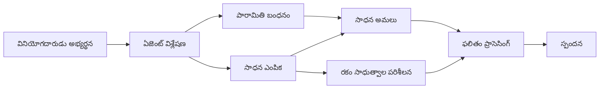

# 🛠️ Azure OpenAI (Responses API) తో అధునాతన టూల్ వినియోగం (.NET)

## 📋 అభ్యాస లక్ష్యాలు

ఈ నోట్‌బుక్ Microsoft Agent Framework ను .NETతో Azure OpenAI (Responses API)తో ఉపయోగించి ఎంటర్‌ప్రైజ్-గ్రేడ్ టూల్ ఇంటిగ్రేషన్ నమూనాలను చూపిస్తుంది. మీరు C# యొక్క స్ట్రాంగ్ టైపింగ్ మరియు .NET యొక్క ఎంటర్‌ప్రైజ్ లక్షణాలను ఉపయోగించి బహుళ ప్రత్యేకీకృత టూల్‌లతో సాఫిష్టికేటెడ్ ఏజెంట్లను తయారు చేయడం నేర్పుకుంటారు.

### మీరు పట్టు చేసుకునే అధునాతన టూల్ సామర్థ్యాలు

- 🔧 **బహుళ-టూల్ నిర్మాణం**: బహుళ ప్రత్యేకీకృత సామర్థ్యాలతో ఏజెంట్ల నిర్మాణం
- 🎯 **టైప్-సేఫ్ టూల్ అమలు**: C# యొక్క కంపైల్-టైం ధృవీకరణ ప్రయోజనం
- 📊 **ఎంటర్‌ప్రైజ్ టూల్ నమూనాలు**: ఉత్పత్తి-సిద్ధ టూల్ డిజైన్ మరియు పొరపాటు నిర్వహణ
- 🔗 **టూల్ కంపోజిషన్**: సంక్లిష్ట వ్యాపార వర్క్‌ఫ్లోలకు టూల్స్ కలపడం

## 🎯 .NET టూల్ నిర్మాణ ప్రయోజనాలు

### ఎంటర్‌ప్రైజ్ టూల్ లక్షణాలు

- **కంపైల్-టైం ధృవీకరణ**: స్ట్రాంగ్ టైపింగ్ టూల్ పరామితుల సరైనతను నిర్ధారిస్తుంది
- **డిపెండెన్సీ ఇంజెక్షన్**: టూల్ నిర్వహణ కోసం IoC కంటైనర్ ఇంటిగ్రేషన్
- **Async/Await నమూనాలు**: సరైన వనరు నిర్వహణతో నాన్-బ్లాకింగ్ టూల్ అమలు
- **స్ట్రక్చర్డ్ లాగింగ్**: టూల్ అమలును మానిటర్ చేయడానికి బిల్ట్-ఇన్ లాగింగ్ ఇంటిగ్రేషన్

### ఉత్పత్తి-సిద్ధ నమూనాలు

- **ఎక్స్‌ప్రెషన్ నిర్వహణ**: టైప్ ట్రైడ్ ఎక్స్‌ప్రెషన్లతో విస్తృత పొరపాటు నిర్వహణ
- **వనరు నిర్వహణ**: సరైన డిస్పోజల్ నమూనాలు మరియు మెమోరీ నిర్వహణ
- **పర్ఫార్మెన్స్ మానిటరింగ్**: బిల్ట్-ఇన్ మేట్రిక్స్ మరియు పనితీరు కౌంటర్లు
- **కాన్ఫిగరేషన్ నిర్వహణ**: ధృవీకరణతో టైప్-సేఫ్ కాన్ఫిగరేషన్

## 🔧 సాంకేతిక నిర్మాణం

### కోర్ .NET టూల్ భాగాలు

- **Microsoft.Extensions.AI**: ఏకీకృత టూల్ అభిసారం పొర
- **Microsoft.Agents.AI**: ఎంటర్‌ప్రైజ్-గ్రేడ్ టూల్ ఆర్కెస్ట్రేషన్
- **Azure OpenAI (Responses API)**: కనెక్షన్ పూలింగ్‌తో అధిక-పనితీరు API క్లయింట్

### టూల్ అమలు పైప్‌లైన్



## 🛠️ టూల్ వర్గాలు & నమూనాలు

### 1. **డేటా ప్రాసెసింగ్ టూల్స్**

- **ఇన్పుట్ ధృవీకరణ**: డేటా అనోటేషన్లతో స్ట్రాంగ్ టైపింగ్
- **రూపాంతర ఆపరేషన్లు**: టైప్-సేఫ్ డేటా మార్పిడి మరియు ఫార్మాటింగ్
- **వ్యాపార లాజిక్**: డొమైన్-స్పెసిఫిక్ లెక్కింపు మరియు విశ్లేషణా టూల్స్
- **ఆట్పుట్ ఫార్మాటింగ్**: వ్యవస్థాపిత ప్రతిస్పందన తీయడం

### 2. **ఇంటిగ్రేషన్ టూల్స్**

- **API కనెక్టర్‌లు**: HttpClient తో RESTful సేవ ఇంటిగ్రేషన్
- **డేటాబేస్ టూల్స్**: డేటా యాక్సెస్ కోసం Entity Framework ఇంటిగ్రేషన్
- **ఫైల్ ఆపరేషన్లు**: ధృవీకరణతో సురక్షిత ఫైల్ సిస్టమ్ ఆపరేషన్లు
- **బాహ్య సేవలు**: మూడవ-పక్ష సేవ ఇంటిగ్రేషన్ నమూనాలు

### 3. **ఉపయోగకర టూల్స్**

- **టెక్స్ట్ ప్రాసెసింగ్**: స్ట్రింగ్ నిర్ధారణ మరియు ఫార్మాటింగ్ ఉపయోగకరాలు
- **తేదీ/సమయ ఆపరేషన్లు**: సంస్కృతి-అనుగుణ తేదీ/సమయ లెక్కింపులు
- **గణిత టూల్స్**: ఖచ్చితమైన లెక్కింపులు మరియు గణాంక ఆపరేషన్లు
- **ధృవీకరణ టూల్స్**: వ్యాపార నియమ ధృవీకరణ మరియు డేటా నిర్ధారణ

బలమైన, టაიప్-సేఫ్ టూల్ సామర్థ్యాలతో ఎంటర్‌ప్రైజ్-గ్రేడ్ ఏజెంట్లు .NETలో తయారు చేయడానికి సిద్ధమా? వృత్తిపరమైన-గ్రేడ్ పరిష్కారాలను రూపుదిద్దుకుందాం! 🏢⚡

## 🚀 ప్రారంభించండి

### అవసరమైనవి

- [.NET 10 SDK](https://dotnet.microsoft.com/download/dotnet/10.0) లేదా అంతకంటే పై
- Azure OpenAI వనరు మరియు మోడల్ డ్రాయ్‌మెంట్ కలిగిన [Azure సభ్యత్వం](https://azure.microsoft.com/free/)
- [Azure CLI](https://learn.microsoft.com/cli/azure/install-azure-cli) — `az login`తో లాగిన్ అవ్వండి

### అవసరమైన పర్యావరణ చరాలు

```bash
# zsh/bash
export AZURE_OPENAI_ENDPOINT=https://<your-resource>.openai.azure.com
export AZURE_OPENAI_DEPLOYMENT=gpt-4.1-mini
# అప్పుడు సైన్ ఇన్ అవండి, తద్వారా AzureCliCredential టోకెన్ పొందగలదు
az login
```

```powershell
# పవర్‌షెల్
$env:AZURE_OPENAI_ENDPOINT = "https://<your-resource>.openai.azure.com"
$env:AZURE_OPENAI_DEPLOYMENT = "gpt-4.1-mini"
# ఆపై AzureCliCredential టోకెన్ పొందడానికి సైన్ ఇన్ చేయండి
az login
```

### నమూనా కోడ్

కోడ్ ఉదాహరణను నడపడానికి,

```bash
# జెడ్‌ఎస్‌హెచ్/బాష్
chmod +x ./04-dotnet-agent-framework.cs
./04-dotnet-agent-framework.cs
```

లేక dotnet CLI ఉపయోగించి:

```bash
dotnet run ./04-dotnet-agent-framework.cs
```

పూర్తి కోడ్ కోసం [`04-dotnet-agent-framework.cs`](../../../../04-tool-use/code_samples/04-dotnet-agent-framework.cs) చూడండి.

```csharp
#!/usr/bin/dotnet run

#:package Microsoft.Extensions.AI@10.*
#:package Microsoft.Agents.AI.OpenAI@1.*-*
#:package Azure.AI.OpenAI@2.1.0
#:package Azure.Identity@1.13.1

using System.ComponentModel;

using Microsoft.Agents.AI;
using Microsoft.Extensions.AI;

using Azure.AI.OpenAI;
using Azure.Identity;

// Tool Function: Random Destination Generator
// This static method will be available to the agent as a callable tool
// The [Description] attribute helps the AI understand when to use this function
// This demonstrates how to create custom tools for AI agents
[Description("Provides a random vacation destination.")]
static string GetRandomDestination()
{
    // List of popular vacation destinations around the world
    // The agent will randomly select from these options
    var destinations = new List<string>
    {
        "Paris, France",
        "Tokyo, Japan",
        "New York City, USA",
        "Sydney, Australia",
        "Rome, Italy",
        "Barcelona, Spain",
        "Cape Town, South Africa",
        "Rio de Janeiro, Brazil",
        "Bangkok, Thailand",
        "Vancouver, Canada"
    };

    // Generate random index and return selected destination
    // Uses System.Random for simple random selection
    var random = new Random();
    int index = random.Next(destinations.Count);
    return destinations[index];
}

// Azure OpenAI with the Responses API (stable v1 endpoint). Sign in with `az login`.
var azureEndpoint = Environment.GetEnvironmentVariable("AZURE_OPENAI_ENDPOINT")
    ?? throw new InvalidOperationException("AZURE_OPENAI_ENDPOINT is not set.");
var deployment = Environment.GetEnvironmentVariable("AZURE_OPENAI_DEPLOYMENT") ?? "gpt-4.1-mini";

var azureClient = new AzureOpenAIClient(new Uri(azureEndpoint), new AzureCliCredential());

// Define Agent Identity and Comprehensive Instructions
// Agent name for identification and logging purposes
var AGENT_NAME = "TravelAgent";

// Detailed instructions that define the agent's personality, capabilities, and behavior
// This system prompt shapes how the agent responds and interacts with users
var AGENT_INSTRUCTIONS = """
You are a helpful AI Agent that can help plan vacations for customers.

Important: When users specify a destination, always plan for that location. Only suggest random destinations when the user hasn't specified a preference.

When the conversation begins, introduce yourself with this message:
"Hello! I'm your TravelAgent assistant. I can help plan vacations and suggest interesting destinations for you. Here are some things you can ask me:
1. Plan a day trip to a specific location
2. Suggest a random vacation destination
3. Find destinations with specific features (beaches, mountains, historical sites, etc.)
4. Plan an alternative trip if you don't like my first suggestion

What kind of trip would you like me to help you plan today?"

Always prioritize user preferences. If they mention a specific destination like "Bali" or "Paris," focus your planning on that location rather than suggesting alternatives.
""";

// Create AI Agent with Advanced Travel Planning Capabilities
// Get the Responses client for the deployment and create the AI agent
// Configure agent with name, detailed instructions, and available tools
// This demonstrates the .NET agent creation pattern with full configuration
AIAgent agent = azureClient
    .GetChatClient(deployment)
    .AsAIAgent(
        name: AGENT_NAME,
        instructions: AGENT_INSTRUCTIONS,
        tools: [AIFunctionFactory.Create(GetRandomDestination)]
    );

// Create New Conversation Session for Context Management
// Initialize a new conversation session to maintain context across multiple interactions
// Sessions enable the agent to remember previous exchanges and maintain conversational state
// This is essential for multi-turn conversations and contextual understanding
await using var session = await agent.CreateSessionAsync();

// Execute Agent: First Travel Planning Request
// Run the agent with an initial request that will likely trigger the random destination tool
// The agent will analyze the request, use the GetRandomDestination tool, and create an itinerary
// Using the session parameter maintains conversation context for subsequent interactions
await foreach (var update in agent.RunStreamingAsync("Plan me a day trip", session))
{
    await Task.Delay(10);
    Console.Write(update);
}

Console.WriteLine();

// Execute Agent: Follow-up Request with Context Awareness
// Demonstrate contextual conversation by referencing the previous response
// The agent remembers the previous destination suggestion and will provide an alternative
// This showcases the power of conversation sessions and contextual understanding in .NET agents
await foreach (var update in agent.RunStreamingAsync("I don't like that destination. Plan me another vacation.", session))
{
    await Task.Delay(10);
    Console.Write(update);
}
```

---

<!-- CO-OP TRANSLATOR DISCLAIMER START -->
**అస్వీకరణ**:
ఈ పత్రం AI అనువాద సేవ [Co-op Translator](https://github.com/Azure/co-op-translator) ఉపయోగించి అనువదించబడింది. మేము ఖచ్చితత్వానికి ప్రయత్నిస్తున్నప్పటికీ, ఆటోమేటెడ్ అనువాదాలు తప్పులు లేదా అసమగ్రతలను కలిగి ఉండవచ్చు. దాని స్వదేశ భాషలో ఉన్న అసలు పత్రాన్ని అధికారం కలిగిన మూలంగా పరిగణించాలి. కీలకమైన సమాచారం కోసం, ప్రొఫెషనల్ మానవ అనువాదాన్ని సిఫారసు చేస్తాము. ఈ అనువాదం ఉపయోగం వల్ల కలిగే ఏవైనా అపార్థాలు లేదా తప్పుదారులు కోసం మేము బాధ్యత వహించము.
<!-- CO-OP TRANSLATOR DISCLAIMER END -->