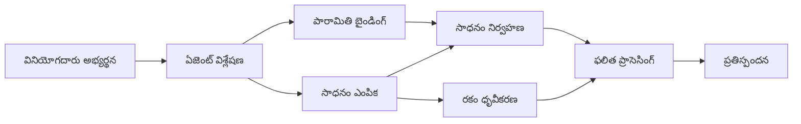

# 🛠️ Azure OpenAI (Responses API)తో అడ్వాన్స్ చేయించిన టూల్ ఉపయోగం (.NET)

## 📋 నేర్చుకునే లక్ష్యాలు

ఈ నోట్‌బుక్ Microsoft Agent Framework ని .NETలో Azure OpenAI (Responses API)తో ఉపయోగించి సంస్థ స్థాయి టూల్ ఇంటిగ్రేషన్ నమూనాలు చూపిస్తుంది. మీరు C# యొక్క బలమైన టైపింగ్ మరియు .NET యొక్క సంస్థల ఫీచర్లను ఉపయోగించి బహుళ ప్రత్యేక టూల్స్ ఉన్న సునిశిత ఏజెంట్లను నిర్మించడం నేర్చుకుంటారు.

### మీరు అర్థం చేసుకునే అధునాతన టూల్ సామర్థ్యాలు

- 🔧 **బహుళ టూల్ ఆర్కిటెక్చర్**: బహుళ ప్రత్యేక సామర్థ్యాలతో ఏజెంట్ల నిర్మాణం
- 🎯 **టైపు-సురక్షిత టూల్ అమలు**: C# యొక్క కంపైల్-టైమ్ చెల్లింపును ఉపయోగించడం
- 📊 **సంస్థ స్థాయి టూల్ నమూనాలు**: ఉత్పత్తి-సిద్ధమైన టూల్ డిజైన్ మరియు లోప నిర్వహణ
- 🔗 **టూల్ మిళితం**: సంక్లిష్ట వ్యాపార వర్క్‌ఫ్లోల కోసం టూల్స్‌ను కలుపుట

## 🎯 .NET టూల్ ఆర్కిటెక్చర్ లాభాలు

### సంస్థ స్థాయి టూల్ లక్షణాలు

- **కంపైల్-టైమ్ చెల్లింపు**: బలమైన టైపింగ్ తో టూల్ పరామితుల సరైనత నిర్ధారణ
- **డిపెండెన్సీ ఇంజెక్షన్**: టూల్ నిర్వహణ కోసమే IoC కంటైనర్ ఇంటిగ్రేషన్
- **అసంక్ర‌మ / వేచి ఉండే నమూనాలు**: సరైన వనరు నిర్వహణతో నిరోధించని టూల్ అమలు
- **స్థాపిత లాగింగ్**: టూల్ అమలు పర్యవేక్షణకు ఇన్‌బిల్ట్ లాగింగ్ ఇంటిగ్రేషన్

### ఉత్పత్తి-సిద్ధమైన నమూనాలు

- **వినియోగ లోప నిర్వహణ**: టైప్డ్ ఎక్సెప్షన్లు తో సమగ్ర లోప నిర్వహణ
- **వనరు నిర్వహణ**: సరైన వదిలివేత నమూనాలు మరియు మెమరీ నిర్వహణ
- **ప్రదర్శన పర్యవేక్షణ**: ఇన్‌బిల్ట్ మెట్రిక్స్ మరియు పనితీరు కౌంటర్లు
- **కాన్ఫిగరేషన్ నిర్వహణ**: ధృవీకరణతో టైపు-సురక్షిత కాన్ఫిగరేషన్

## 🔧 సాంకేతిక ఆర్కిటెక్చర్

### ప్రధాన .NET టూల్ భాగాలు

- **Microsoft.Extensions.AI**: ఐక్య టూల్ అభిసారపు పొర
- **Microsoft.Agents.AI**: సంస్థ స్థాయి టూల్ నిర్వహణ
- **Azure OpenAI (Responses API)**: కనెక్షన్ పూలింగ్ సహా అధిక ప్రదర్శన API క్లయింట్

### టూల్ అమలు పైప్‌లైన్



## 🛠️ టూల్ వర్గాలు & నమూనాలు

### 1. **డేటా ప్రాసెసింగ్ టూల్స్**

- **ఇన్పుట్ ధృవీకరణ**: డేటా సూచికలతో బలమైన టైపింగ్
- **మార్పిడి ఆపరేషన్లు**: టైపు-సురక్షిత డేటా మార్పిడి మరియు ఫార్మాటింగ్
- **వ్యాపార లాజిక్**: డొమయిన్-ప్రత్యేక లెక్కింపు మరియు విశ్లేషణ టూల్స్
- **అవుట్‌పుట్ ఫార్మాటింగ్**: నిర్మిత స్పందన సృష్టి

### 2. **ఇంటిగ్రేషన్ టూల్స్**

- **API కనెక్టర్‌లు**: HttpClient తో RESTful సర్వీస్ ఇంటిగ్రేషన్
- **డాటాబేస్ టూల్స్**: డేటా యాక్సెస్ కోసం Entity Framework ఇంటిగ్రేషన్
- **ఫైల్ ఆపరేషన్లు**: ధృవీకరణతో సురక్షిత ఫైల్ సిస్టమ్ చర్యలు
- **బాహ్య సర్వీసులు**: మూడవ పార్టీ సర్వీస్ ఇంటిగ్రేషన్ నమూనాలు

### 3. **ఉపయోగకర టూల్స్**

- **టెక్స్ట్ ప్రాసెసింగ్**: స్ట్రింగ్ నిర్వహణ మరియు ఫార్మాటింగ్ ఉపయోగకరాలు
- **తేదీ/సమయం ఆపరేషన్లు**: సంస్కృతి-జాగ్రత్త తేదీ/సమయ గణనలు
- **గణిత టూల్స్**: ఖచ్చితమైన లెక్కింపులు మరియు గణాంక చర్యలు
- **ధృవీకరణ టూల్స్**: వ్యాపార నిబంధన ధృవీకరణ మరియు డేటా నిర్ధారణ

శక్తివంతమైన, టైపు-సురక్షిత టూల్ సామర్థ్యాలతో .NETలో సంస్థ స్థాయి ఏజెంట్లను నిర్మించడానికి సిద్ధంగా ఉన్నారా? మనం కొన్ని ప్రొఫెషనల్-గ్రేడ్ పరిష్కారాలను ఆర్కిటెక్ట్ చేద్దాం! 🏢⚡

## 🚀 ప్రారంభికం

### అవసరమైన ఖచ్చితతలు

- [.NET 10 SDK](https://dotnet.microsoft.com/download/dotnet/10.0) లేదా అంతకంటే పై
- Azure OpenAI వనరు మరియు ఒక నమూనా ప్రణాళికతో [Azure సబ్‌స్క్రిప్షన్](https://azure.microsoft.com/free/)
- [Azure CLI](https://learn.microsoft.com/cli/azure/install-azure-cli) — `az login`తో సైన్ ఇన్ చేయండి

### అవసరమైన వాతావరణ చలామణీలు

```bash
# zsh/bash
export AZURE_OPENAI_ENDPOINT=https://<your-resource>.openai.azure.com
export AZURE_OPENAI_DEPLOYMENT=gpt-5-mini
# ఆ తరువాత AzureCliCredential టోకెన్ పొందేందుకు సైన్ ఇన్ అవ్వండి
az login
```

```powershell
# పవర్ షెల్
$env:AZURE_OPENAI_ENDPOINT = "https://<your-resource>.openai.azure.com"
$env:AZURE_OPENAI_DEPLOYMENT = "gpt-5-mini"
# ఆపై AzureCliCredential టోకెన్ పొందడానికి సైన్ ఇన్ చేయండి
az login
```

### నమూనా కోడ్

ఉదాహరణ కోడ్ నడపడానికి,

```bash
# zsh/bash
chmod +x ./04-dotnet-agent-framework.cs
./04-dotnet-agent-framework.cs
```

లేదా dotnet CLI ఉపయోగించి:

```bash
dotnet run ./04-dotnet-agent-framework.cs
```

సంపూర్ణ కోడ్ కోసం [`04-dotnet-agent-framework.cs`](../../../../04-tool-use/code_samples/04-dotnet-agent-framework.cs) చూడండి.

```csharp
#!/usr/bin/dotnet run

#:package Microsoft.Extensions.AI@10.*
#:package Microsoft.Agents.AI.OpenAI@1.*-*
#:package Azure.AI.OpenAI@2.1.0
#:package Azure.Identity@1.13.1

using System.ComponentModel;

using Microsoft.Agents.AI;
using Microsoft.Extensions.AI;

using Azure.AI.OpenAI;
using Azure.Identity;

// Tool Function: Random Destination Generator
// This static method will be available to the agent as a callable tool
// The [Description] attribute helps the AI understand when to use this function
// This demonstrates how to create custom tools for AI agents
[Description("Provides a random vacation destination.")]
static string GetRandomDestination()
{
    // List of popular vacation destinations around the world
    // The agent will randomly select from these options
    var destinations = new List<string>
    {
        "Paris, France",
        "Tokyo, Japan",
        "New York City, USA",
        "Sydney, Australia",
        "Rome, Italy",
        "Barcelona, Spain",
        "Cape Town, South Africa",
        "Rio de Janeiro, Brazil",
        "Bangkok, Thailand",
        "Vancouver, Canada"
    };

    // Generate random index and return selected destination
    // Uses System.Random for simple random selection
    var random = new Random();
    int index = random.Next(destinations.Count);
    return destinations[index];
}

// Azure OpenAI with the Responses API (stable v1 endpoint). Sign in with `az login`.
var azureEndpoint = Environment.GetEnvironmentVariable("AZURE_OPENAI_ENDPOINT")
    ?? throw new InvalidOperationException("AZURE_OPENAI_ENDPOINT is not set.");
var deployment = Environment.GetEnvironmentVariable("AZURE_OPENAI_DEPLOYMENT") ?? "gpt-5-mini";

var azureClient = new AzureOpenAIClient(new Uri(azureEndpoint), new AzureCliCredential());

// Define Agent Identity and Comprehensive Instructions
// Agent name for identification and logging purposes
var AGENT_NAME = "TravelAgent";

// Detailed instructions that define the agent's personality, capabilities, and behavior
// This system prompt shapes how the agent responds and interacts with users
var AGENT_INSTRUCTIONS = """
You are a helpful AI Agent that can help plan vacations for customers.

Important: When users specify a destination, always plan for that location. Only suggest random destinations when the user hasn't specified a preference.

When the conversation begins, introduce yourself with this message:
"Hello! I'm your TravelAgent assistant. I can help plan vacations and suggest interesting destinations for you. Here are some things you can ask me:
1. Plan a day trip to a specific location
2. Suggest a random vacation destination
3. Find destinations with specific features (beaches, mountains, historical sites, etc.)
4. Plan an alternative trip if you don't like my first suggestion

What kind of trip would you like me to help you plan today?"

Always prioritize user preferences. If they mention a specific destination like "Bali" or "Paris," focus your planning on that location rather than suggesting alternatives.
""";

// Create AI Agent with Advanced Travel Planning Capabilities
// Get the Responses client for the deployment and create the AI agent
// Configure agent with name, detailed instructions, and available tools
// This demonstrates the .NET agent creation pattern with full configuration
AIAgent agent = azureClient
    .GetChatClient(deployment)
    .AsAIAgent(
        name: AGENT_NAME,
        instructions: AGENT_INSTRUCTIONS,
        tools: [AIFunctionFactory.Create(GetRandomDestination)]
    );

// Create New Conversation Session for Context Management
// Initialize a new conversation session to maintain context across multiple interactions
// Sessions enable the agent to remember previous exchanges and maintain conversational state
// This is essential for multi-turn conversations and contextual understanding
await using var session = await agent.CreateSessionAsync();

// Execute Agent: First Travel Planning Request
// Run the agent with an initial request that will likely trigger the random destination tool
// The agent will analyze the request, use the GetRandomDestination tool, and create an itinerary
// Using the session parameter maintains conversation context for subsequent interactions
await foreach (var update in agent.RunStreamingAsync("Plan me a day trip", session))
{
    await Task.Delay(10);
    Console.Write(update);
}

Console.WriteLine();

// Execute Agent: Follow-up Request with Context Awareness
// Demonstrate contextual conversation by referencing the previous response
// The agent remembers the previous destination suggestion and will provide an alternative
// This showcases the power of conversation sessions and contextual understanding in .NET agents
await foreach (var update in agent.RunStreamingAsync("I don't like that destination. Plan me another vacation.", session))
{
    await Task.Delay(10);
    Console.Write(update);
}
```

---

<!-- CO-OP TRANSLATOR DISCLAIMER START -->
**అస్వీకరణ**:
ఈ పత్రం AI అనువాద సేవ [Co-op Translator](https://github.com/Azure/co-op-translator) ఉపయోగించి అనువదించబడింది. మేము ఖచ్చితత్వానికి ప్రయత్నిస్తున్నప్పటికీ, ఆటోమేటెడ్ అనువాదాలు తప్పులు లేదా అసమగ్రతలను కలిగి ఉండవచ్చు. దాని స్వదేశ భాషలో ఉన్న అసలు పత్రాన్ని అధికారం కలిగిన మూలంగా పరిగణించాలి. కీలకమైన సమాచారం కోసం, ప్రొఫెషనల్ మానవ అనువాదాన్ని సిఫారసు చేస్తాము. ఈ అనువాదం ఉపయోగం వల్ల కలిగే ఏవైనా అపార్థాలు లేదా తప్పుదారులు కోసం మేము బాధ్యత వహించము.
<!-- CO-OP TRANSLATOR DISCLAIMER END -->