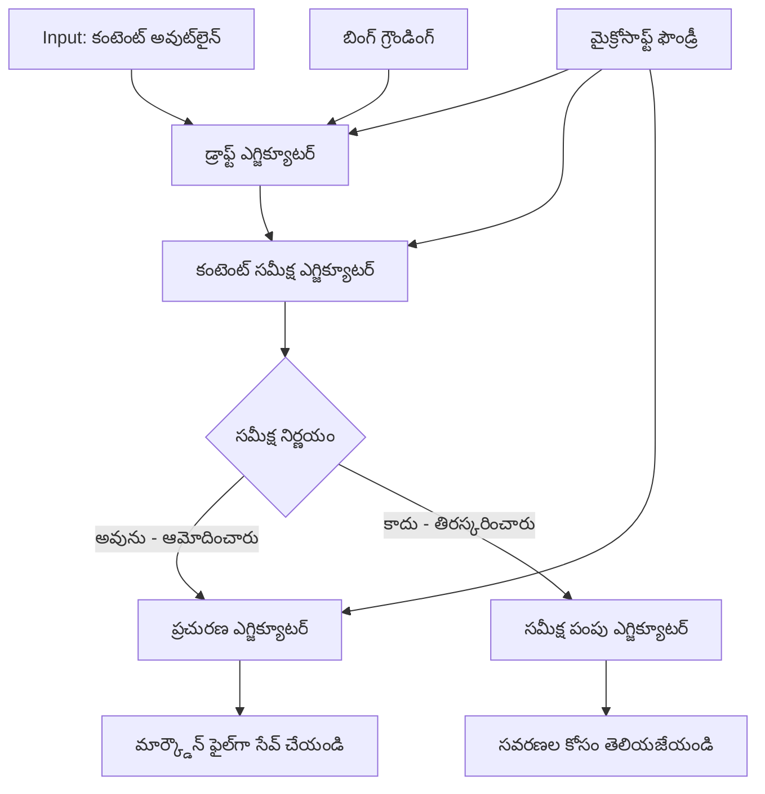

# 🔀 Microsoft Foundry (.NET) తో షరతులు ఆధారిత ఏజెంట్ వర్క్‌ఫ్లోలు

## 📋 బుద్ధిమంతమైన నిర్ణయం ఆధారిత వర్క్‌ఫ్లో ట్యుటోరియల్

ఈ నోట్బుక్ Microsoft Foundry మరియు Microsoft Agent Framework for .NET ఉపయోగించి **షరతులు ఆధారిత వర్క్‌ఫ్లో నమూనాలు** ను చూపిస్తుంది. మీరు AI విశ్లేషణ, వ్యాపార నిబంధనలు, మరియు డైనమిక్ పరిస్థితుల ఆధారంగా ప్రాసెస్సింగ్‌ను తెలివిగా మార్గనిర్దేశం చేసే సన్నిహిత, నిర్ణయం ఆధారిత వర్క్‌ఫ్లోలను ఎలా నిర్మించాలో నేర్చుకుంటారు, ఇది ఎంటర్‌ప్రైజ్-గ్రేడ్ ఆటోమేషన్ కోసం.

## 🎯 నేర్చుకోవాల్సిన లక్ష్యాలు

### 🧠 **బుద్ధిమంతమైన నిర్ణయ నిర్మాణం**
- **షరతులు లాజిక్ అమలు**: అనేక బ్రాంచింగ్ పాయింట్లతో సంక్లిష్ట నిర్ణయ వృక్షాలను నిర్మించండి
- **AI శక్తితో రూటింగ్**: తెలివైన రూటింగ్ నిర్ణయాల కోసం Microsoft Foundry మోడల్స్ ఉపయోగించండి
- **డైనమిక్ వర్క్‌ఫ్లో అనుకూలీకరణ**: రన్‌టైమ్ విశ్లేషణ మరియు పరిస్థితుల ఆధారంగా వర్క్‌ఫ్లో ప్రవర్తనను మార్చండి
- **ఎంటర్‌ప్రైజ్ నియమాల ఏకీకరణ**: వర్క్‌ఫ్లోలో వ్యాపార లాజిక్ మరియు అనుగుణతాత్మక అవసరాలను చేర్చండి

### 🔀 **అధునాతన షరతు నమూనాలు**
- **బహుళ-మార్గదర్శక నిర్ణయములు**: రూటింగ్ నిర్ణయాల కోసం అనేక అంశాలను మూల్యాంకనం చేయండి
- **సందర్భ చైతన్యం గల ప్రాసెసింగ్**: కూడికగా వచ్చిన వర్క్‌ఫ్లో సందర్భం మరియు చరిత్ర ఆధారంగా నిర్ణయాలు తీసుకోండి
- **అనుకూల వర్క్‌ఫ్లో సవరణ**: నిజ-సమయం పరిస్థితుల ఆధారంగా ప్రాసెసింగ్ మార్గాలను డైనమిక్‌గా సర్దుబాటు చేయండి
- **నియమ ఇంజిన్ ఏకీకరణ**: వర్క్‌ఫ్లోల్లో సంక్లిష్ట వ్యాపార నియమ ఇంజిన్లను అమలు చేయండి

### 🏢 **ఎంటర్‌ప్రైజ్ షరతు అప్లికేషన్లు**
- **డాక్యుమెంట్ వర్గీకరణ & రూటింగ్**: డాక్యుమెంట్లను తగిన వర్క్‌ఫ్లోలకు ఆటోమేటిక్‌గా వర్గీకరించి మార్గనిర్దేశం చేయండి
- **గ్రాహక సేవ ట్రియేజ్**: ప్రత్యేక హ్యాండ్లింగ్ టీమ్‌కి తెలివిగా కస్టమర్ విచారణలను రూటింగ్ చేయండి
- **అనుగుణత & రిస్క్ ప్రాసెసింగ్**: రిస్క్ అంచనా ఆధారంగా వివిధ పరిశీలన మరియు సమీక్ష ప్రక్రియలను వర్తింపజేయండి
- **నాణ్యత నిర్ధారణ వర్క్‌ఫ్లోలు**: నాణ్యత ప్రమాణాల ఆధారంగా సరైన సమీక్ష ప్రక్రియలకు కంటెంట్‌ను రూట్ చేయండి

## ⚙️ ముందు అవసరాలు & సెటప్

### 📦 **అవసరమైన NuGet ప్యాకేజీలు**

షరతులు ఆధారిత వర్క్‌ఫ్లో ప్రాసెసింగ్ కోసం ఆధునిక ప్యాకేజీలు:

```xml
<!-- Core AI Framework -->
<PackageReference Include="Microsoft.Extensions.AI" Version="9.9.0" />

<!-- Azure AI Agents with Persistent State -->
<PackageReference Include="Azure.AI.Agents.Persistent" Version="1.2.0-beta.5" />

<!-- Azure Identity and Utilities -->
<PackageReference Include="Azure.Identity" Version="1.15.0" />
<PackageReference Include="System.Linq.Async" Version="6.0.3" />
<PackageReference Include="DotNetEnv" Version="3.1.1" />

<!-- Local Workflow Framework References -->
<!-- Microsoft.Agents.Workflows.dll - Advanced workflow orchestration -->
<!-- Microsoft.Agents.AI.AzureAI.dll - Microsoft Foundry integration -->
<!-- Microsoft.Agents.AI.dll - Core agent abstractions -->
```

### 🔑 **Microsoft Foundry కన్ఫిగరేషన్**

**అవసరమైన Azure వనరులు:**
- షరతు ప్రాసెసింగ్ మోడల్స్‌తో Microsoft Foundry వర్క్‌స్పేస్
- సరైన కమ్‌ప్యూట్ కోటాలు మరియు అనుమతులతో Azure సబ్‌స్రిప్షన్
- నిర్ణయాలు మరియు కంటెంట్ విశ్లేషణ కోసం AI మోడల్స్ రూపొందించడం
- (ఐచ్ఛికం) Bing సెర్చ్ API కనెక్షన్ గ్రౌండింగ్ సామర్థ్యాలకు

**పరిస్థితి కాన్ఫిగరేషన్ (.env ఫైల్):**
```env
# Microsoft Foundry Configuration
AZURE_AI_PROJECT_ENDPOINT=https://your-project.cognitiveservices.azure.com/
BING_CONNECTION_ID=your-bing-connection-id
```

**ఆథెంటికేషన్ సెటప్:**
```csharp
// Azure CLI or Managed Identity authentication
using Azure.Identity;
var credential = new AzureCliCredential();

// Load environment configuration
DotNetEnv.Env.Load("../../../.env");
```

### 🏗️ **షరతులు ఆధారిత వర్క్‌ఫ్లో ఆర్కిటెక్చర్**



**ప్రధాన భాగాలు:**
- **డ్రాఫ్ట్ ఎగ్జిక్యూటర్**: అవుట్‌లైన్ల నుండి ప్రారంభ కంటెంట్ డ్రాఫ్ట్‌లను సృష్టించే AI ఏజెంట్
- **కంటెంట్ సమీక్ష ఎగ్జిక్యూటర్**: డ్రాఫ్ట్ నాణ్యత మరియు అనుగుణతను అంచనా వేయు AI ఏజెంట్
- **షరతు రూటింగ్**: సమీక్ష ఫలితాల ఆధారంగా మార్గనిర్దేశం చేసే నిర్ణయ లాజిక్
- **ప్రచురణ/సమీక్ష మార్గాలు**: ఆమోదించబడిన మరియు తిరస్కరించిన కంటెంట్ కోసం వేరే ప్రాసెసింగ్ మార్గాలు
- **స్టేట్ నిర్వహణ**: మొత్తం వర్క్‌ఫ్లోలో కంటెంట్ మరియు సమీక్ష సందర్భాన్ని నిర్వహిస్తుంది

## 🎨 **షరతులు ఆధారిత వర్క్‌ఫ్లో డిజైన్ నమూనాలు**

### 📋 **నాణ్యత గేట్లతో కంటెంట్ ఉత్పత్తి**
```
Outline → Draft Creation → Quality Review → {Approve: Publish | Reject: Revise}
```

### 🎯 **రిస్క్ ఆధారిత డాక్యుమెంట్ ప్రాసెసింగ్**
```
Document → Risk Assessment → {Low: Standard | High: Enhanced Review}
```

### 🔍 **బుద్ధిమంతులైన కస్టమర్ సేవ రూటింగ్**
```
Customer Query → Analysis → {Simple: FAQ Bot | Complex: Human Agent}
```

### 💼 **అనుగుణత ఆధారిత వర్క్‌ఫ్లోలు**
```
Content → Compliance Check → {Pass: Publish | Fail: Legal Review}
```

## 🏢 **ఎంటర్‌ప్రైజ్ షరతు లాభాలు**

### 🎯 **బుద్ధిమంతైన ఆటోమేషన్**
- **స్మార్ట్ నిర్ణయం తీసుకోవడం**: కంటెంట్ విశ్లేషణ మరియు సందర్భం ఆధారంగా AI శక్తితో రూటింగ్ నిర్ణయాలు
- **అనుకూల ప్రాసెసింగ్**: మారుతున్న పరిస్థితుల ఆధారంగా వర్క్‌ఫ్లోలు ఆటోమేటిక్‌గా సర్దుబాటు అవుతాయి
- **వ్యాపార నియమాల అమలు**: సంక్లిష్ట వ్యాపార లాజిక్ మరియు పాలసీల ఆటోమేటిక్ అనువర్తనం
- **సందర్భ చైతన్యంతో రూటింగ్**: మొత్తం వర్క్‌ఫ్లో చరిత్ర మరియు కూడిక సందర్భాల ఆధారంగా నిర్ణయాలు

### 📈 **ఆపరేషన్ ప్రతిభ**
- **ఆప్టిమైజ్డ్ వనరుల కేటాయింపు**: ప‌ని సరైన నిపుణుల‌కు మరియు ప్రక్రియ‌ల‌కు మార్గ‌నిర్దేశం
- **కమనిష్ఞీయ హస్తক্ষেপ తగ్గింపు**: ఆటోమేటెడ్ నిర్ణయాలు మానవ రూటింగ్ అవసరాన్ని తగ్గిస్తాయి
- **వేగవంతమైన పరిష్కార సమయాలు**: సరైన నైపుణ్యాలకు మరియు ప్రాసెసింగ్ సామర్థ్యాలకు ప్రత్యక్ష రూటింగ్
- **సమానమైన అనువర్తనం**: వ్యాపార నియమాలు మరియు నిర్ణయ ప్రమాణాల సమాన అనువర్తనం

### 🛡️ **రిస్క్ నిర్వహణ & అనుగుణత**
- **ఆటోమేటెడ్ రిస్క్ అంచనా**: కంటెంట్ మరియు పరిస్థితి రిస్క్ స్థాయిల యొక్క AI శక్తితో అంచనా
- **అనుగుణత అమలు**: అవసరమైన నియంత్రణ ప్రక్రియల ద్వారా ఆటోమేటిక్ రూటింగ్
- **సెక్యూరిటీ ప్రోటోకాల్ అనువర్తనం**: రిస్క్ అంచనాకు అనుగుణంగా మెరుగైన భద్రతా చర్యలు వర్తింపు
- **ఆడిట్ ట్రెయిల్ నిర్వహణ**: రూటింగ్ నిర్ణయాలు మరియు కారణాల పూర్తి పత్రాలు

### 📊 **విశ్లేషణ & నిరంతర అభివృద్ధి**
- **నిర్ణయ విశ్లేషణ**: రూటింగ్ నిర్ణయాల ప్రభావం మరియు ఖచ్చితత్వం ట్రాక్ చేయండి
- **నమూనా గుర్తింపు**: సమయానికి రూటింగ్ నిర్ణయాలలో నడుము మరియు నమూనాలను గుర్తించండి
- **పనితీరు ఆప్టిమైజేషన్**: నిర్ణయ ప్రమాణాలు మరియు రూటింగ్ సామర్థ్యాల నిరంతర మెరుగుదల
- **వ్యापార ఇంటెలిజెన్స్**: కంటెంట్ లక్షణాలు మరియు ప్రాసెసింగ్ అవసరాలపై అవగాహనలు

### 🔧 **సాంకేతిక ప్రతిభ**
- **పెర్సిస్టెంట్ స్టేట్ నిర్వహణ**: వర్క్‌ఫ్లో అమలుపై సంక్లిష్ట స్టేట్ నిర్వహణ
- **స్కేలబుల్ ఆర్కిటెక్చర్**: అధిక వాల్యూమ్ షరతు ప్రాసెసింగ్ అవసరాలను నిర్వహించు
- **ఏకీకరణ సామర్థ్యాలు**: ఉన్న వ్యాపార వ్యవస్థలు మరియు ప్రక్రియలతో సరళమైన ఏకీకరణ
- **మానిటరింగ్ & పరిశీలన**: వర్క్‌ఫ్లో పనితీరు మరియు నిర్ణయాల సమగ్ర ట్రాకింగ్

.NET తో తెలివైన, నిర్ణయం ఆధారిత ఎంటర్‌ప్రైజ్ వర్క్‌ఫ్లోలను నిర్మిద్దాం! 🚀

## 💻 కోడ్ నడిపించడం

పూర్తి అమలు `04.dotnet-agent-framework-workflow-aifoundry-condition.cs`లో లభ్యమవుతుంది. ఇది **నాణ్యత గేట్లతో కంటెంట్ ఉత్పత్తి వర్క్‌ఫ్లో**ను చూపిస్తుంది:

### 🏗️ **వర్క్‌ఫ్లో ఆర్కిటెక్చర్**

```
Content Outline → Draft Creation → Quality Review → Conditional Routing:
                                                      ├─ Approved (>200 words) → Publish
                                                      └─ Rejected (<200 words) → Review Notification
```

**వర్క్‌ఫ్లో లో ఏజెంట్లు:**
1. **ఎవాంజలిస్ట్ ఏజెంట్**: Bing గ్రౌండింగ్‌తో అవుట్‌లైన్ల నుండి ట్యుటోరియల్ డ్రాఫ్ట్‌లను సృష్టిస్తుంది
2. **కంటెంట్ రివ్యూ ఏజెంట్**: డ్రాఫ్ట్ నాణ్యత (పదుల సంఖ్య, పూర్తి వంటి) మూల్యాంకనం చేస్తుంది
3. **ప్రచురణ ఏజెంట్**: ఆమోదించిన కంటెంట్‌ను టైం స్టాంప్డ్ మార్క్డౌన్ ఫైళ్లుగా సేవ్ చేస్తుంది

**అనుకూల ఎగ్జిక్యూటర్లు:**
1. **డ్రాఫ్ట్ ఎగ్జిక్యూటర్**: డ్రాఫ్ట్ సృష్టి యొక్క సమన్వయం చేస్తుంది
2. **కంటెంట్ రివ్యూ ఎగ్జిక్యూటర్**: నాణ్యత మూల్యాంకనం నిర్వర్తిస్తుంది
3. **ప్రచురణ ఎగ్జిక్యూటర్**: ఆమోదించిన కంటెంట్ ప్రచురణను నిర్వహిస్తుంది
4. **సెండ్ రివ్యూ ఎగ్జిక్యూటర్**: తిరస్కరించిన కంటెంట్ నోటిఫికేషన్‌లను నిర్వహిస్తుంది

### 🚀 ఉదాహరణ నడిపించడం

**ముందు అవసరాలు:**
- Microsoft Foundry వర్క్‌స్పేస్ సెట్ అయ్యి ఉండాలి
- Azure CLI ఆథెంటికేషన్ (`az login`)
- (ఐచ్ఛికం) Bing సెర్చ్ కనెక్షన్ గ్రౌండింగ్ కోసం

```bash
# స్క్రిప్ట్‌ను ఎజిక్యూటబుల్‌గా మార్చండి (Unix/Linux/macOS)
chmod +x 04.dotnet-agent-framework-workflow-aifoundry-condition.cs

# షరతుపూర్వక వర్క్‌ఫ్లోను నడపండి
./04.dotnet-agent-framework-workflow-aifoundry-condition.cs
```

లేదా Windows లో:
```powershell
dotnet run 04.dotnet-agent-framework-workflow-aifoundry-condition.cs
```

### 📝 అంచనా ఫలితం

వర్క్‌ఫ్లో:
1. **ఏజెంట్లను సృష్టిస్తుంది**: మూడు నిర్దిష్ట Microsoft Foundry ఏజెంట్లను ఆరంభిస్తుంది
2. **డ్రాఫ్ట్‌ను తీయండి**: ఎవాంజలిస్టుడు అవుట్‌లైన్ నుండి ట్యుటోరియల్ డ్రాఫ్ట్ సృష్టిస్తుంది
3. **కంటెంట్ సమీక్ష**: కంటెంట్ రివ్యూ ఏజెంట్ డ్రాఫ్ట్ నాణ్యతను అంచనా వేస్తుంది
4. **షరతు రూటింగ్**:
   - **ఆమోదం (200 పదాలకు మించి అయితే)**: ప్రచురణ ఎగ్జిక్యూటర్ మార్క్డౌన్ ఫైల్‌గా సేవ్ చేస్తుంది
   - **తిరస్కరణ (200 పదాలకు తక్కువ)**: సమీక్ష నోటిఫికేషన్ ని పంపుతుంది
5. **ఫలితాలను ప్రదర్శించు**: తుది వర్క్‌ఫ్లో ఫలితాన్ని చూపిస్తుంది

### 🔧 అనుకూలీకరణ ఎంపికలు

**సమీక్ష ప్రమాణాలను మార్చండి:**
```csharp
const string ContentReviewerInstructions = @"
You are a content reviewer...
1. Check if content is more than 500 words (instead of 200)
2. Verify technical accuracy
3. Ensure proper formatting
...";
```

**ఇంకా షరతు మార్గాలు జోడించండి:**
```csharp
var workflow = new WorkflowBuilder(draftExecutor)
    .AddEdge(draftExecutor, contentReviewerExecutor)
    .AddEdge(contentReviewerExecutor, publishExecutor, condition: GetCondition("Excellent"))
    .AddEdge(contentReviewerExecutor, editExecutor, condition: GetCondition("Good"))
    .AddEdge(contentReviewerExecutor, sendReviewerExecutor, condition: GetCondition("Poor"))
    .Build();
```

**కంటెంట్ అవసరాలను మార్చండి:**
```csharp
string OUTLINE_Content = @"
# Your Custom Topic
## Section 1
https://your-reference-url
## Section 2
...
";
```

### 🎯 అసలు ప్రపంచ అప్లికేషన్లు

ఈ షరతు వర్క్‌ఫ్లో నమూనా యధార్థంగా:
- **కంటెంట్ మేనేజ్‌మెంట్ సిస్టమ్లు**: నాణ్యత గేట్లతో ఆటోమేటెడ్ ఎడిటోరియల్ వర్క్‌ఫ్లోలు
- **డాక్యుమెంట్ ప్రాసెసింగ్**: వర్గీకరణ మరియు అనుగుణత ఆధారంగా డాక్యుమెంట్లను మార్గనిర్దేశం చేయండి
- **కస్టమర్ సపోర్ట్**: క్లిష్టత మరియు అత్యవసరత ఆధారంగా తెలివైన టికెట్ రూటింగ్
- **చట్ట సమీక్ష**: రిస్క్ అంచనా మరియు విలువ ఆధారంగా ఒప్పందాలను రూటింగ్ చేయండి
- **HR ప్రక్రియలు**: దరఖాస్తులను సరైన స్క్రీనింగ్ వర్క్‌ఫ్లోల ద్వారా మార్గనిర్దేశం చేయండి

### 🔍 షరతు లాజిక్ అర్థం చేసుకోవడం

**షరతు ఫังก్షన్:**
```csharp
public Func<object?, bool> GetCondition(string expectedResult) =>
    reviewResult => reviewResult is ReviewResult review && review.Result == expectedResult;
```

ఈ ఫంక్షన్ క్రింది విధంగా ప్రిడికేట్ సృష్టిస్తుంది:
1. ఫలితం `ReviewResult` టైప్ కావొచ్చో లేదో తనిఖీ చేస్తుంది
2. `Result` సొమ్ము అనుకున్న విలువతో పోల్చుతుంది
3. రూటింగ్ కోసం true/false ని ఇస్తుంది

**షరతులతో వర్క్‌ఫ్లో ఎడ్జెస్:**
```csharp
.AddEdge(contentReviewerExecutor, publishExecutor, condition: GetCondition("Yes"))
.AddEdge(contentReviewerExecutor, sendReviewerExecutor, condition: GetCondition("No"))
```

### 📊 అధునాతన లక్షణాలు

**JSON స్కీమా వాలిడేషన్:**
వర్క్‌ఫ్లో సరైన నిర్మిత స్పందనల కోసం JSON స్కీమాలను ఉపయోగిస్తుంది:

```csharp
// Define response structure
public class ReviewResult
{
    [JsonPropertyName("review_result")]
    public string Result { get; set; } = string.Empty;
    
    [JsonPropertyName("reason")]
    public string Reason { get; set; } = string.Empty;
    
    [JsonPropertyName("draft_content")]
    public string DraftContent { get; set; } = string.Empty;
}

// Apply to agent
ResponseFormat = ChatResponseFormat.ForJsonSchema(
    AIJsonUtilities.CreateJsonSchema(typeof(ReviewResult)), 
    "ReviewResult", 
    "Review Result From DraftContent"
)
```

**Bing గ్రౌండింగ్ ఏకీకరణ:**
ఎవాంజలిస్ట్ ఏజెంటు నిజ-సమయ సమాచారం కోసం Bing గ్రౌండింగ్ ఉపయోగిస్తుంది:

```csharp
var bingGroundingConfig = new BingGroundingSearchConfiguration(bing_conn_id);
BingGroundingToolDefinition bingGroundingTool = new(
    new BingGroundingSearchToolParameters([bingGroundingConfig])
);
```

ఇది ఏజెంట్‌కి అవుట్‌లైన్‌లో URLలను అనుసరించి ప్రస్తుత సమాచారాన్ని తీసుకోవడానికి సహాయపడుతుంది.

### 🛡️ లోపం నిర్వహణ

వర్క్‌ఫ్లో తిరస్కరించిన కంటెంట్ కోసం పటిష్ట లోప నిర్వహణను కలిగి ఉంటుంది:
- సమీక్ష లోపాలు ప్రత్యామ్నాయ మార్గాన్ని ప్రారంభిస్తాయి
- నోటిఫికేషన్లు సూటిగా తిరస్కరణ కారణాలను అందిస్తాయి
- కంటెంట్ దిద్దుబాటుకు నిల్వ చేయబడుతుంది

### 🔄 వర్క్‌ఫ్లో విస్తరించడం

**సవరణ లూప్ జోడించండి:**
కంటెంట్‌ను ఆటోమేటిక్‌గా తిరిగి డ్రాఫ్ట్ చేసే ఫీడ్బాక్ లూప్ సృష్టించండి:

```csharp
.AddEdge(contentReviewerExecutor, publishExecutor, condition: GetCondition("Yes"))
.AddEdge(contentReviewerExecutor, draftExecutor, condition: GetCondition("No")) // Loop back
```

**బహుళ-స్థాయి సమీక్షను అమలు చేయండి:**
వేర్వేరు ప్రమాణాలతో అనేక సమీక్ష దశలను జోడించండి:

```csharp
.AddEdge(draftExecutor, technicalReviewer)
.AddEdge(technicalReviewer, editorialReviewer, condition: GetCondition("TechPass"))
.AddEdge(editorialReviewer, publishExecutor, condition: GetCondition("EditPass"))
```

ఈ షరతు వర్క్‌ఫ్లో నమూనా తెలివైన, సన్నిహిత ఎంటర్‌ప్రైజ్ ఆటోమేషన్ సిస్టమ్స్‌ను నిర్మించేందుకు పునాదిని అందిస్తుంది! 🚀

---

<!-- CO-OP TRANSLATOR DISCLAIMER START -->
**అస్వీకరణ**:
ఈ పత్రం AI అనువాద సేవ [Co-op Translator](https://github.com/Azure/co-op-translator) ఉపయోగించి అనువదించబడింది. మేము ఖచ్చితత్వానికి ప్రయత్నిస్తున్నప్పటికీ, ఆటోమేటెడ్ అనువాదాలు తప్పులు లేదా అసమగ్రతలను కలిగి ఉండవచ్చు. దాని స్వదేశ భాషలో ఉన్న అసలు పత్రాన్ని అధికారం కలిగిన మూలంగా పరిగణించాలి. కీలకమైన సమాచారం కోసం, ప్రొఫెషనల్ మానవ అనువాదాన్ని సిఫారసు చేస్తాము. ఈ అనువాదం ఉపయోగం వల్ల కలిగే ఏవైనా అపార్థాలు లేదా తప్పుదారులు కోసం మేము బాధ్యత వహించము.
<!-- CO-OP TRANSLATOR DISCLAIMER END -->