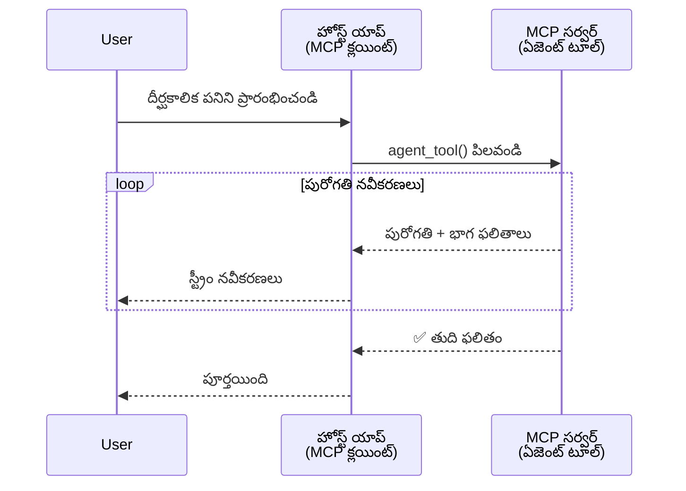
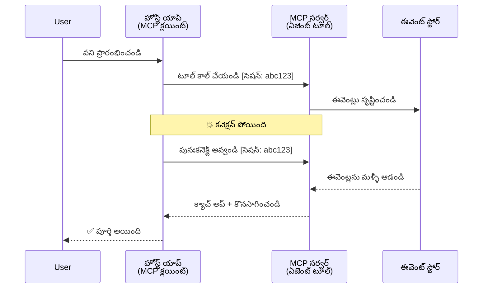
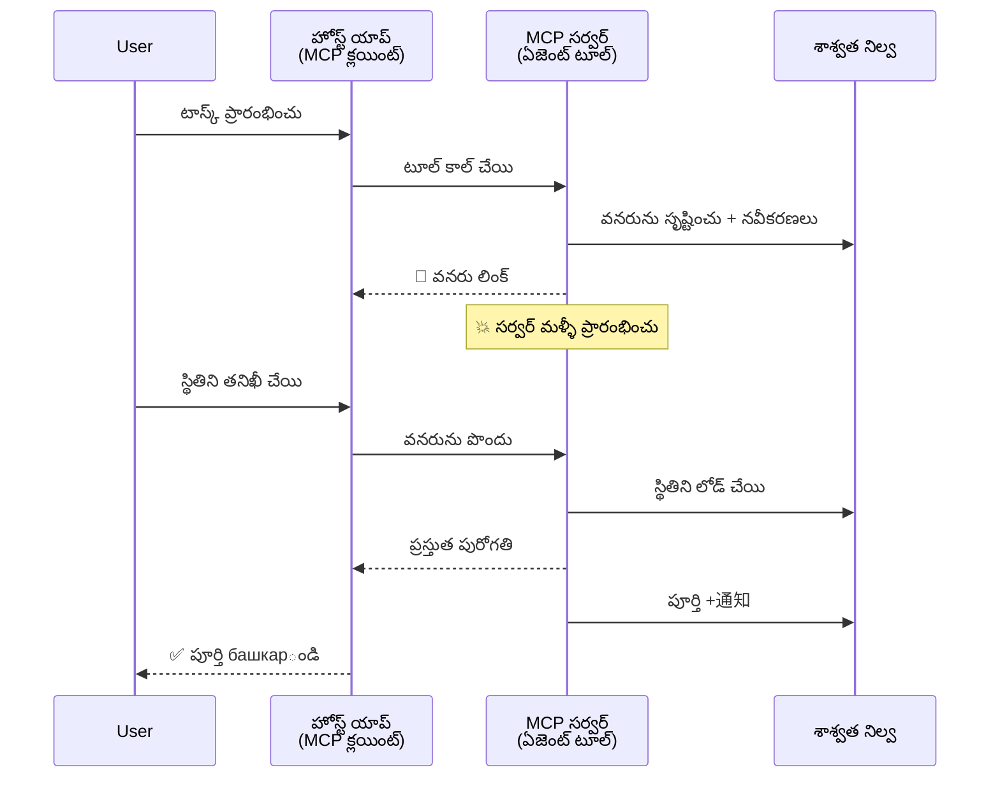
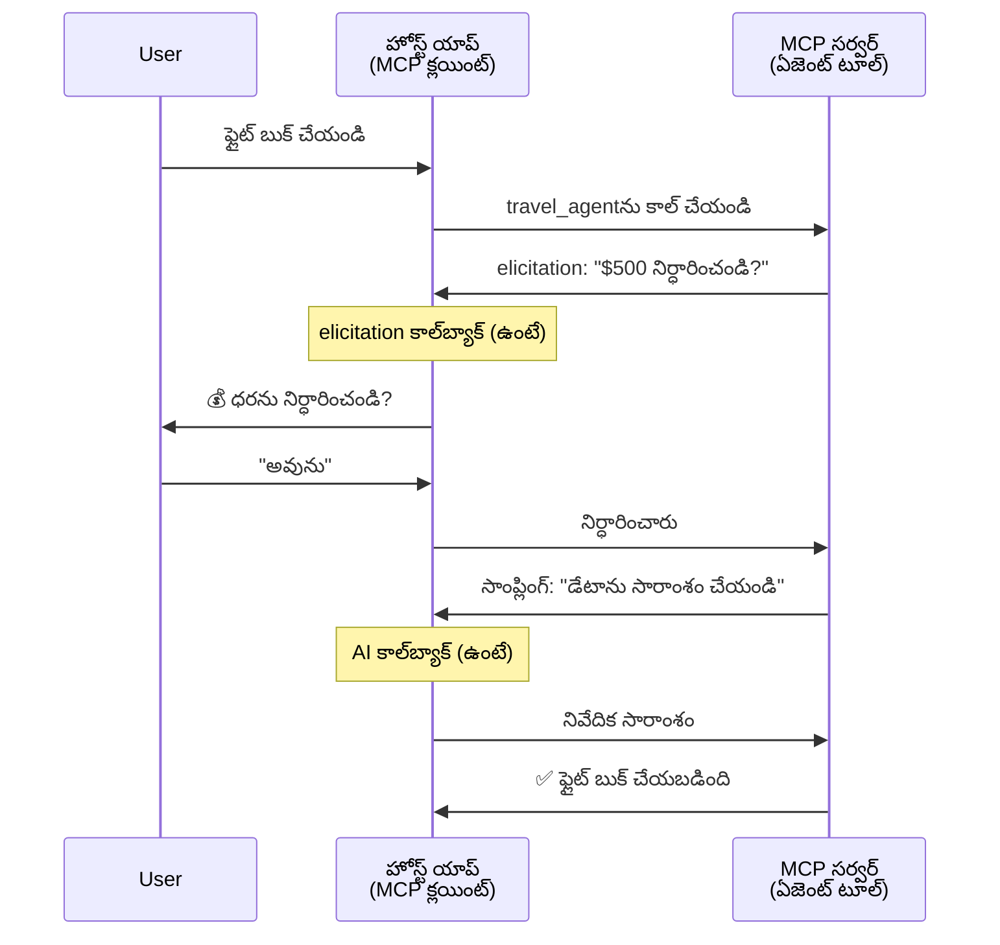
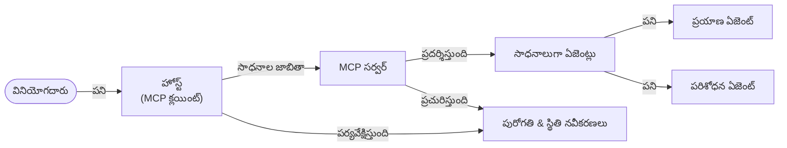

# MCP తో ఏజెంట్-టు-ఏజెంట్ కమ్యూనికేషన్ సిస్టములను నిర్మించడం

> TL;DR - MCP పై Agent2Agent కమ్యూనికేషన్‌ని మీరు నిర్మించగలరా? అవును!

MCP తన అసలు లక్ష్యం "LLMs కు సాహిత్యం అందించడం" కంటే చాలా దూరంగా అభివృద్ధి చెందింది. ఇటీవల వచ్చిన[file resumable streams](https://modelcontextprotocol.io/docs/concepts/transports#resumability-and-redelivery),[elicitation](https://modelcontextprotocol.io/specification/2025-06-18/client/elicitation),[sampling](https://modelcontextprotocol.io/specification/2025-06-18/client/sampling), మరియు నోటిఫికేషన్లలో ([progress](https://modelcontextprotocol.io/specification/2025-06-18/basic/utilities/progress) మరియు [resources](https://modelcontextprotocol.io/specification/2025-06-18/schema#resourceupdatednotification)) మెరుగులు, MCP ఇప్పుడు సంక్లిష్ట agent-to-agent కమ్యూనికేషన్ సిస్టముల నిర్మాణానికి బలోపేతమైన భూమిక అందిస్తుంది.

## ఏజెంట్/టూల్ తప్పుదృక్కోణం

ఎక్కువ డెవలపర్లు agentic ప్రవర్తనలతో టూల్స్ (పలువురు కాలం పాటు నడుస్తాయి, అమలు మధ్య ఎక్కువ ఇన్‌పుట్ అవసరం ఉండొచ్చు, మొదలైనవి) అన్వేషించడంలో, ఒక సాధారణ తప్పుదృష్టి ఈ MCP అసాధ్యం అని భావించడం, ముఖ్యంగా పాత ఉదాహరణలలో ఉన్న సాధారణ రిక్వెస్ట్-రిస్పాన్స్ నమూనాలు.

ఈ అభిప్రాయం పాతది. గత కొంతకాలంలో MCP స్పెసిఫికేషన్ లోని కొత్త సామర్ధ్యాలు agentic ప్రవర్తనను వ్యాప్తి చేయటానికి ఉంది:

- **స్ట్రీమింగ్ & పార్టియల్ ఫలితాలు**: అమలు సమయంలో రియల్-టైమ్ అభివృద్ధి నవీకరణలు
- **పునఃప్రారంభం కొరకు సామర్థ్యం**: క్లయింట్లు విరామం తర్వాత పునఃకనెక్ట్ అవ్వగలరు మరియు కొనసాగించగలరు
- **దీర్ఘకాలికత్వం**: ఫలితాలు సర్వర్ పునఃప్రారంభాల తర్వాత నిలిచిపోతాయి (ఉదాహరణకు, వనరుల లింక్‌ల ద్వారా)
- **బహుళ-టర్న్**: elicitation మరియు sampling ద్వారా అమలు మధ్యలో ఇంటరాక్టివ్ ఇన్‌పుట్

ఈ ఫీచర్‌లు కలిపి సంక్లిష్ట agentic మరియు బహుళ agent అప్లికేషన్‌లను అమలు చేయడానికి అనుకూలంగా ఉంటాయి, అన్నీ MCP ప్రోటోకాల్ పై.

ఉదాహరణకు, ఏజెంట్ అంటే MCP సర్వర్ పై అందుబాటులో ఉన్న "టూల్" అని పరిగణిస్తాము. దీని అర్థం MCP క్లయింట్ అమలు చేసే ఒక హోస్ట్ అప్లికేషన్ ఉంది, ఇది MCP సర్వర్ తో సెషన్ ఏర్పరుస్తుంది మరియు ఏజెంట్ ని కాల్ చేయగలదు.

## MCP టూల్ "ఏజెంటిక్" అవ్వడానికి కావాల్సినది ఏమిటి?

అమలు మొదలుపెట్టేముందు, దీర్ఘకాల agent లకు అవసరమైన మౌలిక సదుపాయాలను పరిగణిద్దాం.

> ఏజెంట్ అంటే దీర్ఘకాల సమయం పాటు స్వతంత్రమైనిగా పనిచేయగల సబ్‌జెక్ట్, ఇది సంక్లిష్ట పనులు చేపట్టగలదు మరియు అనేక ఇంటరాక్షన్‌లు లేదా రియల్-టైమ్ ఫీడ్బ్యాక్ ఆధారంగా సర్దుబాట్లు చేయగలదు.

### 1. స్ట్రీమింగ్ & పార్టియల్ ఫలితాలు

సాంప్రదాయక రిక్వెస్ట్-రిస్పాన్స్ నీలయంలో దీర్ఘకాల పనులు సరిపోలవు. ఏజెంట్లు అందించాలి:

- రియల్-టైమ్ అభివృద్ధి నవీకరణలు
- మధ్యంతర ఫలితాలు

**MCP మద్దతు**: వనరు నవీకరణ నోటిఫికేషన్లు స్ట్రీమింగ్ ద్వారా పార్టియల్ ఫలితాలు అందించగలవు, కానీ JSON-RPC యొక్క 1:1 రిక్వెస్ట్/రిస్పాన్స్ నమూనాతో సర్దుబాటు అవసరం.

| ఫీచర్                     | ఉపయోగం                                                                                                                           | MCP మద్దతు                                                          |
| -------------------------- | ------------------------------------------------------------------------------------------------------------------------------ | ------------------------------------------------------------------ |
| రియల్-టైమ్ అభివృద్ధి నవీకరణలు | యూజర్ కోడ్‌బేస్ మైగ్రేషన్ పనిని కోరుతాడు. ఏజెంట్ ప్రగతి స్ట్రీమింగ్ చేస్తుంది: "10% - ఆధారాలను విశ్లేషిస్తున్నాం... 25% - TypeScript ఫైళ్లను మార్చడం... 50% - దిగుమతులను నవీకరిస్తున్నాం..." | ✅ ప్రగతి నోటిఫికేషన్లు                                              |
| పార్టియల్ ఫలితాలు            | "పుస్తకం తయారు చేయండి" టాస్క్ పార్టియల్ ఫలితాలను స్ట్రీమ్ చేస్తుంది, ఉదా: 1) కథా అవుట్‌లైన్, 2) అధ్యాయం జాబితా, 3) ప్రతి అధ్యాయం పూర్తయినప్పుడు. హోస్ట్ ఏదైనా దశలో పరిశీలించవచ్చు, రద్దు లేదా మార్గనిర్దేశం చేయవచ్చు. | ✅ నోటిఫికేషన్లు "పార్టియల్ ఫలితాలను" కలపడానికి విస్తరించబడవచ్చు, PR 383, 776 సూచనలు చూడండి |

<div align="center" style="font-style: italic; font-size: 0.95em; margin-bottom: 0.5em;">
<strong>ఫిగర్ 1:</strong> దీని ద్వారా MCP ఏజెంట్ ఒక దీర్ఘకాల టాస్క్ సమయంలో హోస్ట్ అప్లికేషన్ కు రియల్-టైమ్ ప్రగతి నవీకరణలు మరియు పార్టియల్ ఫలితాలు స్ట్రీమ్ చేస్తుంది, యూజర్ అమలును ప్రత్యక్షంగా పర్యవేక్షించగలుగుతాడు.
</div>



### 2. పునఃప్రారంభం కొరకు సామర్థ్యం

ఏజెంట్లు నెట్‌వర్క్ విరామాలను మెరుగ్గా నిర్వహించాలి:

- విరామం తర్వాత మళ్ళీ కనెక్ట్ కావడం
- అక్కడి నుండే కొనసాగడం (మెసేజ్ మళ్ళీ పంపడం)

**MCP మద్దతు**: MCP StreamableHTTP ట్రాన్స్పోర్ట్ సెషన్ పునఃప్రారంభం మరియు మెసేజ్ తిరిగి పంపడాన్ని సెషన్ IDలతో మరియు ఆఖరి ఈవెంట్ IDలతో మద్దతు అందిస్తుంది. ముఖ్యమైన విషయం ఏమిటంటే సర్వర్ EventStore అమలు చేయాలి, ఇది క్లయింట్ పునఃకనెక్షన్ సమయంలో ఈవెంట్‌లను మళ్లీ ప్లే చేయగలదు.  
ఒక కమ్యూనిటీ ప్రతిపాదన (PR #975) ట్రాన్స్పోర్ట్-ఆగ్నోస్టిక్ రీస్యూమబుల్ స్ట్రీమ్స్‌ను పరిశీలిస్తోంది.

| ఫీచర్        | ఉపయోగం                                                                                                                             | MCP మద్దతు                                                            |
| ------------ | ---------------------------------------------------------------------------------------------------------------------------------- | -------------------------------------------------------------------- |
| పునఃప్రారंभం   | క్లయింట్ దీర్ఘకాల టాస్క్ సమయంలో డిస్కనెక్ట్ అవుతాడు. మళ్ళీ కనెక్ట్ అయినప్పుడు సెషన్ మిస్సైన ఈవెంట్‌లను ప్లే చేసి పునఃప్రారంభం అవుతుంది, అక్కడినుంచి కొనసాగుతుంది. | ✅ StreamableHTTP సెషన్ IDలు, ఈవెంట్ ప్లే మరియు EventStore తో      |

<div align="center" style="font-style: italic; font-size: 0.95em; margin-bottom: 0.5em;">
<strong>ఫిగర్ 2:</strong> MCP స్ట్రీమబుల్హెచ్టిపి ట్రాన్స్పోర్ట్ మరియు ఈవెంట్ స్టోర్ ఎలా సెషన్ పునఃప్రారంభం సులభం చేస్తాయో చూపుతుంది: క్లయింట్ డిస్కనెక్ట్ అయినా, మిస్సైన ఈవెంట్లను మళ్లీ ప్లే చేసి పనిని కొనసాగించవచ్చు.
</div>



### 3. దీర్ఘకాలికత్వం

దీర్ఘకాల agent లకు శాశ్వత స్టేట్ అవసరం:

- ఫలితాలు సర్వర్ రీస్టార్ట్ అయిన తరువాత నిలిచిపోతాయి
- స్టేటస్ అందుబాటులో ఉంటుంది
- సెషన్ల మధ్య ప్రగతి ట్రాకింగ్

**MCP మద్దతు**: ఇప్పుడు MCP టూల్ కాల్స్ కొరకు Resource లింక్ రిటర్న్ టైపు మద్దతిచ్చింది. సాధారణ నమూనా టూల్ ఒక వనరును సృష్టించి వెంటనే వనరు లింక్‌ను ఇస్తుంది. టూల్ బ్యాక్‌గ్రౌండ్‌లో టాస్కును కొనసాగించి వనరును అప్డేట్ చేయవచ్చు. క్లయింట్ ఈ వనరును పోలింగ్ చేసి పార్టియల్ లేదా పూర్తి ఫలితాలు పొందవచ్చు లేదా నవీకరణ నోటిఫికేషన్ల కోసం సబ్‌స్క్రైబ్ చేయవచ్చు.

ఒక పరిమితి ఏంటి అంటే, వనరులను పోలింగ్ చేయడం లేదా నవీకరణలకు సబ్‌స్క్రైబ్ అవ్వడం వనరులు తీసుకుంటుంది, ఇది స్కేల్ వద్ద ప్రభావం చూపొచ్చు. ఓపెన్ కమ్యూనిటీ ప్రతిపాదనలు (#992 సహా) వెబ్‌హుక్స్ లేదా ట్రిగర్స్‌ను సర్వర్ క్లయింట్/హోస్ట్ యాప్‌కి నోటిఫై చేసే విధంగా చర్చిస్తున్నాయి.

| ఫీచర్   | ఉపయోగం                                                                                                                  | MCP మద్దతు                                                    |
| -------- | ----------------------------------------------------------------------------------------------------------------------- | -------------------------------------------------------------- |
| దీర్ఘకాలికత్వం | డేటా మైగ్రేషన్ టాస్క్ సమయంలో సర్వర్ క్రాష్. ఫలితాలు మరియు ప్రగతి నిలిచిపోతాయి, క్లయింట్ స్టేటస్ చెక్ చేసి పునరారంభించవచ్చు. | ✅ వనరు లింక్‌లు శాశ్వత నిల్వ మరియు స్టేటస్ నోటిఫికేషన్లతో        |

ప్రస్తుతం, సాధారణ నమూనా టూల్ ఒక వనరును సృష్టించి వెంటనే వనరు లింక్‌ను ఇస్తుంది, టాస్కును బ్యాక్‌గ్రౌండ్‌లో కొనసాగించి వనరును నవీకరిస్తుంది మరియు క్లయింట్ దీనిని పోలింగ్ లేదా సబ్‌స్క్రిప్షన్ ద్వారా ఫలితాలు తీసుకుంటుంది.

<div align="center" style="font-style: italic; font-size: 0.95em; margin-bottom: 0.5em;">
<strong>ఫిగర్ 3:</strong> MCP ఏజెంట్లు దీర్ఘకాల పనులు సర్వర్ రీస్టార్ట్‌లను అధిగమించేందుకు శాశ్వత వనరులు మరియు స్టేటస్ నోటిఫికేషన్లను ఎలా ఉపయోగిస్తాయో చూపిస్తుంది, ఫెయిల్యూర్ తర్వాత కూడా క్లయింట్లు ప్రగతి తనిఖీ చేసి ఫలితాలు పొందవచ్చు.
</div>



### 4. బహుళ-టర్న్ ఇంటరాక్షన్లు

ఏజెంట్లు తరచుగా అమలు మధ్యలో అదనపు ఇన్‌పుట్ అవసరం:

- మానవ స్పష్టత లేదా ఆమోదం
- సంక్లిష్ట నిర్ణయాలకు AI సహాయం
- డైనమిక్ పరామితి సర్దుబాటు

**MCP మద్దతు**: sampling (AI కు) మరియు elicitation (మనిషికి) ద్వారా పూర్తిగా మద్దతు.

| ఫీచర్              | ఉపయోగం                                                                                                                 | MCP మద్దతు                                            |
| -------------------- | ---------------------------------------------------------------------------------------------------------------------- | ----------------------------------------------------- |
| బహుళ-టర్న్ ఇంటరాక్షన్ | ట్రావెల్ బుకింగ్ ఏజెంట్ యూజర్ నుండి ధర నిర్ధారణ కోరుతుంది, ఆ తర్వాత AI ను travel data సారాంశం చేయమని అడుగుతుంది, తరువాత బుకింగ్ ముగుస్తుంది. | ✅ elicitation మనిషి ఇన్‌పుట్ కి, sampling AI ఇన్‌పుట్ కి  |

<div align="center" style="font-style: italic; font-size: 0.95em; margin-bottom: 0.5em;">
<strong>ఫిగర్ 4:</strong> MCP ఏజెంట్లు ఎలా ఇంటరాక్టివ్‌గా మానవ ఇన్‌పుట్ లేదా AI సహాయం కోరగలవో చూపిస్తుంది, కాంప్లెక్స్ బహుళ-టర్న్ వర్క్‌ఫ్లోలను మద్దతు ఇస్తూ.
</div>



## MCP పై దీర్ఘకాల ఏజెంట్లను అమలు చేయడం - కోడ్ సమీక్ష

ఈ ఆర్టికల్ లో భాగంగా, ఒక [కోడ్ రిపోజిటరీ](https://github.com/victordibia/ai-tutorials/tree/main/MCP%20Agents) ఉంది, ఇది MCP Python SDK తో StreamableHTTP ట్రాన్స్పోర్ట్ ఉపయోగించి సెషన్ పునఃప్రారంభం మరియు మెసేజ్ రీడెలివరీతో దీర్ఘకాల agent ల పూర్తి అమలు చూపుతుంది. ఇది MCP సామర్ధ్యాలను కలిపి agent పోలి ప్రవర్తనలు ఎలా సాధించాలో చూపిస్తుంది.

ముఖ్యంగా, రెండు ప్రధాన agent టూల్స్ తో సర్వర్ అమలు చేస్తాము:

- **ట్రావెల్ ఏజెంట్** - elicitation ద్వారా ధర నిర్ధారణతో ట్రావెల్ బుకింగ్ సేవను సింథటిక్ చేస్తుంది
- ** పరిశోధనా ఏజెంట్** - sampling ద్వారా AI-సహాయంతో పరిశోధనా పనులు చేస్తుంది

రెండు ఏజెంట్లు రియల్-టైమ్ ప్రగతి నవీకరణలు, ఇంటరాక్టివ్ ధృవీకరణలు, మరియు పూర్తి సెషన్ పునఃప్రారంభ సామర్థ్యాలను ప్రదర్శిస్తాయి.

### ముఖ్యమైన అమలు సూత్రాలు

దిగువ విభాగాలు ప్రతి సామర్థ్యానికి సంబంధించిన సర్వర్-సైడ్ ఏజెంట్ అమలు మరియు క్లయింట్-పార్శ్వ హోస్ట్ హ్యాండ్లింగ్ చూపిస్తాయి:

#### స్ట్రీమింగ్ & ప్రగతి నవీకరణలు - రియల్-టైమ్ టాస్క్ స్థితి

స్ట్రీమింగ్ ద్వారా ఏజెంట్లు దీర్ఘకాల పనులు సమయంలో రియల్-టైమ్ ప్రగతి నవీకరణలు అందిస్తాయి, టాస్క్ స్థితి మరియు మధ్యంతర ఫలితాల సమాచారం యూజర్లు పొందుతారు.

**సర్వర్ అమలు (ఏజెంట్ ప్రగతి నోటిఫికేషన్లు పంపిస్తుంది):**

```python
# server/server.py నుండి - ప్రగతి నవీకరణలను పంపే ప్రయాణ ఏజెంట్
for i, step in enumerate(steps):
    await ctx.session.send_progress_notification(
        progress_token=ctx.request_id,
        progress=i * 25,
        total=100,
        message=step,
        related_request_id=str(ctx.request_id)
    )
    await anyio.sleep(2)  # పని అనుకరించండి

# ప్రత్యామ్నాయం: వివరమైన స్టెప్-బై-స్టెప్ నవీకరణల కోసం లాగ్ సందేశాలు
await ctx.session.send_log_message(
    level="info",
    data=f"Processing step {current_step}/{steps} ({progress_percent}%)",
    logger="long_running_agent",
    related_request_id=ctx.request_id,
)
```

**క్లయింట్ అమలు (హోస్ట్ ప్రగతి నవీకరణలు అందుకుంటుంది):**

```python
# client/client.py నుండి - క్లయింట్ రియల్-టైమ్ నోటిఫికేషన్లను నిర్వహించడం
async def message_handler(message) -> None:
    if isinstance(message, types.ServerNotification):
        if isinstance(message.root, types.LoggingMessageNotification):
            console.print(f"📡 [dim]{message.root.params.data}[/dim]")
        elif isinstance(message.root, types.ProgressNotification):
            progress = message.root.params
            console.print(f"🔄 [yellow]{progress.message} ({progress.progress}/{progress.total})[/yellow]")

# సెషన్ సృష్టిస్తున్నప్పుడు సందేశ హ్యాండ్లర్‌ను నమోదు చేయండి
async with ClientSession(
    read_stream, write_stream,
    message_handler=message_handler
) as session:
```

#### elicitation - యూజర్ ఇన్‌పుట్ అడగడం

elicitation ద్వారా ఏజెంట్లు అమలు మధ్య యూజర్ ఇన్‌పుట్ కోసం అడగగలవు. దీని అవసరం ధృవీకరణలు, స్పష్టతలు లేదా ఆమోదాలకు ఉంటుంది.

**సర్వర్ అమలు (ఏజెంట్ ధృవీకరణ అడుగుతుంది):**

```python
# సర్వర్/server.py నుండి - ప్రయాణ ఏజెంట్ ధర నిర్ధారణ కోరుతున్నారు
elicit_result = await ctx.session.elicit(
    message=f"Please confirm the estimated price of $1200 for your trip to {destination}",
    requestedSchema=PriceConfirmationSchema.model_json_schema(),
    related_request_id=ctx.request_id,
)

if elicit_result and elicit_result.action == "accept":
    # బుకింగ్‌తో కొనసాగండి
    logger.info(f"User confirmed price: {elicit_result.content}")
elif elicit_result and elicit_result.action == "decline":
    # బుకింగ్ రద్దు చేయండి
    booking_cancelled = True
```

**క్లయింట్ అమలు (హోస్ట్ elicitation కాల్‌బ్యాక్ అందిస్తుంది):**

```python
# client/client.py నుండి - క్లయింట్ ఎలిసిటేషన్ అభ్యర్థనలను నిర్వహిస్తోంది
async def elicitation_callback(context, params):
    console.print(f"💬 Server is asking for confirmation:")
    console.print(f"   {params.message}")

    response = console.input("Do you accept? (y/n): ").strip().lower()

    if response in ['y', 'yes']:
        return types.ElicitResult(
            action="accept",
            content={"confirm": True, "notes": "Confirmed by user"}
        )
    else:
        return types.ElicitResult(
            action="decline",
            content={"confirm": False, "notes": "Declined by user"}
        )

# సెషన్‌ను సృష్టించినప్పుడు కాల్బ్యాక్‌ను నమోదు చేయండి
async with ClientSession(
    read_stream, write_stream,
    elicitation_callback=elicitation_callback
) as session:
```

#### sampling - AI సహాయం కోరడం

sampling ద్వారా ఏజెంట్లు అమలు సమయంలో LLM సహాయం కోరగలరు, సంక్లిష్ట నిర్ణయాలు లేదా కంటెంట్ జనరేషన్ కోసం. ఇది మానవ-AI హైబ్రిడ్ వర్క్‌ఫ్లోలకు సహాయపడుతుంది.

**సర్వర్ అమలు (ఏజెంట్ AI సహాయం అడుగుతుంది):**

```python
# server/server.py నుండి - పరిశోధన ఏజెంట్ AI సారాంశాన్ని అభ్యర్థిస్తోంది
sampling_result = await ctx.session.create_message(
    messages=[
        SamplingMessage(
            role="user",
            content=TextContent(type="text", text=f"Please summarize the key findings for research on: {topic}")
        )
    ],
    max_tokens=100,
    related_request_id=ctx.request_id,
)

if sampling_result and sampling_result.content:
    if sampling_result.content.type == "text":
        sampling_summary = sampling_result.content.text
        logger.info(f"Received sampling summary: {sampling_summary}")
```

**క్లయింట్ అమలు (హోస్ట్ sampling కాల్‌బ్యాక్ అందిస్తుంది):**

```python
# client/client.py నుండి - క్లయింట్ సాంప్లింగ్ అభ్యర్థనలను నిర్వహిస్తోంది
async def sampling_callback(context, params):
    message_text = params.messages[0].content.text if params.messages else 'No message'
    console.print(f"🧠 Server requested sampling: {message_text}")

    # నిజమైన అప్లికేషన్‌లో, ఇది LLM APIని పిలవవచ్చు
    # డెమో లక్ష్యాలతో, మేము మాక్ రిస్పాన్స్‌ను అందిస్తాము
    mock_response = "Based on current research, MCP has evolved significantly..."

    return types.CreateMessageResult(
        role="assistant",
        content=types.TextContent(type="text", text=mock_response),
        model="interactive-client",
        stopReason="endTurn"
    )

# సెషన్ సృష్టించే సమయంలో కాల్బ్యాక్‌ను నమోదు చేయండి
async with ClientSession(
    read_stream, write_stream,
    sampling_callback=sampling_callback,
    elicitation_callback=elicitation_callback
) as session:
```

#### పునఃప్రారంభం - డిస్కనెక్షన్ల మధ్య సెషన్ కొనసాగింపు

పునఃప్రారంభం దీర్ఘకాల agent టాస్కులు క్లయింట్ డిస్కనెక్షన్లను అధిగమించి తిరిగి కనెక్ట్ అయినప్పుడు పనిని నిరవధికంగా కొనసాగించడం యేదని నిర్ధారిస్తుంది. ఇది ఈవెంట్ స్టోర్స్ మరియు రిజంప్షన్ టోకెన్ల ద్వారా అమలు అవుతుంది.

**ఈవెంట్ స్టోర్ అమలు (సర్వర్ సెషన్ స్టేట్ ను ఉంచుతుంది):**

```python
# server/event_store.py నుండి - సరళమైన ఇన్-మెమరీ ఈవెంట్ స్టోర్
class SimpleEventStore(EventStore):
    def __init__(self):
        self._events: list[tuple[StreamId, EventId, JSONRPCMessage]] = []
        self._event_id_counter = 0

    async def store_event(self, stream_id: StreamId, message: JSONRPCMessage) -> EventId:
        """Store an event and return its ID."""
        self._event_id_counter += 1
        event_id = str(self._event_id_counter)
        self._events.append((stream_id, event_id, message))
        return event_id

    async def replay_events_after(self, last_event_id: EventId, send_callback: EventCallback) -> StreamId | None:
        """Replay events after the specified ID for resumption."""
        # చివరిగా తెలిసిన ఈవెంట్ తరువాత ఈవెంట్లను కనుకొని వాటిని మళ్ళీ చెలామణీ చేయండి
        for _, event_id, message in self._events[start_index:]:
            await send_callback(EventMessage(message, event_id))

# server/server.py నుండి - ఈవెంట్ స్టోర్‌ను సెషన్ మేనేజర్‌కు పంపించడం
def create_server_app(event_store: Optional[EventStore] = None) -> Starlette:
    server = ResumableServer()

    # పునరారంభానికి ఈవెంట్ స్టోర్‌తో సెషన్ మేనేజర్ సృష్టించండి
    session_manager = StreamableHTTPSessionManager(
        app=server,
        event_store=event_store,  # ఈవెంట్ స్టోర్ సెషన్ పునరారంభాన్ని అనుమతిస్తుంది
        json_response=False,
        security_settings=security_settings,
    )

    return Starlette(routes=[Mount("/mcp", app=session_manager.handle_request)])

# ఉపయోగం: ఈవెంట్ స్టోర్‌తో ప్రారంభించండి
event_store = SimpleEventStore()
app = create_server_app(event_store)
```

**క్లయింట్ మెటాడేటా రిజంప్షన్ టోకెన్ తో (క్లయింట్ నిల్వ స్టేట్ ఉపయోగించి మళ్లీ కనెక్ట్ అవుతుంది):**

```python
# client/client.py నుండి - మెటాడేటాతో క్లయింట్ పునఃప్రారంభం
if existing_tokens and existing_tokens.get("resumption_token"):
    # మిగిలిన చోట నుంచే కొనసాగించడానికి ఉన్న resumption టోకెన్ ను ఉపయోగించండి
    metadata = ClientMessageMetadata(
        resumption_token=existing_tokens["resumption_token"],
    )
else:
    # పొందినప్పుడు resumption టోకెన్ ను సేవ్ చేయడానికి callback సృష్టించండి
    def enhanced_callback(token: str):
        protocol_version = getattr(session, 'protocol_version', None)
        token_manager.save_tokens(session_id, token, protocol_version, command, args)

    metadata = ClientMessageMetadata(
        on_resumption_token_update=enhanced_callback,
    )

# resumption మెటాడేటాతో అభ్యర్థన పంపండి
result = await session.send_request(
    types.ClientRequest(
        types.CallToolRequest(
            method="tools/call",
            params=types.CallToolRequestParams(name=command, arguments=args)
        )
    ),
    types.CallToolResult,
    metadata=metadata,
)
```

హోస్ట్ అప్లికేషన్ సెషన్ IDలు మరియు రిజంప్షన్ టోకెన్లు లోకల్‌గా నిర్వహించడం ద్వారా ఉన్న సెషన్లకు మళ్లీ కనెక్ట్ అవుతుంది, ప్రగతి లేదా స్టేట్ కోల్పోకుండా.

### కోడ్ ఆర్గనైజేషన్

<div align="center" style="font-style: italic; font-size: 0.95em; margin-bottom: 0.5em;">
<strong>ఫిగర్ 5:</strong> MCP ఆధారిత ఏజెంట్ సిస్టమ్ శిల్పం
</div>



**ప్రధాన ఫైళ్లు:**

- **`server/server.py`** - elicitation, sampling, మద్దతుతో resumable MCP సర్వర్ ట్రావెల్ మరియు రిసెర్చ్ ఏజెంట్లతో
- **`client/client.py`** - ఇంటరాక్టివ్ హోస్ట్ యాప్ రిజంప్షన్, కాల్‌బ్యాక్ హ్యాండ్లర్స్, టోకెన్ నిర్వహణతో
- **`server/event_store.py`** - సెషన్ పునఃప్రారంభం మరియు మెసేజ్ రీడెలివరీ‌కు ఈవెంట్ స్టోర్ అమలు

## MCP పై బహుళ ఏజెంట్ కమ్యూనికేషన్ కు విస్తరించడం

పై అమలు బహుళ ఏజెంట్ వ్యవస్థలకు విస్తరించదగినది, హోస్ట్ అప్లికేషన్ మెరుగైన మేధస్సు మరియు పరిధితో:

- **మెరుగైన టాస్క్ విభజన**: హోస్ట్ సంక్లిష్ట వినియోగదారు అభ్యర్థనలను పంచి వేర్వేరు Agentలకు స్పెషలైజ్డ్ సబ్‌టాస్క్‌లుగా పంపుతుంది
- **బహుళ సర్వర్ సమన్వయం**: MCP సర్వర్లకు క‌నెక్ట్‌ను హోస్ట్ నిర్వహించి విభిన్న agent సామర్ధ్యాలను అందిస్తుంది
- **టాస్క్ స్టేట్ నిర్వహణ**: హోస్ట్ పలు ఏజెంట్ టాస్కుల ప్రగతిని ట్రాక్ చేస్తుంది, ఆధారపడే మరియు క్రమాన్ని నిర్వహిస్తుంది
- **నిలుపు మరియు పునరావృతి**: ఏజెంట్లు అందుబాటులో లేకపోతే హోస్ట్ విఫలతలు నిర్వహించు, పునఃప్రయత్నం, పునఃదిశ నిర్దేశం చేస్తుంది
- **ఫలితం సంశ్లేషణ**: పలు ఏజెంట్ల అవుట్పుట్లను సమగ్ర తుది ఫలితాల్లో మిళితం చేస్తుంది

హోస్ట్ సరళ క్లయింట్ నుండి బుద్ధిమంతుడు ఆర్కెస్ట్రేటర్‌గా ఎదుగుతుంది, విస్తరించిన ఏజెంట్ సామర్ధ్యాలు సమన్వయపరచుకొని అదే MCP ప్రోటోకాల్ మూలాధారాన్ని ఉంచుతుంది.

## ముగింపు

MCP మెరుగైన సామర్ధ్యాలు - వనరు నోటిఫికేషన్లు, elicitation/sampling, పునఃప్రారంభం సాధ్యమైన స్ట్రీమ్స్, మరియు శాశ్వత వనరులు - సంక్లిష్ట agent-to-agent ఇంటరాక్షన్లను సులభం చేస్తాయి, ప్రోటోకాల్ సాదాసీదాగా ఉంచుతూ.

## ప్రారంభించండి

మీ agent2agent వ్యవస్థను నిర్మించడానికి సిద్ధమా? ఈ దశలను అనుసరించండి:

### 1. డెమో ని నడపండి

```bash
# పునఃప్రారంభానికి ఈవెంట్ స్టోర్ తో సర్వర్ ను ప్రారంభించండి
python -m server.server --port 8006

# మరో టెర్మినల్ లో, ఇంటరాక్టివ్ క్లయింట్ను రన్ చేయండి
python -m client.client --url http://127.0.0.1:8006/mcp
```

**ఇంటరాక్టివ్ మోడ్‌లో అందుబాటులో ఉన్న కమాండ్లు:**

- `travel_agent` - elicitation ద్వారా ధర నిర్ధారణతో ట్రావెల్ బుకింగ్
- `research_agent` - sampling ద్వారా AI సహాయంతో పరిశోధన
- `list` - అన్ని టూల్స్ చూపించు
- `clean-tokens` - రిజంప్షన్ టోకెన్లను క్లియర్ చేయండి
- `help` - వివరణాత్మక కమాండ్ సాయం చూపించు
- `quit` - క్లయింట్ నుండి బయిల్దేరండి

### 2. పునఃప్రారంభ సామర్థ్యాలను పరీక్షించండి

- ఒక దీర్ఘకాల agent ప్రారంభించండి (ఉదా: `travel_agent`)
- అమలు మధ్య క్లయింట్‌ను విఘటించండి (Ctrl+C)
- క్లయింట్‌ను తిరిగి ప్రారంభించండి - ఇది అక్కడినుంచి ఆటోమేటిక్ పునఃప్రారంభం చేస్తుంది

### 3. అన్వేషించండి మరియు విస్తరించండి

- **నమూనాలను అన్వేషించండి**: ఈ [mcp-agents](https://github.com/victordibia/ai-tutorials/tree/main/MCP%20Agents) చూడండి
- **సమూహానికి చేరండి**: MCP చర్చల్లో GitHub లో పాల్గోండి
- **ప్రయోగాలు చేయండి**: సులభ దీర్ఘకాల టాస్క్ తో మొదలు పెట్టి దానిలో స్ట్రీమింగ్, రిజంప్షన్, బహుళ-ఏజెంట్ సమన్వయాన్ని జోడించండి

ఇది MCP ఎలా tool-ఆధారిత సరళతను ఉంచుకుంటూ మేధావి ఏజెంట్ ప్రవర్తనలను సాధించేలా చేస్తుందో చూపిస్తుంది.

మొత్తం మీద MCP ప్రోటోకాల్ స్పెసిఫికేషన్ వేగంగా అభివృద్ధి చెందుతోంది; తాజా నవీకరణల కోసం అధికారిక డాక్యుమెంటేషన్ సైట్ https://modelcontextprotocol.io/introduction ను చుడండి

---

<!-- CO-OP TRANSLATOR DISCLAIMER START -->
**అస్వీకరణ**:
ఈ పత్రం AI అనువాద సేవ [Co-op Translator](https://github.com/Azure/co-op-translator) ఉపయోగించి అనువదించబడింది. మేము ఖచ్చితత్వానికి ప్రయత్నిస్తున్నప్పటికీ, ఆటోమేటెడ్ అనువాదాలు తప్పులు లేదా అసమగ్రతలను కలిగి ఉండవచ్చు. దాని స్వదేశ భాషలో ఉన్న అసలు పత్రాన్ని అధికారం కలిగిన మూలంగా పరిగణించాలి. కీలకమైన సమాచారం కోసం, ప్రొఫెషనల్ మానవ అనువాదాన్ని సిఫారసు చేస్తాము. ఈ అనువాదం ఉపయోగం వల్ల కలిగే ఏవైనా అపార్థాలు లేదా తప్పుదారులు కోసం మేము బాధ్యత వహించము.
<!-- CO-OP TRANSLATOR DISCLAIMER END -->