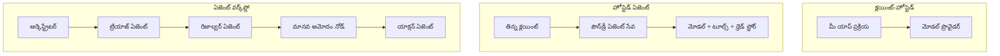
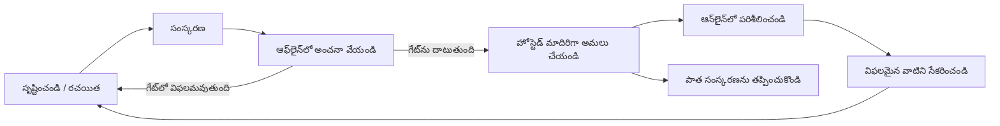
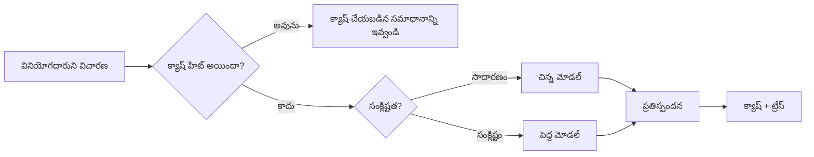
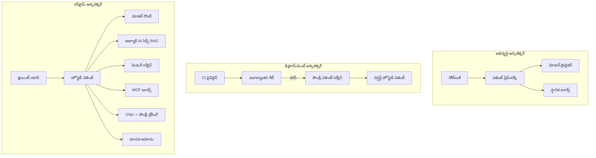

# Microsoft Foundryతో స్కేలబుల్ ఏజెంట్లను డిప్లాయ్ చేయడం


ఈ కోర్సులో ఇప్పటి వరకు మీరు మీ ల్యాప్‌టాప్‌లో, ఒక నోట్బుక్ లోపల, `az login` మరియు కొన్ని ఎన్విరన్‌మెంట్ వేరియబుల్స్ ద్వారా నడిచే ఏజెంట్లను నిర్మించారు. ఇది నేర్చుకునేందుకు చక్కటి మార్గమే. కానీ ఇది వేలాది కస్టమర్లు ఆధారపడే ఏజెంట్‌ను రాత్రి 3 గంటలకు నడిపించేందుకు సరైన మార్గం కాదు.

ఈ పాఠం "ఇది నా మెషిన్లో పనిచేస్తోంది" మరియు "ఇది ప్రొడక్షన్‌లో నమ్మకదాయకంగా మరియు తక్కువ ఖర్చుతో పనిచేస్తోంది" మధ్య లోని ఖాళీ గురించి. మేము **Microsoft Foundry** మరియు **Microsoft Foundry Agent Service** ఉపయోగించి ఆ ఖాళీని నింపుతాం, మరియు ఇది టూల్స్, రిట్రీవల్, మెమరీ, మదింపు మరియు మానిటరింగ్ కలిగిన నిజమైన కస్టమర్ సపోర్ట్ ఏజెంట్‌ను నిర్మించడం ద్వారా చేస్తాము.

## పరిచయం

ఈ పాఠం కవర్ చేసే అంశాలు:

- **ప్రోటోటైప్ ఏజెంట్** మరియు **డిప్లాయ్ చేసిన ఏజెంట్** మధ్య తేడా మరియు ఈ ట్రాన్సిషన్ ప్రధానంగా మోడల్ చుట్టూ ఉన్న అన్ని అంశాల గురించి ఎందుకు.
- ఏజెంట్ల **డిప్లాయ్‌మెంట్ ప్యాటర్న్స్**: క్లయింట్-హోస్టెడ్, సర్వీస్-హోస్టెడ్ (Hosted Agents), మరియు వర్క్ఫ్లో-ఆర్చెస్ట్రేటెడ్.
- Microsoft Foundry లో **ఏజెంట్ జీవనచక్రం**— క్రియేట్, వెర్షన్, డిప్లాయ్, మదింపు, పరిశీల్, రిటైర్.
- **స్కేలింగ్ వ్యూహాలు**: మోడల్ రౌటింగ్, క్యాషింగ్, కాంకరెన్సీ, మరియు స్టేట్‌లెస్ డిజైన్.
- OpenTelemetry మరియు Foundry ట్రేసింగ్ తో **పరిశీలనీయత**.
- మోడల్ ఎంపిక, రౌటింగ్, మరియు మదింపు గేట్ల ద్వారా **ఖర్చు ఆప్టిమైజేషన్**.
- **ఎంటర్ప్రైజ్ పరిగణనలు**: పాలన, మానవ ఆమోదం, మరియు ప్రొడక్షన్‌లో MCP సర్వర్లను సురక్షితంగా నడపడం.

## నేర్చుకోవాల్సిన లక్ష్యాలు

ఈ పాఠం పూర్తి చేసిన తర్వాత, మీరు ఎలా చేయాలో తెలుసుకుంటారు:

- నిర్దిష్ట ఏజెంట్ వర్క్లోడ్ కోసం సరైన డిప్లాయ్‌మెంట్ ప్యాటర్న్ ఎంపిక చేసుకోవడం.
- ఏజెంట్‌ను Microsoft Foundry Agent Service లో డిప్లాయ్ చేయడం, అందువల్ల అది వెర్షన్ చేయబడుతుంది, గవర్నెన్స్ కలిగి ఉంటుంది, మరియు పరిశీలించదగినది అవుతుంది.
- ట్రేసింగ్ కోసం ఏజెంట్‌ను ఇన్‌స్ట్రుమెంట్ చేయడం మరియు ప్రతి రిలీజ్‌కి ముందు నడిచే మదింపు పైప్‌లైన్‌ను వైర్ అప్ చేయడం.
- స్కేల్ వద్ద లేటెన్సీ మరియు ఖర్చు కంట్రోల్ లో ఉంచేందుకు మోడల్ రౌటింగ్ మరియు క్యాషింగ్‌ను వర్తింపజేయడం.
- హై-రిస్క్ చర్యల కోసం మానవ ఆమోద గేట్‌ను జోడించడం మరియు ప్రొడక్షన్ సురక్షిత మార్గంలో MCP సర్వర్‌ను ఇంటిగ్రేట్ చేయడం.

## ముందస్తు అర్హతలు

మీరు ఈ పాఠానికి ముందుగా ఉన్న పాఠాలను పూర్తి చేసి, సౌకర్యంగా ఉండాలి:

- [Microsoft Agent Framework](../14-microsoft-agent-framework/README.md) తో ఏజెంట్లను నిర్మించడం (పాఠం 14).
- [టూల్ వినియోగం](../04-tool-use/README.md) (పాఠం 4) మరియు [Agentic RAG](../05-agentic-rag/README.md) (పాఠం 5).
- [Agent Memory](../13-agent-memory/README.md) (పాఠం 13) మరియు [Agentic Protocols / MCP](../11-agentic-protocols/README.md) (పాఠం 11).
- [పరిశీలనీయత మరియు మదింపు](../10-ai-agents-production/README.md) (పాఠం 10) — ఈ పాఠం ప్రత్యక్షంగా దాని పై ఆధారపడింది.

మీరు కూడా అవసరం:

- ఒక **Azure సబ్‌స్క్రిప్షన్** మరియు కనీసం ఒక డిప్లాయ్డ్ చాట్ మోడల్ ఉన్న **Microsoft Foundry ప్రాజెక్ట్**.
- **Azure CLI** సంతృప్తిగా (`az login`).
- Python 3.12+ మరియు రిపోజిటరీలో ఉన్న ప్యాకేజీలు [`requirements.txt`](../../../requirements.txt).

## ప్రోటోటైప్ నుండి ప్రొడక్షన్ వరకు: నిజంగా ఏమి మారుతుందో

ప్రోటోటైప్ ఏజెంట్ మరియు ప్రొడక్షన్ ఏజెంట్ ఒకే కోర్ లూప్ ను పంచుకుంటాయి – కారణం, టూల్స్‌ను పిలవడం, స్పందించడం. మారేది ఆ లూప్ చుట్టూ ఉన్నంత మొత్తం. మోడల్ ప్రొడక్షన్ ఏజెంట్ యొక్క సుమారు 20% మాత్రమే; మిగిలిన 80% ఆపరేషనల్ కంకాలం.

| సంబంధం | ప్రోటోటైప్ | ప్రొడక్షన్ |
| --- | --- | --- |
| **హోస్టింగ్** | మీ నోట్బుక్ లో నడుస్తుంది | హోస్టెడ్ సర్వీస్‌గా నడుస్తుంది, వెర్షన్ చేయబడింది మరియు రోలౌట్ చేయబడింది |
| **గుర్తింపు** | మీ `az login` టోకెన్ | స్కోప్ చేసిన RBAC తో మేనేజ్డ్ గుర్తింపు |
| **స్థితి** | ఇన్-మెమరీ, రీస్టార్ట్‌కి మర్చిపోబడుతుంది | బాహ్యీకృతం (థ్రెడ్ స్టోర్, మెమరీ సర్వీస్) |
| **విఫలం** | మీరు ట్రేస్‌బ్యాక్‌ను చూస్తారు | రీట్రైలు, fallback లు, డెడ్-లెటర్, అలర్టులు |
| **ఖర్చు** | "కొన్ని సెంట్లు మాత్రమే" | ప్రతి అభ్యర్థన ఆధారంగా ట్రాక్ చేయబడుతుంది, రూట్ చేయబడుతుంది, క్యాష్ చేయబడుతుంది, బడ్జెట్ చేయబడుతుంది |
| **నాణ్యత** | మీరు అవుట్‌పుట్‌ను చూస్తారు | ప్రతి రిలీజ్‌కు ముందు ఆటోమేటిక్‌గా అంచనా వేయబడుతుంది |
| **నమ్మకం** | మీరు ప్రతి చర్యని ఆమోదిస్తారు | పాలసీ + రిస్కీ చర్యల కోసం మానవ-ఇన్-ది-లూప్ |

ఈ పట్టికను మతిల్లో ఉంచుకోండి. కింద ఉన్న ప్రతి సెక్షన్ ఈ వరుసలలో ఒకదానికీ సంబంధించినది.

## ఏజెంట్ డిప్లాయ్‌మెంట్ ప్యాటర్న్స్

మీరు మూడు ప్యాటర్న్లను ఉపయోగించబోతున్నారు, తరచుగా సంయుక్తంగా.

### 1. క్లయింట్-హోస్టెడ్ ఏజెంట్లు

ఏజెంట్ ఆబ్జెక్ట్ *మీ* అప్లికేషన్ ప్రాసెస్ లో ఉంటుంది. మీ కోడ్ మోడల్ ప్రొవైడర్‌ను ప్రత్యక్షంగా పిలుస్తుంది; రీజనింగ్ లూప్ మీ సర్వీస్ లో నడుస్తుంది. ఇదే గత పాఠాలు చేసినది.

- **పయోగించండి** మీరు లూప్ పై పూర్తి నియంత్రణ అవసరం ఉన్నప్పుడు, కస్టమ్ మిడిల్వేర్ కావాలి లేదా ఏజెంట్‌ను ఉన్న బ్యాక్‌ఎండ్‌లో చేర్చినపుడు.
- **ట్రేడ్-ఆఫ్**: స్కేలింగ్, స్థితి, మరియు రిజిలియన్స్‌ను మీరు స్వయంగా నిర్వహించాలి.

### 2. హోస్టెడ్ ఏజెంట్లు (Foundry Agent Service)

ఏజెంట్ Microsoft Foundry లో ఒక *రిసోర్స్‌గా నమోదు చేయబడుతుంది*. Foundry రీజనింగ్ లూప్‌ను హోస్ట్ చేస్తుంది, థ్రెడ్‌లను నిల్వ చేస్తుంది, కంటెంట్ సేఫ్టీ మరియు RBAC అమలు చేస్తుంది, మరియు ఏజెంట్‌ను Foundry పోర్టల్ లో కనిపింపజేస్తుంది. మీ అప్లికేషన్ ఒక సన్నని క్లయింట్ అయిపోతుంది, థ్రెడ్‌లను సృష్టించి స్పందనలను చదువుతుంది.

- **పయోగించండి** మీరు ధృడత్వం, బిల్ట్-ఇన్ పరిశీలనీయత, పాలన మరియు తక్కువ ఆపరేషనల్ సర్ఫెస్ ఏరియా కావాలనుకున్నప్పుడు.
- **ట్రేడ్-ఆఫ్**: నిర్వహించిన రంటైమ్ కోసం తక్కువ స్థాయి నియంత్రణ.

### 3. ఏజెంట్ వర్క్ఫ్లో

బహుళ ఏజెంట్లు (మరియు టూల్స్) ఒక గ్యAPH‌గా సమ్మేళనం చేయబడ్డాయి స్పష్టమైన నియంత్రణ ప్రవాహం తో — వరుస దశలు, శాఖల విడివిడిగా, మానవ ఆమోద నోడ్లు మరియు నిల్వ చేయదగిన చెక్‌పాయింట్లు, అవి ఆపి తిరిగి మొదలుపెట్టగలవు. ఇది Microsoft Agent Framework **Workflows** సామర్థ్యం, డిప్లాయ్‌మెంట్ స్కేల్ లో వర్తింపజేస్తోంది.

- **పయోగించండి** ఒకే టాస్క్ పలుమార్లు ప్రత్యేక ఏజెంట్లలో విస్తరించినపుడు లేదా మధ్యలో అంగీకార దశ అవసరమైతే.
- **ట్రేడ్-ఆఫ్**: ఎక్కువ భాగాలు కదలడం; ఆర్చెస్ట్రేషన్ స్థాయి పరిశీలనీయత అవసరం.



## Microsoft Foundryలో ఏజెంట్ జీవనచక్రం

ఏజెంట్‌ను డిప్లాయ్ చేయడం ఒక సారి చేసే `push` కాదు. ఇది ఒక లూప్, మరియు ఇది సాఫ్ట్‌వేర్ రిలీజ్ చక్రం లాంటిది ఎందుకంటే అది అదే.



ప్రధాన ఆలోచన, [పాఠం 10](../10-ai-agents-production/README.md) నుండి తీసుకున్నది: **ఆఫ్లైన్ మదింపు ఒక గేట్, ఆపై ఆలోచన కాదు.** ఒక కొత్త ఏజెంట్ వెర్షన్ మీ మదింపు సరిహద్దులను తాకకపోతే షిప్ కాదు. ఆన్‌లైన్ పరిశీలన నిజ ప్రపంచ లోపాలను తిరిగి మీ ఆఫ్లైన్ టెస్ట్ సెట్ కి పంపిస్తుంది. అదే మొత్తం లూప్.

## స్కేలింగ్ వ్యూహాలు

ఏజెంట్ ను స్కేలు చేయడం స్టేట్‌లెస్ వెబ్ API ని స్కేలు చేయడం నుండి భిన్నం, ఎందుకంటే ప్రతి అభ్యర్థన బహుళ ఖరీదైన మodel్ మరియు టూల్ పిలుపులను తగిలిస్తుంది. ఆరు సాంకేతికాలు అధిక భాగం లోడ్‌ను తీసుకొంటాయి.

**స్టేట్‌లెస్ అభ్యర్థన హ్యాండ్లింగ్.** మీ ప్రాసెస్ మెమరీలో ప్రతి-వాడుకరి స్థితిని ఉంచవద్దు. సంభాషణ థ్రెడ్‌లను Foundry థ్రెడ్ స్టోర్ లేదా మెమరీ సర్వీస్ లో నిల్వ చేయండి తద్వారా ఏదైనా ఇన్స్టాన్స్ ఏ అభ్యర్థనను నిర్వహించగలదు. ఇది మీరు హరిజాంటల్ గా స్కేలు చేయడానికి అనుమతిస్తుంది — ఇన్స్టాన్సులు జోడించండి, స్టికీ సెషన్లు లేవు.

**మోడల్ రౌటింగ్.** ప్రతి అభ్యర్థనకు మీ అత్యంత సామర్ధ్యవంతమైన (మరియు ఖరీదైన) మోడల్ అవసరం లేదు. సులభమైన అభ్యర్థనలను — ఉద్దేశం వర్గీకరణ, చిన్న సత్యసంధాన సమాధానాలు — ఒక చిన్న, వేగవంతమైన మోడల్‌కు రూట్ చేయండి, మరియు పెద్ద మోడల్‌ను నిజమైన రీజనింగ్ కోసం భద్రపరచండి. Foundry యొక్క **మోడల్ రౌటర్** దీన్ని మీ కోసం చేయగలదు, లేదా మీరు స్వయంగా లైట్‌వెయిట్ క్లాసిఫైయర్ అమలు చేయవచ్చు. మీరు ల్యాబ్ లో DIY వెర్షన్ ను నిర్మించబోతున్నారు.

**స్పందన క్యాషింగ్.** చాలా మద్దతు ప్రశ్నలు సమానంగా ("నేను నా పాస్‌వర్డ్ ఎలా రీసెట్ చేయాలి?"). సాధారణ ప్రశ్నలకు సమాధానాలను క్యాష్ చేసి, మోడల్‌ను హిట్ చేయకుండా అందించండి. ఒక మోస్తరు క్యాష్ హిట్ రేట్ కూడా ఖర్చు మరియు లేటెన్సీని అర్థవంతంగా తగ్గిస్తుంది.

**కాంకరెన్సీ మరియు బ్యాక్‌ప్రెషర్.** మోడల్ ప్రొవైడర్స్‌కు రేట్‌లిమిట్లు ఉంటాయి. మీ కాంకరెన్సీని పరిమితం చేయండి, ఎక్స్‌పోనెన్షియల్ బ్యాక్‌ఆఫ్‌తో రీట్రైలు ఉపయోగించండి, మరియు సాఫిగా విఫలమవ్వాలి (ఒక క్యూయ్డ్ "మేమ్ దానిపై ఉన్నాం" స్పందన 500 కన్నా మెరుగు).



## ప్రొడక్షన్‌లో పరిశీలనీయత

మీరు చూడకుండా పనిని నడుపలేరు. పాఠం 10 లో వివరించబడ్డట్లు, Microsoft Agent Framework స్వభావానుగుణంగా **OpenTelemetry** ట్రేసులను విడుదల చేస్తుంది — ప్రతి మోడల్ పిలుపు, టూల్ ఆహ్వానం, మరియు ఆర్చెస్ట్రేషన్ దశ ఒక స్పాన్ అవుతుంది. ప్రొడక్షన్ లో మీరు ఆ స్పాన్స్‌ను Microsoft Foundry (లేదా ఏ OTel-సమర్ధిత బ్యాకెండ్)కు ఎగుమతి చేస్తారు కాబట్టి మీరు:

- ఒక్క కస్టమర్ ఫిర్యాదు యొక్క మొదటి నుండి చివరి ప్రతి మోడల్ మరియు టూల్ పిలుపు ట్రేస్ చేయగలరు.
- ప50/ప95 లేటెన్సీ మరియు ఖర్చు ప్రతి అభ్యర్థనపై సమయానుకూలంగా చూడగలరు.
- తప్పిద రేటు పెరుగుదలలు మరియు ఖర్చు అసాధారణతలపై యూజర్లు (లేదా ఆర్థిక జట్టు) దృష్టి పెట్టకముందే అలర్ట్ చేయగలరు.

```python
from agent_framework.observability import get_tracer

tracer = get_tracer()

with tracer.start_as_current_span("support_request") as span:
    span.set_attribute("customer.tier", "enterprise")
    span.set_attribute("routed.model", "gpt-4.1-mini")
    # ఈ స్పాన్‌ లో ఏజెంట్ అమలు స్వయంచాలకంగా ట్రేస్ చేయబడుతుంది
```

`customer.tier` మరియు `routed.model` వంటి లక్షణాలు మా గోడైన ట్రేసులను ప్రశ్నలుగా మార్చుతాయి ("ఎంటర్ప్రైజ్ కస్టమర్లు చిన్న మోడల్‌కు చాలా సార్లు రూట్ అవుతున్నారా?").

## ఖర్చు ఆప్టిమైజేషన్

ప్రొడక్షన్ ఏజెంట్లలో ఖర్చు టోకెన్ల ద్వారా ఆధిపత్యం చెలాయిస్తుంది. మూడు లేవర్లు, ప్రభావం క్రమంలో:

1. **మోడల్ సరైన పరిమాణాన్ని సెలెక్ట్ చేయండి.** మీ మదింపు గేటును అతిరోహించే ఒక చిన్న మోడల్ ఒక పెద్ద మోడల్ కంటే ఎల్లప్పుడూ తక్కువ ఖర్చుతో ఉండివుండే అవకాశం ఉంది. పెద్ద మోడల్ ఆపేక్షతో కాకుండా, చిన్న మోడల్ సరిపోతుందనే నిరూపణ కోసం మదింపు ఉపయోగించండి.
2. **జటిలత ఆధారంగా రూట్ చేయండి.** పై విధంగా — పెద్ద-మోడల్ రీజనింగ్‌ను అవసరమయ్యే అభ్యర్థనలకే పెద్ద మోడల్ ధరలు చెలాయించండి.
3. **అతి దృఢంగా క్యాష్ చేయండి.** మీరు చేయని మోడల్ పిలుపు అత్యంత చవకైనది.

మదింపు గేట్లు మరియు ఖర్చు నియంత్రణ రెండు దృక్పథాల నుండి చూసే ఒకే విధమైన సరళత: మదింపు మీకు *నాణ్యత పరిధి* చూపిస్తుంది, రూటింగ్ మరియు క్యాషింగ్ మీరు ఆ పరిధి యొక్క *ఖర్చు* కు సాధ్యమైనంత దగ్గరగా ఉండేలా ఉంచుతాయి.

## ఎంటర్ప్రైజ్ డిప్లాయ్‌మెంట్ పరిగణనలు

**పాలన.** హోస్టెడ్ ఏజెంట్లు Foundry యొక్క RBAC, కంటెంట్ సేఫ్టీ, మరియు ఆడిట్ లాగింగ్‌ను వంశానుగతంగా పొందుతాయి. ప్రతి ఏజెంట్‌కు తక్కువ_privilege కలిగిన మేనేజ్డ్ ఐడెంటిటీని ఇవ్వండి — నాలెడ్జ్ బేస్ కు రీడ్ఓన్లీ యాక్సెస్, టికెటింగ్ API కి స్కోప్డ్ యాక్సెస్, మరేదీ కాదు.

**మానవ-ఇన్-ది-లూప్.** కొన్ని చర్యలు పూర్తిగా ఆటోమేట్ చేయడం చాలా పరిణామాత్మకమైనవి — రిఫండ్ ఇవ్వడం, అకౌంట్ తొలగించడం, లీగల్ టీమ్ కి ఎస్కలేట్ చేయడం. Microsoft Agent Framework **ఆమోదం-ఆవశ్యకమైన** టూల్స్‌కు మద్దతు ఇస్తుంది: ఏజెంట్ చర్య ప్రతిపాదించి, అమలు ఆపి, మానవుడు ఆమోదిస్తాడు లేదా తిరస్కరిస్తాడు, తరువాత వర్క్ఫ్లో కొనసాగుతుంది. మీరు [పాఠం 6](../06-building-trustworthy-agents/README.md)లో ప్రిమిటివ్ చూశారు; ఇక్కడ మీరు అది డిప్లాయ్ చేస్తారు.

**MCP ప్రొడక్షన్‌లో.** [MCP](../11-agentic-protocols/README.md) మీ ఏజెంట్‌ను ఒక స్టాండర్డ్ ఇంటర్‌ఫేస్ ద్వారా బాహ్య టూల్స్‌ను వినియోగించేలా చేస్తుంది. ప్రొడక్షన్ లో, ప్రతి MCP సర్వర్‌ను నమ్మలేని సరిహద్దుగా పరిగణించండి: సర్వర్ వెర్షన్‌ను పిన్ చేయండి, స్కోప్ చేసిన ఐడెంటిటీతో నడపండి, అవుట్‌పుట్‌లను ధృవీకరించండి, మరియు దానికి రహస్యాలు ఎప్పుడు ముట్టోకండి. MCP సర్వర్ ఒక ఆధారపడి ఉంటుంది, మరియు ఆధారపడులు ప్యాచ్ చేయబడతాయి, ఆడిట్ చేయబడతాయి, మరియు రేట్-లిమిట్డ్ అవుతాయి.



ఆ మూడు చిత్రాలు — డెవలప్మెంట్, డిప్లాయ్‌మెంట్, రన్‌టైమ్ — ఒకే ఏజెంట్ జీవితం ముగ్గురు దశల్లో. తరువాతి ల్యాబ్ దీన్ని ఏర్పాటు చేస్తుంది.

## హ్యాండ్స్-ఆన్ ల్యాబ్: ప్రొడక్షన్-ఆరెక్కి కస్టమర్ సపోర్ట్ ఏజెంట్

[`code_samples/16-python-agent-framework.ipynb`](./code_samples/16-python-agent-framework.ipynb) తెరవండి మరియు అది ఎండ్-టు-ఎండ్ పని చేయండి. మీరు ఒక **Contoso కస్టమర్ సపోర్ట్ ఏజెంట్**ని సమకూర్చబోతున్నారు, అందులో ప్రతి ప్రొడక్షన్ విషయంలో కంట్రోల్ చేయబడింది:

1. **టూల్ పిలుపు** — ఆర్డర్ స్థితి లుకప్ మరియు సపోర్ట్ టికెట్లను తెరవడం.
2. **RAG** — నాలెడ్జ్ బేస్ నుండి పాలసీ ప్రశ్నలకు జవాబివ్వడం (Azure AI Search, ఒక ఇన్-మెమరీ fallback తో అందువల్ల నోట్బుక్ అన్వేషణ రిసోర్స్ లేకుండా నడుస్తుంది).
3. **మెమరీ** — సంభాషణ యొక్క పునరావృతాలలో కస్టమర్ ను గుర్తుపెట్టుకోవడం.
4. **మోడల్ రౌటింగ్** — ఒక కంప్లెక్సిటీ క్లాసిఫైయర్ ప్రతి అభ్యర్థనను చిన్న లేదా పెద్ద మోడల్‌కు రూట్ చేస్తుంది.
5. **స్పందన క్యాషింగ్** — పునరావృత ప్రశ్నలను క్యాష్ నుండి అందించడం.
6. **మానవ ఆమోదం** — ఒక మితిని మించిన రిఫండ్లు మానవ సంతకాన్ని కోసం ఆగిపోతాయి.
7. **మదింపు పైప్‌లైన్** — ఒక చిన్న ఆఫ్లైన్ టెస్ట్ సెట్టు ఏజెంట్‌ను స్కోర్ చేసి, ఒక రిలీజ్ గేట్ గా పనిచేస్తుంది.
8. **పరిశీలనీయత** — ప్రతి అభ్యర్థన చుట్టూ OpenTelemetry ట్రేసింగ్.

### వాక్‌త్రూ

నోట్బుక్ ప్రొడక్షన్ అంశం ప్రతి ఒక్కటి స్వయంకల్పిత, నడపగల సెక్షన్‌గా ఏర్పాటైంది. దాని హృదయం రౌటింగ్-ప్లస్-క్యాషింగ్ అభ్యర్థన హ్యాండ్లర్:

```python
async def handle_support_request(query: str, customer_id: str) -> str:
    # 1. మనం చేయగలిగినప్పుడు క్యాష్ నుండి సర్వ్ చేయండి.
    cached = response_cache.get(normalize(query))
    if cached:
        return cached

    # 2. ఖర్చును నియంత్రించడానికి సంక్లిష్టత ఆధారంగా మార్గదర్శకాలు.
    model = "gpt-4.1-mini" if is_simple(query) else "gpt-4.1"

    # 3. దర్శనీయత కోసం ఏజంట్‌ను ట్రేస్ స్పాన్‌లో నడపండి.
    with tracer.start_as_current_span("support_request") as span:
        span.set_attribute("routed.model", model)
        span.set_attribute("customer.id", customer_id)
        response = await support_agent.run(query, model=model)

    # 4. క్యాష్ చేసి తిరిగి ఇవ్వండి.
    response_cache.set(normalize(query), response.text)
    return response.text
```

రిలీజ్‌ను రక్షించే మదింపు గేట్ ఇలా ఉంటుంది:

```python
async def evaluation_gate(agent, test_cases, threshold: float = 0.8) -> bool:
    passed = 0
    for case in test_cases:
        result = await agent.run(case["input"])
        if score_response(result.text, case["expected"]) >= 0.8:
            passed += 1
    pass_rate = passed / len(test_cases)
    print(f"Evaluation pass rate: {pass_rate:.0%} (gate: {threshold:.0%})")
    return pass_rate >= threshold  # గేట్ ఉత్తీర్ణమైతే మాత్రమే పరిమితి చేయండి
```

ప్రతి పంక్తిని చదవండి — నోట్బుక్ ప్రిమిటివ్స్ deliberately చిన్నదిగా ఉంచుతోంది కాబట్టి ఫ్రేమ్‌వర్క్ కాల్ వెనుక ఏదీ దాచబడలేదు.

## డిప్లాయ్ చేసిన ఏజెంట్‌ను స్మోక్ టెస్టులతో ధృవీకరించడం

పై మదింపు గేట్ మీ ఏజెంట్ ఆబ్జెక్ట్‌కు *ఆఫ్లైన్* గా నడుస్తుంది. ఏజెంట్‌ను Hosted Agent గా డిప్లాయ్ చేసిన వెంటనే, మీరు ఇంకా ఒక తక్కువ ఖర్చుతో కూడిన తనిఖీ కావాలి: **డిప్లాయిడ్ ఎండ్‌పాయింట్ నిజంగా స్పందిస్తున్నదా?**

“సక్సెస్‌గా” డిప్లాయ్ చేయడం కేవలం కంట్రోల్ ప్లేన్ నిర్వచనాన్ని అంగీకరించిందని మాత్రమే చూపుతుంది — ఇది ఏజెంట్ స్పందిస్తున్నాడని నిరూపించదు. ఒక కోల్పోయిన ఆధారపడింపు, చెత్త మోడల్ రూటింగ్, లేదా సమాప్తమైన కనెక్షన్ గ్రీన్ డిప్లాయ్‌మెంట్‌ను తాగుతాయి కానీ ప్రతిస్పందన ఇస్తుంది కాదు. ఒక **స్మోక్ టెస్ట్** ఆ దాన్ని కొన్ని సెకన్‌లలో దొరకిస్తుంది, ప్రతి డిప్లాయ్ పై, పూర్తి మదింపుని తప్పించి తక్కువ ఖర్చుతో.

ఈ రిపోజిటరీ ఒక రెడీ-టు-యూజ్ స్మోక్-టెస్ట్ పైప్‌లైన్‌ను [AI Smoke Test](https://github.com/marketplace/actions/ai-smoke-test) GitHub యాక్షన్ పై బిల్ట్ చేసి షిప్ చేస్తుంది:

- **కాటలాగ్** — [`tests/lesson-16-smoke-tests.json`](../../../tests/lesson-16-smoke-tests.json) Contoso సపోర్ట్ ఏజెంట్ కోసం ప్రాంప్ట్స్ మరియు అసర్షన్లను కలిగి ఉంటుంది (గ్రౌండెడ్ పాలసీ సమాధానాలు, ఆర్డర్ లుకప్, ఆనుకూల టాపిక్ మీద ఉండటం, మరియు బహుళ సంభాషణ థ్రెడ్ సతతత్వం). ఇతర పాఠాల ఏజెంట్లకు కాటలాగ్లు దాని పక్కనే ఉంటాయి — చూసుకోండి [`tests/README.md`](../tests/README.md).
- **వర్క్ఫ్లో** — [`.github/workflows/smoke-test.yml`](../../../.github/workflows/smoke-test.yml) Azure OIDC తో లాగిన్ అవుతుంది మరియు ప్రతి ప్రాంప్ట్‌ను ఏజెంట్ యొక్క Responses ఎండ్‌పాయింట్‌కు POST చేస్తుంది, ఏ అసర్షన్ మిస్ అయినా జాబ్.Fail చేస్తుంది.

```yaml
- name: Smoke-test hosted agent
  uses: JFolberth/ai-smoketest@v1
  with:
    project_endpoint: ${{ inputs.project_endpoint }}
    agent_name: ContosoSupportAgent
    tests_file: tests/lesson-16-smoke-tests.json
```


మీరు మీ ఏజెంట్‌ను డిప్లాయ్ చేసిన తర్వాత, దాన్ని **Actions** టాబ్ నుండి నడపండి, మీ Foundry ప్రాజెక్ట్ ఎండ్‌పాయింట్ మరియు ఏజెంట్ పేరును అందిస్తూ. ఫెడరేటెడ్ ఐడెంటిటీకి Foundry ప్రాజెక్ట్ స్కోప్ వద్ద **Azure AI User** పాత్ర అవసరం. లేయర్లు పిరమిడ్ లాగా అనుకోండి: స్మోక్ టెస్టులు (పहुँచుకోగలదా మరియు ప్రతిస్పందిస్తున్నదా?) ప్రతి డిప్లాయ్‌పై నడుస్తాయి, ఆఫ్‌లైన్ మదింపు (ప్రయాణించడానికి సరిపోతుందా?) ప్రమోషన్‌ ముందు నడుస్తుంది, మరియు ఆన్‌లైన్ మదింపు (అది అరణ్యంలో ఎలా ఉంది?) నిరంతరం జరుగుతుంది.

## అవగాహన తనిఖీ

అసైన్మెంట్‌కి వెళ్లే ముందు మీ అర్థాన్ని పరీక్షించండి.

**1. సుమారు ఉత్పత్తి ఏజెంట్లో "మోడల్" ఎంత భాగం మరియు మిగతావి ఏమిటి?**

<details>
<summary>సమాధానం</summary>

మోడల్ సిస్టమ్‌లో ఒక చిన్న భాగం — సాధారణంగా సుమారు 20% అని చెప్పబడుతుంది. మిగతావి ఆపరేషనల్ స్కేలెటాన్: హోస్టింగ్ మరియు వెర్షనింగ్, ఐడెంటిటీ మరియు RBAC, బాహ్య స్థితి, వైఫల్య నిర్వహణ, ఖర్చుల ట్రాకింగ్, మదింపు, మరియు హ్యూమన్-ఇన్-ది-లూప్ నియంత్రణలు. ఉత్పత్తికి మారడం అన్నది reasoning loop చుట్టూ ప్రతిదేనినీ నిర్మించడం గురించి ఎక్కువగా ఉంటుంది.
</details>

**2. మీరు ఎప్పుడు Hosted Agent ను క్లయింట్-హోస్టెడ్ ఏజెంట్ కంటే ఎంచుకుంటారు?**

<details>
<summary>సమాధానం</summary>

మీరు మేనేజ్ చేయబడిన రన్‌టైమ్ కోరినప్పుడు, అంతరంలో నిలవగల (పునరారంభించగల) థ్రెడ్స్, పరిశీలన, కంటెంట్ సేఫ్టీ, RBAC కలిగి ఉండాలి, మరియు reasoning loop యొక్క తక్కువ స్థాయి నియంత్రణను స్వీకరించడానికి మీరు సిద్ధంగా ఉంటే Hosted Agent మంచిది. క్లయింట్-హోస్టెడ్ పాలన గల పూర్తి నియంత్రణ అవసరం లేదా ఏజెంట్‌ని ఇప్పటికే ఉన్న బ్యాక్‌ఎండ్‌లో ఎంబెడ్ చేయడం అవసరమైతే అది తగినది.
</details>

**3. స్కేలబుల్ ఏజెంట్ ఎందుకు స్వంత ప్రాసెస్ మెమరీలో స్టేట్‌లెస్‌గా ఉండాలి?**

<details>
<summary>సమాధానం</summary>

ఏదైనా ఉదాహరణ ఏదైనా అభ్యర్థనను నిర్వహించగలగాలి, ఇది హారిజాంటల్ స్కేలింగ్‌ను స్టికీ సెషన్ల లేకుండా అనుమతిస్తుంది. వినియోగదారు సంభాషణ స్థితి థ్రెడ్ స్టోర్ లేదా మెమరీ సర్వీస్‌లో బాహ్యంగా ఉంటుంది. ప్రాసెస్ మెమరీలో స్థితి ఉంటే, రీస్టార్ట్ పై అది పోతుంది మరియు లోడ్‌ను స్వేచ్ఛగా పంపిణీ చేయలేరు.
</details>

**4. మోడల్ రూటింగ్ ఏ సమస్యను పరిష్కరిస్తుంది మరియు అది మదింపుతో ఎలా సంబంధించింది?**

<details>
<summary>సమాధానం</summary>

రూటింగ్ సాదా అభ్యర్థనలను చిన్న, చవకైన, వేగవంతమైన మోడల్‌కు పంపిస్తుంది మరియు పెద్ద మోడల్‌ను నిజమైన reasoning కోసం సేవ్ చేస్తుంది, లేటెన్సీ మరియు ఖర్చును నియంత్రిస్తూ. ఇది మదింపుతో సంబంధించింది ఎందుకంటే మదింపు చిన్న మోడల్ ఒక అభ్యర్థన తరగతికి సరిపోతుందని ధ్రువీకరించే ప్రక్రియ అంటుంది — మదింపు లేకుండా రూటింగ్ ఒక ఊహింపు మాత్రమే.
</details>

**5. "ఎవాల్యుయేషన్ גייט్" అంటే ఏమిటి మరియు అది జీవచక్రంలో ఎక్కడ ఉంటుంది?**

<details>
<summary>సమాధానం</summary>

ఒక ఎవాల్యుయేషన్ గేట్ కొత్త ఏజెంట్ వెర్షన్‌పై ఆఫ్‌లైన్ టెస్ట్ సెట్ నడుపుతుంది మరియు పాస్ రేట్ ఒక దానిని దాటకుండా ఉంటే డిప్లాయ్‌మెంట్‌ను నిరోధిస్తుంది. ఇది జీవచక్రంలో "వెర్షన్" మరియు "డిప్లాయ్" మధ్య ఉంటుంది, విడుదలకు నాణ్యత ఒక ముందు షరతు అవుతుంది కాబట్టి షిప్పింగ్ తర్వాత తనిఖీ చేయాల్సిన విషయం కాదు.
</details>

**6. ఉత్పత్తిలో MCP సర్వర్‌ను ఎందుకు అటువంటి అనిర్వాచిత సరిహద్దుగా పరిగణించాలి?**

<details>
<summary>సమాధానం</summary>

ఎందుకంటే అది మీ ఏజెంట్ కాల్ చేసే బాహ్య ఆధారపడుదలకు. మీరు దాని వెర్షన్‌ను పిన్ చేయాలి, స్కోప్ చేసిన ఐడెంటిటీతో నడిపించాలి, దాని అవుట్‌పుట్లను ధ్రువీకరించాలి, రేట్-లిమిట్ చేయాలి, మరియు దానికి రహస్యాలను ఎప్పుడూ అందించకూడదు — మీరు ఏదైనా మూడవ పార్టీ ఆధారపడుదలకి అందించే క్రమశిక్షణ. దాని అవుట్‌పుట్లు మీ ఏజెంట్ reasoning‌కి ప్రవహిస్తాయి కాబట్టి నిర్ధారించని నమ్మకం భద్రతా రిస్క్.
</details>

**7. ఏ ఒక్క మార్పు సాధారణంగా ఉత్పత్తి ఏజెంట్ ఖర్చుపై పెద్ద ప్రభావం చూపుతుంది, ఎందుకు?**

<details>
<summary>సమాధానం</summary>

సరైన పరిమాణం కలిగిన మోడల్ ఎంచుకోవడం — మీ ఎవాల్యుయేషన్ గేట్‌ను ఇంకా దాటగల చిన్న మోడల్ ఉపయోగించడం. ఖర్చు టోకెన్ల ద్వారా ఆధిపత్యం పొందుతుంది, మరియు నాణ్యత ప్రమాణం కలిగిన చిన్న మోడల్ పెద్ద మోడల్ కంటే సాధారణంగా తక్కువ ఖరీదైనది. క్యాషింగ్ మరియు రూటింగ్ తర్వాత ఖర్చు ఇంకా తగ్గుతుంది, కానీ సరైన మూల మోడల్ ఎంచుకోవడమే పెద్ద మొదటి క్రమ ప్రభావం.
</details>

**8. `customer.tier` మరియు `routed.model` వంటి స్పాన్ లక్షణాలు పరిశీలనలో ఏ పాత్ర ఇస్తాయి?**

<details>
<summary>సమాధానం</summary>

అవి రాటి ట్రేస్‌లను సమాధాన ఆమోదయోగ్య వ్యాపార ప్రశ్నలుగా మార్చుతాయి. లక్షణాలు లేకుండా మీరు ఒక గోడ వంటి స్పాన్లను కలిగి ఉంటారు; వాటితో మీరు "ఎంటర్‌ప్రైజ్ కస్టమర్లు చిన్న మోడల్‌కు ఎక్కువగా రూట్ అవుతున్నారా?" లేదా "ఏ మోడల్ మా 가장 నెమ్మదైన అభ్యర్థనలను నిర్వహిస్తుంది?" అని అడగవచ్చు. లక్షణాలు మీ ఆపరేషన్‌కు ముఖ్యమైన పరిమాణాలపై టెలిమెట్రీని విభజించే మార్గం.
</details>

## అసైన్‌మెంట్

ల్యాబ్ నుండి కస్టమర్ సపోర్ట్ ఏజెంట్ తీసుకుని ఒక నిర్దిష్ట పరిస్థితికోసం హార్డెన్ చేయండి: **ఒక SaaS కంపెనీకి సబ్‌స్క్రిప్షన్ బిల్లింగ్ సపోర్ట్ ఏజెంట్.**

మీ సమర్పణ ఈ విధంగా ఉండాలి:

1. బిల్లింగ్-సంబంధిత టూల్స్‌తో **పరికరాలను మార్చండి**: `get_subscription_status`, `get_invoice`, మరియు `issue_credit` (₹50 కంటే ఎక్కువ క్రెడిట్స్ మానవ ఆమోదం అవసరం).
2. కంపెనీ యొక్క రిఫండ్ పాలసీ, బిల్లింగ్ సైకిల్, మరియు రద్దు పాలసీని కవర చేసే మూడు RAG డాక్యుమెంట్లను **జోడించండి**.
3. మానవ-ఆమోద మార్గాన్ని తరుగవలసిన కనీసం రెండు కేసులు సహా కనీసం ఎటువంటి ఎనిమిది కేసుల వరకు **ఎవాల్యుయేషన్ సెట్‌ను పొడిగించండి** మరియు మీ evaluation gate సరిగా పాస్ లేదా ఫెయిల్ అవుతోందని నిర్ధారించండి.
4. **ఒక ఖర్చు నివేదిక జోడించండి**: ఏజెంట్ ద్వారా పది మిశ్రమ ప్రశ్నలను నడిపించిన తర్వాత, ఎంతటి ప్రశ్నలు చిన్న మోడల్‌కు వెళ్లాయో, ఎంతటి ప్రశ్నలు పెద్ద మోడల్‌కు వెళ్లాయో, మరియు ఎంతటి ప్రశ్నలు క్యాష్ నుండి సేవ్ అయ్యాయో ముద్రించండి.

ఏ మోడల్-రూటింగ్ నియమం ఎంచుకున్నారో, మరియు నిజమైన ట్రాఫిక్‌తో మీరు దాన్ని ఎలా ధృవీకరించగలరో ఒక చిన్న ప్యారాగ్రాఫ్ (మార్క్‌డౌన్ సెల్‌లో) రాయండి. ఏకైక సరైన సమాధానం లేదు — ఉత్పత్తి సంబంధిత విషయాలు సరిగా అనుసంధానమై ఉన్నాయా అన్నదిని మీరు అంచనా వేయబడుతున్నారు.

## సంగ్రహం

ఈ పాఠంలో మీరు Microsoft Foundryతో ఏజెంట్‌ను ప్రోటోటైప్ నుండి ఉత్పత్తికి మార్చారు:

- ఉత్పత్తికి మార్పు ప్రధానంగా మోడల్ చుట్టూ **ఆపరేషనల్ స్కేలెటాన్** గురించి — హోస్టింగ్, ఐడెంటిటీ, స్థితి, వైఫల్య నిర్వహణ, ఖర్చు, నాణ్యత, మరియు నమ్మకం.
- మీరు మూడు **డిప్లాయ్‌మెంట్ నమూనాలు** నేర్చుకున్నారు — క్లయింట్-హోస్టెడ్, Hosted Agents, మరియు Agent Workflows — మరియు వాటి ఉపయోగసమయాలు.
- మీరు **ఏజెంట్ జీవచక్రం** నడిచారు, అక్కడ ఆఫ్‌లైన్ **ఎవాల్యుయేషన్ విడుదల గేట్‌గా** పనిచేస్తుంది మరియు ఆన్‌లైన్ పరిశీలన వైఫల్యాలను టెస్ట్ సెట్‌కి తిరిగి పంపిస్తుంది.
- మీరు **స్కేలింగ్ వ్యూహాలు** ప్రయోగించారు — స్టేట్‌లెస్ డిజైన్, మోడల్ రూటింగ్, క్యాషింగ్, మరియు పరిమిత స్థాయి సమాంతర్యం — మరియు వాటిని **ఖర్చు ఆప్టిమైజేషన్**తో కలిపారు.
- మీరు **ఎంటర్‌ప్రైజ్ నియంత్రణలు** అమర్చారు: RBAC, హ్యూమన్-ఇన్-ది-లూప్ ఆమోదం, మరియు ఉత్పత్తి-సురక్షిత MCP సమర్పణ.
- మీరు ఒక **ఉత్పత్తికి సిద్దమైన కస్టమర్ సపోర్ట్ ఏజెంట్** తయారు చేశారు, ఇది అన్ని ఇబ్బందులను సంయుక్తంగా runnable కోడులో కల్పిస్తుంది.

తదుపరి పాఠం విరుద్ధ ప్రయాణాన్ని తీసుకుంటుంది: క్లౌడ్‌లో ఏజెంట్లను పెంచేందుకు బదులు, మీరు వాటిని ఒకే డెవలపర్ మెషీన్‌పైకి తెచ్చి పూర్తిగా లోకల్‌గా నడుపుతారు.

## అదనపు వనరులు

- <a href="https://learn.microsoft.com/azure/ai-foundry/what-is-azure-ai-foundry" target="_blank">Microsoft Foundry డాక్యుమెంటేషన్</a>
- <a href="https://learn.microsoft.com/azure/ai-foundry/agents/overview" target="_blank">Microsoft Foundry ఏజెంట్ సర్వీస్ అవలోకనం</a>
- <a href="https://aka.ms/ai-agents-beginners/agent-framework" target="_blank">Microsoft Agent Framework</a>
- <a href="https://learn.microsoft.com/azure/ai-foundry/concepts/model-router" target="_blank">Microsoft Foundryలో మోడల్ రౌటర్</a>
- <a href="https://learn.microsoft.com/azure/search/search-what-is-azure-search" target="_blank">Azure AI Search</a>
- <a href="https://opentelemetry.io/" target="_blank">OpenTelemetry</a>
- <a href="https://github.com/marketplace/actions/ai-smoke-test" target="_blank">AI స్మోక్ టెస్ట్ GitHub యాక్షన్</a>
- <a href="https://modelcontextprotocol.io/" target="_blank">Model Context Protocol (MCP)</a>

## గత పాఠం

[కంప్యూటర్ యూజ్ ఏజెంట్ల నిర్మాణం (CUA)](../15-browser-use/README.md)

## తదుపరి పాఠం

[లోకల్ AI ఏజెంట్లు సృష్టించడం](../17-creating-local-ai-agents/README.md)

---

<!-- CO-OP TRANSLATOR DISCLAIMER START -->
**అస్వీకరణ**:
ఈ పత్రం AI అనువాద సేవ [Co-op Translator](https://github.com/Azure/co-op-translator) ఉపయోగించి అనువదించబడింది. మేము ఖచ్చితత్వానికి ప్రయత్నిస్తున్నప్పటికీ, ఆటోమేటెడ్ అనువాదాలు తప్పులు లేదా అసమగ్రతలను కలిగి ఉండవచ్చు. దాని స్వదేశ భాషలో ఉన్న అసలు పత్రాన్ని అధికారం కలిగిన మూలంగా పరిగణించాలి. కీలకమైన సమాచారం కోసం, ప్రొఫెషనల్ మానవ అనువాదాన్ని సిఫారసు చేస్తాము. ఈ అనువాదం ఉపయోగం వల్ల కలిగే ఏవైనా అపార్థాలు లేదా తప్పుదారులు కోసం మేము బాధ్యత వహించము.
<!-- CO-OP TRANSLATOR DISCLAIMER END -->