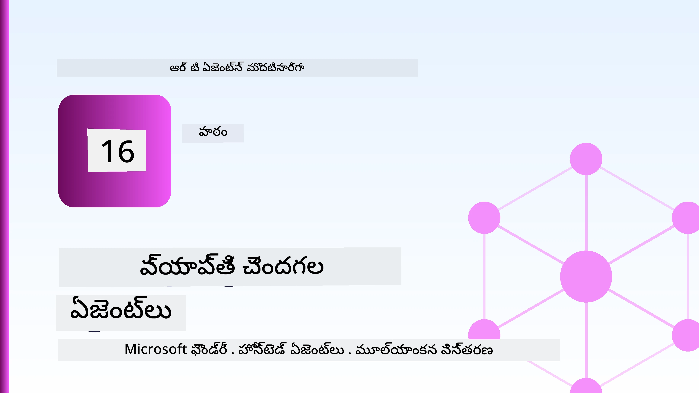
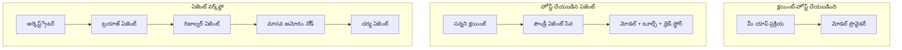
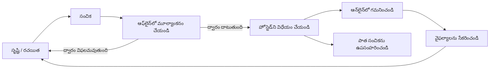
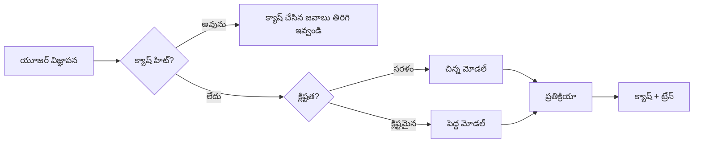
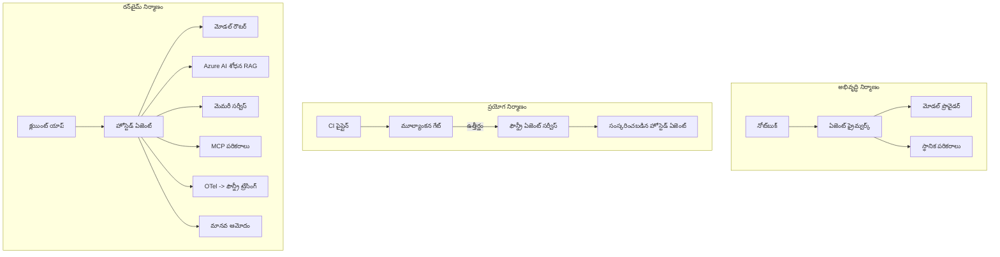

# మైక్రోసాఫ్ట్ ఫౌండ్రీతో స్కేలబుల్ ఏజెంట్లను పంపిణీ చేయడం



ఈ కోర్సు వరకూ మీరు మీ ల్యాప్‌టాప్‌లో, నోట్‌బుక్ లోపల, `az login` మరియు కొన్ని పర్యావరణ మార్పిడులు ఆధారంగా నడిచే ఏజెంట్లను నిర్మించారు. ఇది నేర్చుకునే సరైన పద్ధతి. వేలాది కస్టమర్లు వున్న ఏజెంట్ను రాత్రి 3 గంటల సమయంలో నడపడానికి ఇది సరైన పద్ధతి కాదు.

ఈ పాఠం "ఇది నా యంత్రం లో పనిచేస్తుంది" మరియు "ప్రొడక్షన్‌లో విశ్వసనీయంగా మరియు ఆర్ధికంగా పనిచేస్తుంది" మధ్య ఉన్న పర్పోపాన్ని గురించి. మేము ఈ పర్పోపాన్ని **Microsoft Foundry** మరియు **Microsoft Foundry Agent Service** ఉపయోగించి మూసివేస్తాము, మరియు మేము సాధనాలు, రిట్రీవల్, మెమరీ, మూల్యాంకనం మరియు మానిటరింగ్ కలిగిన నిజమైన కస్టమర్ సపోర్ట్ ఏజెంట్‌ని నిర్మించడం ద్వారా చేస్తాము.

## పరిచయం

ఈ పాఠం కింది వాటిని చరించును:

- ఒక **ప్రోటోటైప్ ఏజెంట్** మరియు ఒక **పంపిణీ చేసిన ఏజెంట్** మధ్య తేడా, మరియు మార్పు ప్రధానంగా మోడల్ చుట్టూ ఉన్న ప్రతి విషయంలోనే జరుగుతుంది.
- ఏజెంట్ల కోసం **పంపిణీ నమూనాలు**: క్లయింట్-హోస్టెడ్, సర్వీస్-హోస్టెడ్ (హోస్టెడ్ ఏజెంట్లు), మరియు వర్క్‌ఫ్లో-ఆర్కెస్ట్‌రేట్ చేయబడినవి.
- మైక్రోసాఫ్ట్ ఫౌండ్రీలో **ఏజెంట్ జీవన చక్రం** — సృష్టించు, వెర్షన్ చేయి, పంపిణీ చేయి, మూల్యాంకనం చేయి, పరిశీలించు, విశ్రాంతి తీసుకో.
- **స్కేలింగ్ వ్యూహాలు**: మోడల్ రౌటింగ్, కాషింగ్, సమకాలీకరణ, మరియు స్టేట్లెస్ రూపకల్పన.
- OpenTelemetry మరియు Foundry ట్రేసింగ్ ద్వారా **పరిశీలనీయత**.
- మోడల్ ఎంపిక, రౌటింగ్, మరియు మూల్యాంకనా గేట్ల ద్వారా **ఖర్చు ఆప్టిమైజేషన్**.
- **ఎంటర్‌ప్రైజ్ పరిగణనలు**: పాలన, మానవ ఆమోదం, మరియు MCP సర్వర్లను ప్రొడక్షన్లో సురక్షితంగా నడుపుట.

## నేర్చుకోవడం లక్ష్యాలు

ఈ పాఠం పూర్తయిన తరువాత, మీరు తెలుసుకుంటారు:

- ఒక నిర్దిష్ట ఏజెంట్ పని భారానికి సరైన పంపిణీ నమూనాను ఎంచుకోవడం.
- ఏజెంట్ను Microsoft Foundry Agent Serviceకి పంపిణీ చేయడం, తద్వారా అది వెర్షన్ చేయబడి, పాలించబడుతూ, మరియు పరిశీలించదగినది అవుతుందని.
- ట్రేసింగ్ కోసం ఏజెంట్‌ను ఇన్‌స్ట్రుమెంటు చేయడం మరియు ప్రతి విడుదలకు ముందే నడిచే మూల్యాంకనా పైప్లైన్‌ను వైర్ చేయడం.
- స్కేলে ఆలస్యం మరియు ఖర్చును నియంత్రించేందుకు మోడల్ రౌటింగ్ మరియు కాషింగ్ వర్తించటం.
- ఉన్నత-రిస్క్ చర్యలకు మానవ ఆమోద గేట్ను జోడించడం మరియు MCP సర్వర్‌ను ప్రొడక్షన్-సురక్షిత విధానంలో ఇంటిగ్రేట్ చేయడం.

## ప్రాథమిక అవసరాలు

ఈ పాఠం మీరు ముందుగా పాఠాలు పూర్తిచేసి ఈ క్రింది అంశాల్లో సౌకర్యవంతంగా ఉన్నారు అనుకుంటుంది:

- [Microsoft Agent Framework](../14-microsoft-agent-framework/README.md) తో ఏజెంట్లు నిర్మించడం (పాఠం 14).
- [సాధన ఉపయోగం](../04-tool-use/README.md) (పాఠం 4) మరియు [Agentic RAG](../05-agentic-rag/README.md) (పాఠం 5).
- [ఏజెంట్ మెమరీ](../13-agent-memory/README.md) (పాఠం 13) మరియు [Agentic Protocols / MCP](../11-agentic-protocols/README.md) (పాఠం 11).
- [పరిశీలనీయత మరియు మూల్యాంకనం](../10-ai-agents-production/README.md) (పాఠం 10) — ఇది ప్రత్యక్షంగా దీని పైన నిర్మించింది.

మీకు కింది వాటూ అవసరం:

- ఒక **Azure సబ్‌స్క్రిప్షన్** మరియు కనీసం ఒక మ్యాన్ చేయబడిన చాట్ మోడల్ ఉన్న **Microsoft Foundry ప్రాజెక్ట్**.
- **Azure CLI** ఆథెంటికేటెడ్ (`az login`).
- Python 3.12+ మరియు రిపాజిటరీలోని ప్యాకేజీలు [`requirements.txt`](../../../requirements.txt).

## ప్రోటోటైప్ నుండి ప్రొడక్షన్ వరకు: నిజంగా ఏం మారుతుంది

ఒక ప్రోటోటైప్ ఏజెంట్ మరియు ప్రొడక్షన్ ఏజెంట్ ఒకే కోర్ లూప్‌ను పంచుకుంటాయి — తర్కం, సాధనాలను పిలవడం, ప్రతిస్పందించడం. మారేది ఆ లూప్ చుట్టూ ఉండే అన్నీ. మోడల్ ప్రొడక్షన్ ఏజెంట్ యొక్క సుమారు 20% మాత్రమే; మిగతా 80% ఆపరేషనల్ కంకాలం.

| సమస్య | ప్రోటోటైప్ | ప్రొడక్షన్ |
| --- | --- | --- |
| **హోస్టింగ్** | మీరు నోట్‌బుక్‌లో నడిపిస్తారు | హోస్టెడ్ సర్వీస్ గా నడుస్తుంది, వెర్షన్ చేయబడింది మరియు విస్తరించబడింది |
| **గుర్తింపు** | మీ `az login` టోకెన్ | స్కోప్ చేసిన RBACతో నిర్వహించబడే గుర్తింపు |
| **స్థితి** | ఇన్-మెమరీ, రీస్టార్ట్ తర్వాత దొరుకదు | బాహ్యీకృతం (థ్రెడ్ స్టోర్, మెమరీ సర్వీస్) |
| **దొర్లిపోవడం** | మీరు ట్రేస్‌బ్యాక్ చూస్తారు | రీట్రైలు, ఫాల్బ్యాక్‌లు, డెడ్-లెటర్, అలెర్ట్లు |
| **ఖర్చు** | "కొన్ని సెంట్లు మాత్రమే" | ప్రతి అభ్యర్థనతో ట్రాక్ చేయబడింది, రూట్ చేయబడింది, కాష్ చేయబడింది, బడ్జెట్ చేయబడింది |
| **నాణ్యత** | మీరు అవుట్పుట్‌ను చూసి అంచనా వేస్తారు | ప్రతి విడుదలకు ముందు ఆటోమేటిక్ గా మూల్యాంకనం చేయబడుతుంది |
| **నమ్మకం** | మీరు ప్రతి చర్యను ఆమోదిస్తారు | పాలసీ + మానవ-ఇన్-ది-లూప్ హై-రిస్క్ చర్యలకుగాను |

ఈ పట్టిక మీ మదిలో పెట్టుకోండి. దిగువ ప్రతి విభాగం ఈ వరుసలలో ఒక దానికి సరిసమానంగా ఉంటుంది.

## ఏజెంట్ పంపిణీ నమూనాలు

మీరు మూడు నమూనాలు ఉపయోగిస్తారు, తరచుగా సమ్మేళనంగా.

### 1. క్లయింట్-హోస్టెడ్ ఏజెంట్లు

ఏజెంట్ ఆబ్జెక్ట్ *మీ* అనువర్తన ప్రాసెస్ లో ఉంటుంది. మీ కోడ్ నేరుగా మోడల్ ప్రొవైడర్ ను పిలుస్తుంది; తర్కమాటల లూప్ మీ సర్వీస్ లో నడుస్తుంది. ఇది ప్రతి మునుపటి పాఠం చేసిన విధానం.

- **ఇప్పుడే ఉపయోగించు** మీరు లూప్ పై పూర్తి నియంత్రణ, కస్టమ్ మిడిల్వేర్, లేదా ఉన్న బ్యాక్‌ఎండ్ లో ఏజెంట్‌ను బ్యాండ్ చేయాలనుకుంటున్నప్పుడు.
- **వ్యాపార హాని**: మీరు స్వయంగా స్కేలింగ్, స్థితి మరియు ప్రతిబంధకత నిర్వహించాలి.

### 2. హోస్టెడ్ ఏజెంట్లు (Foundry Agent Service)

ఏజెంట్ మైక్రోసాఫ్ట్ ఫౌండ్రీలో *వనరుగా నమోదు* అవుతుంది. ఫౌండ్రీ తర్కలూప్‌ను హోస్ట్ చేస్తుంది, థ్రెడ్‌లను నిల్వ చేస్తుంది, కంటెంట్ సేఫ్టీ మరియు RBACను అమలు చేస్తుంది, మరియు ఏజెంట్‌ను Foundry పోర్టల్ లో కనిపనీయజేస్తుంది. మీ యాప్ ధ్రుత క్లయింట్ అవుతుంది ఇది థ్రెడ్‌లను సృష్టించి ప్రతిస్పందనలు చదవుతుంది.

- **ఇప్పుడే ఉపయోగించు** మీరు ధృఢత్వం, బిల్ట్-ఇన్ పరిశీలనీయత, పాలన మరియు తక్కువ ఆపరేషనల్ ఉపరితలం కోరినప్పుడు.
- **వ్యాపార హాని**: నిర్వహిత రన్‌టైమ్ కోసం తక్కువ లొ-లెవెల్ నియంత్రణ.

### 3. ఏజెంట్ వర్క్‌ఫ్లోస్

బహుళ ఏజెంట్లు (మాత్రమే కాదు, సాధనాలు కూడా) స్పష్టమైన నియంత్రణ ప్రవాహంతో ఒక గ్రాఫ్ గా కూర్చబడి ఉంటాయి — వరుస దశలు, శాఖా దశలు, మానవ ఆమోదం నోడ్లు మరియు నిల్వ చెక్‌పాయింట్లు, ఇవి ఆపి తిరిగి మొదలుపెట్టగలవు. ఇది Microsoft Agent Framework **వర్క్‌ఫ్లోస్** సామర్థ్యం పంపిణీ స్కేల్లో వర్తింపజేయబడుతుంది.

- **ఇప్పుడే ఉపయోగించు** ఒక కార్యం అనేక ప్రత్యేక ఏజెంట్లు అవసరం లేదా మధ్యలో ఆమోద దశ అవసరమైనప్పుడు.
- **వ్యాపార హాని**: ఎక్కువ భాగాలు కదులుతాయి; ఆర్కెస్ట్రేషన్-స్తాయి పరిశీలనీయత అవసరం.



## Microsoft Foundryలో ఏజెంట్ జీవన చక్రం

ఏజెంట్‌ను పంపిణీ చేయడం ఒకసారి `పుష్` చేయడం కాదు. ఇది ఒక లూప్, ఇది సాఫ్ట్వేర్ విడుదల చక్రంలా ఉంటుంది ఎందుకంటే అది నిజంగా అదే.



ప్రధాన భావం, [పాఠం 10](../10-ai-agents-production/README.md) నుండి తీసుకున్నది: **ఆఫ్లైన్ మూల్యాంకనం ఒక గేటు, తరువాతికాని కాదు.** ఒక కొత్త ఏజెంట్ వెర్షన్ మీ మూల్యాంకన్ పరిమితులు తీరకుండా విడుదల కాదు. ఆన్‌లైన్ పరిశీలన నిజమైన విఫలతలను మీ ఆఫ్లైన్ టెస్ట్ సెట్ కు తిరిగి ఇస్తుంది. ఇదే మొత్తం లూప్.

## స్కేలింగ్ వ్యూహాలు

ఏజెంట్ని స్కేల్ చేయడం స్టేట్లెస్ వెబ్ API స్కేలింగ్‌కి తేడాగా ఉంటుంది, ఎందుకంటే ప్రతి అభ్యర్థన అనేక ఖరీదైన మోడల్ మరియు సాధన కాల్లు కలిగివుండవచ్చు. నాలుగు సాంకేతికతలు ప్రాముఖ్యత కుంచికగా మోస్తాయి.

**స్టేట్లెస్ అభ్యర్థన నిర్వహణ.** మీ ప్రాసెస్ మెమరీలో ప్రతి వినియోగదారుని స్థితిని ఉంచవద్దు. సంభాషణ థ్రెడ్‌లు Foundry థ్రెడ్ స్టోర్ లేదా మెమరీ సర్వీసులో నిల్వ ఉంచండి, కాబట్టి ఏ ఉదాహరణ అయినా ఏ అభ్యర్థనను χειρό చేసుకోవచ్చు. ఇది మీకు తిరుగుతూనే స్కేల్ చేయడానికి అవకాశం ఇస్తుంది — ఉదాహరణలు జోడించండి, స్టికీ సెషన్లు ఉండవు.

**మోడల్ రౌటింగ్.** ప్రతి అభ్యర్థనకు మీ అత్యంత సామర్థ్యవంతమైన (మరియు ఖరీదైన) మోడల్ అవసరమవ్వదు. సులభమైన అభ్యర్థనలు — ఉద్దేశపు వర్గీకరణ, చిన్న తాజా సమాధానాలు — చిన్న, వేగవంతమైన మోడల్‌కు రూట్ చేయండి, మరియు పెద్ద మోడల్‌ను నిజమైన తర్కానికి కమిట్ చేయండి. Foundry యొక్క **మోడల్ రౌటర్** దీనిని మీకోసం చేయగలదు, లేదా మీరు తేలికపాటి వర్గీకర్తను స్వయంగా తయారుచేసుకోవచ్చు. మీరు ప్రయోగశాలలో దానిన్నే తయారుచేస్తారు.

**ప్రతిస్పందన కాషింగ్.** చాలా సపోర్ట్ ప్రశ్నలు సమీప-డుప్లికేట్లు ("నేను నా పాస్వర్డ్‌ను ఎలా రీసెట్ చేసుకోవాలి?"). సాధారణ ప్రశ్నలకు సమాధానాలను కాష్ చేయండి మరియు మోడల్‌ను తాకకుండా వాటిని సేవ్ చేయండి. సాధారణ కాష్ హిట్ రేట్ కూడా ఖర్చు మరియు ఆలస్యం అనిపించే తగ్గింపును కలిగిస్తుంది.

**సమకాలీకరణ మరియు బ్యాక్ప్రెషర్.** మోడల్ ప్రొవైడర్స్ కు రేట్ పరిమితులు ఉంటాయి. మీ సమకాలీకరణను పరిమితం చేయండి, ఎక్స్‌പోనెన్షియల్ బ్యాకాఫ్‌తో రీట్రైలు ఉపయోగించండి, మరియు సాహజీవిగా విఫలమైపోండి (పోరుగు "మేము దీనిపై ఉన్నాము" ప్రతిస్పందన 500 కన్నా బెటర్).



## ప్రొడక్షన్ లో పరిశీలనీయత

మీరు చూడలేని నిబంధనల్ని నడుపలేరు. పాఠం 10లో చెప్పినట్లే, Microsoft Agent Framework **OpenTelemetry** ట్రేసులను స్వయంగా ఇస్తుంది — ప్రతి మోడల్ కాల్, సాధన ఆహ్వానం, ఆర్కెస్ట్‌రేషన్ దశ ఒక స్పాన్ అవుతుంది. ప్రొడక్షన్‌లో మీరు ఆ స్పాన్లను Microsoft Foundryకు (లేదా ఏ OTel-అనుకూల బ్యాక్‌ఎండ్‌కి) ఎగుమతి చేస్తారు కాబట్టి మీరు:

- ఒకే కస్టమర్ ఫిర్యాదు చివరకు ప్రతి మోడల్ మరియు సాధన కాల్ మొత్తాన్ని ట్రేస్ చేయండి.
- సమయం మీద p50/p95 ఆలస్యం మరియు ధర అభ్యర్థనలను పర్యవేక్షించండి.
- తప్పిద రేటు స్పైక్స్ మరియు ఖర్చు విపరీతతలను మిమ్మల్ని (లేదా మీ ఆర్ధిక బృందాన్ని) ముందుగానే హెచ్చరించండి.

```python
from agent_framework.observability import get_tracer

tracer = get_tracer()

with tracer.start_as_current_span("support_request") as span:
    span.set_attribute("customer.tier", "enterprise")
    span.set_attribute("routed.model", "gpt-5-nano")
    # ఏజెంట్ అమలు ఈ స్పాన్ లో స్వయంచాలకంగా ట్రేస్ చేయబడుతుంది
```

`customer.tier` మరియు `routed.model` వంటి లక్షణాలు ట్రేసుల గోడ‌ను జవాబులైన ప్రశ్న‌లుగా మార్చుతాయి ("ఎంటర్‌ప్రైజ్ కస్టమర్లు చిన్న మోడల్‌కు ఎక్కువగా రూట్ అవుతూనే ఉన్నారా?").

## ఖర్చు ఆప్టిమైజేషన్

ప్రొడక్షన్ ఏజెంట్లలో ఖర్చు టోకెన్స్ చేత ఆధిపత్యం ఉంటుంది. ప్రభావం క్రమంలో మూడు లేవర్లు:

1. **మోడల్‌ను సరైన పరిమాణంలో ఉంచండి.** మీ మూల్యాంకనా గేటును దాటి సరైన చిన్న మోడల్ పెద్ద మోడల్ కంటే సాధారణంగా చవకగా ఉంటుంది. మూల్యాంకనాన్ని ఉపయోగించి చిన్న మోడల్ సరిపోతుందని నిర్ధారించుకోండి, కల్పనకు పెద్ద మోడల్‌ను ఎంచేయండి కాదు.
2. **సంక్లిష్టత ఆధారంగా రూట్ చేయండి.** పైన చెప్పినట్లే — పెద్ద మోడల్ ధరలను చిన్నవారి కోసం మాత్రమే చెల్లించండి.
3. **కాష్‌ను ఆగ్రహంగా ఉపయోగించండి.** మీ చేసేది కాకుండా చేసిన మోడల్ కాల్ ఒకటే తక్కువ ఖర్చుతో ఉండిపోదు.

మూల్యాంకనా గేట్లు మరియు ఖర్చు నియంత్రణ రెండు కోణాల నుండి చూసిన ఒకే శ్రద్ధ: మూల్యాంకనం మీరు *నాణ్యత నేల* చెప్పుతుంది, రౌటింగ్ మరియు కాషింగ్ ఆ నేల *ఖర్చుకు* దగ్గరగా ఉంచుతాయి.

## ఎంటర్‌ప్రైజ్ పంపిణీ పరిగణనలు

**పాలన.** హోస్టెడ్ ఏజెంట్లు Foundry యొక్క RBAC, కంటెంట్ సేఫ్టీ, మరియు ఆడిట్ లాగింగ్‌ను పొందగలవు. ప్రతి ఏజెంట్‌కు తక్కువ నమ్మకం అవసరం ఉన్న నిర్వహించిన గుర్తింపు ఇవ్వండి — జ్ఞాన బేస్‌కు చదవడంమాత్రం అనుమతి, టికెట్టి APIకి స్కోప్ చేసిన అనుమతి, మరేదీ కాదు.

**మానవ-ఇన్-ది-లూప్.** కొన్ని చర్యలు పూర్తిగా ఆటోమేటిక్ చేయడానికి చాలా కీలకం — రీఫండ్ జారీ, ఖాతాను తొలగించడం, లీగల్ టీమ్‌కు ఎస్కలేట్ చేయడం. Microsoft Agent Framework **అమోదం అవసరమైన** సాధనాలను మద్దతు ఇస్తుంది: ఏజెంట్ చర్యని సూచిస్తుంది, అమలు ఆగిపోతుంది, మానవుడు ఆమోదిస్తాడు లేదా తిరస్కరిస్తాడు, మరియు వర్క్‌ఫ్లో మళ్లీ ప్రారంభిస్తుంది. మీరు [పాఠం 6](../06-building-trustworthy-agents/README.md)లో ప్రిమిటివ్ చూడగలిగారు; ఇక్కడ మీరు దాన్ని పంపిణీ చేస్తున్నారు.

**ప్రొడక్షన్‌లో MCP.** [MCP](../11-agentic-protocols/README.md) మీ ఏజెంట్‌కు బయటి సాధనాలను ఒక సాంకేతిక ఇంటర్‌ఫేస్ ద్వారా వినియోగించడానికి అనుమతిస్తుంది. ప్రొడక్షన్‌లో, ప్రతి MCP సర్వర్‌ను నమ్మకంలేని సరిహద్దుగా పరిగణించండి: సర్వర్ వెర్షన్‌ను పిన్ చేసి, స్కోప్ చేసిన గుర్తింపుతో నడిపించి, దాని అవుట్పుట్‌లను ధృవీకరించండి, మరియు దానికి రహస్యాలను ఎప్పుడూ మించవద్దు. MCP సర్వర్ ఒక ఆధారపడటం; ఆధారపడతారు ప్యాచ్‌లు, ఆడిట్‌లు, మరియు రేటు పరిమితులు పొందుతారు.



ఆ మూడు డాగ్రామ్‌లు — అభివృద్ధి, పంపిణీ, రన్‌టైమ్ — వాటి జీవితంలోని మూడు దశలలో ఒకే ఏజెంట్. ఈ క్రింది ల్యాబ్ దాని నిర్మాణంలో మీకు సహాయపడుతుంది.

## హ్యాండ్స్-ఆన్ ల్యాబ్: ప్రొడక్షన్-సిద్ధ కస్టమర్ సపోర్ట్ ఏజెంట్

[`code_samples/16-python-agent-framework.ipynb`](./code_samples/16-python-agent-framework.ipynb) తెరవండి మరియు దాన్నంతా పూర్తిచేసుకోండి. మీరు ప్రతి ప్రొడక్షన్ సమస్యను వైర్ చేసిన **Contoso కస్టమర్ సపోర్ట్ ఏజెంట్** ను కూడగడతారు:

1. **సాధన పిలుపు** — ఆర్డర్ స్థితిని చూసుకోవడం మరియు సపోర్ట్ టికెట్లను తెరవడం.
2. **RAG** — జ్ఞాన బేస్ (Azure AI Search, సహజంగా ఫాల్బ్యాక్‌తో వుంటుంది కాబట్టి నోట్‌బుక్ Search వనరుతో లేకుండా నడుస్తుంది) నుంచి పాలసీ ప్రశ్నలకు సమాధానం ఇవ్వడం.
3. **మెమరీ** — సంభాషణ మలుపులలో కస్టమర్ గుర్తుంచుకోవడం.
4. **మోడల్ రౌటింగ్** — సంక్లిష్టత వర్గీకరణ ఒక అభ్యర్థనను చిన్న లేదా పెద్ద మోడల్‌కు రూట్ చేస్తుంది.
5. **ప్రతిస్పందన కాషింగ్** — పునరావృత ప్రశ్నలను కాష్ నుండి అందచేస్తుంది.
6. **మానవ ఆమోదం** — ఒక నిర్దిష్ట ముప్పు మించిన రీఫండ్ల కోసం మానవ సంతకం ఆగిపోతుంది.
7. **మూల్యాంకనా పైప్లైన్** — ఒక చిన్న ఆఫ్లైన్ టెస్ట్ సెట్ ఏజెంట్‌ను స్కోరు చేసి విడుదల గేటుగా పనిచేస్తుంది.
8. **పరిశీలనీయత** — ప్రతి అభ్యర్థన చుట్టూ OpenTelemetry ట్రేసింగ్.

### నడక చూపు

నోట్‌బుక్ ఈ విధంగా ఏర్పాటుచేయబడింది ప్రతి ప్రొడక్షన్ సమస్య ఒక స్వతంత్రమైన, రన్నబుల్ సెక్షన్. దాని గుండె ప్రసారం-క్యాషింగ్ అభ్యర్థన నిర్వహకుడు:

```python
async def handle_support_request(query: str, customer_id: str) -> str:
    # 1. మేము చేయగలిగినప్పుడు క్యాషే నుండి సేవలు అందించండి.
    cached = response_cache.get(normalize(query))
    if cached:
        return cached

    # 2. ఖర్చును నియంత్రించడానికి సంక్లిష్టత ద్వారా మార్గం దారి చేయండి.
    model = "gpt-5-nano" if is_simple(query) else "gpt-5-mini"

    # 3. దృష్టిస్థితి కోసం ఏజెంట్‌ను ట్రేస్ స్పాన్ లో నడపండి.
    with tracer.start_as_current_span("support_request") as span:
        span.set_attribute("routed.model", model)
        span.set_attribute("customer.id", customer_id)
        response = await support_agent.run(query, model=model)

    # 4. క్యాష్ చేసి తిరిగి ఇవ్వండి.
    response_cache.set(normalize(query), response.text)
    return response.text
```

విడుదలను రక్షించే మూల్యాంకనా గేట్లు ఇంతటివి:

```python
async def evaluation_gate(agent, test_cases, threshold: float = 0.8) -> bool:
    passed = 0
    for case in test_cases:
        result = await agent.run(case["input"])
        if score_response(result.text, case["expected"]) >= 0.8:
            passed += 1
    pass_rate = passed / len(test_cases)
    print(f"Evaluation pass rate: {pass_rate:.0%} (gate: {threshold:.0%})")
    return pass_rate >= threshold  # గేట్ పాస్ అయితేనే డిప్లాయ్ చేయండి
```

ప్రతి పంక్తిని చదవండి — నోట్‌బుక్ ప్రిమిటివ్‌లను చురుకైనవిగా ఉంచుతుంది కాబట్టి ఫ్రేమ్‌వర్క్ కాల్ వెనుక ఏమి లేనట్టుగా ఉంటుంది.

## పంపిణీ చేసిన ఏజెంట్‌ను స్మోక టెస్ట్‌లతో ధృవీకరించడం

పైన పేర్కొన్న మూల్యాంకనా గేటు *ఆఫ్‌లైన్* మీ ఏజెంట్ ఆబ్జెక్ట్‌పై నడుస్తుంది. ఏజెంట్ Hosted Agentగా పంపిణీ అయిన తర్వాత, మీరు ఇంకో చొప్పున పరీక్ష అవసరం: **పంపిణీ ఎండ్పాయింట్ నిజంగా సమాధానం ఇస్తుందా?**

"విజయవంతంగా" పంపిణీ అంటే కంట్రోల్ ప్లేన్ నిర్వచనాన్ని అంగీకరించింది అంటే మాత్రమే — ఏజెంట్ స్పందిస్తుందన్నది నిరూపణ కాదు. ఒక లేని ఆధారపడటం, చెడ్డ మోడల్ రౌటింగ్, లేదా ముగిసిన కనెక్షన్ ఒక ఆకుపచ్చ పంపిణీని (డిప్లాయ్‌మెంట్‌ని) అందిస్తుంది, కానీ ప్రతిస్పందన ఇవ్వదు. ఒక **స్మోక టెస్ట్** అది కొన్ని సెకన్లలో, ప్రతి పంపిణీపై, పూర్తి మూల్యాంకనం ఖర్చు లేకుండానే పరిక్షిస్తుంది.

ఈ రిపాజిటరీ AI స్మోక్ టెస్ట్ GitHub చర్య ఆధారంగా సిద్ధంగా ఉన్న స్మోక్-టెస్ట్ పైప్లైన్‌ను పంపిస్తుంది:

- **కాటలాగ్** — [`tests/lesson-16-smoke-tests.json`](../../../tests/lesson-16-smoke-tests.json) లో Contoso సపోర్ట్ ఏజెంట్ కోసం ప్రాంప్ట్‌లు మరియు నిర్ధారణలు (స్థిరమైన పాలసీ సమాధానాలు, ఆర్డర్ లుక్ అప్, టాపిక్‌లో ఉండటం, మరియు బహుళ మలుపు థ్రెడ్ కంటిన్యువిటీ) ఉన్నాయి. ఇతర పాఠాల ఏజెంట్ల కోసం కాటలాగ్లు దాని పక్కన ఉంటాయి — చూడండి [`tests/README.md`](../tests/README.md).
- **వర్క్‌ఫ్లో** — [`.github/workflows/smoke-test.yml`](../../../.github/workflows/smoke-test.yml) Azure OIDC లో లాగిన్ై, ప్రతి ప్రాంప్ట్‌ను ఏజెంట్ యొక్క Responses ఎండ్పాయింట్ కు POST చేస్తుంది, ఎలాంటి నిర్ధారణ తప్పిపోయినా జాబ్ ఫెయిలజేస్తుంది.

```yaml
- name: Smoke-test hosted agent
  uses: JFolberth/ai-smoketest@v1
  with:
    project_endpoint: ${{ inputs.project_endpoint }}
    agent_name: ContosoSupportAgent
    tests_file: tests/lesson-16-smoke-tests.json
```


మీరు మీ ఏజెంట్‌ను మిగిల్చిన తర్వాత, Foundry ప్రాజెక్టు ఎండ్పాయింట్ మరియు ఏజెంట్ పేరు అందిస్తూ **Actions** ట్యాబ్ నుండి దీనిని నడపండి. ఫెడరేటెడ్ ఐడెంటిటీకి Foundry ప్రాజెక్టు పరిధిలో **Azure AI User** పాత్ర అవసరం. లేయర్లను ఒక పిరమిడ్‌లాగా ఆలోచించండి: స్మోక్ పరీక్షలు (చేరుకోవచ్చా మరియు స్పందిస్తోంది?) ప్రతి డిప్లాయ్ లో నడుస్తాయి, ఆఫ్లైన్ మూల్యాంకనం (పంపిణీకి సరిపోతుందా?) ప్రమోషన్‌కు ముందు నడుస్తుంది, మరియు ఆన్‌లైన్ మూల్యాంకనం (వాస్తవంలో ఇది ఎలా చేస్తోంది?) నిరంతరం నడుస్తుంది.

## పరిజ్ఞాన తనిఖీ

అసైన్మెంట్‌కు వెళ్లడానికి ముందు మీ అవగాహనను పరీక్షించండి.

**1. ఒక ఉత్పత్తి ఏజెంట్‌లో సుమారు ఎంత భాగం "మోడల్" మరియు మిగతా భాగం ఏమిటి?**

<details>
<summary>సమాధానం</summary>

మోడల్ సిస్టంలో చిన్న భాగమే — సాధారణంగా సుమారు 20%గా పేర్కొంటారు. మిగతాది కార్యకలాప ఎముక: హోస్టింగ్ మరియు వెర్షనింగ్, ఐడెంటిటీ మరియు RBAC, బాహ్య స్థాయి, వైఫల్య నిర్వహణ, ఖర్చు ట్రాకింగ్, మూల్యాంకనం, మరియు హ్యూమన్-ఇన్-ది-లూప్ నియంత్రణలు. ఉత్పత్తికి వెళ్లడం ఎక్కువగా ఆ రీజనింగ్ లూప్ చుట్టూ అన్నీ నిర్మించడమే.
</details>

**2. మీరు ఎప్పుడు కస్టమర్-హోస్టెడ్ ఏజెంట్ కంటే Hosted Agent ఎన్నుకుంటారు?**

<details>
<summary>సమాధానం</summary>

మీరు నిర్ధారించుకున్న అనువర్తనంతో మేనేజ్ చేయబడే రన్‌టైమ్ (స్థిరత్వాన్ని కలిగి ఉండే థ్రెడ్‌లు, అవి నిలిపి తిరిగి ప్రారంభించవచ్చు), పరిశీలన, కంటెంట్ భద్రత, మరియు RBAC కోరినప్పుడు మరియు రీజనింగ్ లూప్ పై కొంత తక్కువ స్థాయిలో నియంత్రణను మార్చడానికి సిద్దమైనప్పుడు Hosted Agent మంచిది. మీరు పూర్తి నియంత్రణ అవసరం లేదా ఏజెంట్‌ను ఇప్పటికే ఉన్న బ్యాక్‌ఎండ్‌లో అమర్చినపుడు కస్టమర్-హోస్టెడ్ ప్రాధాన్యం కలిగి ఉంటుంది.
</details>

**3. ఒక స్కేలబుల్ ఏజెంట్ తన స్వంత ప్రాసెస్ మెమరీలో స్టేట్లెస్‌గా ఉండాలి ఎందుకంటే?**

<details>
<summary>సమాధానం</summary>

ఏ ఇన్స్టాన్స్ అయినా ఏ అభ్యర్థనను నిర్వహించగలగాలి, ఇది స్టిక్కీ సెషన్లు లేకుండా హొరిజాంటల్ స్కేలింగ్‌కు అనుమతిస్తుంది. యూజర్ కన్వర్సేషన్ స్టేట్‌ను థ్రెడ్ స్టోర్ లేదా మెమరీ సర్వీస్‌కు బాహ్యంగా ఉంచుతారు. స్టేట్ ప్రాసెస్ మెమరీలో ఉంటే, రీస్టార్ట్ సమయంలో అది పోతుంది మరియు మీరు సరైన విధంగా లోడ్‌ను పంపరాదు.
</details>

**4. మోడల్ రౌటింగ్ సమస్యను ఏ విధంగా పరిష్కరిస్తుంది, మరియు ఇది మూల్యాంకనంతో ఎలా సంబంధించబడింది?**

<details>
<summary>సమాధానం</summary>

రౌటింగ్ సింపుల్ అభ్యర్థనలను చిన్న, చౌకగా, వేగంగా పనిచేసే మోడల్‌కి పంపిస్తుంది మరియు పెద్ద మోడల్‌ని అసలు నిర్ణయాలకు కేటాయిస్తుంది, ఇది లాటెన్సీ మరియు ఖర్చును నియంత్రిస్తుంది. ఇది మూల్యాంకనంతో సంబంధం కలిగి ఉంటుంది ఎందుకంటే మూల్యాంకనం చిన్న మోడల్ సరిపోతుందనే నిరూపణ చేస్తుంది — మూల్యాంకనం లేకుండా రౌటింగ్ ఊహాగానమే.
</details>

**5. "మూల్యాంకన గేట్" అంటే ఏమిటి మరియు ఇది జీవిత చక్రంలో ఎక్కడ ఉంటుంది?**

<details>
<summary>సమాధానం</summary>

ఒక మూల్యాంకన గేట్ కొత్త ఏజెంట్ వెర్షన్‌పై ఆఫ్లైన్ టెస్ట్ సెట్ నడిపించి, పాస్ రేటు నిర్దిష్ట స్థాయిని తప్పించకపోతే డిప్లాయ్‌మెంట్‌ను నిరోధిస్తుంది. ఇది జీవిత చక్రంలో "వెర్షన్" మరియు "డిప్లాయ్" మధ్య ఉంటుంది, విడుదలకు నాణ్యతను ఒక ముందస్తు శరతుగా చేస్తుంది, పంపిన తరువాత వలన పరీక్షించటంకాదు.
</details>

**6. MCP సర్వర్‌ను ఉత్పత్తిలో అప్రామాణిక సరిహద్దుగా ఎందుకు తరిగించాలి?**

<details>
<summary>సమాధానం</summary>

ఇది మీ ఏజెంట్ కాల్ చేసే బాహ్య ఆధారంగా ఉంటుంది. మీరు దీని వెర్షన్‌ను పిన్చు చేసుకోవాలి, దాన్ని స్కోప్ ఐడెంటిటీతో నడపాలి, దాని అవుట్పుట్‌లను ధృవీకరించాలి, రేట్-లిమిట్ చేయాలి, మరియు దానికంటూ సీక్రెట్స్ ఎప్పుడూ ఇవ్వకూడదు — మూడవ పక్ష ఆధారంగా మీరు పాటించే నియమాలు ఇదే. దాని అవుట్పుట్‌లు మీ ఏజెంట్ రీజనింగ్‌లో ప్రవహిస్తాయి, కాబట్టి ధృవీకరించని విశ్వాసం భద్రతా ప్రమాదం.
</details>

**7. సాధారణంగా ఉత్పత్తి ఏజెంట్ ఖర్చులపై అత్యంత ప్రభావం చూపించే ఒక్క మార్పు ఏమిటి మరియు ఎందుకు?**

<details>
<summary>సమాధానం</summary>

సరైన పరిమాణంలో మోడల్ ఎంపిక చేయడం — మీ మూల్యాంకన గేట్‌ను పాస్ చేసే కనిష్ఠ మోడల్‌ను ఉపయోగించడం. ఖర్చు టోకెన్లతో ఆధిపత్యం వహిస్తుంది మరియు నాణ్యత ప్రమాణాన్ని తగిలించే చిన్న మోడల్ పెద్దదానికంటే సాధారణంగా తక్కువ ఖర్చుతో ఉంటుంది. క్యాషింగ్ మరియు రౌటింగ్ దానికి తక్కువగా ఖర్చు చేస్తాయి, కానీ సరైన బేస్ మోడల్ ఎంపిక మొదటి స్థాయి ప్రభావం కలిగి ఉంటుంది.
</details>

**8. `customer.tier` మరియు `routed.model` వంటి స్పాన్ లక్షణాలు పరిశీలనలో ఏ పాత్ర పోషిస్తాయి?**

<details>
<summary>సమాధానం</summary>

అవి ముడి ట్రేస్‌లను జవాబుగా వచ్చే వ్యాపార ప్రశ్నలుగా మార్చుతాయి. లక్షణాలు లేకపోతే మీరు స్పాన్‌లు గోడ లాగా ఉంటాయి; లక్షణాలతో మీరు అడగవచ్చు "ఈ ఎంటర్ప్రైజ్ కస్టమర్లు చిన్న మోడల్‌కు చాలా సార్లు రూట్ చేయబడుతున్నారా?" లేదా "ఏ మోడల్ మా ఆలస్యమైన అభ్యర్థనలను హ్యాండిల్ చేస్తోంది?" లక్షణాలు మా ఆపరేషన్ కోసం ముఖ్యమైన కొలమానాల ఆధారంగా టెలిమేట్రీని ఎలా విభజించాలో చూపిస్తాయి.
</details>

## అసైన్మెంట్

ల్యాబ్ నుండి కస్టమర్ మద్దతు ఏజెంట్ తీసుకొని ఒక నిర్దిష్ట సన్నివేశానికి దృఢంగా మార్చండి: **ఒక SaaS సంస్థ కొరకు సబ్‌స్క్రిప్షన్ బిల్లింగ్ మద్దతు ఏజెంట్.**

మీ సమర్పణ:

1. బిల్లింగ్ సంబంధిత టూల్స్‌తో **సాధనాలను మార్చండి**: `get_subscription_status`, `get_invoice`, మరియు `issue_credit` (50 డాలర్ల కన్నా ఎక్కువ క్రెడిట్లు మానవ అంగీకారం అవసరం).
2. కంపెనీ రిఫండ్ పాలసీ, బిల్లింగ్ సైకిల్, మరియు రద్దు పాలసీ గురించి మూడు RAG డాక్యుమెంట్లను **చేరుస్తు**ండండి.
3. **మూల్యాంకన సెట్‌ను కనీసం ఎనిమిది కేసుల వరకు విస్తరించండి**, కనీసం రెండు కేసులు మానవ అంగీకార మార్గాన్ని టిగ్గర్ చేయాల్సి ఉంటుంది, మరియు మీ మూల్యాంకన గేట్ సరియైన విధంగా పాస్ లేదా ఫెయిల్ అయ్యిందని నిర్ధారించండి.
4. ఒక ఖర్చు నివేదికను **చేరుస్తు**ండండి: ఏజెంట్ ద్వారా పది మిశ్రమ ప్రశ్నలు నడిపించాక, చిన్న మోడల్ కి ఎంతమందికి, పెద్ద మోడల్ కి ఎంతమందికి, మరియు క్యాష్ నుండి ఎంతమందికి సేవ చేసిందో ప్రింట్ చేయండి.

మోడల్-రౌటింగ్ నియమం మీరు ఎంచుకున్నది ఏమిటి మరియు దాన్ని నిజమైన ట్రాఫిక్‌తో ఎలా ధృవీకరిస్తారు అనే విషయమై ఒక చిన్న పేరా (మార్క్‌డౌన్ సెల్లో) రాయండి. సరైన సమాధానం ఒక్కటి మాత్రమే లేదు — ఉత్పత్తి సంబంధిత కోణాలు సహజంగా ఎలా అనుసంధానించబడ్డాయి అని మీరు ఎలా అంచనా వేయబడతారో చూసుకుంటారు.

## సారాంశం

ఈ పాఠంలో మీరు Microsoft Foundry తో ఏజెంట్ ను ప్రోటోటైప్ నుండి ఉత్పత్తికి తరలించారు:

- ఉత్పత్తికి మార్పు ఎక్కువగా మోడల్ చుట్టూ ఉన్న **ప్రచార ఎముక** గురించి — హోస్టింగ్, ఐడెంటిటీ, స్థితి, వైఫల్య నిర్వహణ, ఖర్చు, నాణ్యత మరియు విశ్వాసం.
- మీరు మూడు **డిప్లాయ్‌మెంట్ నమూనాలు** నేర్చుకున్నారు — కస్టమర్-హోస్టెడ్, Hosted Agents, మరియు Agent Workflows — మరియు వాటి ఉపయోగాలపై అవగాహన పొందారు.
- మీరు **ఏజెంట్ జీవిత చక్రం** దిశగా వచ్చింది, ఆఫ్లైన్ **మూల్యాంకనం విడుదల గేటుగా పని చేస్తుంది** మరియు ఆన్‌లైన్ పరిశీలన వైఫల్యాలను టెస్ట్ సెట్ కు తిరిగి పంపుతుంది.
- మీరు **స్కేలింగ్ వ్యూహాలు** అనుసరించారు — స్టేట్స్‌లెస్ డిజైన్, మోడల్ రౌటింగ్, క్యాషింగ్, మరియు పరిమిత సమాంతరత — మరియు వాటిని **ఖర్చు ఆప్టిమైజేషన్**తో అనుసంధానించారు.
- మీరు **ఎంటర్ప్రైజ్ నియంత్రణలు** అమర్చారు: RBAC, హ్యూమన్-ఇన్-ది-లూప్ అంగీకారం, మరియు ఉత్పత్తి భద్రతా MCP ఇంటిగ్రేషన్.
- మీరు **ఉత్పత్తి-సిద్ధమైన కస్టమర్ మద్దతు ఏజెంట్**ను నిర్మించారు, ఇవన్నీ అమలు కోడ్‌లో అనుసంధానించబడింది.

తదుపరి పాఠం వ్యతిరేక ప్రయాణాన్ని చర్చిస్తుంది: ఏజెంట్లను మేఘంలో స్కేలు చేయడం కాకుండా, ఒక్క డెవలపర్ మెషీన్‌లోకి తీసుకుని పూర్తిగా లోకల్‌గా నడిపించడం.

## అదనపు వనరులు

- <a href="https://learn.microsoft.com/azure/ai-foundry/what-is-azure-ai-foundry" target="_blank">Microsoft Foundry డాక్యుమెంటేషన్</a>
- <a href="https://learn.microsoft.com/azure/ai-foundry/agents/overview" target="_blank">Microsoft Foundry Agent Service అవలోకనం</a>
- <a href="https://aka.ms/ai-agents-beginners/agent-framework" target="_blank">Microsoft Agent Framework</a>
- <a href="https://learn.microsoft.com/azure/ai-foundry/concepts/model-router" target="_blank">Microsoft Foundryలో మోడల్ రౌటర్</a>
- <a href="https://learn.microsoft.com/azure/search/search-what-is-azure-search" target="_blank">Azure AI Search</a>
- <a href="https://opentelemetry.io/" target="_blank">OpenTelemetry</a>
- <a href="https://github.com/marketplace/actions/ai-smoke-test" target="_blank">AI Smoke Test GitHub Action</a>
- <a href="https://modelcontextprotocol.io/" target="_blank">Model Context Protocol (MCP)</a>

## పూర్వ పాఠం

[కంప్యూటర్ యూజ్ ఏజెంట్లను నిర్మించటం (CUA)](../15-browser-use/README.md)

## తదుపరి పాఠం

[లోకల్ AI ఏజెంట్లను సృష్టించడం](../17-creating-local-ai-agents/README.md)

---

<!-- CO-OP TRANSLATOR DISCLAIMER START -->
**అస్వీకరణ**:
ఈ పత్రం AI అనువాద సేవ [Co-op Translator](https://github.com/Azure/co-op-translator) ఉపయోగించి అనువదించబడింది. మేము ఖచ్చితత్వానికి ప్రయత్నిస్తున్నప్పటికీ, ఆటోమేటెడ్ అనువాదాలు తప్పులు లేదా అసమగ్రతలను కలిగి ఉండవచ్చు. దాని స్వదేశ భాషలో ఉన్న అసలు పత్రాన్ని అధికారం కలిగిన మూలంగా పరిగణించాలి. కీలకమైన సమాచారం కోసం, ప్రొఫెషనల్ మానవ అనువాదాన్ని సిఫారసు చేస్తాము. ఈ అనువాదం ఉపయోగం వల్ల కలిగే ఏవైనా అపార్థాలు లేదా తప్పుదారులు కోసం మేము బాధ్యత వహించము.
<!-- CO-OP TRANSLATOR DISCLAIMER END -->