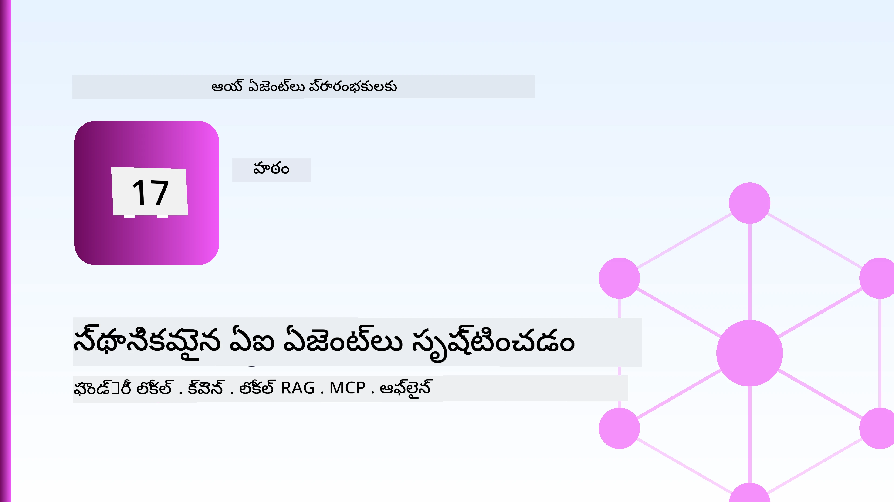
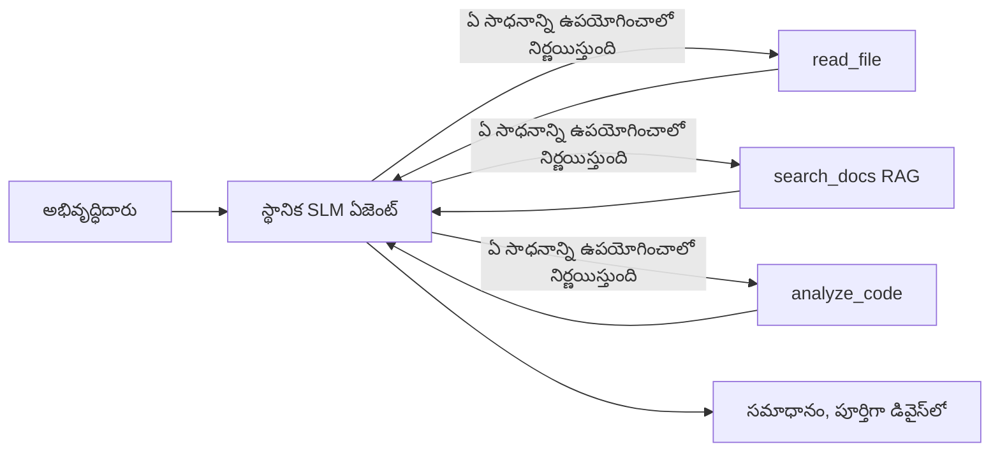
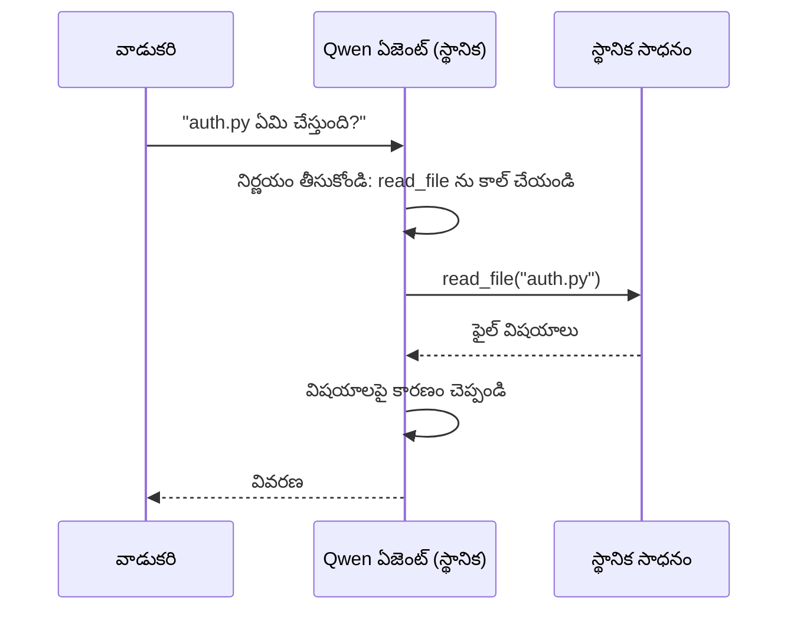
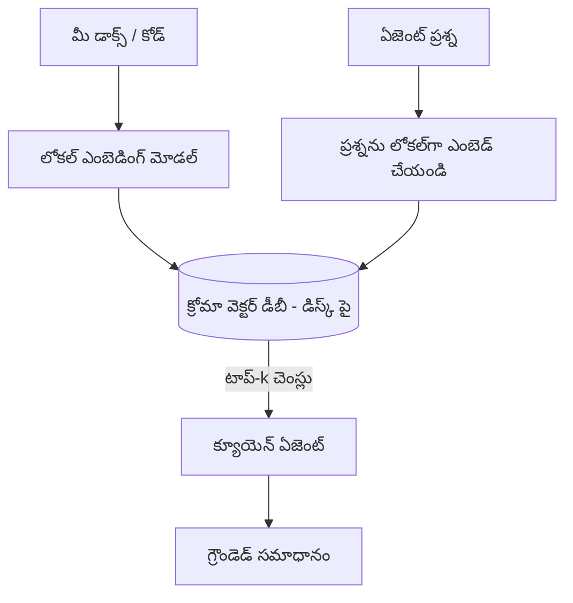
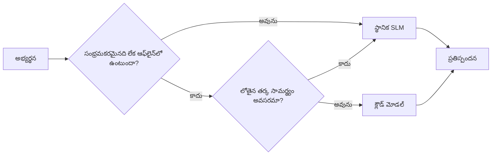

# Microsoft Foundry Local మరియు Qwen ఉపయోగించి స్థానిక AI ఏజెంట్లను సృష్టించడం



గత పాఠం ఏజెంట్లను *పెరుగుదల*తో క్లౌడ్‌లోకి తీసుకెళ్లింది. ఈ పాఠం వాటిని ఒకే యంత్రం పైన దిగువకు తీసుకువస్తుంది. చివరలో, మీరు తీసుకురావడం సురక్షితమైన, పరికరాలను పిలవగలదిగా, మీ ఫైళ్లు చదవగలిగేది, మరియు మీ డాక్యుమెంటేషన్‌ను శోధించగల ఒక పని ఇంజనీరింగ్ సహాయకుడు అందుకుంటారు — **ఒక్క క్లౌడ్ ఇన్‌ఫరెన్స్ కాల్ లేకుండా.**

మీరు ఎందుకు అలా చేయాలనుకుంటారు? నిజమైన ఇంజనీరింగ్ పనిలో తరచుగా వచ్చే మూడు కారణాలు:

- **గోప్యత.** కోడ్ మరియు డాక్యుమెంట్లు యంత్రం నుంచి ఎప్పటికీ వెళ్లవు. ఎటువంటి ప్రాంప్ట్, ఏటువంటి స్నిపెట్, ఎటువంటి కస్టమర్ డేటా నెట్‌వర్క్ సరిహద్దును దాటదు.
- **ఖర్చు.** స్థానిక ఇన్‌ఫరెన్స్ కు ప్రతి టోకెన్ బిల్ ఉండదు. మీరు మొత్తం రోజంతా విద్యుత్ ధరకే స_repeatIterations నుండి పునరుద్దరించవచ్చు.
- **ఆఫ్లైన్.** విమానంలో, భద్రతా సౌకర్యంలో, లేదా అవుటేజీ సమయంలో, ఏజెంట్ ఇంకా పనిచేస్తుంది.

సమస్య మీరు ఒక ఫ్రంట్‌యిర్ క్లౌడ్ మోడల్‌ను **స్మాల్ లాంగ్వేజ్ మోడల్ (SLM)** కోసం వ్యాపారం చేస్తున్నారని, ఇది మీ CPU, GPU, లేదా NPU పై నడుస్తుంది. ఈ పాఠం ఆ పరిమితిలో *మంచి* అయిన ఏజెంట్లను తయారు చేసే విషయంపై ఉంటుంది, పరిమితి లేడు అనుకునే కొరకు కాదు.

## పరిచయం

ఈ పాఠం కిందటివి కవర్ చేస్తుంది:

- **స్మాల్ లాంగ్వేజ్ మోడల్స్ (SLMs)** — వాటి తత్వం, ఎక్కడ వెలుగుతాయో, ఎక్కడ వెలవడంలేదో.
- **Microsoft Foundry Local** — ఒక రన్‌టైమ్, ఇది మోడల్స్‌ను ఆన్-డివైస్ డౌన్లోడ్ చేసి, సేవ్ చేస్తుంది **OpenAI అనుగుణ API** ద్వారా.
- **Qwen ఫంక్షన్-కాల్ మోడల్స్** — SLMs, అవి సాధారణంగా సాధన పిలవడం సృష్టిస్తాయి, అది స్థానిక *ఏజెంట్లు* (కేవలం స్థానిక చాట్ కాదు) సాధ్యంకల్పిస్తుంది.
- **స్థానిక టూల్స్, స్థానిక RAG, మరియు స్థానిక MCP** — ఏజెంట్‌కు క్లౌడ్ లేకుండా సామర్థ్యం ఇవ్వడం.
- **హైబ్రిడ్ ప్యాటర్న్లు** — ఏ సమయాల్లో విషయాలు స్థానికంగా ఉంచాలో, ఏ సమయాల్లో క్లౌడ్‌ను చేరుకోవాలో.

## అభ్యాస లక్ష్యాలు

ఈ పాఠాన్ని పూర్తి చేసిన తరువాత, మీరు:

- SLMs యొక్క ట్రేడ్-ఆఫ్స్ వివరించగలరు మరియు సరైన స్థానిక ఏజెంట్ వినియోగ దృశ్యాలను ఎంచుకోగలరు.
- Foundry Localతో Qwen మోడల్‌ను స్థానికంగా సర్వ్ చేయగలరు మరియు OpenAI అనుగుణమైన ఎండ్పాయింట్ ద్వారా కనెక్ట్ కావచ్చు.
- ఒక పరికరం పిలిచే ఏజెంట్‌ను నిర్మించగలరు, ఇది పూర్తిగా మీ వర్క్‌స్టేషన్‌పై నడుస్తుంది.
- స్థానిక వెక్టర్ డేటాబేస్ (Chroma) ఉపయోగించి మీ డాక్యుమెంట్లపై స్థానిక RAG జోడించగలరు.
- ఏజెంట్‌ను స్థానిక MCP సర్వర్‌కు కనెక్ట్ చేసి, హైబ్రిడ్ స్థానిక/క్లౌడ్ డిజైన్ల గురించి తర్కం చెయ్యగలరు.

## ప్రాథమిక అవసరాలు

ఈ పాఠం ముందు పాఠాల్ని పూర్తిగా చదివారని, మరియు ఈ విషయాల్లో సౌకర్యంగా ఉన్నారని అనుకుంటుంది:

- [టూల్ ఉపయోగం](../04-tool-use/README.md) (పాఠం 4) మరియు [ఏజెనిక్ RAG](../05-agentic-rag/README.md) (పాఠం 5).
- [ఏజెనిక్ ప్రోటోకాల్ / MCP](../11-agentic-protocols/README.md) (పాఠం 11).
- [Microsoft Agent ఫ్రేమ్‌వర్క్](../14-microsoft-agent-framework/README.md) (పాఠం 14).

మీరు కిందివి కూడా అవసరం:

- అభివృద్ధి వర్క్‌స్టేషన్. **8 GB RAM సాధ్యమైన కనిష్ఠం**; 16 GB+ సౌకర్యంగా ఉంటుంది. GPU లేదా NPU సహాయం చేస్తుంది కానీ కట్టుబాటు కాదు.
- **Microsoft Foundry Local** ఇన్‌స్టాల్ చేయబడింది (కింద ఇచ్చిన సెటప్ సెక్షన్ చూడండి).
- Python 3.12+ మరియు రిపోజిటరీలో ఉన్న ప్యాకేజీలు [`requirements.txt`](../../../requirements.txt), మరియు `foundry-local-sdk`, `openai`, మరియు `chromadb` ఈ పాఠానికి.

## చిన్న భాషా నమూనాలు: స్థానిక పనికి సరైన టూల్

ఒక ఫ్రంట్‌యిర్ క్లౌడ్ మోడల్ నియమించుకునే ప్యారామీటర్ల సంఖ్య నూర్ల కోట్లలో ఉంటుంది మరియు డేటా సెంటర్ వద్ద ఉంటుంది. ఒక SLM కేంద్రంగా కొన్ని బిలియన్ ప్యారామీటర్లు కలిగి ఉంటుంది మరియు మీ లాప్‌టాప్ RAMలో సరిపోతుంది. ఆ తేడా స్పష్టమైన అంచనాలను సెట్ చేస్తుంది.

**SLMs బాగా చేస్తాయి:**

- నిర్మిత, పరిమిత పనులు — క్లాసిఫికేషన్, వెలికితీయడం, తెలిసిన డాక్యుమెంట్ యొక్క సారాంశం.
- **టూల్ కాల్స్** — ఏ ఫంక్షన్ పిలవాలో మరియు ఏ ఆర్గ్యుమెంట్లతో పిలవాలన్న దానిపై నిర్ణయం.
- మీ స్వంత డేటా మీద వేగవంతమైన, చౌకైన, ప్రైవేట్ పునరావృతం.

**SLMs బలహీనతలు:**

- తెరవెనుక-సంబంధిత, విస్తృత కాంటెక్స్ట్ మీద బహుళ దశ‌ల తర్కం.
- విస్తారమైన ప్రపంచ జ్ఞానం (కనికరం తక్కువగా చూసారు, మరచిపోడం ఎక్కువ).

కాబట్టి స్థానిక ఏజెంట్లకు విజయదాయక వ్యూహం ఉంది: **SLM ఆర్కెస్ట్రేట్ చేయనివ్వండి, మరియు టూలులు భారమైన పనులు చేయనివ్వండి.** మోడల్ మీ కోడ్‌బేస్ *తెలుసుకోవాల్సిన అవసరం లేదు* — అది `read_file` మరియు `search_docs` ఎప్పుడు పిలవాలో తెలిసినప్పుడు సరిపోతుంది. అది SLM బలాలకు నేరుగా సరిపోతుంది.



## Microsoft Foundry Local

**Microsoft Foundry Local** అనేది తేలికైన రన్‌టైమ్, ఇది మీ యంత్రం మీద పూర్తిగా మోడల్స్‌ను డౌన్లోడ్ చేసి నడిపిస్తుంది, నిర్వహిస్తుంది మరియు సేవ్ చేస్తుంది. మా కోసం ముఖ్యమైన ఫీచర్ ఇది ఒక **OpenAI అనుగుణ HTTP ఎండ్పాయింట్**ని అందించడం — అంటే OpenAI SDK మరియు Microsoft Agent Frameworkకి సంబంధించిన OpenAI క్లయింట్ కేవలం `base_url` మార్చడం ద్వారా దీనికి పని చేస్తుంది. ఏజెంట్లను నిర్మించడం గురించి మీరు నేర్చుకున్న ప్రతీది నేరుగా బదిలీ అవుతుంది; క్లౌడ్ నుంచి `localhost`కి మాత్రమే ఎండ్పాయింట్ మారుతుంది.

Foundry Local మీ హార్డ్‌వేర్‌కు తగిన మోడల్ బిల్డ్‌ను ఆటోమేటిక్‌గా ఎంచుకుంటుంది — CPU బిల్డ్, CUDA/GPU బిల్డ్ లేదా NPU బిల్డ్ — కాబట్టి మీరు ప్రతి యంత్రం కోసం మెరుగుపర్చాల్సిన అవసరం ఉండదు.

### సెటప్

Foundry Local ఇన్‌స్టాల్ చేయండి (మీ OS కోసం [డాక్యుమెంటేషన్](https://learn.microsoft.com/azure/ai-foundry/foundry-local/)ను చూడండి), తర్వాత అది పని చేస్తున్నదో లేదో ధృవీకరించండి:

```bash
# ఇన్‌స్టాల్ చేయండి (ఉదాహరణ; మీ వేదికకు సంబంధించిన డాక్యుమెంట్లను అనుసరించండి)
winget install Microsoft.FoundryLocal      # విండోస్
# brew install microsoft/foundrylocal/foundrylocal   # macOS

# Qwen మోడల్ డౌన్లోడ్ చేసి నిర్వర్తించండి, తరువాత స్థానిక సేవ ప్రారంభించండి
foundry model run qwen2.5-7b-instruct
foundry service status
```

సర్వీస్ రన్ అవ్వగానే మీకు స్థానిక, OpenAI అనుగుణ ఎండ్పాయింట్ ఉంటుంది (సాధారణంగా `http://localhost:PORT/v1`). నోట్‌బుక్ `foundry-local-sdk` ఉపయోగించి ఎండ్పాయింట్‌ను ఆటోమేటిక్‌గా కనుగొంటుంది, కాబట్టి మీరు పోర్ట్‌ను హార్డ్‌కోడ్ చేయాల్సిన అవసరం లేదు.

## Qwen ఫంక్షన్ కాల్: ఇది ఎందుకు ముఖ్యం

ఏజెంట్ అంటే అది టూల్స్‌ని పిలవగలగాలి. చాలా SLMs మాట్లాడగలుగుతాయి కానీ అవి నమ్మదగిన పద్ధతిలో, సరిగా రూపొందించని టూల్ కాల్స్‌ను ఉత్పత్తి చేస్తాయ్. **Qwen** మోడల్స్ ఫంక్షన్ కాల్ కోసం శిక్షణ పొందినవి మరియు స్థిరంగా మంచి రూపంలో టూల్-కాల్ నిర్మాణాన్ని ఉత్పత్తి చేస్తాయి — ఇది స్థానిక చాట్ మోడల్‌ను స్థానిక *ఏజెంట్*గా మార్చే కారణం.

ఈ ప్రవాహం మీరు ఇప్పటికే తెలిసిన సాధారణ టూల్-కాల్ లూప్, కేవలం ఆన్-డివైస్ నడుస్తోంది:



## స్థానిక RAG

డాక్యుమెంటేషన్ శోధనలోనే స్థానిక ఏజెంట్లకు అత్యంత విలువ. SLM మీ ఫ్రేమ్‌వర్క్ డాక్యుమెంట్స్‌ను మేమోరైజ్ చేశాడని ఆశించే బదులు, మీరు ఆ డాక్యుమెంట్లను **స్థానిక వెక్టర్ డేటాబేస్**లో ఎంబెడ్ చేస్తారు మరియు ఏజెంట్ అవసరానికి అనుగుణంగా సంబంధిత భాగాలను పొందేందుకు అనుమతిస్తారు.

మేము **Chroma** ఉపయోగించాము, ఇది సర్వర్ నుంచి మేనేజ్ చేయాల్సినంత పెద్దది కాని లో-ప్రాసెస్ లో నడిచే ఎంబెడెడ్ వెక్టర్ స్టోర్. ప_pipeline పూర్తిగా స్థానికం: స్థానిక ఎంబెడ్డింగ్ మోడల్ → స్థానిక వెక్టర్లు → స్థానిక రిట్రీవల్ → స్థానిక SLM.



ఇది పాఠం 5లోని అదే Agentic RAG ప్యాటర్న్ — ఒక్క మార్పు ప్రతి భాగం మీ యంత్రంలో నడుస్తున్నదనే విషయం.

## స్థానిక MCP సర్వర్లు

[MCP](../11-agentic-protocols/README.md) అనేది ట్రాన్స్పోర్ట్, క్లౌడ్ సేవ కాదు. MCP సర్వర్ స్థానిక ప్రాసెస్‌గా `stdio`పైన నడుస్తూ స్టాండర్డ్ ప్రోటోకాల్ ద్వారా టూల్స్‌కు యాక్సెస్ అందిస్తుంది. దీని ద్వారా మీరు MCP సర్వర్ల పెరుగుతున్న ఎకోసిస్టమ్‌ను — ఫైల్సిస్టం యాక్సెస్, గిట్ ఆపరేషన్స్, డేటాబేస్ క్వెరీస్ — పూర్తిగా ఆఫ్లైన్‌గా మళ్లీ ఉపయోగించుకోవచ్చు.

భద్రతా విధానం క్లౌడ్‌టి వేరు అయినా గానీ గాయపడలేదు: స్థానిక MCP సర్వర్ ఇంకా మీ యూజర్ అనుమతులతో నడుస్తుంది, కాబట్టి దాని పరిధి ఏమిటో (ఒక ప్రాజెక్టు డైరెక్టరీ, మీ మొత్తం హోమ్ ఫోల్డర్ కాదు) నియంత్రించండి మరియు దాని అవుట్‌పుట్‌లను ప్రవేశాలు గా పరిగణించి వాటిని ధ్రువీకరించండి.

## హైబ్రిడ్ క్లౌడ్-మరియు-స్థానిక ప్యాటర్న్లు

స్థానిక-మొదట అనేది స్థానిక-కేవలం కాదు. పెరుగుదల పొందిన సిస్టమ్లు సున్నితత్వం మరియు కష్టత అంతరాల వలన రూట్ చేస్తాయి:

| పరిస్థితి | ఎక్కడ నడుస్తుంది |
| --- | --- |
| సున్నితమైన కోడ్ / డేటా, లేదా ఆఫ్లైన్ | **స్థానిక SLM** |
| సరళమైన, పరిమిత పని | **స్థానిక SLM** (చావకం, వేగవంతం) |
| కఠిన బహుళ దశల తర్కం సున్నితత్వం లేని డేట పై | **క్లౌడ్ మోడల్** |
| ప్రతీది, అవుటేజీ సమయంలో | **స్థానిక SLM** (సౌమ్య తగ్గింపు) |

ఇది పాఠం 16 నుండి **మోడల్ రూటింగ్** భావనకు సరిపోతుంది — కేవలం ఒక్క "మోడల్" ఇప్పుడు మీ స్వంత యంత్రం. ఒక బలమైన డిజైన్ క్లౌడ్ అందుబాటులో లేని సమయంలో స్థానికంగా వెనుకకు వెళ్లాలి, కాబట్టి ఏజెంట్ నాణ్యత తగ్గుతుంది కానీ పూర్తిగా విఫలమవదు.



## ప్రయోగాత్మక ప్రయోగశాల: ఒక స్థానిక ఇంజనీరింగ్ సహాయకుడు

[`code_samples/17-local-agent-foundry-local.ipynb`](./code_samples/17-local-agent-foundry-local.ipynb) ఓపెన్ చేసి దానిని పూర్తి చేయండి. మీరు ఒక **స్థానిక ఇంజనీరింగ్ సహాయకుడు** ను నిర్మించబోతున్నారు ఇది పూర్తిగా మీ వర్క్‌స్టేషన్‌పై నడుస్తుంది మరియు ఇది చేయగలదు:

1. **టూల్స్‌ను పిలవడం** — Foundry Local ద్వారా Qwen ఫంక్షన్ కాలింగ్ ద్వారా.
2. **స్థానిక ఫైల్ ఆపరేషన్లు చేయడం** — ప్రాజెక్టు డైరెక్టరీలో ఫైల్‌లను జాబితా చేసి చదవగలగడం.
3. **కోడ్ విశ్లేషణ చేయడం** — మూల ఫైల్ పై ప్రాథమిక కొలతలను నివేదించడం.
4. **డాక్యుమెంటేషన్ శోధన** — Chroma తో డాక్స్ ఫోల్డర్ పై స్థానిక RAG.
5. **MCP వినియోగం** — స్థానిక MCP సర్వర్‌కు కనెక్ట్ అవ్వడం (ఏది కాన్ఫిగర్ లేనందున సౌమ్యంగా మినహాయింపు).

ఏదైనా సమయంలో క్లౌడ్ ఇన్‌ఫరెన్స్ ఉపయోగించలేదు.

### వాక్‌థ్రూ

సహాయకుడు Foundry Localకి OpenAI అనుగుణ ఎండ్పాయింట్ ద్వారా కనెక్ట్ అవుతుంది, కాబట్టి ఏజెంట్ కోడ్ క్లౌడ్ పాఠాలతో చాలా దగ్గరగా ఉంటుంది — కేవలం క్లయింట్ మాత్రమే మారుతుంది:

```python
from foundry_local import FoundryLocalManager
from openai import OpenAI

# Foundry Local మోడెల్ను కనుగొని/డౌన్లోడ్ చేసి మాకు ఒక స్థానిక ఎండ్పాయింట్ ను ఇస్తుంది.
manager = FoundryLocalManager(\"qwen2.5-7b-instruct\")
client = OpenAI(base_url=manager.endpoint, api_key=manager.api_key)  # api_key ఒక స్థానిక ప్లేస్‌హోల్డర్.
```

టూల్స్ ఒక ప్రాజెక్టు డైరెక్టరీకి పరిమిత Python సాధారణ ఫంక్షన్లు:

```python
def read_file(path: str) -> str:
    \"\"\"Read a file, but only inside the sandboxed project directory.\"\"\"
    full = (PROJECT_ROOT / path).resolve()
    if PROJECT_ROOT not in full.parents and full != PROJECT_ROOT:
        return \"Access denied: path is outside the project directory.\"
    return full.read_text(encoding=\"utf-8\")
```

సాండ్‌బాక్స్ తనిఖీ గమనించండి — స్థానికం అయినా సరే, యాదృచ్ఛిక మార్గాలను చదివే టూల్ బాధ్యతగలది. నోట్‌బుక్ ప్రతి టూల్‌ను ఒకే ప్రాజెక్టు రూట్‌కు పరిమితం చేస్తుంది.

## జ్ఞాన పరీక్ష

అసైన్‌మెంట్‌కు వెళ్లే ముందు మీ అర్థం చేసుకున్నదిని పరీక్షించుకోండి.

**1. ఏజెంట్‌ను క్లౌడ్‌లో కాకుండా స్థానికంగా నడిపేటప్పుడు రెండు స్పష్టమైన కారణాలు చెప్పండి.**

<details>
<summary>ఉత్తరం</summary>

ఏ రెండు: **గోప్యత** (కోడ్ మరియు డేటా యంత్రం నుంచి ఎప్పటికీ బయటకు వెళ్లవు), **ఖర్చు** (ప్రతి టోకెన్ ఇన్ఫెరెన్స్ బిల్ లేదు), మరియు **ఆఫ్లైన్ సామర్థ్యం** (నెట్‌వర్క్ లేకుండా పని చేస్తుంది—విమానంలో, భద్రతా సౌకర్యంలో, లేదా అవుటేజీ సమయంలో). నియంత్రణ/అనుగుణ్యత పరిమితులు డేటాను డివైస్ నుండి పంపేందుకు నిషిద్ధం చేస్తాయనేది గోప్యత కారణానికి సాధారణ కారకంగా ఉంటుంది.
</details>

**2. స్థానిక ఏజెంట్‌లో SLM మరియు దాని టూల్స్ మధ్య పని విభజన ఏమిటి, మరియు ఎందుకు?**

<details>
<summary>ఉత్తరం</summary>

SLMకు **ఆర్కెస్ట్రేట్** చేయనివ్వండి (ఏ టూల్ పిలవాలో, ఏ ఆర్గ్యుమెంట్లతో పిలవాలో నిర్ణయించండి) మరియు **టూల్స్ భారమైన పని చేయనివ్వండి** (ఫైళ్ళను చదవడం, డాక్స్ తీసుకోవడం, ఫలితాలను గణించడం). SLMలు పరిమిత నిర్ణయాల్లో బలవంతమైనవే కానీ విస్తృత జ్ఞానంలో మరియు పొడవైన బహుళ దశల తర్కంలో బలహీనమై ఉంటాయి, కాబట్టి టూల్స్ పైన ఆధారపడటం వాటి బలాలకు సరిపోతుంది.
</details>

**3. Foundry Local తో క్లౌడ్ ఏజెంట్ కోడ్‌ను పునః ఉపయోగించడం సాధ్యమనేదానికి కారణం ఏమిటి?**

<details>
<summary>ఉత్తరం</summary>

Foundry Local ఒక **OpenAI అనుగుణ HTTP ఎండ్పాయింట్** అందిస్తుంది. OpenAI SDK మరియు Agent Framework యొక్క OpenAI క్లయింట్ కేవలం `base_url` (మరియు స్థానిక ప్లేస్‌హోల్డర్ API కీ ఉపయోగిస్తూ) మార్చడం ద్వారా దీనిపై పని చేస్తాయి. ఏజెంట్ కోడ్ గురించి మిగిలేది సమానంగా ఉంటుంది.
</details>

**4. ఏదైనా SLM కాకుండా Qwen ఫంక్షన్-కాల్ మోడల్‌ను ప్రత్యేకంగా ఎందుకు ఉపయోగిస్తాము?**

<details>
<summary>ఉత్తరం</summary>

ఏజెంట్ నమ్మదగిన, బాగా రూపొందించిన **టూల్ కాల్స్** ఉత్పత్తి చేయాలి. చాలా SLMs చాట్ చేయగలవు, కానీ తప్పు గాని అసమానమైన టూల్-కాల్ నిర్మాణాలు విడుదల చేస్తాయి. Qwen మోడల్స్ ఫంక్షన్ కాలింగ్ కొరకు శిక్షణ పొందినవి మరియు స్థిరమైన టూల్ కాల్స్ సృష్టిస్తాయి, ఇది స్థానిక చాట్ మోడల్‌ను పనిచేసే స్థానిక ఏజెంట్‌గా మార్చడం.
</details>

**5. స్థానిక RAG పైప్‌లైన్‌లో యంత్రం మీద ఏ భాగాలు నడుస్తాయి?**

<details>
<summary>ఉత్తరం</summary>

అన్ని భాగాలు: ఎంబెడ్డింగ్ మోడల్, వెక్టర్ డేటాబేస్ (Chroma, డిస్క్ పై), రిట్రీవల్ దశ, మరియు SLM. డాక్యుమెంట్లు స్థానికంగా ఎంబెడ్ చేయబడతాయి, స్థానికంగా నిల్వ చేయబడతాయి, స్థానికంగా తీసుకువచ్చుతాయి, మరియు స్థానిక మోడల్ ద్వారా తర్కం చేయబడతాయి — ఏ భాగం క్లౌడ్‌ను తాకదు.
</details>

**6. ఒక స్థానిక MCP సర్వర్ మీ యంత్రం మీద నడుస్తోంది. అది ఆటోమేటిక్‌గా సురక్షితం కాదా? మీరు ఇంకా ఏ జాగ్రత్త తీసుకోవాలి?**

<details>
<summary>ఉత్తరం</summary>

కాదు. ఒక స్థానిక MCP సర్వర్ మీ యూజర్ అనుమతులతో నడుస్తుంది, కాబట్టి అది మీ చేయగల ఏదన్నింటినీ తగలగలదు. దాన్ని అవసరమైనదిగా పరిమితం చేయండి (ఉదాహరణకు, ఒకే ప్రాజెక్టు డైరెక్టరీ, మీ మొత్తం హోమ్ ఫోల్డర్ కాదు) మరియు దాని అవుట్‌పుట్‌లను ప్రవేశాలుగా పరిగణించి వాటిని ధృవీకరించండి.
</details>

**7. స్థానిక మోడల్‌ను కలిగి ఉండే సున్నితమైన హైబ్రిడ్ రూటింగ్ నియమాన్ని వివరించండి.**

<details>
<summary>ఉత్తరం</summary>

సున్నితమైన లేదా ఆఫ్లైన్ అభ్యర్థనలను స్థానిక SLMకి పంపండి; సరళమైన పరిమిత పనులను వేగం మరియు ఖర్చు దృష్ట్యా స్థానిక SLMకి పంపండి; కఠిన బహుళ దశల తర్కాన్ని సున్నితత్వం లేని డేటా మీద క్లౌడ్ మోడల్‌కు పంపండి; క్లౌడ్ అందుబాటులో లేకపోతే స్థానిక SLMకి తిరిగి వెళ్లండి తద్వారా ఏజెంట్ నాణ్యత సౌమ్యంగా తగ్గుతుంది, పూర్తిగా విఫలమవదు. ఇది పాఠం 16 లోని మోడల్ రూటింగ్, స్థానిక యంత్రం ఒక మోడల్‌లలో ఒకటి.
</details>

**8. ఈ పాఠంలో స్థానిక ఏజెంట్ నడపడానికి వాస్తవిక కనిష్ఠ RAM గణాంకం ఏమిటి, ఇంకా ఎక్కువ RAM అంటే ఏమిటి?**

<details>
<summary>ఉత్తరం</summary>

సుమారు **8 GB** వాస్తవిక కనిష్ఠం; 16 GB+ సౌకర్యంగా ఉంటుంది. ఎక్కువ RAM మీకు పెద్ద, వినియోగదార్ని సామర్థ్యమైన మోడల్స్ ని నడిపేందుకు మరియు మెమొరీలో ఎక్కువ కాంటెక్స్ట్ ఉంచేందుకు సహాయంగా ఉంటుంది. GPU లేదా NPU ఇన్ఫెరెన్స్ వేగం పెంచుతాయి కానీ అవసరం కాదు — Foundry Local ఎవరైతే ఆక్సలరేటర్ అందుబాటులో లేకపోతే CPU బిల్డ్ ఎంచుకుంటుంది.
</details>

## అసైన్‌మెంట్

స్థానిక ఇంజినీరింగ్ సహాయకుని విస్తరించి మీరు ఎన్నుకున్న ఒక చిన్న ప్రాజెక్టు కోసం **స్థానిక డాక్యుమెంటేషన్ సమీక్షకుడిగా** మార్చండి (ఈ రిపోలో ఉన్న పాఠం ఫోల్డర్లలో ఒకదాన్ని ఉపయోగించవచ్చు).

మీ సమర్పణ కిందివి ఉండాలి:

1. కనీసం ఐదు ఫైళ్లతో కూడిన నేరమైన డాక్స్/కోడ్ ఫోల్డర్ ని Chroma లో సూచిక చేయండి.
2. ప్రాజెక్ట్ లో `TODO`/`FIXME` వ్యాఖ్యలను స్కాన్ చేసి వాటిని ఫైల్ మరియు లైన్ నెంబర్‌తో తిరిగి ఇచ్చే ఒక `find_todos` సాధనం జోడించండి — `read_file`లాంటి అదే సాండ్‌బాక్స్ తనిఖీతో.

3. ఏజెంట్‌ను మూడు ప్రశ్నలు అడగండి, ఇవి టూల్స్‌ను కలిపేందుకు అనివార్యమైనవి: ఒక ప్యూర్ RAG ప్రశ్న, ఒకొక్క ప్రత్యేక ఫైల్ చదవడానికి అవసరమైనది, మరియు మరొకటిది TODOలను కనుగొనడానికి అవసరమైనది.
4. దాన్ని కొలవండి: మూడు భిన్నమైన ప్రతిస్పందనల వ్యవధిని కాలం పట్టి ఒక మార్క్డౌన్ సెల్‌లో గమనించండి. మీ ఉద్దేశించిన పని ప్రవాహానికి ఆలస్యము అనుకూలమో కాదో వ్యాఖ్యానించండి.

తరువాత ఈ సమీక్షకుని కోసం మీరు **ఏది క్లౌడ్‌కు మార్చుకుంటారు మరియు ఏది స్థానికంగా ఉంచుకుంటారు** అన్న దానిపై చిన్న పేరాగ్రాఫ్ వ్రాయండి, ఎందుకు అనేది చేర్చండి. స్థానిక భాగాలు సరిగ్గా కలుపబడ్డాయా మరియు మీ హైబ్రిడ్ రీజనింగ్ సరైనదా అనేదానిపై మిమ్మల్ని విలువనిచ్చారు — మోడల్ నాణ్యతపై కాదు.

## సారాంశం

ఈ పాఠంలో మీరు మీ స్వంత యంత్రంపై పూర్తిగా నడిచే ఏజెంట్‌ను నిర్మించారు:

- **SLMs** గోప్యత, ఖర్చు మరియు ఆఫ్‌లైన్ ఆపరేషన్ కోసం విస్తృతిని బదులు ఇవ్వడం — మరియు టూల్లను **సమన్వయం చేయడం** విషయంలో మెరుగ్గా పనిచేస్తాయి వాడి ఆధిక్యం ఉంచకుండా.
- **Foundry Local** ఒక **OpenAI- అనుకూల ఎండ్పాయింట్** వెనుక డివైస్‌పై మోడళ్లను సేవ చేస్తుంది, కాబట్టి మీ క్లౌడ్ ఏజెంట్ కోడ్ ఒక లైన్ మార్పుతో బదిలీ అవుతుంది.
- **Qwen ఫంక్షన్ కాలింగ్ మోడల్స్** నమ్మకమైన స్థానిక టూల్ కాలింగ్ — మరియు అందువల్ల స్థానిక *ఏజెంట్లు* — సాధ్యమవుతాయి.
- **స్థానిక RAG** (Chroma) మరియు **స్థానిక MCP** యంత్రం విడిచిపెట్టకుండా ఏజెంట్ కి సామర్థ్యాన్ని ఇస్తాయి.
- **హైబ్రిడ్ నమూనాలు** సున్నితత్వం మరియు కష్టం ఆధారంగా మార్గదర్శనం చేయగలవు, స్థానికదాన్ని సౌమ్యమైన ప్రత్యామ్నాయంగా ఉంచుతూ.

ఇది అమలులో భాగంగా ఒక చక్రాన్ని పూర్తి చేస్తుంది: పాఠం 16 ఏజెంట్లను Microsoft Foundryలో విస్తరించింది, ఈ పాఠం వాటిని ఒకే వర్క్‌స్టేషన్‌పై తగ్గించింది. తదుపరి పాఠం అమలైన ఏజెంట్లను సురక్షితం చేయడానికే దృష్టి సారిస్తుంది.

## అదనపు వనరులు

- <a href="https://learn.microsoft.com/azure/ai-foundry/foundry-local/" target="_blank">Microsoft Foundry Local డాక్యుమెంటేషన్</a>
- <a href="https://learn.microsoft.com/azure/ai-foundry/what-is-azure-ai-foundry" target="_blank">Microsoft Foundry డాక్యుమెంటేషన్</a>
- <a href="https://aka.ms/ai-agents-beginners/agent-framework" target="_blank">Microsoft Agent Framework</a>
- <a href="https://qwen.readthedocs.io/en/latest/framework/function_call.html" target="_blank">Qwen ఫంక్షన్ కాలింగ్ డాక్యుమెంటేషన్</a>
- <a href="https://modelcontextprotocol.io/" target="_blank">మోడల్ కాంటెక్స్ట్ ప్రోటోకాల్ (MCP)</a>
- <a href="https://docs.trychroma.com/" target="_blank">Chroma వెక్టర్ డేటాబేస్</a>

## గత పాఠం

[Deploying Scalable Agents](../16-deploying-scalable-agents/README.md)

## తదుపరి పాఠం

[Securing AI Agents](../18-securing-ai-agents/README.md)

---

<!-- CO-OP TRANSLATOR DISCLAIMER START -->
**అస్వీకరణ**:
ఈ పత్రం AI అనువాద సేవ [Co-op Translator](https://github.com/Azure/co-op-translator) ఉపయోగించి అనువదించబడింది. మేము ఖచ్చితత్వానికి ప్రయత్నిస్తున్నప్పటికీ, ఆటోమేటెడ్ అనువాదాలు తప్పులు లేదా అసమగ్రతలను కలిగి ఉండవచ్చు. దాని స్వదేశ భాషలో ఉన్న అసలు పత్రాన్ని అధికారం కలిగిన మూలంగా పరిగణించాలి. కీలకమైన సమాచారం కోసం, ప్రొఫెషనల్ మానవ అనువాదాన్ని సిఫారసు చేస్తాము. ఈ అనువాదం ఉపయోగం వల్ల కలిగే ఏవైనా అపార్థాలు లేదా తప్పుదారులు కోసం మేము బాధ్యత వహించము.
<!-- CO-OP TRANSLATOR DISCLAIMER END -->